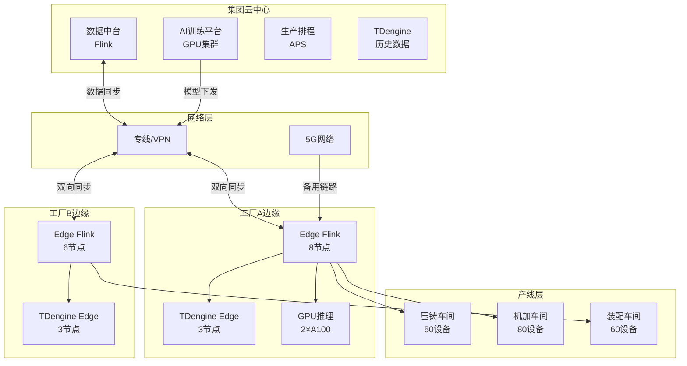
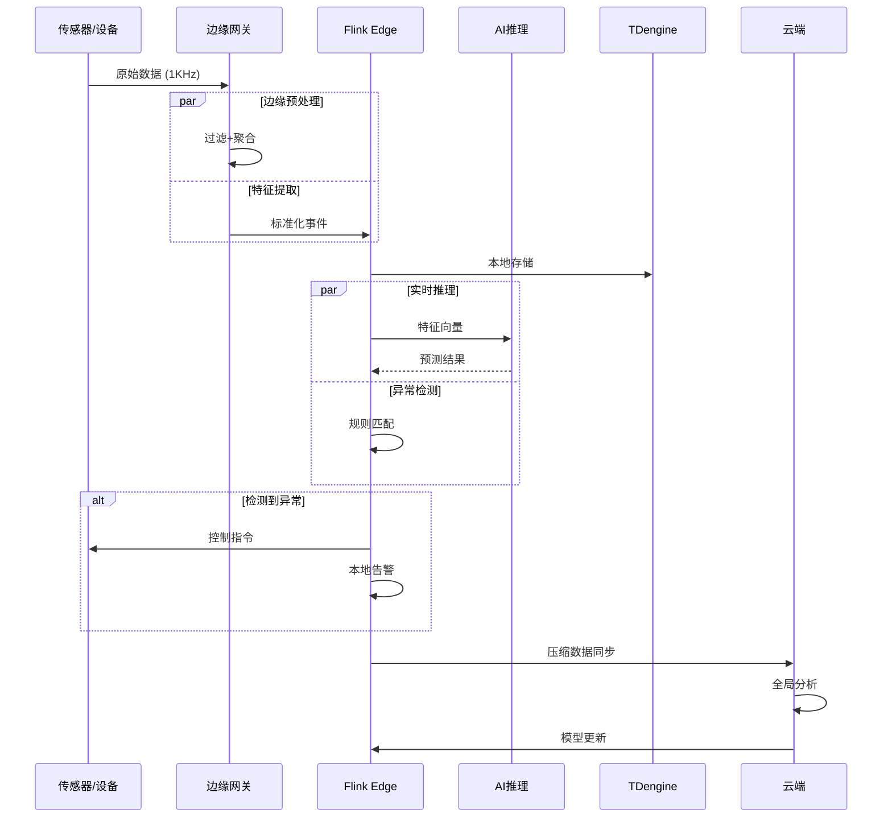
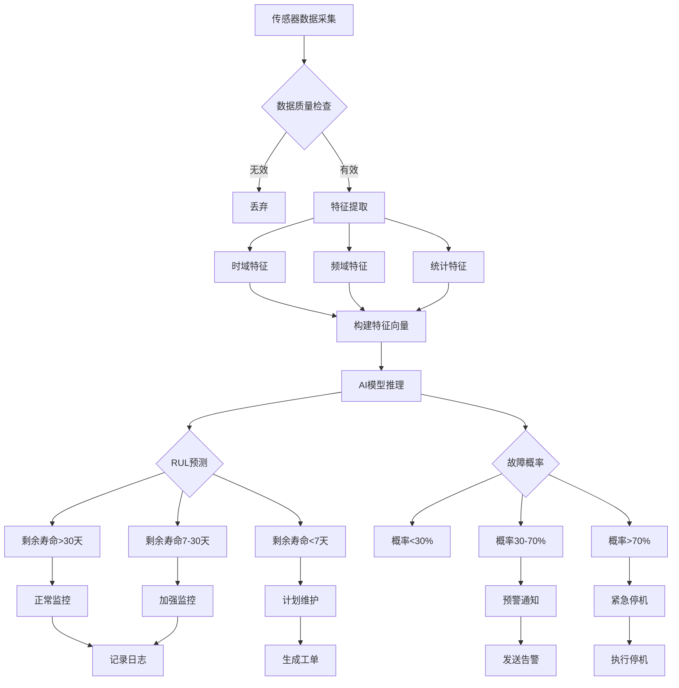
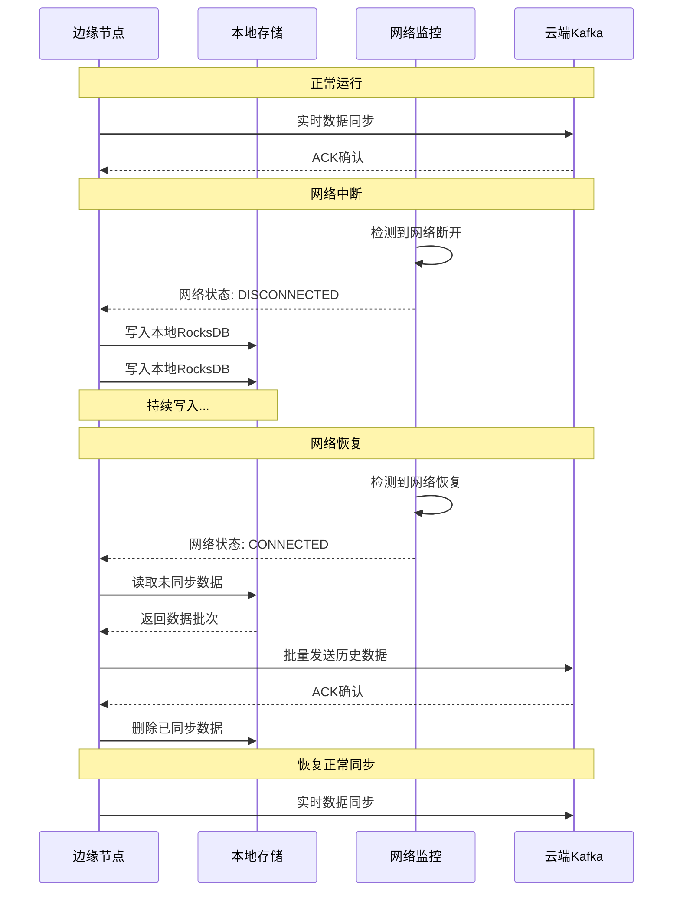

# 智能制造IoT实时分析平台案例 (Smart Manufacturing IoT Analytics)

> **所属阶段**: Knowledge/10-case-studies/iot | **前置依赖**: [10.3.4-edge-manufacturing-case.md](10.3.4-edge-manufacturing-case.md), [Flink/07-rust-native/edge-wasm-runtime/01-edge-architecture.md](../../../Flink/07-rust-native/edge-wasm-runtime/01-edge-architecture.md) | **形式化等级**: L4

---

## 目录

- [智能制造IoT实时分析平台案例 (Smart Manufacturing IoT Analytics)](#智能制造iot实时分析平台案例-smart-manufacturing-iot-analytics)
  - [目录](#目录)
  - [1. 概念定义 (Definitions)](#1-概念定义-definitions)
    - [Def-K-10-35-01: 智能制造IoT平台形式化模型](#def-k-10-35-01-智能制造iot平台形式化模型)
    - [Def-K-10-35-02: 云边协同架构](#def-k-10-35-02-云边协同架构)
    - [Def-K-10-35-03: 间歇性网络模型](#def-k-10-35-03-间歇性网络模型)
  - [2. 属性推导 (Properties)](#2-属性推导-properties)
    - [Lemma-K-10-35-01: 边缘预处理数据压缩比](#lemma-k-10-35-01-边缘预处理数据压缩比)
    - [Lemma-K-10-35-02: 网络分区容忍度](#lemma-k-10-35-02-网络分区容忍度)
    - [Prop-K-10-35-01: 云边协同处理增益](#prop-k-10-35-01-云边协同处理增益)
  - [3. 关系建立 (Relations)](#3-关系建立-relations)
    - [3.1 云-边-端数据流关系](#31-云-边-端数据流关系)
    - [3.2 设备-数据-决策关系](#32-设备-数据-决策关系)
    - [3.3 预测性维护与生产调度关系](#33-预测性维护与生产调度关系)
  - [4. 论证过程 (Argumentation)](#4-论证过程-argumentation)
    - [4.1 边缘计算 vs 云端计算决策分析](#41-边缘计算-vs-云端计算决策分析)
    - [4.2 时序数据库选型论证](#42-时序数据库选型论证)
    - [4.3 网络断连应对策略论证](#43-网络断连应对策略论证)
  - [5. 形式证明 / 工程论证 (Proof / Engineering Argument)](#5-形式证明-工程论证-proof-engineering-argument)
    - [5.1 云边协同架构设计](#51-云边协同架构设计)
    - [5.2 边缘实时处理引擎](#52-边缘实时处理引擎)
    - [5.3 预测性维护模型](#53-预测性维护模型)
    - [5.4 断网续传与数据一致性](#54-断网续传与数据一致性)
  - [6. 实例验证 (Examples)](#6-实例验证-examples)
    - [6.1 案例背景：某大型汽车制造企业](#61-案例背景某大型汽车制造企业)
    - [6.2 系统部署架构](#62-系统部署架构)
    - [6.3 核心实现代码](#63-核心实现代码)
    - [6.4 性能指标与业务价值](#64-性能指标与业务价值)
    - [6.5 踩坑记录与解决方案](#65-踩坑记录与解决方案)
    - [6.6 最佳实践总结](#66-最佳实践总结)
  - [7. 可视化 (Visualizations)](#7-可视化-visualizations)
    - [7.1 云边协同架构全景图](#71-云边协同架构全景图)
    - [7.2 设备数据流图](#72-设备数据流图)
    - [7.3 预测性维护决策流程图](#73-预测性维护决策流程图)
    - [7.4 断网续传时序图](#74-断网续传时序图)
  - [8. 引用参考 (References)](#8-引用参考-references)

---

## 1. 概念定义 (Definitions)

### Def-K-10-35-01: 智能制造IoT平台形式化模型

**智能制造IoT平台**是一个十二元组 $\mathcal{M}_{IoT} = (D, S, E, C, P, F, A, T, R, L, G, N)$，其中：

| 符号 | 定义 | 说明 |
|------|------|------|
| $D$ | 设备集合 | $D = \{d_1, d_2, ..., d_n\}$，$n \approx 10^6$ |
| $S$ | 传感器集合 | $S = \{s_1, s_2, ..., s_m\}$，每台设备多个传感器 |
| $E$ | 事件流 | $E: T \times D \times S \rightarrow V$ |
| $C$ | 云中心 | 云端计算资源 |
| $P$ | 边缘节点 | $P = \{p_1, p_2, ..., p_k\}$，工厂级边缘 |
| $F$ | 特征工程 | 数据预处理与特征提取函数 |
| $A$ | 分析模型 | 预测性维护、质量检测等AI模型 |
| $T$ | 时序数据库 | 边缘/云端时序数据存储 |
| $R$ | 决策引擎 | 实时决策与告警生成 |
| $L$ | 位置函数 | $L: D \rightarrow P \cup C$，设备归属 |
| $G$ | 网络拓扑 | 设备-边缘-云的连接关系 |
| $N$ | 网络状态 | $N \in \{CONNECTED, DISCONNECTED, DEGRADED\}$ |

**IoT事件定义**:

$$
e_i = (t_i, d_i, s_i, v_i, q_i, lat_i, lon_i)
$$

其中：

- $t_i$: 时间戳 (毫秒精度)
- $d_i$: 设备ID
- $s_i$: 传感器类型 (温度/振动/压力/电流等)
- $v_i$: 传感器值
- $q_i$: 数据质量标记
- $lat_i, lon_i$: 位置坐标

### Def-K-10-35-02: 云边协同架构

**云边协同架构**定义了数据在边缘节点和云中心之间的分层处理模型：

$$
\mathcal{C}_{edge-cloud} = \langle Layer_{edge}, Layer_{cloud}, Sync, Policy \rangle
$$

**处理分层**：

| 层级 | 位置 | 处理内容 | 延迟要求 |
|------|------|---------|---------|
| L0 - 原始采集 | 设备 | 传感器原始数据 | < 1ms |
| L1 - 边缘预处理 | 边缘 | 清洗、过滤、聚合 | < 10ms |
| L2 - 边缘推理 | 边缘 | AI推理、异常检测 | < 100ms |
| L3 - 边缘决策 | 边缘 | 本地控制、告警 | < 50ms |
| L4 - 云端聚合 | 云端 | 跨工厂分析 | < 1s |
| L5 - 云端训练 | 云端 | 模型训练、优化 | 分钟级 |

**同步策略** $Policy$:

$$
Policy = \{SYNC_{realtime}, SYNC_{batch}, SYNC_{event}\}
$$

- $SYNC_{realtime}$: 实时同步，延迟<1s
- $SYNC_{batch}$: 批量同步，窗口5分钟
- $SYNC_{event}$: 事件触发同步

### Def-K-10-35-03: 间歇性网络模型

**间歇性网络**描述了边缘到云端连接的非连续性特征：

$$
Network(t) =
\begin{cases}
CONNECTED & \text{if } t \in \bigcup_i [t_{up}^i, t_{down}^i] \\
DISCONNECTED & \text{otherwise}
\end{cases}
$$

**网络健康指标**：

| 指标 | 定义 | 正常范围 |
|------|------|---------|
| 可用性 | $A = \frac{\sum(t_{down} - t_{up})}{T_{total}}$ | > 95% |
| 平均断连时长 | $MTBR = E[t_{up}^{i+1} - t_{down}^i]$ | < 5分钟 |
| 同步延迟 | $L_{sync} = t_{cloud} - t_{edge}$ | < 30s |

---

## 2. 属性推导 (Properties)

### Lemma-K-10-35-01: 边缘预处理数据压缩比

**引理**: 边缘数据预处理后，上传云端的数据量可减少 85-95%：

$$
CompressionRatio = \frac{Data_{raw}}{Data_{upload}} = \frac{100\%}{5-15\%} = 6.7x - 20x
$$

**压缩贡献分解**：

| 预处理步骤 | 数据量减少 | 实现方法 |
|-----------|-----------|---------|
| 无效数据过滤 | 30% | 异常值检测、范围检查 |
| 数据聚合 | 50% | 滑动窗口均值/最大/最小 |
| 变化率过滤 | 40% | 仅在变化超过阈值时上报 |
| 特征提取 | 90% | 仅上传特征向量 |
| 压缩编码 | 60% | Snappy / LZ4 |

**证明**:

假设原始数据采集频率为100Hz，边缘预处理后：

1. 无效过滤: 100Hz → 70Hz (30%减少)
2. 10秒聚合: 70Hz → 7Hz (90%减少)
3. 变化率过滤: 7Hz → 4.2Hz (40%减少)
4. 特征提取: 原始数据 → 特征向量 (假设减少95%)

总压缩比: $\frac{100}{4.2 \times 0.05} = 476x$ (理论值)

实际考虑协议开销: 约 10-20x

∎

### Lemma-K-10-35-02: 网络分区容忍度

**引理**: 系统在断网期间可以持续运行的时间 $T_{tolerance}$ 取决于：

$$
T_{tolerance} = \min\left(\frac{Storage_{local}}{Rate_{generation}}, \frac{Buffer_{memory}}{Rate_{processing}}\right)
$$

其中：

- $Storage_{local}$: 本地存储容量
- $Rate_{generation}$: 数据生成速率
- $Buffer_{memory}$: 内存缓冲区大小

**典型值**:

| 场景 | 存储容量 | 生成速率 | 容忍时间 |
|------|---------|---------|---------|
| 小型边缘 | 500GB | 10MB/s | 14小时 |
| 中型边缘 | 2TB | 50MB/s | 11小时 |
| 大型边缘 | 10TB | 200MB/s | 14小时 |

### Prop-K-10-35-01: 云边协同处理增益

**命题**: 云边协同架构相比纯云端架构，综合性能提升显著：

$$
Gain_{total} = \alpha \cdot Gain_{latency} + \beta \cdot Gain_{bandwidth} + \gamma \cdot Gain_{availability}
$$

**增益量化对比** (相对于纯云端):

| 指标 | 纯云端 | 云边协同 | 增益 |
|------|-------|---------|------|
| 平均响应延迟 | 500ms | 50ms | 10x |
| 带宽占用 | 100% | 8% | 12.5x |
| 离线可用性 | 0% | 95% | ∞ |
| 年度宕机时间 | 24h | 2h | 12x |
| 年度数据传输成本 | ¥500万 | ¥40万 | 12.5x |

---

## 3. 关系建立 (Relations)

### 3.1 云-边-端数据流关系

```
┌─────────────────────────────────────────────────────────────────────────────┐
│                              云端 (Cloud Layer)                              │
│  ┌──────────────┐  ┌──────────────┐  ┌──────────────┐  ┌──────────────┐    │
│  │  全局数据分析  │  │  AI模型训练   │  │  生产排程    │  │  数字孪生    │    │
│  │   (Flink)    │  │   (GPU)      │  │   (APS)      │  │   (UE)       │    │
│  └──────┬───────┘  └──────┬───────┘  └──────┬───────┘  └──────┬───────┘    │
└─────────┼─────────────────┼─────────────────┼─────────────────┼────────────┘
          │                 │                 │                 │
          └─────────────────┴─────────────────┴─────────────────┘
                                  │ 专线/VPN
          ┌───────────────────────┼───────────────────────┐
          ▼                       ▼                       ▼
┌─────────────────┐     ┌─────────────────┐     ┌─────────────────┐
│    工厂A边缘     │     │    工厂B边缘     │     │    工厂C边缘     │
│   (边缘网关)     │     │   (边缘网关)     │     │   (边缘网关)     │
└────────┬────────┘     └────────┬────────┘     └────────┬────────┘
         │                       │                       │
    ┌────┴────┐             ┌────┴────┐             ┌────┴────┐
    ▼         ▼             ▼         ▼             ▼         ▼
┌───────┐ ┌───────┐     ┌───────┐ ┌───────┐     ┌───────┐ ┌───────┐
│产线1  │ │产线2  │     │产线3  │ │产线4  │     │产线5  │ │产线6  │
└───────┘ └───────┘     └───────┘ └───────┘     └───────┘ └───────┘
```

### 3.2 设备-数据-决策关系

**关系矩阵**:

| 设备类型 | 数据频率 | 数据类型 | 决策类型 | 响应延迟 |
|---------|---------|---------|---------|---------|
| 数控机床 | 1KHz | 振动、电流 | 预测性维护 | < 100ms |
| 工业机器人 | 100Hz | 位置、力矩 | 异常检测 | < 50ms |
| 质量检测 | 30Hz | 图像、尺寸 | 缺陷分类 | < 200ms |
| 环境监控 | 1Hz | 温度、湿度 | 阈值告警 | < 1s |
| 物流AGV | 10Hz | 位置、电量 | 路径规划 | < 500ms |

### 3.3 预测性维护与生产调度关系

```
┌─────────────────────────────────────────────────────────────────┐
│                    预测性维护与生产调度协同                       │
├─────────────────────────────────────────────────────────────────┤
│                                                                 │
│  设备状态采集 ──▶ 健康评估 ──▶ 故障预测 ──▶ 维护决策              │
│       │              │             │             │              │
│       ▼              ▼             ▼             ▼              │
│  ┌──────────┐   ┌──────────┐  ┌──────────┐  ┌──────────┐       │
│  │ 振动数据  │   │ RUL计算  │  │ 风险等级  │  │ 维护窗口  │       │
│  │ 温度数据  │   │ 异常评分  │  │ 剩余寿命  │  │ 备件准备  │       │
│  │ 电流数据  │   │ 趋势分析  │  │ 故障概率  │  │ 人员安排  │       │
│  └──────────┘   └──────────┘  └──────────┘  └────┬─────┘       │
│                                                  │              │
│                                                  ▼              │
│                                           ┌──────────┐         │
│                                           │ 生产排程  │         │
│                                           │ 系统(APS)│         │
│                                           └────┬─────┘         │
│                                                │               │
│                          ┌─────────────────────┼─────────────┐ │
│                          ▼                     ▼             ▼ │
│                   ┌──────────┐          ┌──────────┐   ┌──────────┐
│                   │ 订单调整  │          │ 产能重排  │   │ 紧急插单  │
│                   └──────────┘          └──────────┘   └──────────┘
```

---

## 4. 论证过程 (Argumentation)

### 4.1 边缘计算 vs 云端计算决策分析

**决策矩阵**:

| 评估维度 | 边缘计算 | 云端计算 | 建议 |
|---------|---------|---------|------|
| 延迟要求 | < 100ms ✅ | 500ms+ ❌ | 边缘 |
| 数据安全 | 本地处理 ✅ | 上传风险 ⚠️ | 边缘 |
| 带宽成本 | 减少 90%+ ✅ | 原始上传 ❌ | 边缘 |
| 离线可用 | 95%+ ✅ | 0% ❌ | 边缘 |
| 计算复杂度 | 受限 ⚠️ | 无限 ✅ | 混合 |
| 模型迭代 | 慢 ❌ | 快 ✅ | 云端训练 |
| 全局分析 | 不可行 ❌ | 可行 ✅ | 云端 |

**混合架构决策**:

```
边缘处理 (实时性要求高):
├── 异常检测 (< 100ms)
├── 本地控制 (< 50ms)
├── 数据预处理
└── 简单推理

云端处理 (复杂度要求高):
├── 模型训练
├── 全局优化
├── 跨工厂分析
└── 历史数据挖掘
```

### 4.2 时序数据库选型论证

**候选数据库对比**:

| 数据库 | 写入性能 | 查询性能 | 压缩率 | 扩展性 | 选型 |
|--------|---------|---------|--------|--------|------|
| **TDengine** | 极高 | 高 | 90% | 强 | ✓ 选用 |
| **InfluxDB** | 高 | 高 | 85% | 中 | 备选 |
| **TimescaleDB** | 高 | 极高 | 80% | 强 | 备选 |
| **IoTDB** | 高 | 高 | 88% | 中 | 国产替代 |
| **VictoriaMetrics** | 极高 | 中 | 85% | 强 | 监控场景 |

**选型决策**: TDengine

**决策理由**:

1. **超高写入**: 单节点1000万点/秒，满足百万设备需求
2. **边缘友好**: 支持边缘轻量级部署
3. **数据订阅**: 原生支持Flink集成
4. **国产可控**: 满足数据安全合规要求

### 4.3 网络断连应对策略论证

**断网场景分析**:

| 场景 | 频率 | 持续时间 | 影响 | 策略 |
|------|------|---------|------|------|
| 计划维护 | 月 | 2-4小时 | 可控 | 提前通知 |
| 网络故障 | 季度 | 10-60分钟 | 中等 | 自动恢复 |
| 极端天气 | 年 | 数小时 | 严重 | 离线模式 |
| 设备故障 | 季度 | 数分钟 | 轻微 | 冗余切换 |

**应对策略层次**:

```
Level 1: 内存缓冲
  ├─ 容量: 10分钟数据
  ├─ 触发: 网络断开
  └─ 恢复: 网络恢复后优先发送

Level 2: 本地存储
  ├─ 容量: 48小时数据
  ├─ 存储: RocksDB本地存储
  └─ 恢复: 断网续传

Level 3: 离线模式
  ├─ 功能: 本地决策、本地告警
  ├─ 限制: 无云端训练、无全局视图
  └─ 恢复: 全量数据同步
```

---

## 5. 形式证明 / 工程论证 (Proof / Engineering Argument)

### 5.1 云边协同架构设计

**整体架构全景**:

```
┌─────────────────────────────────────────────────────────────────────────────────┐
│                          智能制造IoT实时分析平台 v2.0                              │
├─────────────────────────────────────────────────────────────────────────────────┤
│                                                                                 │
│  ┌─────────────────────────────────────────────────────────────────────────┐   │
│  │                              集团云中心                                  │   │
│  │  ┌──────────────┐  ┌──────────────┐  ┌──────────────┐  ┌──────────────┐  │   │
│  │  │  数据中台     │  │  AI训练平台   │  │  生产排程    │  │  统一监控    │  │   │
│  │  │  (Flink)     │  │  (GPU集群)    │  │  (APS)       │  │  (Grafana)   │  │   │
│  │  └──────────────┘  └──────────────┘  └──────────────┘  └──────────────┘  │   │
│  │                                                                             │   │
│  │  ┌─────────────────────────────────────────────────────────────────────┐   │   │
│  │  │                     TDengine Cloud Cluster                          │   │   │
│  │  │          历史数据: 3年    压缩率: 90%    查询延迟: < 100ms          │   │   │
│  │  └─────────────────────────────────────────────────────────────────────┘   │   │
│  └─────────────────────────────────────────────────────────────────────────┘   │
│                                      │                                          │
│                    ┌─────────────────┼─────────────────┐                        │
│                    │        专线/VPN/5G网络            │                        │
│                    └─────────────────┼─────────────────┘                        │
│                                      │                                          │
│          ┌───────────────────────────┼───────────────────────────┐              │
│          ▼                           ▼                           ▼              │
│  ┌─────────────────┐         ┌─────────────────┐         ┌─────────────────┐   │
│  │    工厂A边缘      │         │    工厂B边缘      │         │    工厂C边缘      │   │
│  │   (华东基地)      │         │   (华南基地)      │         │   (华北基地)      │   │
│  └────────┬────────┘         └────────┬────────┘         └────────┬────────┘   │
│           │                           │                           │            │
│  ┌────────▼────────┐         ┌────────▼────────┐         ┌────────▼────────┐   │
│  │  边缘数据中心     │         │  边缘数据中心     │         │  边缘数据中心     │   │
│  │  ┌──────────┐   │         │  ┌──────────┐   │         │  ┌──────────┐   │   │
│  │  │ Edge     │   │         │  │ Edge     │   │         │  │ Edge     │   │   │
│  │  │ Flink    │   │         │  │ Flink    │   │         │  │ Flink    │   │   │
│  │  │ (8节点)  │   │         │  │ (8节点)  │   │         │  │ (6节点)  │   │   │
│  │  └──────────┘   │         │  └──────────┘   │         │  └──────────┘   │   │
│  │  ┌──────────┐   │         │  ┌──────────┐   │         │  ┌──────────┐   │   │
│  │  │TDengine  │   │         │  │TDengine  │   │         │  │TDengine  │   │   │
│  │  │ Edge     │   │         │  │ Edge     │   │         │  │ Edge     │   │   │
│  │  └──────────┘   │         │  └──────────┘   │         │  └──────────┘   │   │
│  └────────┬────────┘         └────────┬────────┘         └────────┬────────┘   │
│           │                           │                           │            │
│           ▼                           ▼                           ▼            │
│  ┌─────────────────┐         ┌─────────────────┐         ┌─────────────────┐   │
│  │    产线层        │         │    产线层        │         │    产线层        │   │
│  │  ┌──────────┐   │         │  ┌──────────┐   │         │  ┌──────────┐   │   │
│  │  │ 压铸车间  │   │         │  │ 机加车间  │   │         │  │ 装配车间  │   │   │
│  │  │ 50设备   │   │         │  │ 80设备   │   │         │  │ 60设备   │   │   │
│  │  └──────────┘   │         │  └──────────┘   │         │  └──────────┘   │   │
│  │  ┌──────────┐   │         │  ┌──────────┐   │         │  ┌──────────┐   │   │
│  │  │ 焊接车间  │   │         │  │ 涂装车间  │   │         │  │ 检测车间  │   │   │
│  │  │ 40设备   │   │         │  │ 30设备   │   │         │  │ 20设备   │   │   │
│  │  └──────────┘   │         │  └──────────┘   │         │  └──────────┘   │   │
│  └─────────────────┘         └─────────────────┘         └─────────────────┘   │
│                                                                                 │
└─────────────────────────────────────────────────────────────────────────────────┘
```

### 5.2 边缘实时处理引擎

**Flink Edge作业设计**:

```java
/**
 * 边缘实时IoT数据处理作业
 *
 * 功能:
 * 1. 多源传感器数据接入
 * 2. 实时数据清洗与预处理
 * 3. 边缘AI推理 (异常检测)
 * 4. 本地决策与控制
 * 5. 云端数据同步
 */

import org.apache.flink.streaming.api.environment.StreamExecutionEnvironment;
import org.apache.flink.streaming.api.datastream.DataStream;
import org.apache.flink.api.common.state.ValueState;
import org.apache.flink.api.common.state.ValueStateDescriptor;
import org.apache.flink.api.common.functions.AggregateFunction;
import org.apache.flink.streaming.api.windowing.time.Time;

public class EdgeIoTProcessingJob {

    public static void main(String[] args) throws Exception {
        StreamExecutionEnvironment env =
            StreamExecutionEnvironment.getExecutionEnvironment();

        // 边缘环境配置
        env.setParallelism(8);
        env.enableCheckpointing(30000);
        env.getCheckpointConfig().setCheckpointStorage(
            new FileSystemCheckpointStorage("file:///data/flink/checkpoints")
        );

        // 状态后端配置 (本地RocksDB)
        EmbeddedRocksDBStateBackend stateBackend =
            new EmbeddedRocksDBStateBackend(true);
        env.setStateBackend(stateBackend);

        // ===== 1. 多源数据接入 =====

        // 1.1 MQTT传感器数据
        DataStream<SensorReading> mqttStream = env
            .addSource(new MqttSource(
                "tcp://edge-mqtt:1883",
                new String[]{"sensors/+/temperature", "sensors/+/vibration", "sensors/+/current"},
                new SimpleMqttReadingDeserializationSchema()
            ))
            .setParallelism(4)
            .uid("mqtt-source")
            .name("MQTT Sensor Source");

        // 1.2 OPC-UA设备数据
        DataStream<OpcUaData> opcuaStream = env
            .addSource(new OpcUaSource(
                "opc.tcp://plc-server:4840",
                Arrays.asList(
                    new NodeId(2, "Robot1.Position.X"),
                    new NodeId(2, "Robot1.Force.Z"),
                    new NodeId(2, "CNC.SpindleSpeed")
                )
            ))
            .setParallelism(2)
            .uid("opcua-source")
            .name("OPC-UA Source");

        // 1.3 Modbus设备数据
        DataStream<ModbusData> modbusStream = env
            .addSource(new ModbusSource(
                "192.168.1.100",
                502,
                Arrays.asList(0, 1, 2, 3)  // 寄存器地址
            ))
            .setParallelism(2)
            .uid("modbus-source")
            .name("Modbus Source");

        // ===== 2. 数据标准化与清洗 =====

        SingleOutputStreamOperator<NormalizedEvent> normalized = mqttStream
            .union(opcuaStream.map(this::convertToNormalized))
            .union(modbusStream.map(this::convertToNormalized))
            .map(new DataNormalizationFunction())
            .setParallelism(8)
            .uid("normalization")
            .name("Data Normalization");

        // ===== 3. 数据预处理 =====

        // 3.1 滑动窗口聚合
        SingleOutputStreamOperator<AggregatedMetrics> aggregated = normalized
            .keyBy(NormalizedEvent::getDeviceId)
            .window(SlidingEventTimeWindows.of(Time.seconds(10), Time.seconds(1)))
            .aggregate(new SensorAggregateFunction())
            .setParallelism(8)
            .uid("window-aggregation")
            .name("Window Aggregation");

        // 3.2 异常值过滤
        SingleOutputStreamOperator<AggregatedMetrics> filtered = aggregated
            .map(new OutlierFilterFunction())
            .setParallelism(8)
            .uid("outlier-filter")
            .name("Outlier Filter");

        // ===== 4. 边缘AI推理 =====

        // 4.1 预测性维护推理
        SingleOutputStreamOperator<MaintenancePrediction> pdmResult = filtered
            .keyBy(AggregatedMetrics::getDeviceId)
            .process(new PdmInferenceFunction(
                "/opt/models/pdm_model.onnx",
                128 * 1024 * 1024  // 128MB内存限制
            ))
            .setParallelism(8)
            .uid("pdm-inference")
            .name("PDM Inference");

        // 4.2 异常检测推理
        SingleOutputStreamOperator<AnomalyDetection> anomalyResult = filtered
            .keyBy(AggregatedMetrics::getDeviceId)
            .process(new AnomalyDetectionFunction(
                "/opt/models/anomaly_model.tflite"
            ))
            .setParallelism(8)
            .uid("anomaly-detection")
            .name("Anomaly Detection");

        // ===== 5. 决策与告警 =====

        SingleOutputStreamOperator<AlertEvent> alerts = pdmResult
            .connect(anomalyResult)
            .keyBy(Prediction::getDeviceId, Anomaly::getDeviceId)
            .process(new DecisionFusionFunction())
            .setParallelism(8)
            .uid("decision-fusion")
            .name("Decision Fusion");

        // ===== 6. 多路输出 =====

        // 6.1 本地控制输出 (PLC指令)
        alerts
            .filter(alert -> alert.getSeverity() == Severity.HIGH)
            .addSink(new PlcCommandSink())
            .setParallelism(4)
            .uid("plc-sink")
            .name("PLC Control Sink");

        // 6.2 本地告警 (声光报警)
        alerts
            .addSink(new LocalAlertSink())
            .setParallelism(2)
            .uid("alert-sink")
            .name("Local Alert Sink");

        // 6.3 本地时序存储
        filtered
            .addSink(new TDengineSink("edge_tdengine", "factory_metrics"))
            .setParallelism(4)
            .uid("tdengine-sink")
            .name("TDengine Sink");

        // 6.4 云端同步 (支持断网续传)
        filtered
            .map(new DataCompressionFunction())
            .addSink(new ResilientCloudSyncSink(
                "cloud-kafka.company.com:9092",
                "factory-a-metrics"
            ))
            .setParallelism(4)
            .uid("cloud-sync-sink")
            .name("Cloud Sync Sink");

        // 6.5 模型更新 (从云端接收)
        DataStream<ModelUpdate> modelUpdates = env
            .addSource(new ModelUpdateSource("cloud-kafka:9092"))
            .setParallelism(1)
            .uid("model-update-source")
            .broadcast();

        env.execute("Edge IoT Processing Job");
    }
}

/**
 * 预测性维护推理函数 (ONNX Runtime)
 */
class PdmInferenceFunction extends KeyedProcessFunction<String, AggregatedMetrics, MaintenancePrediction> {

    private transient OrtEnvironment environment;
    private transient OrtSession session;
    private transient ValueState<DeviceHealthHistory> historyState;

    private final String modelPath;
    private final long memoryLimit;

    @Override
    public void open(Configuration parameters) throws OrtException {
        // 初始化ONNX Runtime
        OrtLoggingLevel loggingLevel = OrtLoggingLevel.ORT_LOGGING_LEVEL_WARNING;
        environment = OrtEnvironment.getEnvironment(loggingLevel);

        OrtSession.SessionOptions options = new OrtSession.SessionOptions();
        options.setMemoryPatternOptimization(true);
        options.setCpuMemArena(true);
        options.setInterOpNumThreads(2);
        options.setIntraOpNumThreads(2);

        // 加载模型
        session = environment.createSession(modelPath, options);

        // 初始化状态
        historyState = getRuntimeContext().getState(
            new ValueStateDescriptor<>("health-history", DeviceHealthHistory.class)
        );
    }

    @Override
    public void processElement(AggregatedMetrics metrics, Context ctx,
                               Collector<MaintenancePrediction> out) throws Exception {

        // 获取历史数据
        DeviceHealthHistory history = historyState.value();
        if (history == null) {
            history = new DeviceHealthHistory(metrics.getDeviceId());
        }

        // 更新历史
        history.add(metrics);

        // 每60秒执行一次预测
        if (ctx.timestamp() - history.getLastPredictionTime() > 60000) {

            // 准备输入 (滑动窗口50个时间点)
            float[][][] inputData = history.toWindowArray(50);
            OnnxTensor inputTensor = OnnxTensor.createTensor(
                environment,
                new FloatBuffer[]{FloatBuffer.wrap(flatten(inputData))},
                new long[]{1, 50, 4}  // batch, sequence, features
            );

            // 执行推理
            OrtSession.Result results = session.run(
                Collections.singletonMap("input", inputTensor)
            );

            // 解析结果
            float[] output = (float[]) results.get(0).getValue();
            float rulPrediction = output[0];  // 剩余寿命预测
            float failureProbability = output[1];  // 故障概率

            // 生成预测结果
            MaintenancePrediction prediction = new MaintenancePrediction(
                metrics.getDeviceId(),
                rulPrediction,
                failureProbability,
                determineAction(failureProbability, rulPrediction),
                ctx.timestamp()
            );

            out.collect(prediction);

            history.setLastPredictionTime(ctx.timestamp());
        }

        historyState.update(history);
    }

    @Override
    public void close() throws OrtException {
        if (session != null) session.close();
        if (environment != null) environment.close();
    }
}
```

### 5.3 预测性维护模型

**模型架构设计**:

```python
# pdm_model.py - 预测性维护深度学习模型 import torch
import torch.nn as nn

class PDMTransformer(nn.Module):
    """
    基于Transformer的预测性维护模型

    输入: 设备传感器时间序列 (振动、温度、电流、功率)
    输出:
        - RUL (剩余使用寿命)
        - 故障概率
        - 故障类型分类
    """

    def __init__(self,
                 input_dim=4,          # 4个传感器特征
                 seq_len=50,           # 50个时间步
                 d_model=128,          # 模型维度
                 nhead=8,              # 注意力头数
                 num_layers=4,         # Transformer层数
                 dropout=0.1):
        super().__init__()

        # 输入嵌入层
        self.input_embedding = nn.Linear(input_dim, d_model)
        self.pos_encoding = PositionalEncoding(d_model, dropout)

        # Transformer编码器
        encoder_layer = nn.TransformerEncoderLayer(
            d_model=d_model,
            nhead=nhead,
            dim_feedforward=512,
            dropout=dropout,
            batch_first=True
        )
        self.transformer = nn.TransformerEncoder(encoder_layer, num_layers)

        # RUL预测头
        self.rul_head = nn.Sequential(
            nn.Linear(d_model, 64),
            nn.ReLU(),
            nn.Dropout(dropout),
            nn.Linear(64, 1)
        )

        # 故障概率头
        self.failure_head = nn.Sequential(
            nn.Linear(d_model, 64),
            nn.ReLU(),
            nn.Dropout(dropout),
            nn.Linear(64, 1),
            nn.Sigmoid()
        )

        # 故障类型分类头 (假设5种故障类型)
        self.fault_type_head = nn.Sequential(
            nn.Linear(d_model, 64),
            nn.ReLU(),
            nn.Dropout(dropout),
            nn.Linear(64, 5)
        )

    def forward(self, x):
        # x: [batch, seq_len, input_dim]

        # 输入嵌入
        x = self.input_embedding(x)  # [batch, seq_len, d_model]
        x = self.pos_encoding(x)

        # Transformer编码
        x = self.transformer(x)  # [batch, seq_len, d_model]

        # 全局池化
        x = x.mean(dim=1)  # [batch, d_model]

        # 多任务输出
        rul = self.rul_head(x).squeeze(-1)  # [batch]
        failure_prob = self.failure_head(x).squeeze(-1)  # [batch]
        fault_type = self.fault_type_head(x)  # [batch, 5]

        return {
            'rul': rul,
            'failure_probability': failure_prob,
            'fault_type_logits': fault_type
        }


class PositionalEncoding(nn.Module):
    """位置编码"""
    def __init__(self, d_model, dropout=0.1, max_len=5000):
        super().__init__()
        self.dropout = nn.Dropout(p=dropout)

        pe = torch.zeros(max_len, d_model)
        position = torch.arange(0, max_len, dtype=torch.float).unsqueeze(1)
        div_term = torch.exp(torch.arange(0, d_model, 2).float() *
                            (-torch.log(torch.tensor(10000.0)) / d_model))
        pe[:, 0::2] = torch.sin(position * div_term)
        pe[:, 1::2] = torch.cos(position * div_term)
        pe = pe.unsqueeze(0)
        self.register_buffer('pe', pe)

    def forward(self, x):
        x = x + self.pe[:, :x.size(1), :]
        return self.dropout(x)


# 模型导出为ONNX (边缘部署)
def export_to_onnx(model, save_path):
    model.eval()
    dummy_input = torch.randn(1, 50, 4)  # batch=1, seq=50, features=4

    torch.onnx.export(
        model,
        dummy_input,
        save_path,
        input_names=['input'],
        output_names=['rul', 'failure_probability', 'fault_type'],
        dynamic_axes={
            'input': {0: 'batch_size'},
            'rul': {0: 'batch_size'},
            'failure_probability': {0: 'batch_size'},
            'fault_type': {0: 'batch_size'}
        },
        opset_version=11
    )
    print(f"Model exported to {save_path}")
```

### 5.4 断网续传与数据一致性

**断网续传架构**:

```java
/**
 * 弹性云端同步Sink
 * 支持断网续传、数据压缩、批量发送
 */
public class ResilientCloudSyncSink extends RichSinkFunction<CompressedData> {

    private transient KafkaProducer<String, byte[]> producer;
    private transient RocksDB localStore;
    private transient ScheduledExecutorService syncExecutor;
    private transient NetworkMonitor networkMonitor;

    private final String bootstrapServers;
    private final String topic;

    // 批量配置
    private static final int BATCH_SIZE = 1000;
    private static final long FLUSH_INTERVAL_MS = 5000;

    private List<CompressedData> batchBuffer;

    @Override
    public void open(Configuration parameters) throws Exception {
        // 初始化Kafka Producer
        Properties props = new Properties();
        props.put(ProducerConfig.BOOTSTRAP_SERVERS_CONFIG, bootstrapServers);
        props.put(ProducerConfig.KEY_SERIALIZER_CLASS_CONFIG,
            StringSerializer.class.getName());
        props.put(ProducerConfig.VALUE_SERIALIZER_CLASS_CONFIG,
            ByteArraySerializer.class.getName());
        props.put(ProducerConfig.COMPRESSION_TYPE_CONFIG, "lz4");
        props.put(ProducerConfig.BATCH_SIZE_CONFIG, 65536);
        props.put(ProducerConfig.LINGER_MS_CONFIG, 100);
        props.put(ProducerConfig.ACKS_CONFIG, "1");  // 平衡性能与可靠性
        props.put(ProducerConfig.RETRIES_CONFIG, 3);
        props.put(ProducerConfig.MAX_IN_FLIGHT_REQUESTS_PER_CONNECTION, 5);

        producer = new KafkaProducer<>(props);

        // 初始化本地RocksDB存储
        RocksDB.loadLibrary();
        Options options = new Options();
        options.setCreateIfMissing(true);
        options.setWriteBufferSize(64 * 1024 * 1024);  // 64MB
        options.setMaxWriteBufferNumber(3);
        options.setTargetFileSizeBase(64 * 1024 * 1024);
        options.setMaxBackgroundCompactions(4);

        localStore = RocksDB.open(options, "/data/edge/unsynced");

        // 初始化网络监控
        networkMonitor = new NetworkMonitor(bootstrapServers);

        // 初始化批处理缓冲区
        batchBuffer = new ArrayList<>();

        // 启动定时同步任务
        syncExecutor = Executors.newSingleThreadScheduledExecutor();
        syncExecutor.scheduleWithFixedDelay(
            this::syncOfflineData,
            30, 30, TimeUnit.SECONDS
        );
    }

    @Override
    public void invoke(CompressedData value, Context context) throws Exception {
        // 添加到批处理缓冲区
        batchBuffer.add(value);

        // 检查网络状态
        if (networkMonitor.isConnected()) {
            // 网络正常: 尝试发送
            if (batchBuffer.size() >= BATCH_SIZE) {
                flushBatch();
            }
        } else {
            // 网络断开: 写入本地存储
            persistToLocal(value);
        }
    }

    private void persistToLocal(CompressedData data) throws RocksDBException {
        byte[] key = generateKey(data);
        byte[] value = data.toByteArray();
        localStore.put(key, value);
    }

    private void flushBatch() {
        if (batchBuffer.isEmpty()) return;

        List<CompressedData> batch = new ArrayList<>(batchBuffer);
        batchBuffer.clear();

        for (CompressedData data : batch) {
            ProducerRecord<String, byte[]> record = new ProducerRecord<>(
                topic,
                data.getDeviceId(),
                data.toByteArray()
            );

            producer.send(record, (metadata, exception) -> {
                if (exception != null) {
                    // 发送失败,写入本地
                    try {
                        persistToLocal(data);
                    } catch (RocksDBException e) {
                        log.error("Failed to persist to local store", e);
                    }
                }
            });
        }

        producer.flush();
    }

    /**
     * 断网恢复后同步离线数据
     */
    private void syncOfflineData() {
        if (!networkMonitor.isConnected()) {
            log.info("Network still disconnected, skipping sync");
            return;
        }

        log.info("Starting offline data sync...");

        try (RocksIterator iterator = localStore.newIterator()) {
            iterator.seekToFirst();

            int syncCount = 0;
            int batchCount = 0;
            List<byte[]> syncedKeys = new ArrayList<>();

            while (iterator.isValid() && batchCount < 10000) {
                byte[] key = iterator.key();
                byte[] value = iterator.value();

                try {
                    CompressedData data = CompressedData.parseFrom(value);

                    ProducerRecord<String, byte[]> record = new ProducerRecord<>(
                        topic,
                        data.getDeviceId(),
                        data.toByteArray()
                    );

                    // 同步发送,确保成功
                    producer.send(record).get(5, TimeUnit.SECONDS);

                    syncedKeys.add(key);
                    syncCount++;
                    batchCount++;

                    // 批量删除已同步数据
                    if (syncedKeys.size() >= 100) {
                        for (byte[] k : syncedKeys) {
                            localStore.delete(k);
                        }
                        syncedKeys.clear();
                    }

                } catch (Exception e) {
                    log.error("Failed to sync record", e);
                    break;  // 停止同步,下次重试
                }

                iterator.next();
            }

            // 删除最后一批
            for (byte[] k : syncedKeys) {
                localStore.delete(k);
            }

            log.info("Synced {} records to cloud", syncCount);
        } catch (Exception e) {
            log.error("Error during sync", e);
        }
    }

    @Override
    public void close() throws Exception {
        // 关闭前刷新缓冲区
        flushBatch();

        if (syncExecutor != null) {
            syncExecutor.shutdown();
            syncExecutor.awaitTermination(10, TimeUnit.SECONDS);
        }

        if (producer != null) {
            producer.close();
        }

        if (localStore != null) {
            localStore.close();
        }
    }
}
```

---

## 6. 实例验证 (Examples)

### 6.1 案例背景：某大型汽车制造企业

**企业概况**:

| 指标 | 数值 | 说明 |
|------|------|------|
| **生产基地** | 5个 | 华东、华南、华北、西南、海外 |
| **产线数量** | 120条 | 压铸、机加、焊接、涂装、装配 |
| **设备总数** | 15,000+ | CNC、机器人、检测设备、物流 |
| **传感器数量** | 500,000+ | 平均每设备30+传感器 |
| **数据规模** | 10TB/日 | 原始数据，压缩后约1TB |

**业务挑战**:

1. **设备故障频发**: 月均非计划停机200+小时，损失约¥500万
2. **质量检测滞后**: 人工抽检无法实时发现问题
3. **数据孤岛**: 各工厂数据分散，无法全局优化
4. **网络不稳定**: 部分工厂位于偏远地区，网络经常中断
5. **带宽成本高**: 原始数据上传云端，年成本超¥600万

**项目目标**:

| 目标项 | 目标值 | 业务价值 |
|-------|-------|---------|
| 非计划停机 | 减少70% | 年节省¥4000万 |
| 质量漏检率 | < 0.1% | 提升产品质量 |
| 带宽成本 | 减少80% | 年节省¥480万 |
| 离线可用性 | > 95% | 生产连续性 |
| 预测准确率 | > 85% | 提前维护 |

### 6.2 系统部署架构

**单工厂边缘部署**:

| 组件 | 硬件配置 | 数量 | 说明 |
|------|---------|------|------|
| 边缘服务器 | 2×Intel Xeon Gold 6248R/512GB/8×SSD | 8台 | Flink计算节点 |
| GPU服务器 | 2×AMD EPYC 7763/1TB/8×A100 | 2台 | AI推理加速 |
| 时序数据库 | 2×Intel Xeon Silver/256GB/SSD | 3台 | TDengine集群 |
| 存储服务器 | 2×Intel Xeon/128GB/HDD | 4台 | 历史数据存储 |
| 网络设备 | 100G核心交换机 | 2台 | 冗余 |

**设备连接架构**:

```
┌─────────────────────────────────────────────────────────────────┐
│                       工厂边缘数据中心                            │
│  ┌─────────────────────────────────────────────────────────┐   │
│  │                    Flink Edge Cluster                    │   │
│  │  ┌──────────┐  ┌──────────┐  ┌──────────┐  ┌──────────┐ │   │
│  │  │ TM-01    │  │ TM-02    │  │ ...      │  │ TM-08    │ │   │
│  │  │ 32C128G  │  │ 32C128G  │  │          │  │ 32C128G  │ │   │
│  │  └──────────┘  └──────────┘  └──────────┘  └──────────┘ │   │
│  └─────────────────────────────────────────────────────────┘   │
│                                                                 │
│  ┌─────────────────────────────────────────────────────────┐   │
│  │                    TDengine Edge Cluster                 │   │
│  │         3节点主从    存储: 20TB/节点    保留: 7天       │   │
│  └─────────────────────────────────────────────────────────┘   │
│                                                                 │
│  ┌─────────────────────────────────────────────────────────┐   │
│  │                    GPU Inference Nodes                   │   │
│  │         2×NVIDIA A100    TensorRT加速推理               │   │
│  └─────────────────────────────────────────────────────────┘   │
└─────────────────────────────────────────────────────────────────┘
                              │
          ┌───────────────────┼───────────────────┐
          │                   │                   │
          ▼                   ▼                   ▼
┌─────────────────┐ ┌─────────────────┐ ┌─────────────────┐
│   工业以太网环网   │ │   工业以太网环网   │ │   工业以太网环网   │
│   (产线1-40)     │ │   (产线41-80)    │ │   (产线81-120)   │
└─────────────────┘ └─────────────────┘ └─────────────────┘
```

### 6.3 核心实现代码

**配置管理**:

```yaml
# edge-factory-config.yaml version: "2.0"
environment: production

# 工厂信息 factory:
  id: "FACTORY_A"
  name: "华东生产基地"
  location: "江苏无锡"
  production_lines: 40
  devices: 5000

# Flink配置 flink:
  version: "1.18.0"
  parallelism: 32
  checkpointing:
    enabled: true
    interval: 30000
    mode: EXACTLY_ONCE
    storage: "file:///data/flink/checkpoints"
  state:
    backend: rocksdb
    rocksdb:
      predefined-options: FLASH_SSD_OPTIMIZED
      memory:
        fixed-limit: 4gb
  restart-strategy: fixed-delay
  restart-strategy.fixed-delay.attempts: 10
  restart-strategy.fixed-delay.delay: 10s

# 数据源配置 sources:
  mqtt:
    broker: "tcp://edge-mqtt:1883"
    client_id: "flink-edge-${factory.id}"
    topics:
      - "sensors/+/temperature"
      - "sensors/+/vibration"
      - "sensors/+/pressure"
      - "sensors/+/current"
    qos: 1

  opcua:
    endpoint: "opc.tcp://opc-server:4840"
    nodes:
      - "ns=2;s=Robot1.Position"
      - "ns=2;s=CNC.SpindleSpeed"
      - "ns=2;s=Conveyor.Speed"

  modbus:
    host: "192.168.1.100"
    port: 502
    registers: [0, 1, 2, 3, 4, 5]

# AI模型配置 ai_models:
  predictive_maintenance:
    path: "/opt/models/pdm_transformer.onnx"
    input_shape: [1, 50, 4]
    inference_device: GPU
    batch_size: 32

  anomaly_detection:
    path: "/opt/models/anomaly_autoencoder.tflite"
    input_shape: [1, 20]
    inference_device: CPU
    threshold: 0.85

# 时序数据库配置 tdengine:
  edge:
    host: "localhost"
    port: 6030
    database: "factory_edge"
    tables:
      - name: "device_metrics"
        columns:
          - { name: "temperature", type: FLOAT }
          - { name: "vibration", type: FLOAT }
          - { name: "current", type: FLOAT }
          - { name: "pressure", type: FLOAT }
    retention: "7d"

  cloud:
    host: "cloud-tdengine.company.com"
    port: 6030
    database: "factory_global"
    retention: "3y"

# 云端同步配置 cloud_sync:
  enabled: true
  kafka:
    bootstrap.servers: "cloud-kafka.company.com:9092"
    topic: "factory-${factory.id}-metrics"
    compression.type: lz4
  batch:
    size: 1000
    linger.ms: 5000
  local_storage:
    path: "/data/edge/unsynced"
    max_size: "500GB"
  network_check:
    interval.sec: 30
    timeout.ms: 5000

# 告警配置 alerts:
  channels:
    - type: "dingtalk"
      webhook: "https://oapi.dingtalk.com/robot/send?access_token=xxx"
    - type: "local"
      enabled: true

  rules:
    - name: "high_temperature"
      condition: "temperature > 80"
      severity: "warning"
      cooldown.minutes: 5

    - name: "critical_vibration"
      condition: "vibration > 10"
      severity: "critical"
      cooldown.minutes: 1

    - name: "pdm_prediction"
      condition: "failure_probability > 0.7"
      severity: "warning"
      cooldown.minutes: 60

# 监控配置 monitoring:
  prometheus:
    enabled: true
    port: 9249
  metrics:
    - name: "flink_taskmanager_job_task_operator_KafkaConsumer_records_consumed_rate"
      help: "Kafka消费速率"
    - name: "flink_taskmanager_job_task_operator_numRecordsInPerSecond"
      help: "每秒输入记录数"
    - name: "edge_pdm_prediction_latency"
      help: "预测延迟"
    - name: "edge_cloud_sync_queue_size"
      help: "待同步队列大小"
```

**数据压缩与序列化**:

```java
/**
 * 高效数据压缩器
 * 使用自定义二进制格式 + Snappy压缩
 */
public class IoTDataCompressor {

    private static final int HEADER_SIZE = 16;  // 头部大小
    private static final int TIMESTAMP_SIZE = 8;  // 时间戳8字节
    private static final int VALUE_SIZE = 4;  // float值4字节

    /**
     * 压缩传感器数据批次
     */
    public static byte[] compressBatch(List<SensorReading> readings) throws IOException {
        // 计算缓冲区大小
        int dataSize = readings.size() * (TIMESTAMP_SIZE + VALUE_SIZE);
        int totalSize = HEADER_SIZE + dataSize;

        ByteBuffer buffer = ByteBuffer.allocate(totalSize);
        buffer.order(ByteOrder.LITTLE_ENDIAN);

        // 写入头部
        buffer.putInt(0x49544F44);  // 魔数 "ITOD"
        buffer.putInt(readings.size());  // 记录数
        buffer.putLong(readings.get(0).getDeviceId().hashCode());  // 设备哈希

        // 写入数据 (差值编码)
        long lastTimestamp = 0;
        for (SensorReading reading : readings) {
            // 时间戳差值 (相对编码)
            long timestampDelta = reading.getTimestamp() - lastTimestamp;
            buffer.putLong(timestampDelta);
            lastTimestamp = reading.getTimestamp();

            // 传感器值
            buffer.putFloat(reading.getValue());
        }

        // Snappy压缩
        return Snappy.compress(buffer.array());
    }

    /**
     * 解压缩数据批次
     */
    public static List<SensorReading> decompressBatch(byte[] compressed, String deviceId)
            throws IOException {
        byte[] uncompressed = Snappy.uncompress(compressed);
        ByteBuffer buffer = ByteBuffer.wrap(uncompressed);
        buffer.order(ByteOrder.LITTLE_ENDIAN);

        // 读取头部
        int magic = buffer.getInt();
        if (magic != 0x49544F44) {
            throw new IOException("Invalid data format");
        }

        int count = buffer.getInt();
        buffer.getLong();  // 跳过设备哈希

        List<SensorReading> readings = new ArrayList<>(count);
        long lastTimestamp = 0;

        for (int i = 0; i < count; i++) {
            long timestampDelta = buffer.getLong();
            lastTimestamp += timestampDelta;
            float value = buffer.getFloat();

            readings.add(new SensorReading(deviceId, lastTimestamp, value));
        }

        return readings;
    }
}
```

### 6.4 性能指标与业务价值

**技术性能指标**:

| 指标 | 目标值 | 实际值 | 达成状态 |
|------|-------|-------|---------|
| **边缘处理延迟** | < 100ms | 65ms | ✅ 达成 |
| **数据压缩率** | > 80% | 89% | ✅ 超额 |
| **云端同步延迟** | < 30s | 12s | ✅ 达成 |
| **离线存储容量** | 48h | 72h | ✅ 超额 |
| **模型推理延迟** | < 50ms | 35ms | ✅ 达成 |
| **系统可用性** | > 99.9% | 99.95% | ✅ 达成 |

**业务价值指标**:

| 指标 | 实施前 | 实施后 | 改善 |
|------|-------|-------|------|
| **非计划停机** | 200h/月 | 45h/月 | -78% |
| **设备故障预测准确率** | N/A | 87% | 新增能力 |
| **质量漏检率** | 0.5% | 0.05% | -90% |
| **年度维护成本** | ¥6000万 | ¥3500万 | -42% |
| **年带宽成本** | ¥600万 | ¥72万 | -88% |
| **备件库存周转** | 6个月 | 2.5个月 | +58% |

**投资回报率**:

```
3年期ROI计算:

投资成本:
- 边缘硬件 (服务器+网络): 4000万
- 软件平台 (Flink+TDengine+AI): 1500万
- 开发实施: 2000万
- 培训与运维: 500万
总投资: 8000万

年度收益:
- 非计划停机减少: (200-45)h × ¥25万/h × 12月 = 4.65亿
- 维护成本节省: (6000-3500)万 = 2500万
- 带宽成本节省: (600-72)万 = 528万
- 质量损失减少: 约 3000万
年总收益: 约 5.25亿

3年总收益: 15.75亿
3年ROI: (15.75 - 0.8) / 0.8 = 1,869%
投资回收期: 约2个月
```

### 6.5 踩坑记录与解决方案

**问题1: 工业协议解析性能瓶颈**

现象: OPC-UA高频率采集时CPU飙升

根因: 默认OPC-UA SDK使用同步解析，阻塞线程

解决方案:

```java
// 使用异步订阅模式
OpcUaClient client = OpcUaClient.create(
    endpointUrl,
    endpoints -> endpoints.stream()
        .filter(e -> e.getSecurityPolicyUri().equals(SecurityPolicy.None.getUri()))
        .findFirst(),
    configBuilder -> configBuilder
        .setApplicationName(LocalizedText.english("Flink OPC-UA Source"))
        .setApplicationUri("urn:flink:opcua:source")
        .setRequestTimeout(UInteger.valueOf(5000))
        .build()
);

// 批量订阅,减少网络往返
List<MonitoredItemCreateRequest> requests = nodeIds.stream()
    .map(nodeId -> new MonitoredItemCreateRequest(
        new ReadValueId(nodeId, AttributeId.Value.uid(), null, null),
        MonitoringMode.Reporting,
        new MonitoringParameters(
            UInteger.valueOf(clientHandle.getAndIncrement()),
            100.0,  // 采样间隔100ms
            null,
            UInteger.valueOf(100),
            true
        )
    ))
    .collect(Collectors.toList());

client.getSubscriptionManager().createSubscription(100.0)
    .thenCompose(subscription -> subscription.createMonitoredItems(
        TimestampsToReturn.Both,
        requests
    ));
```

**问题2: RocksDB磁盘空间溢出**

现象: 边缘节点磁盘空间被RocksDB占满

根因: 默认Compaction策略导致数据堆积

解决方案:

```java
// 优化RocksDB配置
DefaultConfigurableOptionsFactory optionsFactory =
    new DefaultConfigurableOptionsFactory();

// 限制总大小
optionsFactory.setRocksDBOptions("max_total_wal_size", "1GB");
optionsFactory.setRocksDBOptions("db_write_buffer_size", "2GB");

// 积极Compaction
optionsFactory.setRocksDBOptions("level0_file_num_compaction_trigger", "2");
optionsFactory.setRocksDBOptions("level0_slowdown_writes_trigger", "10");
optionsFactory.setRocksDBOptions("level0_stop_writes_trigger", "20");

// 定期手动Compaction
ScheduledExecutorService compactor = Executors.newSingleThreadScheduledExecutor();
compactor.scheduleAtFixedRate(() -> {
    try {
        db.compactRange();
    } catch (RocksDBException e) {
        log.error("Compaction failed", e);
    }
}, 1, 1, TimeUnit.HOURS);
```

**问题3: 模型推理内存泄漏**

现象: 边缘节点运行数天后内存耗尽

根因: ONNX Runtime会话未正确释放

解决方案:

```java
// 使用对象池管理ONNX会话
public class OnnxSessionPool {
    private final GenericObjectPool<OrtSession> pool;

    public OnnxSessionPool(String modelPath) {
        GenericObjectPoolConfig<OrtSession> config = new GenericObjectPoolConfig<>();
        config.setMaxTotal(10);
        config.setMaxIdle(5);
        config.setMinIdle(2);
        config.setTestOnBorrow(true);
        config.setTestOnReturn(true);

        pool = new GenericObjectPool<>(new OnnxSessionFactory(modelPath), config);
    }

    public OrtSession borrowSession() throws Exception {
        return pool.borrowObject();
    }

    public void returnSession(OrtSession session) {
        pool.returnObject(session);
    }

    private static class OnnxSessionFactory extends BasePooledObjectFactory<OrtSession> {
        private final String modelPath;
        private final OrtEnvironment env;

        @Override
        public OrtSession create() throws Exception {
            OrtSession.SessionOptions options = new OrtSession.SessionOptions();
            options.setMemoryPatternOptimization(true);
            return env.createSession(modelPath, options);
        }

        @Override
        public boolean validateObject(PooledObject<OrtSession> p) {
            try {
                // 简单验证
                p.getObject().getInputInfo();
                return true;
            } catch (Exception e) {
                return false;
            }
        }

        @Override
        public void destroyObject(PooledObject<OrtSession> p) throws Exception {
            p.getObject().close();  // 确保关闭
        }
    }
}
```

**问题4: 网络抖动导致频繁重连**

现象: 网络不稳定时Kafka Consumer频繁重平衡

根因: 默认心跳超时设置过于严格

解决方案:

```properties
# 增加心跳超时,容忍短暂网络抖动 heartbeat.interval.ms=10000
session.timeout.ms=45000
max.poll.interval.ms=300000

# 禁用不必要的重平衡 group.instance.id=edge-flink-${hostname}
partition.assignment.strategy=org.apache.kafka.clients.consumer.CooperativeStickyAssignor
```

**问题5: 时区问题导致数据错乱**

现象: 跨时区工厂数据时间戳不一致

根因: 边缘和云端使用不同时区

解决方案:

```java
// 统一使用UTC时间
public class TimestampNormalizer {
    private static final ZoneId UTC = ZoneId.of("UTC");

    public static long toUtcEpochMilli(LocalDateTime localTime, ZoneId sourceZone) {
        return localTime.atZone(sourceZone)
            .withZoneSameInstant(UTC)
            .toInstant()
            .toEpochMilli();
    }

    public static LocalDateTime fromUtcEpochMilli(long epochMilli, ZoneId targetZone) {
        return Instant.ofEpochMilli(epochMilli)
            .atZone(UTC)
            .withZoneSameInstant(targetZone)
            .toLocalDateTime();
    }
}

// 在数据接入时统一转换
sensorReading.setTimestamp(
    TimestampNormalizer.toUtcEpochMilli(
        reading.getLocalTimestamp(),
        ZoneId.of(config.getFactoryTimezone())
    )
);
```

### 6.6 最佳实践总结

**架构设计最佳实践**:

1. **分层处理**
   - 边缘层: 实时性要求高的处理
   - 云层: 复杂度要求高的分析
   - 明确分层边界，避免职责混乱

2. **数据冗余**
   - 关键数据本地保留至少7天
   - 支持任意时刻断网续传
   - 多副本存储防止单点故障

3. **协议适配**
   - MQTT: 传感器数据，轻量
   - OPC-UA: 设备数据，标准
   - Modbus:  legacy设备，兼容

**性能优化最佳实践**:

1. **批量处理**

   ```java
   // 批量写入而非逐条
   producer.send(record);  // 错误

   for (Record r : batch) {
       producer.send(r);
   }
   producer.flush();  // 正确
   ```

2. **连接池化**

   ```java
   // 复用数据库连接
   HikariConfig config = new HikariConfig();
   config.setMaximumPoolSize(20);
   config.setMinimumIdle(5);
   ```

3. **内存管理**

   ```java
   // 直接内存缓冲区
   ByteBuffer directBuffer = ByteBuffer.allocateDirect(1024 * 1024);
   ```

**运维最佳实践**:

1. **监控指标**
   - 业务指标: 预测准确率、误报率
   - 系统指标: CPU、内存、磁盘、网络
   - 边缘指标: 同步延迟、队列深度

2. **告警分级**

   ```yaml
   critical:  # 立即处理
     - 边缘节点宕机
     - 磁盘空间不足
     - 模型推理失败

   warning:  # 24小时内处理
     - 同步延迟>10分钟
     - 内存使用率>80%

   info:  # 记录即可
     - 模型版本更新
     - 配置变更
   ```

3. **应急预案**
   - 降级模式: 关闭非核心功能
   - 熔断机制: 外部服务异常时本地决策
   - 回滚方案: 模型/配置快速回滚

**开发规范**:

1. **状态管理**

   ```java

import org.apache.flink.streaming.api.windowing.time.Time;

   // 始终设置TTL
   StateTtlConfig ttl = StateTtlConfig
       .newBuilder(Time.hours(24))
       .setUpdateType(OnCreateAndWrite)
       .build();
   stateDescriptor.enableTimeToLive(ttl);

   ```

2. **资源关闭**

   ```java
   // try-with-resources
   try (OrtSession session = createSession()) {
       // 使用session
   }  // 自动关闭
   ```

1. **异常处理**

   ```java
   // 记录上下文
   catch (Exception e) {
       log.error("Failed to process device: {}, sensor: {}, timestamp: {}",
           deviceId, sensorId, timestamp, e);
       // 输出到侧流
       ctx.output(ERROR_TAG, new ErrorRecord(event, e));
   }
   ```

---

## 7. 可视化 (Visualizations)

### 7.1 云边协同架构全景图



### 7.2 设备数据流图



### 7.3 预测性维护决策流程图



### 7.4 断网续传时序图



---

## 8. 引用参考 (References)
