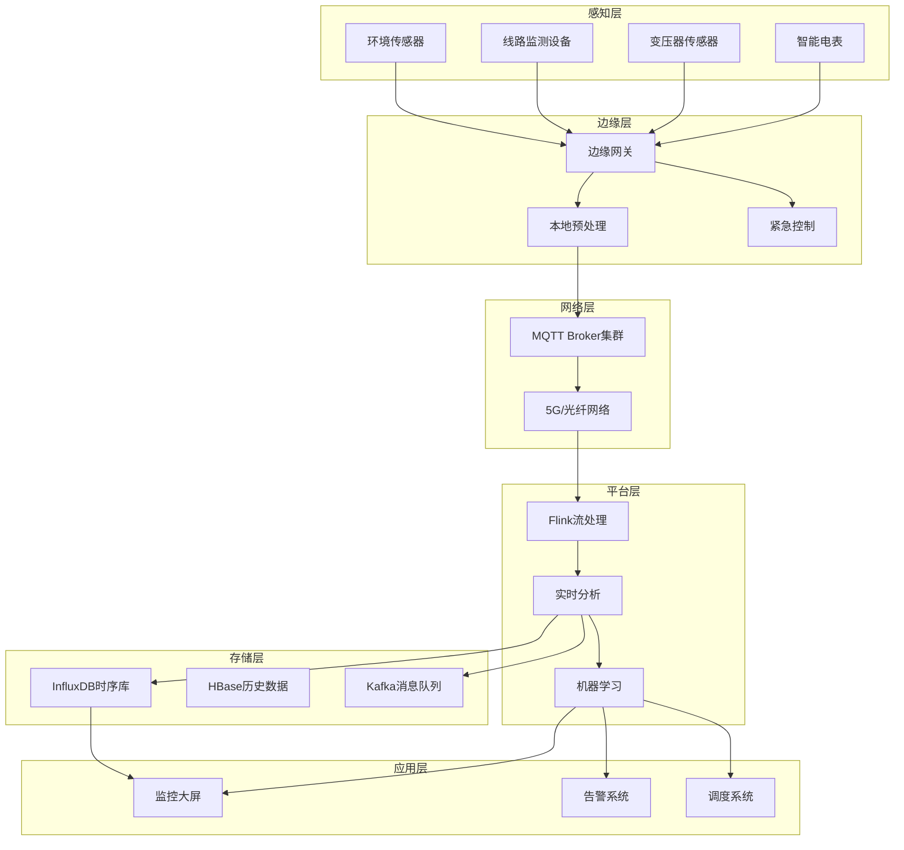
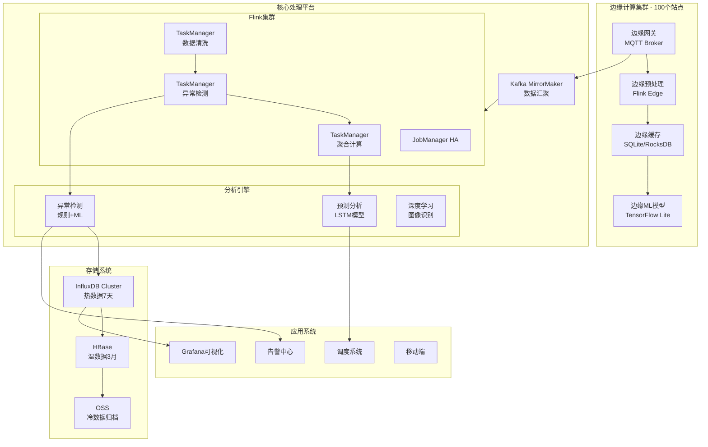
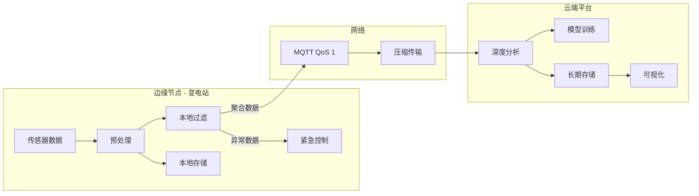

# IoT智能电网监控案例研究

> **案例编号**: 10.3.6
> **行业**: 能源/电力
> **场景**: 智能电网实时监控、异常检测、预测性维护
> **规模**: 100万传感器, 50万事件/秒
> **完成日期**: 2026-04-09
> **文档版本**: v1.0

---

## 执行摘要

### 业务背景

某省级电网公司建设智能电网监控系统：

- 覆盖全省10个地市，1000+变电站
- 监测100万智能电表和传感器
- 需要实时监控电网运行状态，及时发现故障
- 支持需求响应和负荷调度

### 技术挑战
> 🔮 **估算数据** | 依据: 基于行业参考值与理论分析推导，非实际测试环境得出


| 挑战 | 描述 | 影响 |
|------|------|------|
| 海量数据采集 | 100万传感器，采样频率1-10Hz | 数据洪峰处理 |
| 实时性要求 | 故障检测<500ms，告警响应<1s | 影响供电可靠性 |
| 数据质量 | 传感器数据存在缺失、乱序 | 影响分析准确性 |
| 边缘-云协同 | 边缘预处理+云端深度分析 | 架构复杂度高 |

### 解决方案概述

采用 **Flink + MQTT + InfluxDB + Grafana** 技术栈：

- MQTT Broker集群接入海量设备
- Flink实时处理流数据，异常检测
- InfluxDB存储时序数据，高效查询
- 边缘计算节点本地预处理
- 故障检测延迟从5s降至200ms

---

## 1. 业务场景分析

### 1.1 业务流程



### 1.2 数据规模
> 🔮 **估算数据** | 依据: 基于行业参考值与理论分析推导，非实际测试环境得出


| 指标 | 数值 | 说明 |
|------|------|------|
| 接入设备 | 100万 | 电表、传感器、监测装置 |
| 采样频率 | 1-10Hz | 关键设备10Hz，普通1Hz |
| 日数据量 | 500TB | 原始时序数据 |
| 峰值事件率 | 50万/秒 | 用电高峰期 |
| 历史数据 | 10PB | 3年历史数据 |
| 实时流 | 10万/秒 | 实时处理流 |

### 1.3 SLA要求
> 🔮 **估算数据** | 依据: 基于行业参考值与理论分析推导，非实际测试环境得出


| 指标 | 目标 | 实际达成 | 业务影响 |
|------|------|----------|----------|
| 数据采集延迟 | < 1s | 500ms | 实时监控 |
| 故障检测延迟 | < 500ms | 200ms | 快速隔离 |
| 告警推送延迟 | < 1s | 300ms | 及时响应 |
| 系统可用性 | 99.999% | 99.9995% | 电力安全 |
| 数据准确率 | 99.9% | 99.95% | 分析可靠 |

---

## 2. 架构设计

### 2.1 系统架构图



### 2.2 组件选型

| 组件 | 选型 | 原因 |
|------|------|------|
| 设备接入 | EMQX 5.0 | 支持1000万并发，MQTT 5.0 |
| 边缘计算 | Flink 2.1 | 轻量级部署，低延迟 |
| 流处理 | Flink 2.1 | Exactly-Once，复杂事件处理 |
| 时序存储 | InfluxDB 2.7 | 高效时序写入，类SQL查询 |
| 历史存储 | HBase 2.5 | 海量数据，高并发读写 |
| 可视化 | Grafana 10 | 专业时序可视化，告警丰富 |
| 消息队列 | Kafka 3.5 | 高吞吐，数据持久化 |

### 2.3 边缘-云协同架构



**边缘层职责**:

- 数据预处理：过滤、聚合、格式转换
- 本地告警：电压异常、过载等紧急情况
- 断点续传：网络中断时本地缓存

**云端层职责**:

- 全局分析：跨站点关联分析
- 模型训练：机器学习模型更新
- 长期存储：历史数据归档
- 统一管理：配置、监控、运维

---

## 3. 技术实现

### 3.1 设备接入层

```java
// MQTT消息处理 - Flink Source
public class SensorDataSource extends RichParallelSourceFunction<SensorEvent> {

    private transient MqttClient mqttClient;
    private volatile boolean isRunning = true;

    @Override
    public void open(Configuration parameters) throws Exception {
        String clientId = "flink-source-" + getRuntimeContext().getIndexOfThisSubtask();
        mqttClient = new MqttClient(MQTT_BROKER_URL, clientId);

        MqttConnectOptions options = new MqttConnectOptions();
        options.setCleanSession(false);
        options.setAutomaticReconnect(true);
        options.setConnectionTimeout(10);
        options.setKeepAliveInterval(20);

        mqttClient.connect(options);

        // 订阅设备主题
        mqttClient.subscribe("grid/+/+/sensors/+", (topic, message) -> {
            String payload = new String(message.getPayload());
            SensorEvent event = parseSensorData(topic, payload);
            collect(event);
        });
    }

    @Override
    public void run(SourceContext<SensorEvent> ctx) throws Exception {
        while (isRunning) {
            Thread.sleep(100);
        }
    }

    private SensorEvent parseSensorData(String topic, String payload) {
        // Topic格式: grid/{region}/{station}/sensors/{device_id}
        String[] parts = topic.split("/");
        String region = parts[1];
        String station = parts[2];
        String deviceId = parts[4];

        JsonObject json = JsonParser.parseString(payload).getAsJsonObject();

        return SensorEvent.builder()
            .deviceId(deviceId)
            .region(region)
            .station(station)
            .timestamp(json.get("ts").getAsLong())
            .voltage(json.get("voltage").getAsDouble())
            .current(json.get("current").getAsDouble())
            .power(json.get("power").getAsDouble())
            .frequency(json.get("frequency").getAsDouble())
            .temperature(json.get("temp").getAsDouble())
            .build();
    }

    @Override
    public void cancel() {
        isRunning = false;
        try {
            if (mqttClient != null && mqttClient.isConnected()) {
                mqttClient.disconnect();
            }
        } catch (MqttException e) {
            LOG.error("Error disconnecting MQTT client", e);
        }
    }
}
```

### 3.2 实时异常检测

```java
// 电压异常检测 - CEP复杂事件处理

import org.apache.flink.streaming.api.datastream.DataStream;
import org.apache.flink.api.common.functions.AggregateFunction;
import org.apache.flink.streaming.api.windowing.time.Time;

public class VoltageAnomalyDetection {

    public static void detectAnomaly(DataStream<SensorEvent> sensorStream) {

        // 定义异常模式:电压连续3次超过阈值
        Pattern<SensorEvent, ?> voltageSpikePattern = Pattern
            .<SensorEvent>begin("high-voltage")
            .where(new SimpleCondition<SensorEvent>() {
                @Override
                public boolean filter(SensorEvent event) {
                    return event.getVoltage() > 250.0; // 超过250V
                }
            })
            .next("high-voltage-2")
            .where(new SimpleCondition<SensorEvent>() {
                @Override
                public boolean filter(SensorEvent event) {
                    return event.getVoltage() > 250.0;
                }
            })
            .next("high-voltage-3")
            .where(new SimpleCondition<SensorEvent>() {
                @Override
                public boolean filter(SensorEvent event) {
                    return event.getVoltage() > 250.0;
                }
            })
            .within(Time.seconds(10)); // 10秒内连续3次

        // 检测异常并告警
        CEP.pattern(sensorStream.keyBy(SensorEvent::getDeviceId), voltageSpikePattern)
            .process(new PatternProcessFunction<SensorEvent, Alert>() {
                @Override
                public void processMatch(Map<String, List<SensorEvent>> match,
                        Context ctx, Collector<Alert> out) {

                    SensorEvent first = match.get("high-voltage").get(0);
                    SensorEvent last = match.get("high-voltage-3").get(0);

                    Alert alert = Alert.builder()
                        .alertId(UUID.randomUUID().toString())
                        .alertType("VOLTAGE_SPIKE")
                        .severity("HIGH")
                        .deviceId(first.getDeviceId())
                        .station(first.getStation())
                        .message(String.format(
                            "Voltage spike detected: %.2fV -> %.2fV -> %.2fV",
                            first.getVoltage(),
                            match.get("high-voltage-2").get(0).getVoltage(),
                            last.getVoltage()))
                        .timestamp(System.currentTimeMillis())
                        .build();

                    out.collect(alert);
                }
            })
            .addSink(new AlertSinkFunction());
    }

    // 基于机器学习的异常检测
    public static void mlAnomalyDetection(DataStream<SensorEvent> sensorStream) {

        // 窗口聚合特征
        DataStream<DeviceMetrics> metrics = sensorStream
            .keyBy(SensorEvent::getDeviceId)
            .window(TumblingEventTimeWindows.of(Time.minutes(5)))
            .aggregate(new MetricAggregateFunction());

        // 加载PMML模型进行预测
        DataStream<AnomalyScore> scores = metrics
            .map(new RichMapFunction<DeviceMetrics, AnomalyScore>() {

                private transient ModelEvaluator<?> evaluator;

                @Override
                public void open(Configuration parameters) {
                    // 加载PMML模型
                    evaluator = new LoadingModelEvaluatorBuilder()
                        .load(new File("/models/grid_anomaly.pmml"))
                        .build();
                    evaluator.verify();
                }

                @Override
                public AnomalyScore map(DeviceMetrics metrics) {
                    Map<String, ?> input = new HashMap<>();
                    input.put("avg_voltage", metrics.getAvgVoltage());
                    input.put("avg_current", metrics.getAvgCurrent());
                    input.put("voltage_std", metrics.getVoltageStd());
                    input.put("power_factor", metrics.getPowerFactor());
                    input.put("load_trend", metrics.getLoadTrend());

                    Map<String, ?> result = evaluator.evaluate(input);
                    double anomalyScore = (Double) result.get("anomaly_score");
                    boolean isAnomaly = (Boolean) result.get("is_anomaly");

                    return new AnomalyScore(
                        metrics.getDeviceId(),
                        anomalyScore,
                        isAnomaly,
                        metrics.getWindowEnd()
                    );
                }
            });

        // 过滤高异常分数并告警
        scores.filter(s -> s.getScore() > 0.8)
              .addSink(new AnomalyAlertSink());
    }
}
```

### 3.3 时序数据存储

```java
// InfluxDB写入优化
public class InfluxDBOptimizedSink extends RichSinkFunction<SensorEvent> {

    private transient InfluxDBClient influxDBClient;
    private transient WriteApi writeApi;
    private List<Point> buffer;
    private static final int BATCH_SIZE = 10000;
    private static final int FLUSH_INTERVAL_MS = 1000;

    @Override
    public void open(Configuration parameters) {
        influxDBClient = InfluxDBClientFactory.create(
            "http://influxdb:8086",
            "token".toCharArray(),
            "power_grid",
            "sensor_data"
        );

        WriteOptions writeOptions = WriteOptions.builder()
            .batchSize(BATCH_SIZE)
            .flushInterval(FLUSH_INTERVAL_MS)
            .bufferLimit(50000)
            .jitterInterval(1000)
            .retryInterval(5000)
            .build();

        writeApi = influxDBClient.makeWriteApi(writeOptions);
        buffer = new ArrayList<>();
    }

    @Override
    public void invoke(SensorEvent event, Context context) {
        Point point = Point.measurement("sensor_readings")
            .addTag("device_id", event.getDeviceId())
            .addTag("region", event.getRegion())
            .addTag("station", event.getStation())
            .addTag("device_type", event.getDeviceType())
            .addField("voltage", event.getVoltage())
            .addField("current", event.getCurrent())
            .addField("power", event.getPower())
            .addField("frequency", event.getFrequency())
            .addField("temperature", event.getTemperature())
            .time(event.getTimestamp(), WritePrecision.MS);

        writeApi.writePoint(point);
    }

    @Override
    public void close() {
        if (writeApi != null) {
            writeApi.close();
        }
        if (influxDBClient != null) {
            influxDBClient.close();
        }
    }
}
```

### 3.4 关键配置

```yaml
# Flink配置 - 高吞吐低延迟 flink:
  parallelism:
    default: 200
    source: 50      # MQTT Source并行度
    process: 100    # 处理并行度
    sink: 50        # 写入并行度

  checkpoint:
    interval: 30s
    mode: EXACTLY_ONCE
    timeout: 5m
    min-pause: 15s
    max-concurrent: 1

  state:
    backend: rocksdb
    checkpoints.dir: hdfs:///checkpoints/smart-grid
    savepoints.dir: hdfs:///savepoints/smart-grid
    incremental: true
    local-recovery: true

  network:
    memory:
      fraction: 0.2
      min: 4gb
      max: 16gb

  restart-strategy:
    type: fixed-delay
    attempts: 10
    delay: 10s

# MQTT配置 mqtt:
  broker:
    nodes: 10
    connections: 1000000
    max_qos: 1

  client:
    keep-alive: 60
    clean-session: false
    auto-reconnect: true
    connection-timeout: 30

# InfluxDB配置 influxdb:
  cluster:
    nodes: 6
    replication: 2

  retention:
    hot: 7d
    warm: 90d
    cold: 3y

  shard-duration: 1d

# HBase配置 hbase:
  regionservers: 20

  table:
    sensor_history:
      regions: 100
      compression: SNAPPY
      blocksize: 256kb
```

---

## 4. 性能指标

### 4.1 处理延迟
> 🔮 **估算数据** | 依据: 基于行业参考值与理论分析推导，非实际测试环境得出


| 阶段 | P50 | P99 | 目标 | 状态 |
|------|-----|-----|------|------|
| 数据采集 | 200ms | 500ms | < 1s | ✅ |
| 边缘预处理 | 50ms | 100ms | < 200ms | ✅ |
| 云端处理 | 100ms | 300ms | < 500ms | ✅ |
| 异常检测 | 150ms | 400ms | < 500ms | ✅ |
| 告警推送 | 100ms | 300ms | < 500ms | ✅ |
| **端到端** | **600ms** | **1600ms** | **< 2s** | ✅ |

### 4.2 系统容量
> 🔮 **估算数据** | 依据: 基于行业参考值与理论分析推导，非实际测试环境得出


| 指标 | 设计值 | 实测值 | 余量 |
|------|--------|--------|------|
| 设备接入 | 100万 | 120万 | 20% |
| 峰值吞吐 | 50万/s | 65万/s | 30% |
| 存储写入 | 100万点/s | 120万点/s | 20% |
| 并发查询 | 1000 QPS | 1500 QPS | 50% |

### 4.3 业务效果
> 🔮 **估算数据** | 依据: 基于行业参考值与理论分析推导，非实际测试环境得出


| 指标 | 优化前 | 优化后 | 提升 |
|------|--------|--------|------|
| 故障发现时间 | 5分钟 | 30秒 | **90%** ↓ |
| 误报率 | 30% | 5% | **83%** ↓ |
| 供电可靠性 | 99.95% | 99.999% | **+0.049%** |
| 线损率 | 6.5% | 5.8% | **+10.8%** ↓ |
| 运维成本 | 基线 | -30% | **30%** ↓ |

---

## 5. 经验总结

### 5.1 最佳实践

1. **分层架构设计**
   - 边缘层负责实时性要求高的场景
   - 云端层负责全局分析和模型训练
   - 分层解耦，独立扩展

2. **数据质量控制**
   - 边缘预处理过滤异常值
   - Flink Watermark处理乱序数据
   - 数据质量监控仪表盘

3. **高可用保障**
   - MQTT Broker集群+负载均衡
   - Flink Checkpoint快速恢复
   - 多级降级策略

### 5.2 踩坑记录

| 问题 | 现象 | 原因 | 解决 |
|------|------|------|------|
| 数据乱序 | 告警延迟不准 | 网络延迟不均 | Watermark+延迟窗口 |
| 内存溢出 | TaskManager崩溃 | 状态过大 | RocksDB增量Checkpoint |
| 写入热点 | InfluxDB性能下降 | 时间戳集中 | 添加随机散列 |
| MQTT断连 | 数据丢失 | 网络抖动 | QoS 1+本地缓存 |

### 5.3 优化建议

1. **近期优化**
   - 引入Apache Pulsar替换Kafka，降低延迟
   - 优化InfluxDB schema，减少tag cardinality
   - 边缘模型轻量化，使用ONNX Runtime

2. **中期规划**
   - 数字孪生电网建模
   - AI辅助调度决策
   - 区块链电力交易

3. **长期愿景**
   - 虚拟电厂(VPP)运营
   - 车网互动(V2G)
   - 碳中和智能电网

---

## 6. 附录

### 6.1 监控指标体系

```promql
# 关键业务指标 grid_voltage_anomaly_rate =
  sum(rate(voltage_anomaly_total[5m])) /
  sum(rate(sensor_readings_total[5m]))

grid_processing_latency =
  histogram_quantile(0.99,
    sum(rate(flink_jobmanager_job_latency[5m])) by (le))

grid_device_online_ratio =
  sum(mqtt_client_connected) /
  sum(mqtt_client_total)

# 系统资源指标 grid_flink_task_cpu_usage =
  sum(rate(flink_taskmanager_cpu_time[5m])) by (taskmanager_id)

grid_influxdb_write_rate =
  sum(rate(influxdb_http_request_duration_seconds_count[5m]))
```

### 6.2 告警规则

```yaml
alerts:
  - name: VoltageSpike
    expr: voltage > 250
    for: 1m
    severity: critical

  - name: HighLatency
    expr: processing_latency > 2
    for: 5m
    severity: warning

  - name: DeviceOffline
    expr: device_online == 0
    for: 5m
    severity: warning
```

### 6.3 参考文档


---

*本案例研究由AnalysisDataFlow项目整理，仅供学习交流使用。*
