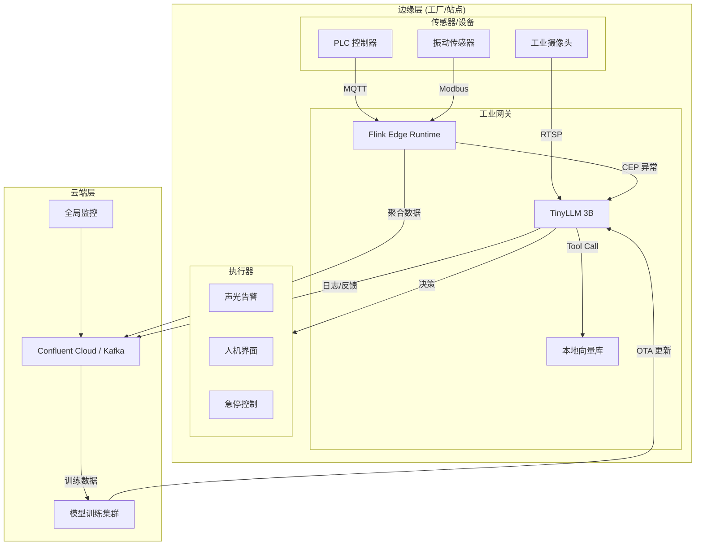
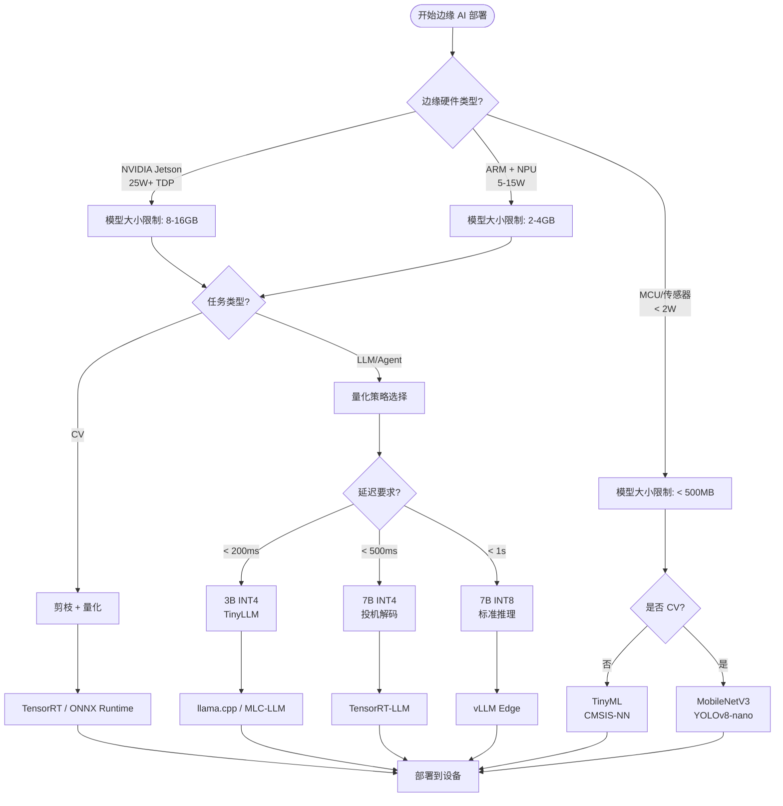

> **状态**: 🔮 前瞻内容 | **风险等级**: 中 | **最后更新**: 2026-04-20
>
> 本文档涉及边缘 AI 生产案例基于公开报道与研究整理，具体效果因场景而异。

---

# 流处理 + 边缘 AI 生产案例更新 (2026 Q2)

> 所属阶段: Knowledge/10-case-studies/iot | 前置依赖: [edge-ai-streaming-architecture.md](../../06-frontier/edge-ai-streaming-architecture.md), [flink-edge-streaming-guide.md](../../../Flink/09-practices/09.05-edge/flink-edge-streaming-guide.md) | 形式化等级: L3

---

## 1. 概念定义 (Definitions)

### Def-K-10-60: Edge-Streaming Inference Pipeline

**边缘流式推理管道** 定义在资源受限的边缘设备上持续接收数据流、执行 AI 推理并输出决策结果的完整链路：

```yaml
边缘流式推理管道:
  输入层:
    - 传感器流 (MQTT/CoAP)
    - 视频流 (RTSP/GB28181)
    - 日志流 (syslog/fluentd)

  预处理层:
    - 数据清洗与格式标准化
    - 窗口聚合 (滑动/滚动)
    - 特征提取与降维

  推理层:
    - 模型加载与缓存管理
    - 批量推理 (batch inference)
    - 动态批处理 (dynamic batching)

  输出层:
    - 决策结果流 (Kafka/本地动作)
    - 异常告警 (edge → cloud)
    - 模型反馈与本地微调

  资源约束:
    内存: 通常 < 16GB (GPU 显存 < 8GB)
    功耗: 15W-75W (工业级) / < 5W (IoT级)
    网络: 间歇性连接, 带宽有限
```

### Def-K-10-61: TinyLLM Edge Deployment

**TinyLLM 边缘部署** 定义将参数规模在 1B-7B 之间的小型语言模型通过压缩技术部署到边缘设备的工程实践：

```yaml
TinyLLM 部署模式:
  模型压缩栈:
    - 量化: FP32 → INT8 (4x 压缩, ~3% 精度损失) / INT8 → INT4 (8x 压缩, ~8-12% 损失)
    - 剪枝: 移除低权重连接 (稀疏化 30-50%)
    - 蒸馏: 大模型 (Teacher 70B) → 小模型 (Student 7B), 保留 85-90% 能力

  边缘运行环境:
    - WebLLM: 浏览器内 WebGPU 推理 (Gemma 2B q4f32, ~1.5GB)
    - ONNX Runtime: 跨平台优化推理
    - TensorRT-LLM: NVIDIA 边缘设备加速
    - llama.cpp: CPU 友好型推理

  流处理集成:
    - 输入 token 流化: 分段处理长文本
    - 输出流式响应: SSE 渐进式返回
    - 上下文缓存: KV-Cache 持久化加速多轮对话
```

---

## 2. 属性推导 (Properties)

### Prop-K-10-60: 边缘推理延迟与模型规模权衡

**命题**: 在固定边缘硬件上，模型推理延迟随模型规模呈超线性增长：

$$
L_{inference}(P) = \alpha \cdot P^{\beta} + L_{fixed}, \quad \beta \in [1.2, 1.8]
$$

其中：

- $P$: 模型参数量 (B)
- $\alpha$: 硬件相关系数 (ms/B^β)
- $L_{fixed}$: 固定开销 (内存分配、I/O)

**实测数据** (NVIDIA Jetson Orin Nano, INT8 量化)：

| 模型 | 参数量 | 推理延迟 (128 tokens) | 内存占用 |
|------|--------|----------------------|---------|
| TinyLlama-1.1B | 1.1B | 120ms | 1.2GB |
| Qwen2-1.5B | 1.5B | 180ms | 1.8GB |
| Gemma-2B | 2.0B | 250ms | 2.4GB |
| Phi-3-mini | 3.8B | 480ms | 4.2GB |
| Qwen2-7B | 7.0B | 920ms | 7.8GB |

---

## 3. 关系建立 (Relations)

### 3.1 边缘 AI 与流处理系统的协同关系

| 维度 | 边缘 AI 层 | 流处理层 (Flink/K3s) | 协同价值 |
|------|-----------|---------------------|---------|
| 数据接入 | 传感器/摄像头直连 | MQTT/CoAP Source | 统一数据摄取 |
| 预处理 | 简单滤波/裁剪 | 复杂窗口聚合/CEP | 分层计算卸载 |
| 推理执行 | 本地模型 (低延迟) | 云端大模型 (高能力) | 混合推理策略 |
| 状态管理 | 设备本地缓存 | Flink State Backend | 断网续传 |
| 模型更新 | OTA 差分更新 | 流式模型分发 | 热更新无停机 |

### 3.2 边缘 AI 部署模式演进

```
┌─────────────────────────────────────────────────────────────────┐
│  模式 1: 纯云推理 (2020-2023)                                    │
│  Edge → Cloud API → 结果                                         │
│  缺点: 高延迟、高带宽、数据隐私风险                                │
├─────────────────────────────────────────────────────────────────┤
│  模式 2: 边缘预处理 + 云推理 (2023-2024)                          │
│  Edge [预处理] → Cloud [推理] → Edge [动作]                       │
│  缺点: 仍需频繁云通信                                            │
├─────────────────────────────────────────────────────────────────┤
│  模式 3: 边缘推理 + 云协调 (2025-2026) ★ 主流                     │
│  Edge [TinyLLM/SLM 推理] → 本地决策                               │
│  Cloud [模型训练/全局优化/监控]                                    │
│  优点: 低延迟、离线可用、隐私保护                                  │
├─────────────────────────────────────────────────────────────────┤
│  模式 4: 端边云协同 (2026+)                                       │
│  端 [微模型] → 边 [小模型] → 云 [大模型]                          │
│  动态路由: 简单任务端处理, 复杂任务云处理                           │
└─────────────────────────────────────────────────────────────────┘
```

---

## 4. 论证过程 (Argumentation)

### 4.1 2026 年边缘 AI 的核心技术突破

**三大突破方向**：

1. **模型压缩技术成熟**
   - 量化: GPTQ/AWQ/EXL2 实现 INT4 高质量推理
   - 蒸馏: 专用领域 SLM (1-7B) 在垂直任务上超越通用大模型
   - 投机解码 (Speculative Decoding): 小模型草稿 + 大模型验证，加速 2-3x

2. **边缘硬件算力飞跃**
   - NVIDIA Jetson Thor: 100 TOPS, 支持 Transformer 引擎
   - Qualcomm AI Stack: 手机 NPU 运行 7B 模型
   - Apple M4 Neural Engine: 38 TOPS, 本地 LLM 流畅运行

3. **流处理边缘化**
   - Apache Flink 边缘部署 (K3s + 轻量 TM)
   - Redpanda / NATS 替代 Kafka (无 Zookeeper)
   - WASM UDF 支持多语言边缘算子

### 4.2 边缘 LLM vs 边缘 CV 的部署差异

| 维度 | 边缘计算机视觉 | 边缘 LLM |
|------|--------------|---------|
| 模型大小 | 10-100MB (MobileNet/YOLO) | 1-8GB (量化后) |
| 推理延迟 | 10-50ms | 100ms-2s |
| 输入数据 | 图像/视频帧 | 文本/token 流 |
| 状态需求 | 无状态 | KV-Cache 有状态 |
| 流处理模式 | 逐帧处理 | 流式生成 (token-by-token) |
| 压缩重点 | 结构剪枝 | 量化 + 蒸馏 |

---

## 5. 形式证明 / 工程论证 (Proof / Engineering Argument)

### Thm-K-10-60: 边缘流式推理系统的可用性上界

**定理**: 在给定边缘硬件资源约束下，流式推理系统的可用性存在理论上界：

$$
A_{system} = \frac{T_{available}}{T_{available} + T_{recovery}} \leq \frac{MTBF}{MTBF + MTTR}
$$

**其中关键约束**：

1. **内存约束**: 模型权重 + KV-Cache + 流状态 < 设备内存
   - KV-Cache 增长: $S_{kv} = 2 \cdot P \cdot L_{seq} \cdot D_{head} \cdot N_{layer}$ bytes
   - 长序列 (L > 4K) 需要显存管理或滑动窗口

2. **功耗约束**: 持续推理功耗 < 设备热设计功耗 (TDP)
   - 峰值功耗管理: 动态频率调节 (DVFS)
   - 批量推理聚合降低单位能耗

3. **网络约束**: 断网期间本地缓存足够维持推理
   - 模型权重: 本地常驻
   - 知识更新: 周期性同步 (非实时依赖)

---

## 6. 实例验证 (Examples)

### 6.1 案例一：汽车工厂边缘 LLM 智能体 — 预测性维护

**背景**: 某汽车制造商在产线部署边缘 AI 系统，实时分析机器日志与传感器数据。

**架构**:

- 边缘节点: NVIDIA Jetson AGX Orin (32GB) + Flink K3s
- 模型: Qwen2-7B INT4 量化 (3.5GB) + 领域微调
- 数据源: PLC 日志流 (MQTT) + 振动传感器 (10KHz)

**流处理链路**：

```
传感器流 → Flink CEP (异常模式检测) → 边缘 LLM (根因分析) → 维护工单
```

**效果**:

- 非计划停机减少 **18%**
- 年度节省 **$1.2M**
- 平均故障诊断延迟: **< 2秒** (本地推理)
- 数据不出厂，满足汽车业合规要求

**关键成功因素**:

- 专用领域微调 (维护知识库 + 历史故障案例)
- 混合推理: 简单异常规则引擎处理，复杂故障 LLM 分析
- Flink Checkpoint 保证流状态在设备重启后可恢复

### 6.2 案例二：食品加工厂多厂边缘编排 — 质量报告自动化

**背景**: 某食品加工集团跨 5 个工厂部署统一边缘 AI 平台。

**架构**:

- 每厂边缘: Dell Edge Gateway + Raspberry Pi 5 + Hailo-8L
- 云端协调: Kubernetes + Flink Session Cluster
- 模型: 视觉质检 (YOLOv8) + 报告生成 (Phi-3-mini 3.8B INT8)

**流处理链路**：

```
产线摄像头 → 边缘视觉检测 (Hailo-8L) → 缺陷摘要 → 边缘 LLM 生成报告 → 云端聚合
```

**效果**:

- 质量报告生成人力减少 **35%**
- 年度节省 **$480K**
- 跨厂质量数据实时汇总延迟: **< 5秒**
- 边缘 LLM 生成单份报告: **< 3秒**

**关键成功因素**:

- 分层架构: 视觉推理在 NPU，LLM 在 CPU/GPU 混部
- 模型共享: 5 厂共用基础模型，本地仅需缓存差分 LoRA
- 边缘-云协同: 复杂投诉分析自动上云，日常报告本地完成

### 6.3 案例三：TinyLLM 边缘智能体 — 设备函数调用与自主决策

**背景**: 基于 2026 年 TinyLLM 研究，将 3B 参数小模型部署到工业网关执行 Agent 任务。

**架构**:

- 硬件: ARM Cortex-A78 + 8GB RAM (工业网关)
- 模型: TinyAgent-3B (混合微调 + DPO 优化)
- 协议: MCP (工具调用) + A2A (多 Agent 协作)

**流处理链路**：

```
设备告警流 → TinyLLM (意图识别) → MCP Tool Call (查知识库/读传感器) → A2A 协调 → 执行动作
```

**效果**:

- 函数调用准确率: **88.22%** (超越轻量模型近 70%)
- 多轮对话任务准确率: **55.62%**
- 模型体积: **1.8GB** (INT4 量化)
- 单轮推理延迟: **< 500ms**

**关键成功因素**:

- 混合微调 (SFT + RLHF + DPO) 提升工具调用能力
- 本地向量数据库 (Chroma 嵌入式) 支撑 RAG 检索
- 流式 token 生成改善用户体验

---

## 7. 可视化 (Visualizations)

### 7.1 边缘 AI + 流处理生产架构总图



### 7.2 边缘 AI 模型压缩与部署决策树



---

## 8. 引用参考 (References)
