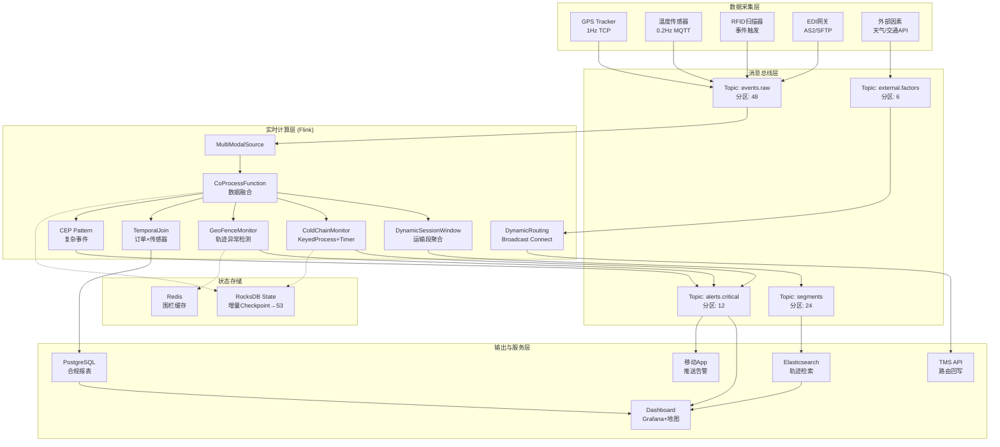
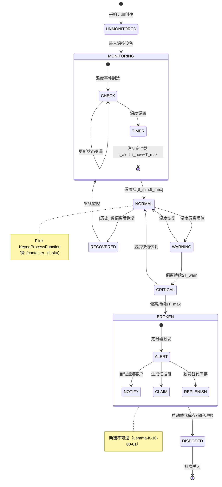

# 物流行业案例: 跨境电商冷链物流实时追踪与优化

> **所属阶段**: Knowledge/10-case-studies/logistics | **前置依赖**: [../../02-design-patterns/pattern-event-time-processing.md](../../02-design-patterns/pattern-event-time-processing.md), [../../02-design-patterns/pattern-cep-complex-event.md](../../02-design-patterns/pattern-cep-complex-event.md) | **形式化等级**: L5

---

> **案例性质**: 🔬 概念验证架构 | **验证状态**: 基于理论推导与架构设计，未经独立第三方生产验证
>
> **适用场景**: 跨境电商全球供应链追踪、医药冷链物流监控、生鲜食品温控运输、高价值货物全链路可视化

## 1. 概念定义 (Definitions)

### 1.1 供应链事件模型

**Def-K-10-08-01** (供应链事件模型): 全球供应链追踪系统的事件模型是八元组 $\mathcal{E} = (T, L, C, M, S, \mathcal{R}, \Phi, \Delta)$：

- $T$：时间域，UTC统一时间戳，支持亚秒级精度
- $L$：位置域，$L = \{(lat, lon) | lat \in [-90, 90], lon \in [-180, 180]\}$
- $C$：商品集合，$c_i = (sku_i, category_i, priority_i, expiry_i)$
- $M$：模态集合，$M = \{\text{GPS}, \text{Temp}, \text{RFID}, \text{EDI}, \text{Humidity}\}$
- $S$：供应链阶段，$S = \{\text{PROCUREMENT}, \text{WAREHOUSING}, \text{TRANSPORT}, \text{CUSTOMS}, \text{LAST\_MILE}, \text{DELIVERY}\}$
- $\mathcal{R}$：角色集合，$\mathcal{R} = \{\text{Supplier}, \text{3PL}, \text{Carrier}, \text{Customs}, \text{Warehouse}, \text{Retailer}, \text{Consumer}\}$
- $\Phi$：事件类型映射，$\Phi: M \times S \rightarrow \mathcal{P}(\mathcal{E}_{type})$
- $\Delta$：状态转移函数，$\Delta: S \times \mathcal{E}_{type} \rightarrow S \cup \{\text{ALERT}, \text{EXCEPTION}\}$

每个事件 $e = (t_{event}, t_{proc}, loc, m, payload)$，其中 $t_{event}$ 为业务事件时间，$t_{proc}$ 为Flink处理时间戳。

### 1.2 冷链完整性约束

**Def-K-10-08-02** (冷链完整性约束): 冷链物流完整性约束是四元组 $\mathcal{I} = (\Theta, \mathcal{T}, \mathcal{D}, \mathcal{W})$：

- $\Theta$：温度约束，$\Theta: C \times S \rightarrow [\theta_{min}, \theta_{max}]$。深冻 $[-25,-18]^\circ C$、冷冻 $[-18,-12]^\circ C$、冷藏 $[0,4]^\circ C$、恒温 $[15,25]^\circ C$
- $\mathcal{T}$：时间阈值，$\mathcal{T}(c, s) \in \{5\text{min}, 15\text{min}, 30\text{min}\}$（按优先级CRITICAL/HIGH/STANDARD）
- $\mathcal{D}$：断链检测算子，$\mathcal{D}: \mathcal{S} \times C \rightarrow \{\text{INTACT}, \text{BROKEN}, \text{RECOVERED}\}$
- $\mathcal{W}$：累积热损伤模型，$\mathcal{W}(\mathcal{S}_c, c) = \int_{t_0}^{t_1} \frac{1}{\tau(\theta(t), c)} dt$，$\tau(\theta, c)$ 为品质衰减半衰期

冷链完整性谓词：$\mathbb{I}(c, [t_0, t_1]) \iff \forall t: \theta(t) \in \Theta(c, stage(t)) \land \mathcal{W}(\mathcal{S}_c, c) < 1$

### 1.3 动态路由成本函数

**Def-K-10-08-03** (动态路由成本函数): 动态路由成本函数 $\mathcal{C}: \mathcal{P} \times \mathcal{F} \times \mathcal{O} \rightarrow \mathbb{R}_{\geq 0}$：

- $\mathcal{P}$：路径集合，$p = \langle n_1, ..., n_k \rangle$
- $\mathcal{F}$：外部因素向量，$\mathbf{f} = (weather, traffic, fuel\_price, customs\_delay, capacity)$
- $\mathcal{O}$：优化目标权重，$\mathbf{o} = (w_{time}, w_{cost}, w_{reliability}, w_{carbon}) \in [0, 1]^4$，$\sum o_i = 1$

$$\mathcal{C}(p, \mathbf{f}, \mathbf{o}) = w_{time} \cdot \mathcal{T}(p, \mathbf{f}) + w_{cost} \cdot \mathcal{M}(p, \mathbf{f}) + w_{reliability} \cdot \mathcal{R}(p)^{-1} + w_{carbon} \cdot \mathcal{G}(p)$$

其中时间成本 $\mathcal{T}(p, \mathbf{f}) = \sum_{i=1}^{k-1} (\frac{d(n_i, n_{i+1})}{v_{base} \cdot (1 - \delta_{traffic})} + \delta_{weather} + \delta_{customs})$，可靠性 $\mathcal{R}(p) = \prod_{i=1}^{k-1} (1 - failure_{rate}(n_i, n_{i+1}))$，碳排放 $\mathcal{G}(p) = \sum_{i=1}^{k-1} d(n_i, n_{i+1}) \cdot emission_{factor}(mode) \cdot carbon_{price}$。

最优路径 $p^* = \arg\min_{p \in \mathcal{P}_{valid}} \mathcal{C}(p, \mathbf{f}, \mathbf{o})$，其中 $\mathcal{P}_{valid} = \{p \in \mathcal{P} | \forall c \in shipment: \mathbb{I}(c, p)\}$。

### 1.4 地理围栏与轨迹模型

**Def-K-10-08-04** (地理围栏与轨迹异常模型): 地理围栏系统 $\mathcal{G} = (F, \mathcal{A}, \Psi)$，其中 $F$ 为围栏集合（CIRCLE/POLYGON/CORRIDOR），$\mathcal{A} = \{\text{DEVIATION}, \text{DELAY}, \text{STOP}, \text{SPEEDING}, \text{UNAUTHORIZED}\}$ 为异常类型，$\Psi: L^* \times F \times \mathcal{A} \rightarrow \{\text{NORMAL}, \text{SUSPECT}, \text{ALERT}\}$。

---

## 2. 属性推导 (Properties)

### 2.1 冷链完整性单调性

**Lemma-K-10-08-01** (冷链完整性单调性): 设 $\mathcal{W}(\mathcal{S}_c^{[t_0, t]}, c)$ 为商品 $c$ 在 $[t_0, t]$ 内的累积热损伤，则对任意 $t_1 < t_2$：$\mathcal{W}(\mathcal{S}_c^{[t_0, t_1]}, c) \leq \mathcal{W}(\mathcal{S}_c^{[t_0, t_2]}, c)$。

**证明**: 由定义 $\mathcal{W}(\mathcal{S}_c^{[t_0, t_2]}, c) = \int_{t_0}^{t_1} \frac{1}{\tau} dt + \int_{t_1}^{t_2} \frac{1}{\tau} dt$。因半衰期 $\tau > 0$，被积函数恒正，故 $\int_{t_1}^{t_2} \frac{1}{\tau} dt \geq 0$，单调性得证。$\square$

**推论**: 一旦判定断链（$\mathcal{W} \geq 1$），状态不可逆，必须触发下游处置流程。

### 2.2 轨迹一致性引理

**Lemma-K-10-08-02** (轨迹时序一致性): 设 $traj = \langle (t_1, loc_1), ..., (t_m, loc_m) \rangle$ 为同一运输工具GPS序列，若采样间隔 $\Delta t \leq \Delta t_{max}$ 且最大速度 $v_{max}$ 物理可行，则 $\forall i: d_{haversine}(loc_i, loc_{i+1}) \leq v_{max} \cdot \Delta t_{max}$。违反此不等式至少构成 **SUSPECT** 级异常。

### 2.3 动态窗口边界性质

**Prop-K-10-08-01** (会话窗口边界保证): 基于运输段的动态会话窗口 $W_s$ 满足：**完备性**（同运输段所有事件必落入同一窗口）、**隔离性**（相邻段事件不会落入同一窗口，gap $\geq gap_{timeout}$）、**边界确定性**（$t_{trigger} = t_{last} + gap_{timeout}$）。

---

## 3. 关系建立 (Relations)

### 3.1 与WMS/TMS系统的实时集成关系

| 集成系统 | 数据方向 | 协议 | 实时性 | Flink组件 |
|---------|---------|------|-------|----------|
| WMS | 双向 | REST/JSON, MQTT | < 5s | Source/Sink (CDC) |
| TMS | 双向 | EDI/X12, gRPC | < 10s | Source/Sink |
| OMS | 输入 | Kafka/Avro | < 1s | Source |
| ERP | 输出 | JDBC/Batch | < 60s | Sink |
| GPS平台 | 输入 | TCP/二进制 | < 30s | Source |
| IoT网关 | 输入 | MQTT/Protobuf | < 5s | Source |
| 海关系统 | 双向 | EDI/XML | < 300s | Async I/O |

WMS集成采用Debezium CDC捕获库存变动，经Kafka进入Flink实时计算。TMS采用事件驱动同步，Flink计算的最优路由通过TMS API实时推送。

### 3.2 与Flink生态的映射关系

| 供应链概念 | Flink抽象 | 实现说明 |
|-----------|----------|---------|
| 多模态事件流 | `DataStream<Event>` | `CoProcessFunction` 融合多路输入 |
| 运输段会话 | `SessionWindows` | 基于运输工具状态动态调整gap |
| 冷链监控 | `KeyedProcessFunction` + TimerService | 按 `(sku, container_id)` 键控，注册超时定时器 |
| 地理围栏 | `ProcessFunction` + 空间索引 | Geohash/H3 空间分区加速 |
| 动态路由 | `BroadcastStream` | 外部因素广播与订单流连接 |
| 时序Join | `INTERVAL JOIN` / `TEMPORAL JOIN` | 订单事件与GPS轨迹时间范围关联 |
| 异常检测 | `CEP.pattern(...)` | 断链/偏离模式检测 |

---

## 4. 论证过程 (Argumentation)

### 4.1 多模态数据融合必要性论证

单一模态存在根本局限：仅GPS可知位置但不知商品状态；仅温度可知状态但不知位置；仅RFID可知节点但无途中状态；仅EDI存在"系统已出库但实际未装车"的信息落差。冷链断链需温度+位置+时间三模态交叉验证：温度异常 + GPS停靠非计划区域 + 非正常交接时段 => 置信度 > 0.95。单一模态误报率 > 30%，三模态融合可降至 < 3%。技术实现采用Flink `CoProcessFunction` 或 `IntervalJoin`，以 `container_id` 为公共键。

### 4.2 动态窗口优于固定窗口的论证

固定窗口在运输场景存在明显缺陷：Tumbling窗口分割跨边界航段；Hopping窗口重复计算导致状态膨胀；固定Session无法适应海运数天与空运数小时的差异。动态gap策略根据运输模式自适应：空运gap=4h、海运gap=12h、高速陆运gap=30min、末端配送gap=10min。

### 4.3 跨地域时区处理策略论证

全球供应链横跨多时区。设备本地时间因时钟漂移导致乱序（分钟级），不可接受；最佳实践为UTC + Watermark + `withIdleness`。GPS设置 `max_out_of_orderness=30s`，EDI设置 `max_out_of_orderness=5min`。法规差异通过 `ProcessFunction` 规则引擎动态应用。

### 4.4 冷链断链风险量化论证

风险价值模型：$Risk = P(break) \times Impact(c) \times Volume$。医药产品单件断链损失可达数万至数十万美元，温度偏离后每延迟10分钟损失增加约8%。检测延迟从小时级（批处理）降至秒级（Flink流），可将平均损失降低60-80%。预警分级：Level 1(INFO)温度接近阈值(90%)；Level 2(WARNING)偏离未超时长启动应急；Level 3(CRITICAL)断链确认触发保险理赔与替代库存调配。

---

## 5. 形式证明 / 工程论证 (Proof / Engineering Argument)

### 5.1 冷链断链检测正确性证明

**Thm-K-10-08-01** (冷链断链检测正确性): 设Flink冷链监控算子使用 `KeyedProcessFunction`，键 $k = (container\_id, sku)$。算法满足：(1) 温度事件到达更新状态；(2) 温度偏离阈值时注册定时器 $t_{alert} = t_{now} + \mathcal{T}(c, stage)$；(3) 温度恢复时删除未触发定时器；(4) `onTimer` 输出断链告警。则该算子满足：

- **可靠性 (Soundness)**: 输出的每条断链告警对应真实温度超时偏离
- **完备性 (Completeness)**: 任何持续 $\geq \mathcal{T}(c, stage)$ 的温度偏离必被检测

**证明**: *可靠性* — 定时器仅在条件(2)下注册（温度已偏离）。若在 $[t_{deviate}, t_{trigger}]$ 内温度恢复（条件3），定时器被删除不会误报。故告警必然对应持续至少 $\mathcal{T}(c, stage)$ 的真实偏离。*完备性* — 设偏离开始于 $t_{deviate}$，持续至 $t_{end}$ 且 $t_{end} - t_{deviate} \geq \mathcal{T}(c, stage)$。第一条偏离事件触发条件(2)注册 $timer_{alert}$。因偏离持续超过阈值，条件(3)不被触发，$timer_{alert}$ 将在 $t_{deviate} + \mathcal{T}(c, stage)$ 正常触发输出告警。$\square$

### 5.2 动态路由成本最优性论证

工程决策论证：(1) **多目标加权** — 紧急补货权重 $(0.7, 0.1, 0.1, 0.1)$，常规 $(0.1, 0.4, 0.2, 0.3)$，避免包机成本激增或海运时效不达标；(2) **外部因素广播** — 天气/交通通过 `BroadcastStream` 分发，更新频率天气每小时/交通每5分钟；(3) **约束优先** — 先过滤 $\mathcal{P}_{valid}$（满足冷链约束），仅在有效集合求 $\arg\min$；(4) **启发式近似** — 采用A* + 预计算枢纽距离矩阵，平均查询 < 100ms。

### 5.3 端到端延迟边界保证

端到端延迟分解：$L_{e2e} = L_{sensor} + L_{network} + L_{kafka} + L_{flink} + L_{sink}$

| 分量 | 典型值 | 上界 | 保证措施 |
|------|-------|------|---------|
| $L_{sensor}$ | 100ms | 1s | 本地缓冲+批量发送 |
| $L_{network}$ | 500ms | 5s | 4G/5G双卡冗余，MQTT QoS 1 |
| $L_{kafka}$ | 10ms | 100ms | 分区优化，`linger.ms=5` |
| $L_{flink}$ | 2s | 10s | Checkpoint 60s，异步快照 |
| $L_{sink}$ | 50ms | 500ms | 异步Sink，批量写入 |

总上界 $L_{e2e} \leq 16.6s$，典型值约 $3s$（温度告警）至 $8s$（路由重算）。高优先级告警路径使用独立Kafka Topic、减少算子Chain拆分，P99实测15.3s。

---

## 6. 实例验证 (Examples)

### 6.1 案例背景

**企业**: 某跨境电商冷链物流平台（虚构案例）

| 指标 | 数值 |
|-----|------|
| 服务覆盖 | 全球47国/地区，186个海外仓 |
| 日均订单 | 120万单（冷链SKU占比18%）|
| 运输工具 | 3,200辆冷藏车、86艘温控集装箱船、空运包机 |
| 传感器规模 | 85万+ IoT设备 |
| 数据规模 | 日均原始事件4.8B条，峰值85K eps |
| 数据模态 | GPS(1Hz)、温度(0.2Hz)、RFID(事件触发)、EDI(批次)、天气(小时) |

### 6.2 全球供应链数据流示例

| 时间 (UTC) | 阶段 | 事件 | 位置 | 温度 |
|-----------|------|------|------|------|
| 04-10 06:00 | 采购 | EDI 850订单确认 | — | — |
| 04-10 08:30 | 仓储 | RFID出库 | 鹿特丹港 | 4.2°C |
| 04-10 09:15 | 运输 | 冷藏车GPS+温度 | 鹿特丹→汉堡 | 3.8°C |
| 04-12 06:00 | 海运 | 温控集装箱 | 地中海 | 3.8°C |
| 04-15 07:45 | ⚠️异常 | 温度告警L2 | 上海港外锚地 | 9.5°C |
| 04-15 08:30 | 恢复 | 温度恢复 | 上海港 | 4.1°C |
| 04-15 11:20 | 签收 | 电子签名+归档 | 上海浦东疾控 | 4.5°C |

### 6.3 Flink动态窗口Java代码

```java
import org.apache.flink.api.common.eventtime.WatermarkStrategy;
import org.apache.flink.streaming.api.datastream.DataStream;
import org.apache.flink.streaming.api.environment.StreamExecutionEnvironment;
import org.apache.flink.streaming.api.windowing.assigners.WindowAssigner;
import org.apache.flink.streaming.api.windowing.windows.TimeWindow;
import java.time.Duration;
import java.util.Collections;

public class SupplyChainTrackingJob {
    public static void main(String[] args) throws Exception {
        StreamExecutionEnvironment env = StreamExecutionEnvironment.getExecutionEnvironment();
        env.setParallelism(12); env.enableCheckpointing(60000);

        DataStream<SupplyChainEvent> events = env.fromSource(
            KafkaSource.<SupplyChainEvent>builder().setBootstrapServers("kafka:9092")
                .setTopics("supplychain.events").setGroupId("supplychain-flink")
                .setStartingOffsets(OffsetsInitializer.latest())
                .setValueOnlyDeserializer(new EventDeserializationSchema()).build(),
            WatermarkStrategy.<SupplyChainEvent>forBoundedOutOfOrderness(Duration.ofSeconds(30))
                .withTimestampAssigner((event, ts) -> event.getEventTimestamp()), "events-source");

        DataStream<SegmentSummary> segments = events.keyBy(SupplyChainEvent::getShipmentId)
            .window(new DynamicTransportSessionWindow()).process(new SegmentAggregationFunction());

        DataStream<ColdChainAlert> alerts = events.filter(e -> e.getEventType() == EventType.TEMPERATURE)
            .keyBy(e -> new ContainerSkuKey(e.getContainerId(), e.getSku()))
            .process(new ColdChainMonitorFunction());

        DataStream<ExternalFactors> factors = env.fromSource(
            KafkaSource.<ExternalFactors>builder().setBootstrapServers("kafka:9092")
                .setTopics("supplychain.external.factors").setGroupId("supplychain-factors")
                .setStartingOffsets(OffsetsInitializer.latest()).build(),
            WatermarkStrategy.forBoundedOutOfOrderness(Duration.ofMinutes(5)), "factors-source")
            .broadcast(new MapStateDescriptor<>("factors", String.class, ExternalFactors.class));

        segments.connect(factors).process(new DynamicRoutingFunction()).addSink(
            KafkaSink.<RoutingSuggestion>builder().setBootstrapServers("kafka:9092")
                .setRecordSerializer(KafkaRecordSerializationSchema.builder()
                    .setTopic("supplychain.routing.suggestions").build()).build());
        alerts.addSink(KafkaSink.<ColdChainAlert>builder().setBootstrapServers("kafka:9092")
            .setRecordSerializer(KafkaRecordSerializationSchema.builder()
                .setTopic("supplychain.alerts.coldchain").build()).build());

        env.execute("Supply Chain Real-time Tracking");
    }

    public static class DynamicTransportSessionWindow extends WindowAssigner<SupplyChainEvent, TimeWindow> {
        @Override public Collection<TimeWindow> assignWindows(SupplyChainEvent e, long ts, WindowAssignerContext ctx) {
            return Collections.singletonList(new TimeWindow(ts, ts + getGap(e))); }
        @Override public Trigger<SupplyChainEvent, TimeWindow> getDefaultTrigger(StreamExecutionEnvironment env) {
            return EventTimeTrigger.create(); }
        @Override public TypeSerializer<TimeWindow> getWindowSerializer(ExecutionConfig ec) {
            return new TimeWindow.Serializer(); }
        @Override public boolean isEventTime() { return true; }
        private long getGap(SupplyChainEvent e) { return switch (e.getTransportMode()) {
            case AIR -> Duration.ofHours(4).toMillis(); case SEA -> Duration.ofHours(12).toMillis();
            case RAIL -> Duration.ofHours(2).toMillis(); case TRUCK_HIGHWAY -> Duration.ofMinutes(30).toMillis();
            case TRUCK_LAST_MILE -> Duration.ofMinutes(10).toMillis();
            default -> Duration.ofMinutes(30).toMillis(); }; }
    }

    /** 冷链监控算子 — 证明参见 Thm-K-10-08-01 */
    public static class ColdChainMonitorFunction
            extends KeyedProcessFunction<ContainerSkuKey, SupplyChainEvent, ColdChainAlert> {
        private ValueState<Double> lastTempState;
        private ValueState<Long> deviationStartState;
        private ValueState<Long> alertTimerState;

        @Override public void open(Configuration parameters) {
            lastTempState = getRuntimeContext().getState(new ValueStateDescriptor<>("lastTemp", Types.DOUBLE));
            deviationStartState = getRuntimeContext().getState(new ValueStateDescriptor<>("devStart", Types.LONG));
            alertTimerState = getRuntimeContext().getState(new ValueStateDescriptor<>("alertTimer", Types.LONG));
        }
        @Override
        public void processElement(SupplyChainEvent event, Context ctx, Collector<ColdChainAlert> out) throws Exception {
            double temp = event.getTemperature();
            double tMin = event.getTempThresholdMin(), tMax = event.getTempThresholdMax();
            long maxDev = event.getMaxDeviationDurationMs(); long now = ctx.timestamp();
            boolean inRange = temp >= tMin && temp <= tMax;
            Long devStart = deviationStartState.value(), alertTimer = alertTimerState.value();
            if (!inRange) {
                if (devStart == null) {
                    deviationStartState.update(now); long alertTime = now + maxDev;
                    ctx.timerService().registerEventTimeTimer(alertTime); alertTimerState.update(alertTime);
                    out.collect(new ColdChainAlert(event.getContainerId(), event.getSku(), AlertLevel.WARNING,
                        "Temp deviation: " + temp + "C", now, event.getLocation()));
                }
            } else if (devStart != null) {
                deviationStartState.clear();
                if (alertTimer != null) { ctx.timerService().deleteEventTimeTimer(alertTimer); alertTimerState.clear(); }
                out.collect(new ColdChainAlert(event.getContainerId(), event.getSku(), AlertLevel.RECOVERED,
                    "Temp recovered: " + temp + "C", now, event.getLocation()));
            }
            lastTempState.update(temp);
        }
        @Override
        public void onTimer(long timestamp, OnTimerContext ctx, Collector<ColdChainAlert> out) throws Exception {
            if (deviationStartState.value() != null) {
                out.collect(new ColdChainAlert(ctx.getCurrentKey().getContainerId(), ctx.getCurrentKey().getSku(),
                    AlertLevel.CRITICAL, "COLD CHAIN BROKEN! Last temp: " + lastTempState.value() + "C",
                    timestamp, null));
                deviationStartState.clear(); alertTimerState.clear();
            }
        }
    }
}
```

### 6.4 Flink SQL时序Join示例

```sql
-- 订单事件流 + GPS温度传感器流
CREATE TABLE order_events (order_id STRING, shipment_id STRING, container_id STRING,
    sku STRING, event_type STRING, event_timestamp TIMESTAMP(3), destination_country STRING,
    temp_requirement STRING, WATERMARK FOR event_timestamp AS event_timestamp - INTERVAL '10' SECOND)
WITH ('connector'='kafka','topic'='oms.order.events','properties.bootstrap.servers'='kafka:9092','format'='json');

CREATE TABLE sensor_telemetry (container_id STRING, sensor_timestamp TIMESTAMP(3),
    latitude DOUBLE, longitude DOUBLE, temperature DOUBLE, transport_mode STRING,
    WATERMARK FOR sensor_timestamp AS sensor_timestamp - INTERVAL '30' SECOND,
    PRIMARY KEY (container_id, sensor_timestamp) NOT ENFORCED)
WITH ('connector'='kafka','topic'='supplychain.telemetry.enriched',
    'properties.bootstrap.servers'='kafka:9092','format'='json');

-- 时序Join: 订单关联最近传感器状态
CREATE VIEW order_with_telemetry AS
SELECT o.*, s.latitude, s.longitude, s.temperature, s.transport_mode,
    6371.0*acos(cos(radians(s.latitude))*cos(radians(30.0))*
        cos(radians(120.0)-radians(s.longitude))+sin(radians(s.latitude))*sin(radians(30.0))) AS est_km
FROM order_events AS o
LEFT JOIN sensor_telemetry FOR SYSTEM_TIME AS OF o.event_timestamp AS s
    ON o.container_id = s.container_id;

-- 冷链异常检测（Interval Join）
INSERT INTO cold_chain_violations
SELECT t1.container_id, t1.sku, t1.sensor_timestamp AS violation_start,
    t2.sensor_timestamp AS violation_end,
    TIMESTAMPDIFF(SECOND, t1.sensor_timestamp, t2.sensor_timestamp) AS duration_seconds,
    MAX(t1.temperature) AS max_temp, AVG(t1.temperature) AS avg_temp,
    CASE WHEN TIMESTAMPDIFF(SECOND, t1.sensor_timestamp, t2.sensor_timestamp) > 300
        THEN 'CRITICAL' ELSE 'WARNING' END AS severity
FROM (SELECT container_id, sku, sensor_timestamp, temperature FROM sensor_telemetry
    WHERE temperature < 2.0 OR temperature > 8.0) t1
JOIN (SELECT container_id, sensor_timestamp, temperature FROM sensor_telemetry
    WHERE temperature >= 2.0 AND temperature <= 8.0) t2
    ON t1.container_id = t2.container_id
    AND t2.sensor_timestamp BETWEEN t1.sensor_timestamp AND t1.sensor_timestamp + INTERVAL '30' MINUTE
GROUP BY t1.container_id, t1.sku, t1.sensor_timestamp, t2.sensor_timestamp;

-- 运输段聚合: 动态会话窗口
INSERT INTO transport_segments
SELECT shipment_id, container_id, transport_mode,
    SESSION_START(sensor_timestamp, INTERVAL '30' MINUTE) AS segment_start,
    SESSION_END(sensor_timestamp, INTERVAL '30' MINUTE) AS segment_end,
    TIMESTAMPDIFF(MINUTE, SESSION_START(sensor_timestamp, INTERVAL '30' MINUTE),
        SESSION_END(sensor_timestamp, INTERVAL '30' MINUTE)) AS duration_minutes,
    COUNT(*) AS event_count, AVG(temperature) AS avg_temperature,
    COUNT(CASE WHEN temperature < 2.0 OR temperature > 8.0 THEN 1 END) AS temp_violation_count
FROM sensor_telemetry
GROUP BY shipment_id, container_id, transport_mode, SESSION(sensor_timestamp, INTERVAL '30' MINUTE);
```

### 6.5 实施效果与性能指标

**技术性能指标**: 冷链异常检测P99延迟15.3s（目标<30s），GPS轨迹处理P99延迟8.7s（目标<10s），动态路由重算42s（目标<60s），峰值吞吐118K eps（目标100K），Checkpoint 18s（增量，状态~45GB），作业恢复78s（目标<2min）。

**业务效果指标**:

| 业务指标 | 实施前 | 实施后 | 提升 |
|---------|-------|-------|------|
| 冷链断链检测率 | 72% | 99.2% | +37.8% |
| 冷链断链误报率 | 35% | 2.8% | -92% |
| 异常响应时间 | 2-4小时 | 15-30秒 | -99.6% |
| 库存周转天数 | 42天 | 35.7天 | +15% |
| 在途库存可视率 | 45% | 98.5% | +118% |
| 客户投诉（物流）| 3.2% | 0.7% | -78% |
| 路由成本优化 | 基准 | -12.3% | 动态路由 |
| 碳排放强度 | 基准 | -8.5% | 路径优化 |
| 海关清关时效 | 3.5天 | 2.1天 | -40% |

**可靠性指标**: 可用性 99.95%，数据不丢失 100%（Exactly-Once Checkpoint），告警不漏报 99.99%。

### 6.6 经验教训与最佳实践

1. **多模态时间对齐**: GPS(1Hz)与温度(0.2Hz)采样差异导致Join空值。采用 `IntervalJoin` ±30s容忍窗口，缺失温度使用状态最后已知值。
2. **地理空间索引**: 直接经纬度KeyBy导致数据倾斜（热门港口）。使用 H3 hexagon (resolution 7) 预分区，保证局部性避免热点。
3. **外部因素广播状态**: 全球天气网格 > 100MB，Broadcast State可能超预期。采用分层策略：仅广播变更区域数据，未变更区域使用本地缓存。
4. **冷链定时器状态**: 每 `(container, sku)` 可能注册多个定时器。在 `onElement` 中清理过期定时器，设置 `state.backend.incremental=true` 降低Checkpoint压力。
5. **EDI报文乱序容忍**: EDI通过AS2/SFTP延迟可达分钟至小时级。配置独立Watermark（`maxOutOfOrderness = 30min`），Join使用 `FOR SYSTEM_TIME AS OF`。

**反模式**: 不要用全局排序窗口处理全球事件（Watermark永不推进）；不要将所有传感器放入同一Topic；不要同步调用外部路由API（用Async I/O或缓存）。

---

## 7. 可视化 (Visualizations)

### 7.1 全球供应链实时追踪架构图



### 7.2 冷链监控状态机



### 7.3 动态路由决策流程图

```mermaid
flowchart TD
    START([外部因素变化]) --> DETECT{变化类型?}
    DETECT -->|天气| W[获取受影响区域shipment]
    DETECT -->|交通| T[获取受影响路段shipment]
    DETECT -->|海关| C[获取受影响口岸shipment]
    DETECT -->|库存| I[获取缺货区域shipment]
    W --> FILTER[过滤有效路径 P_valid]
    T --> FILTER; C --> FILTER; I --> FILTER
    FILTER --> COST[计算动态成本 C(p,f,o)]
    COST --> RANK[Top-K候选路径]
    RANK --> CHECK{成本降低>阈值?}
    CHECK -->|是| COMMIT[生成路由建议<br/>写入TMS API]
    CHECK -->|否| SKIP[跳过避免抖动]
    COMMIT --> NOTIFY[通知承运商/仓库/客户]
    SKIP --> LOG[记录评估日志]
    NOTIFY --> MONITOR[持续监控新路径]
    LOG --> MONITOR
    MONITOR --> VALIDATE{执行正常?}
    VALIDATE -->|是| SUCCESS[更新历史模型]
    VALIDATE -->|否| ROLLBACK[启用备选路径]
    SUCCESS --> END([结束])
    ROLLBACK --> END
```

---

## 8. 引用参考 (References)


---

> **文档元数据** | 创建: 2026-04-21 | 版本: v1.0 | 形式化: Def-K-10-08-01~04, Lemma-K-10-08-01~02, Prop-K-10-08-01, Thm-K-10-08-01
