# 案例研究 → 算子使用模式映射索引

> **所属阶段**: Knowledge/10-case-studies/operator-fingerprints | **前置依赖**: [03.05-stream-operator-taxonomy.md](../../../Struct/03-relationships/03.05-stream-operator-taxonomy.md), [00-OPERATOR-PATTERN-INDEX.md](../../02-design-patterns/operator-pattern-mappings/00-OPERATOR-PATTERN-INDEX.md) | **形式化等级**: L2-L3
> **文档定位**: 建立真实业务案例与算子组合之间的双向映射，形成"算子使用指纹"库
> **版本**: 2026.04

---

## 目录

- [案例研究 → 算子使用模式映射索引](#案例研究--算子使用模式映射索引)
  - [目录](#目录)
  - [1. 概念定义 (Definitions)](#1-概念定义-definitions)
    - [1.1 算子使用指纹的定义](#11-算子使用指纹的定义)
    - [1.2 案例分类维度](#12-案例分类维度)
  - [2. 属性推导 (Properties)](#2-属性推导-properties)
    - [2.1 指纹的相似度度量](#21-指纹的相似度度量)
  - [3. 关系建立 (Relations)](#3-关系建立-relations)
    - [3.1 案例 → 算子 DAG 映射](#31-案例--算子-dag-映射)
    - [3.2 案例 → 设计模式映射](#32-案例--设计模式映射)
  - [4. 论证过程 (Argumentation)](#4-论证过程-argumentation)
    - [4.1 指纹提取方法论](#41-指纹提取方法论)
  - [5. 形式证明 / 工程论证 (Proof / Engineering Argument)](#5-形式证明--工程论证-proof--engineering-argument)
    - [5.1 指纹完备性论证](#51-指纹完备性论证)
  - [6. 实例验证 (Examples)](#6-实例验证-examples)
    - [6.1 实时推荐系统指纹](#61-实时推荐系统指纹)
    - [6.2 异常检测系统指纹](#62-异常检测系统指纹)
    - [6.3 实时风控系统指纹](#63-实时风控系统指纹)
    - [6.4 日志分析平台指纹](#64-日志分析平台指纹)
    - [6.5 IoT 设备监控指纹](#65-iot-设备监控指纹)
    - [6.6 实时数仓 ETL 指纹](#66-实时数仓-etl-指纹)
    - [6.7 金融实时风控-信用卡欺诈检测指纹](#67-金融实时风控-信用卡欺诈检测指纹)
    - [6.8 智能制造-产线质量检测指纹](#68-智能制造-产线质量检测指纹)
    - [6.9 社交媒体-实时热搜计算指纹](#69-社交媒体-实时热搜计算指纹)
    - [6.10 游戏-实时对战匹配指纹](#610-游戏-实时对战匹配指纹)
    - [6.11 物流供应链-订单履约跟踪指纹](#611-物流供应链-订单履约跟踪指纹)
    - [6.12 医疗监测-生命体征监控指纹](#612-医疗监测-生命体征监控指纹)
    - [6.13 广告投放-实时竞价RTB指纹](#613-广告投放-实时竞价rtb指纹)
    - [6.14 能源电网-智能电表聚合指纹](#614-能源电网-智能电表聚合指纹)
  - [7. 可视化 (Visualizations)](#7-可视化-visualizations)
    - [图 7.1 案例-算子映射总览矩阵](#图-71-案例-算子映射总览矩阵)
    - [图 7.2 实时推荐算子 DAG](#图-72-实时推荐算子-dag)
    - [图 7.3 案例相似度聚类图](#图-73-案例相似度聚类图)
    - [图 7.4 信用卡欺诈检测算子 DAG](#图-74-信用卡欺诈检测算子-dag)
    - [图 7.5 智能制造质量检测算子 DAG](#图-75-智能制造质量检测算子-dag)
    - [图 7.6 实时热搜计算算子 DAG](#图-76-实时热搜计算算子-dag)
    - [图 7.7 游戏实时匹配算子 DAG](#图-77-游戏实时匹配算子-dag)
    - [图 7.8 物流履约跟踪算子 DAG](#图-78-物流履约跟踪算子-dag)
    - [图 7.9 医疗生命体征监控算子 DAG](#图-79-医疗生命体征监控算子-dag)
    - [图 7.10 广告RTB竞价算子 DAG](#图-710-广告rtb竞价算子-dag)
    - [图 7.11 智能电表聚合算子 DAG](#图-711-智能电表聚合算子-dag)
  - [8. 引用参考 (References)](#8-引用参考-references)

---

## 1. 概念定义 (Definitions)

### 1.1 算子使用指纹的定义

**定义 1.1 (算子使用指纹)** [Def-M-02-01]

算子使用指纹 $\mathcal{F}$ 是一个五元组，描述案例在流处理系统中的算子特征：

$$\mathcal{F} = (G, \mathcal{O}_{core}, \mathcal{O}_{aux}, S_{max}, B_{hot})$$

其中：

- $G = (V, E)$: 算子DAG，$V$ 为算子节点，$E$ 为数据流边
- $\mathcal{O}_{core} \subseteq \mathcal{O}$: 核心算子集合（该案例功能不可或缺的算子）
- $\mathcal{O}_{aux} \subseteq \mathcal{O}$: 辅助算子集合（增强功能但可替换的算子）
- $S_{max} \in \mathcal{O}$: 最大状态算子（状态量最大的单个算子）
- $B_{hot} \in \mathcal{O}$: 热点瓶颈算子（最可能成为性能瓶颈的算子）

**定义 1.2 (核心算子)** [Def-M-02-02]

核心算子 $op \in \mathcal{O}_{core}$ 满足：移除该算子后，案例的业务功能无法完整实现。

**定义 1.3 (辅助算子)** [Def-M-02-03]

辅助算子 $op \in \mathcal{O}_{aux}$ 满足：移除该算子后，案例的核心功能仍可实现，但会损失某些非核心特性（如监控、容错、性能优化）。

### 1.2 案例分类维度

**定义 1.4 (案例分类法)** [Def-M-02-04]

| 维度 | 取值 | 说明 |
|------|------|------|
| **行业** | 电商/金融/IoT/游戏/社交/物流/医疗 | 业务领域 |
| **数据特征** | 高吞吐/低延迟/乱序严重/状态大/关联复杂 | 数据流的技术特征 |
| **时间语义** | 事件时间/处理时间/混合 | 主要使用的时间类型 |
| **状态规模** | GB级/TB级/无状态 | 单并行子任务状态量 |
| **关键指标** | 延迟优先/吞吐优先/准确性优先 | 优化目标 |

**定义 1.5 (CEP 模式指纹扩展)** [Def-M-02-05]

对于包含复杂事件处理（CEP）的案例，其指纹扩展为七元组：

$$\mathcal{F}_{CEP} = (G, \mathcal{O}_{core}, \mathcal{O}_{aux}, S_{max}, B_{hot}, \mathcal{P}, W_{max})$$

其中 $\mathcal{P}$ 为 CEP 模式集合，$W_{max}$ 为最大模式匹配窗口时长。CEP 案例的核心算子必含 `CEP.pattern` 与 `PatternProcessFunction`。

**定义 1.6 (跨流关联指纹)** [Def-M-02-06]

需要关联多条独立数据流的案例（如订单流关联 GPS 流、体征流关联告警规则流），其指纹中必含 `CoProcessFunction`、`temporalJoin` 或 `intervalJoin` 之一，且 $B_{hot}$ 通常为关联算子（因需维护多流状态缓存与对齐逻辑）。

**定义 1.7 (全局聚合热点)** [Def-M-02-07]

对于需要全局排序或 TopN 计算的案例（如热搜、排行榜），其热点瓶颈算子 $B_{hot}$ 为 `process` 或 `aggregate` 中的全局聚合阶段，表现为单键（如全局排序键）或单并行子任务的数据热点，需通过增量计算或两阶段聚合缓解。

---

## 2. 属性推导 (Properties)

### 2.1 指纹的相似度度量

**引理 2.1 (指纹 Jaccard 相似度)** [Lemma-M-02-01]

两个案例指纹 $\mathcal{F}_1$ 和 $\mathcal{F}_2$ 的算子集合相似度：

$$\text{Sim}(\mathcal{F}_1, \mathcal{F}_2) = \frac{|\mathcal{O}_{core}^{(1)} \cap \mathcal{O}_{core}^{(2)}|}{|\mathcal{O}_{core}^{(1)} \cup \mathcal{O}_{core}^{(2)}|}$$

**引理 2.2 (指纹结构相似度)** [Lemma-M-02-02]

两个指纹DAG的编辑距离相似度：

$$\text{Sim}_{struct}(G_1, G_2) = 1 - \frac{\text{GED}(G_1, G_2)}{\max(|V_1|, |V_2|)}$$

其中 $\text{GED}$ 为图编辑距离。

---

## 3. 关系建立 (Relations)

### 3.1 案例 → 算子 DAG 映射

每个案例映射为一个有向无环图 $G = (V, E)$：

- 节点 $v \in V$ 标记为算子类型和配置参数
- 边 $e \in E$ 标记为数据流类型（DataStream/KeyedStream/WindowedStream）

### 3.2 案例 → 设计模式映射

| 案例类型 | 主要设计模式 | 关联文档 |
|---------|------------|---------|
| 实时推荐 | Stream Join + Async I/O Enrichment | [02.01](../../02-design-patterns/02.01-stream-join-patterns.md), [async-io](../../02-design-patterns/pattern-async-io-enrichment.md) |
| 异常检测 | Stateful Computation + Side Output | [stateful](../../02-design-patterns/pattern-stateful-computation.md), [side-output](../../02-design-patterns/pattern-side-output.md) |
| 实时风控 | CEP + Event Time Processing | [cep](../../02-design-patterns/pattern-cep-complex-event.md), [event-time](../../02-design-patterns/pattern-event-time-processing.md) |
| 日志分析 | Log Analysis + Windowed Aggregation | [log-analysis](../../02-design-patterns/pattern-log-analysis.md), [windowed](../../02-design-patterns/pattern-windowed-aggregation.md) |
| IoT监控 | Stateful Computation + Backpressure | [stateful](../../02-design-patterns/pattern-stateful-computation.md), [backpressure](../../02-design-patterns/02.03-backpressure-handling-patterns.md) |
| 实时数仓 | Dual Stream + Windowed Aggregation | [dual-stream](../../02-design-patterns/02.02-dual-stream-patterns.md), [windowed](../../02-design-patterns/pattern-windowed-aggregation.md) |

---

## 4. 论证过程 (Argumentation)

### 4.1 指纹提取方法论

从案例描述中提取算子指纹的**四步法**：

1. **数据源识别**: 确定Source类型（Kafka/文件/IoT/数据库CDC）
2. **转换链还原**: 从业务描述中还原 map/filter/flatMap/keyBy 链
3. **状态点定位**: 识别需要维护状态的算子（window/aggregate/process）
4. **输出端确认**: 确定Sink类型和输出格式

**示例**: "将用户点击流与商品信息按商品ID关联，统计每小时Top10" →

- Source: Kafka(点击流) + Kafka(商品信息)
- 转换: map(解析) → keyBy(商品ID)
- 关联: intervalJoin(1小时窗口)
- 聚合: window(TumblingEventTimeWindow.of(Time.hours(1))) → aggregate(TopN)
- Sink: Redis

---

## 5. 形式证明 / 工程论证 (Proof / Engineering Argument)

### 5.1 指纹完备性论证

**定理 5.1 (指纹完备性)** [Thm-M-02-01]

对于任何由标准算子构建的流处理作业，其算子使用指纹 $\mathcal{F}$ 唯一确定该作业的功能语义（在同构意义下）。

*论证*: 标准算子的DAG表示在忽略算子内部实现细节的情况下，完全确定了数据流的拓扑结构和转换语义。根据Dataflow Model的确定性定理[^1]，相同DAG在不同运行下产生相同结果（给定相同输入和事件时间语义）。因此指纹完备。$\square$

---

## 6. 实例验证 (Examples)

### 6.1 实时推荐系统指纹

**业务描述**: 基于用户最近1小时行为（点击、收藏、购买），结合商品特征，实时生成个性化推荐列表。

**指纹**:

```yaml
案例ID: CASE-REC-001
行业: 电商
数据特征: 高吞吐, 乱序中等, 关联复杂
时间语义: 事件时间
状态规模: GB级
关键指标: 延迟优先(<200ms)

算子DAG:
  Source(用户行为Kafka) --> map(解析JSON)
  Source(商品特征Kafka) --> map(解析JSON)

  map(用户行为) --> keyBy(user_id)
  map(商品特征) --> keyBy(item_id)

  keyBy(user_id) --> intervalJoin(商品流, 1h) -->
    asyncWait(推荐模型API, 100ms, 50并发) -->
    process(结果排序) -->
    Sink(Redis, TTL=1h)

  process --> sideOutput(监控指标) --> Sink(MetricsKafka)

核心算子: [keyBy, intervalJoin, asyncWait, process, Sink]
辅助算子: [map, sideOutput]
最大状态算子: intervalJoin (维护1小时窗口状态)
热点瓶颈算子: asyncWait (外部模型延迟)
```

**Mermaid DAG**:

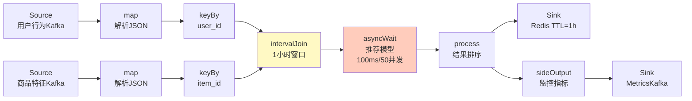

---

### 6.2 异常检测系统指纹

**业务描述**: 监控服务器CPU/内存指标，当连续5个采样点超过阈值且呈上升趋势时触发告警。

**指纹**:

```yaml
案例ID: CASE-ALERT-001
行业: 运维监控
数据特征: 低吞吐, 有序, 状态小
时间语义: 处理时间
状态规模: MB级
关键指标: 准确性优先

算子DAG:
  Source(Prometheus抓取) --> map(指标解析) -->
    keyBy(server_id) -->
    KeyedProcessFunction {
      ValueState: 上一个值
      ListState: 最近5个值
      Timer: 5分钟无数据重置
      Logic: 连续5个递增且超阈值 → 告警
    } -->
    Sink(AlertManager)

  KeyedProcessFunction --> sideOutput(正常指标) --> Sink(时序数据库)

核心算子: [keyBy, KeyedProcessFunction, Sink]
辅助算子: [map, sideOutput, Timer]
最大状态算子: KeyedProcessFunction (ListState: 5个值/键)
热点瓶颈算子: KeyedProcessFunction (逐事件处理，无法并行)
```

---

### 6.3 实时风控系统指纹

**业务描述**: 检测支付欺诈模式：同一用户在短时间内（30秒）从多个不同地点发起支付。

**指纹**:

```yaml
案例ID: CASE-RISK-001
行业: 金融
数据特征: 高吞吐, 严格低延迟, 复杂模式
时间语义: 事件时间
状态规模: GB级
关键指标: 延迟优先(<50ms), 准确性优先

算子DAG:
  Source(支付事件Kafka) --> map(解析) -->
    keyBy(user_id) -->
    CEP.pattern {
      pattern: 连续3次支付
      where: 每次支付location不同
      within: 30秒
    } -->
    PatternProcessFunction {
      命中模式 → 高风险标记
    } -->
    Sink(风控决策引擎)

核心算子: [keyBy, CEP.pattern, PatternProcessFunction]
辅助算子: [map]
最大状态算子: CEP.pattern (NFA状态机 + 事件缓冲)
热点瓶颈算子: CEP.pattern (模式匹配计算密集)
```

---

### 6.4 日志分析平台指纹

**业务描述**: 实时分析Nginx访问日志，统计每分钟的PV/UV、错误率、平均响应时间。

**指纹**:

```yaml
案例ID: CASE-LOG-001
行业: 互联网
数据特征: 极高吞吐, 无序, 无状态转换为主
时间语义: 事件时间
状态规模: GB级 (窗口状态)
关键指标: 吞吐优先

算子DAG:
  Source(File/Kafka日志) --> map(日志解析) -->
    keyBy(url_path) -->
    window(TumblingEventTimeWindow.of(1min)) -->
    aggregate(AggregateFunction: PV/UV/错误率/平均RT) -->
    Sink(MySQL/ClickHouse)

核心算子: [map, keyBy, window, aggregate, Sink]
辅助算子: []
最大状态算子: window (每分钟每个URL的聚合状态)
热点瓶颈算子: aggregate (增量计算竞争)
```

---

### 6.5 IoT 设备监控指纹

**业务描述**: 10万台传感器每10秒上报温度/湿度，实时检测设备离线并计算区域平均值。

**指纹**:

```yaml
案例ID: CASE-IOT-001
行业: 物联网
数据特征: 超高并发数据源, 乱序严重, 部分数据缺失
时间语义: 事件时间
状态规模: TB级 (10万键 × 多窗口)
关键指标: 准确性优先

算子DAG:
  Source(MQTT Broker) --> map(设备消息解析) -->
    keyBy(device_id) -->
    window(SlidingEventTimeWindow.of(5min, 1min)) -->
    aggregate(avg温度, avg湿度) -->
    process(离线检测: 10分钟无数据) -->
    Sink(时序数据库InfluxDB)

  aggregate --> sideOutput(区域聚合) -->
    keyBy(region_id) --> window(1min) --> Sink

核心算子: [keyBy, window, aggregate, process, Sink]
辅助算子: [map, sideOutput]
最大状态算子: window (SlidingWindow重叠导致状态膨胀)
热点瓶颈算子: keyBy (设备ID可能不均匀分布)
```

---

### 6.6 实时数仓 ETL 指纹

**业务描述**: 将业务数据库CDC流实时转换为星型模型，写入数据湖。

**指纹**:

```yaml
案例ID: CASE-DWH-001
行业: 数据工程
数据特征: 多表关联,  Schema变更,  exactly-once要求
时间语义: 事件时间
状态规模: TB级
关键指标: 准确性优先(exactly-once)

算子DAG:
  Source(MySQL CDC) --> map(Debezium解析) -->
    split(按表名分流) -->
      Branch(订单表): map(维度提取) --> temporalJoin(用户维表) -->
        map(星型模型转换) --> Sink(Iceberg, upsert)
      Branch(用户表): map(维度更新) -->
        Sink(维表Redis + 主表Iceberg)
      Branch(商品表): map(维度更新) -->
        Sink(维表Redis + 主表Iceberg)

核心算子: [Source, map, split, temporalJoin, Sink]
辅助算子: []
最大状态算子: temporalJoin (维表缓存)
热点瓶颈算子: Sink (Iceberg两阶段提交延迟)
```

### 6.7 金融实时风控-信用卡欺诈检测指纹

**业务描述**: 基于 Flink CEP 检测信用卡欺诈模式，覆盖"卡片测试"（多次小额试探后大额消费）、速度异常（同一卡号短时间内跨地域消费）及退款套现等复杂模式。生产环境中 fraud detection time 从小时级压缩至秒级，欺诈交易下降 30%[^7]。

**指纹**:

```yaml
案例ID: CASE-FIN-001
行业: 金融
数据特征: 高吞吐, 严格低延迟, 复杂模式, 关联复杂
时间语义: 事件时间
状态规模: GB级
关键指标: 延迟优先(<100ms), 准确性优先

算子DAG:
  Source(交易事件Kafka) --> map(解析+标准化) -->
    keyBy(card_id) --> CEP.pattern {
      pattern: 卡片测试模式
      sequence: begin("small-tests").where(amount < 1.0).times(3)
                .followedBy("large-purchase").where(amount > 500)
      within: 10分钟
    } --> PatternProcessFunction {
      命中模式 → 高风险标记 + 特征提取
    } --> map(风险评分融合) --> Sink(风控决策Kafka)

  keyBy(card_id) --> KeyedProcessFunction(速度检查) {
    ValueState: 上一笔交易(位置, 时间)
    Logic: 地理距离/时间差 > 最大可能速度 → 速度异常告警
    Timer: 5分钟未交易则清除状态
  } --> Sink(风控决策Kafka)

  map(解析) --> sideOutput(可疑交易日志) --> Sink(审计HDFS)

核心算子: [keyBy, CEP.pattern, PatternProcessFunction, KeyedProcessFunction, Sink]
辅助算子: [map, sideOutput, Timer]
最大状态算子: CEP.pattern (NFA状态机 + 事件时间缓冲队列)
热点瓶颈算子: CEP.pattern (模式匹配计算密集，单键事件序列串行处理)
```

**Mermaid DAG**:

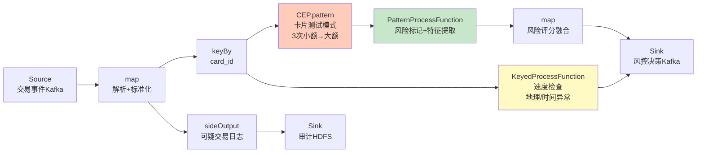

**设计模式映射**: CEP + Event Time Processing + Stateful Computation [cep](../../02-design-patterns/pattern-cep-complex-event.md), [event-time](../../02-design-patterns/pattern-event-time-processing.md)

---

### 6.8 智能制造-产线质量检测指纹

**业务描述**: 汽车/电子制造产线，每秒钟上千个 IoT 传感器上报温度、压力、振动数据，实时检测异常工况并预测质量缺陷。采用 3-sigma 控制图规则与在线 ML 推理双路并行，实现 sub-second 检测延迟与 25% 非计划停机减少[^8]。

**指纹**:

```yaml
案例ID: CASE-MFG-001
行业: 智能制造
数据特征: 超高并发数据源, 有序, 多维指标, 状态中等
时间语义: 事件时间
状态规模: GB级
关键指标: 延迟优先(<500ms), 准确性优先

算子DAG:
  Source(MQTT Broker) --> map(传感器标准化) --> keyBy(production_line_id)

  keyBy(production_line_id) --> KeyedProcessFunction(统计过程控制) {
    ValueState: 滑动窗口统计量(均值μ, 标准差σ)
    Logic: |x - μ| > 3σ → 异常标记
  } --> CoProcessFunction(关联工单信息) --> map(缺陷等级分类) -->
    Sink(Andon告警+MES系统)

  map(标准化) --> keyBy(machine_id) -->
    window(SlidingEventTimeWindow.of(5min, 10s)) -->
    aggregate(统计特征: 均值/方差/峰度) -->
    asyncWait(在线ML推理, 50ms, 100并发) -->
    map(质量预测结果) --> Sink(MES)

  KeyedProcessFunction --> sideOutput(正常指标) --> Sink(InfluxDB)

核心算子: [keyBy, KeyedProcessFunction, CoProcessFunction, asyncWait, window, aggregate]
辅助算子: [map, sideOutput]
最大状态算子: KeyedProcessFunction (每产线滑动窗口μ/σ状态)
热点瓶颈算子: asyncWait (ML推理服务延迟)
```

**Mermaid DAG**:

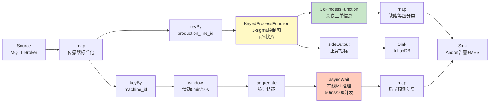

**设计模式映射**: Stateful Computation + Async I/O Enrichment + Side Output [stateful](../../02-design-patterns/pattern-stateful-computation.md), [async-io](../../02-design-patterns/pattern-async-io-enrichment.md), [side-output](../../02-design-patterns/pattern-side-output.md)

---

### 6.9 社交媒体-实时热搜计算指纹

**业务描述**: 微博/推特类平台，实时计算全站 trending 话题。综合关键词出现频率、用户参与度（转评赞权重）、传播加速度的多维度热度分，每 5 秒更新全局 TopN 排名[^9]。

**指纹**:

```yaml
案例ID: CASE-SOC-001
行业: 社交媒体
数据特征: 极高吞吐, 无序严重, 全局聚合, 热点键集中
时间语义: 事件时间
状态规模: GB级
关键指标: 吞吐优先, 延迟优先(<1s)

算子DAG:
  Source(Kafka用户发布流) --> map(内容解析) -->
    flatMap(分词+提取话题标签) --> filter(过滤停用词) -->
    keyBy(hashtag) -->
    window(SlidingEventTimeWindow.of(10min, 5s)) -->
    aggregate(热度分聚合 {
      count: 加权计数(原创1.0/转发0.6/评论0.4)
      uv: 去重用户SetState
      velocity: (当前count - 上一窗口count) / Δt
      score: α*count + β*uv + γ*velocity
    }) --> process(全局TopN计算 {
      ListState: 当前窗口所有hashtag得分
      Timer: 每5秒emit一次全局Top50
    }) --> Sink(Redis, TTL=10min)

  aggregate --> sideOutput(长尾话题) --> Sink(ClickHouse归档)

核心算子: [flatMap, keyBy, window, aggregate, process, Sink]
辅助算子: [map, filter, sideOutput]
最大状态算子: window (SlidingWindow 10min/5s 导致状态膨胀)
热点瓶颈算子: process (全局排序热点键，单点聚合)
```

**Mermaid DAG**:

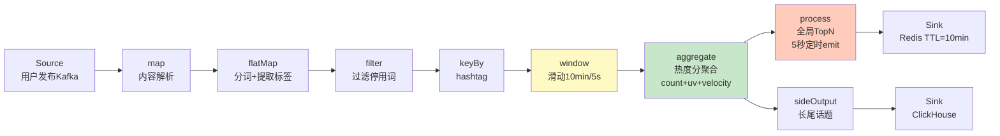

**设计模式映射**: Windowed Aggregation + Broadcast State (热度权重配置) + Side Output [windowed](../../02-design-patterns/pattern-windowed-aggregation.md), Broadcast State

---

### 6.10 游戏-实时对战匹配指纹

**业务描述**: 多人在线竞技游戏（MOBA/FPS），基于玩家实时段位、网络延迟、偏好模式进行秒级匹配；同时通过 CEP 分析玩家行为序列检测作弊（瞬移、自瞄、异常伤害模式）[^10]。

**指纹**:

```yaml
案例ID: CASE-GAM-001
行业: 游戏
数据特征: 高并发请求, 严格低延迟, 状态中等, 模式复杂
时间语义: 处理时间
状态规模: GB级
关键指标: 延迟优先(<200ms)

算子DAG:
  Source(匹配请求HTTP) --> map(请求解析) -->
    keyBy(player_id) --> window(SessionWindow.withGap(30s)) -->
    process(玩家画像聚合 {
      ValueState: 段位/历史胜率/平均延迟/偏好模式
      Logic: 30秒会话期内聚合最近匹配请求
    }) --> asyncWait(匹配评分服务, 20ms, 200并发) -->
    KeyedProcessFunction(匹配池管理) {
      ListState: 待匹配玩家池
      Timer: 每2秒触发匹配算法
      Logic: 基于ELO+延迟+模式的贪心匹配
    } --> Sink(游戏服务器)

  Source(游戏事件Kafka) --> map(事件标准化) -->
    keyBy(player_id) --> CEP.pattern(瞬移检测) {
      pattern: 连续MOVE事件
      where: distance(start, end)/Δt > MAX_PLAYER_SPEED
      within: 100ms
    } --> PatternProcessFunction --> Sink(反作弊系统)

核心算子: [keyBy, window, process, asyncWait, KeyedProcessFunction, CEP.pattern]
辅助算子: [map, Timer]
最大状态算子: KeyedProcessFunction (匹配池ListState)
热点瓶颈算子: asyncWait (外部评分服务RTT)
```

**Mermaid DAG**:

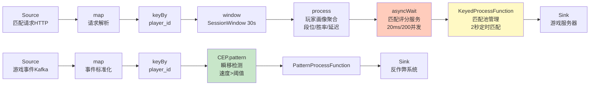

**设计模式映射**: CEP + Async I/O Enrichment + Session Window + Iterative Stream [cep](../../02-design-patterns/pattern-cep-complex-event.md), [async-io](../../02-design-patterns/pattern-async-io-enrichment.md), Session Window

---

### 6.11 物流供应链-订单履约跟踪指纹

**业务描述**: 电商/快递物流全链路实时跟踪，覆盖下单→揽收→中转→派送→签收。检测履约异常（揽收超时、冷链温度偏离、路线偏离），并基于实时 GPS 流动态计算 ETA 与路径优化建议[^11]。

**指纹**:

```yaml
案例ID: CASE-LOG-002
行业: 物流供应链
数据特征: 多源异构, 乱序中等, 生命周期长, 关联复杂
时间语义: 事件时间
状态规模: TB级
关键指标: 准确性优先, 延迟优先(<1s)

算子DAG:
  Source(Kafka订单事件: 下单/揽收/中转/派送/签收) -->
    map(事件标准化) --> keyBy(order_id) -->
    KeyedProcessFunction(订单状态机) {
      ValueState: 订单全生命周期状态(已下单/已揽收/运输中/派送中/已签收)
      MapState: 子订单/包裹列表
      Timer: 揽收后24h未更新→超时告警; 派送后2h未签收→催派
      Logic: 状态转换验证 + 异常规则匹配
    } --> CoProcessFunction(关联GPS流) {
      订单状态 JOIN GPS位置流 (temporalJoin, 5min缓存)
    } --> map(路径偏差计算: 实际路线 vs 规划路线) -->
    Sink(履约监控中心)

  GPS[Source(Kafka GPS)] --> map(GPS解析) --> keyBy(vehicle_id) -->
    window(SlidingEventTimeWindow.of(15min, 1min)) -->
    aggregate(平均速度/拥堵指数/预估到达时间) -->
    map(路径优化建议) --> Sink(调度中心)

核心算子: [keyBy, KeyedProcessFunction, CoProcessFunction, Timer, window, aggregate]
辅助算子: [map, temporalJoin]
最大状态算子: KeyedProcessFunction (订单生命周期MapState)
热点瓶颈算子: CoProcessFunction (GPS流高并发关联)
```

**Mermaid DAG**:

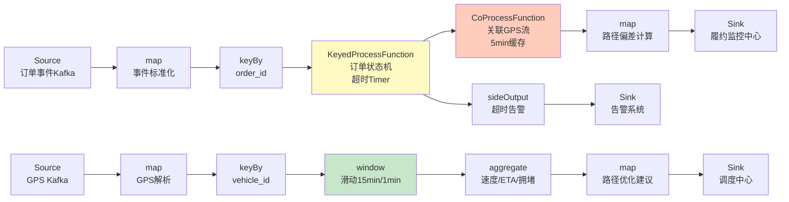

**设计模式映射**: Stateful Computation + Temporal Join + CEP (超时模式) + Side Output [stateful](../../02-design-patterns/pattern-stateful-computation.md), Temporal Join, [cep](../../02-design-patterns/pattern-cep-complex-event.md)

---

### 6.12 医疗监测-生命体征监控指纹

**业务描述**: ICU/远程患者监测场景，多参数生命体征（心率、血氧、血压、呼吸频率、体温）实时流，基于早期预警评分（MEWS/qSOFA）触发分级告警。系统需在数秒内识别脓毒症早期征象，将 code blue 事件降低 25%[^12]。

**指纹**:

```yaml
案例ID: CASE-MED-001
行业: 医疗
数据特征: 多源设备, 乱序中等, 高可靠要求, 状态中等
时间语义: 事件时间
状态规模: GB级
关键指标: 延迟优先(<1s), 准确性优先

算子DAG:
  Source(MQTT/HL7医疗设备) --> map(体征标准化+单位换算) -->
    keyBy(patient_id) --> KeyedProcessFunction(复合评分引擎) {
      ValueState: 各体征最近值+时间戳
      ListState: 最近5分钟体征序列
      Timer: 5秒定时检查（无新数据也评估）
      Logic: MEWS/qSOFA复合评分计算
        HR≥130 → +3; RR≥30 → +3; SpO2<90 → +3; SBP<90 → +3
        总分≥5 → 红色告警; 3-4 → 黄色预警; <3 → 绿色正常
    } --> map(告警分级: 绿/黄/红) --> Sink(护士站+EMR系统)

  keyBy(patient_id) --> CEP.pattern(休克早期模式) {
    pattern: 连续体征事件
    where: HR>120 AND SBP<90 持续5分钟
    within: 10分钟
  } --> PatternProcessFunction --> Sink(紧急响应系统)

  KeyedProcessFunction --> sideOutput(正常体征) --> Sink(时序数据库)

核心算子: [keyBy, KeyedProcessFunction, CEP.pattern, PatternProcessFunction, Timer]
辅助算子: [map, sideOutput]
最大状态算子: KeyedProcessFunction (ListState: 5分钟体征序列/患者)
热点瓶颈算子: KeyedProcessFunction (逐患者评分计算密集)
```

**Mermaid DAG**:

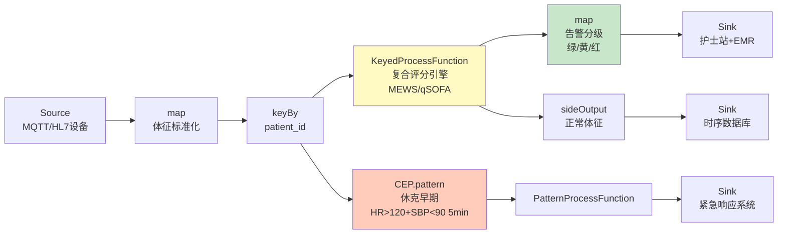

**设计模式映射**: Stateful Computation + CEP + Side Output + Timer [stateful](../../02-design-patterns/pattern-stateful-computation.md), [cep](../../02-design-patterns/pattern-cep-complex-event.md), [side-output](../../02-design-patterns/pattern-side-output.md)

---

### 6.13 广告投放-实时竞价RTB指纹

**业务描述**: DSP 平台处理每秒百万级 OpenRTB 竞价请求，实时查询用户画像、计算竞价策略、执行频次控制与预算消耗跟踪。整个竞价闭环需在 100ms 内完成，其中特征工程与决策延迟占主导[^13]。

**指纹**:

```yaml
案例ID: CASE-AD-001
行业: 广告投放
数据特征: 极高吞吐, 严格低延迟(<100ms), 状态大, 关联复杂
时间语义: 处理时间
状态规模: TB级
关键指标: 延迟优先(<50ms), 吞吐优先

算子DAG:
  Source(Kafka竞价请求OpenRTB) --> map(请求解析+特征提取) -->
    asyncWait(用户画像查询Redis, 5ms, 500并发) -->
    map(特征向量构建: 用户+广告+上下文+交叉特征) -->
    process(竞价决策引擎) {
      BroadcastState: 全局预算规则+频次上限
      ValueState: 广告主实时消耗
      Logic: 预算检查 AND 频次检查 AND 出价计算(CTR*pCVR*CPA)
    } --> Sink(Kafka竞价响应)

  Source(Kafka曝光/点击/转化) --> map(反馈事件解析) -->
    keyBy(user_id) --> KeyedProcessFunction(画像增量更新) {
      ValueState: 用户频次计数+最近互动时间
      Logic: 增量更新用户画像特征(CTR偏置/兴趣衰减)
    } --> Sink(Redis画像更新)

  keyBy(advertiser_id) --> KeyedProcessFunction(预算跟踪) {
    ReducingState: 小时级消耗累加
    Timer: 每小时检查预算阈值
    Logic: 超预算 → 暂停投放信号
  } --> Sink(预算控制Kafka)

核心算子: [asyncWait, process, keyBy, KeyedProcessFunction, BroadcastState]
辅助算子: [map, Timer, ReducingState]
最大状态算子: KeyedProcessFunction (用户频次与互动状态)
热点瓶颈算子: asyncWait (画像查询延迟与并发竞争)
```

**Mermaid DAG**:

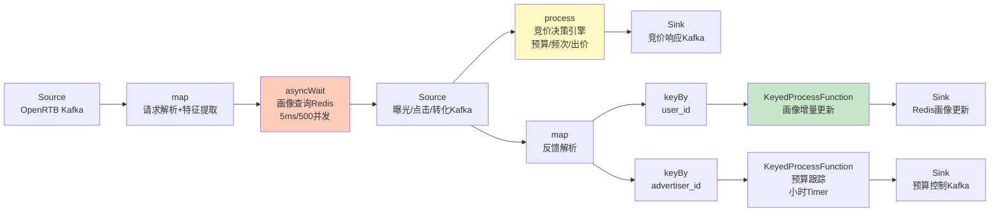

**设计模式映射**: Async I/O Enrichment + Stateful Computation + Broadcast State (预算规则) [async-io](../../02-design-patterns/pattern-async-io-enrichment.md), [stateful](../../02-design-patterns/pattern-stateful-computation.md), Broadcast State

---

### 6.14 能源电网-智能电表聚合指纹

**业务描述**: 智能电网场景，千万级智能电表每 15 分钟上报用电量。实时计算区域负荷曲线、峰谷差、异常用电检测（窃电/故障），支持电网调度与动态电价策略[^14]。

**指纹**:

```yaml
案例ID: CASE-ENE-001
行业: 能源电网
数据特征: 海量数据源, 周期性, 数据倾斜(热门区域), 状态大
时间语义: 事件时间
状态规模: TB级
关键指标: 吞吐优先, 准确性优先

算子DAG:
  Source(Kafka电表读数) --> map(数据清洗+格式校验) -->
    keyBy(meter_id) --> KeyedProcessFunction(用电连续性校验) {
      ValueState: 上一周期读数+时间戳
      Logic: 跳变检测(|当前-上次| > 3*历史平均) AND 倒转检测(当前<上次)
    } --> map(差值计算: 实际用电量 = 当前读数 - 上次读数) -->
    keyBy(region_id) --> window(TumblingEventTimeWindow.of(15min)) -->
    aggregate(区域聚合 {
      sum: 区域总负荷
      avg: 平均负荷
      max: 峰值负荷
      peak_valley_ratio: 峰谷比
    }) --> process(趋势预测 {
      ValueState: 历史同期负荷曲线
      Logic: 同比/环比偏差分析
    }) --> Sink(电网调度中心)

  aggregate --> sideOutput(区域明细) --> Sink(数据湖)

核心算子: [keyBy, KeyedProcessFunction, window, aggregate, process, Sink]
辅助算子: [map, sideOutput]
最大状态算子: window (区域聚合窗口状态，千万级电表×多区域)
热点瓶颈算子: keyBy(region_id) (热门城市/工业区数据倾斜)
```

**Mermaid DAG**:

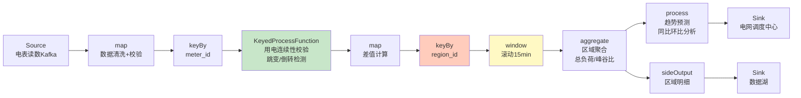

**设计模式映射**: Windowed Aggregation + Stateful Computation + Broadcast State (电价规则) [windowed](../../02-design-patterns/pattern-windowed-aggregation.md), [stateful](../../02-design-patterns/pattern-stateful-computation.md), Broadcast State

---

## 7. 可视化 (Visualizations)

### 图 7.1 案例-算子映射总览矩阵

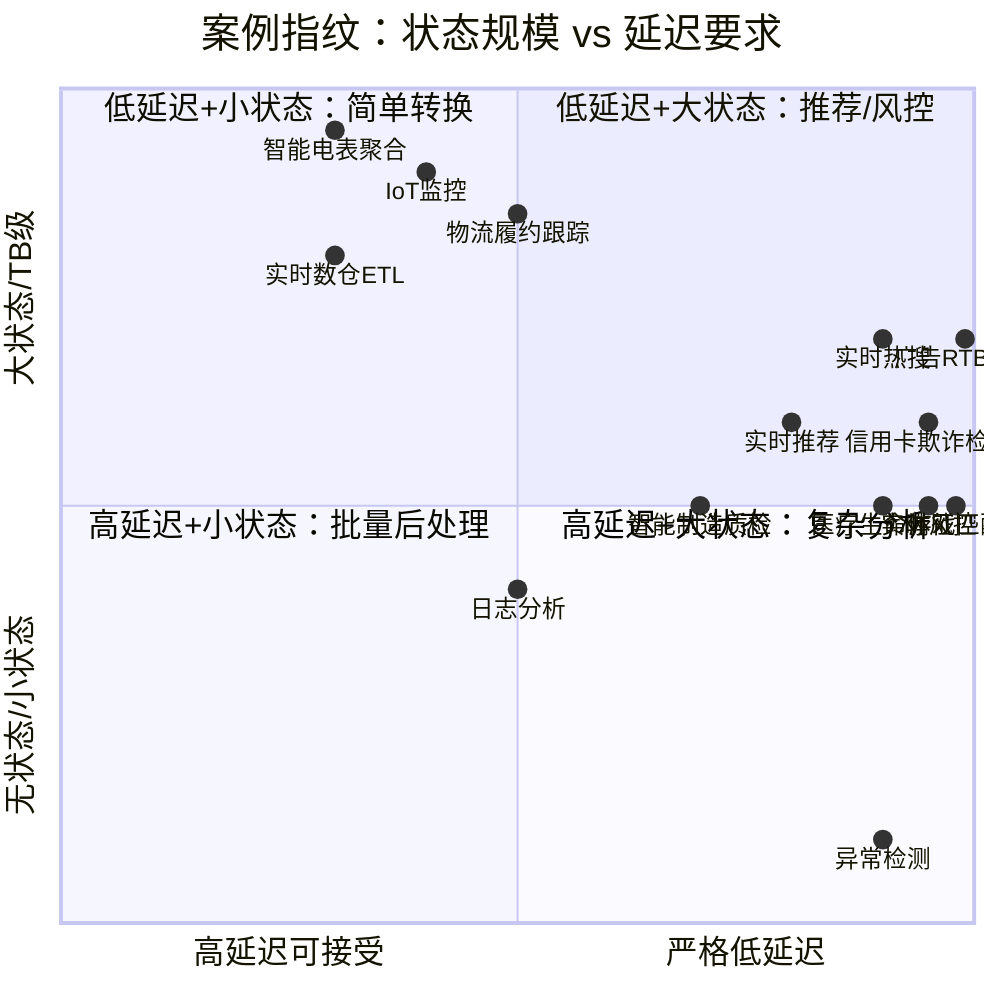

### 图 7.2 实时推荐算子 DAG

（见 §6.1 中的 Mermaid 图）

### 图 7.3 案例相似度聚类图

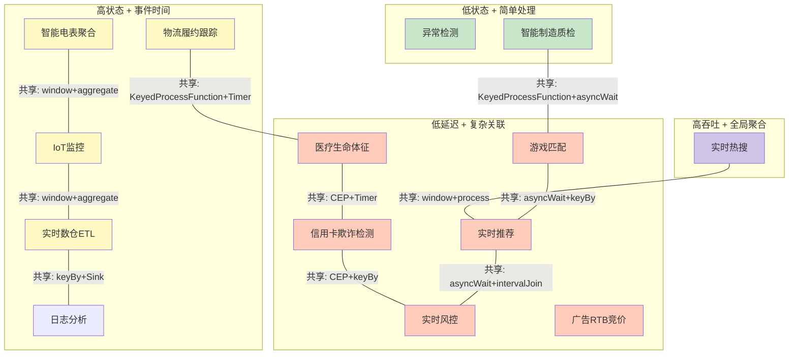

---

### 图 7.4 信用卡欺诈检测算子 DAG

（见 §6.7 中的 Mermaid 图）

### 图 7.5 智能制造质量检测算子 DAG

（见 §6.8 中的 Mermaid 图）

### 图 7.6 实时热搜计算算子 DAG

（见 §6.9 中的 Mermaid 图）

### 图 7.7 游戏实时匹配算子 DAG

（见 §6.10 中的 Mermaid 图）

### 图 7.8 物流履约跟踪算子 DAG

（见 §6.11 中的 Mermaid 图）

### 图 7.9 医疗生命体征监控算子 DAG

（见 §6.12 中的 Mermaid 图）

### 图 7.10 广告RTB竞价算子 DAG

（见 §6.13 中的 Mermaid 图）

### 图 7.11 智能电表聚合算子 DAG

（见 §6.14 中的 Mermaid 图）

---

## 8. 引用参考 (References)

[^1]: T. Akidau et al., "The Dataflow Model", PVLDB, 8(12), 2015.
[^7]: S. Vankayala et al., "From Streams to Security: Architecting a Production-Ready Fraud Pipeline with Flink and Kafka", IJERT, 2026.
[^8]: J. O. Akande et al., "Developing Scalable Data Pipelines for Real-Time Anomaly Detection in Industrial IoT Sensor Networks", IJETRM, 2023.
[^9]: Ververica, "Apache Flink Explained: Stream Processing Framework Guide", 2025.
[^10]: Conduktor, "Real-Time Gaming Analytics with Streaming", 2026.
[^11]: Conduktor, "Supply Chain Visibility with Real-Time Streaming", 2026.
[^12]: Conduktor, "Healthcare Data Streaming Use Cases", 2026.
[^13]: Codelit, "Ad Serving System Design: Real-Time Bidding, Auctions & Scale", 2026.
[^14]: S. Shetty, "Improving Processing of Real-Time Big Data in Smart Grids", NCIRL, 2020.


---

*关联文档*: [00-OPERATOR-PATTERN-INDEX.md](../../02-design-patterns/operator-pattern-mappings/00-OPERATOR-PATTERN-INDEX.md) | [streaming-operator-selection-decision-tree.md](../../04-technology-selection/operator-decision-tools/streaming-operator-selection-decision-tree.md) | [03.05-stream-operator-taxonomy.md](../../../Struct/03-relationships/03.05-stream-operator-taxonomy.md)
