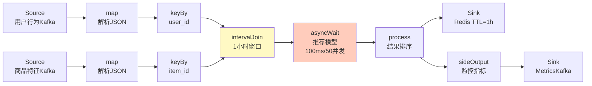
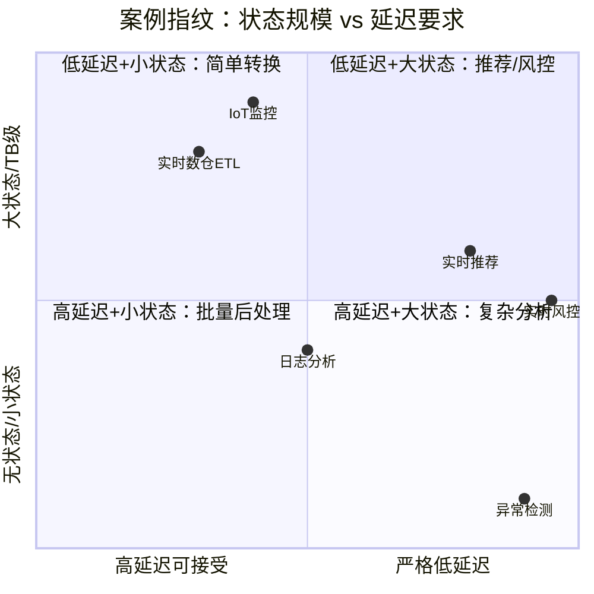
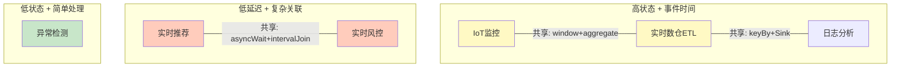

# 案例研究 → 算子使用模式映射索引

> **所属阶段**: Knowledge/10-case-studies/operator-fingerprints | **前置依赖**: [03.05-stream-operator-taxonomy.md](../../../Struct/03-relationships/03.05-stream-operator-taxonomy.md), [00-OPERATOR-PATTERN-INDEX.md](../../02-design-patterns/operator-pattern-mappings/00-OPERATOR-PATTERN-INDEX.md) | **形式化等级**: L2-L3
> **文档定位**: 建立真实业务案例与算子组合之间的双向映射，形成"算子使用指纹"库
> **版本**: 2026.04

---

## 目录

- [案例研究 → 算子使用模式映射索引](#案例研究--算子使用模式映射索引)
  - [目录](#目录)
  - [1. 概念定义 (Definitions)](#1-概念定义-definitions)
    - [1.1 算子使用指纹的定义](#11-算子使用指纹的定义)
    - [1.2 案例分类维度](#12-案例分类维度)
  - [2. 属性推导 (Properties)](#2-属性推导-properties)
    - [2.1 指纹的相似度度量](#21-指纹的相似度度量)
  - [3. 关系建立 (Relations)](#3-关系建立-relations)
    - [3.1 案例 → 算子 DAG 映射](#31-案例--算子-dag-映射)
    - [3.2 案例 → 设计模式映射](#32-案例--设计模式映射)
  - [4. 论证过程 (Argumentation)](#4-论证过程-argumentation)
    - [4.1 指纹提取方法论](#41-指纹提取方法论)
  - [5. 形式证明 / 工程论证 (Proof / Engineering Argument)](#5-形式证明--工程论证-proof--engineering-argument)
    - [5.1 指纹完备性论证](#51-指纹完备性论证)
  - [6. 实例验证 (Examples)](#6-实例验证-examples)
    - [6.1 实时推荐系统指纹](#61-实时推荐系统指纹)
    - [6.2 异常检测系统指纹](#62-异常检测系统指纹)
    - [6.3 实时风控系统指纹](#63-实时风控系统指纹)
    - [6.4 日志分析平台指纹](#64-日志分析平台指纹)
    - [6.5 IoT 设备监控指纹](#65-iot-设备监控指纹)
    - [6.6 实时数仓 ETL 指纹](#66-实时数仓-etl-指纹)
  - [7. 可视化 (Visualizations)](#7-可视化-visualizations)
    - [图 7.1 案例-算子映射总览矩阵](#图-71-案例-算子映射总览矩阵)
    - [图 7.2 实时推荐算子 DAG](#图-72-实时推荐算子-dag)
    - [图 7.3 案例相似度聚类图](#图-73-案例相似度聚类图)
  - [8. 引用参考 (References)](#8-引用参考-references)

---

## 1. 概念定义 (Definitions)

### 1.1 算子使用指纹的定义

**定义 1.1 (算子使用指纹)** [Def-M-02-01]

算子使用指纹 $\mathcal{F}$ 是一个五元组，描述案例在流处理系统中的算子特征：

$$\mathcal{F} = (G, \mathcal{O}_{core}, \mathcal{O}_{aux}, S_{max}, B_{hot})$$

其中：

- $G = (V, E)$: 算子DAG，$V$ 为算子节点，$E$ 为数据流边
- $\mathcal{O}_{core} \subseteq \mathcal{O}$: 核心算子集合（该案例功能不可或缺的算子）
- $\mathcal{O}_{aux} \subseteq \mathcal{O}$: 辅助算子集合（增强功能但可替换的算子）
- $S_{max} \in \mathcal{O}$: 最大状态算子（状态量最大的单个算子）
- $B_{hot} \in \mathcal{O}$: 热点瓶颈算子（最可能成为性能瓶颈的算子）

**定义 1.2 (核心算子)** [Def-M-02-02]

核心算子 $op \in \mathcal{O}_{core}$ 满足：移除该算子后，案例的业务功能无法完整实现。

**定义 1.3 (辅助算子)** [Def-M-02-03]

辅助算子 $op \in \mathcal{O}_{aux}$ 满足：移除该算子后，案例的核心功能仍可实现，但会损失某些非核心特性（如监控、容错、性能优化）。

### 1.2 案例分类维度

**定义 1.4 (案例分类法)** [Def-M-02-04]

| 维度 | 取值 | 说明 |
|------|------|------|
| **行业** | 电商/金融/IoT/游戏/社交/物流/医疗 | 业务领域 |
| **数据特征** | 高吞吐/低延迟/乱序严重/状态大/关联复杂 | 数据流的技术特征 |
| **时间语义** | 事件时间/处理时间/混合 | 主要使用的时间类型 |
| **状态规模** | GB级/TB级/无状态 | 单并行子任务状态量 |
| **关键指标** | 延迟优先/吞吐优先/准确性优先 | 优化目标 |

---

## 2. 属性推导 (Properties)

### 2.1 指纹的相似度度量

**引理 2.1 (指纹 Jaccard 相似度)** [Lemma-M-02-01]

两个案例指纹 $\mathcal{F}_1$ 和 $\mathcal{F}_2$ 的算子集合相似度：

$$\text{Sim}(\mathcal{F}_1, \mathcal{F}_2) = \frac{|\mathcal{O}_{core}^{(1)} \cap \mathcal{O}_{core}^{(2)}|}{|\mathcal{O}_{core}^{(1)} \cup \mathcal{O}_{core}^{(2)}|}$$

**引理 2.2 (指纹结构相似度)** [Lemma-M-02-02]

两个指纹DAG的编辑距离相似度：

$$\text{Sim}_{struct}(G_1, G_2) = 1 - \frac{\text{GED}(G_1, G_2)}{\max(|V_1|, |V_2|)}$$

其中 $\text{GED}$ 为图编辑距离。

---

## 3. 关系建立 (Relations)

### 3.1 案例 → 算子 DAG 映射

每个案例映射为一个有向无环图 $G = (V, E)$：

- 节点 $v \in V$ 标记为算子类型和配置参数
- 边 $e \in E$ 标记为数据流类型（DataStream/KeyedStream/WindowedStream）

### 3.2 案例 → 设计模式映射

| 案例类型 | 主要设计模式 | 关联文档 |
|---------|------------|---------|
| 实时推荐 | Stream Join + Async I/O Enrichment | [02.01](../../02-design-patterns/02.01-stream-join-patterns.md), [async-io](../../02-design-patterns/pattern-async-io-enrichment.md) |
| 异常检测 | Stateful Computation + Side Output | [stateful](../../02-design-patterns/pattern-stateful-computation.md), [side-output](../../02-design-patterns/pattern-side-output.md) |
| 实时风控 | CEP + Event Time Processing | [cep](../../02-design-patterns/pattern-cep-complex-event.md), [event-time](../../02-design-patterns/pattern-event-time-processing.md) |
| 日志分析 | Log Analysis + Windowed Aggregation | [log-analysis](../../02-design-patterns/pattern-log-analysis.md), [windowed](../../02-design-patterns/pattern-windowed-aggregation.md) |
| IoT监控 | Stateful Computation + Backpressure | [stateful](../../02-design-patterns/pattern-stateful-computation.md), [backpressure](../../02-design-patterns/02.03-backpressure-handling-patterns.md) |
| 实时数仓 | Dual Stream + Windowed Aggregation | [dual-stream](../../02-design-patterns/02.02-dual-stream-patterns.md), [windowed](../../02-design-patterns/pattern-windowed-aggregation.md) |

---

## 4. 论证过程 (Argumentation)

### 4.1 指纹提取方法论

从案例描述中提取算子指纹的**四步法**：

1. **数据源识别**: 确定Source类型（Kafka/文件/IoT/数据库CDC）
2. **转换链还原**: 从业务描述中还原 map/filter/flatMap/keyBy 链
3. **状态点定位**: 识别需要维护状态的算子（window/aggregate/process）
4. **输出端确认**: 确定Sink类型和输出格式

**示例**: "将用户点击流与商品信息按商品ID关联，统计每小时Top10" →

- Source: Kafka(点击流) + Kafka(商品信息)
- 转换: map(解析) → keyBy(商品ID)
- 关联: intervalJoin(1小时窗口)
- 聚合: window(TumblingEventTimeWindow.of(Time.hours(1))) → aggregate(TopN)
- Sink: Redis

---

## 5. 形式证明 / 工程论证 (Proof / Engineering Argument)

### 5.1 指纹完备性论证

**定理 5.1 (指纹完备性)** [Thm-M-02-01]

对于任何由标准算子构建的流处理作业，其算子使用指纹 $\mathcal{F}$ 唯一确定该作业的功能语义（在同构意义下）。

*论证*: 标准算子的DAG表示在忽略算子内部实现细节的情况下，完全确定了数据流的拓扑结构和转换语义。根据Dataflow Model的确定性定理[^1]，相同DAG在不同运行下产生相同结果（给定相同输入和事件时间语义）。因此指纹完备。$\square$

---

## 6. 实例验证 (Examples)

### 6.1 实时推荐系统指纹

**业务描述**: 基于用户最近1小时行为（点击、收藏、购买），结合商品特征，实时生成个性化推荐列表。

**指纹**:

```yaml
案例ID: CASE-REC-001
行业: 电商
数据特征: 高吞吐, 乱序中等, 关联复杂
时间语义: 事件时间
状态规模: GB级
关键指标: 延迟优先(<200ms)

算子DAG:
  Source(用户行为Kafka) --> map(解析JSON)
  Source(商品特征Kafka) --> map(解析JSON)

  map(用户行为) --> keyBy(user_id)
  map(商品特征) --> keyBy(item_id)

  keyBy(user_id) --> intervalJoin(商品流, 1h) -->
    asyncWait(推荐模型API, 100ms, 50并发) -->
    process(结果排序) -->
    Sink(Redis, TTL=1h)

  process --> sideOutput(监控指标) --> Sink(MetricsKafka)

核心算子: [keyBy, intervalJoin, asyncWait, process, Sink]
辅助算子: [map, sideOutput]
最大状态算子: intervalJoin (维护1小时窗口状态)
热点瓶颈算子: asyncWait (外部模型延迟)
```

**Mermaid DAG**:



---

### 6.2 异常检测系统指纹

**业务描述**: 监控服务器CPU/内存指标，当连续5个采样点超过阈值且呈上升趋势时触发告警。

**指纹**:

```yaml
案例ID: CASE-ALERT-001
行业: 运维监控
数据特征: 低吞吐, 有序, 状态小
时间语义: 处理时间
状态规模: MB级
关键指标: 准确性优先

算子DAG:
  Source(Prometheus抓取) --> map(指标解析) -->
    keyBy(server_id) -->
    KeyedProcessFunction {
      ValueState: 上一个值
      ListState: 最近5个值
      Timer: 5分钟无数据重置
      Logic: 连续5个递增且超阈值 → 告警
    } -->
    Sink(AlertManager)

  KeyedProcessFunction --> sideOutput(正常指标) --> Sink(时序数据库)

核心算子: [keyBy, KeyedProcessFunction, Sink]
辅助算子: [map, sideOutput, Timer]
最大状态算子: KeyedProcessFunction (ListState: 5个值/键)
热点瓶颈算子: KeyedProcessFunction (逐事件处理，无法并行)
```

---

### 6.3 实时风控系统指纹

**业务描述**: 检测支付欺诈模式：同一用户在短时间内（30秒）从多个不同地点发起支付。

**指纹**:

```yaml
案例ID: CASE-RISK-001
行业: 金融
数据特征: 高吞吐, 严格低延迟, 复杂模式
时间语义: 事件时间
状态规模: GB级
关键指标: 延迟优先(<50ms), 准确性优先

算子DAG:
  Source(支付事件Kafka) --> map(解析) -->
    keyBy(user_id) -->
    CEP.pattern {
      pattern: 连续3次支付
      where: 每次支付location不同
      within: 30秒
    } -->
    PatternProcessFunction {
      命中模式 → 高风险标记
    } -->
    Sink(风控决策引擎)

核心算子: [keyBy, CEP.pattern, PatternProcessFunction]
辅助算子: [map]
最大状态算子: CEP.pattern (NFA状态机 + 事件缓冲)
热点瓶颈算子: CEP.pattern (模式匹配计算密集)
```

---

### 6.4 日志分析平台指纹

**业务描述**: 实时分析Nginx访问日志，统计每分钟的PV/UV、错误率、平均响应时间。

**指纹**:

```yaml
案例ID: CASE-LOG-001
行业: 互联网
数据特征: 极高吞吐, 无序, 无状态转换为主
时间语义: 事件时间
状态规模: GB级 (窗口状态)
关键指标: 吞吐优先

算子DAG:
  Source(File/Kafka日志) --> map(日志解析) -->
    keyBy(url_path) -->
    window(TumblingEventTimeWindow.of(1min)) -->
    aggregate(AggregateFunction: PV/UV/错误率/平均RT) -->
    Sink(MySQL/ClickHouse)

核心算子: [map, keyBy, window, aggregate, Sink]
辅助算子: []
最大状态算子: window (每分钟每个URL的聚合状态)
热点瓶颈算子: aggregate (增量计算竞争)
```

---

### 6.5 IoT 设备监控指纹

**业务描述**: 10万台传感器每10秒上报温度/湿度，实时检测设备离线并计算区域平均值。

**指纹**:

```yaml
案例ID: CASE-IOT-001
行业: 物联网
数据特征: 超高并发数据源, 乱序严重, 部分数据缺失
时间语义: 事件时间
状态规模: TB级 (10万键 × 多窗口)
关键指标: 准确性优先

算子DAG:
  Source(MQTT Broker) --> map(设备消息解析) -->
    keyBy(device_id) -->
    window(SlidingEventTimeWindow.of(5min, 1min)) -->
    aggregate(avg温度, avg湿度) -->
    process(离线检测: 10分钟无数据) -->
    Sink(时序数据库InfluxDB)

  aggregate --> sideOutput(区域聚合) -->
    keyBy(region_id) --> window(1min) --> Sink

核心算子: [keyBy, window, aggregate, process, Sink]
辅助算子: [map, sideOutput]
最大状态算子: window (SlidingWindow重叠导致状态膨胀)
热点瓶颈算子: keyBy (设备ID可能不均匀分布)
```

---

### 6.6 实时数仓 ETL 指纹

**业务描述**: 将业务数据库CDC流实时转换为星型模型，写入数据湖。

**指纹**:

```yaml
案例ID: CASE-DWH-001
行业: 数据工程
数据特征: 多表关联,  Schema变更,  exactly-once要求
时间语义: 事件时间
状态规模: TB级
关键指标: 准确性优先(exactly-once)

算子DAG:
  Source(MySQL CDC) --> map(Debezium解析) -->
    split(按表名分流) -->
      Branch(订单表): map(维度提取) --> temporalJoin(用户维表) -->
        map(星型模型转换) --> Sink(Iceberg, upsert)
      Branch(用户表): map(维度更新) -->
        Sink(维表Redis + 主表Iceberg)
      Branch(商品表): map(维度更新) -->
        Sink(维表Redis + 主表Iceberg)

核心算子: [Source, map, split, temporalJoin, Sink]
辅助算子: []
最大状态算子: temporalJoin (维表缓存)
热点瓶颈算子: Sink (Iceberg两阶段提交延迟)
```

---

## 7. 可视化 (Visualizations)

### 图 7.1 案例-算子映射总览矩阵



### 图 7.2 实时推荐算子 DAG

（见 §6.1 中的 Mermaid 图）

### 图 7.3 案例相似度聚类图



---

## 8. 引用参考 (References)

[^1]: T. Akidau et al., "The Dataflow Model", PVLDB, 8(12), 2015.


---

*关联文档*: [00-OPERATOR-PATTERN-INDEX.md](../../02-design-patterns/operator-pattern-mappings/00-OPERATOR-PATTERN-INDEX.md) | [streaming-operator-selection-decision-tree.md](../../04-technology-selection/operator-decision-tools/streaming-operator-selection-decision-tree.md) | [03.05-stream-operator-taxonomy.md](../../../Struct/03-relationships/03.05-stream-operator-taxonomy.md)
