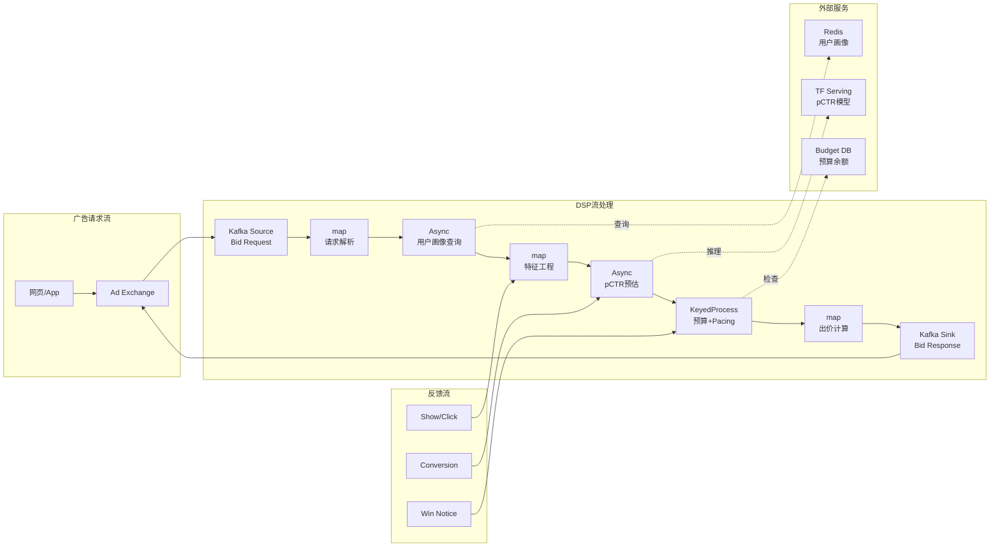
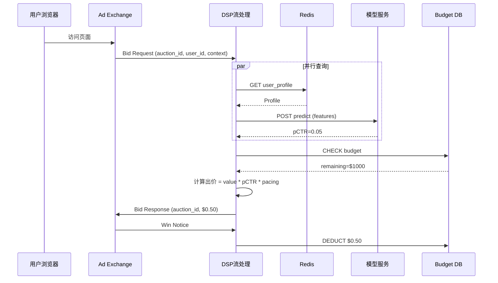

# 算子与实时广告竞价（RTB）系统

> **所属阶段**: Knowledge/10-case-studies | **前置依赖**: [01.06-single-input-operators.md](../01-concept-atlas/operator-deep-dive/01.06-single-input-operators.md), [operator-ai-ml-integration.md](../06-frontier/operator-ai-ml-integration.md) | **形式化等级**: L3
> **文档定位**: 流处理算子在实时广告竞价（RTB）系统中的算子指纹与Pipeline设计
> **版本**: 2026.04

---

## 目录

- [算子与实时广告竞价（RTB）系统](#算子与实时广告竞价rtb系统)
  - [目录](#目录)
  - [1. 概念定义 (Definitions)](#1-概念定义-definitions)
    - [Def-RTB-01-01: 实时竞价（Real-Time Bidding, RTB）](#def-rtb-01-01-实时竞价real-time-bidding-rtb)
    - [Def-RTB-01-02: 竞价决策算子（Bidding Decision Operator）](#def-rtb-01-02-竞价决策算子bidding-decision-operator)
    - [Def-RTB-01-03: 预算平滑（Budget Pacing）](#def-rtb-01-03-预算平滑budget-pacing)
    - [Def-RTB-01-04: 用户画像实时更新（User Profile Real-time Update）](#def-rtb-01-04-用户画像实时更新user-profile-real-time-update)
    - [Def-RTB-01-05: 竞价漏斗（Bidding Funnel）](#def-rtb-01-05-竞价漏斗bidding-funnel)
  - [2. 属性推导 (Properties)](#2-属性推导-properties)
    - [Lemma-RTB-01-01: 竞价延迟的严格上界](#lemma-rtb-01-01-竞价延迟的严格上界)
    - [Lemma-RTB-01-02: 预算耗尽时间的可预测性](#lemma-rtb-01-02-预算耗尽时间的可预测性)
    - [Prop-RTB-01-01: 用户画像冷启动问题](#prop-rtb-01-01-用户画像冷启动问题)
    - [Prop-RTB-01-02: 竞价请求量的峰谷模式](#prop-rtb-01-02-竞价请求量的峰谷模式)
  - [3. 关系建立 (Relations)](#3-关系建立-relations)
    - [3.1 RTB Pipeline算子映射](#31-rtb-pipeline算子映射)
    - [3.2 算子特征（算子指纹）](#32-算子特征算子指纹)
    - [3.3 RTB系统与通用流处理的差异](#33-rtb系统与通用流处理的差异)
  - [4. 论证过程 (Argumentation)](#4-论证过程-argumentation)
    - [4.1 为什么RTB必须使用流处理而非批处理](#41-为什么rtb必须使用流处理而非批处理)
    - [4.2 竞价系统的峰值应对策略](#42-竞价系统的峰值应对策略)
    - [4.3 预算竞争的博弈论分析](#43-预算竞争的博弈论分析)
  - [5. 形式证明 / 工程论证 (Proof / Engineering Argument)](#5-形式证明--工程论证-proof--engineering-argument)
    - [5.1 竞价延迟预算分配](#51-竞价延迟预算分配)
    - [5.2 Pacing算法设计](#52-pacing算法设计)
    - [5.3 用户画像的窗口化更新](#53-用户画像的窗口化更新)
  - [6. 实例验证 (Examples)](#6-实例验证-examples)
    - [6.1 实战：DSP竞价Pipeline](#61-实战dsp竞价pipeline)
    - [6.2 实战：用户画像实时更新](#62-实战用户画像实时更新)
  - [7. 可视化 (Visualizations)](#7-可视化-visualizations)
    - [RTB Pipeline架构图](#rtb-pipeline架构图)
    - [竞价决策时序图](#竞价决策时序图)
  - [8. 引用参考 (References)](#8-引用参考-references)

---

## 1. 概念定义 (Definitions)

### Def-RTB-01-01: 实时竞价（Real-Time Bidding, RTB）

RTB是数字广告的交易机制，广告展示机会在毫秒级时间内通过竞价方式出售：

$$\text{RTB} = (\text{Ad Request}, \text{Bidding Decision}, \text{Ad Delivery}) \text{ within } 100ms$$

核心流程：用户访问页面 → 广告交易平台（Ad Exchange）发送竞价请求 → 多个DSP（需求方平台）在100ms内返回出价 → 最高价者赢得展示机会。

### Def-RTB-01-02: 竞价决策算子（Bidding Decision Operator）

竞价决策算子是根据用户特征、上下文和广告策略计算最优出价的流处理算子：

$$\text{Bid} = f(\text{UserProfile}, \text{Context}, \text{CampaignRules}, \text{PacingState})$$

其中 $f$ 为出价函数，通常结合预估点击率（pCTR）、广告价值（Value）和预算 pacing。

### Def-RTB-01-03: 预算平滑（Budget Pacing）

预算平滑是将日预算均匀分配到全天各时段的策略，防止预算过早耗尽：

$$\text{PacingMultiplier}_t = \frac{\text{TargetSpend}_t}{\text{ActualSpend}_t}$$

若 $\text{PacingMultiplier}_t > 1$，加速消耗；若 $< 1$，减速消耗。

### Def-RTB-01-04: 用户画像实时更新（User Profile Real-time Update）

用户画像实时更新是根据用户实时行为动态更新其兴趣标签和特征向量的过程：

$$\text{Profile}_{t+1} = \alpha \cdot \text{Profile}_t + (1-\alpha) \cdot \text{EventFeature}_t$$

其中 $\alpha$ 为衰减系数（通常0.9-0.99），实现指数加权移动平均。

### Def-RTB-01-05: 竞价漏斗（Bidding Funnel）

竞价漏斗描述从广告请求到最终转化的完整链路：

$$\text{Request} \to \text{Bid} \to \text{Win} \to \text{Show} \to \text{Click} \to \text{Conversion}$$

每阶段存在衰减，流处理算子负责实时计算各阶段转化率。

---

## 2. 属性推导 (Properties)

### Lemma-RTB-01-01: 竞价延迟的严格上界

RTB系统要求从收到竞价请求到返回出价的时间 $\mathcal{L}_{bid}$ 满足：

$$\mathcal{L}_{bid} < 100ms$$

**分解**:

- 网络传输（往返）: 20-50ms
- 特征获取: 10-20ms
- 模型推理: 5-20ms
- 出价计算: 1-5ms
- 剩余缓冲: 10-20ms

**推论**: 任何超过30ms的子任务都是性能瓶颈，需要优化或异步化。

### Lemma-RTB-01-02: 预算耗尽时间的可预测性

在无pacing控制时，预算耗尽时间 $T_{deplete}$ 满足：

$$T_{deplete} = \frac{B}{\bar{b} \cdot \lambda \cdot winRate}$$

其中 $B$ 为总预算，$\bar{b}$ 为平均出价，$\lambda$ 为请求到达率，$winRate$ 为胜率。

**工程意义**: 高价值时段（如晚间）若不进行pacing，预算可能在上午即耗尽。

### Prop-RTB-01-01: 用户画像冷启动问题

新用户（无历史行为）的画像为空，导致模型预估不准确：

$$\text{Profile}_{new} = \emptyset \Rightarrow pCTR_{new} = \text{default}$$

**解决方案**:

- 基于设备/地理位置/时间的上下文特征补充
- 使用lookalike（相似用户）特征迁移
- 探索-利用权衡（ε-greedy）

### Prop-RTB-01-02: 竞价请求量的峰谷模式

RTB请求量呈现明显的日周期模式：

$$\lambda(t) = \lambda_{base} + \lambda_{peak} \cdot \sin(\frac{2\pi t}{24h} + \phi)$$

峰值通常为凌晨的3-5倍。流处理系统需具备弹性伸缩能力。

---

## 3. 关系建立 (Relations)

### 3.1 RTB Pipeline算子映射

| 处理阶段 | 算子类型 | Flink算子 | 延迟要求 |
|---------|---------|----------|---------|
| **请求接入** | Source | Kafka Source | < 5ms |
| **请求解析** | map | map (JSON解析) | < 1ms |
| **用户画像获取** | Async Lookup | AsyncFunction (Redis/HBase) | < 10ms |
| **特征工程** | map | map (特征组合) | < 2ms |
| **pCTR预估** | Async ML | AsyncFunction (TF Serving) | < 20ms |
| **出价计算** | map | map (公式计算) | < 1ms |
| **预算检查** | Stateful | KeyedProcessFunction | < 2ms |
| **Pacing调整** | Stateful | KeyedProcessFunction + Timer | 异步 |
| **响应返回** | Sink | Kafka Sink / HTTP响应 | < 5ms |

### 3.2 算子特征（算子指纹）

| 维度 | RTB特征 |
|------|---------|
| **核心算子** | AsyncFunction（特征/模型查询）、KeyedProcessFunction（预算/pacing）、Broadcast（策略下发） |
| **状态类型** | ValueState（预算余额）、MapState（用户画像缓存）、ReducingState（小时消耗统计） |
| **时间语义** | 处理时间为主（延迟要求<100ms，无法等待事件时间） |
| **数据特征** | 高吞吐（100万-1000万QPS）、低延迟（<100ms）、峰值波动大 |
| **状态热点** | 预算State（按Campaign keyBy，少量Key高频率更新） |
| **性能瓶颈** | 模型推理（pCTR预估）、特征服务查询 |

### 3.3 RTB系统与通用流处理的差异

| 维度 | 通用流处理 | RTB系统 |
|------|-----------|---------|
| **延迟要求** | 秒级-分钟级 | 毫秒级（<100ms） |
| **状态访问** | 按用户keyBy | 按Campaign keyBy（Key少，更新频） |
| **时间语义** | 事件时间为主 | 处理时间为主 |
| **exactly-once** | 通常需要 | 不要求（丢单可接受，重复需幂等） |
| **数据保存** | 长期保存 | 短期（竞价后数据可丢弃） |
| **模型集成** | 可选 | 必需（pCTR/pCVR预估） |

---

## 4. 论证过程 (Argumentation)

### 4.1 为什么RTB必须使用流处理而非批处理

**批处理的问题**:

- 批处理最小粒度为分钟级，无法满足100ms延迟要求
- 用户画像更新滞后，导致出价基于过时特征
- 预算消耗无法实时控制，容易超支

**流处理的优势**:

- 毫秒级延迟，满足RTB实时性
- 用户行为实时反映到画像更新
- 预算消耗实时监控与pacing调整

### 4.2 竞价系统的峰值应对策略

**场景**: 双十一期间，请求量从100万QPS飙升至5000万QPS。

**策略1: 特征服务降级**

- 正常: 查询10个特征
- 降级: 仅查询3个核心特征（用户ID + 上下文 + 历史CTR）
- 效果: 特征查询延迟从20ms降至5ms，模型AUC下降2%但可接受

**策略2: 模型推理降级**

- 正常: 深度神经网络（DNN）推理
- 降级: 轻量GBDT模型或规则出价
- 效果: 推理延迟从20ms降至2ms

**策略3: 请求采样**

- 正常: 100%请求参与竞价
- 降级: 仅对高价值用户请求参与竞价，其他直接放弃
- 效果: 系统负载降低80%

### 4.3 预算竞争的博弈论分析

多个广告主竞争同一广告位时，出价策略形成博弈：

- **第一价格竞价**: 出价最高者支付自己的出价
  - 策略: 保守出价（低于真实价值）
  - 缺点: 广告主需频繁调整出价

- **第二价格竞价（Vickrey）**: 出价最高者支付第二高价
  - 策略: 按真实价值出价为最优策略
  - 优点: 激励相容，减少博弈成本

大多数Ad Exchange采用第二价格竞价。

---

## 5. 形式证明 / 工程论证 (Proof / Engineering Argument)

### 5.1 竞价延迟预算分配

**总预算**: 100ms

| 阶段 | 预算 | 优化手段 |
|------|------|---------|
| 请求解析 | 5ms | 预编译JSON解析器、对象池 |
| 特征获取 | 15ms | 本地缓存 + 异步查询 |
| 特征工程 | 5ms | 预计算特征组合 |
| 模型推理 | 20ms | 模型量化、批推理、GPU加速 |
| 出价计算 | 5ms | 简化公式、预计算 |
| 预算检查 | 5ms | 本地缓存余额、异步扣减 |
| 响应返回 | 5ms | 连接池、零拷贝 |
| **缓冲** | **40ms** | 应对网络抖动 |

### 5.2 Pacing算法设计

**目标**: 在一天内均匀消耗预算，同时在高价值时段多投。

**算法**:

```java
public class PacingFunction extends KeyedProcessFunction<String, BidRequest, Bid> {
    private ValueState<PacingState> state;

    @Override
    public void processElement(BidRequest req, Context ctx, Collector<Bid> out) {
        PacingState pacing = state.value();
        long currentHour = ctx.timestamp() / 3600000;

        // 计算目标消耗速率
        double targetSpendRate = pacing.getDailyBudget() *
            pacing.getHourlyDistribution(currentHour);

        // 计算实际消耗速率
        double actualSpendRate = pacing.getHourSpend(currentHour) / 3600.0;

        // Pacing乘数
        double multiplier = targetSpendRate / actualSpendRate;
        multiplier = Math.max(0.1, Math.min(multiplier, 3.0));  // 限制范围

        // 计算出价
        double baseBid = req.getValue() * req.getPctr();
        double finalBid = baseBid * multiplier;

        // 检查预算
        if (pacing.getRemainingBudget() > finalBid) {
            pacing.deduct(finalBid);
            out.collect(new Bid(req.getAuctionId(), finalBid));
        }

        state.update(pacing);
    }
}
```

### 5.3 用户画像的窗口化更新

**问题**: 用户画像需要实时更新，但直接更新可能过于频繁。

**方案**: 使用微窗口（1秒）批量更新：

```java
stream.keyBy(Event::getUserId)
    .window(TumblingProcessingTimeWindows.of(Time.seconds(1)))
    .aggregate(new ProfileUpdateAggregate())
    .addSink(new ProfileStoreSink());
```

**效果**: 从每条事件更新1次 → 每秒批量更新1次，Redis QPS降低90%。

---

## 6. 实例验证 (Examples)

### 6.1 实战：DSP竞价Pipeline

```java
// 1. 竞价请求Source
DataStream<BidRequest> requests = env.addSource(
    new KafkaSource<>("bid-requests", new BidRequestDeser())
);

// 2. 异步获取用户画像（Redis）
DataStream<EnrichedRequest> enriched = AsyncDataStream.unorderedWait(
    requests,
    new RedisProfileLookup(),
    Time.milliseconds(15),
    100
);

// 3. 异步pCTR预估（TensorFlow Serving）
DataStream<ScoredRequest> scored = AsyncDataStream.unorderedWait(
    enriched,
    new PctrInferenceFunction(),
    Time.milliseconds(25),
    200
);

// 4. 预算检查与出价计算
DataStream<BidResponse> bids = scored
    .keyBy(ScoredRequest::getCampaignId)
    .process(new PacingBidFunction());

// 5. 返回出价
bids.addSink(new KafkaSink<>("bid-responses"));

// 6. 获胜通知处理（更新预算）
DataStream<WinNotice> wins = env.addSource(
    new KafkaSource<>("win-notices", new WinNoticeDeser())
);
wins.keyBy(WinNotice::getCampaignId)
    .process(new BudgetDeductFunction());
```

### 6.2 实战：用户画像实时更新

```java
// 用户行为流（点击/浏览/转化）
DataStream<UserEvent> events = env.addSource(
    new KafkaSource<>("user-events", new UserEventDeser())
);

// 实时更新用户兴趣标签
events.keyBy(UserEvent::getUserId)
    .process(new KeyedProcessFunction<String, UserEvent, ProfileUpdate>() {
        private MapState<String, Double> interestScores;

        @Override
        public void processElement(UserEvent event, Context ctx, Collector<ProfileUpdate> out) {
            String category = event.getCategory();
            Double current = interestScores.get(category);
            if (current == null) current = 0.0;

            // 指数衰减更新
            double newScore = current * 0.95 + event.getWeight();
            interestScores.put(category, newScore);

            // 每分钟输出一次更新
            if (ctx.timerService().currentProcessingTime() % 60000 < 1000) {
                out.collect(new ProfileUpdate(event.getUserId(), category, newScore));
            }
        }
    })
    .addSink(new ProfileStoreSink());
```

---

## 7. 可视化 (Visualizations)

### RTB Pipeline架构图



### 竞价决策时序图



---

## 8. 引用参考 (References)


---

*关联文档*: [operator-ai-ml-integration.md](../06-frontier/operator-ai-ml-integration.md) | [operator-cost-model-and-resource-estimation.md](../07-best-practices/operator-cost-model-and-resource-estimation.md) | [operator-observability-and-intelligent-ops.md](../07-best-practices/operator-observability-and-intelligent-ops.md)
