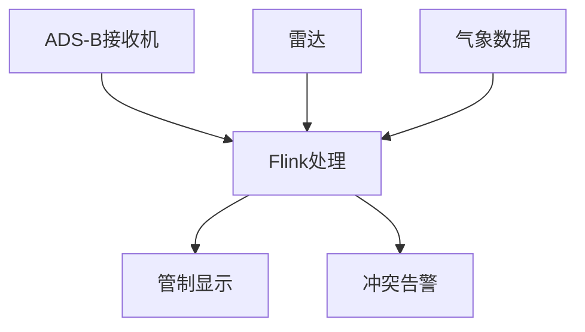

# 实时航空管制与流量管理案例研究

> 所属阶段: Knowledge/ Flink/ | 前置依赖: [算子全景分类](../01-concept-atlas/operator-deep-dive/01.06-single-input-operators.md) | [复杂事件处理](../01-concept-atlas/operator-deep-dive/01.10-process-and-async-operators.md) | 形式化等级: L4

## 1. 概念定义 (Definitions)

### Def-ATC-01-01: 空中交通流量管理系统 (Air Traffic Flow Management System)

空中交通流量管理系统是通过雷达、ADS-B、气象数据和流计算平台，对空域容量、航班流量、跑道使用进行实时监测与优化调度的集成系统。

$$\mathcal{A} = (F, R, W, C, S)$$

其中 $F$ 为航班位置数据流，$R$ 为雷达/ADS-B数据流，$W$ 为气象数据流，$C$ 为容量约束流，$S$ 为流计算处理拓扑。

### Def-ATC-01-02: 跑道容量 (Runway Capacity)

跑道容量是单位时间内跑道可安全起降的最大架次：

$$Capacity = \min\left(\frac{3600}{T_{arrival}}, \frac{3600}{T_{departure}}\right)$$

其中 $T_{arrival}$ 为连续进近最小时间间隔（通常2-3分钟），$T_{departure}$ 为连续起飞最小时间间隔（通常1-2分钟）。

### Def-ATC-01-03: 航班延误传播 (Delay Propagation)

航班延误传播指一架航班的延误导致后续航班连锁延误的现象：

$$Delay_{downstream} = \sum_{i} P_{connection}^{(i)} \cdot Delay_{upstream}^{(i)}$$

其中 $P_{connection}$ 为航班连接概率。

## 2. 属性推导 (Properties)

### Lemma-ATC-01-01: ADS-B位置更新频率与跟踪精度

ADS-B位置报告频率与跟踪精度的关系：

$$Accuracy_{tracking} \propto \frac{1}{f_{update}}$$

**工程约束**: ADS-B标准更新频率为1Hz（每秒1次），可提供亚米级实时定位。

### Prop-ATC-01-01: 空中等待的经济成本

航班进入等待航线（Holding Pattern）的额外燃油消耗：

$$\Delta Fuel = FuelFlow_{hold} \cdot T_{hold}$$

典型值：波音737在等待航线每小时消耗约2.5吨燃油，成本约1500美元/小时。

## 3. 关系建立 (Relations)

| 航空管制场景 | Flink算子 | 算子作用 |
|------------|-----------|---------|
| ADS-B数据接入 | `SourceFunction` | 多源ADS-B数据接入 |
| 航班轨迹预测 | `KeyedProcessFunction` | 按航班键控，4D轨迹预测 |
| 冲突检测 | `IntervalJoin` | 航班位置区间Join |
| 流量聚合 | `WindowAggregate` | 扇区/机场流量实时统计 |
| 延误预警 | `CEPPattern` | 延误传播模式匹配 |

## 4. 实例验证 (Examples)

### 4.1 航班实时追踪Pipeline

```java
// Flight real-time tracking
StreamExecutionEnvironment env = StreamExecutionEnvironment.getExecutionEnvironment();

DataStream<AdsbMessage> adsbStream = env
    .addSource(new AdsbSource("adsb.receiver"))
    .map(new AdsbParser())
    .assignTimestampsAndWatermarks(
        WatermarkStrategy.<AdsbMessage>forBoundedOutOfOrderness(
            Duration.ofSeconds(5))
    );

// Flight track reconstruction
DataStream<FlightTrack> tracks = adsbStream
    .keyBy(m -> m.getCallsign())
    .process(new TrackReconstructionFunction());

tracks.addSink(new DisplaySink());
```

### 4.2 空域冲突检测

```java
// Airspace conflict detection
DataStream<ConflictAlert> conflicts = tracks
    .keyBy(t -> t.getSectorId())
    .intervalJoin(tracks.keyBy(t -> t.getSectorId()))
    .between(Time.seconds(-60), Time.seconds(60))
    .process(new ConflictDetectionFunction() {
        @Override
        public void processElement(FlightTrack t1, FlightTrack t2,
                                   Collector<ConflictAlert> out) {
            if (!t1.getCallsign().equals(t2.getCallsign())) {
                double distance = calculateDistance(t1, t2);
                if (distance < 5000) { // 5km horizontal separation
                    out.collect(new ConflictAlert(t1.getCallsign(), t2.getCallsign(),
                        distance, System.currentTimeMillis()));
                }
            }
        }
    });

conflicts.addSink(new AlertSink());
```

## 5. 可视化 (Visualizations)

### 图1: 空中交通流量管理架构



## 6. 引用参考 (References)
