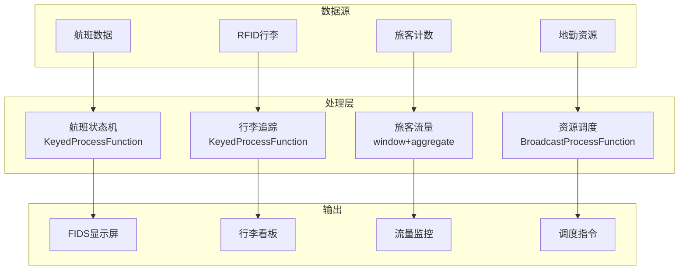

# 算子与实时机场运营

> **所属阶段**: Knowledge/10-case-studies | **前置依赖**: [01.07-two-input-operators.md](../01-concept-atlas/operator-deep-dive/01.07-two-input-operators.md), [realtime-port-logistics-case-study.md](../10-case-studies/realtime-port-logistics-case-study.md) | **形式化等级**: L3
> **文档定位**: 流处理算子在实时航班调度、行李追踪与旅客服务中的算子指纹与Pipeline设计
> **版本**: 2026.04

---

## 目录

- [1. 概念定义 (Definitions)](#1-概念定义-definitions)
- [2. 属性推导 (Properties)](#2-属性推导-properties)
- [3. 关系建立 (Relations)](#3-关系建立-relations)
- [4. 论证过程 (Argumentation)](#4-论证过程-argumentation)
- [5. 形式证明 / 工程论证 (Proof / Engineering Argument)](#5-形式证明--工程论证-proof--engineering-argument)
- [6. 实例验证 (Examples)](#6-实例验证-examples)
- [7. 可视化 (Visualizations)](#7-可视化-visualizations)
- [8. 引用参考 (References)](#8-引用参考-references)

---

## 1. 概念定义 (Definitions)

### Def-AIR-01-01: 机场协同决策（Airport Collaborative Decision Making, A-CDM）

A-CDM是机场各参与方共享实时信息的协作机制：

$$\text{A-CDM} = (\text{Airlines}, \text{ATC}, \text{Airport}, \text{GroundHandlers})$$

### Def-AIR-01-02: 航班周转时间（Turnaround Time）

航班周转时间是飞机降落到再次起飞的时间：

$$T_{turn} = T_{taxi-in} + T_{deplane} + T_{clean} + T_{refuel} + T_{board} + T_{taxi-out}$$

目标：窄体机 $T_{turn} < 40$ 分钟，宽体机 $T_{turn} < 90$ 分钟。

### Def-AIR-01-03: 行李处理系统（Baggage Handling System, BHS）

BHS是自动化行李分拣和输送系统：

$$\text{BHS}_{capacity} = \sum_{i} v_i \cdot \rho_i$$

其中 $v_i$ 为输送带速度，$\rho_i$ 为行李密度。

### Def-AIR-01-04: 登机口分配（Gate Assignment）

登机口分配是为到港航班分配最优停机位：

$$\text{Gate}^* = \arg\min_{g} (\alpha \cdot D_{walk} + \beta \cdot D_{taxi} + \gamma \cdot T_{conflict})$$

### Def-AIR-01-05: 旅客流量密度（Passenger Flow Density）

$$\rho_{pax} = \frac{N_{pax}}{A_{terminal}}$$

---

## 2. 属性推导 (Properties)

### Lemma-AIR-01-01: 行李错运率

$$P_{mishandled} = 1 - (1 - p_{scan})^n$$

其中 $p_{scan}$ 为单次扫描准确率，$n$ 为扫描次数。多次扫描可显著降低错运率。

### Lemma-AIR-01-02: 安检通道排队

$$W_q = \frac{\lambda}{\mu(\mu - \lambda)}$$

其中 $\lambda$ 为旅客到达率，$\mu$ 为安检处理率。

### Prop-AIR-01-01: A-CDM对延误的改善

$$\Delta Delay = Delay_{before} - Delay_{after} \approx 15\text{-}30\%$$

### Prop-AIR-01-02: 自助值机的渗透率

$$\text{SelfServiceRate} = \frac{N_{self}}{N_{total}}$$

大型机场自助值机率可达70-85%。

---

## 3. 关系建立 (Relations)

### 3.1 机场运营Pipeline算子映射

| 应用场景 | 算子组合 | 数据源 | 延迟要求 |
|---------|---------|--------|---------|
| **航班动态** | Source + map | 航司/ATC | < 1min |
| **登机口分配** | ProcessFunction | 航班计划 | < 5min |
| **行李追踪** | KeyedProcessFunction | RFID/BHS | < 1min |
| **旅客流量** | window+aggregate | 安检/登机口 | < 5min |
| **延误预测** | AsyncFunction | 多源数据 | < 15min |
| **资源调度** | Broadcast + ProcessFunction | 地勤资源 | < 1min |

### 3.2 算子指纹

| 维度 | 机场运营特征 |
|------|------------|
| **核心算子** | ProcessFunction（登机口状态机）、KeyedProcessFunction（行李追踪）、BroadcastProcessFunction（资源调度）、AsyncFunction（延误预测） |
| **状态类型** | ValueState（航班状态）、MapState（行李位置）、BroadcastState（资源可用性） |
| **时间语义** | 处理时间为主（运营强调实时性） |
| **数据特征** | 高并发（万级旅客/天）、强时间约束、多组织协同 |
| **状态热点** | 高峰时段航班Key、热门航线Key |
| **性能瓶颈** | 外部ATC数据接口、多组织数据同步 |

---

## 4. 论证过程 (Argumentation)

### 4.1 为什么机场需要流处理而非传统AODB

传统AODB的问题：
- 批量更新：航班状态更新延迟5-15分钟
- 信息孤岛：各系统独立，协同困难
- 被动响应：延误发生后才调整

流处理的优势：
- 实时更新：航班动态秒级同步
- 协同决策：各参与方共享同一信息源
- 主动预测：基于实时数据预测延误并提前调整

### 4.2 行李错运的预防

**问题**: 全球行李错运率约0.5-1%。

**流处理方案**: 行李RFID实时追踪 → 自动分拣 → 异常告警 → 人工干预。

### 4.3 旅客拥堵疏导

**场景**: 安检高峰期排队超过30分钟。

**流处理方案**: 实时旅客流量监测 → 拥堵预测 → 动态增开通道 → 引导分流。

---

## 5. 形式证明 / 工程论证 (Proof / Engineering Argument)

### 5.1 实时航班动态跟踪

```java
// 航班数据流
DataStream<FlightUpdate> flights = env.addSource(new FlightDataSource());

// 航班状态机
flights.keyBy(FlightUpdate::getFlightId)
    .process(new KeyedProcessFunction<String, FlightUpdate, FlightStatus>() {
        private ValueState<FlightState> flightState;
        
        @Override
        public void processElement(FlightUpdate update, Context ctx, Collector<FlightStatus> out) throws Exception {
            FlightState state = flightState.value();
            if (state == null) state = new FlightState(update.getFlightId());
            
            state.transition(update.getStatus());
            
            // 延误检测
            if (update.getEstimatedTime() != null && update.getScheduledTime() != null) {
                long delay = update.getEstimatedTime() - update.getScheduledTime();
                if (delay > 900000) {  // 超过15分钟
                    out.collect(new FlightStatus(update.getFlightId(), "DELAYED", delay, ctx.timestamp()));
                }
            }
            
            flightState.update(state);
        }
    })
    .addSink(new FlightDisplaySink());
```

### 5.2 行李实时追踪

```java
// 行李RFID扫描
DataStream<BaggageScan> scans = env.addSource(new RFIDSource());

// 行李追踪
scans.keyBy(BaggageScan::getBaggageId)
    .process(new KeyedProcessFunction<String, BaggageScan, BaggageLocation>() {
        private ValueState<BaggageRoute> routeState;
        
        @Override
        public void processElement(BaggageScan scan, Context ctx, Collector<BaggageLocation> out) throws Exception {
            BaggageRoute route = routeState.value();
            if (route == null) route = new BaggageRoute(scan.getBaggageId());
            
            route.addCheckpoint(scan.getLocation(), scan.getTimestamp());
            
            // 异常检测：长时间未移动
            if (route.getDwellTime() > 1800000) {  // 30分钟
                out.collect(new BaggageLocation(scan.getBaggageId(), scan.getLocation(), "STUCK", ctx.timestamp()));
            }
            
            // 错运检测：不在预期路径上
            if (!route.isOnExpectedPath()) {
                out.collect(new BaggageLocation(scan.getBaggageId(), scan.getLocation(), "MISROUTED", ctx.timestamp()));
            }
            
            routeState.update(route);
        }
    })
    .addSink(new BaggageTrackingSink());
```

---

## 6. 实例验证 (Examples)

### 6.1 实战：大型枢纽机场A-CDM

```java
// 1. 多源数据接入
DataStream<FlightUpdate> flights = env.addSource(new FlightDataSource());
DataStream<BaggageScan> baggage = env.addSource(new RFIDSource());
DataStream<PassengerCount> pax = env.addSource(new PassengerCounterSource());

// 2. 航班动态
flights.keyBy(FlightUpdate::getFlightId)
    .process(new FlightStateMachine())
    .addSink(new FlightDisplaySink());

// 3. 行李追踪
baggage.keyBy(BaggageScan::getBaggageId)
    .process(new BaggageTracker())
    .addSink(new BaggageDisplaySink());

// 4. 旅客流量
pax.keyBy(PassengerCount::getZoneId)
    .window(SlidingProcessingTimeWindows.of(Time.minutes(5), Time.minutes(1)))
    .aggregate(new PassengerFlowAggregate())
    .addSink(new FlowDashboardSink());
```

---

## 7. 可视化 (Visualizations)

### 机场运营Pipeline



---

## 8. 引用参考 (References)

[^1]: IATA, "Airport Collaborative Decision Making (A-CDM)", https://www.iata.org/

[^2]: ACI, "Airport Operations Guidelines", https://aci.aero/

[^3]: Wikipedia, "Airport Operations", https://en.wikipedia.org/wiki/Airport_operation

[^4]: Wikipedia, "Baggage Handling System", https://en.wikipedia.org/wiki/Baggage_handling_system

[^5]: Apache Flink Documentation, "KeyedProcessFunction", https://nightlies.apache.org/flink/flink-docs-stable/docs/dev/datastream/operators/process_function/

[^6]: Eurocontrol, "A-CDM Implementation Manual", 2023.

---

*关联文档*: [01.07-two-input-operators.md](../01-concept-atlas/operator-deep-dive/01.07-two-input-operators.md) | [realtime-port-logistics-case-study.md](../10-case-studies/realtime-port-logistics-case-study.md) | [realtime-traffic-management-case-study.md](../10-case-studies/realtime-traffic-management-case-study.md)
