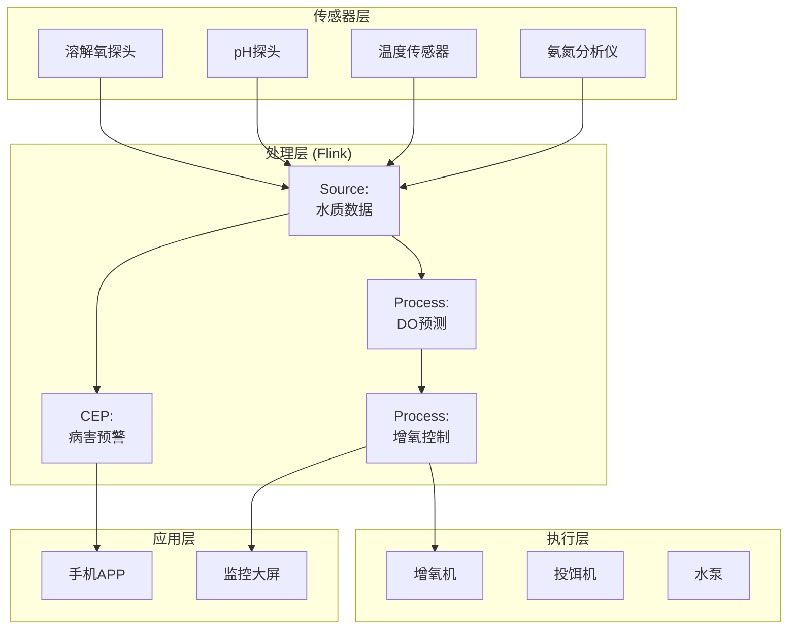
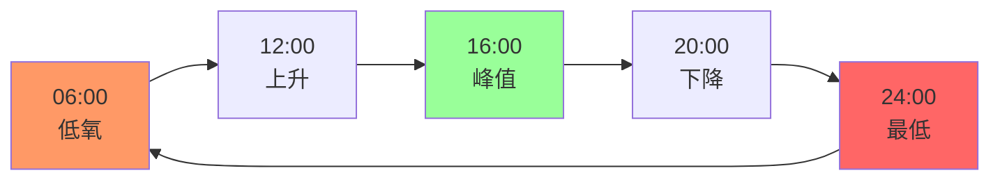

# 实时水产养殖水质管理与增氧控制案例研究

> 所属阶段: Knowledge/ Flink/ | 前置依赖: [算子全景分类](../01-concept-atlas/operator-deep-dive/01.06-single-input-operators.md) | [IoT流处理](../06-frontier/operator-iot-stream-processing.md) | 形式化等级: L4

## 1. 概念定义 (Definitions)

### Def-AQC-01-01: 水产养殖智能监控系统 (Aquaculture Intelligent Monitoring System)

水产养殖智能监控系统是通过分布式水质传感器、增氧设备和流计算平台，对养殖水体溶解氧、pH、温度、氨氮等参数进行实时监测与自动调控的集成系统。

$$\mathcal{A} = (D, pH, T, N, S, F)$$

其中 $D$ 为溶解氧数据流，$pH$ 为酸碱度数据流，$T$ 为水温数据流，$N$ 为氨氮数据流，$S$ 为盐度数据流，$F$ 为流计算处理拓扑。

### Def-AQC-01-02: 溶解氧饱和度 (Dissolved Oxygen Saturation)

溶解氧饱和度是当前溶解氧浓度相对于该水温下饱和溶解氧的百分比：

$$DO_{sat} = \frac{DO_{actual}}{DO_{saturation}(T, S, P)} \cdot 100\%$$

饱和溶解氧与温度、盐度、大气压的关系（Weiss方程）：

$$\ln(DO_{sat}) = A_1 + A_2 \cdot \frac{100}{T_K} + A_3 \cdot \ln\left(\frac{T_K}{100}\right) + A_4 \cdot \frac{T_K}{100} + S \cdot (B_1 + B_2 \cdot \frac{T_K}{100} + B_3 \cdot (\frac{T_K}{100})^2)$$

其中 $T_K$ 为开尔文温度，$S$ 为盐度（‰），$A_i, B_i$ 为经验系数。

### Def-AQC-01-03: 氧债 (Oxygen Debt)

氧债是指水体溶解氧低于安全阈值时，为恢复到安全水平所需补充的氧量：

$$OD = V_{pond} \cdot (DO_{safe} - DO_{actual})$$

其中 $V_{pond}$ 为池塘体积。氧债累积速度反映水体耗氧与复氧的不平衡程度。

### Def-AQC-01-04: 投饵系数 (Feeding Coefficient)

投饵系数是实际投饵量与理论需求量的比值：

$$FC = \frac{Feed_{actual}}{Feed_{theoretical}} = \frac{Feed_{actual}}{B_{biomass} \cdot FCR_{target} \cdot GrowthRate}$$

其中 $B_{biomass}$ 为养殖生物量，$FCR_{target}$ 为目标饲料转化率。$FC > 1.2$ 表示过量投饵，增加水质恶化风险。

### Def-AQC-01-05: 养殖密度指数 (Stocking Density Index)

养殖密度指数定义为单位水体面积的生物量：

$$SDI = \frac{B_{total}}{A_{pond}} \quad [kg/m^2]$$

不同养殖模式的典型密度：

- 土塘粗养: SDI < 1.0 kg/m²
- 精养池塘: SDI = 1.0-3.0 kg/m²
- 工厂化循环水: SDI = 10-50 kg/m²

## 2. 属性推导 (Properties)

### Lemma-AQC-01-01: 溶解氧日变化规律

养殖水体溶解氧呈显著日周期性变化：

$$DO(t) = DO_{mean} + A_{DO} \cdot \sin\left(\frac{2\pi(t - t_{peak})}{24}\right) + \epsilon(t)$$

其中 $t_{peak}$ 通常为下午14-16时（光合作用最强），$A_{DO}$ 为振幅（1-5 mg/L）。

**证明**: 白天浮游植物光合作用产氧，夜间呼吸作用耗氧。由光合作用光响应曲线和呼吸速率，可导出上述正弦近似。

### Lemma-AQC-01-02: 增氧机复氧效率

叶轮式增氧机的标准氧转移速率（SOTR）：

$$SOTR = K_{La20} \cdot DO_{sat} \cdot V_{pond} \cdot 1.024^{T-20}$$

其中 $K_{La20}$ 为20°C时的氧总转移系数，与增氧机功率正相关。

### Prop-AQC-01-01: 氨氮毒性的pH依赖性

非离子氨（NH₃）的毒性远高于离子氨（NH₄⁺），其比例随pH升高而增加：

$$\frac{[NH_3]}{[NH_3] + [NH_4^+]} = \frac{1}{1 + 10^{pK_a - pH}}$$

其中 $pK_a \approx 9.25$（25°C）。当pH从7.0升至8.5时，有毒NH₃比例从0.3%增至3.5%，毒性增加10倍以上。

### Prop-AQC-01-02: 夜间低氧风险的预测

基于日落前溶解氧水平和夜间耗氧速率的低氧风险预测：

$$P_{hypoxia} = \mathbb{1}_{[DO_{sunset} - R_{night} \cdot T_{night} < DO_{safe}]}$$

其中 $R_{night}$ 为夜间综合耗氧速率（呼吸+分解），$T_{night}$ 为夜间时长。

## 3. 关系建立 (Relations)

### 与算子体系的映射

| 水产养殖场景 | Flink算子 | 算子作用 |
|------------|-----------|---------|
| 水质传感器接入 | `Union` + `SourceFunction` | DO/pH/温度/氨氮统一接入 |
| 溶解氧预测 | `ProcessFunction` | 基于光合/呼吸模型的DO预测 |
| 增氧控制 | `BroadcastStream` | 控制指令广播到增氧机 |
| 投饵决策 | `WindowAggregate` | 时段投饵量统计与优化 |
| 病害预警 | `CEPPattern` | 水质恶化模式匹配 |
| 生产报表 | `WindowAggregate` + `Sink` | 日/周/月养殖报表 |

## 4. 论证过程 (Argumentation)

### 4.1 水产养殖监控的核心挑战

**挑战1: 溶解氧的瞬时变化**
夏季闷热天气下，池塘溶解氧可在1小时内从5 mg/L降至2 mg/L以下，导致鱼类浮头甚至大面积死亡。

**挑战2: 传感器维护困难**
水体中的生物附着导致传感器探头污染，溶解氧探头需每2-4周清洁校准，pH探头寿命仅6-12个月。

**挑战3: 多池塘协同管理**
大型养殖基地管理数十至数百个池塘，各池塘水质差异大，需差异化调控策略。

### 4.2 方案选型论证

**为什么选用流计算而非传统PLC？**

- 传统PLC为单塘本地控制，无法整合气象预报进行预测性增氧
- 流计算支持多池塘协同优化（错峰用电、设备共享）
- Flink的精确一次语义保证投饵和用药记录不丢失

## 5. 形式证明 / 工程论证 (Proof / Engineering Argument)

### Thm-AQC-01-01: 增氧机最优启停定理

在满足溶解氧不低于安全阈值 $DO_{safe}$ 的约束下，基于分时电价的增氧机启停策略使电费最小化：

**定理**: 最优启停策略为：

- 谷电时段（23:00-7:00）：提前增氧至 $DO_{max}$
- 峰电时段（8:00-22:00）：仅在 $DO \leq DO_{safe} + \Delta$ 时启停

**工程意义**: 利用水体溶氧的缓冲能力，在低价电时段"蓄氧"，高价电时段减少增氧，可节省电费20-30%。

## 6. 实例验证 (Examples)

### 6.1 溶解氧实时监测与增氧控制

```java
// Dissolved oxygen monitoring and aeration control
StreamExecutionEnvironment env = StreamExecutionEnvironment.getExecutionEnvironment();

DataStream<DoReading> doStream = env
    .addSource(new MqttSource("aquaculture/pond/+/do"))
    .map(new DoParser())
    .assignTimestampsAndWatermarks(
        WatermarkStrategy.<DoReading>forBoundedOutOfOrderness(
            Duration.ofMinutes(2))
    );

// DO prediction and aeration control
DataStream<AerationCommand> aerationCommands = doStream
    .keyBy(r -> r.getPondId())
    .process(new DoControlFunction() {
        private ValueState<PondState> pondState;
        private static final double DO_SAFE = 4.0;
        private static final double DO_CRITICAL = 2.5;
        private static final double DO_TARGET = 6.0;

        @Override
        public void open(Configuration parameters) {
            pondState = getRuntimeContext().getState(
                new ValueStateDescriptor<>("pond", PondState.class));
        }

        @Override
        public void processElement(DoReading reading, Context ctx,
                                   Collector<AerationCommand> out) throws Exception {
            PondState state = pondState.value();
            if (state == null) state = new PondState(reading.getPondId());

            double doLevel = reading.getDoLevel();
            boolean isPeakHour = isPeakHour(ctx.timestamp());

            if (doLevel < DO_CRITICAL) {
                // Emergency: all aerators on
                out.collect(new AerationCommand(reading.getPondId(),
                    "ALL_ON", 100, "EMERGENCY", ctx.timestamp()));
            } else if (doLevel < DO_SAFE) {
                // Safe threshold breached
                out.collect(new AerationCommand(reading.getPondId(),
                    "ON", 80, "SAFETY", ctx.timestamp()));
            } else if (doLevel < DO_TARGET && !isPeakHour) {
                // Target not reached, off-peak electricity
                out.collect(new AerationCommand(reading.getPondId(),
                    "ON", 50, "OPTIMIZATION", ctx.timestamp()));
            } else if (doLevel >= DO_TARGET && state.isAerating()) {
                // Target reached, stop aeration
                out.collect(new AerationCommand(reading.getPondId(),
                    "OFF", 0, "TARGET_REACHED", ctx.timestamp()));
            }

            state.updateDo(doLevel);
            pondState.update(state);
        }

        private boolean isPeakHour(long timestamp) {
            int hour = new Date(timestamp).getHours();
            return hour >= 8 && hour <= 22;
        }
    });

aerationCommands.addSink(new PlcSink());
```

### 6.2 氨氮毒性预警

```java
// Ammonia toxicity warning
DataStream<WaterQuality> waterQuality = env
    .addSource(new MqttSource("aquaculture/pond/+/quality"))
    .map(new QualityParser());

DataStream<ToxicityAlert> toxicityAlerts = waterQuality
    .keyBy(q -> q.getPondId())
    .process(new ToxicityWarningFunction() {
        private static final double NH3_SAFE = 0.02; // mg/L

        @Override
        public void processElement(WaterQuality q, Context ctx,
                                   Collector<ToxicityAlert> out) {
            double ph = q.getPh();
            double totalAmmonia = q.getAmmonia();
            double temperature = q.getTemperature();

            // Calculate non-ionized ammonia fraction
            double pKa = 0.09018 + 2729.92 / (temperature + 273.15);
            double nh3Fraction = 1 / (1 + Math.pow(10, pKa - ph));
            double nh3Concentration = totalAmmonia * nh3Fraction;

            if (nh3Concentration > NH3_SAFE) {
                String severity = nh3Concentration > 0.05 ? "CRITICAL" : "WARNING";
                out.collect(new ToxicityAlert(
                    q.getPondId(), "NH3_TOXICITY", nh3Concentration,
                    ph, totalAmmonia, severity, ctx.timestamp()
                ));
            }
        }
    });

toxicityAlerts.addSink(new AlertSink());
```

## 7. 可视化 (Visualizations)

### 图1: 水产养殖监控架构



### 图2: 溶解氧日变化曲线



## 8. 引用参考 (References)
