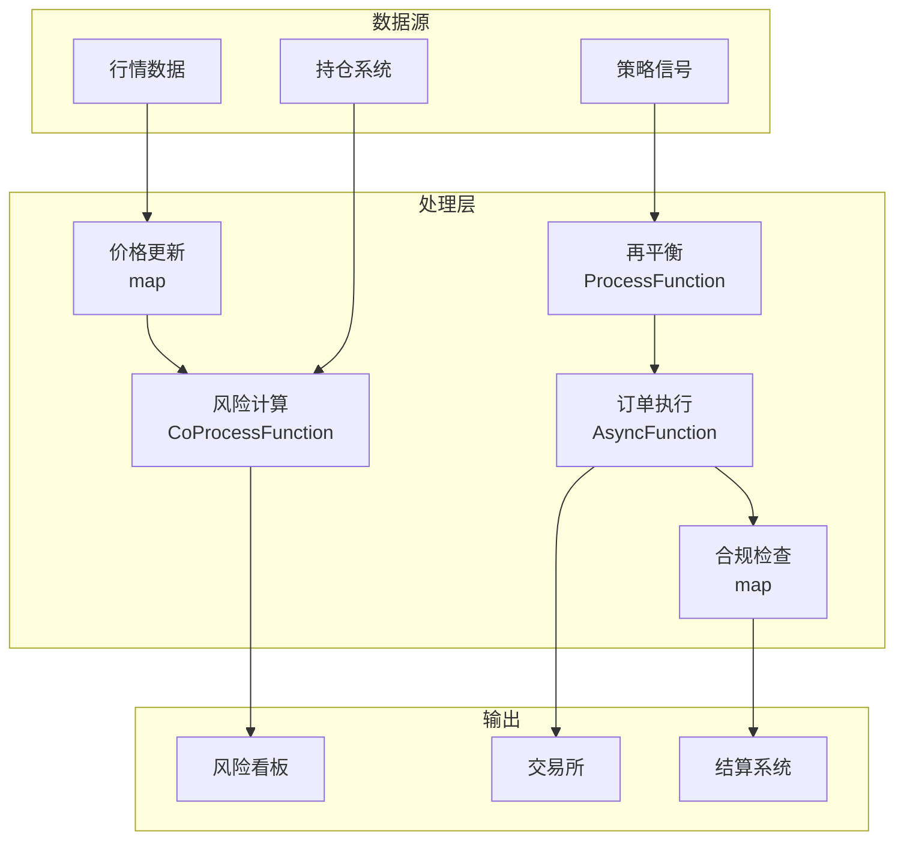

# 算子与实时资产管理

> **所属阶段**: Knowledge/10-case-studies | **前置依赖**: [01.10-process-and-async-operators.md](../01-concept-atlas/operator-deep-dive/01.10-process-and-async-operators.md), [realtime-fintech-payment-processing-case-study.md](../10-case-studies/realtime-fintech-payment-processing-case-study.md) | **形式化等级**: L3
> **文档定位**: 流处理算子在实时资产定价、投资组合风控与交易执行中的算子指纹与Pipeline设计
> **版本**: 2026.04

---

## 目录

- [1. 概念定义 (Definitions)](#1-概念定义-definitions)
- [2. 属性推导 (Properties)](#2-属性推导-properties)
- [3. 关系建立 (Relations)](#3-关系建立-relations)
- [4. 论证过程 (Argumentation)](#4-论证过程-argumentation)
- [5. 形式证明 / 工程论证 (Proof / Engineering Argument)](#5-形式证明--工程论证-proof--engineering-argument)
- [6. 实例验证 (Examples)](#6-实例验证-examples)
- [7. 可视化 (Visualizations)](#7-可视化-visualizations)
- [8. 引用参考 (References)](#8-引用参考-references)

---

## 1. 概念定义 (Definitions)

### Def-AST-01-01: 实时资产定价（Real-time Asset Pricing）

实时资产定价是基于市场数据连续更新资产公允价值：

$$P_t = P_{t-1} + \Delta P_{market} + \Delta P_{model}$$

其中 $\Delta P_{market}$ 为市场价格变动，$\Delta P_{model}$ 为模型修正。

### Def-AST-01-02: 风险价值（Value at Risk, VaR）

VaR是在给定置信水平下的最大潜在损失：

$$\text{VaR}_\alpha = \inf\{l : P(L > l) \leq 1 - \alpha\}$$

### Def-AST-01-03: 投资组合再平衡（Portfolio Rebalancing）

再平衡是根据目标权重调整持仓：

$$\Delta w_i = w_i^{target} - w_i^{current}$$

### Def-AST-01-04: 算法交易执行（Algorithmic Execution）

算法交易是将大额订单拆分为小额订单执行的策略：

$$\min \sum_t (P_t - P_{benchmark})^2 + \lambda \cdot \text{MarketImpact}$$

### Def-AST-01-05: 滑点（Slippage）

滑点是下单价格与实际成交价格的差异：

$$\text{Slippage} = \frac{P_{fill} - P_{expected}}{P_{expected}}$$

---

## 2. 属性推导 (Properties)

### Lemma-AST-01-01: 收益率的正态性假设

对数收益率近似正态分布：

$$r_t = \ln(P_t / P_{t-1}) \sim N(\mu, \sigma^2)$$

VaR计算：$\text{VaR}_\alpha = \mu - z_\alpha \cdot \sigma$

### Lemma-AST-01-02: 交易成本的最优拆分

最优TWAP（时间加权平均价格）拆分：

$$x_t = \frac{X}{T}, \quad \forall t \in [1, T]$$

**证明**: 在均匀分布假设下，等分执行最小化方差。∎

### Prop-AST-01-01: 再平衡频率与跟踪误差

$$\text{TrackingError} \propto \frac{1}{\sqrt{f_{rebalance}}}$$

再平衡频率越高，跟踪误差越小，但交易成本越高。

### Prop-AST-01-02: 市场冲击与订单大小的关系

$$\Delta P = \eta \cdot \sigma \cdot \left(\frac{X}{V}\right)^{\gamma}$$

其中 $X$ 为订单量，$V$ 为日均成交量，$\gamma \approx 0.5$。

---

## 3. 关系建立 (Relations)

### 3.1 资产管理Pipeline算子映射

| 应用场景 | 算子组合 | 数据源 | 延迟要求 |
|---------|---------|--------|---------|
| **价格更新** | map | 行情 | < 10ms |
| **风险计算** | window+aggregate | 持仓+行情 | < 1min |
| **再平衡** | ProcessFunction | 目标权重 | < 5min |
| **订单执行** | AsyncFunction | 交易所 | < 100ms |
| **合规检查** | map | 交易流 | < 10ms |
| **业绩归因** | window+aggregate | 历史 | 日级 |

### 3.2 算子指纹

| 维度 | 资产管理特征 |
|------|------------|
| **核心算子** | KeyedProcessFunction（持仓状态）、AsyncFunction（交易执行）、window+aggregate（风险统计）、BroadcastProcessFunction（策略更新） |
| **状态类型** | ValueState（持仓头寸）、MapState（资产价格）、BroadcastState（策略配置） |
| **时间语义** | 处理时间为主（交易强调实时性） |
| **数据特征** | 高并发（万级资产）、高敏感（资金）、强一致性 |
| **状态热点** | 热门资产Key、大持仓Key |
| **性能瓶颈** | 外部交易所API、复杂风险模型 |

---

## 4. 论证过程 (Argumentation)

### 4.1 为什么资管需要流处理而非传统日终批处理

传统批处理的问题：
- 日终估值：盘中风险暴露未知
- T+1结算：资金占用时间长
- 人工决策：无法捕捉市场机会

流处理的优势：
- 实时风控：毫秒级风险指标计算
- 自动执行：策略触发即下单
- 全生命周期：从信号到结算自动化

### 4.2 高频与低频策略的共存

**问题**: 同一系统需要同时支持高频（毫秒级）和中低频（日级）策略。

**方案**: 流处理统一架构，通过不同窗口大小和并行度满足不同频率需求。

### 4.3 合规前置检查

**场景**: 每笔交易前需检查是否违反投资限制。

**流处理方案**: 交易流 → 合规规则引擎 → 通过则执行，拒绝则告警。

---

## 5. 形式证明 / 工程论证 (Proof / Engineering Argument)

### 5.1 实时持仓风险监控

```java
public class RiskMonitorFunction extends KeyedProcessFunction<String, MarketData, RiskReport> {
    private ValueState<PortfolioHoldings> holdings;
    private MapState<String, Double> prices;
    
    @Override
    public void processElement(MarketData data, Context ctx, Collector<RiskReport> out) throws Exception {
        prices.put(data.getSymbol(), data.getPrice());
        
        PortfolioHoldings port = holdings.value();
        if (port == null) return;
        
        // 计算组合价值
        double nav = 0;
        double exposure = 0;
        
        for (Position pos : port.getPositions()) {
            Double price = prices.get(pos.getSymbol());
            if (price != null) {
                double value = pos.getQuantity() * price;
                nav += value;
                exposure += Math.abs(value);
            }
        }
        
        // 计算VaR（简化：假设正态分布）
        double portfolioStd = calculatePortfolioStd(port, prices);
        double var95 = 1.645 * portfolioStd;
        double var99 = 2.326 * portfolioStd;
        
        out.collect(new RiskReport(port.getId(), nav, exposure, var95, var99, ctx.timestamp()));
    }
}
```

### 5.2 算法交易执行

```java
// 大单拆分执行
DataStream<ParentOrder> parentOrders = env.addSource(new OrderSource());

parentOrders.keyBy(ParentOrder::getOrderId)
    .process(new KeyedProcessFunction<String, ParentOrder, ChildOrder>() {
        private ValueState<ExecutionState> execState;
        
        @Override
        public void processElement(ParentOrder parent, Context ctx, Collector<ChildOrder> out) throws Exception {
            ExecutionState state = execState.value();
            if (state == null) {
                state = new ExecutionState(parent);
                // 注册定时器：每30秒执行一次
                ctx.timerService().registerProcessingTimeTimer(ctx.timestamp() + 30000);
            }
            
            execState.update(state);
        }
        
        @Override
        public void onTimer(long timestamp, OnTimerContext ctx, Collector<ChildOrder> out) {
            ExecutionState state = execState.value();
            if (state == null || state.isComplete()) return;
            
            // TWAP：等分执行
            double childQty = state.getRemainingQty() / state.getSlicesRemaining();
            
            out.collect(new ChildOrder(state.getParentId(), childQty, state.getSymbol(), timestamp));
            
            state.sliceExecuted(childQty);
            execState.update(state);
            
            // 继续注册定时器
            if (!state.isComplete()) {
                ctx.timerService().registerProcessingTimeTimer(timestamp + 30000);
            }
        }
    })
    .addSink(new ExchangeOrderSink());
```

---

## 6. 实例验证 (Examples)

### 6.1 实战：量化对冲基金实时风控

```java
// 1. 行情数据
DataStream<MarketData> market = env.addSource(new MarketDataSource());

// 2. 持仓更新
DataStream<PositionUpdate> positions = env.addSource(new PositionSource());

// 3. 实时风险计算
market.keyBy(MarketData::getSymbol)
    .connect(positions.keyBy(PositionUpdate::getSymbol))
    .process(new CoProcessFunction<MarketData, PositionUpdate, RiskReport>() {
        private ValueState<Double> currentPrice;
        private ValueState<PositionUpdate> currentPosition;
        
        @Override
        public void processElement1(MarketData data, Context ctx, Collector<RiskReport> out) {
            currentPrice.update(data.getPrice());
            calculateAndEmitRisk(out, ctx);
        }
        
        @Override
        public void processElement2(PositionUpdate pos, Context ctx, Collector<RiskReport> out) {
            currentPosition.update(pos);
            calculateAndEmitRisk(out, ctx);
        }
        
        private void calculateAndEmitRisk(Collector<RiskReport> out, Context ctx) {
            Double price = currentPrice.value();
            PositionUpdate pos = currentPosition.value();
            if (price == null || pos == null) return;
            
            double exposure = pos.getQuantity() * price;
            out.collect(new RiskReport(pos.getSymbol(), exposure, ctx.timestamp()));
        }
    })
    .addSink(new RiskDashboardSink());
```

---

## 7. 可视化 (Visualizations)

### 资产管理Pipeline



---

## 8. 引用参考 (References)

[^1]: CFA Institute, "Portfolio Management", https://www.cfainstitute.org/

[^2]: JPMorgan, "RiskMetrics Technical Document", 1996.

[^3]: Wikipedia, "Value at Risk", https://en.wikipedia.org/wiki/Value_at_risk

[^4]: Wikipedia, "Algorithmic Trading", https://en.wikipedia.org/wiki/Algorithmic_trading

[^5]: Apache Flink Documentation, "Stateful Stream Processing", https://nightlies.apache.org/flink/flink-docs-stable/docs/concepts/stateful-stream-processing/

[^6]: ACM, "Real-time Risk Management in Electronic Trading", 2023.

---

*关联文档*: [01.10-process-and-async-operators.md](../01-concept-atlas/operator-deep-dive/01.10-process-and-async-operators.md) | [realtime-fintech-payment-processing-case-study.md](../10-case-studies/realtime-fintech-payment-processing-case-study.md) | [realtime-financial-risk-control-case-study.md](../10-case-studies/realtime-financial-risk-control-case-study.md)
