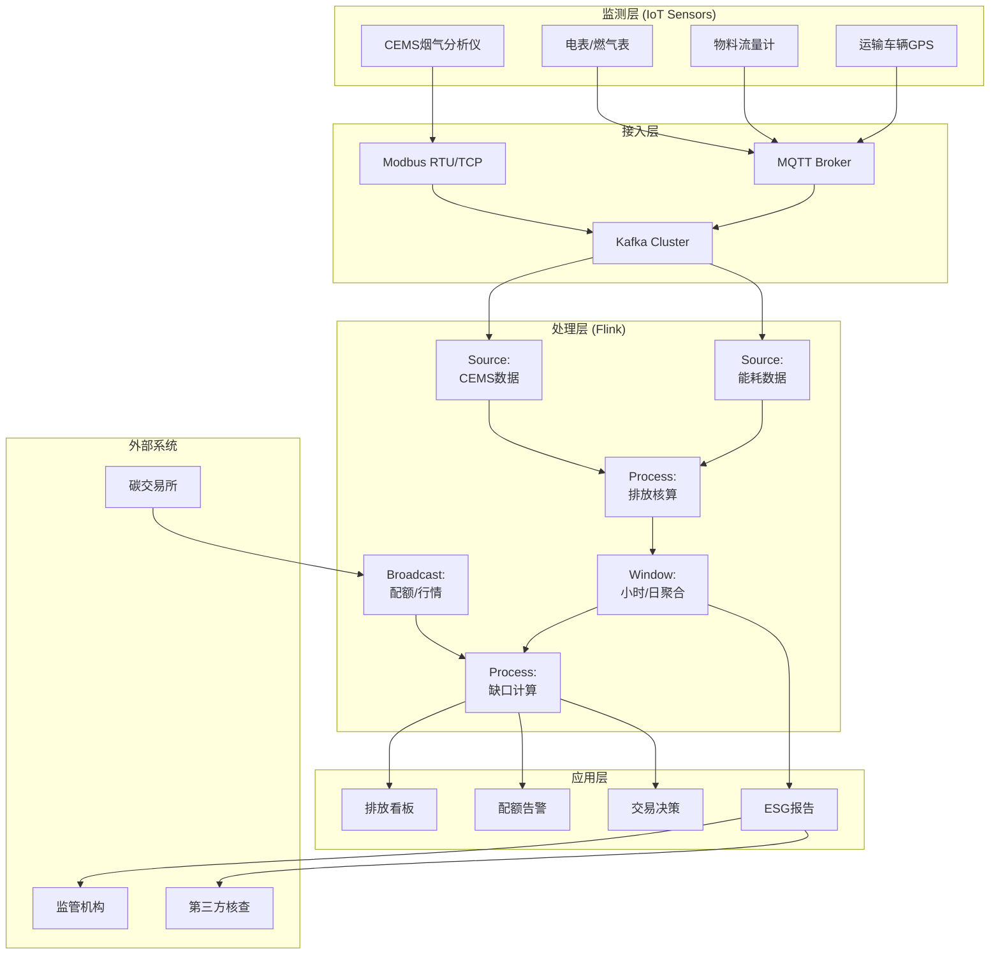
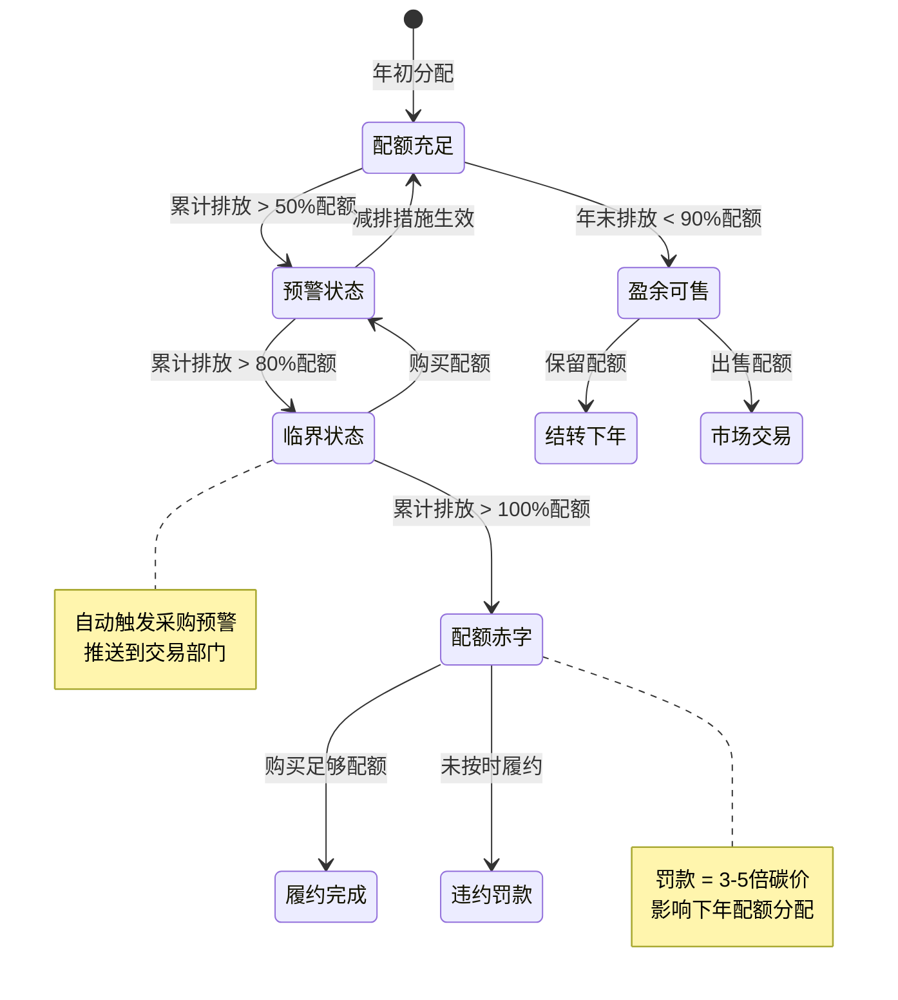
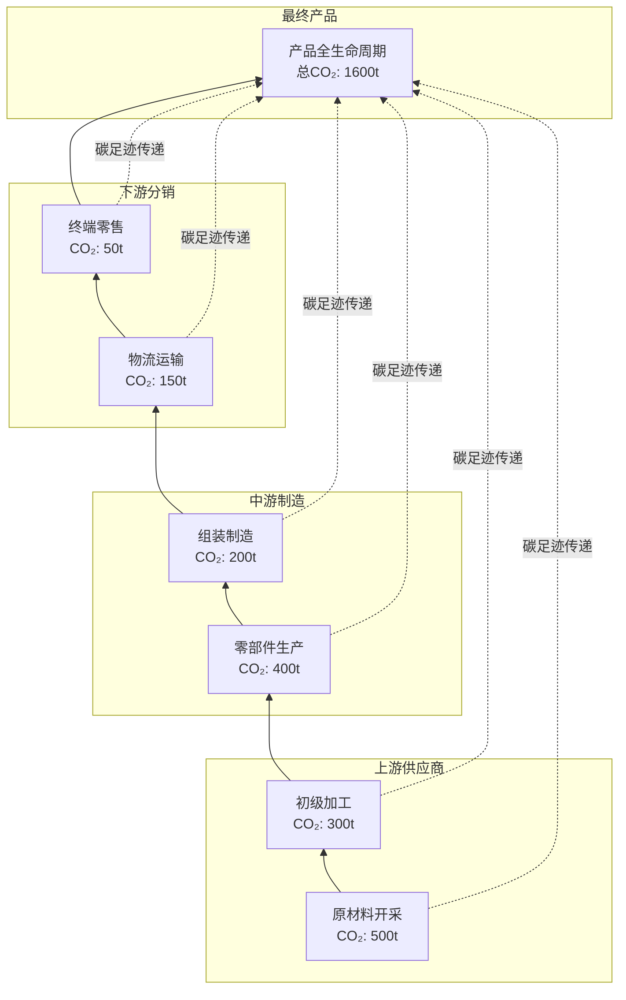

# 实时碳排放监测与碳交易案例研究

> 所属阶段: Knowledge/ Flink/ | 前置依赖: [IoT流处理](../06-frontier/operator-iot-stream-processing.md) | [窗口算子](../01-concept-atlas/operator-deep-dive/01.09-window-operators.md) | 形式化等级: L4

## 1. 概念定义 (Definitions)

### Def-CBN-01-01: 碳排放实时监测系统 (Real-time Carbon Emission Monitoring System)

碳排放实时监测系统是通过物联网传感器、能源计量设备和流计算平台，对企业/区域/设备的温室气体排放进行连续量化、实时核算与动态报告的集成系统。

$$\mathcal{E} = (S, A, C, T, F)$$

其中 $S$ 为排放源监测数据流，$A$ 为活动水平数据流（能耗/产量/物料），$C$ 为排放因子库流，$T$ 为碳交易行情流，$F$ 为流计算处理拓扑。

### Def-CBN-01-02: 碳排放核算方程 (Carbon Emission Accounting Equation)

基于IPCC指南的碳排放核算基本方程：

$$E = \sum_{i} A_i \cdot EF_i \cdot (1 - ER_i)$$

其中 $E$ 为总排放量（吨CO₂当量），$A_i$ 为第 $i$ 类活动水平数据，$EF_i$ 为对应排放因子，$ER_i$ 为减排效率。活动水平类型包括：

- 固定燃烧：化石燃料消耗量 × 低位发热量 × 单位热值含碳量 × 氧化率
- 移动燃烧：交通工具燃料消耗
- 过程排放：水泥熟料生产、化工合成等
- 电力间接排放：外购电量 × 电网排放因子

### Def-CBN-01-03: 碳配额缺口 (Carbon Allowance Gap)

碳配额缺口指企业实际排放量与持有的碳排放权配额之间的差额：

$$Gap(t) = E_{actual}(t) - Allowance_{held}(t)$$

- $Gap(t) > 0$：配额不足，需在碳市场购买或启动减排措施
- $Gap(t) < 0$：配额盈余，可出售或结转至下期

### Def-CBN-01-04: 碳价波动率 (Carbon Price Volatility)

碳价波动率衡量碳配额交易价格的日内/日间变动程度：

$$\sigma_{carbon} = \sqrt{\frac{1}{N-1} \sum_{k=1}^{N} \left(\ln\frac{P_k}{P_{k-1}} - \mu\right)^2}$$

其中 $P_k$ 为第 $k$ 个交易时段的碳价，$\mu$ 为对数收益率均值。高波动率增加企业的配额管理风险。

### Def-CBN-01-05: 碳中和进度指数 (Carbon Neutrality Progress Index)

碳中和进度指数衡量企业相对于碳中和目标的达成程度：

$$CNPI(t) = \frac{E_{baseline} - E_{actual}(t) + O_{offset}(t)}{E_{baseline}} \cdot 100\%$$

其中 $E_{baseline}$ 为基准年排放量，$O_{offset}$ 为碳抵消量（CCER/国际碳信用）。$CNPI = 100\%$ 表示实现碳中和。

## 2. 属性推导 (Properties)

### Lemma-CBN-01-01: 排放监测数据采样定理

为确保碳排放核算精度满足MRV(可监测、可报告、可核查)要求，能耗数据采样频率需满足：

$$f_{sample} \geq \frac{2 \cdot P_{max}}{\Delta E_{target}}$$

其中 $P_{max}$ 为最大排放功率（吨CO₂/小时），$\Delta E_{target}$ 为目标核算精度。

**证明**: 排放量在采样间隔内的变化需被捕获。若采样间隔内排放量变化超过目标精度，则产生核算误差。由奈奎斯特采样定理，采样频率需至少为最大变化率的两倍。

**工程约束**: 典型燃煤电厂 $P_{max} \approx 1000$ 吨CO₂/小时，目标精度 $\Delta E_{target} = 1$ 吨，则 $f_{sample} \geq 2000$ 次/小时 $\approx$ 每2秒1次。实际部署采用1Hz连续监测。

### Lemma-CBN-01-02: 碳配额交易策略的期望成本下界

在碳价服从几何布朗运动 $dP = \mu P dt + \sigma P dW$ 的条件下，提前购买策略的期望成本优于临近履约期购买的充分条件：

$$\mu < r + \frac{\sigma^2}{2}$$

其中 $r$ 为无风险利率。

**证明**: 由Black-Scholes框架，碳配额的远期价格 $F = P_0 \cdot e^{(\mu - r)T}$。若 $\mu < r + \sigma^2/2$，则期权定价模型显示提前锁定价格优于持有现金到期购买。

### Prop-CBN-01-01: 多源排放数据融合的置信度提升

当使用直接监测(CEMS)与物料平衡法并行核算时，融合结果的置信度高于单一方法：

$$CI_{fusion} = 1 - (1 - CI_{CEMS})(1 - CI_{mass}) \cdot (1 - Corr(CEMS, mass))$$

**条件**: 两种方法的测量误差需弱相关。CEMS基于烟气浓度×流量，物料平衡基于投入产出化学计量，两者误差来源独立。

### Prop-CBN-01-02: 实时碳足迹的传递性

供应链碳足迹具有传递性：上游企业的排放会传递至下游产品：

$$CF_{product} = \sum_{supplier} CF_{supplier} \cdot \frac{Q_{input}}{Q_{output}} + E_{process}$$

**论证**: 产品全生命周期碳足迹包含原材料获取、生产制造、运输分销、使用废弃各阶段。实时碳足迹追踪需维护供应链图谱，将各级供应商的排放按比例归集至最终产品。

## 3. 关系建立 (Relations)

### 与算子体系的映射

| 碳排放监测场景 | Flink算子 | 算子作用 |
|------------|-----------|---------|
| 多源传感器接入 | `SourceFunction` + `Union` | 烟气分析仪/电表/燃气表多源统一接入 |
| 排放实时核算 | `KeyedProcessFunction` | 按排放源键控，实时计算CO₂当量 |
| 配额余额监控 | `WindowAggregate` | 滑动窗口内聚合排放与配额差额 |
| 碳价行情处理 | `BroadcastStream` | 碳交易所行情广播到所有核算节点 |
| 交易策略触发 | `CEPPattern` | 配额缺口/碳价异动模式匹配 |
| ESG报告生成 | `WindowAggregate` + `Sink` | 按日/周/月窗口聚合生成报告 |

### 与监管框架的关联

- **全国碳市场(中国)**: 覆盖电力行业，MRV体系要求年度排放报告
- **EU ETS**: 欧盟碳排放交易体系，覆盖航空、航运、工业
- **CCER**: 中国核证自愿减排量，用于抵消5%配额
- **GHG Protocol**: 温室气体核算体系企业标准
- **ISO 14064**: 温室气体量化与报告国际标准

## 4. 论证过程 (Argumentation)

### 4.1 碳排放监测的核心挑战

**挑战1: 多源异构数据整合**
火电厂CEMS系统输出NOx/SO₂/CO₂浓度（mg/m³），电表输出kWh，燃气表输出m³，各数据源协议（Modbus/OPC-UA/ MQTT）和采样频率不同。

**挑战2: 排放因子的动态性**
电网排放因子随电源结构（煤电/风电/光伏占比）实时变化；不同批次的燃料热值和含碳量存在差异。

**挑战3: 碳价极端波动**
中国全国碳市场2021年开市以来碳价从48元/吨涨至100+元/吨，日内波动可达10%。企业配额管理面临显著财务风险。

**挑战4: 供应链碳足迹追溯**
产品碳足迹需追溯至N级供应商，涉及跨组织数据共享与隐私保护。

### 4.2 方案选型论证

**为什么选用流计算而非传统能源管理系统(EMS)？**

- EMS通常为分钟级刷新，无法满足碳交易实时决策需求
- 流计算支持复杂事件处理（配额预警、价格异动），EMS缺乏此能力
- Flink的精确一次语义保证碳核算数据不丢失，满足审计要求

**为什么选用滑动窗口而非滚动窗口做排放聚合？**

- 碳排放具有连续性，滚动窗口的边界切割会导致瞬时跳变
- 滑动窗口提供平滑的排放曲线，更适合配额余额监控
- 窗口重叠保证事件不会被遗漏在边界处

## 5. 形式证明 / 工程论证 (Proof / Engineering Argument)

### Thm-CBN-01-01: 碳配额最优采购时机定理

n
在碳价服从均值回归过程 $dP = \theta(\mu - P)dt + \sigma dW$ 且企业需在时间 $T$ 前完成履约的条件下，最优采购策略为：

**定理**: 当当前碳价 $P(t) < P^*$ 时提前采购，当 $P(t) \geq P^*$ 时等待，其中阈值 $P^*$ 满足：

$$P^* = \mu - \frac{\sigma^2}{2\theta} \cdot \frac{e^{-\theta(T-t)}}{1 - e^{-\theta(T-t)}}$$

**证明概要**:

1. 碳价均值回归表明价格趋向长期均值 $\mu$
2. 提前采购的机会成本为资金占用成本 $r \cdot P \cdot (T-t)$
3. 等待采购的风险为价格上涨风险
4. 最优 stopping time 问题转化为价值匹配条件
5. 解上述微分方程得阈值 $P^*$

**工程意义**: 当碳价低于长期均值且距履约期较远时，提前采购可降低成本；临近履约期时，即使碳价偏高也需采购以避免罚款（通常罚款价格为碳价的3-5倍）。

## 6. 实例验证 (Examples)

### 6.1 火电厂碳排放实时核算Pipeline

```java
// Real-time carbon emission accounting for coal-fired power plant
StreamExecutionEnvironment env = StreamExecutionEnvironment.getExecutionEnvironment();
env.enableCheckpointing(60000, CheckpointingMode.EXACTLY_ONCE);

// Continuous Emission Monitoring System (CEMS) data
DataStream<CemsReading> cemsStream = env
    .addSource(new ModbusSource("192.168.1.100", 502))
    .map(new CemsParser());

// Power generation meter
DataStream<PowerMeter> powerStream = env
    .addSource(new MqttSource("plant/power/meter", broker))
    .map(new PowerMeterParser());

// Coal quality data (calorific value, carbon content)
DataStream<CoalQuality> coalQualityStream = env
    .addSource(new KafkaSource<>("plant.coal.quality"));

// Emission calculation using IPCC Tier 2 method
DataStream<EmissionRecord> emissions = cemsStream
    .keyBy(reading -> reading.getStackId())
    .connect(powerStream.keyBy(meter -> meter.getUnitId()))
    .process(new EmissionCalculationFunction() {
        private ValueState<CoalQuality> coalState;
        private static final double OXIDATION_RATE = 0.93;
        private static final double CO2_MW = 44.01;
        private static final double C_MW = 12.01;

        @Override
        public void open(Configuration parameters) {
            coalState = getRuntimeContext().getState(
                new ValueStateDescriptor<>("coal-quality", CoalQuality.class));
        }

        @Override
        public void processElement1(CemsReading cems, Context ctx,
                                    Collector<EmissionRecord> out) throws Exception {
            // Method 1: CEMS direct measurement
            // E = concentration * flue gas flow * time
            double concentration = cems.getCo2Concentration(); // mg/Nm³
            double flowRate = cems.getFlueGasFlow(); // Nm³/h
            double emissionRate = concentration * flowRate / 1e9; // ton CO2/h

            out.collect(new EmissionRecord(
                cems.getStackId(), "CEMS_DIRECT", emissionRate,
                cems.getTimestamp(), "ton_CO2/h"
            ));
        }

        @Override
        public void processElement2(PowerMeter meter, Context ctx,
                                    Collector<EmissionRecord> out) throws Exception {
            // Method 2: Material balance (cross-check)
            CoalQuality coal = coalState.value();
            if (coal == null) return;

            double powerOutput = meter.getPowerMw(); // MW
            double coalConsumption = powerOutput / coal.getEfficiency()
                                   / coal.getLowerHeatingValue(); // ton coal/h
            double carbonContent = coalConsumption * coal.getCarbonContent();
            double emissionRate = carbonContent * OXIDATION_RATE
                                * (CO2_MW / C_MW); // ton CO2/h

            out.collect(new EmissionRecord(
                meter.getUnitId(), "MATERIAL_BALANCE", emissionRate,
                meter.getTimestamp(), "ton_CO2/h"
            ));
        }
    });

// Aggregate emissions per hour
DataStream<HourlyEmission> hourlyEmissions = emissions
    .keyBy(record -> record.getSourceId())
    .window(TumblingEventTimeWindows.of(Time.hours(1)))
    .aggregate(new EmissionAggregationFunction());

hourlyEmissions.addSink(new KafkaSink<>("carbon.emissions.hourly"));
```

### 6.2 碳配额余额实时监控

```java
// Real-time carbon allowance balance monitoring
MapStateDescriptor<String, Double> allowanceStateDescriptor =
    new MapStateDescriptor<>("allowances", Types.STRING, Types.DOUBLE);

// Broadcast stream: allowance allocation updates
BroadcastStream<AllowanceUpdate> allowanceBroadcast = env
    .addSource(new AllowanceSource())
    .broadcast(allowanceStateDescriptor);

// Emission stream keyed by enterprise
DataStream<EmissionRecord> enterpriseEmissions = env
    .addSource(new KafkaSource<>("carbon.emissions.hourly"))
    .keyBy(record -> record.getEnterpriseId());

// Real-time gap calculation
DataStream<AllowanceGap> gapStream = enterpriseEmissions
    .connect(allowanceBroadcast)
    .process(new KeyedBroadcastProcessFunction<String, EmissionRecord,
             AllowanceUpdate, AllowanceGap>() {
        private ValueState<Double> accumulatedEmission;

        @Override
        public void open(Configuration parameters) {
            accumulatedEmission = getRuntimeContext().getState(
                new ValueStateDescriptor<>("acc-emission", Types.DOUBLE));
        }

        @Override
        public void processElement(EmissionRecord emission, ReadOnlyContext ctx,
                                   Collector<AllowanceGap> out) throws Exception {
            Double acc = accumulatedEmission.value();
            if (acc == null) acc = 0.0;
            acc += emission.getQuantity();
            accumulatedEmission.update(acc);

            ReadOnlyBroadcastState<String, Double> allowances =
                ctx.getBroadcastState(allowanceStateDescriptor);
            Double totalAllowance = allowances.get(emission.getEnterpriseId());
            if (totalAllowance == null) totalAllowance = 0.0;

            double gap = acc - totalAllowance;
            double gapRatio = totalAllowance > 0 ? gap / totalAllowance : 0;

            out.collect(new AllowanceGap(
                emission.getEnterpriseId(), acc, totalAllowance, gap, gapRatio
            ));

            // Trigger alerts at thresholds
            if (gapRatio > 0.8) {
                ctx.output(urgentTag, new GapAlert(emission.getEnterpriseId(),
                    gap, "CRITICAL", ctx.timestamp()));
            } else if (gapRatio > 0.5) {
                ctx.output(warningTag, new GapAlert(emission.getEnterpriseId(),
                    gap, "WARNING", ctx.timestamp()));
            }
        }

        @Override
        public void processBroadcastElement(AllowanceUpdate update, Context ctx,
                                            Collector<AllowanceGap> out) {
            // Allowance updates are rare (annual allocation)
        }
    });

gapStream.getSideOutput(urgentTag).addSink(new AlertSink());
```

### 6.3 碳交易行情实时处理

```java
// Real-time carbon market price processing
DataStream<CarbonTrade> trades = env
    .addSource(new CarbonExchangeSource("SHEA", "GDEA", "EUA"))
    .assignTimestampsAndWatermarks(
        WatermarkStrategy.<CarbonTrade>forBoundedOutOfOrderness(
            Duration.ofSeconds(5))
    );

// Calculate VWAP per minute
DataStream<PriceMetrics> priceMetrics = trades
    .keyBy(trade -> trade.getContractCode())
    .window(TumblingEventTimeWindows.of(Time.minutes(1)))
    .aggregate(new VwapAggregationFunction());

// Detect price anomalies
DataStream<PriceAlert> priceAlerts = priceMetrics
    .keyBy(metric -> metric.getContractCode())
    .process(new PriceAnomalyFunction() {
        private ValueState<Double> vwapHistory;
        private static final double ANOMALY_THRESHOLD = 0.05; // 5%

        @Override
        public void open(Configuration parameters) {
            vwapHistory = getRuntimeContext().getState(
                new ValueStateDescriptor<>("vwap-hist", Types.DOUBLE));
        }

        @Override
        public void processElement(PriceMetrics metric, Context ctx,
                                   Collector<PriceAlert> out) throws Exception {
            Double prevVwap = vwapHistory.value();
            if (prevVwap != null && prevVwap > 0) {
                double change = Math.abs(metric.getVwap() - prevVwap) / prevVwap;
                if (change > ANOMALY_THRESHOLD) {
                    out.collect(new PriceAlert(
                        metric.getContractCode(), prevVwap, metric.getVwap(),
                        change, ctx.timestamp()
                    ));
                }
            }
            vwapHistory.update(metric.getVwap());
        }
    });

priceAlerts.addSink(new TradingDeskSink());
```

## 7. 可视化 (Visualizations)

### 图1: 碳排放实时监测与交易系统架构



### 图2: 碳配额余额状态机



### 图3: 供应链碳足迹追溯



## 8. 引用参考 (References)
