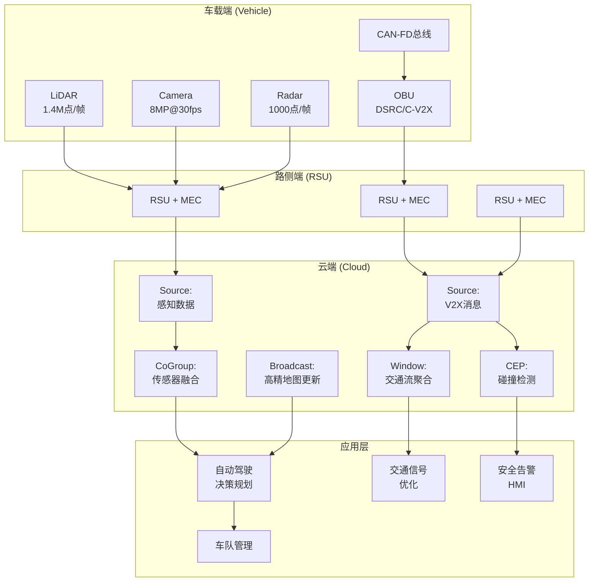
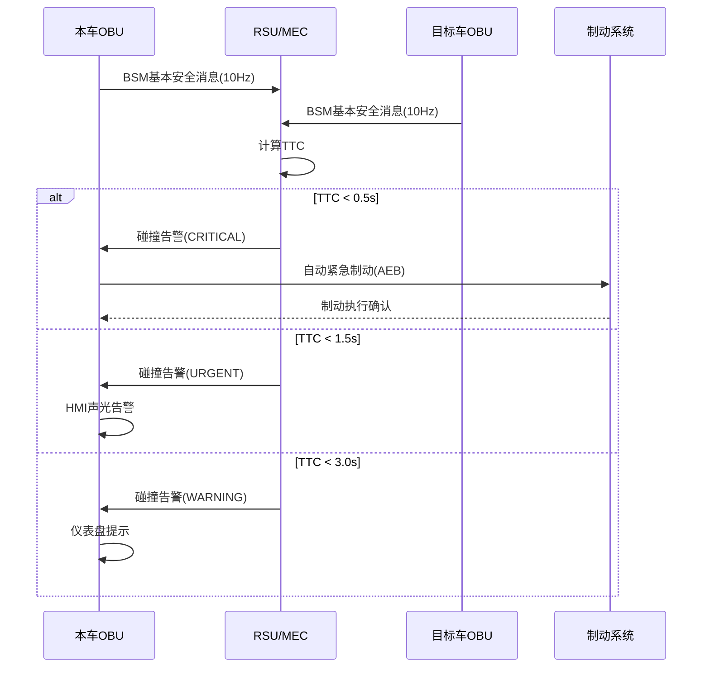
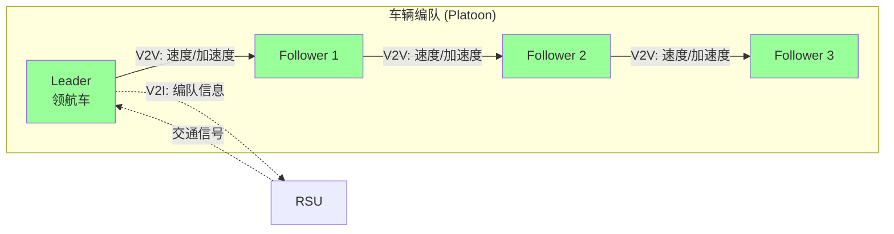

# 实时车联网V2X通信与自动驾驶数据处理案例研究

> 所属阶段: Knowledge/ Flink/ | 前置依赖: [算子全景分类](../01-concept-atlas/operator-deep-dive/01.06-single-input-operators.md) | [复杂事件处理](../01-concept-atlas/operator-deep-dive/01.10-process-and-async-operators.md) | 形式化等级: L4

## 1. 概念定义 (Definitions)

### Def-V2X-01-01: 车联网V2X系统 (Connected Vehicle V2X System)

车联网V2X系统是通过专用短程通信(DSRC)或蜂窝车联网(C-V2X)技术，实现车辆与车辆(V2V)、车辆与基础设施(V2I)、车辆与行人(V2P)、车辆与网络(V2N)之间低时延信息交换的协同系统。

$$\mathcal{V} = (O, R, I, N, F)$$

其中 $O$ 为车载单元(OBU)感知数据流，$R$ 为路侧单元(RSU)广播流，$I$ 为交通基础设施信号流，$N$ 为云端网络服务流，$F$ 为流计算处理拓扑。

### Def-V2X-01-02: 碰撞时间 (Time-to-Collision, TTC)

碰撞时间定义为在当前运动状态下，两车到达同一空间位置所需时间：

$$TTC_{ij} = \frac{D_{ij}}{v_i \cdot \cos\theta_i - v_j \cdot \cos\theta_j}$$

其中 $D_{ij}$ 为两车相对距离，$v_i, v_j$ 为车速，$\theta_i, \theta_j$ 为航向角与两车连线夹角。

安全分级：

- $TTC > 3.0$s：安全，无需干预
- $1.5$s $< TTC \leq 3.0$s：警告，提示驾驶员
- $0.5$s $< TTC \leq 1.5$s：紧急告警，自动制动准备
- $TTC \leq 0.5$s：碰撞不可避免，启动被动安全系统

### Def-V2X-01-03: 感知数据融合帧 (Perception Fusion Frame)

感知数据融合帧是将多传感器（激光雷达LiDAR、摄像头Camera、毫米波Radar）在同一时间窗口内的数据对齐融合后的统一表示：

$$Frame(t) = Fusion(LiDAR(t \pm \delta_L), Camera(t \pm \delta_C), Radar(t \pm \delta_R))$$

其中 $\delta_L, \delta_C, \delta_R$ 为各传感器的采集时间偏移，需通过时间同步机制对齐至统一时间戳 $t$。

### Def-V2X-01-04: 高精地图动态图层 (HD Map Dynamic Layer)

高精地图动态图层是在静态高精地图基础上叠加实时动态信息的增强表示：

$$HDMap_{dynamic}(t) = HDMap_{static} \oplus \Delta_{traffic}(t) \oplus \Delta_{construction}(t) \oplus \Delta_{weather}(t)$$

其中 $\oplus$ 为图层叠加操作，$\Delta_{traffic}$ 为实时交通流，$\Delta_{construction}$ 为施工区域，$\Delta_{weather}$ 为天气影响区域。

### Def-V2X-01-05: 边缘协同决策延迟 (Edge Collaborative Decision Latency)

边缘协同决策延迟是从感知数据产生到控制指令下发的端到端时延：

$$T_{edge} = T_{sense} + T_{transmit} + T_{process} + T_{decide} + T_{actuate}$$

自动驾驶安全要求：$T_{edge} < 10$ ms（紧急制动场景），$T_{edge} < 100$ ms（车道保持场景）。

## 2. 属性推导 (Properties)

### Lemma-V2X-01-01: V2V通信的碰撞检测覆盖范围

在DSRC通信范围 $R_{comm} = 300$m 且车辆密度 $\rho$ 辆/km的条件下，单车可同时通信的邻车数量期望：

$$E[N_{neighbor}] = \rho \cdot \pi R_{comm}^2 \cdot 10^{-6}$$

**工程约束**: 城市快速路 $\rho \approx 50$ 辆/km，$E[N_{neighbor}] \approx 14$ 辆。OBU需支持至少20个并发连接。

### Lemma-V2X-01-02: 感知数据融合的时延边界

多传感器数据融合的最小时延由最慢传感器的数据帧率决定：

$$T_{fusion} \geq \max\left(\frac{1}{f_{LiDAR}}, \frac{1}{f_{Camera}}, \frac{1}{f_{Radar}}\right)$$

典型配置：LiDAR 10Hz (100ms), Camera 30Hz (33ms), Radar 20Hz (50ms)，则 $T_{fusion} \geq 100$ms。

### Prop-V2X-01-01: 编队行驶的节油最优间距

在高速公路编队行驶中，跟车距离 $d$ 与空气阻力节省率 $\eta_{aero}$ 的关系：

$$\eta_{aero}(d) = \eta_{max} \cdot \left(1 - e^{-d/d_0}\right)$$

其中 $d_0 \approx 10$m 为特征距离，$\eta_{max} \approx 15\%$ 为最大节油率。

**最优间距**: $d^* = 15$-20m，此时节油率约12-14%，同时保留安全制动距离。

### Prop-V2X-01-02: C-V2X与DSRC的可靠性对比

在相同发射功率条件下，C-V2X(PC5模式)的通信可靠性优于DSRC：

$$P_{success}^{C-V2X}(d) > P_{success}^{DSRC}(d), \quad \forall d > 150\text{m}$$

**论证**: C-V2X采用SC-FDMA调制，具有更好的链路预算和覆盖范围；DSRC基于802.11p，在远距离时丢包率显著上升。实测数据表明，在300m距离处C-V2X丢包率 < 5%，DSRC丢包率 > 20%。

## 3. 关系建立 (Relations)

### 与算子体系的映射

| 车联网场景 | Flink算子 | 算子作用 |
|------------|-----------|---------|
| 多车CAN总线接入 | `SourceFunction` | 车载以太网/CAN-FD数据接入 |
| 传感器时间同步 | `ProcessFunction` | 多传感器数据对齐与插值 |
| 碰撞检测 | `CEPPattern` | TTC阈值突破模式匹配 |
| 高精地图更新 | `BroadcastStream` | 动态图层广播到所有车辆 |
| 交通流聚合 | `WindowAggregate` | 路段车速/密度实时统计 |
| 编队协同 | `KeyedCoProcessFunction` | 编队Leader-Follower状态同步 |
| 边缘推理 | `AsyncFunction` | 调用边缘端AI推理服务 |

### 与前沿技术的关联

- **5G网络切片**: 为V2X通信分配uRLLC(超可靠低时延)切片，保障控制指令传输
- **边缘计算(MEC)**: 路侧单元部署MEC服务器，本地处理感知数据，减少云端往返时延
- **数字孪生**: 城市交通数字孪生与V2X数据实时同步，支持仿真验证

## 4. 论证过程 (Argumentation)

### 4.1 车联网流处理的核心挑战

**挑战1: 极端数据吞吐量**
L4级自动驾驶单车每秒产生2-5GB数据（LiDAR点云 ~1.4M点/帧，Camera 8MP@30fps，Radar ~1000点/帧）。百辆车同时上传时，峰值吞吐达500GB/s。

**挑战2: 硬实时约束**
紧急制动决策必须在10ms内完成。传统批处理架构无法满足此约束，需采用流计算+边缘推理的混合架构。

**挑战3: 数据安全与隐私**
车辆轨迹数据涉及用户隐私，位置信息需匿名化处理；V2X消息需防止中间人攻击和重放攻击。

**挑战4: 异构通信协议**
DSRC(802.11p)、C-V2X(PC5/LTE-Uu/5G NR)、CAN/CAN-FD、车载以太网(100BASE-T1/1000BASE-T1)等多种协议并存。

### 4.2 方案选型论证

**为什么采用流计算而非传统SCADA？**

- SCADA系统通常为秒级刷新，无法满足10ms级决策需求
- 流计算支持复杂事件模式（碰撞检测、编队协同），SCADA缺乏此能力
- Flink的Checkpoint机制保证感知数据处理不丢失，满足安全完整性等级(SIL)要求

**为什么采用Event Time + Watermark处理传感器数据？**

- 车载多传感器时钟存在微秒级偏差，需时间同步协议（如gPTP）对齐
- 网络传输导致数据乱序，Event Time保证因果一致性
- Watermark机制容忍传感器偶发丢包（LiDAR在雨雾天气丢包率可达5%）

## 5. 形式证明 / 工程论证 (Proof / Engineering Argument)

### Thm-V2X-01-01: 编队行驶安全距离定理

在编队行驶中，若后车采用与前车相同减速度 $a_{brake}$ 且通信时延为 $\Delta t_{comm}$，则最小安全距离为：

$$d_{safe} = v_0 \cdot \Delta t_{comm} + \frac{v_0^2}{2a_{brake}} - \frac{(v_0 - a_{brake} \cdot \Delta t_{comm})^2}{2a_{brake}}$$

**证明**:

1. 前车紧急制动，减速度 $a_{brake}$
2. 后车通过V2X接收制动信号，通信时延 $\Delta t_{comm}$
3. 时延内后车以原速行驶，距离增量 $v_0 \cdot \Delta t_{comm}$
4. 后车开始制动，制动距离 $\frac{v_0^2}{2a_{brake}}$（假设初速 $v_0$）
5. 前车在时延内已减速至 $v_0 - a_{brake} \cdot \Delta t_{comm}$
6. 两车停止时恰好不相撞的条件导出上述公式

**工程意义**: 当 $v_0 = 120$km/h，$a_{brake} = 6$m/s²，$\Delta t_{comm} = 10$ms时，$d_{safe} \approx 0.33$ + 92.6 - 90.7 $\approx 2.2$m。实际部署保留5-10倍裕量，取 $d_{safe} = 15$-20m。

## 6. 实例验证 (Examples)

### 6.1 碰撞预警实时检测Pipeline

```java
// Real-time collision warning using V2V communication
StreamExecutionEnvironment env = StreamExecutionEnvironment.getExecutionEnvironment();
env.setStreamTimeCharacteristic(TimeCharacteristic.EventTime);

// Vehicle telemetry stream from OBU
DataStream<VehicleTelemetry> telemetryStream = env
    .addSource(new V2XSource("dsrc://rsu.local:4200"))
    .assignTimestampsAndWatermarks(
        WatermarkStrategy.<VehicleTelemetry>forBoundedOutOfOrderness(
            Duration.ofMillis(50))
        .withTimestampAssigner((tel, ts) -> tel.getGpsTimestamp())
    );

// CEP pattern for TTC-based collision detection
Pattern<VehicleTelemetry, ?> collisionPattern = Pattern
    .<VehicleTelemetry>begin("ego-vehicle")
    .where(new SimpleCondition<VehicleTelemetry>() {
        @Override
        public boolean filter(VehicleTelemetry t) {
            return t.getVehicleId().equals(EGO_VEHICLE_ID);
        }
    })
    .followedBy("target-vehicle")
    .where(new IterativeCondition<VehicleTelemetry>() {
        @Override
        public boolean filter(VehicleTelemetry t, Context<VehicleTelemetry> ctx) {
            try {
                // Get ego vehicle from pattern context
                VehicleTelemetry ego = ctx.getEventsForPattern("ego-vehicle")
                    .iterator().next();
                double ttc = calculateTTC(ego, t);
                return ttc > 0 && ttc < 3.0; // TTC within warning threshold
            } catch (Exception e) {
                return false;
            }
        }
    })
    .within(Time.milliseconds(100));

// Pattern detection and alert generation
PatternStream<VehicleTelemetry> patternStream = CEP.pattern(
    telemetryStream.keyBy(t -> t.getRoadSegmentId()),
    collisionPattern
);

DataStream<CollisionAlert> alerts = patternStream
    .process(new PatternHandler<VehicleTelemetry, CollisionAlert>() {
        @Override
        public void processMatch(Map<String, List<VehicleTelemetry>> match,
                                Context ctx, Collector<CollisionAlert> out) {
            VehicleTelemetry ego = match.get("ego-vehicle").get(0);
            VehicleTelemetry target = match.get("target-vehicle").get(0);
            double ttc = calculateTTC(ego, target);

            String severity = ttc <= 0.5 ? "CRITICAL" :
                             (ttc <= 1.5 ? "URGENT" : "WARNING");

            out.collect(new CollisionAlert(
                ego.getVehicleId(), target.getVehicleId(),
                ttc, ego.getPosition(), target.getPosition(),
                severity, System.currentTimeMillis()
            ));
        }
    });

alerts.addSink(new HMIAlertSink()); // Display on dashboard

// TTC calculation helper
private double calculateTTC(VehicleTelemetry ego, VehicleTelemetry target) {
    double dx = target.getX() - ego.getX();
    double dy = target.getY() - ego.getY();
    double distance = Math.sqrt(dx*dx + dy*dy);

    double vRelX = target.getVx() - ego.getVx();
    double vRelY = target.getVy() - ego.getVy();
    double vRel = (dx * vRelX + dy * vRelY) / distance;

    return vRel > 0 ? distance / vRel : Double.POSITIVE_INFINITY;
}
```

### 6.2 多传感器数据融合Pipeline

```java
// Multi-sensor perception fusion with time synchronization
DataStream<LidarFrame> lidarStream = env
    .addSource(new LidarSource("192.168.1.10", 2368))
    .assignTimestampsAndWatermarks(
        WatermarkStrategy.<LidarFrame>forBoundedOutOfOrderness(
            Duration.ofMillis(20))
    );

DataStream<CameraFrame> cameraStream = env
    .addSource(new CameraSource("/dev/video0", 30))
    .assignTimestampsAndWatermarks(
        WatermarkStrategy.<CameraFrame>forBoundedOutOfOrderness(
            Duration.ofMillis(33))
    );

DataStream<RadarFrame> radarStream = env
    .addSource(new RadarSource("can0", 0x200))
    .assignTimestampsAndWatermarks(
        WatermarkStrategy.<RadarFrame>forBoundedOutOfOrderness(
            Duration.ofMillis(25))
    );

// Co-Group by time window for synchronization
DataStream<FusedPerception> fusedPerception = lidarStream
    .coGroup(cameraStream)
    .where(frame -> frame.getFrameId())
    .equalTo(frame -> frame.getFrameId())
    .window(TumblingEventTimeWindows.of(Time.milliseconds(100)))
    .apply(new LidarCameraFusion())
    .coGroup(radarStream)
    .where(frame -> frame.getFrameId())
    .equalTo(frame -> frame.getFrameId())
    .window(TumblingEventTimeWindows.of(Time.milliseconds(100)))
    .apply(new FullFusion());

// Object tracking across frames
DataStream<TrackedObject> trackedObjects = fusedPerception
    .keyBy(frame -> frame.getFrameId())
    .process(new ObjectTrackingFunction());

trackedObjects.addSink(new PlanningModuleSink());
```

### 6.3 交通流实时聚合与信号优化

```java
// Real-time traffic flow aggregation for signal optimization
DataStream<VehiclePassing> vehiclePassings = env
    .addSource(new RSUSource("rsu.intersection.001"))
    .assignTimestampsAndWatermarks(
        WatermarkStrategy.<VehiclePassing>forBoundedOutOfOrderness(
            Duration.ofSeconds(5))
    );

// Aggregate traffic metrics per approach per 30-second window
DataStream<TrafficMetrics> trafficMetrics = vehiclePassings
    .keyBy(passing -> passing.getApproachId())
    .window(TumblingEventTimeWindows.of(Time.seconds(30)))
    .aggregate(new TrafficAggregationFunction());

// Adaptive signal timing calculation
DataStream<SignalTiming> signalTimings = trafficMetrics
    .keyBy(metric -> metric.getIntersectionId())
    .process(new SignalOptimizationFunction() {
        private ValueState<SignalPlan> currentPlan;

        @Override
        public void open(Configuration parameters) {
            currentPlan = getRuntimeContext().getState(
                new ValueStateDescriptor<>("signal-plan", SignalPlan.class));
        }

        @Override
        public void processElement(TrafficMetrics metrics, Context ctx,
                                   Collector<SignalTiming> out) throws Exception {
            SignalPlan plan = currentPlan.value();
            if (plan == null) plan = new SignalPlan();

            // Webster's formula for optimal cycle length
            double totalFlow = metrics.getFlowNorth() + metrics.getFlowSouth()
                             + metrics.getFlowEast() + metrics.getFlowWest();
            double totalSaturation = metrics.getSaturationNorth() + metrics.getSaturationSouth()
                                   + metrics.getSaturationEast() + metrics.getSaturationWest();

            if (totalSaturation > 0.85) {
                // Congestion detected, extend cycle
                plan.setCycleLength(120); // seconds
            } else if (totalSaturation < 0.5) {
                // Low traffic, shorten cycle
                plan.setCycleLength(60);
            }

            // Green time allocation proportional to flow ratio
            double greenNorth = plan.getCycleLength() * metrics.getFlowNorth() / totalFlow;
            plan.setGreenNorth((int) greenNorth);
            // ... similar for other approaches

            currentPlan.update(plan);
            out.collect(new SignalTiming(metrics.getIntersectionId(), plan));
        }
    });

signalTimings.addSink(new SignalControllerSink());
```

## 7. 可视化 (Visualizations)

### 图1: 车联网V2X数据处理架构



### 图2: 碰撞检测决策时序



### 图3: 编队行驶协同控制



## 8. 引用参考 (References)
