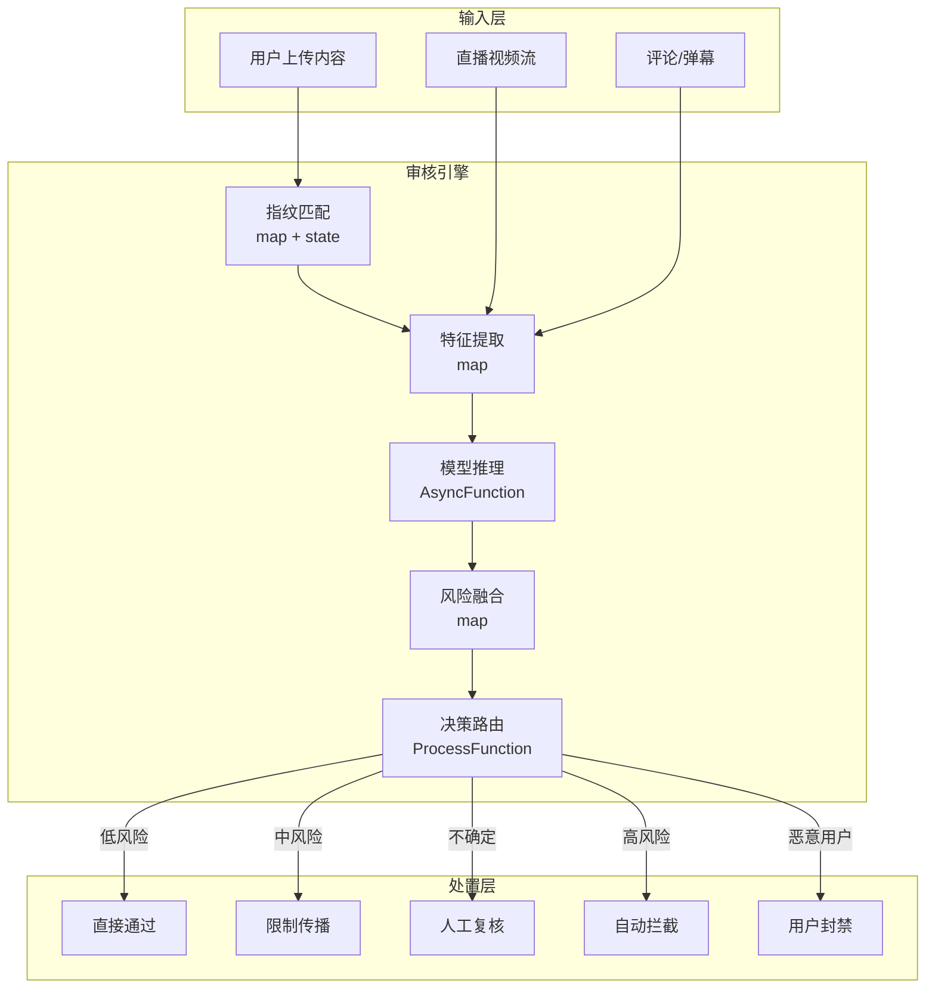
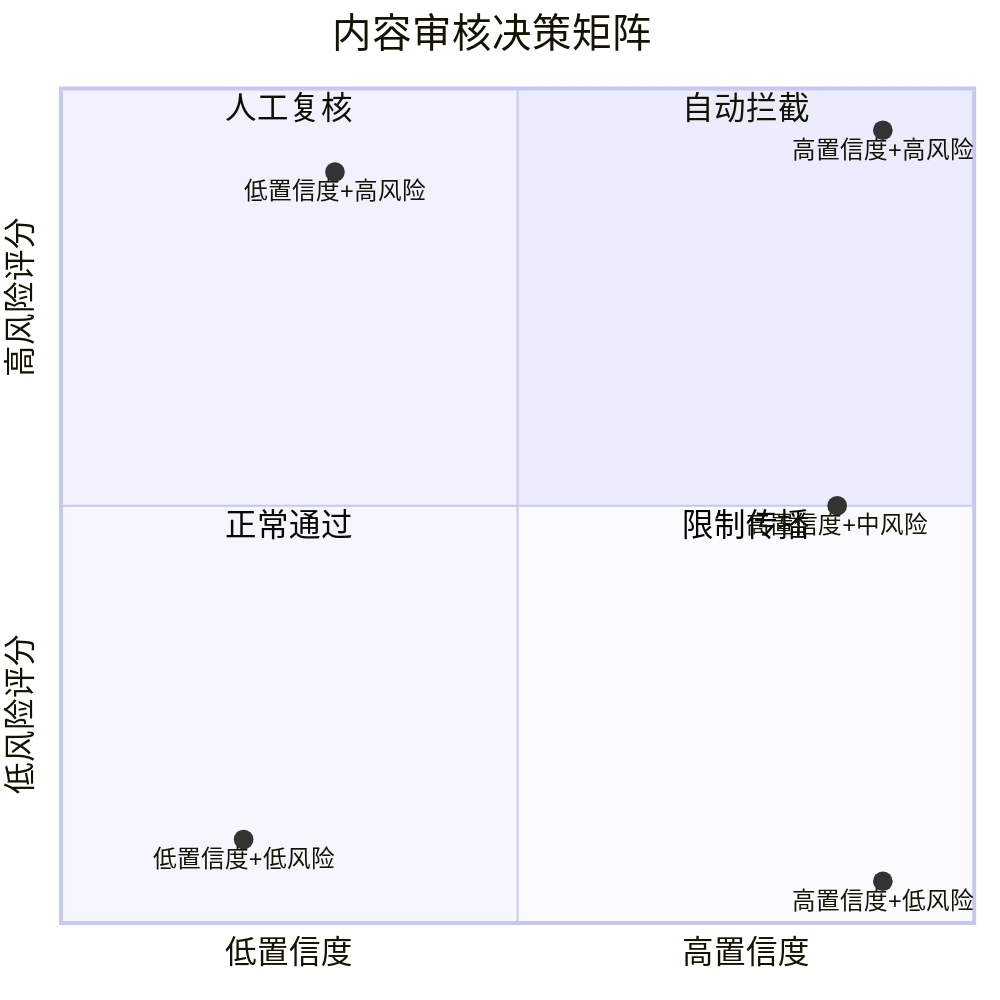

# 算子与实时内容安全审核

> **所属阶段**: Knowledge/10-case-studies | **前置依赖**: [01.10-process-and-async-operators.md](../01-concept-atlas/operator-deep-dive/01.10-process-and-async-operators.md), [operator-ai-ml-integration.md](../06-frontier/operator-ai-ml-integration.md) | **形式化等级**: L3
> **文档定位**: 流处理算子在实时内容审核、风险识别与合规监控中的算子指纹与Pipeline设计
> **版本**: 2026.04

---

## 目录

- [算子与实时内容安全审核](#算子与实时内容安全审核)
  - [目录](#目录)
  - [1. 概念定义 (Definitions)](#1-概念定义-definitions)
    - [Def-MOD-01-01: 内容安全审核（Content Moderation）](#def-mod-01-01-内容安全审核content-moderation)
    - [Def-MOD-01-02: 风险评分模型（Risk Scoring Model）](#def-mod-01-02-风险评分模型risk-scoring-model)
    - [Def-MOD-01-03: 审核决策矩阵（Moderation Decision Matrix）](#def-mod-01-03-审核决策矩阵moderation-decision-matrix)
    - [Def-MOD-01-04: 对抗样本（Adversarial Example）](#def-mod-01-04-对抗样本adversarial-example)
    - [Def-MOD-01-05: 内容指纹（Content Fingerprint）](#def-mod-01-05-内容指纹content-fingerprint)
  - [2. 属性推导 (Properties)](#2-属性推导-properties)
    - [Lemma-MOD-01-01: 审核延迟的吞吐约束](#lemma-mod-01-01-审核延迟的吞吐约束)
    - [Lemma-MOD-01-02: 误报-漏报权衡](#lemma-mod-01-02-误报-漏报权衡)
    - [Prop-MOD-01-01: 多模型集成的精度提升](#prop-mod-01-01-多模型集成的精度提升)
    - [Prop-MOD-01-02: 内容时效性衰减](#prop-mod-01-02-内容时效性衰减)
  - [3. 关系建立 (Relations)](#3-关系建立-relations)
    - [3.1 内容审核Pipeline算子映射](#31-内容审核pipeline算子映射)
    - [3.2 算子指纹](#32-算子指纹)
    - [3.3 审核模型对比](#33-审核模型对比)
  - [4. 论证过程 (Argumentation)](#4-论证过程-argumentation)
    - [4.1 为什么内容审核需要流处理而非离线批处理](#41-为什么内容审核需要流处理而非离线批处理)
    - [4.2 对抗样本的防御策略](#42-对抗样本的防御策略)
    - [4.3 大流量下的降级策略](#43-大流量下的降级策略)
  - [5. 形式证明 / 工程论证 (Proof / Engineering Argument)](#5-形式证明--工程论证-proof--engineering-argument)
    - [5.1 实时内容审核Pipeline](#51-实时内容审核pipeline)
    - [5.2 直播实时审核](#52-直播实时审核)
  - [6. 实例验证 (Examples)](#6-实例验证-examples)
    - [6.1 实战：社交平台内容审核系统](#61-实战社交平台内容审核系统)
    - [6.2 实战：广告内容合规审核](#62-实战广告内容合规审核)
  - [7. 可视化 (Visualizations)](#7-可视化-visualizations)
    - [内容审核Pipeline](#内容审核pipeline)
    - [审核决策矩阵](#审核决策矩阵)
  - [8. 引用参考 (References)](#8-引用参考-references)

---

## 1. 概念定义 (Definitions)

### Def-MOD-01-01: 内容安全审核（Content Moderation）

内容安全审核是对用户生成内容（UGC）进行实时或离线审查，以识别和处置违规内容：

$$\text{Moderation} = \{c \in \text{UGC} : \text{Score}(c) > \theta_{violation}\}$$

审核类型：文本（涉政/暴恐/色情/广告/垃圾）、图像、视频、音频、直播流。

### Def-MOD-01-02: 风险评分模型（Risk Scoring Model）

风险评分是多维度模型输出的综合违规概率：

$$\text{Risk}(c) = \sigma\left(\sum_{i} w_i \cdot f_i(c) + b\right)$$

其中 $f_i(c)$ 为第 $i$ 个特征提取器的输出，$\sigma$ 为sigmoid函数，$w_i$ 为权重。

### Def-MOD-01-03: 审核决策矩阵（Moderation Decision Matrix）

审核决策基于风险评分和置信度的二维分类：

| 风险评分 | 高置信度 | 低置信度 |
|---------|---------|---------|
| **高** | 自动拦截 | 人工复核 |
| **中** | 限制传播 | 标记观察 |
| **低** | 正常通过 | 正常通过 |

### Def-MOD-01-04: 对抗样本（Adversarial Example）

对抗样本是故意构造以欺骗审核模型的输入：

$$x_{adv} = x + \epsilon \cdot \text{sign}(\nabla_x J(\theta, x, y))$$

其中 $\epsilon$ 为扰动幅度，$J$ 为损失函数。

### Def-MOD-01-05: 内容指纹（Content Fingerprint）

内容指纹是内容的哈希特征，用于快速匹配已知违规内容：

$$\text{Fingerprint}(c) = \text{Hash}(\text{Feature}(c))$$

常用算法：感知哈希（pHash）、局部敏感哈希（LSH）、MinHash。

---

## 2. 属性推导 (Properties)

### Lemma-MOD-01-01: 审核延迟的吞吐约束

审核系统需满足：

$$\lambda \cdot \mathcal{L} < C$$

其中 $\lambda$ 为内容到达率，$\mathcal{L}$ 为平均审核延迟，$C$ 为系统并发容量。当 $\lambda \cdot \mathcal{L} \geq C$ 时，队列将无限增长。

### Lemma-MOD-01-02: 误报-漏报权衡

在固定模型下，降低误报率（FPR）必然提高漏报率（FNR）：

$$\text{FPR}(\theta) \downarrow \implies \text{FNR}(\theta) \uparrow$$

**证明**: 提高阈值 $\theta$ 使更多内容被分类为安全，减少误报但增加漏报。∎

### Prop-MOD-01-01: 多模型集成的精度提升

$N$ 个独立模型的集成误差上界：

$$\text{Error}_{ensemble} \leq \frac{1}{N} \sum_{i} \text{Error}_i \cdot (1 - \text{Corr}_{ij})$$

当模型间相关性低时，集成效果显著。

### Prop-MOD-01-02: 内容时效性衰减

违规内容的传播价值随时间衰减：

$$\text{Harm}(t) = \text{Harm}_0 \cdot e^{-\beta t}$$

其中 $\beta$ 为衰减率。延迟拦截的净危害为 $\int_0^{\mathcal{L}} \text{Harm}(t) \, dt$。

---

## 3. 关系建立 (Relations)

### 3.1 内容审核Pipeline算子映射

| 处理阶段 | 算子 | 功能 | 延迟要求 |
|---------|------|------|---------|
| **内容接入** | Source | 接收UGC | < 10ms |
| **指纹匹配** | map + state | 快速匹配已知违规 | < 5ms |
| **特征提取** | map | 文本/图像/视频特征 | < 20ms |
| **模型推理** | AsyncFunction | 调用ML模型 | < 100ms |
| **风险评分** | map | 多模型融合评分 | < 5ms |
| **决策路由** | ProcessFunction | 根据评分路由 | < 5ms |
| **处置执行** | AsyncFunction | 删除/限流/通知 | 异步 |
| **审计日志** | map | 记录审核结果 | < 5ms |

### 3.2 算子指纹

| 维度 | 内容审核特征 |
|------|------------|
| **核心算子** | AsyncFunction（ML推理）、KeyedProcessFunction（用户行为状态机）、BroadcastProcessFunction（策略更新）、map（特征提取） |
| **状态类型** | ValueState（用户信誉分）、MapState（内容指纹库）、BroadcastState（审核策略） |
| **时间语义** | 处理时间为主（审核强调实时性） |
| **数据特征** | 高并发（百万级QPS）、高异构（文本/图/视频/音频）、强时间敏感 |
| **状态热点** | 热门内容指纹Key、高活跃用户Key |
| **性能瓶颈** | ML模型推理延迟、大规模指纹匹配 |

### 3.3 审核模型对比

| 内容类型 | 模型 | 延迟 | 准确率 | 适用场景 |
|--------|------|------|--------|---------|
| **文本** | BERT/RoBERTa | 10-50ms | 95%+ | 涉政/色情/广告识别 |
| **图像** | ResNet/ViT | 20-100ms | 93%+ | 暴恐/色情/二维码 |
| **视频** | 3D-CNN + 帧采样 | 100-500ms | 90%+ | 直播/短视频审核 |
| **音频** | wav2vec + 分类器 | 50-200ms | 88%+ | 语音违规识别 |
| **指纹** | pHash/LSH | 1-5ms | 99%+ | 已知违规匹配 |

---

## 4. 论证过程 (Argumentation)

### 4.1 为什么内容审核需要流处理而非离线批处理

离线批处理的问题：

- 延迟高：违规内容在批处理间隔内已广泛传播
- 实时性差：无法应对直播等实时场景
- 用户体验：正常内容被延迟发布

流处理的优势：

- 实时拦截：内容上传/发布时即时审核
- 直播同步：视频流实时逐帧审核
- 动态策略：策略更新秒级生效

### 4.2 对抗样本的防御策略

**攻击方式**:

1. **文本**: 谐音替换（"涉政"→"涉正"）、特殊符号插入
2. **图像**: 对抗噪声、局部遮挡、风格迁移
3. **视频**: 快速闪烁、帧率操纵

**防御方案**:

1. **数据增强**: 训练时加入对抗样本
2. **多模态融合**: 文本+图像+音频联合审核
3. **对抗训练**: 使用FGSM/PGD生成对抗样本训练

### 4.3 大流量下的降级策略

**场景**: 突发事件导致UGC流量激增10倍，ML模型推理成为瓶颈。

**降级策略**:

1. **规则优先**: 高置信度规则直接决策，跳过模型推理
2. **采样审核**: 对低优先级内容采样审核
3. **异步化**: 非实时场景（如历史内容）转入离线队列
4. **模型缓存**: 相似内容复用推理结果

---

## 5. 形式证明 / 工程论证 (Proof / Engineering Argument)

### 5.1 实时内容审核Pipeline

```java
public class ContentModerationPipeline {

    public static void main(String[] args) throws Exception {
        StreamExecutionEnvironment env = StreamExecutionEnvironment.getExecutionEnvironment();

        // 1. 内容接入
        DataStream<UserContent> content = env.addSource(new ContentSource());

        // 2. 指纹快速匹配
        DataStream<ContentCheckResult> fingerprintChecked = content
            .keyBy(UserContent::getContentHash)
            .process(new FingerprintMatchFunction());

        // 3. 分流：已知违规直接拦截
        DataStream<UserContent> toReview = fingerprintChecked
            .filter(r -> !r.isKnownViolation())
            .map(ContentCheckResult::getContent);

        // 4. 多模型推理
        DataStream<ModelScores> textScores = AsyncDataStream.unorderedWait(
            toReview.filter(c -> c.getType().equals("TEXT")),
            new TextModerationFunction(),
            Time.milliseconds(50),
            1000
        );

        DataStream<ModelScores> imageScores = AsyncDataStream.unorderedWait(
            toReview.filter(c -> c.getType().equals("IMAGE")),
            new ImageModerationFunction(),
            Time.milliseconds(100),
            1000
        );

        DataStream<ModelScores> allScores = textScores.union(imageScores);

        // 5. 风险评分融合
        DataStream<RiskScore> riskScores = allScores
            .map(new RiskFusionFunction());

        // 6. 决策路由
        riskScores.keyBy(RiskScore::getContentId)
            .process(new ModerationDecisionFunction())
            .addSink(new ActionSink());

        env.execute("Content Moderation Pipeline");
    }
}

// 指纹匹配算子
public class FingerprintMatchFunction extends KeyedProcessFunction<String, UserContent, ContentCheckResult> {
    private MapState<String, ViolationRecord> fingerprintDB;

    @Override
    public void processElement(UserContent content, Context ctx, Collector<ContentCheckResult> out) throws Exception {
        String hash = content.getContentHash();
        ViolationRecord record = fingerprintDB.get(hash);

        if (record != null) {
            // 已知违规，直接拦截
            out.collect(new ContentCheckResult(content.getId(), true, record.getViolationType(), 1.0));
        } else {
            out.collect(new ContentCheckResult(content.getId(), false, null, 0.0, content));
        }
    }
}

// 审核决策算子
public class ModerationDecisionFunction extends KeyedProcessFunction<String, RiskScore, ModerationAction> {
    private ValueState<UserReputation> userReputation;

    @Override
    public void processElement(RiskScore score, Context ctx, Collector<ModerationAction> out) throws Exception {
        UserReputation rep = userReputation.value();
        if (rep == null) rep = new UserReputation();

        double adjustedThreshold = getAdjustedThreshold(rep);

        String action;
        if (score.getScore() > adjustedThreshold && score.getConfidence() > 0.9) {
            action = "BLOCK";
            rep.incrementViolationCount();
        } else if (score.getScore() > adjustedThreshold * 0.7) {
            action = "REVIEW";
        } else if (score.getScore() > adjustedThreshold * 0.3) {
            action = "LIMIT";
        } else {
            action = "PASS";
        }

        out.collect(new ModerationAction(score.getContentId(), action, score.getScore(), ctx.timestamp()));
        userReputation.update(rep);
    }

    private double getAdjustedThreshold(UserReputation rep) {
        double base = 0.7;
        // 高违规率用户降低阈值
        if (rep.getViolationRate() > 0.1) base -= 0.2;
        // 高信誉用户提高阈值
        if (rep.getReputationScore() > 0.9) base += 0.1;
        return Math.max(0.3, Math.min(0.9, base));
    }
}
```

### 5.2 直播实时审核

```java
// 直播视频帧流
DataStream<VideoFrame> frames = env.addSource(new LiveStreamSource());

// 帧级审核（每5帧采样）
DataStream<FrameAuditResult> frameResults = frames
    .filter(f -> f.getSequenceNumber() % 5 == 0)
    .map(new FrameSampler())
    .keyBy(VideoFrame::getStreamId)
    .process(new KeyedProcessFunction<String, VideoFrame, FrameAuditResult>() {
        private ValueState<StreamAuditState> auditState;

        @Override
        public void processElement(VideoFrame frame, Context ctx, Collector<FrameAuditResult> out) throws Exception {
            StreamAuditState state = auditState.value();
            if (state == null) state = new StreamAuditState();

            // 调用图像审核模型（简化）
            double risk = callImageModel(frame);
            state.updateRiskHistory(risk);

            // 滑动窗口平均风险
            double avgRisk = state.getWindowedRisk(30);  // 最近30帧

            // 连续高风险检测
            if (avgRisk > 0.8 && state.getConsecutiveHighRiskFrames() > 10) {
                out.collect(new FrameAuditResult(frame.getStreamId(), "LIVE_BLOCK", avgRisk, ctx.timestamp()));
            } else if (avgRisk > 0.5) {
                out.collect(new FrameAuditResult(frame.getStreamId(), "LIVE_WARNING", avgRisk, ctx.timestamp()));
            }

            auditState.update(state);
        }
    });

// 直播流级决策
frameResults.keyBy(FrameAuditResult::getStreamId)
    .window(SlidingProcessingTimeWindows.of(Time.seconds(10), Time.seconds(2)))
    .aggregate(new StreamRiskAggregate())
    .filter(r -> r.getMaxRisk() > 0.8)
    .addSink(new LiveStreamControlSink());
```

---

## 6. 实例验证 (Examples)

### 6.1 实战：社交平台内容审核系统

```java
// 完整审核Pipeline
DataStream<UserContent> content = env.addSource(new KafkaSource<>("user-content"));

// 用户信誉查询（Async）
DataStream<UserContentWithRep> contentWithRep = AsyncDataStream.unorderedWait(
    content,
    new UserReputationLookup(),
    Time.milliseconds(20),
    500
);

// 审核处理
contentWithRep
    .keyBy(c -> c.getContent().getId())
    .process(new ContentModerationFunction())
    .addSink(new ModerationResultSink());

// 用户行为更新
DataStream<ModerationAction> actions = env.addSource(new ActionSource());
actions.keyBy(ModerationAction::getUserId)
    .process(new UserBehaviorUpdateFunction())
    .addSink(new UserProfileSink());
```

### 6.2 实战：广告内容合规审核

```java
// 广告内容流
DataStream<Advertisement> ads = env.addSource(new AdSubmissionSource());

// 多维度审核
ads.map(ad -> {
    // 文本审核
    double textRisk = textModel.score(ad.getTitle() + " " + ad.getDescription());
    // 图像审核
    double imageRisk = imageModel.score(ad.getImageUrl());
    // 落地页审核
    double landingRisk = landingPageModel.score(ad.getLandingUrl());

    return new AdRiskScore(ad.getId(), textRisk, imageRisk, landingRisk);
})
.map(score -> {
    double overall = Math.max(score.getTextRisk(), Math.max(score.getImageRisk(), score.getLandingRisk()));
    return new AdModerationResult(score.getAdId(), overall);
})
.filter(r -> r.getRisk() > 0.7)
.addSink(new AdRejectionSink());
```

---

## 7. 可视化 (Visualizations)

### 内容审核Pipeline



### 审核决策矩阵



---

## 8. 引用参考 (References)


---

*关联文档*: [01.10-process-and-async-operators.md](../01-concept-atlas/operator-deep-dive/01.10-process-and-async-operators.md) | [operator-ai-ml-integration.md](../06-frontier/operator-ai-ml-integration.md) | [realtime-social-media-sentiment-analysis.md](../06-frontier/operator-social-media-sentiment-analysis.md)
