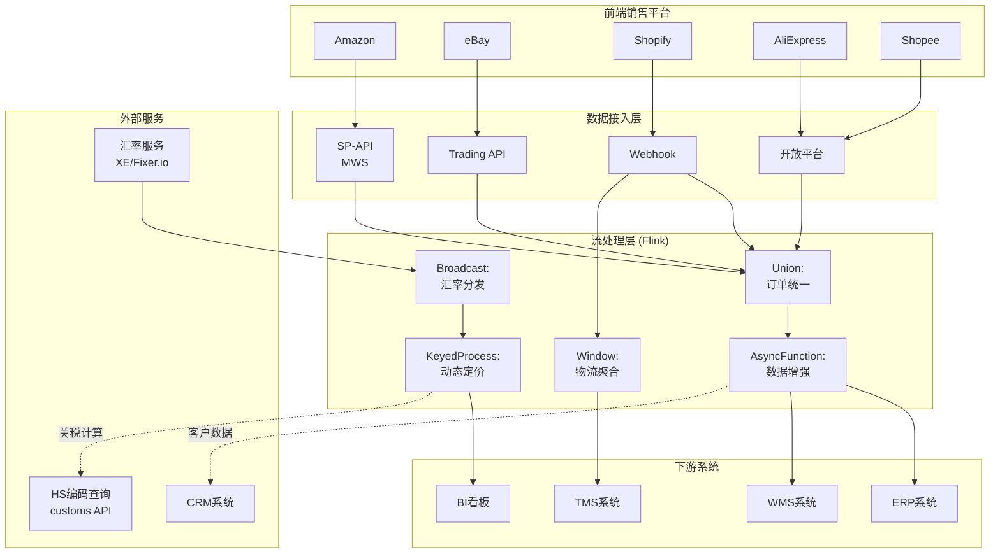
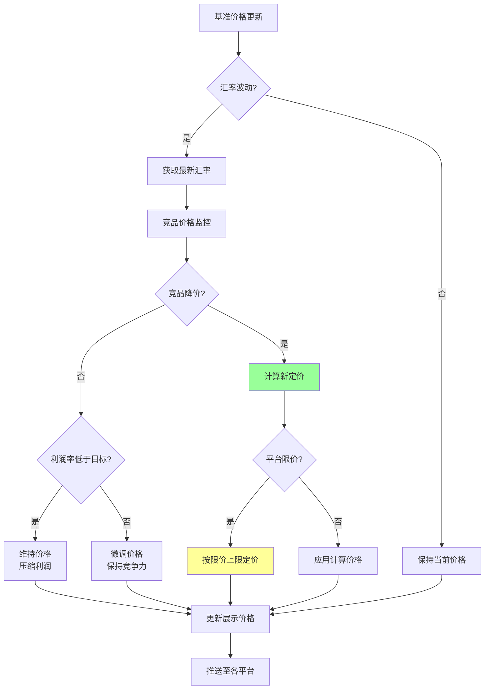
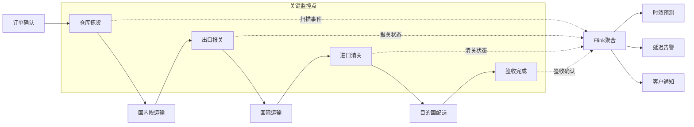

# 实时跨境电商运营案例研究

> 所属阶段: Knowledge/ Flink/ | 前置依赖: [算子全景分类](../01-concept-atlas/operator-deep-dive/01.06-single-input-operators.md) | [Session Window](../01-concept-atlas/operator-deep-dive/01.09-window-operators.md) | 形式化等级: L4

## 1. 概念定义 (Definitions)

### Def-CBE-01-01: 跨境电商实时运营系统 (Cross-border E-commerce Real-time Operations System)

跨境电商实时运营系统是指通过流计算平台整合多国家/地区的订单、支付、物流、关税、汇率数据，实现全球业务实时决策与自动化运营的集成系统。

$$\mathcal{X} = (M, C, O, L, R, F)$$

其中 $M$ 为多市场平台数据流（Amazon/eBay/AliExpress/Shopee等），$C$ 为货币与汇率数据流，$O$ 为跨境订单流，$L$ 为国际物流追踪流，$R$ 为关税与合规规则流，$F$ 为流计算处理拓扑。

### Def-CBE-01-02: 动态汇率定价 (Dynamic FX Pricing)

动态汇率定价指根据实时汇率波动自动调整商品展示价格的策略：

$$P_{display}(t) = P_{base} \cdot FX_{spot}(t) \cdot (1 + \delta_{margin}) \cdot \eta_{competitive}(t)$$

其中 $P_{base}$ 为基准本币价格，$FX_{spot}(t)$ 为实时即期汇率，$\delta_{margin}$ 为目标利润率，$\eta_{competitive}(t)$ 为竞争动态调整因子（基于竞品价格监控）。

### Def-CBE-01-03: 关税预估引擎 (Duty Estimation Engine)

关税预估引擎根据商品HS编码、原产地、目的国、申报价值计算预估税费：

$$Duty = \sum_{i} Q_i \cdot V_i \cdot (Rate_{HS_i} + Surcharge_{country})$$

其中 $Q_i$ 为商品数量，$V_i$ 为单价，$Rate_{HS_i}$ 为HS编码对应税率，$Surcharge_{country}$ 为目的国附加费（如美国301条款、欧盟反倾销税）。

### Def-CBE-01-04: 跨境物流时效窗 (Cross-border Logistics Time Window)

跨境物流时效窗定义为从订单确认到目的国清关完成的承诺时间区间：

$$T_{crossborder} = T_{pick} + T_{intl\_transit} + T_{customs} + T_{lastmile}$$

典型时效分级：

- 极速专线: $T \leq 5$ 工作日（商业快递DHL/FedEx）
- 标准专线: $T \leq 10$ 工作日（专线物流）
- 经济邮政: $T \leq 20$ 工作日（万国邮联）

### Def-CBE-01-05: 多市场库存虚拟池 (Multi-market Virtual Inventory Pool)

多市场库存虚拟池是将物理库存按规则动态分配至多个电商平台的抽象机制：

$$Avail_{market_j}(t) = \sum_{k} Alloc_{warehouse_k \to market_j}(t) - Reserved_{market_j}(t)$$

其中 $Alloc$ 为仓库到市场的动态分配量，$Reserved$ 为已预留未付款订单量。

## 2. 属性推导 (Properties)

### Lemma-CBE-01-01: 汇率波动对毛利率的影响边界

在动态定价系统未激活时，汇率波动对跨境订单毛利率的影响有界：

$$\left|\frac{\Delta Margin}{Margin_0}\right| \leq \frac{|\Delta FX|}{FX_0} \cdot \frac{1}{1 + \delta_{margin}}$$

**证明**: 毛利率 $Margin = (P_{display} - Cost) / P_{display}$。若 $P_{display}$ 以本币固定，$Cost$ 包含外币采购成本，则汇率变动 $\Delta FX$ 直接影响成本。代入 $P_{display} = Cost_0 \cdot (1 + \delta_{margin}) / FX_0$ 得上述边界。

**工程意义**: 当目标利润率 $\delta_{margin} = 30\%$ 时，汇率波动5%导致毛利率波动约3.8%。动态定价可将此波动压缩至 < 0.5%。

### Lemma-CBE-01-02: 虚拟库存池的超卖概率上界

在多市场共享库存且分配延迟为 $\Delta_{alloc}$ 的条件下，超卖概率满足：

$$P_{oversell} \leq 1 - e^{-\lambda \cdot \Delta_{alloc} \cdot (1 - \rho)}$$

其中 $\lambda$ 为订单到达率，$\rho$ 为库存余量比例。

**证明**: 在分配延迟 $\Delta_{alloc}$ 内，新到达订单数服从泊松分布 $Poisson(\lambda \cdot \Delta_{alloc})$。当累计需求超过可用库存时发生超卖。由泊松分布尾概率得上述上界。

### Prop-CBE-01-01: 关税规则变更的级联影响

目的国关税规则变更对商品定价产生级联影响：

$$\Delta P_{final} = \Delta Duty + \Delta Compliance + \Delta Margin_{adjust}$$

**论证**: 关税增加 $\Delta Duty$ 直接推高成本；合规要求变化（如新增认证）增加 $\Delta Compliance$；若平台限价约束存在，卖家可能被迫压缩 $\Delta Margin_{adjust}$。级联效应可能导致某些SKU退出该市场。

### Prop-CBE-01-02: 多市场库存调拨的最优性

在需求预测误差 $\epsilon_d$ 和调拨成本 $C_{transfer}$ 已知时，库存前置策略优于纯需求驱动策略的条件：

$$E[Stockout_{pure}] \cdot V_{lost} > C_{transfer} + E[Stockout_{preposition}] \cdot V_{lost}$$

其中 $V_{lost}$ 为缺货导致的期望损失（含客户流失成本）。

## 3. 关系建立 (Relations)

### 与算子体系的映射

| 跨境电商场景 | Flink算子 | 算子作用 |
|------------|-----------|---------|
| 多平台订单接入 | `Union` + `AsyncFunction` | 统一Amazon/eBay/独立站订单格式 |
| 汇率实时更新 | `BroadcastStream` | 汇率表广播到所有定价计算节点 |
| 动态定价计算 | `KeyedProcessFunction` | 按SKU键控，实时更新展示价格 |
| 关税预估 | `MapFunction` + `AsyncFunction` | 调用HS编码查询API计算税费 |
| 库存虚拟池 | `KeyedProcessFunction` | 维护多市场库存分配状态 |
| 物流追踪聚合 | `WindowAggregate` | 按订单窗口聚合多段物流事件 |
| 竞品价格监控 | `CEPPattern` | 价格异动模式检测 |

### 与业务系统的关联

- **ERP系统**: 商品主数据、采购订单、财务结算
- **WMS系统**: 多仓库存、出入库操作
- **TMS系统**: 物流商对接、运单追踪
- **CRM系统**: 客户分群、复购预测
- **合规系统**: 出口管制、目的国法规

## 4. 论证过程 (Argumentation)

### 4.1 跨境电商实时运营的核心挑战

**挑战1: 多市场异构数据整合**
Amazon MWS/SP-API、eBay Trading API、Shopify Admin API、AliExpress开放平台等，数据格式、字段定义、时区、分页机制各不相同。流处理平台需统一Schema并处理API限流（Rate Limit）。

**挑战2: 汇率与关税的实时性**
汇率每秒波动，关税规则可能随政策变化。商品展示价格若延迟更新超过1分钟，可能在汇率剧烈波动期造成亏损订单。

**挑战3: 跨境物流的不可预测性**
国际段运输受天气、港口拥堵、海关查验影响，实际到达时间方差大。需基于历史数据动态调整承诺时效。

**挑战4: 合规复杂性**
GDPR（欧盟数据保护）、CCPA（加州隐私法）、出口管制（EAR/ITAR）、产品认证（CE/FCC/CCC）等多维度合规要求。

### 4.2 方案选型论证

**为什么选用Broadcast Stream分发汇率？**

- 汇率数据量小（几百种货币对），但读取频率极高（每个定价计算都需要）
- Broadcast Stream保证所有并行实例收到相同汇率快照，避免定价不一致
- 汇率更新频率通常为秒级，Broadcast的轻量级更新机制匹配此模式

**为什么选用Event Time处理物流追踪？**

- 物流事件来自全球不同时区，数据到达存在显著乱序（海运事件可能延迟数小时上报）
- Event Time + Watermark保证即使在数据乱序时，物流状态聚合仍正确

## 5. 形式证明 / 工程论证 (Proof / Engineering Argument)

### Thm-CBE-01-01: 动态定价的期望收益最优性定理

在满足以下假设时，动态定价策略的期望收益优于固定定价：

**假设**:

1. 汇率波动 $FX(t)$ 服从均值回归过程：$dFX = \theta(\mu - FX)dt + \sigma dW$
2. 需求价格弹性 $\epsilon_p$ 为常数
3. 调整成本 $C_{adjust}$ 可忽略

**定理**: 动态定价的期望收益 $E[R_{dynamic}]$ 满足：

$$E[R_{dynamic}] = E[R_{fixed}] + \frac{\sigma^2}{4\theta} \cdot \epsilon_p \cdot E[Q]$$

**证明概要**:

1. 固定定价下，汇率波动导致毛利率随机波动，期望收益为 $E[R_{fixed}] = E[FX] \cdot P \cdot Q - Cost$
2. 动态定价下，价格随汇率调整：$P(t) = P_0 \cdot FX(t) / E[FX]$
3. 需求受价格影响：$Q(t) = Q_0 \cdot (P(t)/P_0)^{\epsilon_p}$
4. 对均值回归过程应用伊藤引理，展开期望收益
5. 二阶项（波动项）产生额外收益 $\frac{\sigma^2}{4\theta} \cdot \epsilon_p \cdot E[Q]$

**工程意义**: 当汇率波动率 $\sigma$ 较高且需求弹性 $\epsilon_p$ 为负（正常商品）时，动态定价可提升3-8%期望收益。

## 6. 实例验证 (Examples)

### 6.1 多平台订单统一接入Pipeline

```java
// Multi-platform order ingestion with unified schema
StreamExecutionEnvironment env = StreamExecutionEnvironment.getExecutionEnvironment();

// Amazon orders
DataStream<RawOrder> amazonOrders = env
    .addSource(new AmazonSPAPISource(credentials))
    .map(new AmazonOrderParser());

// eBay orders
DataStream<RawOrder> ebayOrders = env
    .addSource(new EbayTradingSource(credentials))
    .map(new EbayOrderParser());

// Shopify orders
DataStream<RawOrder> shopifyOrders = env
    .addSource(new ShopifyWebhookSource(endpoint))
    .map(new ShopifyOrderParser());

// Unified order stream
DataStream<UnifiedOrder> unifiedOrders = amazonOrders
    .union(ebayOrders, shopifyOrders)
    .map(new OrderUnifier())
    .assignTimestampsAndWatermarks(
        WatermarkStrategy.<UnifiedOrder>forBoundedOutOfOrderness(
            Duration.ofMinutes(5))
        .withTimestampAssigner((order, ts) -> order.getOrderTime())
    );

// Enrich with customer data
DataStream<EnrichedOrder> enrichedOrders = AsyncDataStream
    .unorderedWait(
        unifiedOrders,
        new CustomerEnrichmentFunction(),
        1000, TimeUnit.MILLISECONDS, 100
    );

enrichedOrders.addSink(new KafkaSink<>("ecommerce.orders.enriched"));
```

### 6.2 动态汇率定价引擎

```java
// Dynamic pricing engine with broadcast exchange rates
MapStateDescriptor<String, ExchangeRate> fxStateDescriptor =
    new MapStateDescriptor<>("fx-rates", Types.STRING, Types.POJO(ExchangeRate.class));

// Broadcast stream: exchange rates updated every second
BroadcastStream<ExchangeRate> fxBroadcast = env
    .addSource(new ExchangeRateSource("EUR,GBP,JPY,AUD,CAD"))
    .broadcast(fxStateDescriptor);

// Product base prices keyed by SKU
DataStream<ProductPrice> basePrices = env
    .addSource(new ProductCatalogSource())
    .keyBy(price -> price.getSkuId());

// Dynamic price calculation
DataStream<DisplayPrice> displayPrices = basePrices
    .connect(fxBroadcast)
    .process(new KeyedBroadcastProcessFunction<String, ProductPrice, ExchangeRate, DisplayPrice>() {
        private ValueState<ProductPrice> priceState;

        @Override
        public void open(Configuration parameters) {
            priceState = getRuntimeContext().getState(
                new ValueStateDescriptor<>("price", ProductPrice.class));
        }

        @Override
        public void processElement(ProductPrice price, ReadOnlyContext ctx,
                                   Collector<DisplayPrice> out) throws Exception {
            priceState.update(price);
            recalculateAndEmit(ctx, out);
        }

        @Override
        public void processBroadcastElement(ExchangeRate rate, Context ctx,
                                            Collector<DisplayPrice> out) throws Exception {
            // Rate update triggers recalculation for all products in this partition
            recalculateAndEmit(ctx, out);
        }

        private void recalculateAndEmit(ReadOnlyContext ctx, Collector<DisplayPrice> out)
                throws Exception {
            ProductPrice price = priceState.value();
            if (price == null) return;

            ReadOnlyBroadcastState<String, ExchangeRate> fxRates =
                ctx.getBroadcastState(fxStateDescriptor);

            for (String targetCurrency : price.getTargetMarkets()) {
                ExchangeRate rate = fxRates.get(targetCurrency);
                if (rate != null) {
                    double displayPrice = price.getBasePrice() * rate.getRate()
                        * (1 + price.getMargin()) * price.getCompetitiveFactor();
                    out.collect(new DisplayPrice(
                        price.getSkuId(), targetCurrency,
                        Math.round(displayPrice * 100.0) / 100.0,
                        System.currentTimeMillis()
                    ));
                }
            }
        }
    });

displayPrices.addSink(new PriceUpdateSink());
```

### 6.3 跨境物流追踪聚合

```java
// Cross-border logistics tracking aggregation
DataStream<LogisticsEvent> logisticsEvents = env
    .addSource(new KafkaSource<>("logistics.tracking.events"))
    .assignTimestampsAndWatermarks(
        WatermarkStrategy.<LogisticsEvent>forBoundedOutOfOrderness(
            Duration.ofMinutes(10))
    );

// Aggregate tracking events per order within 30-day window
DataStream<OrderTracking> orderTracking = logisticsEvents
    .keyBy(evt -> evt.getOrderId())
    .window(EventTimeSessionWindows.withGap(Time.hours(24)))
    .aggregate(new TrackingAggregationFunction(), new TrackingProcessFunction());

// Detect delivery delay
DataStream<DelayAlert> delayAlerts = orderTracking
    .filter(tracking -> tracking.getEstimatedDelivery() != null)
    .filter(tracking -> {
        long promisedDate = tracking.getPromisedDeliveryDate();
        long estimatedDate = tracking.getEstimatedDelivery();
        return estimatedDate > promisedDate;
    })
    .map(tracking -> new DelayAlert(
        tracking.getOrderId(),
        tracking.getPromisedDeliveryDate(),
        tracking.getEstimatedDelivery(),
        tracking.getCurrentLocation()
    ));

delayAlerts.addSink(new AlertSink());
```

## 7. 可视化 (Visualizations)

### 图1: 跨境电商实时运营架构



### 图2: 动态定价决策流程



### 图3: 跨境物流全链路追踪



## 8. 引用参考 (References)
