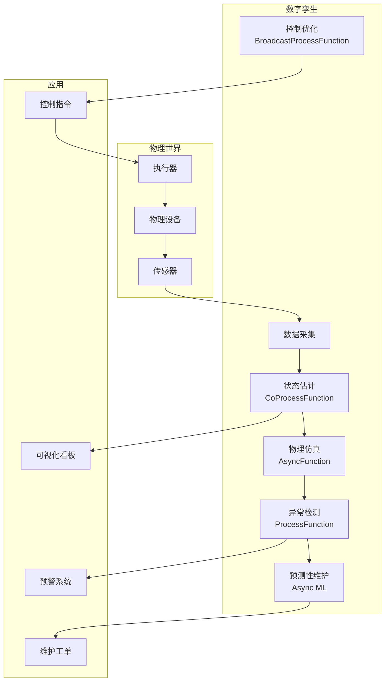
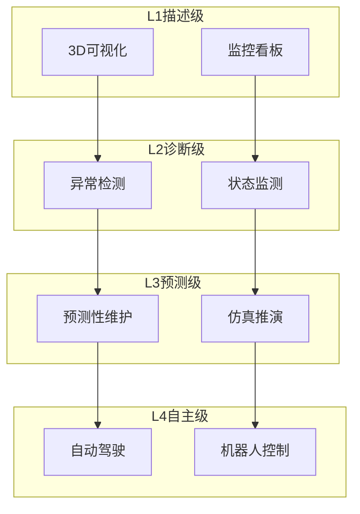

# 算子与实时数字孪生

> **所属阶段**: Knowledge/10-case-studies | **前置依赖**: [01.07-two-input-operators.md](../01-concept-atlas/operator-deep-dive/01.07-two-input-operators.md), [01.08-multi-stream-operators.md](../01-concept-atlas/operator-deep-dive/01.08-multi-stream-operators.md) | **形式化等级**: L3
> **文档定位**: 流处理算子在实时数字孪生系统、物理-虚拟同步与预测性维护中的算子指纹与Pipeline设计
> **版本**: 2026.04

---

## 目录

- [算子与实时数字孪生](#算子与实时数字孪生)
  - [目录](#目录)
  - [1. 概念定义 (Definitions)](#1-概念定义-definitions)
    - [Def-DT-01-01: 数字孪生（Digital Twin）](#def-dt-01-01-数字孪生digital-twin)
    - [Def-DT-01-02: 物理-虚拟同步（Physical-Virtual Synchronization）](#def-dt-01-02-物理-虚拟同步physical-virtual-synchronization)
    - [Def-DT-01-03: 预测性维护（Predictive Maintenance）](#def-dt-01-03-预测性维护predictive-maintenance)
    - [Def-DT-01-04: 状态估计（State Estimation）](#def-dt-01-04-状态估计state-estimation)
    - [Def-DT-01-05: 仿真推演（Simulation What-if）](#def-dt-01-05-仿真推演simulation-what-if)
  - [2. 属性推导 (Properties)](#2-属性推导-properties)
    - [Lemma-DT-01-01: 同步误差的累积](#lemma-dt-01-01-同步误差的累积)
    - [Lemma-DT-01-02: 卡尔曼滤波的收敛性](#lemma-dt-01-02-卡尔曼滤波的收敛性)
    - [Prop-DT-01-01: 预测性维护的收益](#prop-dt-01-01-预测性维护的收益)
    - [Prop-DT-01-02: 数字孪生的实时性约束](#prop-dt-01-02-数字孪生的实时性约束)
  - [3. 关系建立 (Relations)](#3-关系建立-relations)
    - [3.1 数字孪生Pipeline算子映射](#31-数字孪生pipeline算子映射)
    - [3.2 算子指纹](#32-算子指纹)
    - [3.3 数字孪生级别对比](#33-数字孪生级别对比)
  - [4. 论证过程 (Argumentation)](#4-论证过程-argumentation)
    - [4.1 为什么数字孪生需要流处理而非离线仿真](#41-为什么数字孪生需要流处理而非离线仿真)
    - [4.2 多物理场耦合的挑战](#42-多物理场耦合的挑战)
    - [4.3 大规模数字孪生的分布式架构](#43-大规模数字孪生的分布式架构)
  - [5. 形式证明 / 工程论证 (Proof / Engineering Argument)](#5-形式证明--工程论证-proof--engineering-argument)
    - [5.1 实时状态估计Pipeline](#51-实时状态估计pipeline)
    - [5.2 预测性维护系统](#52-预测性维护系统)
    - [5.3 仿真推演引擎](#53-仿真推演引擎)
  - [6. 实例验证 (Examples)](#6-实例验证-examples)
    - [6.1 实战：智能工厂设备孪生](#61-实战智能工厂设备孪生)
    - [6.2 实战：智慧城市交通孪生](#62-实战智慧城市交通孪生)
  - [7. 可视化 (Visualizations)](#7-可视化-visualizations)
    - [数字孪生Pipeline](#数字孪生pipeline)
    - [数字孪生层级架构](#数字孪生层级架构)
  - [8. 引用参考 (References)](#8-引用参考-references)

---

## 1. 概念定义 (Definitions)

### Def-DT-01-01: 数字孪生（Digital Twin）

数字孪生是物理实体在数字空间的实时镜像：

$$\text{DigitalTwin}(t) = \mathcal{M}(\text{PhysicalEntity}, \text{SensorData}_{\leq t}, \text{ControlActions}_{\leq t})$$

其中 $\mathcal{M}$ 为孪生模型，包含几何模型、物理模型和行为模型。

### Def-DT-01-02: 物理-虚拟同步（Physical-Virtual Synchronization）

物理-虚拟同步是维持数字孪生与物理实体状态一致的过程：

$$\text{SyncError}(t) = \|\text{State}_{virtual}(t) - \text{State}_{physical}(t)\|$$

目标：$\text{SyncError}(t) < \epsilon_{sync}, \forall t$。

### Def-DT-01-03: 预测性维护（Predictive Maintenance）

预测性维护是基于实时数据和退化模型预测设备故障：

$$\text{RUL}(t) = \inf\{\tau : \text{Health}(t+\tau) < \theta_{failure}\}$$

其中 RUL（Remaining Useful Life）为剩余使用寿命。

### Def-DT-01-04: 状态估计（State Estimation）

状态估计是从带噪声的观测中推断系统真实状态：

$$\hat{x}_t = \arg\max_x P(x_t \mid z_{1:t}, u_{1:t})$$

常用方法：卡尔曼滤波（线性高斯）、粒子滤波（非线性非高斯）。

### Def-DT-01-05: 仿真推演（Simulation What-if）

仿真推演是在数字孪生中模拟不同控制策略的效果：

$$\text{Outcome}(a) = \text{Simulate}(\text{DigitalTwin}(t), a, T_{horizon})$$

其中 $a$ 为控制动作，$T_{horizon}$ 为仿真时域。

---

## 2. 属性推导 (Properties)

### Lemma-DT-01-01: 同步误差的累积

若每步同步误差为 $\delta$，则 $n$ 步后的累积误差：

$$\text{SyncError}(t_n) \leq n \cdot \delta$$

**证明**: 由三角不等式，$\|x_n - \hat{x}_n\| \leq \sum_{i=1}^{n} \|x_i - \hat{x}_i\| \leq n \cdot \delta$。∎

### Lemma-DT-01-02: 卡尔曼滤波的收敛性

在系统可观测且噪声协方差有界的条件下：

$$\lim_{t \to \infty} P_t = P_{\infty}$$

其中 $P_t$ 为估计误差协方差矩阵，$P_{\infty}$ 为稳态值。

### Prop-DT-01-01: 预测性维护的收益

相比定期维护，预测性维护的收益：

$$\text{CostSaving} = C_{unplanned} \cdot (1 - \text{MTBF}_{pred} / \text{MTBF}_{reactive}) - C_{monitoring}$$

典型值：维护成本降低 25-40%，设备停机时间减少 70%。

### Prop-DT-01-02: 数字孪生的实时性约束

数字孪生的最大允许延迟：

$$\mathcal{L}_{max} < \frac{\epsilon_{sync}}{v_{max}}$$

其中 $v_{max}$ 为物理系统的最大状态变化速率。

---

## 3. 关系建立 (Relations)

### 3.1 数字孪生Pipeline算子映射

| 应用场景 | 算子组合 | 数据源 | 延迟要求 |
|---------|---------|--------|---------|
| **传感器融合** | window+aggregate + map | IoT传感器 | < 100ms |
| **状态估计** | KeyedProcessFunction | 观测+控制 | < 50ms |
| **物理模型仿真** | AsyncFunction | 模型计算 | < 200ms |
| **异常检测** | ProcessFunction + Timer | 状态偏差 | < 1s |
| **预测性维护** | Async ML + window | 历史+实时 | < 5s |
| **控制优化** | Broadcast + ProcessFunction | 策略更新 | < 100ms |

### 3.2 算子指纹

| 维度 | 数字孪生特征 |
|------|------------|
| **核心算子** | KeyedProcessFunction（状态估计）、AsyncFunction（物理仿真/ML推理）、BroadcastProcessFunction（控制策略）、CoProcessFunction（观测+控制融合） |
| **状态类型** | ValueState（实体当前状态）、MapState（历史轨迹）、BroadcastState（控制策略） |
| **时间语义** | 事件时间（传感器时间戳） |
| **数据特征** | 多模态（传感器/视频/控制指令）、高频率（100Hz+）、强因果性 |
| **状态规模** | 按实体分Key，工业场景可达百万级 |
| **性能瓶颈** | 物理模型计算、大规模状态同步 |

### 3.3 数字孪生级别对比

| 级别 | 描述 | 数据频率 | 应用 |
|------|------|---------|------|
| **L1 描述级** | 3D可视化 | 秒级 | 监控看板 |
| **L2 诊断级** | 状态监测+告警 | 秒级 | 异常检测 |
| **L3 预测级** | 仿真推演+预测 | 分钟级 | 预测性维护 |
| **L4 自主级** | 闭环控制+优化 | 毫秒级 | 自动驾驶/机器人 |

---

## 4. 论证过程 (Argumentation)

### 4.1 为什么数字孪生需要流处理而非离线仿真

离线仿真的问题：

- 无法实时同步：仿真结果滞后于物理世界
- 无法闭环控制：不能实时反馈控制指令
- 无法预测预警：只能事后分析

流处理的优势：

- 实时镜像：物理变化秒级反映到数字模型
- 闭环控制：数字孪生输出控制指令回传物理系统
- 在线学习：模型参数随实时数据持续更新

### 4.2 多物理场耦合的挑战

**问题**: 复杂系统（如飞机发动机）涉及气动、热力学、结构力学等多物理场耦合。

**方案**:

1. **降阶模型（ROM）**: 将高维物理模型降维为低维代理模型
2. **分区耦合**: 各物理场分别计算，通过边界条件耦合
3. **数据驱动**: 用神经网络替代部分物理方程

### 4.3 大规模数字孪生的分布式架构

**挑战**: 智慧城市级数字孪生涉及百万级实体，单节点无法处理。

**方案**:

1. **空间分区**: 按地理区域分片，各区域独立孪生
2. **层级聚合**: 设备级→楼宇级→街区级→城市级逐级聚合
3. **边缘-云协同**: 实时性要求高的在边缘处理，复杂仿真在云端

---

## 5. 形式证明 / 工程论证 (Proof / Engineering Argument)

### 5.1 实时状态估计Pipeline

```java
public class StateEstimationFunction extends CoProcessFunction<SensorReading, ControlCommand, EntityState> {
    private ValueState<EntityState> estimatedState;
    private ValueState<Matrix> covariance;  // 卡尔曼滤波协方差

    @Override
    public void processElement1(SensorReading reading, Context ctx, Collector<EntityState> out) throws Exception {
        EntityState state = estimatedState.value();
        Matrix P = covariance.value();

        if (state == null) {
            state = new EntityState(reading.getPosition(), reading.getVelocity());
            P = Matrix.eye(6).multiply(100);  // 初始协方差
        }

        // 预测步
        Matrix F = getStateTransitionMatrix(ctx.timestamp() - state.getTimestamp());
        EntityState predicted = state.transition(F);
        Matrix P_pred = F.multiply(P).multiply(F.transpose()).add(Q);  // Q为过程噪声

        // 更新步
        Matrix H = getObservationMatrix(reading.getSensorType());
        Matrix z = reading.toVector();
        Matrix z_pred = H.multiply(predicted.toVector());
        Matrix y = z.subtract(z_pred);  // 残差
        Matrix S = H.multiply(P_pred).multiply(H.transpose()).add(R);  // R为观测噪声
        Matrix K = P_pred.multiply(H.transpose()).multiply(S.inverse());  // 卡尔曼增益

        // 状态更新
        Matrix newState = predicted.toVector().add(K.multiply(y));
        state = EntityState.fromVector(newState, ctx.timestamp());
        P = Matrix.eye(6).subtract(K.multiply(H)).multiply(P_pred);

        estimatedState.update(state);
        covariance.update(P);

        out.collect(state);
    }

    @Override
    public void processElement2(ControlCommand cmd, Context ctx, Collector<EntityState> out) {
        EntityState state = estimatedState.value();
        if (state != null) {
            state.applyControl(cmd);
            estimatedState.update(state);
        }
    }
}
```

### 5.2 预测性维护系统

```java
// 设备传感器流
DataStream<SensorReading> sensors = env.addSource(new EquipmentSensorSource());

// 特征提取
DataStream<FeatureVector> features = sensors.keyBy(SensorReading::getEquipmentId)
    .window(SlidingEventTimeWindows.of(Time.hours(1), Time.minutes(10)))
    .aggregate(new FeatureExtractionAggregate());

// RUL预测（异步调用ML模型）
DataStream<RULPrediction> predictions = AsyncDataStream.unorderedWait(
    features,
    new RULModelInference(),
    Time.seconds(5),
    100
);

// 维护决策
predictions.keyBy(RULPrediction::getEquipmentId)
    .process(new KeyedProcessFunction<String, RULPrediction, MaintenanceOrder>() {
        private ValueState<MaintenancePolicy> policy;

        @Override
        public void processElement(RULPrediction pred, Context ctx, Collector<MaintenanceOrder> out) throws Exception {
            MaintenancePolicy p = policy.value();
            if (p == null) p = new MaintenancePolicy();

            double daysToFailure = pred.getRulDays();

            // 决策逻辑
            if (daysToFailure < p.getCriticalThreshold()) {
                out.collect(new MaintenanceOrder(pred.getEquipmentId(), "URGENT", ctx.timestamp()));
            } else if (daysToFailure < p.getWarningThreshold()) {
                out.collect(new MaintenanceOrder(pred.getEquipmentId(), "SCHEDULED", ctx.timestamp()));
                // 设置提醒定时器
                ctx.timerService().registerProcessingTimeTimer(
                    ctx.timestamp() + (long)((daysToFailure - p.getCriticalThreshold()) * 86400000)
                );
            }
        }

        @Override
        public void onTimer(long timestamp, OnTimerContext ctx, Collector<MaintenanceOrder> out) {
            out.collect(new MaintenanceOrder(ctx.getCurrentKey(), "REMINDER", timestamp));
        }
    })
    .addSink(new MaintenanceSystemSink());
```

### 5.3 仿真推演引擎

```java
// 控制策略Broadcast
DataStream<ControlStrategy> strategies = env.addSource(new StrategySource());

// 实体状态流
DataStream<EntityState> states = env.addSource(new StateSource());

// What-if仿真
states.keyBy(EntityState::getEntityId)
    .connect(strategies.broadcast())
    .process(new BroadcastProcessFunction<EntityState, ControlStrategy, SimulationResult>() {
        @Override
        public void processElement(EntityState state, ReadOnlyContext ctx, Collector<SimulationResult> out) {
            ReadOnlyBroadcastState<String, ControlStrategy> strategyState = ctx.getBroadcastState(STRATEGY_DESCRIPTOR);
            ControlStrategy strategy = strategyState.get(state.getEntityType());

            if (strategy == null) return;

            // 运行仿真（简化）
            EntityState simulated = state.copy();
            List<EntityState> trajectory = new ArrayList<>();

            for (int i = 0; i < strategy.getHorizon(); i++) {
                ControlAction action = strategy.computeAction(simulated);
                simulated = simulated.step(action);
                trajectory.add(simulated);

                // 检测约束违反
                if (strategy.violatesConstraint(simulated)) {
                    out.collect(new SimulationResult(state.getEntityId(), strategy.getId(), "VIOLATION", i, trajectory));
                    return;
                }
            }

            out.collect(new SimulationResult(state.getEntityId(), strategy.getId(), "SUCCESS", strategy.getHorizon(), trajectory));
        }

        @Override
        public void processBroadcastElement(ControlStrategy strategy, Context ctx, Collector<SimulationResult> out) {
            ctx.getBroadcastState(STRATEGY_DESCRIPTOR).put(strategy.getEntityType(), strategy);
        }
    })
    .addSink(new SimulationResultSink());
```

---

## 6. 实例验证 (Examples)

### 6.1 实战：智能工厂设备孪生

```java
// 1. 多传感器融合
DataStream<SensorReading> readings = env.addSource(new FactorySensorSource());

// 2. 状态估计
DataStream<EntityState> states = readings
    .keyBy(SensorReading::getEquipmentId)
    .connect(controlCommands.broadcast())
    .process(new StateEstimationFunction());

// 3. 异常检测
states.keyBy(EntityState::getEquipmentId)
    .process(new KeyedProcessFunction<String, EntityState, AnomalyAlert>() {
        private ValueState<EntityState> normalState;

        @Override
        public void processElement(EntityState state, Context ctx, Collector<AnomalyAlert> out) throws Exception {
            EntityState normal = normalState.value();
            if (normal == null) {
                normalState.update(state);
                return;
            }

            double deviation = state.deviationFrom(normal);
            if (deviation > 3.0) {  // 3-sigma原则
                out.collect(new AnomalyAlert(state.getEquipmentId(), deviation, ctx.timestamp()));
            }

            // 更新正常状态（指数平滑）
            normal = normal.interpolate(state, 0.1);
            normalState.update(normal);
        }
    })
    .addSink(new AlertSink());

// 4. 预测性维护
states.keyBy(EntityState::getEquipmentId)
    .window(SlidingEventTimeWindows.of(Time.hours(24), Time.hours(1)))
    .aggregate(new DegradationFeatureAggregate())
    .map(new RULPredictionFunction())
    .filter(p -> p.getRulDays() < 7)
    .addSink(new MaintenanceOrderSink());
```

### 6.2 实战：智慧城市交通孪生

```java
// 交通传感器流
DataStream<TrafficReading> traffic = env.addSource(new TrafficSensorSource());

// 信号灯控制指令
DataStream<SignalCommand> signals = env.addSource(new SignalControlSource());

// 交通流状态估计
traffic.keyBy(TrafficReading::getIntersectionId)
    .connect(signals.broadcast())
    .process(new TrafficStateEstimation())
    .addSink(new TrafficDashboardSink());

// 拥堵预测
DataStream<TrafficState> trafficStates = env.addSource(new TrafficStateSource());
trafficStates.keyBy(TrafficState::getRoadId)
    .window(SlidingEventTimeWindows.of(Time.minutes(30), Time.minutes(5)))
    .aggregate(new CongestionPredictionAggregate())
    .filter(p -> p.getCongestionProbability() > 0.8)
    .addSink(new CongestionAlertSink());
```

---

## 7. 可视化 (Visualizations)

### 数字孪生Pipeline



### 数字孪生层级架构



---

## 8. 引用参考 (References)


---

*关联文档*: [01.07-two-input-operators.md](../01-concept-atlas/operator-deep-dive/01.07-two-input-operators.md) | [01.08-multi-stream-operators.md](../01-concept-atlas/operator-deep-dive/01.08-multi-stream-operators.md) | [realtime-smart-manufacturing-case-study.md](../10-case-studies/realtime-smart-manufacturing-case-study.md)
