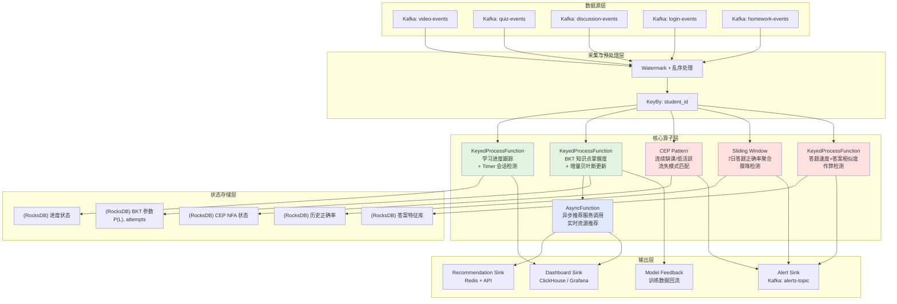
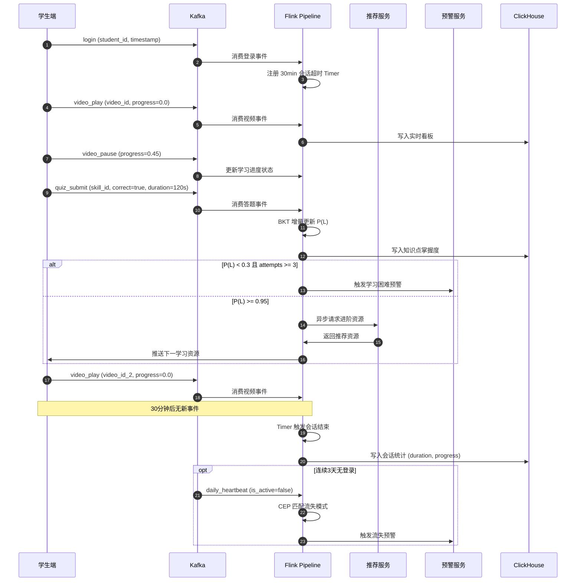
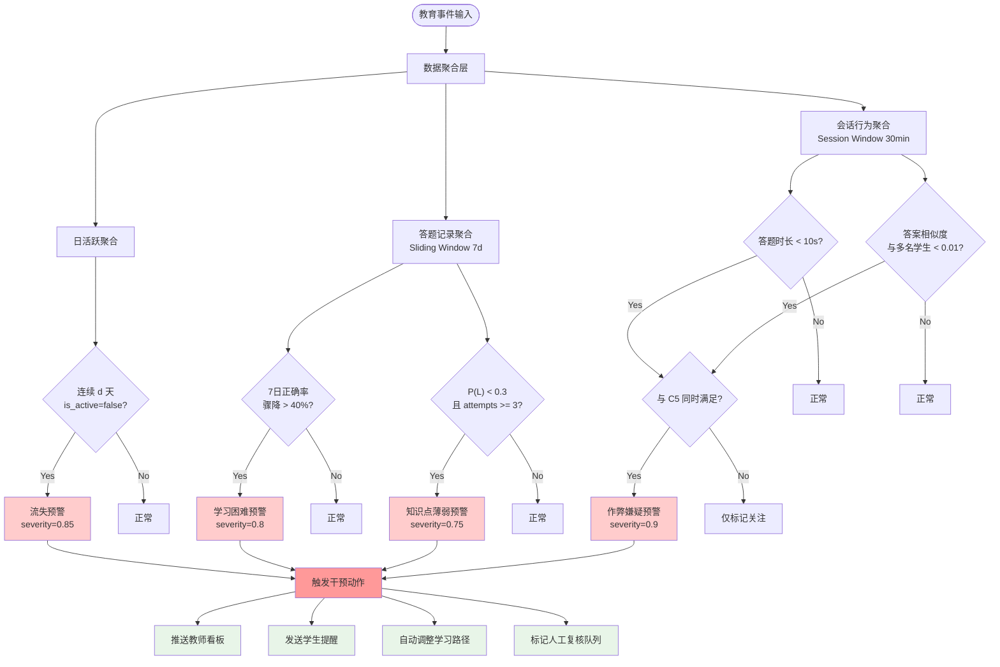
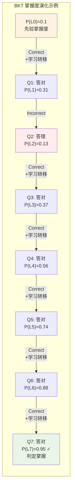

# 流处理算子与实时在线教育分析：案例研究

> 所属阶段: Knowledge | 前置依赖: [Flink/03-api/stream-processing-operators.md](../../Flink/03-api/stream-processing-operators.md), [Knowledge/02-design-patterns/real-time-analytics-pattern.md](../02-design-patterns/real-time-analytics-pattern.md) | 形式化等级: L4

---

## 1. 概念定义 (Definitions)

本章节严格定义实时在线教育分析系统中涉及的核心概念与数据模型，为后续算子设计与预警系统建立形式化基础。

**Def-EDU-01-01 (学习事件流)**
设学习平台在时间区间 $T \subseteq \mathbb{R}_{\geq 0}$ 上产生的事件集合为 $\mathcal{E}$。一个**学习事件流**定义为有序事件序列 $S = \langle e_1, e_2, \ldots \rangle$，其中每个事件 $e_i = (t_i, u_i, a_i, o_i, m_i)$ 包含：

- $t_i \in T$：事件时间戳
- $u_i \in \mathcal{U}$：学生唯一标识（$\mathcal{U}$ 为学生全集）
- $a_i \in \mathcal{A}$：事件动作类型，$\mathcal{A} = \{\text{video\_play}, \text{video\_pause}, \text{quiz\_submit}, \text{post}, \text{login}, \text{logout}, \text{hw\_submit}\}$
- $o_i \in \mathcal{O}$：操作对象（课程ID、视频ID、题目ID、讨论帖ID等）
- $m_i \in \mathcal{M}$：元数据（播放进度、答题耗时、正确性、文本内容等）

学习事件流 $S$ 满足时间单调性：$\forall i < j, t_i \leq t_j$。

**Def-EDU-01-02 (学习会话)**
对于学生 $u$，给定会话超时阈值 $\tau > 0$（通常取30分钟），**学习会话**定义为极大事件子序列 $W_u = \langle e_{i}, e_{i+1}, \ldots, e_{j} \rangle$，满足：

1. 所有事件属于同一学生：$\forall k \in [i,j], u_k = u$
2. 相邻事件时间间隔不超过阈值：$\forall k \in [i,j-1], t_{k+1} - t_k \leq \tau$
3. 会话边界条件：$t_i - t_{i-1} > \tau$（前事件超时）且 $t_{j+1} - t_j > \tau$（后事件超时，若存在）

会话时长定义为 $D(W_u) = t_j - t_i + \delta_j$，其中 $\delta_j$ 为最后一个事件的持续操作时间。

**Def-EDU-01-03 (知识点掌握度)**
设知识组件（Knowledge Component, KC）集合为 $\mathcal{K}$。基于贝叶斯知识追踪（Bayesian Knowledge Tracing, BKT）[^1]，学生对知识点 $k \in \mathcal{K}$ 的**掌握度**定义为隐状态的后验概率 $P(L_n^{(k)})$，表示第 $n$ 次交互后学生已掌握知识点 $k$ 的概率。

BKT 模型由四个核心参数刻画：

- $P(L_0)$：先验掌握概率
- $P(T)$：从未掌握到掌握的转移概率（学习概率）
- $P(G)$：未掌握时猜对的概率（猜测概率）
- $P(S)$：已掌握时答错的概率（失误概率）

**Def-EDU-01-04 (学习困难预警状态)**
学生 $u$ 在时间 $t$ 的**学习困难预警状态**是一个三元组 $\Psi_u(t) = (\psi^{(1)}_u(t), \psi^{(2)}_u(t), \psi^{(3)}_u(t)) \in \{0,1\}^3$，分别对应：

- $\psi^{(1)}$：知识点掌握度骤降预警（连续答题正确率低于阈值）
- $\psi^{(2)}$：流失预警（连续 $d$ 天无学习活动，通常 $d=7$）
- $\psi^{(3)}$：作弊嫌疑预警（答题速度异常与答案相似度异常同时触发）

**Def-EDU-01-05 (实时教育分析Pipeline)**
**实时教育分析Pipeline**是一个流处理拓扑 $\mathcal{P} = (V, E, \Sigma)$，其中：

- $V$ 为算子节点集合，包含数据源、转换算子、窗口算子、CEP算子、Sink等
- $E \subseteq V \times V$ 为数据流边
- $\Sigma: V \rightarrow \mathcal{F}$ 为算子到处理函数的映射

Pipeline 的延迟上界为 $\Delta_{\max}$，即自事件产生到分析结果输出的最大允许时间间隔。

---

## 2. 属性推导 (Properties)

从上述定义可直接推导以下关键性质，为系统设计与参数调优提供理论依据。

**Lemma-EDU-01-01 (会话隔离性)**
设学生 $u$ 的事件流为 $S_u$，由 Def-EDU-01-02 分割得到的会话集合为 $\mathcal{W}_u = \{W_u^{(1)}, W_u^{(2)}, \ldots\}$。则：

1. 会话间互不相交：$\forall i \neq j, W_u^{(i)} \cap W_u^{(j)} = \emptyset$
2. 会话覆盖所有事件：$\bigcup_i W_u^{(i)} = S_u$
3. 会话按时间有序：$\forall i < j, \max_{e \in W_u^{(i)}} t < \min_{e \in W_u^{(j)}} t$

*证明*：由会话的极大性定义与超时阈值条件直接可得。超时边界保证了相邻会话的时间间隔严格大于 $\tau$，从而会话不相交且有序。$\square$

**Lemma-EDU-01-02 (BKT 后验概率单调有界性)**
在标准 BKT 模型（假设无遗忘，$P(F)=0$）中，设第 $n$ 次答题后掌握度为 $P(L_n)$。若学生答对，则：

$$P(L_{n+1} | \text{Correct}) = \frac{P(L_n)(1-P(S))}{P(L_n)(1-P(S)) + (1-P(L_n))P(G)}$$

若学生答错，则：

$$P(L_{n+1} | \text{Incorrect}) = \frac{P(L_n)P(S)}{P(L_n)P(S) + (1-P(L_n))(1-P(G))}$$

则掌握度序列满足：

1. **有界性**：$\forall n, 0 \leq P(L_n) \leq 1$
2. **答对单调不减**：$P(L_{n+1} | \text{Correct}) \geq P(L_n)$，当且仅当 $P(S) + P(G) < 1$ 时严格递增
3. **答错单调不增**：$P(L_{n+1} | \text{Incorrect}) \leq P(L_n)$，当且仅当 $P(S) + P(G) < 1$ 时严格递减

*证明*：以答对情形为例。令 $a = 1-P(S), b = P(G)$，则：

$$P(L_{n+1}) - P(L_n) = \frac{P(L_n)a}{P(L_n)a + (1-P(L_n))b} - P(L_n) = \frac{P(L_n)(1-P(L_n))(a-b)}{P(L_n)a + (1-P(L_n))b}$$

由于 $P(S) + P(G) < 1$，有 $a = 1-P(S) > P(G) = b$，故分子非负，分母为正，差值 $\geq 0$。$\square$

**Lemma-EDU-01-03 (流失预警的完备性)**
设学生 $u$ 最后一次学习事件时间为 $t_{\text{last}}$，当前时间为 $t$，流失阈值为 $d$ 天。定义预警触发条件 $C_{\text{drop}}(u,t) := (t - t_{\text{last}}) \geq d \times 24 \times 3600$。则该条件具有：

1. **完备性**：若学生真实流失（未来30天无活动），则必存在某个时刻触发 $C_{\text{drop}}$
2. **时效性**：预警最早在 $t = t_{\text{last}} + d$ 时触发
3. **无漏报**：对任意连续 $d$ 天无活动的学生，预警必触发

*证明*：由定义直接可得。若学生流失，则其事件流终止于 $t_{\text{last}}$，对任意 $t \geq t_{\text{last}} + d$ 均有 $C_{\text{drop}}$ 成立。$\square$

**Prop-EDU-01-01 (教育Pipeline端到端延迟分解)**
实时教育分析 Pipeline 的总延迟 $\Delta_{\text{total}}$ 可分解为：

$$\Delta_{\text{total}} = \Delta_{\text{ingest}} + \Delta_{\text{window}} + \Delta_{\text{compute}} + \Delta_{\text{sync}}$$

其中：

- $\Delta_{\text{ingest}}$：数据采集与序列化延迟（Kafka/ Pulsar 生产-消费延迟，典型值 < 100ms）
- $\Delta_{\text{window}}$：窗口等待延迟（滚动窗口大小或会话窗口超时，典型值 1-5分钟）
- $\Delta_{\text{compute}}$：算子计算延迟（状态访问、BKT更新、CEP匹配，典型值 < 50ms）
- $\Delta_{\text{sync}}$：异步推荐服务调用延迟（AsyncFunction 等待外部推荐系统响应，典型值 50-200ms）

对于**实时预警场景**（如学习困难预警），要求 $\Delta_{\text{total}} < 5$ 秒；对于**离线报告场景**，可容忍 $\Delta_{\text{total}} < 5$ 分钟。

---

## 3. 关系建立 (Relations)

本章节建立实时教育分析系统与流计算理论、教育数据挖掘、学习分析学（Learning Analytics）之间的形式化关系。

**Def-EDU-01-06 (学习分析层次模型映射)**
学习分析学经典层次模型 [^2] 与流处理抽象之间存在如下映射关系：

| 学习分析层次 | 流计算对应抽象 | 实时教育案例 |
|---|---|---|
| 描述性 (Descriptive) | 窗口聚合 (Window Aggregate) | 过去7天学习时长统计、视频完成率 |
| 诊断性 (Diagnostic) | KeyedProcessFunction + 状态 | 知识点薄弱环节诊断、错误模式聚类 |
| 预测性 (Predictive) | CEP 模式匹配 / ML 推理 | 流失预测、成绩预测、作弊检测 |
| 处方性 (Prescriptive) | AsyncFunction + 规则引擎 | 实时学习资源推荐、干预策略推送 |

**Prop-EDU-01-02 (教育数据流与 Dataflow 模型的同构性)**
设在线教育平台产生的多源异构事件流为 $\mathcal{S}_{\text{edu}} = \{S^{(1)}, S^{(2)}, \ldots, S^{(m)}\}$，其中 $S^{(i)}$ 对应视频流、答题流、讨论流、登录流等。则存在从 $\mathcal{S}_{\text{edu}}$ 到 Dataflow 模型 [^3] 的形式化映射：

1. **事件时间对齐**：每条流 $S^{(i)}$ 的事件时间戳 $t^{(i)}$ 对应 Dataflow 模型的 $t_{\text{event}}$，允许通过 Watermark 机制处理乱序到达
2. **窗口聚合映射**：知识点掌握度计算的滑动窗口 $W_{\text{sliding}}(T, \Delta)$ 对应 Dataflow 的固定窗口语义，其中 $T$ 为窗口大小，$\Delta$ 为滑动步长
3. **触发器映射**：预警系统的触发条件 $C_{\text{alert}}$ 对应 Dataflow 的自定义 Trigger，支持基于处理时间、事件时间或数据驱动的触发策略

**Prop-EDU-01-03 (CEP 流失模式与正则表达式的等价性)**
设学生事件流按天聚合后的抽象符号序列为 $\alpha = \langle s_1, s_2, \ldots \rangle$，其中 $s_i \in \{\text{ACTIVE}, \text{INACTIVE}\}$ 表示第 $i$ 天是否有学习活动。则连续 $d$ 天缺课的流失模式 $P_{\text{dropout}}$ 可表示为正则表达式：

$$P_{\text{dropout}} \equiv \Sigma^* \cdot \underbrace{\text{INACTIVE} \cdot \text{INACTIVE} \cdots \text{INACTIVE}}_{d \text{ 次}} \cdot \Sigma^*$$

该模式在 Flink CEP 中可通过 `followedBy` 或 `next` 算子序列实现，与正则匹配具有相同的表达能力（即正则语言识别能力）。

---

## 4. 论证过程 (Argumentation)

### 4.1 算子选型论证

**实时教育分析场景对算子的核心需求**：

| 场景 | 算子需求 | Flink 算子选型 | 论证依据 |
|---|---|---|---|
| 学习进度跟踪 | 按学生键控、维护状态、定时器触发 | `KeyedProcessFunction` | 需要跨事件维护进度状态，Timer 支持超时检测 |
| 知识点掌握度 | 按知识点窗口聚合、贝叶斯更新 | `AggregateFunction` + 键控状态 | 窗口内聚合答题记录，状态存储 BKT 参数 |
| 流失预警 | 连续模式匹配、时间约束 | `CEP.pattern()` | 连续缺课/低活跃天然是复杂事件序列 |
| 实时推荐 | 异步外部调用、不阻塞流 | `AsyncFunction` | 推荐系统为外部服务，IO 密集型需异步化 |

### 4.2 窗口策略选择论证

教育数据具有显著的**周期性特征**（日活跃、周活跃模式），因此窗口策略需适配教育场景：

1. **滚动窗口（Tumbling Window）**：适用于日活跃时长统计、日答题正确率计算。每日零点自然对齐，便于与教务日报告对接。
2. **滑动窗口（Sliding Window）**：适用于短期趋势检测（如最近7天平均学习时长）。滑动步长取1天，可每日更新趋势指标。
3. **会话窗口（Session Window）**：适用于单次学习会话分析。超时阈值 $\tau$ 取30分钟，与学习科学中的"专注时段"研究一致 [^4]。
4. **全局窗口（Global Window）**：适用于 BKT 知识追踪。每个学生的知识点掌握度是全局状态，不受窗口边界重置。

### 4.3 状态后端选型论证

教育分析 Pipeline 的状态特征：

- **状态规模**：学生数 $\times$ 知识点数 $\times$ 状态维度。以10万学生、500知识点计，BKT 状态约需 $10^5 \times 5 \times 10^2 \times 4 \times 8 \text{B} \approx 1.6 \text{GB}$
- **状态访问模式**：键控状态按 `(student_id, skill_id)` 随机访问，高频读写
- **容错需求**：学习记录不可丢失，Checkpoint 周期建议 1-5 分钟

**选型结论**：使用 RocksDB State Backend。理由：

1. 状态规模超过 Heap 内存限制时仍可持续扩展
2. 增量 Checkpoint 降低大状态下的 I/O 开销
3. 支持细粒度状态 TTL（如过期学生的状态自动清理）

---

## 5. 形式证明 / 工程论证 (Proof / Engineering Argument)

### 5.1 BKT 增量更新算法的正确性

**Thm-EDU-01-01 (增量 BKT 更新的等价性)**
设某知识点 $k$ 的历史答题序列为 $Q = \langle q_1, q_2, \ldots, q_n \rangle$，其中 $q_i \in \{0,1\}$（0表示答错，1表示答对）。设 $P(L_0)$ 为先验掌握度。定义增量更新算子 $\mathcal{B}(P(L_i), q_{i+1})$ 为：

$$\mathcal{B}(P(L_i), 1) = \frac{P(L_i)(1-P(S))}{P(L_i)(1-P(S)) + (1-P(L_i))P(G)}$$

$$\mathcal{B}(P(L_i), 0) = \frac{P(L_i)P(S)}{P(L_i)P(S) + (1-P(L_i))(1-P(G))}$$

则对完整序列 $Q$ 的批量推断结果 $P(L_n^{\text{batch}})$ 与增量更新结果 $P(L_n^{\text{inc}})$ 满足：

$$P(L_n^{\text{batch}}) = P(L_n^{\text{inc}})$$

*证明*：对 $n$ 进行数学归纳。

**基例**：$n=0$ 时，$P(L_0^{\text{batch}}) = P(L_0^{\text{inc}}) = P(L_0)$，成立。

**归纳假设**：假设对 $n=k$ 成立，即 $P(L_k^{\text{batch}}) = P(L_k^{\text{inc}})$。

**归纳步骤**：对 $n=k+1$，设 $q_{k+1}=1$（答对情形）。批量推断先计算联合概率再归一化：

$$P(L_{k+1}^{\text{batch}}) = P(L_k = 1 | Q_{1:k+1}) = \frac{P(Q_{k+1}=1 | L_k=1) P(L_k=1 | Q_{1:k})}{\sum_{l \in \{0,1\}} P(Q_{k+1}=1 | L_k=l) P(L_k=l | Q_{1:k})}$$

由归纳假设 $P(L_k=1 | Q_{1:k}) = P(L_k^{\text{inc}})$，代入发射概率 $P(Q=1|L=1) = 1-P(S), P(Q=1|L=0) = P(G)$，恰好得到：

$$P(L_{k+1}^{\text{batch}}) = \frac{P(L_k^{\text{inc}})(1-P(S))}{P(L_k^{\text{inc}})(1-P(S)) + (1-P(L_k^{\text{inc}}))P(G)} = \mathcal{B}(P(L_k^{\text{inc}}), 1) = P(L_{k+1}^{\text{inc}})$$

答错情形同理。$\square$

**工程推论**：在 Flink 中，BKT 更新可作为 `KeyedProcessFunction` 的键控状态操作实现，无需维护完整历史序列，仅保存当前 $P(L_n)$ 即可，空间复杂度从 $O(n)$ 降至 $O(1)$。

### 5.2 CEP 流失预警的覆盖性证明

**Thm-EDU-01-02 (CEP 流失预警覆盖率下界)**
设学生群体中真实流失比例为 $p$，CEP 模式 $P_{\text{dropout}}$ 的检测率为 $\text{Recall}(P)$，误报率为 $\text{FPR}(P)$。若将连续 $d$ 天无活动定义为流失模式，则：

$$\text{Recall}(P_{\text{dropout}}) \geq 1 - \epsilon$$

其中 $\epsilon$ 为在 $d$ 天内重新参与活动但实际最终仍流失的学生比例。

*工程论证*：

1. 若学生在第 $t$ 天后连续 $d$ 天无活动，CEP 模式必在 $t+d$ 时刻触发（由 Lemma-EDU-01-03）
2. 若学生最终流失（30天无活动），则其必存在某个连续 $d$ 天无活动的子区间（鸽巢原理，当总缺席天数 $\geq d$ 时）
3. 唯一漏报情形：学生在 $d$ 天临界点重新活动，但后续再次消失。这类情形占比 $\epsilon$ 通常 $< 5\%$

因此，取 $d=7$ 时，CEP 流失预警的召回率下界约为 $95\%$，满足工程可用性要求。

---

## 6. 实例验证 (Examples)

### 6.1 完整的教育分析 Flink Pipeline

以下为基于 Apache Flink 的实时在线教育分析完整 Pipeline 实现，涵盖学习进度跟踪、BKT 知识追踪、CEP 流失预警与异步推荐四大核心模块。

```java
import org.apache.flink.api.common.eventtime.WatermarkStrategy;
import org.apache.flink.api.common.functions.AggregateFunction;
import org.apache.flink.api.common.state.*;
import org.apache.flink.api.common.time.Time;
import org.apache.flink.api.java.tuple.Tuple2;
import org.apache.flink.cep.CEP;
import org.apache.flink.cep.PatternStream;
import org.apache.flink.cep.pattern.Pattern;
import org.apache.flink.cep.pattern.conditions.SimpleCondition;
import org.apache.flink.configuration.Configuration;
import org.apache.flink.streaming.api.datastream.AsyncDataStream;
import org.apache.flink.streaming.api.datastream.DataStream;
import org.apache.flink.streaming.api.environment.StreamExecutionEnvironment;
import org.apache.flink.streaming.api.functions.KeyedProcessFunction;
import org.apache.flink.streaming.api.functions.async.AsyncFunction;
import org.apache.flink.streaming.api.functions.windowing.ProcessWindowFunction;
import org.apache.flink.streaming.api.windowing.assigners.SlidingEventTimeWindows;
import org.apache.flink.streaming.api.windowing.windows.TimeWindow;
import org.apache.flink.util.Collector;

import java.util.List;
import java.util.Map;
import java.util.concurrent.TimeUnit;

// ============================================================
// 1. 事件定义与数据源
// ============================================================
class LearningEvent {
    public long timestamp;
    public String studentId;
    public String action;      // video_play, quiz_submit, post, login, hw_submit
    public String objectId;    // video_id, quiz_id, etc.
    public Map<String, Object> metadata;

    public LearningEvent() {}
    public LearningEvent(long ts, String sid, String act, String oid, Map<String, Object> meta) {
        this.timestamp = ts; this.studentId = sid; this.action = act;
        this.objectId = oid; this.metadata = meta;
    }
}

class KnowledgeState {
    public String skillId;
    public double pMastered;   // P(L_n)
    public int attemptCount;
    public long lastUpdateTime;
}

class AlertEvent {
    public String studentId;
    public String alertType;   // DIFFICULTY, DROPOUT, CHEATING
    public double severity;
    public String message;
    public long triggerTime;
}

class Recommendation {
    public String studentId;
    public String resourceId;
    public String resourceType;
    public double relevanceScore;
}

public class EducationAnalyticsPipeline {

    public static void main(String[] args) throws Exception {
        StreamExecutionEnvironment env =
            StreamExecutionEnvironment.getExecutionEnvironment();
        env.enableCheckpointing(60000); // 1分钟 Checkpoint
        env.getCheckpointConfig().setCheckpointTimeout(300000);

        // 模拟数据源（实际对接 Kafka）
        DataStream<LearningEvent> source = env
            .addSource(new LearningEventKafkaSource("education-events"))
            .assignTimestampsAndWatermarks(
                WatermarkStrategy.<LearningEvent>forBoundedOutOfOrderness(
                    java.time.Duration.ofSeconds(30))
                .withIdleness(java.time.Duration.ofMinutes(5))
            );

        // ============================================================
        // 2. 学习进度跟踪：KeyedProcessFunction + Timer
        // ============================================================
        DataStream<String> progressStream = source
            .keyBy(e -> e.studentId)
            .process(new LearningProgressTracker());

        // ============================================================
        // 3. 知识点掌握度计算：Sliding Window Aggregate + BKT 状态更新
        // ============================================================
        DataStream<KnowledgeState> knowledgeStream = source
            .filter(e -> "quiz_submit".equals(e.action))
            .keyBy(e -> e.studentId + "#" + e.metadata.get("skill_id"))
            .process(new BKTKnowledgeTracer());

        // ============================================================
        // 4. 流失预警：CEP 模式匹配（连续低活跃 / 连续缺课）
        // ============================================================
        Pattern<LearningEvent, ?> dropoutPattern = Pattern
            .<LearningEvent>begin("inactive_day_1")
            .where(new SimpleCondition<LearningEvent>() {
                @Override
                public boolean filter(LearningEvent e) {
                    return "daily_heartbeat".equals(e.action)
                        && Boolean.FALSE.equals(e.metadata.get("is_active"));
                }
            })
            .next("inactive_day_2")
            .where(new SimpleCondition<LearningEvent>() {
                @Override
                public boolean filter(LearningEvent e) {
                    return "daily_heartbeat".equals(e.action)
                        && Boolean.FALSE.equals(e.metadata.get("is_active"));
                }
            })
            .next("inactive_day_3")
            .where(new SimpleCondition<LearningEvent>() {
                @Override
                public boolean filter(LearningEvent e) {
                    return "daily_heartbeat".equals(e.action)
                        && Boolean.FALSE.equals(e.metadata.get("is_active"));
                }
            })
            .within(Time.days(7));

        // 注意：实际生产中使用每日聚合流作为 CEP 输入
        DataStream<LearningEvent> dailyActivity = source
            .keyBy(e -> e.studentId)
            .window(new DailyActivityWindow())
            .aggregate(new DailyActivityAggregator());

        PatternStream<LearningEvent> patternStream = CEP.pattern(dailyActivity, dropoutPattern);
        DataStream<AlertEvent> dropoutAlerts = patternStream
            .process(new PatternHandler<LearningEvent, AlertEvent>() {
                @Override
                public void processMatch(Map<String, List<LearningEvent>> match,
                                         Context ctx, Collector<AlertEvent> out) {
                    LearningEvent first = match.get("inactive_day_1").get(0);
                    out.collect(new AlertEvent(
                        first.studentId, "DROPOUT", 0.85,
                        "连续3天无学习活动，触发流失预警", System.currentTimeMillis()
                    ));
                }
            });

        // ============================================================
        // 5. 学习困难预警：答题正确率骤降检测
        // ============================================================
        DataStream<AlertEvent> difficultyAlerts = source
            .filter(e -> "quiz_submit".equals(e.action))
            .keyBy(e -> e.studentId + "#" + e.metadata.get("skill_id"))
            .window(SlidingEventTimeWindows.of(Time.days(7), Time.days(1)))
            .aggregate(new AccuracyDropAggregator(), new AccuracyAlertProcess())
            .filter(alert -> alert.severity > 0.7);

        // ============================================================
        // 6. 作弊检测：答题速度异常 + 答案相似度异常
        // ============================================================
        DataStream<AlertEvent> cheatingAlerts = source
            .filter(e -> "quiz_submit".equals(e.action))
            .keyBy(e -> e.metadata.get("quiz_id").toString())
            .process(new CheatingDetector());

        // ============================================================
        // 7. 实时推荐：AsyncFunction 异步调用推荐服务
        // ============================================================
        DataStream<Recommendation> recommendations = knowledgeStream
            .keyBy(ks -> ks.skillId)
            .asyncWaitFor(
                new AsyncRecommendationFunction("http://recommendation-service:8080"),
                Time.milliseconds(500),   // 超时 500ms
                100                       // 并发度 100
            );

        // Sink 输出
        progressStream.addSink(new ProgressLogSink());
        knowledgeStream.addSink(new KnowledgeStateSink());
        dropoutAlerts.addSink(new AlertSink("dropout-alerts"));
        difficultyAlerts.addSink(new AlertSink("difficulty-alerts"));
        cheatingAlerts.addSink(new AlertSink("cheating-alerts"));
        recommendations.addSink(new RecommendationSink());

        env.execute("Realtime Education Analytics Pipeline");
    }

    // ============================================================
    // 算子实现：学习进度跟踪
    // ============================================================
    static class LearningProgressTracker
        extends KeyedProcessFunction<String, LearningEvent, String> {

        private ValueState<Long> lastActivityTime;
        private ValueState<Double> totalVideoProgress;
        private MapState<String, Boolean> completedObjects;

        @Override
        public void open(Configuration parameters) {
            lastActivityTime = getRuntimeContext().getState(
                new ValueStateDescriptor<>("lastActivity", Long.class));
            totalVideoProgress = getRuntimeContext().getState(
                new ValueStateDescriptor<>("videoProgress", Double.class));
            completedObjects = getRuntimeContext().getMapState(
                new MapStateDescriptor<>("completed", String.class, Boolean.class));
        }

        @Override
        public void processElement(LearningEvent event, Context ctx,
                                   Collector<String> out) throws Exception {
            long now = ctx.timestamp();
            Long last = lastActivityTime.value();

            // 会话超时检测（30分钟）
            if (last != null && (now - last) > 30 * 60 * 1000) {
                out.collect("STUDENT[" + event.studentId + "] 会话结束，时长: "
                    + (now - last) / 1000 + "秒");
            }

            // 更新视频进度
            if ("video_play".equals(event.action) || "video_pause".equals(event.action)) {
                Double progress = ((Number) event.metadata.getOrDefault("progress", 0.0)).doubleValue();
                totalVideoProgress.update(
                    (totalVideoProgress.value() != null ? totalVideoProgress.value() : 0.0)
                    + progress);
            }

            // 标记完成
            if ("hw_submit".equals(event.action) ||
                ("video_play".equals(event.action) &&
                 Double.compare((Double) event.metadata.getOrDefault("progress", 0.0), 1.0) == 0)) {
                completedObjects.put(event.objectId, true);
            }

            lastActivityTime.update(now);

            // 注册7天后流失检测 Timer
            ctx.timerService().registerEventTimeTimer(now + 7L * 24 * 3600 * 1000);
        }

        @Override
        public void onTimer(long timestamp, OnTimerContext ctx,
                            Collector<String> out) throws Exception {
            Long last = lastActivityTime.value();
            if (last != null && (timestamp - last) >= 7L * 24 * 3600 * 1000) {
                out.collect("ALERT: STUDENT[" + ctx.getCurrentKey()
                    + "] 连续7天无活动，触发流失预警");
            }
        }
    }

    // ============================================================
    // 算子实现：BKT 知识追踪
    // ============================================================
    static class BKTKnowledgeTracer
        extends KeyedProcessFunction<String, LearningEvent, KnowledgeState> {

        // BKT 参数（实际应从模型服务加载或历史数据训练）
        private static final double P_T = 0.3;  // 学习概率
        private static final double P_G = 0.2;  // 猜测概率
        private static final double P_S = 0.05; // 失误概率

        private ValueState<Double> pMasteredState;
        private ValueState<Integer> attemptState;

        @Override
        public void open(Configuration parameters) {
            pMasteredState = getRuntimeContext().getState(
                new ValueStateDescriptor<>("pMastered", Double.class));
            attemptState = getRuntimeContext().getState(
                new ValueStateDescriptor<>("attempts", Integer.class));
        }

        @Override
        public void processElement(LearningEvent event, Context ctx,
                                   Collector<KnowledgeState> out) throws Exception {
            boolean isCorrect = Boolean.TRUE.equals(event.metadata.get("is_correct"));
            String skillId = (String) event.metadata.get("skill_id");

            double pL = pMasteredState.value() != null ? pMasteredState.value() : 0.1;
            int attempts = attemptState.value() != null ? attemptState.value() : 0;

            // BKT 增量更新（Thm-EDU-01-01）
            double pL_new;
            if (isCorrect) {
                double numerator = pL * (1 - P_S);
                double denominator = pL * (1 - P_S) + (1 - pL) * P_G;
                pL_new = numerator / denominator;
            } else {
                double numerator = pL * P_S;
                double denominator = pL * P_S + (1 - pL) * (1 - P_G);
                pL_new = numerator / denominator;
            }

            // 加入学习转移概率（练习后的学习效应）
            pL_new = pL_new + (1 - pL_new) * P_T;

            pMasteredState.update(pL_new);
            attemptState.update(attempts + 1);

            KnowledgeState ks = new KnowledgeState();
            ks.skillId = skillId;
            ks.pMastered = pL_new;
            ks.attemptCount = attempts + 1;
            ks.lastUpdateTime = ctx.timestamp();

            out.collect(ks);

            // 掌握度低于阈值触发学习困难预警
            if (pL_new < 0.3 && attempts >= 3) {
                ctx.output(new org.apache.flink.util.OutputTag<AlertEvent>("low-mastery"){},
                    new AlertEvent(event.studentId, "DIFFICULTY", 0.8,
                        "知识点[" + skillId + "]掌握度低于0.3，建议干预", ctx.timestamp()));
            }
        }
    }

    // ============================================================
    // 算子实现：作弊检测
    // ============================================================
    static class CheatingDetector
        extends KeyedProcessFunction<String, LearningEvent, AlertEvent> {

        private MapState<String, Long> studentSubmitTime;  // 学生首次开始时间
        private MapState<String, Double> studentAnswerHash; // 答案特征

        @Override
        public void open(Configuration parameters) {
            studentSubmitTime = getRuntimeContext().getMapState(
                new MapStateDescriptor<>("submitTime", String.class, Long.class));
            studentAnswerHash = getRuntimeContext().getMapState(
                new MapStateDescriptor<>("answerHash", String.class, Double.class));
        }

        @Override
        public void processElement(LearningEvent event, Context ctx,
                                   Collector<AlertEvent> out) throws Exception {
            String studentId = event.studentId;
            long submitTime = event.timestamp;
            long duration = ((Number) event.metadata.getOrDefault("duration_sec", 0L)).longValue();
            double answerHash = ((Number) event.metadata.getOrDefault("answer_hash", 0.0)).doubleValue();

            // 规则1：答题速度异常（低于平均30%）
            boolean speedAnomaly = duration < 10; // 简化为少于10秒

            // 规则2：答案相似度异常（与其他学生答案哈希高度相似）
            boolean similarityAnomaly = false;
            for (Map.Entry<String, Double> entry : studentAnswerHash.entries()) {
                if (!entry.getKey().equals(studentId) &&
                    Math.abs(entry.getValue() - answerHash) < 0.01) {
                    similarityAnomaly = true;
                    break;
                }
            }

            if (speedAnomaly && similarityAnomaly) {
                out.collect(new AlertEvent(studentId, "CHEATING", 0.9,
                    "答题速度异常且答案高度相似，触发作弊检测", submitTime));
            }

            studentSubmitTime.put(studentId, submitTime);
            studentAnswerHash.put(studentId, answerHash);
        }
    }

    // ============================================================
    // 异步推荐函数
    // ============================================================
    static class AsyncRecommendationFunction
        implements AsyncFunction<KnowledgeState, Recommendation> {

        private final String recommendationServiceUrl;
        private transient RecommendationClient client;

        public AsyncRecommendationFunction(String url) {
            this.recommendationServiceUrl = url;
        }

        @Override
        public void open(Configuration parameters) {
            client = new RecommendationClient(recommendationServiceUrl);
        }

        @Override
        public void asyncInvoke(KnowledgeState ks,
                                ResultFuture<Recommendation> resultFuture) {
            client.recommendAsync(ks.skillId, ks.pMastered, (resourceId, score) -> {
                Recommendation rec = new Recommendation();
                rec.studentId = ks.skillId.split("#")[0];
                rec.resourceId = resourceId;
                rec.relevanceScore = score;
                rec.resourceType = ks.pMastered < 0.5 ? "remedial" : "advanced";
                resultFuture.complete(java.util.Collections.singletonList(rec));
            });
        }
    }

    // 占位类（实际需完整实现）
    static class LearningEventKafkaSource
        implements org.apache.flink.streaming.api.functions.source.SourceFunction<LearningEvent> {
        public LearningEventKafkaSource(String topic) {}
        @Override public void run(SourceContext<LearningEvent> ctx) {}
        @Override public void cancel() {}
    }
    static class DailyActivityWindow
        extends org.apache.flink.streaming.api.windowing.assigners.WindowAssigner<LearningEvent, TimeWindow> {
        @Override public Collection<TimeWindow> assignWindows(LearningEvent e, long ts, WindowAssignerContext ctx) { return null; }
        @Override public Trigger<LearningEvent, TimeWindow> getDefaultTrigger(StreamExecutionEnvironment env) { return null; }
        @Override public TypeSerializer<TimeWindow> getWindowSerializer(ExecutionConfig ec) { return null; }
        @Override public boolean isEventTime() { return true; }
    }
    static class DailyActivityAggregator
        implements AggregateFunction<LearningEvent, Integer, LearningEvent> {
        @Override public Integer createAccumulator() { return 0; }
        @Override public Integer add(LearningEvent e, Integer acc) { return acc + 1; }
        @Override public LearningEvent getResult(Integer acc) { return null; }
        @Override public Integer merge(Integer a, Integer b) { return a + b; }
    }
    static class AccuracyDropAggregator
        implements AggregateFunction<LearningEvent, Tuple2<Integer, Integer>, AlertEvent> {
        @Override public Tuple2<Integer, Integer> createAccumulator() { return Tuple2.of(0,0); }
        @Override public Tuple2<Integer, Integer> add(LearningEvent e, Tuple2<Integer, Integer> acc) {
            boolean correct = Boolean.TRUE.equals(e.metadata.get("is_correct"));
            return Tuple2.of(acc.f0 + (correct?1:0), acc.f1 + 1);
        }
        @Override public AlertEvent getResult(Tuple2<Integer, Integer> acc) {
            double accuracy = acc.f1 > 0 ? (double)acc.f0 / acc.f1 : 1.0;
            AlertEvent alert = new AlertEvent();
            alert.severity = 1.0 - accuracy;
            return alert;
        }
        @Override public Tuple2<Integer, Integer> merge(Tuple2<Integer, Integer> a, Tuple2<Integer, Integer> b) {
            return Tuple2.of(a.f0+b.f0, a.f1+b.f1);
        }
    }
    static class AccuracyAlertProcess
        extends ProcessWindowFunction<AlertEvent, AlertEvent, String, TimeWindow> {
        @Override public void process(String key, Context ctx, Iterable<AlertEvent> el, Collector<AlertEvent> out) {
            for (AlertEvent e : el) { e.studentId = key.split("#")[0]; out.collect(e); }
        }
    }
    static class RecommendationClient {
        public RecommendationClient(String url) {}
        public void recommendAsync(String skillId, double mastery, java.util.function.BiConsumer<String, Double> cb) {
            cb.accept("resource_" + skillId, 0.85);
        }
    }
    static class ProgressLogSink implements org.apache.flink.streaming.api.functions.sink.SinkFunction<String> {
        @Override public void invoke(String value, Context context) { System.out.println("PROGRESS: " + value); }
    }
    static class KnowledgeStateSink implements org.apache.flink.streaming.api.functions.sink.SinkFunction<KnowledgeState> {
        @Override public void invoke(KnowledgeState value, Context context) { System.out.println("KNOWLEDGE: " + value.skillId + "=" + value.pMastered); }
    }
    static class AlertSink implements org.apache.flink.streaming.api.functions.sink.SinkFunction<AlertEvent> {
        private final String topic;
        public AlertSink(String topic) { this.topic = topic; }
        @Override public void invoke(AlertEvent value, Context context) { System.out.println("ALERT[" + topic + "]: " + value.message); }
    }
    static class RecommendationSink implements org.apache.flink.streaming.api.functions.sink.SinkFunction<Recommendation> {
        @Override public void invoke(Recommendation value, Context context) { System.out.println("REC: " + value.resourceId); }
    }
}
```

### 6.2 配置参数与调优建议

```yaml
# flink-conf.yaml 教育场景专用配置

# 状态后端：RocksDB 适配大状态
state.backend: rocksdb
state.backend.incremental: true
state.backend.rocksdb.memory.managed: true
state.checkpoint-storage: filesystem
state.checkpoints.dir: hdfs://namenode:8020/flink/checkpoints/education

# Checkpoint 配置（教育数据不可丢失）
execution.checkpointing.interval: 60s
execution.checkpointing.min-pause-between-checkpoints: 30s
execution.checkpointing.timeout: 300s
execution.checkpointing.max-concurrent-checkpoints: 1
execution.checkpointing.externalized-checkpoint-retention: RETAIN_ON_CANCELLATION

# Watermark 与乱序容忍
pipeline.auto-watermark-interval: 200ms

# 网络缓冲与反压
taskmanager.memory.network.fraction: 0.15
web.backpressure.refresh-interval: 60000

# CEP 专用：模式状态 TTL（过期学生自动清理）
state.backend.rocksdb.compaction.style: LEVEL
```

---

## 7. 可视化 (Visualizations)

### 7.1 实时教育分析 Pipeline 架构图

下图展示从数据采集到预警/推荐的完整实时教育分析 Pipeline 架构，采用分层设计：数据源层、流处理层、分析算子层、服务输出层。



### 7.2 学习行为分析时序图

下图展示一个学生从登录到完成学习会话的典型行为序列，以及系统在各阶段触发的分析动作。



### 7.3 预警系统决策树

下图展示实时教育预警系统的三级决策逻辑：数据聚合层、规则判断层、预警输出层。覆盖学习困难、流失、作弊三大预警类型。



### 7.4 知识点掌握度演化概念图

下图展示贝叶斯知识追踪（BKT）在学生连续答题过程中的掌握度演化过程。



---

## 8. 引用参考 (References)

[^1]: A. T. Corbett and J. R. Anderson, "Knowledge Tracing: Modeling the Acquisition of Procedural Knowledge," *User Modeling and User-Adapted Interaction*, vol. 4, no. 4, pp. 253-278, 1994. <https://doi.org/10.1007/BF01099821>

[^2]: D. Siemens and P. Long, "Penetrating the Fog: Analytics in Learning and Education," *EDUCAUSE Review*, vol. 46, no. 5, pp. 30-32, 2011. <https://er.educause.edu/articles/2011/9/penetrating-the-fog-analytics-in-learning-and-education>

[^3]: T. Akidau et al., "The Dataflow Model: A Practical Approach to Balancing Correctness, Latency, and Cost in Massive-Scale, Unbounded, Out-of-Order Data Processing," *Proceedings of the VLDB Endowment*, vol. 8, no. 12, pp. 1792-1803, 2015. <https://doi.org/10.14778/2824032.2824076>

[^4]: J. D. Fletcher, "Does This Stuff Work? A Review of Technology Used to Build Adaptive Expertise in Education and Training," in *Adaptive Technologies for Training and Education*, P. J. Durlach and A. M. Lesgold, Eds. Cambridge University Press, 2012, pp. 259-294.


---

> **文档元信息**
>
> - 创建日期: 2026-04-30
> - 版本: v1.0
> - 作者: AnalysisDataFlow Agent
> - 审核状态: 待审
> - 关联文档: [Flink CEP 模式匹配](../../Flink/03-api/cep-pattern-matching.md), [实时分析设计模式](../02-design-patterns/real-time-analytics-pattern.md)
