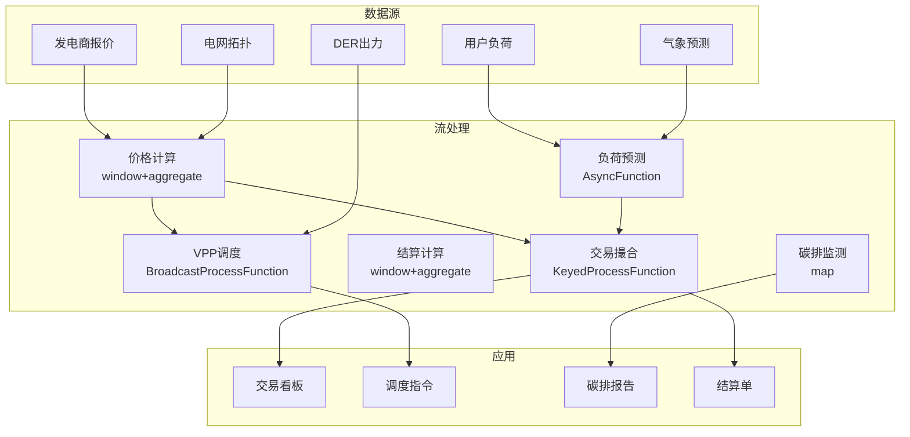

# 算子与实时能源交易

> **所属阶段**: Knowledge/10-case-studies | **前置依赖**: [01.10-process-and-async-operators.md](../01-concept-atlas/operator-deep-dive/01.10-process-and-async-operators.md), [operator-energy-grid-monitoring.md](../06-frontier/operator-energy-grid-monitoring.md) | **形式化等级**: L3
> **文档定位**: 流处理算子在实时电力市场交易、需求响应与碳排放监测中的算子指纹与Pipeline设计
> **版本**: 2026.04

---

## 目录

- [算子与实时能源交易](#算子与实时能源交易)
  - [目录](#目录)
  - [1. 概念定义 (Definitions)](#1-概念定义-definitions)
    - [Def-ETR-01-01: 实时电力市场（Real-time Electricity Market）](#def-etr-01-01-实时电力市场real-time-electricity-market)
    - [Def-ETR-01-02: 节点边际电价（Locational Marginal Price, LMP）](#def-etr-01-02-节点边际电价locational-marginal-price-lmp)
    - [Def-ETR-01-03: 需求响应（Demand Response, DR）](#def-etr-01-03-需求响应demand-response-dr)
    - [Def-ETR-01-04: 虚拟电厂（Virtual Power Plant, VPP）](#def-etr-01-04-虚拟电厂virtual-power-plant-vpp)
    - [Def-ETR-01-05: 碳排放强度（Carbon Intensity）](#def-etr-01-05-碳排放强度carbon-intensity)
  - [2. 属性推导 (Properties)](#2-属性推导-properties)
    - [Lemma-ETR-01-01: 电力供需平衡约束](#lemma-etr-01-01-电力供需平衡约束)
    - [Lemma-ETR-01-02: 储能充放电的互补性](#lemma-etr-01-02-储能充放电的互补性)
    - [Prop-ETR-01-01: 可再生能源出力的波动性](#prop-etr-01-01-可再生能源出力的波动性)
    - [Prop-ETR-01-02: 需求弹性与价格的关系](#prop-etr-01-02-需求弹性与价格的关系)
  - [3. 关系建立 (Relations)](#3-关系建立-relations)
    - [3.1 能源交易Pipeline算子映射](#31-能源交易pipeline算子映射)
    - [3.2 算子指纹](#32-算子指纹)
    - [3.3 电力市场时间尺度](#33-电力市场时间尺度)
  - [4. 论证过程 (Argumentation)](#4-论证过程-argumentation)
    - [4.1 为什么能源交易需要流处理而非传统调度](#41-为什么能源交易需要流处理而非传统调度)
    - [4.2 可再生能源并网的挑战](#42-可再生能源并网的挑战)
    - [4.3 电力市场博弈与策略](#43-电力市场博弈与策略)
  - [5. 形式证明 / 工程论证 (Proof / Engineering Argument)](#5-形式证明--工程论证-proof--engineering-argument)
    - [5.1 实时LMP计算](#51-实时lmp计算)
    - [5.2 需求响应自动化](#52-需求响应自动化)
    - [5.3 碳排放实时监测](#53-碳排放实时监测)
  - [6. 实例验证 (Examples)](#6-实例验证-examples)
    - [6.1 实战：虚拟电厂聚合调度](#61-实战虚拟电厂聚合调度)
    - [6.2 实战：电动汽车V2G调度](#62-实战电动汽车v2g调度)
  - [7. 可视化 (Visualizations)](#7-可视化-visualizations)
    - [能源交易Pipeline](#能源交易pipeline)
  - [8. 引用参考 (References)](#8-引用参考-references)

---

## 1. 概念定义 (Definitions)

### Def-ETR-01-01: 实时电力市场（Real-time Electricity Market）

实时电力市场是在交割前数分钟至数小时内确定电价的交易机制：

$$\text{Price}_t = \frac{\text{MarginalCost}(\text{Supply}_t)}{1 - \text{CongestionFactor}_t}$$

市场参与者：发电商、售电商、大用户、储能运营商、虚拟电厂（VPP）。

### Def-ETR-01-02: 节点边际电价（Locational Marginal Price, LMP）

LMP是考虑发电成本、输电阻塞和线路损耗的节点电价：

$$\text{LMP}_i = \lambda + \sum_{k} \mu_k \cdot \text{SF}_{i,k}$$

其中 $\lambda$ 为系统能量价格，$\mu_k$ 为线路 $k$ 的阻塞影子价格，$\text{SF}_{i,k}$ 为节点 $i$ 对线路 $k$ 的转移分布因子。

### Def-ETR-01-03: 需求响应（Demand Response, DR）

需求响应是用户根据价格信号调整用电负荷的行为：

$$\text{Load}_t^{actual} = \text{Load}_t^{baseline} - \text{Response}(\text{Price}_t - \text{Price}_t^{expected})$$

### Def-ETR-01-04: 虚拟电厂（Virtual Power Plant, VPP）

虚拟电厂是将分布式能源聚合为统一调度单元的协调系统：

$$\text{VPP}_{capacity} = \sum_{i \in \text{DERs}} \text{Capacity}_i \cdot \text{Availability}_i$$

DERs包括：分布式光伏、风电、储能、电动汽车、可控负荷。

### Def-ETR-01-05: 碳排放强度（Carbon Intensity）

碳排放强度是单位电量的CO₂排放量：

$$\text{CI}_t = \frac{\sum_{g} \text{Output}_{g,t} \cdot \text{EF}_g}{\sum_{g} \text{Output}_{g,t}}$$

其中 $\text{EF}_g$ 为发电机组 $g$ 的排放因子（煤: ~820g/kWh, 气: ~490g/kWh, 风/光: ~0g/kWh）。

---

## 2. 属性推导 (Properties)

### Lemma-ETR-01-01: 电力供需平衡约束

电力系统必须实时平衡：

$$\sum_{g} \text{Generation}_{g,t} = \sum_{d} \text{Demand}_{d,t} + \text{Losses}_t$$

不平衡将导致频率偏离50/60Hz标准值。

### Lemma-ETR-01-02: 储能充放电的互补性

储能系统在同一时刻不能同时充放电：

$$\text{Charge}_t \cdot \text{Discharge}_t = 0$$

**证明**: 充电和放电是互斥的物理过程，同一时刻只能执行一种操作。∎

### Prop-ETR-01-01: 可再生能源出力的波动性

风电和光伏出力与气象条件的关系：

$$P_{wind} = \frac{1}{2} \rho A C_p v^3, \quad P_{solar} = \eta \cdot A \cdot G \cdot (1 - \alpha \cdot (T - T_{ref}))$$

其中 $v$ 为风速，$G$ 为太阳辐照度，$T$ 为面板温度。出力不确定性导致电价波动。

### Prop-ETR-01-02: 需求弹性与价格的关系

需求价格弹性：

$$\epsilon_D = \frac{\Delta Q / Q}{\Delta P / P}$$

电力短期弹性约 -0.1 至 -0.3（缺乏弹性），长期弹性约 -0.3 至 -0.7。

---

## 3. 关系建立 (Relations)

### 3.1 能源交易Pipeline算子映射

| 应用场景 | 算子组合 | 数据源 | 延迟要求 |
|---------|---------|--------|---------|
| **价格计算** | window+aggregate + map | 发电商报价 | < 5min |
| **负荷预测** | AsyncFunction + window | 历史+气象 | < 15min |
| **交易撮合** | KeyedProcessFunction | 买卖订单 | < 1min |
| **结算计算** | window+aggregate | 实际出力 | 日级 |
| **碳排监测** | map + window | 发电组合 | < 5min |
| **需求响应** | Broadcast + ProcessFunction | 价格信号 | < 1min |

### 3.2 算子指纹

| 维度 | 能源交易特征 |
|------|------------|
| **核心算子** | KeyedProcessFunction（交易撮合）、AsyncFunction（负荷预测）、BroadcastProcessFunction（价格信号）、window+aggregate（结算） |
| **状态类型** | ValueState（账户余额/持仓）、MapState（报价簿）、BroadcastState（市场规则） |
| **时间语义** | 事件时间（交易时间戳） |
| **数据特征** | 高频率（秒级报价）、强季节性、政策敏感 |
| **状态热点** | 热门交易品种Key |
| **性能瓶颈** | 复杂优化求解、外部气象API |

### 3.3 电力市场时间尺度

| 市场类型 | 交易周期 | 交割时间 | 价格特征 |
|---------|---------|---------|---------|
| **日前市场** | 日前 | 次日24h | 相对稳定 |
| **日内市场** | 交割前4h | 1-4h后 | 中等波动 |
| **实时市场** | 交割前5-15min | 5-15min后 | 高波动 |
| **辅助服务** | 实时 | 即时 | 高溢价 |

---

## 4. 论证过程 (Argumentation)

### 4.1 为什么能源交易需要流处理而非传统调度

传统调度的问题：

- 日前计划：无法应对可再生能源出力突变
- 人工调度：响应慢，无法捕捉市场机会
- 离线结算：争议发现滞后

流处理的优势：

- 实时定价：基于最新供需数据动态定价
- 自动交易：算法根据价格信号自动下单
- 实时结算：交易即清算

### 4.2 可再生能源并网的挑战

**问题**: 风电/光伏出力随机波动，传统火电无法快速跟踪。

**流处理方案**:

1. **实时出力预测**: 基于气象数据预测未来15分钟出力
2. **储能协调**: 预测偏差时自动调度储能充放电
3. **需求响应**: 价格信号引导用户调整负荷

### 4.3 电力市场博弈与策略

**场景**: 多个发电商在实时市场中报价博弈。

**策略**:

1. **价格接受者**: 按边际成本报价
2. **策略性报价**: 考虑竞争对手行为
3. **学习算法**: 强化学习优化报价策略

---

## 5. 形式证明 / 工程论证 (Proof / Engineering Argument)

### 5.1 实时LMP计算

```java
public class LMPCalculationFunction extends BroadcastProcessFunction<GeneratorBid, GridTopology, LMPResult> {
    private ValueState<GridState> gridState;

    @Override
    public void processElement(GeneratorBid bid, ReadOnlyContext ctx, Collector<LMPResult> out) throws Exception {
        GridState state = gridState.value();
        if (state == null) state = new GridState();

        state.updateBid(bid);

        // 读取电网拓扑（Broadcast State）
        ReadOnlyBroadcastState<String, GridTopology> topo = ctx.getBroadcastState(TOPOLOGY_DESCRIPTOR);
        GridTopology topology = topo.get("default");

        if (topology == null) return;

        // 经济调度求解（简化：按边际成本排序）
        List<GeneratorBid> sortedBids = state.getAllBids().stream()
            .sorted(Comparator.comparing(GeneratorBid::getMarginalCost))
            .collect(Collectors.toList());

        double totalDemand = state.getTotalDemand();
        double dispatched = 0;
        double systemLambda = 0;

        for (GeneratorBid b : sortedBids) {
            if (dispatched >= totalDemand) break;
            double toDispatch = Math.min(b.getMaxOutput(), totalDemand - dispatched);
            dispatched += toDispatch;
            systemLambda = b.getMarginalCost();
            state.dispatch(b.getGeneratorId(), toDispatch);
        }

        // 计算各节点LMP（简化：假设无阻塞）
        for (String node : topology.getNodes()) {
            double lmp = systemLambda;
            // 添加阻塞分量（实际需DC OPF求解）
            double congestion = topology.getCongestionFactor(node);
            lmp *= (1 + congestion);

            out.collect(new LMPResult(node, lmp, systemLambda, congestion, ctx.timestamp()));
        }

        gridState.update(state);
    }

    @Override
    public void processBroadcastElement(GridTopology topo, Context ctx, Collector<LMPResult> out) {
        ctx.getBroadcastState(TOPOLOGY_DESCRIPTOR).put("default", topo);
    }
}
```

### 5.2 需求响应自动化

```java
// 价格信号流
DataStream<PriceSignal> prices = env.addSource(new MarketPriceSource());

// 用户负荷流
DataStream<UserLoad> loads = env.addSource(new SmartMeterSource());

// 需求响应引擎
loads.keyBy(UserLoad::getUserId)
    .connect(prices.broadcast())
    .process(new BroadcastProcessFunction<UserLoad, PriceSignal, LoadAdjustment>() {
        private ValueState<UserPreference> userPref;

        @Override
        public void processElement(UserLoad load, ReadOnlyContext ctx, Collector<LoadAdjustment> out) throws Exception {
            ReadOnlyBroadcastState<String, PriceSignal> priceState = ctx.getBroadcastState(PRICE_DESCRIPTOR);
            PriceSignal price = priceState.get(load.getRegion());

            if (price == null) return;

            UserPreference pref = userPref.value();
            if (pref == null) pref = new UserPreference();

            // 价格响应模型
            double baseline = load.getBaselineLoad();
            double priceRatio = price.getCurrentPrice() / price.getExpectedPrice();

            double elasticity = pref.getPriceElasticity();
            double adjustment = baseline * elasticity * (priceRatio - 1);

            // 约束：最大调整不超过容量的30%
            double maxAdjustment = baseline * 0.3;
            adjustment = Math.max(-maxAdjustment, Math.min(maxAdjustment, adjustment));

            out.collect(new LoadAdjustment(load.getUserId(), adjustment, price.getCurrentPrice(), ctx.timestamp()));
        }

        @Override
        public void processBroadcastElement(PriceSignal price, Context ctx, Collector<LoadAdjustment> out) {
            ctx.getBroadcastState(PRICE_DESCRIPTOR).put(price.getRegion(), price);
        }
    })
    .addSink(new DRControlSink());
```

### 5.3 碳排放实时监测

```java
// 发电出力流
DataStream<GenerationOutput> generation = env.addSource(new SCADASource());

// 碳排放计算
generation.keyBy(GenerationOutput::getRegion)
    .window(TumblingProcessingTimeWindows.of(Time.minutes(5)))
    .aggregate(new CarbonAggregate())
    .map(new CarbonIntensityFunction())
    .addSink(new CarbonDashboardSink());

public class CarbonIntensityFunction implements MapFunction<CarbonAggregateResult, CarbonIntensityReport> {
    private Map<String, Double> emissionFactors = new HashMap<>();

    public CarbonIntensityFunction() {
        emissionFactors.put("COAL", 0.82);
        emissionFactors.put("GAS", 0.49);
        emissionFactors.put("OIL", 0.72);
        emissionFactors.put("NUCLEAR", 0.012);
        emissionFactors.put("WIND", 0.0);
        emissionFactors.put("SOLAR", 0.0);
        emissionFactors.put("HYDRO", 0.024);
    }

    @Override
    public CarbonIntensityReport map(CarbonAggregateResult result) {
        double totalEmissions = 0;
        double totalOutput = 0;

        for (Map.Entry<String, Double> entry : result.getGenerationByType().entrySet()) {
            String type = entry.getKey();
            double output = entry.getValue();
            double ef = emissionFactors.getOrDefault(type, 0.5);
            totalEmissions += output * ef;
            totalOutput += output;
        }

        double ci = totalOutput > 0 ? totalEmissions / totalOutput : 0;
        return new CarbonIntensityReport(result.getRegion(), ci, totalOutput, result.getTimestamp());
    }
}
```

---

## 6. 实例验证 (Examples)

### 6.1 实战：虚拟电厂聚合调度

```java
// 分布式能源资源（DER）数据流
DataStream<DEROutput> ders = env.addSource(new DERSource());

// VPP聚合
ders.keyBy(DEROutput::getVppId)
    .window(SlidingEventTimeWindows.of(Time.minutes(15), Time.minutes(5)))
    .aggregate(new VPPCapacityAggregate())
    .process(new KeyedProcessFunction<String, VPPCapacity, VPPBid>() {
        private ValueState<VPPStrategy> strategy;

        @Override
        public void processElement(VPPCapacity capacity, Context ctx, Collector<VPPBid> out) throws Exception {
            VPPStrategy s = strategy.value();
            if (s == null) s = new VPPStrategy();

            // 根据市场价格决定报价策略
            double availableCapacity = capacity.getTotalCapacity();
            double bidPrice = s.calculateBidPrice(capacity.getMarginalCost());

            out.collect(new VPPBid(capacity.getVppId(), availableCapacity, bidPrice, ctx.timestamp()));
        }
    })
    .addSink(new MarketBidSink());
```

### 6.2 实战：电动汽车V2G调度

```java
// 电动汽车状态流
DataStream<EVStatus> evs = env.addSource(new EVChargingSource());

// V2G（Vehicle-to-Grid）调度
evs.keyBy(EVStatus::getChargingStationId)
    .connect(priceSignals.broadcast())
    .process(new CoProcessFunction<EVStatus, PriceSignal, EVCommand>() {
        private MapState<String, EVStatus> connectedEVs;

        @Override
        public void processElement1(EVStatus ev, Context ctx, Collector<EVCommand> out) throws Exception {
            connectedEVs.put(ev.getVehicleId(), ev);

            // 根据电价和SOC决定充放电
            if (ev.getSoc() < 0.2) {
                out.collect(new EVCommand(ev.getVehicleId(), "CHARGE", ev.getMaxChargeRate()));
            } else if (ev.getSoc() > 0.8 && price.getCurrentPrice() > price.getExpectedPrice() * 1.5) {
                out.collect(new EVCommand(ev.getVehicleId(), "DISCHARGE", ev.getMaxDischargeRate()));
            }
        }

        @Override
        public void processElement2(PriceSignal price, Context ctx, Collector<EVCommand> out) {
            // 价格更新触发全局调度优化
        }
    })
    .addSink(new EVControllerSink());
```

---

## 7. 可视化 (Visualizations)

### 能源交易Pipeline



---

## 8. 引用参考 (References)


---

*关联文档*: [01.10-process-and-async-operators.md](../01-concept-atlas/operator-deep-dive/01.10-process-and-async-operators.md) | [operator-energy-grid-monitoring.md](../06-frontier/operator-energy-grid-monitoring.md) | [realtime-smart-agriculture-case-study.md](../10-case-studies/realtime-smart-agriculture-case-study.md)
