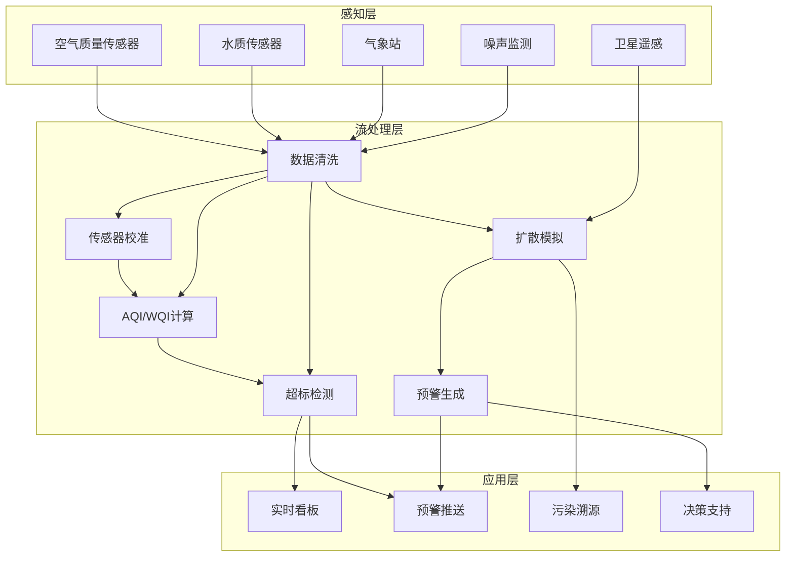

# 算子与实时环境监测

> **所属阶段**: Knowledge/10-case-studies | **前置依赖**: [01.06-single-input-operators.md](../01-concept-atlas/operator-deep-dive/01.06-single-input-operators.md), [operator-edge-computing-integration.md](../06-frontier/operator-edge-computing-integration.md) | **形式化等级**: L3
> **文档定位**: 流处理算子在实时空气质量监测、水质监测与气象预警中的算子指纹与Pipeline设计
> **版本**: 2026.04

---

## 目录

- [算子与实时环境监测](#算子与实时环境监测)
  - [目录](#目录)
  - [1. 概念定义 (Definitions)](#1-概念定义-definitions)
    - [Def-ENV-01-01: 环境监测物联网（Env-IoT）](#def-env-01-01-环境监测物联网env-iot)
    - [Def-ENV-01-02: 空气质量指数（AQI）](#def-env-01-02-空气质量指数aqi)
    - [Def-ENV-01-03: 水质指数（WQI）](#def-env-01-03-水质指数wqi)
    - [Def-ENV-01-04: 污染物扩散模型（Gaussian Plume Model）](#def-env-01-04-污染物扩散模型gaussian-plume-model)
    - [Def-ENV-01-05: 极端天气预警（Extreme Weather Alert）](#def-env-01-05-极端天气预警extreme-weather-alert)
  - [2. 属性推导 (Properties)](#2-属性推导-properties)
    - [Lemma-ENV-01-01: 传感器数据的时间相关性](#lemma-env-01-01-传感器数据的时间相关性)
    - [Lemma-ENV-01-02: AQI的空间平滑性](#lemma-env-01-02-aqi的空间平滑性)
    - [Prop-ENV-01-01: 数据缺失对AQI计算的影响](#prop-env-01-01-数据缺失对aqi计算的影响)
    - [Prop-ENV-01-02: 预警提前期与误报率的权衡](#prop-env-01-02-预警提前期与误报率的权衡)
  - [3. 关系建立 (Relations)](#3-关系建立-relations)
    - [3.1 环境监测Pipeline算子映射](#31-环境监测pipeline算子映射)
    - [3.2 算子指纹](#32-算子指纹)
    - [3.3 监测参数对比](#33-监测参数对比)
  - [4. 论证过程 (Argumentation)](#4-论证过程-argumentation)
    - [4.1 为什么环境监测需要流处理而非定时采集](#41-为什么环境监测需要流处理而非定时采集)
    - [4.2 传感器故障的数据补偿](#42-传感器故障的数据补偿)
    - [4.3 多源数据融合的挑战](#43-多源数据融合的挑战)
  - [5. 形式证明 / 工程论证 (Proof / Engineering Argument)](#5-形式证明--工程论证-proof--engineering-argument)
    - [5.1 实时AQI计算Pipeline](#51-实时aqi计算pipeline)
    - [5.2 污染源扩散追踪](#52-污染源扩散追踪)
    - [5.3 极端天气预警](#53-极端天气预警)
  - [6. 实例验证 (Examples)](#6-实例验证-examples)
    - [6.1 实战：城市空气质量实时监测平台](#61-实战城市空气质量实时监测平台)
    - [6.2 实战：河流水质实时监测](#62-实战河流水质实时监测)
  - [7. 可视化 (Visualizations)](#7-可视化-visualizations)
    - [环境监测Pipeline](#环境监测pipeline)
  - [8. 引用参考 (References)](#8-引用参考-references)

---

## 1. 概念定义 (Definitions)

### Def-ENV-01-01: 环境监测物联网（Env-IoT）

环境监测物联网是部署在城市/自然区域的传感器网络，用于实时采集环境参数：

$$\text{EnvIoT} = \{s_i : (\text{parameter}_i, \text{location}_i, \text{frequency}_i, \text{calibration}_i)\}_{i=1}^{n}$$

监测参数：PM2.5、PM10、SO₂、NO₂、CO、O₃、CO₂、温度、湿度、风速、噪声、水质（pH/溶解氧/浊度）。

### Def-ENV-01-02: 空气质量指数（AQI）

AQI是将多污染物浓度综合为单一数值的指数：

$$\text{AQI} = \max_i \left(\frac{C_i - C_{i}^{low}}{C_{i}^{high} - C_{i}^{low}} \times (I_{i}^{high} - I_{i}^{low}) + I_{i}^{low}\right)$$

其中 $C_i$ 为污染物 $i$ 的浓度，$C_i^{low/high}$ 为对应浓度限值，$I_i^{low/high}$ 为对应指数限值。

### Def-ENV-01-03: 水质指数（WQI）

WQI是多参数综合水质评价指标：

$$\text{WQI} = \frac{\sum_{i=1}^{n} w_i \cdot q_i}{\sum_{i=1}^{n} w_i}$$

其中 $w_i$ 为参数权重，$q_i = \frac{C_i}{S_i} \times 100$ 为参数质量评分（$S_i$ 为标准限值）。

### Def-ENV-01-04: 污染物扩散模型（Gaussian Plume Model）

高斯烟羽模型描述污染物的空间扩散：

$$C(x, y, z) = \frac{Q}{2\pi u \sigma_y \sigma_z} \exp\left(-\frac{y^2}{2\sigma_y^2}\right) \left[\exp\left(-\frac{(z-H)^2}{2\sigma_z^2}\right) + \exp\left(-\frac{(z+H)^2}{2\sigma_z^2}\right)\right]$$

其中 $Q$ 为排放速率，$u$ 为风速，$\sigma_y, \sigma_z$ 为扩散系数，$H$ 为有效排放高度。

### Def-ENV-01-05: 极端天气预警（Extreme Weather Alert）

极端天气预警是基于多源数据融合的灾害预报：

$$\text{Alert} = \text{Severity}(\text{modelForecast}) \times \text{Confidence}(\text{observationValidation}) > \theta_{alert}$$

---

## 2. 属性推导 (Properties)

### Lemma-ENV-01-01: 传感器数据的时间相关性

相邻时刻的环境参数满足自相关：

$$\rho(\tau) = \frac{\text{Cov}(X_t, X_{t+\tau})}{\sigma^2} = e^{-\lambda \tau}$$

其中 $\lambda$ 为衰减率，典型值 0.01-0.1 /分钟。

### Lemma-ENV-01-02: AQI的空间平滑性

邻近监测站点的AQI值具有空间相关性：

$$\text{Cov}(AQI_i, AQI_j) = \sigma^2 \cdot \exp\left(-\frac{d_{ij}}{r_0}\right)$$

其中 $d_{ij}$ 为站点间距，$r_0$ 为相关半径（约 5-20 km）。

### Prop-ENV-01-01: 数据缺失对AQI计算的影响

当 $k$ 个污染物中 $m$ 个缺失时：

$$\text{AQI}_{effective} = \max_{i \in \text{available}} \text{IAQI}_i \cdot \left(1 + \alpha \cdot \frac{m}{k}\right)$$

其中 $\alpha$ 为缺失惩罚因子（通常 0.05-0.1）。

### Prop-ENV-01-02: 预警提前期与误报率的权衡

$$\text{Precision} = \frac{TP}{TP + FP}, \quad \text{Recall} = \frac{TP}{TP + FN}$$

提高预警阈值可降低误报率但减少提前期；降低阈值则相反。最优阈值为F1-score最大点。

---

## 3. 关系建立 (Relations)

### 3.1 环境监测Pipeline算子映射

| 应用场景 | 算子组合 | 数据源 | 延迟要求 |
|---------|---------|--------|---------|
| **空气质量监测** | Source + map + window+aggregate | 空气传感器 | < 5min |
| **AQI计算** | map + window+aggregate | 多污染物浓度 | < 1min |
| **污染源追踪** | ProcessFunction + Broadcast | 风向+排放源 | < 10min |
| **水质监测** | Source + map + window | 水质传感器 | < 5min |
| **极端天气预警** | AsyncFunction + window | 气象模型+观测 | < 15min |
| **噪声监测** | window+aggregate | 声学传感器 | < 1min |

### 3.2 算子指纹

| 维度 | 环境监测特征 |
|------|------------|
| **核心算子** | window+aggregate（时段统计）、map（AQI/WQI计算）、BroadcastProcessFunction（扩散模型参数）、AsyncFunction（气象API） |
| **状态类型** | ValueState（站点校准参数）、MapState（传感器元数据）、WindowState（时段聚合） |
| **时间语义** | 事件时间（传感器带时间戳） |
| **数据特征** | 周期性（日夜/季节）、空间相关性强、部分传感器故障导致缺失 |
| **状态规模** | 按监测站点分Key，城市级约 100-1000 站点 |
| **性能瓶颈** | 空间插值计算、外部气象模型API |

### 3.3 监测参数对比

| 参数 | 采样频率 | 精度 | 标准限值 | 健康影响 |
|------|---------|------|---------|---------|
| **PM2.5** | 1min | ±2μg/m³ | 35μg/m³(24h) | 呼吸系统 |
| **PM10** | 1min | ±5μg/m³ | 150μg/m³(24h) | 呼吸系统 |
| **O₃** | 1min | ±5ppb | 70ppb(8h) | 肺功能 |
| **NO₂** | 1min | ±10ppb | 100ppb(1h) | 心血管 |
| **SO₂** | 1min | ±5ppb | 75ppb(1h) | 呼吸道 |
| **CO** | 1min | ±0.1ppm | 9ppm(8h) | 缺氧 |
| **噪声** | 1s | ±1dB | 55dB(昼)/45dB(夜) | 听力/心理 |

---

## 4. 论证过程 (Argumentation)

### 4.1 为什么环境监测需要流处理而非定时采集

定时采集的问题：

- 数据间隔长：无法捕捉污染突发峰值
- 响应滞后：超标事件发现延迟
- 空间盲区：固定点位无法覆盖全城

流处理的优势：

- 实时预警：污染物超标秒级发现
- 动态插值：多站点数据实时融合
- 趋势预测：基于实时数据预测未来变化

### 4.2 传感器故障的数据补偿

**问题**: 某站点PM2.5传感器故障，数据缺失。

**方案**:

1. **空间插值**: 利用邻近站点数据通过Kriging插值估计
2. **时间预测**: 利用历史同期数据+实时趋势预测
3. **模型融合**: 结合卫星遥感AOD（气溶胶光学厚度）反演

### 4.3 多源数据融合的挑战

**场景**: 空气质量监测需要融合地面站、卫星遥感、移动监测车数据。

**挑战**:

- 空间分辨率差异：地面站点状 vs 卫星面状
- 时间频率差异：地面1分钟 vs 卫星日级
- 精度差异：地面高精度 vs 卫星低精度大范围

**方案**: 使用卡尔曼滤波进行多源数据同化。

---

## 5. 形式证明 / 工程论证 (Proof / Engineering Argument)

### 5.1 实时AQI计算Pipeline

```java
public class AQICalculationFunction extends ProcessFunction<SensorReading, AQIResult> {
    private MapState<String, Double> latestReadings;
    private ValueState<Map<String, Double>> hourlyMax;

    @Override
    public void processElement(SensorReading reading, Context ctx, Collector<AQIResult> out) throws Exception {
        String pollutant = reading.getParameter();
        double value = reading.getValue();

        // 保存最新读数
        latestReadings.put(pollutant, value);

        // 计算各污染物IAQI
        Map<String, Double> iaqiMap = new HashMap<>();
        for (Map.Entry<String, Double> entry : latestReadings.entries()) {
            String param = entry.getKey();
            double val = entry.getValue();
            double iaqi = calculateIAQI(param, val);
            iaqiMap.put(param, iaqi);
        }

        // AQI = max(IAQI)
        double aqi = iaqiMap.values().stream().mapToDouble(Double::doubleValue).max().orElse(0);
        String primaryPollutant = iaqiMap.entrySet().stream()
            .max(Map.Entry.comparingByValue()).map(Map.Entry::getKey).orElse("NONE");

        // 确定等级
        String level = determineLevel(aqi);

        out.collect(new AQIResult(reading.getStationId(), aqi, primaryPollutant, level, ctx.timestamp()));
    }

    private double calculateIAQI(String pollutant, double concentration) {
        // 简化IAQI分段线性插值
        double[][] breakpoints = getBreakpoints(pollutant);  // [C_low, C_high, I_low, I_high]
        for (double[] bp : breakpoints) {
            if (concentration >= bp[0] && concentration <= bp[1]) {
                return (concentration - bp[0]) / (bp[1] - bp[0]) * (bp[3] - bp[2]) + bp[2];
            }
        }
        return 500;  // 爆表
    }

    private String determineLevel(double aqi) {
        if (aqi <= 50) return "优";
        if (aqi <= 100) return "良";
        if (aqi <= 150) return "轻度污染";
        if (aqi <= 200) return "中度污染";
        if (aqi <= 300) return "重度污染";
        return "严重污染";
    }
}
```

### 5.2 污染源扩散追踪

```java
// 污染排放源数据
DataStream<EmissionSource> sources = env.addSource(new EmissionSourceRegistry());

// 气象数据（Broadcast）
DataStream<WeatherData> weather = env.addSource(new WeatherStationSource());

// 实时扩散模拟
sources.connect(weather.broadcast())
    .process(new BroadcastProcessFunction<EmissionSource, WeatherData, PollutionForecast>() {
        @Override
        public void processElement(EmissionSource source, ReadOnlyContext ctx, Collector<PollutionForecast> out) {
            ReadOnlyBroadcastState<String, WeatherData> weatherState = ctx.getBroadcastState(WEATHER_DESCRIPTOR);
            WeatherData wd = weatherState.get(source.getRegion());

            if (wd == null) return;

            // 高斯烟羽模型简化计算
            for (int x = 100; x <= 10000; x += 100) {
                double concentration = gaussianPlume(source, wd, x, 0, 0);
                if (concentration > 0.01) {
                    out.collect(new PollutionForecast(source.getId(), x, 0, concentration, ctx.timestamp()));
                }
            }
        }

        private double gaussianPlume(EmissionSource s, WeatherData wd, double x, double y, double z) {
            double Q = s.getEmissionRate();
            double u = wd.getWindSpeed();
            double sigmaY = 0.08 * x * Math.pow(1 + 0.0001 * x, -0.5);
            double sigmaZ = 0.06 * x * Math.pow(1 + 0.0015 * x, -0.5);
            double H = s.getStackHeight();

            return Q / (2 * Math.PI * u * sigmaY * sigmaZ)
                * Math.exp(-y * y / (2 * sigmaY * sigmaY))
                * (Math.exp(-(z-H)*(z-H)/(2*sigmaZ*sigmaZ)) + Math.exp(-(z+H)*(z+H)/(2*sigmaZ*sigmaZ)));
        }

        @Override
        public void processBroadcastElement(WeatherData wd, Context ctx, Collector<PollutionForecast> out) {
            ctx.getBroadcastState(WEATHER_DESCRIPTOR).put(wd.getRegion(), wd);
        }
    })
    .addSink(new ForecastSink());
```

### 5.3 极端天气预警

```java
// 气象观测数据
DataStream<WeatherObservation> observations = env.addSource(new WeatherStationSource());

// 气象模型预报
DataStream<ModelForecast> forecasts = AsyncDataStream.unorderedWait(
    observations,
    new WeatherModelAPICall(),
    Time.seconds(30),
    100
);

// 预警生成
forecasts.keyBy(ModelForecast::getRegion)
    .process(new KeyedProcessFunction<String, ModelForecast, WeatherAlert>() {
        private ValueState<ModelForecast> lastForecast;

        @Override
        public void processElement(ModelForecast forecast, Context ctx, Collector<WeatherAlert> out) throws Exception {
            ModelForecast last = lastForecast.value();

            // 新预警或升级
            if (last == null || forecast.getSeverity() > last.getSeverity()) {
                if (forecast.getSeverity() >= 3) {  // 黄色及以上
                    out.collect(new WeatherAlert(
                        forecast.getRegion(),
                        forecast.getType(),
                        forecast.getSeverity(),
                        forecast.getStartTime(),
                        forecast.getEndTime(),
                        ctx.timestamp()
                    ));
                }
            }

            lastForecast.update(forecast);
        }
    })
    .addSink(new AlertDistributionSink());
```

---

## 6. 实例验证 (Examples)

### 6.1 实战：城市空气质量实时监测平台

```java
// 1. 多站点传感器数据接入
DataStream<SensorReading> readings = env.addSource(new MQTTSource("env/sensors/+/+"));

// 2. 数据清洗与校准
DataStream<SensorReading> calibrated = readings
    .map(new CalibrationFunction())
    .filter(r -> r.getValue() >= 0 && !Double.isNaN(r.getValue()));

// 3. AQI实时计算
calibrated.keyBy(SensorReading::getStationId)
    .process(new AQICalculationFunction())
    .addSink(new DashboardSink());

// 4. 超标预警
DataStream<AQIResult> aqiResults = calibrated.keyBy(SensorReading::getStationId)
    .process(new AQICalculationFunction());

aqiResults.filter(r -> r.getAqi() > 100)
    .addSink(new AlertSink());

// 5. 区域排名
aqiResults.keyBy(AQIResult::getLevel)
    .window(TumblingProcessingTimeWindows.of(Time.minutes(5)))
    .aggregate(new StationRankingAggregate())
    .addSink(new RankingSink());
```

### 6.2 实战：河流水质实时监测

```java
// 水质传感器流
DataStream<WaterQualityReading> water = env.addSource(new WaterSensorSource());

// WQI计算
water.keyBy(WaterQualityReading::getStationId)
    .window(SlidingEventTimeWindows.of(Time.hours(1), Time.minutes(10)))
    .aggregate(new WQIAggregate())
    .process(new ProcessFunction<WQIResult, WaterQualityAlert>() {
        @Override
        public void processElement(WQIResult wqi, Context ctx, Collector<WaterQualityAlert> out) {
            if (wqi.getWqi() < 50) {
                out.collect(new WaterQualityAlert(wqi.getStationId(), "严重污染", wqi.getWqi(), ctx.timestamp()));
            } else if (wqi.getWqi() < 70) {
                out.collect(new WaterQualityAlert(wqi.getStationId(), "中度污染", wqi.getWqi(), ctx.timestamp()));
            }
        }
    })
    .addSink(new WaterQualityAlertSink());
```

---

## 7. 可视化 (Visualizations)

### 环境监测Pipeline



---

## 8. 引用参考 (References)


---

*关联文档*: [01.06-single-input-operators.md](../01-concept-atlas/operator-deep-dive/01.06-single-input-operators.md) | [operator-edge-computing-integration.md](../06-frontier/operator-edge-computing-integration.md) | [realtime-iot-stream-processing-case-study.md](../10-case-studies/realtime-iot-stream-processing-case-study.md)
