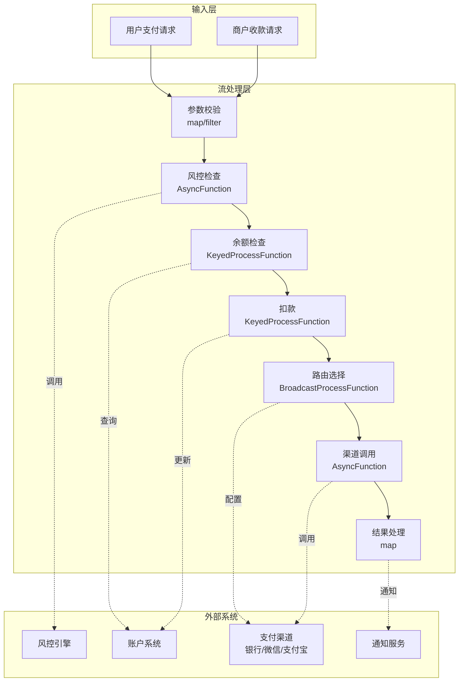
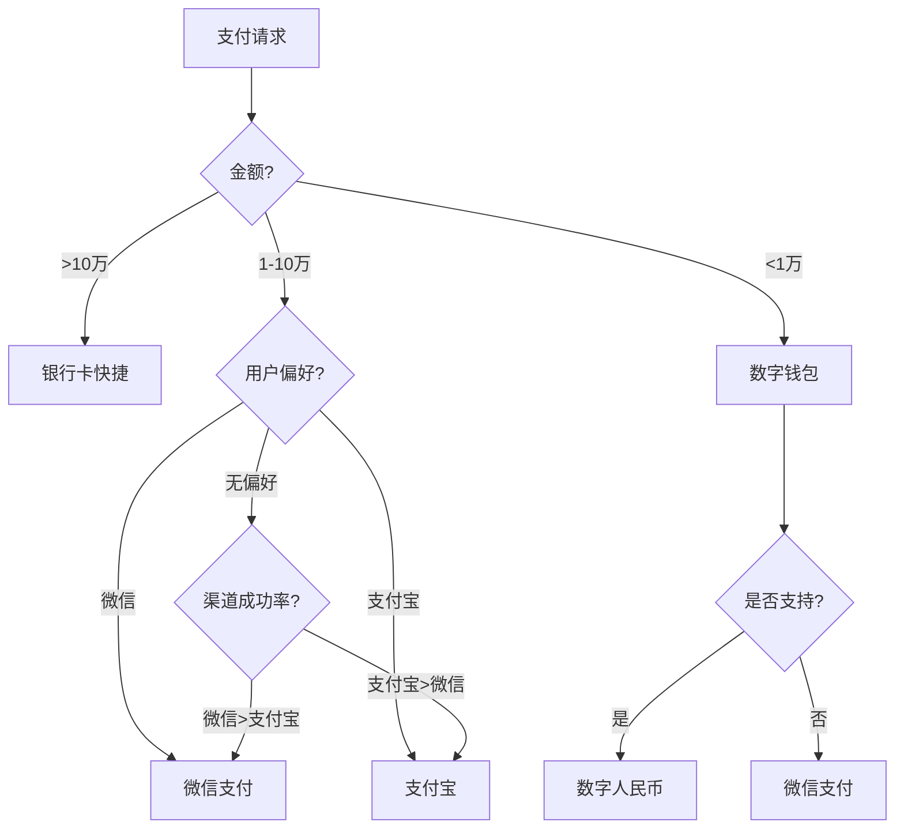

# 算子与实时金融科技（FinTech支付处理）

> **所属阶段**: Knowledge/10-case-studies | **前置依赖**: [01.10-process-and-async-operators.md](../01-concept-atlas/operator-deep-dive/01.10-process-and-async-operators.md), [operator-evolution-and-version-compatibility.md](../07-best-practices/operator-evolution-and-version-compatibility.md) | **形式化等级**: L3
> **文档定位**: 流处理算子在实时支付处理、清算与风控中的算子指纹与Pipeline设计
> **版本**: 2026.04

---

## 目录

- [算子与实时金融科技（FinTech支付处理）](#算子与实时金融科技fintech支付处理)
  - [目录](#目录)
  - [1. 概念定义 (Definitions)](#1-概念定义-definitions)
    - [Def-FIN-01-01: 实时支付处理（Real-time Payment Processing）](#def-fin-01-01-实时支付处理real-time-payment-processing)
    - [Def-FIN-01-02: 支付事务的ACID特性](#def-fin-01-02-支付事务的acid特性)
    - [Def-FIN-01-03: 双花问题（Double Spending）](#def-fin-01-03-双花问题double-spending)
    - [Def-FIN-01-04: 支付路由（Payment Routing）](#def-fin-01-04-支付路由payment-routing)
    - [Def-FIN-01-05: 监管科技（RegTech）实时合规](#def-fin-01-05-监管科技regtech实时合规)
  - [2. 属性推导 (Properties)](#2-属性推导-properties)
    - [Lemma-FIN-01-01: 支付系统的吞吐-延迟权衡](#lemma-fin-01-01-支付系统的吞吐-延迟权衡)
    - [Lemma-FIN-01-02: 幂等性键的唯一性保证](#lemma-fin-01-02-幂等性键的唯一性保证)
    - [Prop-FIN-01-01: 并发支付的隔离级别影响](#prop-fin-01-01-并发支付的隔离级别影响)
    - [Prop-FIN-01-02: 熔断机制的收益](#prop-fin-01-02-熔断机制的收益)
  - [3. 关系建立 (Relations)](#3-关系建立-relations)
    - [3.1 支付Pipeline算子映射](#31-支付pipeline算子映射)
    - [3.2 算子指纹](#32-算子指纹)
    - [3.3 支付通道对比](#33-支付通道对比)
  - [4. 论证过程 (Argumentation)](#4-论证过程-argumentation)
    - [4.1 为什么支付需要流处理而非传统批处理](#41-为什么支付需要流处理而非传统批处理)
    - [4.2 支付系统的一致性挑战](#42-支付系统的一致性挑战)
    - [4.3 高并发下的热点账户问题](#43-高并发下的热点账户问题)
  - [5. 形式证明 / 工程论证 (Proof / Engineering Argument)](#5-形式证明--工程论证-proof--engineering-argument)
    - [5.1 幂等性支付实现](#51-幂等性支付实现)
    - [5.2 支付路由的动态选择](#52-支付路由的动态选择)
    - [5.3 实时对账的流处理实现](#53-实时对账的流处理实现)
  - [6. 实例验证 (Examples)](#6-实例验证-examples)
    - [6.1 实战：电商平台支付Pipeline](#61-实战电商平台支付pipeline)
    - [6.2 实战：跨境支付实时汇兑](#62-实战跨境支付实时汇兑)
  - [7. 可视化 (Visualizations)](#7-可视化-visualizations)
    - [支付处理Pipeline](#支付处理pipeline)
    - [支付路由决策树](#支付路由决策树)
  - [8. 引用参考 (References)](#8-引用参考-references)

---

## 1. 概念定义 (Definitions)

### Def-FIN-01-01: 实时支付处理（Real-time Payment Processing）

实时支付处理是在交易发起后数秒内完成授权、清算和结算的支付系统：

$$\text{Payment} = (\text{Authorization}, \text{Clearing}, \text{Settlement})$$

其中授权（Authorization）验证交易合法性，清算（Clearing）计算各方净额，结算（Settlement）完成资金划转。

### Def-FIN-01-02: 支付事务的ACID特性

支付事务必须满足ACID特性：

- **原子性（Atomicity）**: 交易要么完全成功，要么完全失败
- **一致性（Consistency）**: 交易前后账户余额满足守恒约束
- **隔离性（Isolation）**: 并发交易互不干扰
- **持久性（Durability）**: 已确认交易不可丢失

### Def-FIN-01-03: 双花问题（Double Spending）

双花问题是同一笔资金被重复使用的风险：

$$\text{DoubleSpend} = \exists t_1, t_2: \text{Source}(t_1) = \text{Source}(t_2) \land \text{Amount}(t_1) + \text{Amount}(t_2) > \text{Balance}$$

解决方案：全局唯一交易ID + 幂等性检查。

### Def-FIN-01-04: 支付路由（Payment Routing）

支付路由是根据成功率、成本和延迟选择最优支付通道的决策过程：

$$\text{Route}^* = \arg\max_{r \in \text{Routes}} (\alpha \cdot \text{SuccessRate}_r - \beta \cdot \text{Cost}_r - \gamma \cdot \text{Latency}_r)$$

### Def-FIN-01-05: 监管科技（RegTech）实时合规

RegTech是通过技术手段实现实时监管合规的解决方案：

$$\text{Compliance} = \forall t \in \text{Transactions}: \text{Check}(t, \text{Regulations}) = \text{PASS}$$

包括反洗钱（AML）、了解你的客户（KYC）、制裁名单筛查（Sanctions Screening）。

---

## 2. 属性推导 (Properties)

### Lemma-FIN-01-01: 支付系统的吞吐-延迟权衡

支付系统的吞吐 $\lambda$ 与平均延迟 $\mathcal{L}$ 满足排队论关系：

$$\mathcal{L} = \frac{1}{\mu - \lambda}$$

其中 $\mu$ 为系统处理容量。当 $\lambda \to \mu$ 时，延迟趋向无穷大。

### Lemma-FIN-01-02: 幂等性键的唯一性保证

使用幂等键 $k$ 的事务满足：

$$\forall k: \text{Execute}(k) = \text{Execute}(\text{Execute}(k))$$

**证明**: 系统维护已处理键集合 $K_{processed}$。若 $k \in K_{processed}$，直接返回上次结果；否则执行并记录。∎

### Prop-FIN-01-01: 并发支付的隔离级别影响

不同隔离级别下并发支付的结果一致性：

| 隔离级别 | 脏读 | 不可重复读 | 幻读 | 支付场景适用性 |
|---------|------|-----------|------|--------------|
| READ UNCOMMITTED | ✅ | ✅ | ✅ | ❌ 不适用 |
| READ COMMITTED | ❌ | ✅ | ✅ | ⚠️ 可能超卖 |
| REPEATABLE READ | ❌ | ❌ | ✅ | ✅ 适用 |
| SERIALIZABLE | ❌ | ❌ | ❌ | ✅ 最安全 |

**推荐**: 支付扣款使用SERIALIZABLE，查询使用READ COMMITTED。

### Prop-FIN-01-02: 熔断机制的收益

在支付通道故障时，熔断机制可减少无效请求：

$$\text{ResourceSaved} = \lambda_{fail} \cdot \mathcal{L}_{timeout}$$

其中 $\lambda_{fail}$ 为失败请求率，$\mathcal{L}_{timeout}$ 为超时时间。

---

## 3. 关系建立 (Relations)

### 3.1 支付Pipeline算子映射

| 处理阶段 | 算子 | 功能 | 延迟要求 |
|---------|------|------|---------|
| **支付请求接入** | Source | 接收支付请求 | < 10ms |
| **参数校验** | map/filter | 格式/签名验证 | < 5ms |
| **风控检查** | AsyncFunction | 调用风控引擎 | < 50ms |
| **余额检查** | KeyedProcessFunction | 查询账户余额 | < 10ms |
| **扣款** | KeyedProcessFunction | 原子扣减 | < 10ms |
| **路由选择** | map | 选择支付通道 | < 5ms |
| **渠道调用** | AsyncFunction | 调用银行/第三方支付 | < 200ms |
| **结果处理** | map | 更新订单状态 | < 5ms |
| **通知** | AsyncFunction | 通知商户/用户 | 异步 |

### 3.2 算子指纹

| 维度 | 支付处理特征 |
|------|-------------|
| **核心算子** | KeyedProcessFunction（账户状态机）、AsyncFunction（风控/渠道）、Broadcast（路由配置） |
| **状态类型** | ValueState（账户余额）、MapState（幂等键集合）、BroadcastState（渠道配置） |
| **时间语义** | 处理时间为主（支付强调实时性） |
| **数据特征** | 高并发（万级TPS）、高敏感（资金安全）、强一致性 |
| **状态热点** | 热门账户Key（如平台自有账户） |
| **性能瓶颈** | 外部渠道调用、风控引擎响应 |

### 3.3 支付通道对比

| 通道 | 延迟 | 成本 | 成功率 | 适用场景 |
|------|------|------|--------|---------|
| **银行卡快捷** | 1-3s | 0.6% | 95% | 大额支付 |
| **微信支付** | 500ms-2s | 0.6% | 98% | 小额高频 |
| **支付宝** | 500ms-2s | 0.6% | 98% | 小额高频 |
| **数字人民币** | 100ms-1s | 0% | 99% | 政策推广 |
| **跨境SWIFT** | 1-5天 | $20-50 | 90% | 国际汇款 |
| **区块链** | 10s-1h | 可变 | 99% | 去中心化 |

---

## 4. 论证过程 (Argumentation)

### 4.1 为什么支付需要流处理而非传统批处理

传统批处理的问题：

- 日终对账：交易异常发现滞后24小时
- 风控滞后：欺诈交易已造成损失
- 用户体验：支付结果等待时间长

流处理的优势：

- 实时风控：毫秒级拦截可疑交易
- 实时对账：交易即核对
- 实时通知：支付成功即时推送

### 4.2 支付系统的一致性挑战

**场景**: 用户A向用户B转账100元。

**必须保证**:

1. A账户扣减100元成功
2. B账户增加100元成功
3. 1和2要么同时成功，要么同时失败

**流处理方案**:

- 使用TwoPhaseCommitSinkFunction实现分布式事务
- 或采用Saga模式：A扣款 → B加款 → 若失败则补偿

### 4.3 高并发下的热点账户问题

**问题**: 大促期间，平台收款账户每秒被更新10万次，导致单Key热点。

**解决方案**:

1. **分桶**: 将热点账户逻辑拆分为100个子账户
2. **缓冲**: 先写本地缓冲，定期合并更新
3. **异步**: 实时返回成功，异步实际扣款

---

## 5. 形式证明 / 工程论证 (Proof / Engineering Argument)

### 5.1 幂等性支付实现

```java
public class IdempotentPaymentFunction extends KeyedProcessFunction<String, PaymentRequest, PaymentResult> {
    private MapState<String, PaymentResult> idempotencyState;
    private ValueState<BigDecimal> balanceState;

    @Override
    public void open(Configuration parameters) {
        idempotencyState = getRuntimeContext().getMapState(
            new MapStateDescriptor<>("idempotency", Types.STRING, Types.POJO(PaymentResult.class))
        );
        balanceState = getRuntimeContext().getState(
            new ValueStateDescriptor<>("balance", Types.BIG_DEC)
        );
    }

    @Override
    public void processElement(PaymentRequest req, Context ctx, Collector<PaymentResult> out) throws Exception {
        // 幂等性检查
        PaymentResult cached = idempotencyState.get(req.getIdempotencyKey());
        if (cached != null) {
            out.collect(cached);  // 直接返回上次结果
            return;
        }

        // 余额检查
        BigDecimal balance = balanceState.value();
        if (balance == null) balance = BigDecimal.ZERO;

        if (balance.compareTo(req.getAmount()) < 0) {
            PaymentResult result = new PaymentResult(req.getId(), "FAILED", "INSUFFICIENT_BALANCE", ctx.timestamp());
            idempotencyState.put(req.getIdempotencyKey(), result);
            out.collect(result);
            return;
        }

        // 扣款
        BigDecimal newBalance = balance.subtract(req.getAmount());
        balanceState.update(newBalance);

        PaymentResult result = new PaymentResult(req.getId(), "SUCCESS", null, ctx.timestamp());
        idempotencyState.put(req.getIdempotencyKey(), result);
        out.collect(result);
    }
}
```

### 5.2 支付路由的动态选择

```java
public class PaymentRouter extends BroadcastProcessFunction<PaymentRequest, RouteConfig, RoutedPayment> {
    private MapState<String, ChannelMetrics> channelMetrics;

    @Override
    public void processElement(PaymentRequest req, ReadOnlyContext ctx, Collector<RoutedPayment> out) {
        ReadOnlyBroadcastState<String, RouteConfig> routes = ctx.getBroadcastState(ROUTE_DESCRIPTOR);

        String bestChannel = null;
        double bestScore = Double.NEGATIVE_INFINITY;

        for (Map.Entry<String, RouteConfig> entry : routes.immutableEntries()) {
            String channel = entry.getKey();
            RouteConfig config = entry.getValue();

            ChannelMetrics metrics = channelMetrics.get(channel);
            if (metrics == null) metrics = new ChannelMetrics();

            // 评分 = 成功率权重 - 成本权重 - 延迟权重
            double score = config.getSuccessWeight() * metrics.getSuccessRate()
                         - config.getCostWeight() * metrics.getAvgCost()
                         - config.getLatencyWeight() * metrics.getAvgLatency();

            if (score > bestScore) {
                bestScore = score;
                bestChannel = channel;
            }
        }

        out.collect(new RoutedPayment(req, bestChannel));
    }

    @Override
    public void processBroadcastElement(RouteConfig config, Context ctx, Collector<RoutedPayment> out) {
        ctx.getBroadcastState(ROUTE_DESCRIPTOR).put(config.getChannelId(), config);
    }
}
```

### 5.3 实时对账的流处理实现

```java
// 支付请求流
DataStream<PaymentRequest> requests = env.addSource(new KafkaSource<>("payment-requests"));

// 支付结果流
DataStream<PaymentResult> results = env.addSource(new KafkaSource<>("payment-results"));

// 实时对账：请求与结果关联
requests.keyBy(PaymentRequest::getTransactionId)
    .intervalJoin(results.keyBy(PaymentResult::getTransactionId))
    .between(Time.seconds(-5), Time.minutes(5))
    .process(new ReconciliationFunction())
    .addSink(new ReconciliationReportSink());

// 超时未匹配检测
requests.keyBy(PaymentRequest::getTransactionId)
    .process(new KeyedProcessFunction<String, PaymentRequest, TimeoutAlert>() {
        private ValueState<PaymentRequest> pendingState;

        @Override
        public void processElement(PaymentRequest req, Context ctx, Collector<TimeoutAlert> out) {
            pendingState.update(req);
            ctx.timerService().registerProcessingTimeTimer(ctx.timestamp() + 300000);  // 5分钟超时
        }

        @Override
        public void onTimer(long timestamp, OnTimerContext ctx, Collector<TimeoutAlert> out) {
            PaymentRequest pending = pendingState.value();
            if (pending != null) {
                out.collect(new TimeoutAlert(pending.getTransactionId(), timestamp));
                pendingState.clear();
            }
        }
    })
    .addSink(new TimeoutAlertSink());
```

---

## 6. 实例验证 (Examples)

### 6.1 实战：电商平台支付Pipeline

```java
// 1. 支付请求接入
DataStream<PaymentRequest> requests = env.addSource(new KafkaSource<>("payment-requests"));

// 2. 参数校验
DataStream<PaymentRequest> validRequests = requests
    .filter(req -> req.getAmount().compareTo(BigDecimal.ZERO) > 0)
    .filter(req -> req.getSignature() != null);

// 3. 风控检查
DataStream<RiskCheckedPayment> riskChecked = AsyncDataStream.unorderedWait(
    validRequests,
    new RiskCheckFunction(),
    Time.milliseconds(100),
    100
);

// 4. 分流：高风险走人工审核
DataStream<PaymentRequest> autoPayments = riskChecked
    .filter(r -> r.getRiskLevel().equals("LOW"))
    .map(RiskCheckedPayment::getRequest);

DataStream<PaymentRequest> manualPayments = riskChecked
    .filter(r -> !r.getRiskLevel().equals("LOW"))
    .map(RiskCheckedPayment::getRequest);

// 5. 自动支付：扣款+路由
autoPayments.keyBy(PaymentRequest::getPayerId)
    .process(new IdempotentPaymentFunction())
    .map(new PaymentRouter())
    .addSink(new ChannelCallSink());

// 6. 结果通知
results.addSink(new NotificationSink());  // 异步通知用户/商户
```

### 6.2 实战：跨境支付实时汇兑

```java
// 多币种支付：实时汇率转换
DataStream<CrossBorderPayment> xborder = env.addSource(new KafkaSource<>("cross-border"));

// 获取实时汇率（Broadcast State）
xborder.connect(exchangeRateBroadcast)
    .process(new CoProcessFunction<CrossBorderPayment, ExchangeRate, ConvertedPayment>() {
        private ValueState<ExchangeRate> currentRate;

        @Override
        public void processElement1(CrossBorderPayment payment, Context ctx, Collector<ConvertedPayment> out) {
            ExchangeRate rate = currentRate.value();
            if (rate == null) return;

            BigDecimal converted = payment.getAmount().multiply(rate.getRate());
            out.collect(new ConvertedPayment(payment, converted, rate.getRate()));
        }

        @Override
        public void processElement2(ExchangeRate rate, Context ctx, Collector<ConvertedPayment> out) {
            currentRate.update(rate);
        }
    })
    .keyBy(ConvertedPayment::getPayerId)
    .process(new IdempotentPaymentFunction())
    .addSink(new SWIFTGatewaySink());
```

---

## 7. 可视化 (Visualizations)

### 支付处理Pipeline



### 支付路由决策树



---

## 8. 引用参考 (References)


---

*关联文档*: [01.10-process-and-async-operators.md](../01-concept-atlas/operator-deep-dive/01.10-process-and-async-operators.md) | [operator-evolution-and-version-compatibility.md](../07-best-practices/operator-evolution-and-version-compatibility.md) | [operator-security-and-permission-model.md](../08-standards/operator-security-and-permission-model.md)
