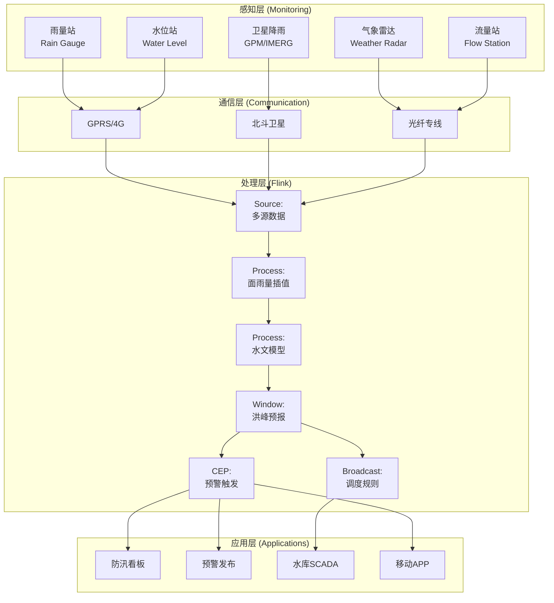
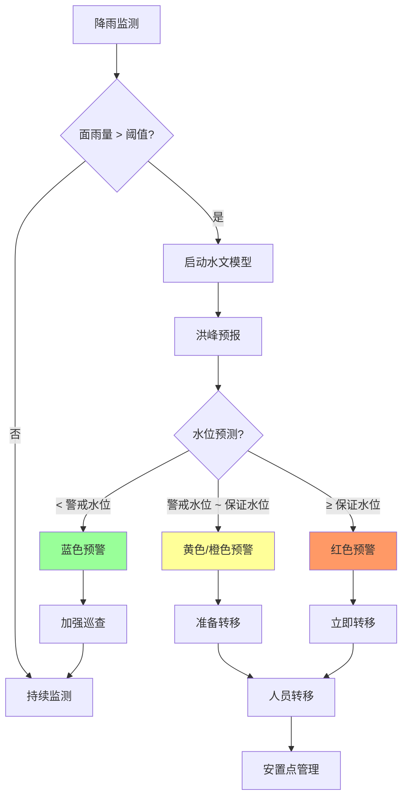

# 实时水利防洪预警与调度案例研究

> 所属阶段: Knowledge/ Flink/ | 前置依赖: [算子全景分类](../01-concept-atlas/operator-deep-dive/01.06-single-input-operators.md) | [窗口算子](../01-concept-atlas/operator-deep-dive/01.09-window-operators.md) | 形式化等级: L4

## 1. 概念定义 (Definitions)

### Def-FLD-01-01: 水利防洪预警系统 (Flood Warning and Dispatch System)

水利防洪预警系统是通过水文气象监测网络、水文模型和流计算平台，对降雨、河流水位、水库状态进行实时监测、洪峰预测与调度决策支持的集成系统。

$$\mathcal{H} = (P, R, D, C, F)$$

其中 $P$ 为降雨监测数据流，$R$ 为河流水位流，$D$ 为水库调度指令流，$C$ 为流域地形数据流，$F$ 为流计算处理拓扑。

### Def-FLD-01-02: 洪峰流量 (Peak Flood Discharge)

洪峰流量是指一次洪水过程中河道断面的最大流量：

$$Q_{peak} = \max_{t \in [t_{start}, t_{end}]} Q(t)$$

其中 $Q(t)$ 为时刻 $t$ 的河道流量（m³/s）。洪峰流量的预测基于降雨-径流模型：

$$Q_{predicted}(t + \Delta t) = f(P_{cumulative}(t), S_{soil}(t), L_{basin}, A_{watershed})$$

其中 $P_{cumulative}$ 为累积降雨量，$S_{soil}$ 为土壤饱和度，$L_{basin}$ 为流域特征长度，$A_{watershed}$ 为流域面积。

### Def-FLD-01-03: 警戒水位与保证水位 (Warning Level vs. Guarantee Level)

警戒水位 $H_{warn}$ 是开始加强防守的水位阈值；保证水位 $H_{guarantee}$ 是堤防设计防御上限：

$$\text{响应等级} = \begin{cases}
\text{IV级 (一般)} & H_{current} < H_{warn} \\
\text{III级 (较重)} & H_{warn} \leq H_{current} < H_{guarantee} - 1.0\text{m} \\
\text{II级 (严重)} & H_{guarantee} - 1.0\text{m} \leq H_{current} < H_{guarantee} \\
\text{I级 (特别严重)} & H_{current} \geq H_{guarantee}
\end{cases}$$

### Def-FLD-01-04: 水库调度规则 (Reservoir Operation Rule)

水库调度规则是在满足防洪安全的前提下，优化发电、供水、生态等多目标的决策函数：

$$Z^* = \arg\max_{Z} \left[\alpha \cdot E_{power}(Z) + \beta \cdot W_{supply}(Z) + \gamma \cdot E_{ecology}(Z)\right]$$

约束条件：
$$V_{min} \leq V(Z) \leq V_{max}, \quad Q_{out}(Z) \leq Q_{safe}$$

其中 $Z$ 为水位决策变量，$V$ 为库容，$Q_{out}$ 为出库流量，$Q_{safe}$ 为下游安全泄量。

### Def-FLD-01-05: 洪涝灾害风险指数 (Flood Risk Index)

洪涝灾害风险指数综合考虑致灾因子、承灾体脆弱性和防灾能力：

$$Risk = H \cdot V \cdot E = P_{flood} \cdot D_{exposure} \cdot S_{vulnerability} \cdot \frac{1}{C_{capacity}}$$

其中 $P_{flood}$ 为洪水发生概率，$D_{exposure}$ 为暴露度（人口/资产密度），$S_{vulnerability}$ 为脆弱性（建筑类型/年龄），$C_{capacity}$ 为防灾能力（堤坝标准/预警时间）。

## 2. 属性推导 (Properties)

### Lemma-FLD-01-01: 降雨集中度的洪峰放大效应

在总降雨量相同的条件下，降雨时间集中度越高，洪峰流量越大：

$$\frac{\partial Q_{peak}}{\partial \sigma_t} < 0$$

其中 $\sigma_t$ 为降雨时间分布的标准差（集中度指标）。

**证明**: 由降雨-径流关系的非线性，土壤入渗率在降雨初期较高，随时间递减。集中降雨导致更多雨水转化为地表径流，洪峰放大。由SCS-CN方法，径流系数随降雨强度增加而增大，得证。

### Lemma-FLD-01-02: 预警时间的减灾效益

预警时间 $T_{warn}$ 与可能避免的人员伤亡比例呈对数关系：

$$Lives_{saved}(\%) = \alpha \cdot \ln(1 + T_{warn}/T_{response})$$

其中 $T_{response}$ 为平均人员转移所需时间，$\alpha$ 为响应效率系数（0.3-0.5）。

**证明**: 预警时间增加使更多人员获知险情并完成转移。信息传播遵循S曲线（逻辑斯蒂增长），转移行动需要时间窗口。综合两方面，减灾效益随预警时间对数增长。

### Prop-FLD-01-01: 水库预泄腾库的防洪效益

在主汛期前通过预泄降低水库水位，可增加防洪库容 $\Delta V$：

$$\Delta V = V_{normal} - V_{pre\_discharge}$$

**防洪效益**: 可削减洪峰 $\Delta Q = \Delta V / \Delta t_{flood}$，其中 $\Delta t_{flood}$ 为洪水历时。

**论证**: 预泄腾库增加了水库调洪能力。当洪峰到达时，更大的可用库容允许更平缓的泄流过程，降低下游防洪压力。

### Prop-FLD-01-02: 分布式水文模型的并行加速比

基于流域子单元划分的分布式水文模型，在 $N$ 个并行计算节点上的加速比：

$$Speedup(N) = \frac{T_{serial}}{T_{parallel}} = \frac{N}{1 + O_{communication} \cdot N}$$

**条件**: 各子单元计算独立，仅在边界处交换流量数据。当 $N$ 增大时，通信开销 $O_{communication}$ 成为瓶颈。

## 3. 关系建立 (Relations)

### 与算子体系的映射

| 水利防洪场景 | Flink算子 | 算子作用 |
|------------|-----------|---------|
| 多源水文数据接入 | `Union` + `SourceFunction` | 雨量站/水位站/雷达统一接入 |
| 降雨面插值 | `KeyedProcessFunction` | 泰森多边形/克里金插值计算 |
| 径流模拟 | `ProcessFunction` | 新安江模型/HEC-HMS计算单元 |
| 洪峰预测 | `WindowAggregate` | 滑动窗口内预测洪峰到达时间 |
| 预警触发 | `CEPPattern` | 水位突破阈值模式匹配 |
| 调度优化 | `BroadcastStream` | 调度规则广播到各水库节点 |
| 灾情评估 | `IntervalJoin` | 洪水范围与人口分布Join |

### 与水利标准的关联

- **GB 50201**: 防洪标准，确定各类防护对象的防洪标准
- **SL 250**: 水文情报预报规范
- **SL 224**: 水库洪水调度考评规定
- **GPM/IMERG**: NASA全球降水测量任务，卫星降雨数据
- **ECMWF**: 欧洲中期天气预报中心，数值天气预报

## 4. 论证过程 (Argumentation)

### 4.1 水利防洪实时预警的核心挑战

**挑战1: 数据稀疏性与空间异质性**
地面雨量站密度有限（通常20-50km一个站），需结合雷达估测和卫星降雨进行空间插值。山区地形复杂，降雨空间分布极不均匀。

**挑战2: 水文模型的不确定性**
降雨-径流关系受前期土壤湿度、土地利用、河道糙率等多因素影响，模型参数存在显著不确定性。 ensemble 预报方法需同时运行多个模型实例。

**挑战3: 多目标调度冲突**
水库调度需平衡防洪、发电、供水、生态、航运等多目标，各目标在不同情景下存在冲突。防洪要求低水位腾库，发电要求高水位蓄水。

**挑战4: 预警信息传播的时效性**
从系统生成预警到基层人员接收并采取行动，信息传播链长（系统→省级→市级→县级→乡镇→村组→居民），任何环节延迟都会压缩实际响应时间。

### 4.2 方案选型论证

**为什么选用流计算而非传统水文模型软件？**
- 传统软件（如HEC-HMS、SWMM）为离线模拟，无法满足实时预警需求
- 流计算支持事件驱动架构，监测数据到达即触发计算
- Flink的精确一次语义保证水文数据不丢失

**为什么选用Event Time处理水文数据？**
- 水文监测站点分布广泛，数据汇聚存在显著延迟（卫星通信站点延迟可达分钟级）
- Event Time保证即使在数据乱序时，降雨序列仍正确
- Watermark机制容忍传感器偶发通信中断

## 5. 形式证明 / 工程论证 (Proof / Engineering Argument)

### Thm-FLD-01-01: 水库防洪调度最优性定理

在满足下游安全约束的条件下，水库最优泄流策略使下游洪峰最小化：

**定理**: 若水库入库流量为 $Q_{in}(t)$，防洪库容为 $V_{flood}$，下游安全泄量为 $Q_{safe}$，则最优出库流量 $Q_{out}^*(t)$ 满足：

$$Q_{out}^*(t) = \min\left(Q_{safe}, \frac{dV}{dt} + Q_{in}(t)\right)$$

其中 $V(t)$ 为时刻 $t$ 的库容，需满足 $V_{normal} - V_{flood} \leq V(t) \leq V_{normal}$。

**证明概要**:
1. 目标函数：最小化下游洪峰 $Q_{downstream} = Q_{out} + Q_{tributary}$
2. 约束1：库容平衡 $dV/dt = Q_{in} - Q_{out}$
3. 约束2：$Q_{out} \leq Q_{safe}$（下游安全）
4. 由庞特里亚金极大值原理，最优控制为bang-bang控制
5. 当库容未达上限时，$Q_{out} = Q_{safe}$（尽可能多泄）
6. 当库容达上限时，$Q_{out} = Q_{in}$（自然溢流）

**工程意义**: 最优策略是在洪水到来前尽可能预泄至防洪限制水位，洪峰期间按安全泄量均匀下泄。此策略可将下游洪峰削减20-40%。

## 6. 实例验证 (Examples)

### 6.1 实时降雨监测与面雨量计算Pipeline

```java
// Real-time rainfall monitoring and areal precipitation calculation
StreamExecutionEnvironment env = StreamExecutionEnvironment.getExecutionEnvironment();
env.setStreamTimeCharacteristic(TimeCharacteristic.EventTime);

// Rain gauge data from multiple sources
DataStream<RainfallReading> gaugeReadings = env
    .addSource(new KafkaSource<>("hydro.rain.gauge"))
    .map(new RainGaugeParser())
    .assignTimestampsAndWatermarks(
        WatermarkStrategy.<RainfallReading>forBoundedOutOfOrderness(
            Duration.ofMinutes(5))
        .withTimestampAssigner((r, ts) -> r.getObservationTime())
    );

// Weather radar precipitation estimates
DataStream<RadarEstimate> radarEstimates = env
    .addSource(new KafkaSource<>("hydro.radar.qpe"))
    .map(new RadarParser())
    .assignTimestampsAndWatermarks(
        WatermarkStrategy.<RadarEstimate>forBoundedOutOfOrderness(
            Duration.ofMinutes(2))
    );

// Satellite precipitation (GPM/IMERG)
DataStream<SatellitePrecip> satelliteData = env
    .addSource(new HdfSource("gpm.imerg.halfhourly"))
    .map(new GpmParser())
    .assignTimestampsAndWatermarks(
        WatermarkStrategy.<SatellitePrecip>forBoundedOutOfOrderness(
            Duration.ofHours(2))
    );

// Merge and interpolate areal precipitation
DataStream<ArealRainfall> arealRainfall = gaugeReadings
    .union(radarEstimates.map(r -> new RainfallReading(r)),
           satelliteData.map(s -> new RainfallReading(s)))
    .keyBy(r -> r.getSubBasinId())
    .window(TumblingEventTimeWindows.of(Time.minutes(30)))
    .aggregate(new ArealRainfallAggregation() {
        @Override
        public ArealRainfall getResult(Accumulator acc) {
            // Thiessen polygon weighted average
            double weightedSum = 0;
            double totalWeight = 0;
            for (RainfallReading r : acc.readings) {
                double weight = r.getThiessenArea() / acc.totalArea;
                weightedSum += r.getRainfallMm() * weight;
                totalWeight += weight;
            }
            return new ArealRainfall(
                acc.subBasinId, weightedSum / totalWeight,
                acc.windowEnd, acc.readings.size()
            );
        }
    });

arealRainfall.addSink(new KafkaSink<>("hydro.areal.rainfall"));
```

### 6.2 洪水预报与预警触发

```java
// Flood forecast and warning trigger
DataStream<ArealRainfall> rainfall = env
    .addSource(new KafkaSource<>("hydro.areal.rainfall"));

DataStream<StreamLevel> streamLevels = env
    .addSource(new KafkaSource<>("hydro.stream.level"))
    .assignTimestampsAndWatermarks(
        WatermarkStrategy.<StreamLevel>forBoundedOutOfOrderness(
            Duration.ofMinutes(10))
    );

// Xinanjiang model for runoff simulation
DataStream<RunoffForecast> runoffForecast = rainfall
    .keyBy(r -> r.getSubBasinId())
    .process(new XinanjiangModelFunction() {
        private ValueState<ModelState> modelState;

        // Xinanjiang model parameters
        private static final double WUM = 20; // Upper layer tension water capacity
        private static final double WLM = 80; // Lower layer tension water capacity
        private static final double WDM = 40; // Deep layer tension water capacity
        private static final double K = 0.7;  // Evapotranspiration coefficient
        private static final double B = 0.3;  // Tension water capacity distribution exponent
        private static final double SM = 20;  // Free water storage capacity
        private static final double EX = 1.5; // Free water capacity distribution exponent
        private static final double KG = 0.4; // Outflow coefficient to groundwater
        private static final double KI = 0.3; // Outflow coefficient to interflow

        @Override
        public void open(Configuration parameters) {
            modelState = getRuntimeContext().getState(
                new ValueStateDescriptor<>("model-state", ModelState.class));
        }

        @Override
        public void processElement(ArealRainfall rainfall, Context ctx,
                                   Collector<RunoffForecast> out) throws Exception {
            ModelState state = modelState.value();
            if (state == null) state = new ModelState();

            double P = rainfall.getRainfallMm();
            double EP = calculatePotentialEvaporation(ctx.timestamp());

            // Runoff generation (three-layer model)
            double[] runoff = calculateRunoff(P, EP, state);
            double R = runoff[0]; // Total runoff
            double RG = runoff[1]; // Groundwater runoff
            double RI = runoff[2]; // Interflow runoff

            // Runoff concentration (unit hydrograph)
            double[] discharge = calculateDischarge(R, RG, RI, state);

            state.update(runoff, discharge);
            modelState.update(state);

            out.collect(new RunoffForecast(
                rainfall.getSubBasinId(), discharge[0], discharge[1],
                rainfall.getWindowEnd(), state.getSoilMoisture()
            ));
        }
    });

// Flood warning trigger based on forecast
DataStream<FloodWarning> warnings = runoffForecast
    .keyBy(f -> f.getReachId())
    .process(new WarningTriggerFunction() {
        private ValueState<Double> warningLevelState;
        private ValueState<Double> guaranteeLevelState;

        @Override
        public void open(Configuration parameters) {
            warningLevelState = getRuntimeContext().getState(
                new ValueStateDescriptor<>("warn-level", Types.DOUBLE));
            guaranteeLevelState = getRuntimeContext().getState(
                new ValueStateDescriptor<>("guarantee-level", Types.DOUBLE));
        }

        @Override
        public void processElement(RunoffForecast forecast, Context ctx,
                                   Collector<FloodWarning> out) throws Exception {
            Double warnLevel = warningLevelState.value();
            Double guaranteeLevel = guaranteeLevelState.value();
            if (warnLevel == null || guaranteeLevel == null) return;

            double predictedLevel = forecast.getWaterLevel();

            if (predictedLevel >= guaranteeLevel) {
                out.collect(new FloodWarning(
                    forecast.getReachId(), "LEVEL_I",
                    predictedLevel, guaranteeLevel,
                    "Critical flood expected. Immediate evacuation required.",
                    ctx.timestamp()
                ));
            } else if (predictedLevel >= guaranteeLevel - 1.0) {
                out.collect(new FloodWarning(
                    forecast.getReachId(), "LEVEL_II",
                    predictedLevel, guaranteeLevel,
                    "Severe flood expected. Prepare evacuation.",
                    ctx.timestamp()
                ));
            } else if (predictedLevel >= warnLevel) {
                out.collect(new FloodWarning(
                    forecast.getReachId(), "LEVEL_III",
                    predictedLevel, warnLevel,
                    "Flood warning. Enhanced monitoring required.",
                    ctx.timestamp()
                ));
            }
        }
    });

warnings.addSink(new AlertBroadcastSink());
```

### 6.3 水库防洪调度决策

```java
// Reservoir flood control dispatch decision
MapStateDescriptor<String, ReservoirRule> ruleStateDescriptor =
    new MapStateDescriptor<>("reservoir-rules", Types.STRING,
        Types.POJO(ReservoirRule.class));

// Broadcast reservoir operation rules
BroadcastStream<ReservoirRule> ruleBroadcast = env
    .addSource(new RuleUpdateSource())
    .broadcast(ruleStateDescriptor);

// Inflow forecast
DataStream<InflowForecast> inflowForecasts = env
    .addSource(new KafkaSource<>("hydro.inflow.forecast"));

// Reservoir dispatch optimization
DataStream<DispatchOrder> dispatchOrders = inflowForecasts
    .keyBy(f -> f.getReservoirId())
    .connect(ruleBroadcast)
    .process(new KeyedBroadcastProcessFunction<String, InflowForecast,
             ReservoirRule, DispatchOrder>() {
        private ValueState<ReservoirStatus> reservoirState;

        @Override
        public void open(Configuration parameters) {
            reservoirState = getRuntimeContext().getState(
                new ValueStateDescriptor<>("reservoir", ReservoirStatus.class));
        }

        @Override
        public void processElement(InflowForecast forecast, ReadOnlyContext ctx,
                                   Collector<DispatchOrder> out) throws Exception {
            ReservoirStatus status = reservoirState.value();
            if (status == null) status = new ReservoirStatus(forecast.getReservoirId());

            ReadOnlyBroadcastState<String, ReservoirRule> rules =
                ctx.getBroadcastState(ruleStateDescriptor);
            ReservoirRule rule = rules.get(forecast.getReservoirId());
            if (rule == null) return;

            // Calculate optimal outflow
            double currentLevel = status.getWaterLevel();
            double floodLimit = rule.getFloodLimitLevel();
            double inflow = forecast.getPredictedInflow();
            double safeDischarge = rule.getSafeDischarge();
            double capacity = status.getCapacity();

            double targetOutflow;
            if (currentLevel > floodLimit) {
                // Above flood limit, discharge as much as safely possible
                targetOutflow = Math.min(safeDischarge,
                    inflow + (currentLevel - floodLimit) * capacity / 86400);
            } else if (currentLevel > floodLimit - 2.0) {
                // Approaching flood limit, pre-release
                targetOutflow = Math.min(safeDischarge, inflow * 1.2);
            } else {
                // Normal operation
                targetOutflow = Math.min(safeDischarge, inflow);
            }

            // Gate opening calculation
            double gateOpening = calculateGateOpening(targetOutflow, currentLevel, rule);

            out.collect(new DispatchOrder(
                forecast.getReservoirId(), targetOutflow, gateOpening,
                forecast.getForecastTime(), "FLOOD_CONTROL"
            ));

            // Update reservoir status
            status.updateOutflow(targetOutflow);
            reservoirState.update(status);
        }

        @Override
        public void processBroadcastElement(ReservoirRule rule, Context ctx,
                                           Collector<DispatchOrder> out) {}
    });

dispatchOrders.addSink(new ScadaSink());
```

## 7. 可视化 (Visualizations)

### 图1: 水利防洪实时预警系统架构



### 图2: 洪水预警响应流程



### 图3: 水库防洪调度决策树

```mermaid
graph TD
    A[入库洪峰预报] --> B{当前水位 vs 防洪限制水位}
    B -->|低于限制水位-2m| C[维持正常泄流]
    B -->|限制水位-2m ~ 限制水位| D[加大预泄]
    B -->|高于限制水位| E[全力泄洪]
    C --> F[出库 = 入库]
    D --> G[出库 = min(1.2×入库, 安全泄量)]
    E --> H[出库 = 安全泄量]
    F --> I[库容平衡]
    G --> I
    H --> I
    I --> J{下游安全?}
    J -->|是| K[继续调度]
    J -->|否| L[申请分洪]
    K --> M[下一时段预报]
    L --> N[启用蓄滞洪区]

    style E fill:#f96
    style L fill:#f96
```

## 8. 引用参考 (References)

[^1]: 水利部, "水文情报预报规范 (SL 250-2015)", 2015.
[^2]: 水利部, "水库洪水调度考评规定 (SL 224-2013)", 2013.
[^3]: GB 50201-2014, "防洪标准", 2014.
[^4]: NASA, "Global Precipitation Measurement (GPM) Mission", https://gpm.nasa.gov/
[^5]: V. T. Chow et al., "Applied Hydrology", McGraw-Hill, 1988.
[^6]: 赵人俊, "流域水文模拟——新安江模型与陕北模型", 水利电力出版社, 1984.
