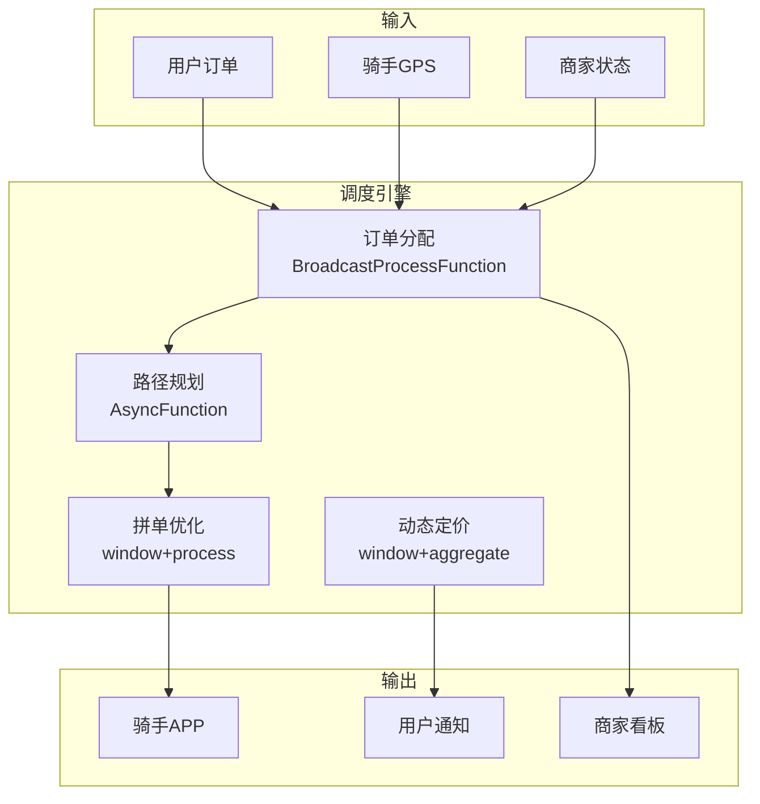

# 算子与实时餐饮外卖配送

> **所属阶段**: Knowledge/10-case-studies | **前置依赖**: [01.07-two-input-operators.md](../01-concept-atlas/operator-deep-dive/01.07-two-input-operators.md), [realtime-traffic-management-case-study.md](../10-case-studies/realtime-traffic-management-case-study.md) | **形式化等级**: L3
> **文档定位**: 流处理算子在实时外卖订单分配、骑手调度与配送路径优化中的算子指纹与Pipeline设计
> **版本**: 2026.04

---

## 目录

- [算子与实时餐饮外卖配送](#算子与实时餐饮外卖配送)
  - [目录](#目录)
  - [1. 概念定义 (Definitions)](#1-概念定义-definitions)
    - [Def-FOD-01-01: 外卖订单流（Food Delivery Order Stream）](#def-fod-01-01-外卖订单流food-delivery-order-stream)
    - [Def-FOD-01-02: 骑手调度半径（Delivery Radius）](#def-fod-01-02-骑手调度半径delivery-radius)
    - [Def-FOD-01-03: 准时率（On-time Delivery Rate）](#def-fod-01-03-准时率on-time-delivery-rate)
    - [Def-FOD-01-04: 拼单效率（Batching Efficiency）](#def-fod-01-04-拼单效率batching-efficiency)
    - [Def-FOD-01-05: 骑手负载均衡（Rider Load Balancing）](#def-fod-01-05-骑手负载均衡rider-load-balancing)
  - [2. 属性推导 (Properties)](#2-属性推导-properties)
    - [Lemma-FOD-01-01: 配送时间的组成](#lemma-fod-01-01-配送时间的组成)
    - [Lemma-FOD-01-02: 骑手承载上限](#lemma-fod-01-02-骑手承载上限)
    - [Prop-FOD-01-01: 高峰期的供需失衡](#prop-fod-01-01-高峰期的供需失衡)
    - [Prop-FOD-01-02: 动态定价的订单调节效果](#prop-fod-01-02-动态定价的订单调节效果)
  - [3. 关系建立 (Relations)](#3-关系建立-relations)
    - [3.1 外卖配送Pipeline算子映射](#31-外卖配送pipeline算子映射)
    - [3.2 算子指纹](#32-算子指纹)
  - [4. 论证过程 (Argumentation)](#4-论证过程-argumentation)
    - [4.1 为什么外卖需要流处理而非传统调度](#41-为什么外卖需要流处理而非传统调度)
    - [4.2 恶劣天气的配送挑战](#42-恶劣天气的配送挑战)
    - [4.3 骑手安全监控](#43-骑手安全监控)
  - [5. 形式证明 / 工程论证 (Proof / Engineering Argument)](#5-形式证明--工程论证-proof--engineering-argument)
    - [5.1 实时订单分配引擎](#51-实时订单分配引擎)
    - [5.2 拼单优化](#52-拼单优化)
    - [5.3 准时监控与预警](#53-准时监控与预警)
  - [6. 实例验证 (Examples)](#6-实例验证-examples)
    - [6.1 实战：外卖平台实时调度](#61-实战外卖平台实时调度)
    - [6.2 实战：动态定价引擎](#62-实战动态定价引擎)
  - [7. 可视化 (Visualizations)](#7-可视化-visualizations)
    - [外卖配送Pipeline](#外卖配送pipeline)
  - [8. 引用参考 (References)](#8-引用参考-references)

---

## 1. 概念定义 (Definitions)

### Def-FOD-01-01: 外卖订单流（Food Delivery Order Stream）

外卖订单流是用户下单、商家接单、骑手取餐、送达的完整事件序列：

$$\text{OrderLifecycle} = (\text{Created}, \text{Accepted}, \text{Prepared}, \text{PickedUp}, \text{Delivered})$$

### Def-FOD-01-02: 骑手调度半径（Delivery Radius）

骑手调度半径是平台为骑手分配订单的最大距离：

$$R_{max} = \min(R_{platform}, R_{rider}, R_{SLA})$$

其中 $R_{platform}$ 为平台策略半径，$R_{rider}$ 为骑手当前可接受范围，$R_{SLA}$ 为满足时效的最大距离。

### Def-FOD-01-03: 准时率（On-time Delivery Rate）

准时率是承诺时间内完成配送的订单比例：

$$\text{OTD} = \frac{\text{Orders}_{delivered \leq SLA}}{\text{Orders}_{total}}$$

行业目标：OTD > 95%。

### Def-FOD-01-04: 拼单效率（Batching Efficiency）

拼单效率是多订单合并配送的收益：

$$\eta_{batch} = \frac{\sum_{i} T_{single,i} - T_{batch}}{\sum_{i} T_{single,i}}$$

其中 $T_{single,i}$ 为第 $i$ 个订单单独配送时间，$T_{batch}$ 为合并配送时间。

### Def-FOD-01-05: 骑手负载均衡（Rider Load Balancing）

骑手负载均衡是订单在骑手间的均匀分配：

$$\text{Balance} = 1 - \frac{\sigma_{load}}{\mu_{load}}$$

其中 $\sigma_{load}$ 为骑手负载标准差，$\mu_{load}$ 为平均负载。

---

## 2. 属性推导 (Properties)

### Lemma-FOD-01-01: 配送时间的组成

$$T_{delivery} = T_{pickup} + T_{travel} + T_{wait}$$

其中 $T_{pickup}$ 为取餐时间，$T_{travel}$ 为行驶时间，$T_{wait}$ 为等待时间（商家出餐/电梯等）。

### Lemma-FOD-01-02: 骑手承载上限

骑手同时配送订单数上限：

$$N_{max} = \left\lfloor \frac{T_{SLA} - T_{pickup,avg}}{T_{stop,avg}} \right\rfloor$$

其中 $T_{stop,avg}$ 为每单平均停靠时间（约3-5分钟）。

### Prop-FOD-01-01: 高峰期的供需失衡

$$\text{SurgeMultiplier} = \left(\frac{D_{peak}}{S_{available}}\right)^{\gamma}$$

其中 $\gamma \approx 0.5\text{-}0.8$。高峰时段（午晚市）供需比可达3:1。

### Prop-FOD-01-02: 动态定价的订单调节效果

$$\Delta Q = Q_{base} \cdot \epsilon \cdot \Delta P$$

价格弹性 $\epsilon \approx -0.3$（短期），动态加价20%可减少约6%订单量。

---

## 3. 关系建立 (Relations)

### 3.1 外卖配送Pipeline算子映射

| 应用场景 | 算子组合 | 数据源 | 延迟要求 |
|---------|---------|--------|---------|
| **订单分配** | KeyedProcessFunction | 订单流 | < 1s |
| **骑手匹配** | AsyncFunction | 骑手位置 | < 2s |
| **路径规划** | AsyncFunction | 地图API | < 3s |
| **拼单优化** | window+aggregate | 区域内订单 | < 30s |
| **动态定价** | Broadcast + map | 供需数据 | < 1s |
| **准时监控** | ProcessFunction + Timer | 配送进度 | < 1min |

### 3.2 算子指纹

| 维度 | 外卖配送特征 |
|------|------------|
| **核心算子** | KeyedProcessFunction（订单状态机）、AsyncFunction（路径规划/ETA）、BroadcastProcessFunction（动态定价）、window+aggregate（拼单） |
| **状态类型** | ValueState（订单状态）、MapState（骑手位置）、BroadcastState（定价策略） |
| **时间语义** | 处理时间为主（配送强调实时性） |
| **数据特征** | 高突发（饭点峰值）、空间局部性强、时效敏感 |
| **状态热点** | 热门商圈Key、大型写字楼Key |
| **性能瓶颈** | 地图路径规划API、骑手匹配算法 |

---

## 4. 论证过程 (Argumentation)

### 4.1 为什么外卖需要流处理而非传统调度

传统调度的问题：

- 静态派单：无法应对实时路况变化
- 人工调度：效率低，无法处理大规模订单
- 信息滞后：骑手位置更新延迟

流处理的优势：

- 实时派单：骑手位置秒级更新，就近分配
- 动态路径：根据实时路况调整路线
- 自动拼单：实时发现可合并订单

### 4.2 恶劣天气的配送挑战

**问题**: 雨雪天气导致配送时间翻倍，骑手供应减少。

**流处理方案**:

1. **动态加价**: 提高配送费吸引骑手上线
2. **扩大半径**: 放宽配送距离限制
3. **延长SLA**: 调整用户预期送达时间
4. **智能取消**: 极端天气自动建议用户改为自取

### 4.3 骑手安全监控

**场景**: 骑手超速、逆行、疲劳驾驶。

**流处理方案**: 实时GPS轨迹分析 → 异常行为检测 → 安全提醒 → 强制休息。

---

## 5. 形式证明 / 工程论证 (Proof / Engineering Argument)

### 5.1 实时订单分配引擎

```java
public class OrderDispatchFunction extends BroadcastProcessFunction<Order, RiderStatus, DispatchResult> {
    private MapState<String, RiderStatus> riderPool;

    @Override
    public void processElement(Order order, ReadOnlyContext ctx, Collector<DispatchResult> out) throws Exception {
        String bestRider = null;
        double bestScore = Double.NEGATIVE_INFINITY;

        for (Map.Entry<String, RiderStatus> entry : riderPool.entries()) {
            RiderStatus rider = entry.getValue();
            if (!rider.isAvailable()) continue;
            if (rider.getLoad() >= rider.getMaxLoad()) continue;

            double distance = calculateDistance(order.getRestaurantLocation(), rider.getLocation());
            if (distance > rider.getMaxRadius()) continue;

            // 评分 = 距离权重 + 负载权重 + 评分权重
            double score = -0.6 * distance - 0.3 * rider.getLoad() + 0.1 * rider.getRating();

            if (score > bestScore) {
                bestScore = score;
                bestRider = entry.getKey();
            }
        }

        if (bestRider != null) {
            RiderStatus rider = riderPool.get(bestRider);
            rider.assignOrder(order.getId());
            riderPool.put(bestRider, rider);

            out.collect(new DispatchResult(order.getId(), bestRider, ctx.timestamp()));
        }
    }

    @Override
    public void processBroadcastElement(RiderStatus rider, Context ctx, Collector<DispatchResult> out) {
        riderPool.put(rider.getId(), rider);
    }
}
```

### 5.2 拼单优化

```java
// 区域内订单流
DataStream<Order> orders = env.addSource(new OrderSource());

// 30秒窗口拼单
orders.keyBy(Order::getZoneId)
    .window(TumblingProcessingTimeWindows.of(Time.seconds(30)))
    .process(new ProcessFunction<Iterable<Order>, BatchOrder>() {
        @Override
        public void process(Iterable<Order> windowOrders, Context ctx, Collector<BatchOrder> out) {
            List<Order> orderList = new ArrayList<>();
            windowOrders.forEach(orderList::add);

            if (orderList.size() < 2) {
                orderList.forEach(o -> out.collect(new BatchOrder(Collections.singletonList(o))));
                return;
            }

            // 贪心拼单：找顺路订单
            List<BatchOrder> batches = new ArrayList<>();
            Set<String> assigned = new HashSet<>();

            for (Order o1 : orderList) {
                if (assigned.contains(o1.getId())) continue;

                List<Order> batch = new ArrayList<>();
                batch.add(o1);
                assigned.add(o1.getId());

                for (Order o2 : orderList) {
                    if (assigned.contains(o2.getId())) continue;
                    if (isOnTheWay(o1, o2)) {
                        batch.add(o2);
                        assigned.add(o2.getId());
                        if (batch.size() >= 3) break;  // 最多3单
                    }
                }

                batches.add(new BatchOrder(batch));
            }

            batches.forEach(out::collect);
        }

        private boolean isOnTheWay(Order o1, Order o2) {
            // 简化：判断o2是否在o1的配送路径上
            return calculateDistance(o1.getRestaurantLocation(), o2.getCustomerLocation()) < 1000;
        }
    })
    .addSink(new BatchDispatchSink());
```

### 5.3 准时监控与预警

```java
// 配送进度流
DataStream<DeliveryProgress> progress = env.addSource(new GPSProgressSource());

// 超时预警
progress.keyBy(DeliveryProgress::getOrderId)
    .process(new KeyedProcessFunction<String, DeliveryProgress, DeliveryAlert>() {
        private ValueState<DeliveryProgress> progressState;

        @Override
        public void processElement(DeliveryProgress p, Context ctx, Collector<DeliveryAlert> out) throws Exception {
            progressState.update(p);

            long remainingTime = p.getPromisedTime() - ctx.timestamp();
            double progressRatio = p.getDistanceCovered() / p.getTotalDistance();
            double timeRatio = (double)(ctx.timestamp() - p.getStartTime()) / (p.getPromisedTime() - p.getStartTime());

            // 进度滞后
            if (progressRatio < timeRatio * 0.8 && remainingTime < 300000) {  // 少于5分钟且滞后
                out.collect(new DeliveryAlert(p.getOrderId(), "AT_RISK", remainingTime, ctx.timestamp()));
            }

            // 已超时
            if (remainingTime < 0) {
                out.collect(new DeliveryAlert(p.getOrderId(), "OVERDUE", remainingTime, ctx.timestamp()));
            }
        }
    })
    .addSink(new AlertSink());
```

---

## 6. 实例验证 (Examples)

### 6.1 实战：外卖平台实时调度

```java
// 1. 订单流
DataStream<Order> orders = env.addSource(new OrderSource());

// 2. 骑手状态流
DataStream<RiderStatus> riders = env.addSource(new RiderGPSSource());

// 3. 订单分配
orders.connect(riders.broadcast())
    .process(new OrderDispatchFunction())
    .addSink(new DispatchNotificationSink());

// 4. 拼单优化
orders.keyBy(Order::getZoneId)
    .window(TumblingProcessingTimeWindows.of(Time.seconds(30)))
    .process(new BatchOptimizationFunction())
    .addSink(new BatchDispatchSink());

// 5. 准时监控
DataStream<DeliveryProgress> progress = env.addSource(new GPSProgressSource());
progress.keyBy(DeliveryProgress::getOrderId)
    .process(new OnTimeMonitorFunction())
    .addSink(new AlertSink());
```

### 6.2 实战：动态定价引擎

```java
// 供需数据流
DataStream<SupplyDemand> sd = env.addSource(new SupplyDemandSource());

// 动态定价
sd.keyBy(SupplyDemand::getZoneId)
    .window(SlidingProcessingTimeWindows.of(Time.minutes(5), Time.minutes(1)))
    .aggregate(new DemandRatioAggregate())
    .map(new MapFunction<DemandRatio, PriceMultiplier>() {
        @Override
        public PriceMultiplier map(DemandRatio ratio) {
            double multiplier = 1.0;
            if (ratio.getRatio() > 2.0) multiplier = 1.3;
            else if (ratio.getRatio() > 1.5) multiplier = 1.2;
            else if (ratio.getRatio() > 1.2) multiplier = 1.1;
            return new PriceMultiplier(ratio.getZoneId(), multiplier, ratio.getTimestamp());
        }
    })
    .addSink(new PriceUpdateSink());
```

---

## 7. 可视化 (Visualizations)

### 外卖配送Pipeline



---

## 8. 引用参考 (References)


---

*关联文档*: [01.07-two-input-operators.md](../01-concept-atlas/operator-deep-dive/01.07-two-input-operators.md) | [realtime-traffic-management-case-study.md](../10-case-studies/realtime-traffic-management-case-study.md) | [realtime-retail-store-operations-case-study.md](../10-case-studies/realtime-retail-store-operations-case-study.md)
