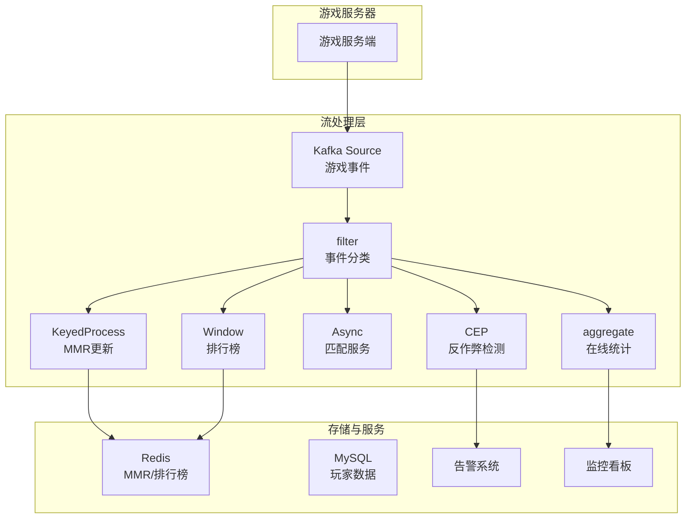
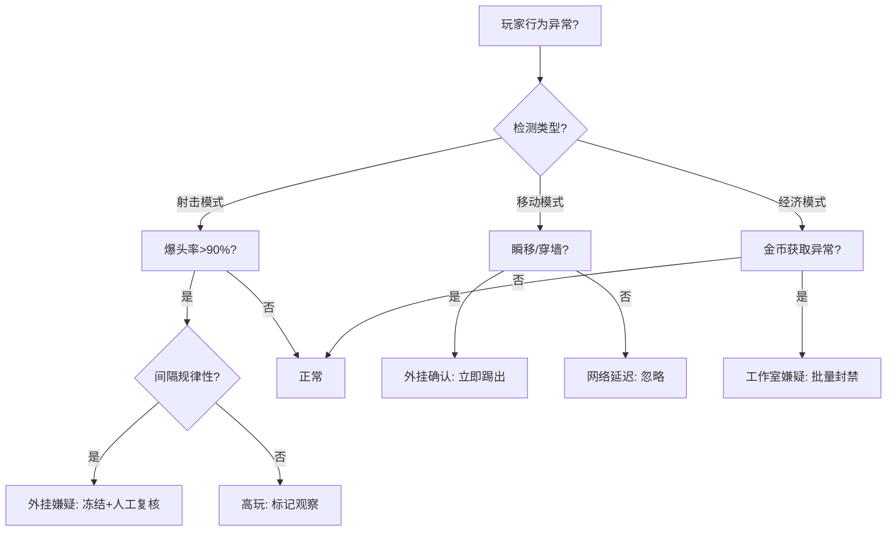

# 算子与实时游戏数据分析

> **所属阶段**: Knowledge/10-case-studies | **前置依赖**: [01.06-single-input-operators.md](../01-concept-atlas/operator-deep-dive/01.06-single-input-operators.md), [operator-ai-ml-integration.md](../06-frontier/operator-ai-ml-integration.md) | **形式化等级**: L3
> **文档定位**: 流处理算子在实时游戏数据分析中的算子指纹与Pipeline设计
> **版本**: 2026.04

---

## 目录

- [算子与实时游戏数据分析](#算子与实时游戏数据分析)
  - [目录](#目录)
  - [1. 概念定义 (Definitions)](#1-概念定义-definitions)
    - [Def-GAME-01-01: 游戏事件流（Game Event Stream）](#def-game-01-01-游戏事件流game-event-stream)
    - [Def-GAME-01-02: 玩家会话（Player Session）](#def-game-01-02-玩家会话player-session)
    - [Def-GAME-01-03: 实时匹配评分（Real-time Matchmaking Rating, MMR）](#def-game-01-03-实时匹配评分real-time-matchmaking-rating-mmr)
    - [Def-GAME-01-04: 反作弊检测窗口（Anti-Cheat Detection Window）](#def-game-01-04-反作弊检测窗口anti-cheat-detection-window)
    - [Def-GAME-01-05: 实时排行榜（Real-time Leaderboard）](#def-game-01-05-实时排行榜real-time-leaderboard)
  - [2. 属性推导 (Properties)](#2-属性推导-properties)
    - [Lemma-GAME-01-01: 游戏事件流的峰谷模式](#lemma-game-01-01-游戏事件流的峰谷模式)
    - [Lemma-GAME-01-02: MMR收敛性](#lemma-game-01-02-mmr收敛性)
    - [Prop-GAME-01-01: 反作弊检测的延迟-准确率权衡](#prop-game-01-01-反作弊检测的延迟-准确率权衡)
    - [Prop-GAME-01-02: 实时排行榜的增量更新复杂度](#prop-game-01-02-实时排行榜的增量更新复杂度)
  - [3. 关系建立 (Relations)](#3-关系建立-relations)
    - [3.1 游戏数据分析Pipeline算子映射](#31-游戏数据分析pipeline算子映射)
    - [3.2 算子指纹](#32-算子指纹)
    - [3.3 游戏事件与其他行业对比](#33-游戏事件与其他行业对比)
  - [4. 论证过程 (Argumentation)](#4-论证过程-argumentation)
    - [4.1 为什么游戏需要流处理而非批量分析](#41-为什么游戏需要流处理而非批量分析)
    - [4.2 匹配系统的流处理实现](#42-匹配系统的流处理实现)
    - [4.3 反作弊的实时 vs 离线检测](#43-反作弊的实时-vs-离线检测)
  - [5. 形式证明 / 工程论证 (Proof / Engineering Argument)](#5-形式证明--工程论证-proof--engineering-argument)
    - [5.1 实时MMR更新的流处理实现](#51-实时mmr更新的流处理实现)
    - [5.2 排行榜的增量Top-N维护](#52-排行榜的增量top-n维护)
    - [5.3 反作弊CEP模式示例](#53-反作弊cep模式示例)
  - [6. 实例验证 (Examples)](#6-实例验证-examples)
    - [6.1 实战：多人在线竞技游戏实时分析](#61-实战多人在线竞技游戏实时分析)
    - [6.2 实战：实时匹配系统](#62-实战实时匹配系统)
  - [7. 可视化 (Visualizations)](#7-可视化-visualizations)
    - [游戏数据分析Pipeline](#游戏数据分析pipeline)
    - [反作弊检测决策树](#反作弊检测决策树)
  - [8. 引用参考 (References)](#8-引用参考-references)

---

## 1. 概念定义 (Definitions)

### Def-GAME-01-01: 游戏事件流（Game Event Stream）

游戏事件流是玩家在游戏过程中产生的离散事件的时序序列：

$$\text{EventStream}_u = \{e_1, e_2, ..., e_n\}, \quad e_i = (\text{type}, \text{timestamp}, \text{payload})$$

事件类型包括：登录(LOGIN)、登出(LOGOUT)、匹配(MATCH)、击杀(KILL)、死亡(DEATH)、购买(PURCHASE)、聊天(CHAT)、举报(REPORT)等。

### Def-GAME-01-02: 玩家会话（Player Session）

玩家会话是从登录到登出的连续游戏时段：

$$\text{Session}_u = [t_{login}, t_{logout}]$$

会话特征：时长、活跃操作频率、行为模式序列。

### Def-GAME-01-03: 实时匹配评分（Real-time Matchmaking Rating, MMR）

MMR是衡量玩家技能水平的动态评分，基于对局结果实时更新：

$$\text{MMR}_{new} = \text{MMR}_{old} + K \cdot (S_{actual} - S_{expected})$$

其中 $K$ 为学习率，$S_{actual}$ 为实际结果（胜=1，负=0），$S_{expected} = \frac{1}{1 + 10^{(\text{MMR}_{opponent} - \text{MMR}_{self})/400}}$ 为预期胜率（Elo公式）。

### Def-GAME-01-04: 反作弊检测窗口（Anti-Cheat Detection Window）

反作弊检测窗口是用于分析可疑行为的时间范围：

$$W_{cheat} = \{e \in \text{EventStream} \mid t_{current} - \delta \leq t_e \leq t_{current}\}$$

其中 $\delta$ 为检测窗口大小（通常5分钟-1小时）。

### Def-GAME-01-05: 实时排行榜（Real-time Leaderboard）

实时排行榜是基于流处理持续更新的玩家排名视图：

$$\text{Leaderboard}_t = \text{sort}_{desc}(\{(u, \text{Score}_u(t)) \mid u \in \text{Players}\})$$

更新挑战：百万级玩家的分数每秒更新数千次，需高效维护Top-N排名。

---

## 2. 属性推导 (Properties)

### Lemma-GAME-01-01: 游戏事件流的峰谷模式

游戏事件流呈现明显的日周期峰谷：

$$\lambda(t) = \lambda_{base} + \lambda_{peak} \cdot \mathbb{1}_{[18:00, 24:00]}(t)$$

晚间（18:00-24:00）事件量通常为凌晨的5-10倍。

### Lemma-GAME-01-02: MMR收敛性

在Elo系统中，MMR的方差随对局次数增加而递减：

$$\text{Var}(\text{MMR}_n) \approx \frac{K^2 \cdot \sigma^2}{n}$$

其中 $\sigma^2$ 为结果方差，$n$ 为对局次数。

**推论**: 新玩家（$n$小）的MMR波动大，需更多对局才能稳定。

### Prop-GAME-01-01: 反作弊检测的延迟-准确率权衡

检测窗口 $\delta$ 与准确率 $A$ 的关系：

$$A(\delta) = 1 - e^{-\alpha \cdot \delta}$$

但延迟 $\mathcal{L} = \delta$。需根据作弊类型选择最优窗口：

- 外挂（Aimbot）：微小窗口即可检测（射击模式异常）
- 脚本（Macro）：中等窗口（重复操作模式）
- 工作室（Farming）：大窗口（长期行为分析）

### Prop-GAME-01-02: 实时排行榜的增量更新复杂度

维护Top-N排行榜的增量更新复杂度：

$$\mathcal{C}_{update} = O(\log N)$$

使用跳表或有序集合（Redis Sorted Set）可实现对数级更新。

---

## 3. 关系建立 (Relations)

### 3.1 游戏数据分析Pipeline算子映射

| 分析场景 | 算子组合 | 延迟要求 | 状态规模 |
|---------|---------|---------|---------|
| **实时MMR更新** | keyBy(playerId) → ProcessFunction | < 100ms | ValueState per player |
| **匹配推荐** | AsyncFunction → join | < 500ms | MapState (玩家队列) |
| **反作弊检测** | CEP / window + aggregate | < 1分钟 | WindowState |
| **排行榜更新** | keyBy → aggregate → Sink | < 1秒 | Top-N state |
| **付费预测** | window + ML推理 | < 5分钟 | Window features |
| **玩家留存预警** | Session window + pattern | < 1小时 | Session State |
| **实时广告插入** | AsyncFunction | < 50ms | 无状态 |

### 3.2 算子指纹

| 维度 | 游戏数据分析特征 |
|------|---------------|
| **核心算子** | KeyedProcessFunction（MMR/状态机）、CEP（反作弊）、AsyncFunction（匹配服务）、WindowAggregate（统计） |
| **状态类型** | ValueState（MMR、金币）、MapState（背包、好友）、ListState（近期对局） |
| **时间语义** | 处理时间为主（游戏内时间通常用服务器时间） |
| **数据特征** | 高并发（百万在线）、高频率（每秒数操作/玩家）、峰值明显 |
| **状态热点** | 热门玩家/排行榜Key（高频率更新） |
| **性能瓶颈** | 匹配算法（NP-hard近似）、排行榜排序 |

### 3.3 游戏事件与其他行业对比

| 维度 | 电商 | 金融 | 游戏 |
|------|------|------|------|
| **事件频率** | 中（浏览/购买） | 低（交易） | 极高（每秒多操作） |
| **状态复杂度** | 中 | 低 | 极高（多维游戏状态） |
| **实时性** | 秒级 | 毫秒级 | 毫秒-秒级 |
| **模式检测** | 简单 | 中等 | 复杂（行为序列） |
| **数据保留** | 长期 | 长期 | 短期（对局后衰减） |

---

## 4. 论证过程 (Argumentation)

### 4.1 为什么游戏需要流处理而非批量分析

**批量分析的问题**:

- 离线T+1报表无法支持实时运营决策
- 作弊行为发现时，损失已造成
- 玩家体验问题（如匹配不平衡）无法及时修复

**流处理的优势**:

- 实时MMR：对局结束立即更新评分
- 实时反作弊：异常行为秒级检测
- 实时运营：活动效果分钟级评估

### 4.2 匹配系统的流处理实现

**匹配问题**: 将N个等待玩家分配到M个对局，目标是最小化MMR方差和等待时间。

**流处理方案**:

1. 玩家点击"开始匹配" → 生成匹配请求事件
2. KeyedProcessFunction按游戏模式keyBy，维护匹配队列（MapState）
3. Timer触发匹配算法（每5秒执行一次）
4. 输出匹配结果到游戏服务器

**挑战**:

- 高段位玩家少，匹配等待时间长 → 逐步放宽MMR差值约束
- 组队匹配需保证队伍完整性 → 队伍作为整体进入匹配

### 4.3 反作弊的实时 vs 离线检测

| 维度 | 实时检测 | 离线检测 |
|------|---------|---------|
| **延迟** | < 1分钟 | 小时-天级 |
| **精度** | 中（有限上下文） | 高（全量历史） |
| **行动** | 临时冻结/降级匹配 | 永久封禁 |
| **算法** | 规则+简单统计 | 深度学习+图分析 |
| **误报代价** | 低（可快速解封） | 高（影响玩家体验） |

**推荐**: 实时检测用于初步筛查，离线检测用于最终定案。

---

## 5. 形式证明 / 工程论证 (Proof / Engineering Argument)

### 5.1 实时MMR更新的流处理实现

```java
public class MMRUpdateFunction extends KeyedProcessFunction<String, MatchResult, MMRUpdate> {
    private ValueState<Integer> mmrState;
    private ValueState<Integer> gamesPlayedState;
    private static final int K_BASE = 32;

    @Override
    public void open(Configuration parameters) {
        mmrState = getRuntimeContext().getState(new ValueStateDescriptor<>("mmr", Types.INT));
        gamesPlayedState = getRuntimeContext().getState(new ValueStateDescriptor<>("games", Types.INT));
    }

    @Override
    public void processElement(MatchResult result, Context ctx, Collector<MMRUpdate> out) throws Exception {
        int myMMR = mmrState.value() != null ? mmrState.value() : 1500;
        int games = gamesPlayedState.value() != null ? gamesPlayedState.value() : 0;

        // 动态K值：新玩家K大，老玩家K小
        int K = Math.max(16, K_BASE - games / 100);

        // Elo预期胜率
        double expected = 1.0 / (1.0 + Math.pow(10, (result.getOpponentMMR() - myMMR) / 400.0));

        // MMR更新
        int newMMR = myMMR + (int)(K * (result.getActualScore() - expected));
        mmrState.update(newMMR);
        gamesPlayedState.update(games + 1);

        out.collect(new MMRUpdate(result.getPlayerId(), myMMR, newMMR, ctx.timestamp()));
    }
}
```

### 5.2 排行榜的增量Top-N维护

**方案**: 使用Flink的ProcessFunction维护有序集合，仅当新分数进入Top-N时更新：

```java
public class TopNLeaderboard extends KeyedProcessFunction<String, ScoreEvent, LeaderboardUpdate> {
    private MapState<String, Integer> topNState;  // playerId → score
    private static final int N = 100;

    @Override
    public void processElement(ScoreEvent event, Context ctx, Collector<LeaderboardUpdate> out) throws Exception {
        // 获取当前Top-N最低分
        int minTopScore = getMinTopScore();

        if (event.getScore() > minTopScore || topNState.keys().hasNext() == false) {
            topNState.put(event.getPlayerId(), event.getScore());

            // 如果超过N个，移除最低分
            if (getTopNSize() > N) {
                removeLowestScore();
            }

            out.collect(new LeaderboardUpdate(getSortedTopN()));
        }
    }
}
```

**优化**: 对于百万级玩家，全量排序不可行。采用分层设计：

- 实时层：仅维护Top-100（内存）
- 近实时层：每5分钟计算Top-10000（RocksDB）
- 离线层：每小时全量排序

### 5.3 反作弊CEP模式示例

**外挂检测模式**：连续10次射击，爆头率100%且间隔时间相同。

```java
Pattern<ShootEvent, ?> aimbotPattern = Pattern
    .<ShootEvent>begin("shoots")
    .where(evt -> evt.getType().equals("SHOOT"))
    .timesOrMore(10)
    .within(Time.seconds(5))
    .followedBy("headshots")
    .where(new IterativeCondition<ShootEvent>() {
        @Override
        public boolean filter(ShootEvent event, Context<ShootEvent> ctx) {
            // 检查是否全部为爆头
            return event.isHeadshot();
        }
    });

// 附加条件：射击间隔标准差极小（机械规律性）
aimbotPattern.subtype(ShootEvent.class)
    .where(new IterativeCondition<ShootEvent>() {
        @Override
        public boolean filter(ShootEvent event, Context<ShootEvent> ctx) {
            // 获取窗口内所有射击事件
            List<ShootEvent> events = ctx.getEventsForPattern("shoots");
            double stdDev = calculateIntervalStdDev(events);
            return stdDev < 0.01;  // 间隔几乎相同
        }
    });
```

---

## 6. 实例验证 (Examples)

### 6.1 实战：多人在线竞技游戏实时分析

```java
// 1. 游戏事件摄入
DataStream<GameEvent> events = env.addSource(new KafkaSource<>("game-events"));

// 2. 实时MMR更新
events.filter(e -> e.getType().equals("MATCH_END"))
    .map(e -> (MatchResult)e)
    .keyBy(MatchResult::getPlayerId)
    .process(new MMRUpdateFunction())
    .addSink(new MMRStoreSink());

// 3. 反作弊检测
events.filter(e -> e.getType().equals("SHOOT"))
    .map(e -> (ShootEvent)e)
    .keyBy(ShootEvent::getPlayerId)
    .pattern(aimbotPattern)
    .process(new PatternHandler())
    .addSink(new CheatAlertSink());

// 4. 实时排行榜（5秒窗口）
events.filter(e -> e.getType().equals("SCORE"))
    .map(e -> (ScoreEvent)e)
    .keyBy(ScoreEvent::getGameMode)
    .window(TumblingProcessingTimeWindows.of(Time.seconds(5)))
    .aggregate(new Top100Aggregate())
    .addSink(new LeaderboardSink());

// 5. 玩家在线统计
events.filter(e -> e.getType().equals("LOGIN") || e.getType().equals("LOGOUT"))
    .keyBy(GameEvent::getServerId)
    .process(new OnlineCountFunction())
    .addSink(new MetricsSink());
```

### 6.2 实战：实时匹配系统

```java
// 匹配请求流
DataStream<MatchRequest> requests = env.addSource(new KafkaSource<>("match-requests"));

// 匹配引擎
requests.keyBy(MatchRequest::getGameMode)
    .process(new KeyedProcessFunction<String, MatchRequest, MatchResult>() {
        private MapState<String, MatchRequest> queueState;

        @Override
        public void open(Configuration parameters) {
            queueState = getRuntimeContext().getMapState(
                new MapStateDescriptor<>("queue", Types.STRING, Types.POJO(MatchRequest.class))
            );
            // 每5秒触发匹配
            ctx.timerService().registerProcessingTimeTimer(ctx.timerService().currentProcessingTime() + 5000);
        }

        @Override
        public void processElement(MatchRequest req, Context ctx, Collector<MatchResult> out) {
            queueState.put(req.getPlayerId(), req);
        }

        @Override
        public void onTimer(long timestamp, OnTimerContext ctx, Collector<MatchResult> out) {
            List<MatchRequest> queue = new ArrayList<>();
            queueState.values().forEach(queue::add);

            // 按MMR排序，尽量匹配相近玩家
            queue.sort(Comparator.comparingInt(MatchRequest::getMmr));

            // 每10人一组匹配
            for (int i = 0; i + 9 < queue.size(); i += 10) {
                List<MatchRequest> team = queue.subList(i, i + 10);
                out.collect(new MatchResult(team));
                team.forEach(p -> {
                    try { queueState.remove(p.getPlayerId()); } catch (Exception e) {}
                });
            }

            // 注册下一个Timer
            ctx.timerService().registerProcessingTimeTimer(timestamp + 5000);
        }
    });
```

---

## 7. 可视化 (Visualizations)

### 游戏数据分析Pipeline



### 反作弊检测决策树



---

## 8. 引用参考 (References)


---

*关联文档*: [01.06-single-input-operators.md](../01-concept-atlas/operator-deep-dive/01.06-single-input-operators.md) | [operator-ai-ml-integration.md](../06-frontier/operator-ai-ml-integration.md) | [operator-chaos-engineering-and-resilience.md](../07-best-practices/operator-chaos-engineering-and-resilience.md)
