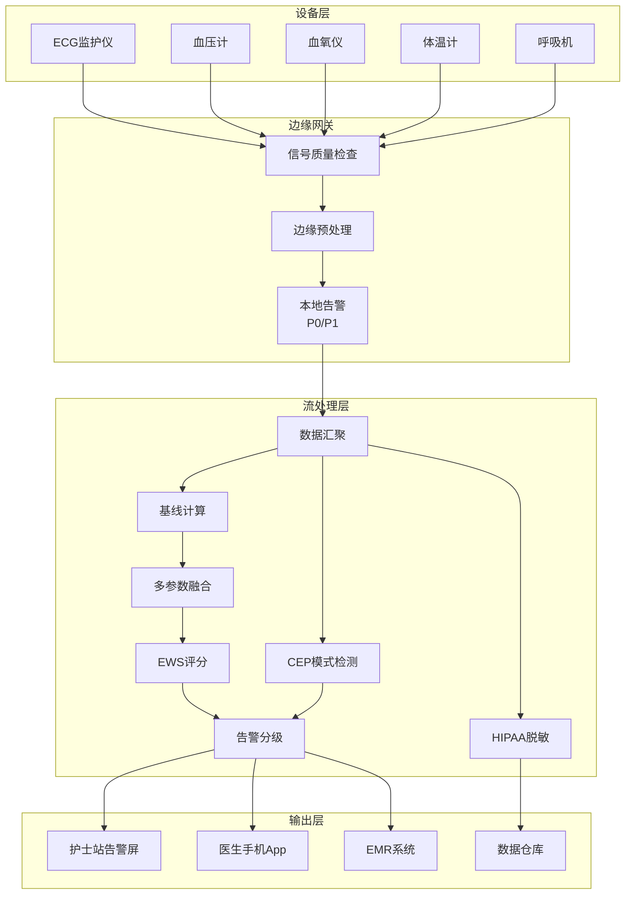
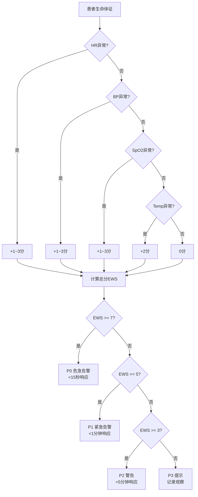

# 算子与实时医疗监测

> **所属阶段**: Knowledge/10-case-studies | **前置依赖**: [01.10-process-and-async-operators.md](../01-concept-atlas/operator-deep-dive/01.10-process-and-async-operators.md), [operator-edge-computing-integration.md](../06-frontier/operator-edge-computing-integration.md) | **形式化等级**: L3
> **文档定位**: 流处理算子在实时患者监测与医疗告警系统中的算子指纹与Pipeline设计
> **版本**: 2026.04

---

## 目录

- [算子与实时医疗监测](#算子与实时医疗监测)
  - [目录](#目录)
  - [1. 概念定义 (Definitions)](#1-概念定义-definitions)
    - [Def-MED-01-01: 医疗物联网（IoMT - Internet of Medical Things）](#def-med-01-01-医疗物联网iomt---internet-of-medical-things)
    - [Def-MED-01-02: 生命体征数据流（Vital Signs Stream）](#def-med-01-02-生命体征数据流vital-signs-stream)
    - [Def-MED-01-03: 早期预警评分（Early Warning Score, EWS）](#def-med-01-03-早期预警评分early-warning-score-ews)
    - [Def-MED-01-04: 临床告警分级（Clinical Alert Triage）](#def-med-01-04-临床告警分级clinical-alert-triage)
    - [Def-MED-01-05: HIPAA/GDPR合规数据流](#def-med-01-05-hipaagdpr合规数据流)
  - [2. 属性推导 (Properties)](#2-属性推导-properties)
    - [Lemma-MED-01-01: 医疗数据采样频率与精度的关系](#lemma-med-01-01-医疗数据采样频率与精度的关系)
    - [Lemma-MED-01-02: 假阳性告警与护士疲劳](#lemma-med-01-02-假阳性告警与护士疲劳)
    - [Prop-MED-01-01: 多参数融合的优势](#prop-med-01-01-多参数融合的优势)
    - [Prop-MED-01-02: 边缘计算的延迟优势](#prop-med-01-02-边缘计算的延迟优势)
  - [3. 关系建立 (Relations)](#3-关系建立-relations)
    - [3.1 医疗监测Pipeline算子映射](#31-医疗监测pipeline算子映射)
    - [3.2 算子指纹](#32-算子指纹)
    - [3.3 医疗与其他行业对比](#33-医疗与其他行业对比)
  - [4. 论证过程 (Argumentation)](#4-论证过程-argumentation)
    - [4.1 为什么医疗监测不能用传统批处理](#41-为什么医疗监测不能用传统批处理)
    - [4.2 假阳性问题的工程解决](#42-假阳性问题的工程解决)
    - [4.3 边缘-云协同的医疗架构](#43-边缘-云协同的医疗架构)
  - [5. 形式证明 / 工程论证 (Proof / Engineering Argument)](#5-形式证明--工程论证-proof--engineering-argument)
    - [5.1 动态EWS评分算法](#51-动态ews评分算法)
    - [5.2 室颤检测的CEP模式](#52-室颤检测的cep模式)
    - [5.3 数据隐私保护的算子级实现](#53-数据隐私保护的算子级实现)
  - [6. 实例验证 (Examples)](#6-实例验证-examples)
    - [6.1 实战：ICU实时监测系统](#61-实战icu实时监测系统)
    - [6.2 实战：远程患者监护（居家）](#62-实战远程患者监护居家)
  - [7. 可视化 (Visualizations)](#7-可视化-visualizations)
    - [医疗监测Pipeline架构](#医疗监测pipeline架构)
    - [EWS评分与告警分级](#ews评分与告警分级)
  - [8. 引用参考 (References)](#8-引用参考-references)

---

## 1. 概念定义 (Definitions)

### Def-MED-01-01: 医疗物联网（IoMT - Internet of Medical Things）

IoMT是将医疗设备通过物联网技术连接，实时采集和传输患者生理数据的系统：

$$\text{IoMT} = (\text{Sensors}, \text{Gateways}, \text{Stream Platform}, \text{Clinical Decision Support})$$

典型设备：心电监护仪（ECG）、血压计（NIBP）、血氧仪（SpO2）、体温计、呼吸机、输液泵。

### Def-MED-01-02: 生命体征数据流（Vital Signs Stream）

生命体征数据流是患者生理参数的时间序列：

$$\text{Vitals}_p(t) = (\text{HR}(t), \text{BP}_{sys}(t), \text{BP}_{dia}(t), \text{SpO2}(t), \text{Temp}(t), \text{RR}(t))$$

其中 HR 为心率，BP 为血压，SpO2 为血氧饱和度，Temp 为体温，RR 为呼吸频率。

### Def-MED-01-03: 早期预警评分（Early Warning Score, EWS）

EWS是基于多项生命体征偏离正常范围的加权评分系统：

$$\text{EWS}_p = \sum_{i} w_i \cdot \text{deviation}(v_i, v_i^{normal})$$

当 $\text{EWS}_p > \text{Threshold}$ 时，触发临床干预。

### Def-MED-01-04: 临床告警分级（Clinical Alert Triage）

临床告警按紧急程度分为四级：

| 级别 | 名称 | 响应时间 | 示例 |
|------|------|---------|------|
| **P0** | 危急 | < 15秒 | 心脏骤停、室颤 |
| **P1** | 紧急 | < 1分钟 | 严重低血压、SpO2 < 85% |
| **P2** | 警告 | < 5分钟 | 心率异常趋势、发热 |
| **P3** | 提示 | < 30分钟 | 设备离线、信号质量差 |

### Def-MED-01-05: HIPAA/GDPR合规数据流

医疗数据流处理需满足隐私法规：

- **数据最小化**: 仅处理临床必需的数据字段
- **访问控制**: 算子级权限控制（谁可以访问哪些患者数据）
- **审计日志**: 所有数据访问操作可追踪
- **数据保留期**: 自动过期删除（如研究数据保留7年）

---

## 2. 属性推导 (Properties)

### Lemma-MED-01-01: 医疗数据采样频率与精度的关系

生命体征的采样频率 $f$ 与临床诊断精度 $P$ 满足：

$$P(f) = 1 - e^{-\beta f}$$

但过高频率导致数据量爆炸。推荐频率：

- ECG: 250-500Hz（需波形细节）
- SpO2: 1Hz
- 血压: 1-5分钟/次（无创）或连续（有创）
- 体温: 1-5分钟/次

### Lemma-MED-01-02: 假阳性告警与护士疲劳

假阳性率 $FPR$ 与临床响应遵从率 $C$ 呈负相关：

$$C = C_{max} \cdot (1 - FPR)^{\gamma}$$

其中 $\gamma$ 为疲劳系数（通常 2-3）。

**工程意义**: FPR > 50% 时，护士可能忽略真正危急的告警（"狼来了"效应）。

### Prop-MED-01-01: 多参数融合的优势

单一参数的灵敏度 $Sens_1$ 和特异度 $Spec_1$ 有限，多参数融合可提升：

$$Sens_{fusion} = 1 - \prod_{i}(1 - Sens_i)$$

$$Spec_{fusion} = \prod_{i} Spec_i$$

**权衡**: 灵敏度提升但特异度下降，需通过阈值调优平衡。

### Prop-MED-01-02: 边缘计算的延迟优势

对于P0级告警（心脏骤停），边缘处理 vs 云端处理的延迟差异：

$$\Delta \mathcal{L} = \mathcal{L}_{cloud} - \mathcal{L}_{edge} = 50-200ms$$

**关键**: 心脏骤停检测需在 5-10 秒内响应，边缘处理为必需。

---

## 3. 关系建立 (Relations)

### 3.1 医疗监测Pipeline算子映射

| 处理阶段 | 算子 | 输入 | 输出 | 延迟要求 |
|---------|------|------|------|---------|
| **设备数据摄入** | Source | MQTT/HL7 FHIR | 原始波形/数值 | < 1s |
| **信号质量检查** | filter | 原始信号 | 质量合格信号 | < 100ms |
| **基线提取** | window+aggregate | 信号窗口 | 基线值 | < 1s |
| **异常检测** | ProcessFunction/CEP | 当前值+基线 | 异常事件 | < 500ms |
| **多参数融合** | keyBy+aggregate | 多路异常 | 综合评分 | < 1s |
| **告警分级** | map | 综合评分 | 分级告警 | < 100ms |
| **告警分发** | AsyncFunction | 告警 | 护士站/手机 | < 1s |
| **数据持久化** | Sink | 原始+处理数据 | 数据仓库 | 异步 |

### 3.2 算子指纹

| 维度 | 医疗监测特征 |
|------|-------------|
| **核心算子** | ProcessFunction（状态机：患者状态跟踪）、window+aggregate（基线计算）、CEP（模式检测：如室颤波形） |
| **状态类型** | ValueState（当前EWS评分）、ListState（近期波形片段）、MapState（患者基线） |
| **时间语义** | 处理时间为主（临床决策需即时响应） |
| **数据特征** | 多参数异构（波形+数值+报警）、高频（ECG 250Hz）、峰值波动大（急救时段） |
| **状态热点** | 危重患者key（高频率更新） |
| **性能瓶颈** | 波形模式识别（需ML推理）、多参数融合计算 |

### 3.3 医疗与其他行业对比

| 维度 | 金融风控 | RTB广告 | 游戏 | 医疗监测 |
|------|---------|---------|------|---------|
| **延迟要求** | < 50ms | < 100ms | 毫秒-秒 | < 1s（P0 < 15s） |
| **正确性** | 高 | 中 | 中 | **极高**（生命攸关） |
| **数据敏感度** | 高 | 中 | 低 | **极高**（隐私法规） |
| **容错要求** | 高 | 中 | 低 | **极高**（不能漏告警） |
| **状态复杂度** | 中 | 中 | 极高 | 高（多参数+波形） |

---

## 4. 论证过程 (Argumentation)

### 4.1 为什么医疗监测不能用传统批处理

传统医院信息系统（HIS）的问题：

- 护士每1-4小时手动记录一次生命体征
- 危急变化可能发生在两次记录之间
- retrospective 分析无法挽救生命

流处理的优势：

- 连续监测：每秒更新生命体征
- 即时告警：异常在秒级内被检测
- 趋势预测：基于历史数据预测病情恶化

### 4.2 假阳性问题的工程解决

**问题**: 传统监护仪假阳性率高达 85-90%，导致护士 fatigue。

**解决方案**:

1. **动态阈值**: 根据患者基线个性化调整阈值（而非固定值）
2. **多参数确认**: 单一参数异常不触发告警，需2+参数同时异常
3. **趋势分析**: 瞬时值异常不告警，需持续异常30秒以上
4. **智能抑制**: 已知干扰场景（如患者移动）自动抑制告警

### 4.3 边缘-云协同的医疗架构

**边缘层（病房/ICU）**:

- 原始信号采集和预处理
- P0/P1级告警实时检测和响应
- 患者隐私数据不出本地

**云层（医院数据中心）**:

- 长期数据存储和分析
- 跨患者流行病监测
- 机器学习模型训练

**协同点**:

- 边缘负责实时性，云负责深度分析
- 模型从云端下发到边缘设备
- 异常事件从边缘上报到云端归档

---

## 5. 形式证明 / 工程论证 (Proof / Engineering Argument)

### 5.1 动态EWS评分算法

```java
public class EWSCalculator extends KeyedProcessFunction<String, VitalSigns, EWSAlert> {
    private MapState<String, Double> baselineState;
    private ValueState<Long> lastAlertTime;

    @Override
    public void processElement(VitalSigns vitals, Context ctx, Collector<EWSAlert> out) throws Exception {
        double ews = 0;

        // 心率评分
        double hrBaseline = baselineState.get("HR");
        if (Math.abs(vitals.getHR() - hrBaseline) > 30) ews += 3;
        else if (Math.abs(vitals.getHR() - hrBaseline) > 15) ews += 1;

        // 收缩压评分
        double sysBaseline = baselineState.get("SYS_BP");
        if (Math.abs(vitals.getSysBP() - sysBaseline) > 40) ews += 3;
        else if (Math.abs(vitals.getSysBP() - sysBaseline) > 20) ews += 1;

        // SpO2评分
        if (vitals.getSpO2() < 85) ews += 3;
        else if (vitals.getSpO2() < 90) ews += 2;
        else if (vitals.getSpO2() < 95) ews += 1;

        // 体温评分
        if (vitals.getTemp() > 39.0 || vitals.getTemp() < 35.0) ews += 2;

        // 告警分级
        String level;
        if (ews >= 7) level = "P0";
        else if (ews >= 5) level = "P1";
        else if (ews >= 3) level = "P2";
        else level = "P3";

        // 抑制重复告警（同一级别1分钟内只告警一次）
        Long lastAlert = lastAlertTime.value();
        if (lastAlert == null || ctx.timestamp() - lastAlert > 60000 || !level.equals(prevLevel)) {
            out.collect(new EWSAlert(vitals.getPatientId(), ews, level, ctx.timestamp()));
            lastAlertTime.update(ctx.timestamp());
        }
    }
}
```

### 5.2 室颤检测的CEP模式

室颤（Ventricular Fibrillation）ECG特征：

- 频率：150-500次/分钟
- 波形：不规则、无明确QRS复合波

```java
Pattern<ECGSample, ?> vfPattern = Pattern
    .<ECGSample>begin("irregular_rhythm")
    .where(new IterativeCondition<ECGSample>() {
        @Override
        public boolean filter(ECGSample sample, Context<ECGSample> ctx) {
            // R-R间期不规则（变异系数>0.2）
            List<ECGSample> recent = ctx.getEventsForPattern("irregular_rhythm");
            if (recent.size() < 5) return true;  // 积累足够样本
            return calculateRRIrregularity(recent) > 0.2;
        }
    })
    .timesOrMore(10)  // 持续10个周期
    .where(new IterativeCondition<ECGSample>() {
        @Override
        public boolean filter(ECGSample sample, Context<ECGSample> ctx) {
            // 心率在150-500bpm范围
            double hr = 60000.0 / sample.getRrInterval();
            return hr >= 150 && hr <= 500;
        }
    })
    .within(Time.seconds(5));
```

### 5.3 数据隐私保护的算子级实现

**HIPAA合规的字段级脱敏**:

```java
public class HIPAACompliantMapper extends RichMapFunction<PatientData, AnonymizedData> {
    private transient FieldEncryption encryptor;

    @Override
    public AnonymizedData map(PatientData data) {
        return AnonymizedData.builder()
            // 直接标识符：加密
            .patientId(encryptor.encrypt(data.getPatientId()))
            .name(encryptor.encrypt(data.getName()))
            .ssn(encryptor.encrypt(data.getSsn()))
            // 准标识符：泛化
            .ageRange(generalizeAge(data.getAge()))  // 25 → 20-30
            .zipPrefix(data.getZipCode().substring(0, 3))  // 12345 → 123**
            // 临床数据：保留
            .heartRate(data.getHeartRate())
            .bloodPressure(data.getBloodPressure())
            .build();
    }
}
```

---

## 6. 实例验证 (Examples)

### 6.1 实战：ICU实时监测系统

```java
// 1. 多设备数据摄入
DataStream<VitalSigns> vitals = env.addSource(new MQTTSource("hospital/icu/+/vitals"));

// 2. 信号质量过滤
DataStream<VitalSigns> qualityVitals = vitals
    .filter(v -> v.getSignalQuality() > 0.7);  // 质量>70%才处理

// 3. 基线更新（滑动窗口，每小时更新一次基线）
qualityVitals.keyBy(VitalSigns::getPatientId)
    .window(SlidingEventTimeWindows.of(Time.hours(1), Time.minutes(10)))
    .aggregate(new BaselineAggregate())
    .addSink(new BaselineStoreSink());

// 4. EWS评分与告警
qualityVitals.keyBy(VitalSigns::getPatientId)
    .process(new EWSCalculator())
    .addSink(new AlertNotificationSink());

// 5. 室颤检测（ECG波形）
qualityVitals.filter(v -> v.getType().equals("ECG"))
    .map(v -> (ECGSample)v)
    .keyBy(ECGSample::getPatientId)
    .pattern(vfPattern)
    .process(new VFAlertHandler())
    .addSink(new CriticalAlertSink());

// 6. 数据持久化（异步，不影响实时告警）
qualityVitals.addSink(new HIPAACompliantSink("s3://hospital-data/"));
```

### 6.2 实战：远程患者监护（居家）

**场景**: 慢性病患者居家佩戴可穿戴设备，数据实时上传到云端监护中心。

**边缘层（患者手机/网关）**:

```java
// 边缘预处理：异常检测+降采样
 wearableData.map(new EdgePreprocess())  // 过滤运动伪影
    .filter(v -> v.isAnomaly())  // 仅上传异常数据
    .windowAll(TumblingProcessingTimeWindows.of(Time.minutes(5)))  // 批量上传
    .aggregate(new BatchUploadAggregate())
    .addSink(new HTTPSink("https://hospital-cloud/api/vitals"));
```

**云层（监护中心）**:

```java
// 接收多个患者的批量数据
DataStream<BatchVitals> batches = env.addSource(new HTTPSource(8080));

// 医生看板：实时患者状态
batches.flatMap(new FlatMapFunction<BatchVitals, PatientStatus>() {
    @Override
    public void flatMap(BatchVitals batch, Collector<PatientStatus> out) {
        for (VitalSigns v : batch.getVitals()) {
            out.collect(new PatientStatus(v.getPatientId(), calculateEWS(v)));
        }
    }
})
.keyBy(PatientStatus::getPatientId)
    .window(TumblingProcessingTimeWindows.of(Time.seconds(10)))
    .aggregate(new DashboardAggregate())
    .addSink(new WebSocketSink());  // 实时推送到医生工作站
```

---

## 7. 可视化 (Visualizations)

### 医疗监测Pipeline架构



### EWS评分与告警分级



---

## 8. 引用参考 (References)


---

*关联文档*: [01.10-process-and-async-operators.md](../01-concept-atlas/operator-deep-dive/01.10-process-and-async-operators.md) | [operator-edge-computing-integration.md](../06-frontier/operator-edge-computing-integration.md) | [operator-security-and-permission-model.md](../08-standards/operator-security-and-permission-model.md)
