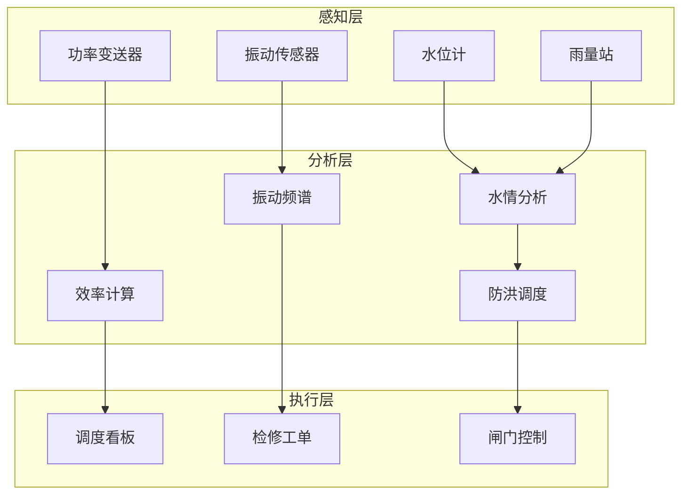

# 算子与实时水电站监测

> **所属阶段**: Knowledge/10-case-studies | **前置依赖**: [01.06-single-input-operators.md](../01-concept-atlas/operator-deep-dive/01.06-single-input-operators.md), [operator-energy-grid-monitoring.md](../06-frontier/operator-energy-grid-monitoring.md) | **形式化等级**: L3
> **文档定位**: 流处理算子在实时水电站运行监测、防洪调度与设备健康诊断中的算子指纹与Pipeline设计
> **版本**: 2026.04

---

## 目录

- [1. 概念定义 (Definitions)](#1-概念定义-definitions)
- [2. 属性推导 (Properties)](#2-属性推导-properties)
- [3. 关系建立 (Relations)](#3-关系建立-relations)
- [4. 论证过程 (Argumentation)](#4-论证过程-argumentation)
- [5. 形式证明 / 工程论证 (Proof / Engineering Argument)](#5-形式证明--工程论证-proof--engineering-argument)
- [6. 实例验证 (Examples)](#6-实例验证-examples)
- [7. 可视化 (Visualizations)](#7-可视化-visualizations)
- [8. 引用参考 (References)](#8-引用参考-references)

---

## 1. 概念定义 (Definitions)

### Def-HYD-01-01: 水电站实时监测系统（Hydropower Real-time Monitoring）

水电站实时监测系统是对水工建筑、机电设备和运行工况的全面监控：

$$\text{HydroMonitor} = (\text{Dam}_t, \text{Turbine}_t, \text{Generator}_t, \text{Transformer}_t, \text{WaterSystem}_t)$$

### Def-HYD-01-02: 水库调度图（Reservoir Operation Chart）

水库调度图是指导水库运行的分区规则：

$$\text{Zone}(V_t, Q_{in,t}) \in \{\text{Normal}, \text{FloodControl}, \text{Conservation}, \text{Dead}\}$$

### Def-HYD-01-03: 机组振动烈度（Vibration Severity）

机组振动烈度是衡量旋转机械运行状态的综合指标：

$$V_s = \sqrt{\sum_{i} (a_i \cdot w_i)^2}$$

其中 $a_i$ 为第 $i$ 频段振动加速度，$w_i$ 为权重。ISO 10816标准：$V_s < 2.8$ mm/s为优，$2.8-7.1$ 为良，$> 7.1$ 为异常。

### Def-HYD-01-04: 水轮机效率（Turbine Efficiency）

$$\eta = \frac{P_{out}}{\rho g Q H}$$

其中 $P_{out}$ 为输出功率，$Q$ 为流量，$H$ 为水头。

### Def-HYD-01-05: 防洪限制水位（Flood Control Level）

防洪限制水位是汛期允许的最高蓄水位：

$$Z_{flood} = Z_{normal} - \Delta Z_{safety}$$

---

## 2. 属性推导 (Properties)

### Lemma-HYD-01-01: 水库水量平衡

$$\frac{dV}{dt} = Q_{in} - Q_{out} - Q_{loss}$$

**证明**: 连续性方程直接推导。∎

### Lemma-HYD-01-02: 水轮机相似定律

$$\frac{Q_1}{Q_2} = \left(\frac{D_1}{D_2}\right)^3 \cdot \frac{n_1}{n_2}, \quad \frac{H_1}{H_2} = \left(\frac{D_1}{D_2}\right)^2 \cdot \left(\frac{n_1}{n_2}\right)^2$$

### Prop-HYD-01-01: 振动频谱的特征频率

| 故障类型 | 特征频率 | 判断依据 |
|---------|---------|---------|
| 不平衡 | 1×转频 | 1×幅值占主导 |
| 不对中 | 2×转频 | 2×幅值显著 |
| 油膜涡动 | 0.42-0.48×转频 | 半频成分 |
| 叶片通过 | 叶片数×转频 | 高频周期性 |

### Prop-HYD-01-02: 水位-发电量关系

$$P = \eta \cdot \rho g \cdot Q \cdot (Z_{up} - Z_{down})$$

---

## 3. 关系建立 (Relations)

### 3.1 水电站监测Pipeline算子映射

| 应用场景 | 算子组合 | 数据源 | 延迟要求 |
|---------|---------|--------|---------|
| **水情监测** | Source + map | 水位/雨量传感器 | < 1min |
| **振动分析** | AsyncFunction + window | 加速度传感器 | < 5min |
| **效率计算** | map | 流量/功率 | < 1min |
| **防洪调度** | Broadcast + ProcessFunction | 调度指令 | < 10min |
| **设备诊断** | Async ML | 多传感器 | < 15min |

### 3.2 算子指纹

| 维度 | 水电站监测特征 |
|------|------------|
| **核心算子** | ProcessFunction（设备状态机）、AsyncFunction（频谱分析）、BroadcastProcessFunction（调度指令）、window+aggregate（统计） |
| **状态类型** | ValueState（设备健康指数）、MapState（传感器校准）、BroadcastState（调度规则） |
| **时间语义** | 事件时间（传感器时间戳） |
| **数据特征** | 周期性（日夜/季节）、空间相关（上下游）、强因果性 |
| **状态规模** | 按机组分Key，大型水电站可达数十机组 |
| **性能瓶颈** | 频谱分析计算、外部气象API |

---

## 4. 论证过程 (Argumentation)

### 4.1 为什么水电站需要流处理而非传统SCADA

传统SCADA的问题：
- 秒级刷新：无法捕捉高频振动信号
- 人工判读：故障发现滞后
- 离线分析：健康趋势无法实时跟踪

流处理的优势：
- 毫秒级采样：高频振动实时分析
- 自动诊断：AI模型实时识别故障模式
- 预测维护：基于趋势提前安排检修

### 4.2 防洪调度的实时决策

**场景**: 上游暴雨，入库流量激增。

**流处理方案**:
1. 实时雨情 → 洪水预报模型 → 入库流量预测
2. 当前库容 → 防洪限制水位对比 → 泄洪决策
3. 下游安全 → 流量控制 → 闸门自动调节

### 4.3 机组振动的早期预警

**问题**: 水轮机转轮裂纹初期振动变化微小，人工难以发现。

**方案**: 流处理实时频谱分析 → 特征频率能量变化检测 → 趋势预警。

---

## 5. 形式证明 / 工程论证 (Proof / Engineering Argument)

### 5.1 实时振动监测

```java
// 振动传感器流
DataStream<VibrationData> vibration = env.addSource(new AccelerometerSource());

// 频谱分析
vibration.keyBy(VibrationData::getUnitId)
    .window(TumblingProcessingTimeWindows.of(Time.minutes(5)))
    .process(new ProcessFunction<Iterable<VibrationData>, VibrationSpectrum>() {
        @Override
        public void process(Iterable<VibrationData> values, Context ctx, Collector<VibrationSpectrum> out) {
            List<Double> samples = new ArrayList<>();
            values.forEach(v -> samples.add(v.getAcceleration()));
            
            // FFT频谱分析
            Complex[] fftResult = FFT.fft(samples.stream().mapToDouble(Double::doubleValue).toArray());
            
            double[] magnitudes = new double[fftResult.length / 2];
            for (int i = 0; i < magnitudes.length; i++) {
                magnitudes[i] = fftResult[i].abs();
            }
            
            // 提取特征频率
            double rotationFreq = 50.0 / 60.0;  // 50Hz = 3000rpm
            double[] featureFreqs = {1, 2, 0.45};
            
            Map<String, Double> features = new HashMap<>();
            for (double f : featureFreqs) {
                int idx = (int)(f * rotationFreq * samples.size() / 200.0);
                features.put(f + "x", magnitudes[idx]);
            }
            
            out.collect(new VibrationSpectrum(ctx.getCurrentKey(), features, ctx.timestamp()));
        }
    })
    .addSink(new DiagnosticSink());
```

### 5.2 水库防洪调度

```java
// 入库流量流
DataStream<InflowData> inflow = env.addSource(new HydrologicalSource());

// 实时调度决策
inflow.keyBy(InflowData::getReservoirId)
    .connect(dispatchRulesBroadcast)
    .process(new BroadcastProcessFunction<InflowData, DispatchRule, FloodControlCommand>() {
        @Override
        public void processElement(InflowData data, ReadOnlyContext ctx, Collector<FloodControlCommand> out) {
            ReadOnlyBroadcastState<String, DispatchRule> rules = ctx.getBroadcastState(RULE_DESCRIPTOR);
            DispatchRule rule = rules.get(data.getReservoirId());
            
            if (rule == null) return;
            
            // 计算当前库容状态
            double currentLevel = data.getCurrentLevel();
            double floodLimit = rule.getFloodControlLevel();
            double inflowRate = data.getInflowRate();
            
            if (currentLevel > floodLimit && inflowRate > rule.getMaxInflow()) {
                double releaseRate = calculateRelease(currentLevel, floodLimit, inflowRate);
                out.collect(new FloodControlCommand(data.getReservoirId(), releaseRate, "FLOOD_RELEASE", ctx.timestamp()));
            }
        }
        
        @Override
        public void processBroadcastElement(DispatchRule rule, Context ctx, Collector<FloodControlCommand> out) {
            ctx.getBroadcastState(RULE_DESCRIPTOR).put(rule.getReservoirId(), rule);
        }
    })
    .addSink(new GateControlSink());
```

---

## 6. 实例验证 (Examples)

### 6.1 实战：大型水电站智能监测

```java
// 1. 多传感器数据接入
DataStream<VibrationData> vibration = env.addSource(new AccelerometerSource());
DataStream<InflowData> inflow = env.addSource(new HydrologicalSource());
DataStream<PowerData> power = env.addSource(new GeneratorSource());

// 2. 振动诊断
vibration.keyBy(VibrationData::getUnitId)
    .window(TumblingProcessingTimeWindows.of(Time.minutes(5)))
    .process(new VibrationDiagnosticFunction())
    .addSink(new MaintenanceAlertSink());

// 3. 效率监测
power.connect(inflow.keyBy(InflowData::getReservoirId))
    .process(new CoProcessFunction<PowerData, InflowData, EfficiencyReport>() {
        private ValueState<InflowData> lastInflow;
        
        @Override
        public void processElement1(PowerData p, Context ctx, Collector<EfficiencyReport> out) {
            InflowData inf = lastInflow.value();
            if (inf == null) return;
            
            double efficiency = p.getPower() / (9.81 * inf.getFlowRate() * inf.getHead());
            out.collect(new EfficiencyReport(p.getUnitId(), efficiency, ctx.timestamp()));
        }
        
        @Override
        public void processElement2(InflowData inf, Context ctx, Collector<EfficiencyReport> out) {
            lastInflow.update(inf);
        }
    })
    .addSink(new EfficiencyDashboardSink());

// 4. 防洪调度
inflow.connect(dispatchRulesBroadcast)
    .process(new FloodControlFunction())
    .addSink(new GateControlSink());
```

---

## 7. 可视化 (Visualizations)

### 水电站监测Pipeline



---

## 8. 引用参考 (References)

[^1]: IEC, "Technical Specifications for Hydropower Plant Monitoring", https://www.iec.ch/

[^2]: China Institute of Water Resources, "Hydropower Station Operation Standards", 2023.

[^3]: ISO, "10816 Mechanical Vibration - Evaluation of Machine Vibration", https://www.iso.org/

[^4]: Wikipedia, "Hydroelectricity", https://en.wikipedia.org/wiki/Hydroelectricity

[^5]: Wikipedia, "Dam Safety", https://en.wikipedia.org/wiki/Dam_safety

---

*关联文档*: [01.06-single-input-operators.md](../01-concept-atlas/operator-deep-dive/01.06-single-input-operators.md) | [operator-energy-grid-monitoring.md](../06-frontier/operator-energy-grid-monitoring.md) | [realtime-energy-trading-case-study.md](../10-case-studies/realtime-energy-trading-case-study.md)
