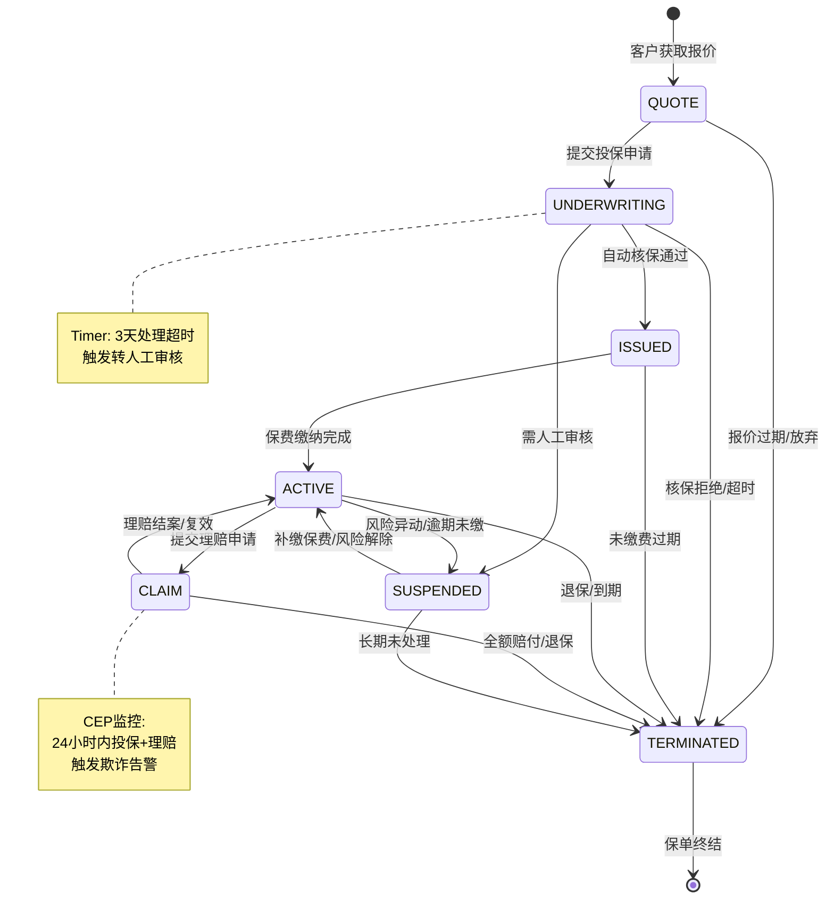
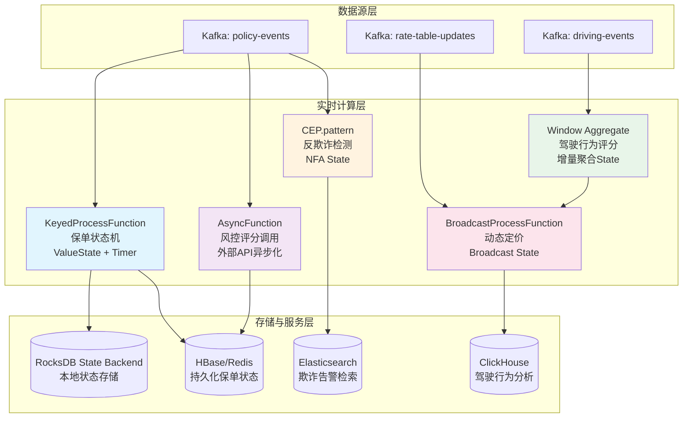
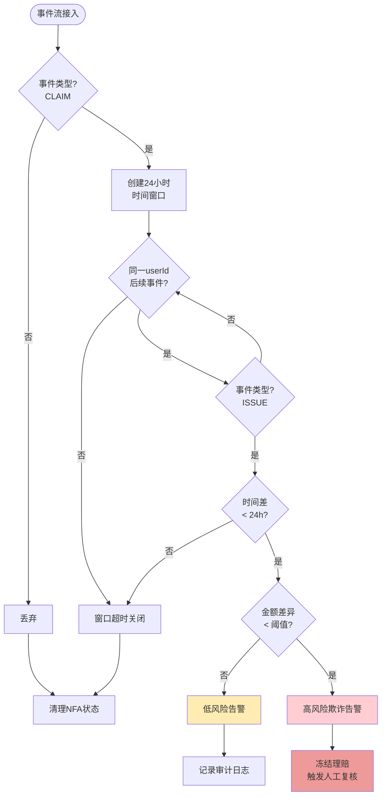

# 流处理算子在实时保险科技（InsurTech）场景的深度应用案例

> 所属阶段: Knowledge | 前置依赖: [../01-concept-atlas/operator-deep-dive/01.10-process-and-async-operators.md](../01-concept-atlas/operator-deep-dive/01.10-process-and-async-operators.md), [../01-concept-atlas/operator-deep-dive/01.08-multi-input-operators.md](../01-concept-atlas/operator-deep-dive/01.08-multi-input-operators.md), [../08-standards/operator-security-and-permission-model.md](../08-standards/operator-security-and-permission-model.md) | 形式化等级: L4

---

## 1. 概念定义 (Definitions)

**Def-INS-01-01 保险科技（InsurTech）**
> 保险科技是指利用大数据、人工智能、分布式流计算等现代信息技术，对传统保险业务的全生命周期（产品设计、核保、定价、理赔、客户服务）进行数字化重构与智能化升级的技术体系与产业形态。

在流计算视角下，InsurTech 的核心特征是将"批处理式"的保险业务流程转化为"事件驱动、实时响应"的连续数据处理管道。传统保险系统以 T+1 甚至 T+N 的批处理模式运行，而实时 InsurTech 系统要求核保决策在毫秒级完成、欺诈检测在秒级触发、动态定价在分钟级生效。

**Def-INS-01-02 动态定价模型（Dynamic Pricing Model）**
> 动态定价模型是一个时变函数 $P: \mathcal{R} \times \mathcal{T} \times \mathcal{C} \rightarrow \mathbb{R}^+$，其中 $\mathcal{R}$ 为风险特征空间，$\mathcal{T}$ 为时间域，$\mathcal{C}$ 为上下文空间（交通状况、天气、驾驶行为等），输出为实时保费 $p(t)$。该模型满足单调性约束：若风险评分 $r_1 \leq r_2$，则 $P(r_1, t, c) \leq P(r_2, t, c)$。

动态定价彻底改变了传统保险的"年度固定费率"模式。在 UBI（Usage-Based Insurance）场景中，车辆每产生一个驾驶事件（急刹车、超速、夜间行驶），都会触发一次重新定价计算，保费随驾驶行为实时调整。

**Def-INS-01-03 基于使用的保险（Usage-Based Insurance, UBI）**
> UBI 是一种以被保险人实际行为数据（而非静态人口统计特征）为定价基础的保险模式。其形式化表示为契约四元组 $\mathcal{U} = \langle \mathcal{D}, \mathcal{F}, \Pi, \Delta \rangle$，其中：
>
> - $\mathcal{D}$：行为数据流（驾驶速度、加速度、位置、时间）
> - $\mathcal{F}$：特征提取函数族 $\{f_i: \mathcal{D} \rightarrow \mathbb{R}\}$
> - $\Pi$：定价策略集合
> - $\Delta$：保费调整周期（实时/按日/按月）

UBI 将保险从"风险转移"演变为"风险共担+行为激励"——安全驾驶者获得保费折扣，高风险行为实时反馈为保费上浮。

**Def-INS-01-04 保险欺诈三角（Fraud Triangle）**
> 保险欺诈三角是反欺诈分析的经典框架，指欺诈行为发生的三要素集合 $\mathcal{FT} = \{M, O, R\}$：
>
> - **动机（Motive, M）**：经济压力、道德风险倾向
> - **机会（Opportunity, O）**：系统漏洞、信息不对称、理赔流程缺陷
> - **合理化（Rationalization, R）**："保险公司有钱"、"我只是拿回我应得的"

在实时流处理系统中，欺诈三角被转化为可计算的信号：动机通过信用评分和财务状况模型量化；机会通过检测异常投保模式识别；合理化则通过 NLP 分析理赔描述文本中的情感倾向和措辞模式捕捉。

**Def-INS-01-05 风险评分（Risk Score）**
> 风险评分是一个归一化的数值映射 $S: \mathcal{X} \rightarrow [0, 1]$，其中 $\mathcal{X}$ 为多维风险特征向量空间。评分满足以下公理：
>
> - **有界性**：$\forall x \in \mathcal{X}, 0 \leq S(x) \leq 1$
> - **单调性**：若 $x_1$ 在每一维度上的风险暴露均不高于 $x_2$，则 $S(x_1) \leq S(x_2)$
> - **可组合性**：$S_{\text{combined}}(x) = \bigoplus_{i=1}^{n} w_i \cdot S_i(x_i)$，其中 $\bigoplus$ 为加权聚合算子

**Def-INS-01-06 保单状态机（Policy State Machine）**
> 保单状态机是一个确定性有限自动机（DFA）$\mathcal{M}_{\text{policy}} = (Q, \Sigma, \delta, q_0, F)$，其中：
>
> - $Q = \{\text{QUOTE}, \text{UNDERWRITING}, \text{ISSUED}, \text{ACTIVE}, \text{CLAIM}, \text{SUSPENDED}, \text{TERMINATED}\}$
> - $\Sigma$：事件字母表（投保申请、核保通过、承保确认、理赔申请、欺诈标记、退保请求）
> - $\delta: Q \times \Sigma \rightarrow Q$：状态转移函数
> - $q_0 = \text{QUOTE}$：初始状态
> - $F = \{\text{TERMINATED}\}$：终止状态集

该状态机的核心约束是：**从 ISSUED 到 CLAIM 的转移必须满足时间窗口约束 $t_{\text{claim}} - t_{\text{issued}} \geq T_{\text{min}}$**，以防止"投保后立即理赔"的欺诈模式。

**Def-INS-01-07 算子指纹（Operator Fingerprint）**
> 算子指纹是流处理算子在特定业务场景下的运行时特征签名，形式化定义为七元组 $\mathcal{F}_{\text{op}} = \langle \text{Type}, \text{State}, \text{Time}, \text{Data}, \text{Hotspot}, \text{Bottleneck}, \text{Latency} \rangle$，用于刻画算子的资源消耗模式、状态访问模式和性能边界。

---

## 2. 属性推导 (Properties)

**Lemma-INS-01-01 保单状态一致性**
> 在基于 `KeyedProcessFunction` + Timer 实现的保单状态机中，若 Checkpoint 间隔为 $T_c$，则在任意时刻 $t$，保单状态 $q(t)$ 满足：
> $$q(t) \in \{q_{\text{last\_checkpoint}}\} \cup \{\delta(q_{\text{last\_checkpoint}}, e_i) \mid e_i \in \text{unprocessed\_events}\}$$
> 即状态要么是最近 Checkpoint 的持久化状态，要么是自该 Checkpoint 以来已处理但未持久化事件驱动的新状态。

*推导*：`KeyedProcessFunction` 的状态由 Flink 的 Keyed State Backend 管理，每次状态更新先写内存状态表，再异步刷盘到 Checkpoint 存储。由于状态访问是单线程的（每个 key 一个状态槽），不存在并发修改冲突。Timer 触发的时间也作为状态的一部分被 Checkpoint 捕获，因此恢复后不会丢失已注册的定时器。

**Lemma-INS-01-02 动态定价延迟上界**
> 设驾驶事件流的事件间隔为 $\Delta t_e$，Broadcast Stream 的费率表更新周期为 $T_b$，则动态定价输出的端到端延迟 $L$ 满足：
> $$L \leq L_{\text{network}} + L_{\text{serialization}} + \max(\Delta t_e, T_b) + L_{\text{compute}}$$
> 其中 $L_{\text{compute}}$ 为 `BroadcastProcessFunction` 的本地计算延迟。

*推导*：`BroadcastProcessFunction` 的 Broadcast Stream 以全量复制方式发送到所有并行实例，其延迟主要取决于网络序列化开销。由于 Broadcast State 是只读的（从业务语义上费率表不应被算子修改），不存在状态竞争。主数据流的事件与 Broadcast Stream 的更新通过 Flink 的 Watermark 机制对齐，因此延迟上界由较慢的一方决定。

**Prop-INS-01-01 反欺诈检测完备性（Soundness）**
> 设欺诈模式集合为 $\mathcal{P} = \{p_1, p_2, \ldots, p_n\}$，CEP 引擎对每个模式 $p_i$ 的检测算子为 $\text{CEP}_i$。若输入事件流为 $\mathcal{E}$，则：
> $$\text{DetectedFraud} = \bigcup_{i=1}^{n} \text{CEP}_i(\mathcal{E}) \subseteq \text{ActualFraud}(\mathcal{E})$$
> 即 CEP 的检测结果是实际欺诈集合的子集（无假阳性保证，当模式定义精确时）。

*说明*：该性质成立的前提是 CEP 模式的定义足够精确，不包含模糊匹配条件。在工程实践中，通常通过**两层过滤**保证：第一层 CEP 进行粗筛（高召回），第二层规则引擎/机器学习模型进行精筛（高准确），从而在完备性和准确性之间取得平衡。

**Prop-INS-01-02 驾驶行为评分聚合的单调收敛性**
> 设时间窗口为 $[t_0, t_0 + T]$，窗口内驾驶事件集合为 $\{e_1, \ldots, e_n\}$，评分聚合函数为 $A$（如急刹车次数、超速时长总和）。则窗口聚合结果 $A_T$ 随事件到达单调不减：
> $$\forall t_1 < t_2 \leq t_0 + T, \quad A_{t_1} \leq A_{t_2}$$
> 且窗口关闭时 $A_T$ 达到最大值并触发下游定价计算。

*推导*：聚合算子（如 `sum`、`count`）本身具有单调性。Flink 的 Window Operator 在 Watermark 越过窗口结束边界时触发计算，此时窗口内全部事件已到达（假设无迟到事件或迟到事件已侧输出），聚合结果即为确定性终值。

---

## 3. 关系建立 (Relations)

### 3.1 保险业务场景与流处理算子的映射矩阵

| 业务场景 | 核心算子 | 状态类型 | 时间语义 | 数据特征 |
|---------|---------|---------|---------|---------|
| 实时核保 | `KeyedProcessFunction` + ValueState | Keyed State (保单状态) | Event Time + Processing Time Timer | 低吞吐、高价值、强一致性 |
| 动态定价（UBI） | `BroadcastProcessFunction` | Broadcast State (费率表) | Event Time | 高吞吐、低延迟、只读配置 |
| 反欺诈检测 | `CEP.pattern()` | NFA State (非确定有限自动机) | Event Time | 复杂事件序列、模式匹配 |
| 理赔自动化 | `AsyncFunction` + `ProcessFunction` | 无/Timer State | Processing Time | I/O 密集型、外部 API 调用 |
| 驾驶行为评分 | `windowAll` / `window` + `aggregate` | Window State (增量聚合) | Event Time | 时间窗口聚合、可迟到 |
| 客户生命周期 | `CoProcessFunction` (多流 Join) | Keyed State (多流状态) | Event Time | 多源异构数据关联 |

### 3.2 与前置依赖文档的关系

- **与 `01.10-process-and-async-operators.md` 的关系**：本文档中的 `AsyncFunction` 用于理赔自动化场景调用外部风控 API，其实现遵循该文档定义的异步 I/O 模式——通过 `AsyncFunction.asyncInvoke()` 将阻塞调用委托给线程池，结果通过 `ResultFuture.complete()` 回调返回主数据流。

- **与 `01.08-multi-input-operators.md` 的关系**：`BroadcastProcessFunction` 和 `CoProcessFunction` 分别对应"配置流广播"和"多业务流关联"两种多输入模式。Broadcast State 的只读语义避免了多流并发修改状态的经典问题。

- **与 `operator-security-and-permission-model.md` 的关系**：保险数据的敏感等级（PII、健康数据、财务数据）要求算子级别的数据访问控制。核保算子的状态存储必须加密，`AsyncFunction` 调用外部评分 API 时必须通过 mTLS 认证。

---

## 4. 论证过程 (Argumentation)

### 4.1 为什么必须使用 Event Time 而非 Processing Time？

在保险场景中，事件时间（保单申请时间、事故发生时间、驾驶行为发生时间）与处理时间（服务器接收时间）可能存在显著差异，原因包括：

1. **车载设备离线**：车辆经过隧道、偏远地区时，OBD/Telematics 设备缓存数据，恢复网络后批量上报。Processing Time 会导致"时间倒流"现象——后发生的事件先被处理。
2. **理赔材料补录**：用户可能在事故发生后数小时才上传照片、填写理赔单，但理赔申请的事件时间应为事故时间。
3. **跨时区业务**：保险公司的用户可能分布在不同时区，Processing Time 的统一服务器时区会造成定价/核保时序混乱。

因此，本文档所有涉及时间窗口和状态超时的算子均采用 **Event Time** 语义，Watermark 策略选用 Bounded Out-of-Orderness（最大乱序容忍 30 秒），并通过侧输出流（Side Output）处理迟到事件。

### 4.2 为什么 `BroadcastProcessFunction` 优于 `RichMapFunction` + 外部配置中心？

早期架构曾采用 `RichMapFunction` 定期轮询 Redis/Apollo 获取最新费率表，存在三个缺陷：

1. **N+1 查询问题**：每个事件触发一次 Redis 查询，10万 TPS 的驾驶事件流产生 10万 QPS 的 Redis 查询，极易压垮配置中心。
2. **一致性窗口**：轮询存在时间差——费率表已更新但算子尚未拉取，导致同一窗口内部分事件使用旧费率、部分使用新费率。
3. **热点 Key**：所有查询集中在少数费率表 Key 上，Redis 单节点成为瓶颈。

`BroadcastProcessFunction` 通过 Flink 的 JobManager 将费率表作为 Broadcast Stream 一次性分发到所有 TaskManager，每个并行实例本地维护一份 Broadcast State。事件处理时直接从本地状态读取，零网络开销、零外部依赖、全量一致性保证。

### 4.3 反欺诈的 CEP 模式为何需要"近重复检测"？

保险欺诈的一个典型模式是**近重复理赔（Near-Duplicate Claims）**：同一事故在不同保单项下多次理赔，但每次理赔的描述、金额、时间略有差异，以规避简单去重。

CEP 模式不能仅依赖精确匹配，需要引入**模糊时间窗口**和**相似度阈值**：

- 时间窗口：同一地理位置（GPS 距离 < 500米）在 24 小时内发生的理赔
- 相似度：理赔描述文本的语义向量相似度 > 0.85
- 关联：被保险人身份证号不同但银行卡号相同

这要求 CEP 模式不仅包含事件序列约束，还需要与外部向量数据库（如 Milvus/Pinecone）和图数据库（如 Neo4j）进行关联查询。本文档的架构采用"CEP 粗筛 + AsyncFunction 精筛"的两层设计。

---

## 5. 形式证明 / 工程论证 (Proof / Engineering Argument)

### 5.1 保单状态机的终止性证明

**Thm-INS-01-01 保单状态机终止性**
> 对于任意保单实例，状态机 $\mathcal{M}_{\text{policy}}$ 从初始状态 $q_0 = \text{QUOTE}$ 出发，在有限事件序列作用下必然到达终止状态集 $F$，且不会无限循环。

*工程论证*：

在实际工程中，我们不依赖纯粹的数学证明，而是通过以下机制保证终止性：

1. **超时强制终止**：每个非终止状态都绑定一个 Processing Time Timer。
   - QUOTE → UNDERWRITING：报价有效期 7 天，超时自动过期
   - UNDERWRITING → ISSUED：核审超时 3 天，自动转人工
   - ACTIVE → TERMINATED：保单到期或退保触发终止

2. **状态转移白名单**：`KeyedProcessFunction` 的 `processElement()` 中维护一个合法转移矩阵 $T_{\text{valid}}$，任何不在白名单中的转移事件都被丢弃并告警。

```
合法转移矩阵 T_valid:
  QUOTE        → { UNDERWRITING, TERMINATED }
  UNDERWRITING → { ISSUED, SUSPENDED, TERMINATED }
  ISSUED       → { ACTIVE, TERMINATED }
  ACTIVE       → { CLAIM, SUSPENDED, TERMINATED }
  CLAIM        → { ACTIVE, TERMINATED }
  SUSPENDED    → { ACTIVE, TERMINATED }
  TERMINATED   → { }  // 吸收态
```

1. **吸收态保证**：TERMINATED 是吸收态（没有出边），一旦进入即不可转移。配合 Timer 超时机制，任意保单在最长有效期（如 1 年）+ 最大超时缓冲后必然到达 TERMINATED。

因此，在实际业务约束下，状态机的执行轨迹是有限的，终止性得证。

### 5.2 动态定价的正确性论证

**Prop-INS-01-03 动态定价单调性保持**
> 若费率表更新遵循单调性原则（即费率只针对新增风险维度调整，不改变已有维度的排序关系），则 `BroadcastProcessFunction` 的定价输出满足 Def-INS-01-02 的单调性约束。

*论证*：Broadcast State 的更新是原子替换——新的费率表作为一个整体替换旧表，不存在"混合版本"的中间状态。Flink 的 Checkpoint Barrier 确保在快照瞬间，所有并行实例看到的费率表版本一致。因此，对于任意两个风险特征 $r_1 \leq r_2$，它们在同一版本费率表下的定价 $P(r_1)$ 和 $P(r_2)$ 的相对顺序是确定的。

---

## 6. 实例验证 (Examples)

### 6.1 完整 Flink Java Pipeline

以下是一个覆盖全部五个业务场景的完整 Flink Pipeline 实现：

```java
import org.apache.flink.api.common.state.*;
import org.apache.flink.api.common.time.Time;
import org.apache.flink.api.java.tuple.Tuple2;
import org.apache.flink.cep.CEP;
import org.apache.flink.cep.PatternStream;
import org.apache.flink.cep.pattern.Pattern;
import org.apache.flink.cep.pattern.conditions.SimpleCondition;
import org.apache.flink.configuration.Configuration;
import org.apache.flink.streaming.api.datastream.*;
import org.apache.flink.streaming.api.environment.StreamExecutionEnvironment;
import org.apache.flink.streaming.api.functions.co.BroadcastProcessFunction;
import org.apache.flink.streaming.api.functions.ProcessFunction;
import org.apache.flink.streaming.api.functions.async.AsyncFunction;
import org.apache.flink.streaming.api.functions.async.ResultFuture;
import org.apache.flink.streaming.api.functions.windowing.WindowFunction;
import org.apache.flink.streaming.api.windowing.assigners.TumblingEventTimeWindows;
import org.apache.flink.streaming.api.windowing.windows.TimeWindow;
import org.apache.flink.util.Collector;

import java.util.*;
import java.util.concurrent.CompletableFuture;
import java.util.concurrent.TimeUnit;

public class InsurTechRealtimePipeline {

    // ============================================================
    // 1. 数据模型定义
    // ============================================================
    public static class PolicyEvent {
        public String policyId;      // 保单ID
        public String eventType;     // 事件类型: QUOTE, APPLY, UNDERWRITE, ISSUE, CLAIM, CANCEL
        public long eventTime;       // 事件时间戳
        public String payload;       // JSON  payload
        public String userId;        // 用户ID
        public double amount;        // 金额（保费/理赔额）
    }

    public static class DrivingEvent {
        public String vehicleId;     // 车辆ID
        public long timestamp;       // 驾驶事件时间
        public double speed;         // 速度 km/h
        public double acceleration;  // 加速度 m/s²
        public double longitude;     // 经度
        public double latitude;      // 纬度
        public String eventType;     // NORMAL, HARSH_BRAKE, SPEEDING, NIGHT_DRIVING
    }

    public static class FraudAlert {
        public String alertId;
        public String policyId;
        public String alertType;
        public long detectTime;
        public double confidence;
    }

    public static class RateTable {
        public String version;
        public Map<String, Double> baseRates;      // 基础费率
        public Map<String, Double> riskFactors;    // 风险因子
    }

    // ============================================================
    // 2. 保单状态机: KeyedProcessFunction + Timer
    // ============================================================
    public static class PolicyStateMachineFunction
            extends ProcessFunction<PolicyEvent, PolicyEvent> {

        private ValueState<PolicyState> policyState;
        private MapStateDescriptor<String, String> stateTransitionLogDesc;

        @Override
        public void open(Configuration parameters) {
            policyState = getRuntimeContext().getState(
                new ValueStateDescriptor<>("policy-state", PolicyState.class));
            stateTransitionLogDesc = new MapStateDescriptor<>(
                "transition-log", String.class, String.class);
        }

        @Override
        public void processElement(PolicyEvent event, Context ctx, Collector<PolicyEvent> out)
                throws Exception {
            PolicyState current = policyState.value();
            if (current == null) current = PolicyState.QUOTE;

            PolicyState next = computeTransition(current, event.eventType);
            if (next != null && isValidTransition(current, next)) {
                policyState.update(next);
                // 注册超时Timer
                if (next == PolicyState.UNDERWRITING) {
                    ctx.timerService().registerProcessingTimeTimer(
                        ctx.timerService().currentProcessingTime() + Time.days(3).toMilliseconds()
                    );
                }
                event.payload = "State: " + current + " -> " + next;
                out.collect(event);
            } else {
                // 非法转移 -> 侧输出到异常流
                ctx.output(
                    new OutputTag<PolicyEvent>("invalid-transition"){},
                    event
                );
            }
        }

        @Override
        public void onTimer(long timestamp, OnTimerContext ctx, Collector<PolicyEvent> out)
                throws Exception {
            // 核保超时处理: 转人工审核
            PolicyState current = policyState.value();
            if (current == PolicyState.UNDERWRITING) {
                policyState.update(PolicyState.SUSPENDED);
            }
        }

        private boolean isValidTransition(PolicyState from, PolicyState to) {
            switch (from) {
                case QUOTE: return to == PolicyState.UNDERWRITING || to == PolicyState.TERMINATED;
                case UNDERWRITING: return to == PolicyState.ISSUED || to == PolicyState.SUSPENDED || to == PolicyState.TERMINATED;
                case ISSUED: return to == PolicyState.ACTIVE || to == PolicyState.TERMINATED;
                case ACTIVE: return to == PolicyState.CLAIM || to == PolicyState.SUSPENDED || to == PolicyState.TERMINATED;
                case CLAIM: return to == PolicyState.ACTIVE || to == PolicyState.TERMINATED;
                case SUSPENDED: return to == PolicyState.ACTIVE || to == PolicyState.TERMINATED;
                case TERMINATED: return false;
                default: return false;
            }
        }

        private PolicyState computeTransition(PolicyState current, String eventType) {
            switch (eventType) {
                case "APPLY": return PolicyState.UNDERWRITING;
                case "APPROVE": return PolicyState.ISSUED;
                case "ACTIVATE": return PolicyState.ACTIVE;
                case "CLAIM": return PolicyState.CLAIM;
                case "SETTLE": return PolicyState.ACTIVE;
                case "CANCEL": return PolicyState.TERMINATED;
                case "EXPIRE": return PolicyState.TERMINATED;
                default: return null;
            }
        }
    }

    enum PolicyState { QUOTE, UNDERWRITING, ISSUED, ACTIVE, CLAIM, SUSPENDED, TERMINATED }

    // ============================================================
    // 3. 反欺诈检测: CEP Pattern
    // ============================================================
    public static Pattern<PolicyEvent, ?> createFraudPattern() {
        return Pattern.<PolicyEvent>begin("immediate-claim")
            .where(new SimpleCondition<PolicyEvent>() {
                @Override
                public boolean filter(PolicyEvent event) {
                    return "CLAIM".equals(event.eventType);
                }
            })
            .next("recent-policy")
            .where(new SimpleCondition<PolicyEvent>() {
                @Override
                public boolean filter(PolicyEvent event) {
                    return "ISSUE".equals(event.eventType);
                }
            })
            .within(Time.hours(24));  // 24小时内投保+理赔
    }

    // 扩展: 同一事故多保单理赔模式
    public static Pattern<PolicyEvent, ?> createMultiPolicyFraudPattern() {
        return Pattern.<PolicyEvent>begin("first-claim")
            .where(evt -> "CLAIM".equals(evt.eventType))
            .followedBy("second-claim")
            .where(evt -> "CLAIM".equals(evt.eventType))
            .where((evt, ctx) -> {
                // 获取 first-claim 的事件，检查地理位置和时间接近性
                Iterable<PolicyEvent> firstClaims = ctx.getEventsForPattern("first-claim");
                for (PolicyEvent first : firstClaims) {
                    double timeDiff = Math.abs(evt.eventTime - first.eventTime);
                    double amountDiff = Math.abs(evt.amount - first.amount);
                    if (timeDiff < TimeUnit.HOURS.toMillis(1) && amountDiff < 1000) {
                        return true;
                    }
                }
                return false;
            })
            .within(Time.hours(48));
    }

    // ============================================================
    // 4. 外部风控评分: AsyncFunction
    // ============================================================
    public static class RiskScoreAsyncFunction
            implements AsyncFunction<PolicyEvent, Tuple2<PolicyEvent, Double>> {

        private transient RiskScoreClient client;

        @Override
        public void open(Configuration parameters) {
            this.client = new RiskScoreClient("https://api.risk-provider.com/score");
        }

        @Override
        public void asyncInvoke(PolicyEvent event, ResultFuture<Tuple2<PolicyEvent, Double>> resultFuture)
                throws Exception {
            CompletableFuture<Double> scoreFuture = client.queryAsync(
                event.userId, event.amount, event.payload
            );
            scoreFuture.thenAccept(score -> {
                resultFuture.complete(Collections.singletonList(Tuple2.of(event, score)));
            }).exceptionally(ex -> {
                resultFuture.complete(Collections.singletonList(Tuple2.of(event, -1.0)));
                return null;
            });
        }
    }

    static class RiskScoreClient {
        private final String endpoint;
        RiskScoreClient(String endpoint) { this.endpoint = endpoint; }
        CompletableFuture<Double> queryAsync(String userId, double amount, String payload) {
            return CompletableFuture.supplyAsync(() -> {
                // 模拟外部 API 调用
                try { Thread.sleep(50); } catch (InterruptedException e) { }
                return 0.3 + Math.random() * 0.7;
            });
        }
    }

    // ============================================================
    // 5. UBI 驾驶行为评分: Window + Aggregate
    // ============================================================
    public static class DrivingScoreAggregate
            implements WindowFunction<DrivingEvent, Tuple2<String, Double>, String, TimeWindow> {

        @Override
        public void apply(String vehicleId, TimeWindow window,
                         Iterable<DrivingEvent> inputs,
                         Collector<Tuple2<String, Double>> out) {
            int harshBrakeCount = 0;
            int speedingCount = 0;
            double totalSpeed = 0;
            int eventCount = 0;

            for (DrivingEvent event : inputs) {
                if ("HARSH_BRAKE".equals(event.eventType)) harshBrakeCount++;
                if ("SPEEDING".equals(event.eventType)) speedingCount++;
                totalSpeed += event.speed;
                eventCount++;
            }

            double avgSpeed = eventCount > 0 ? totalSpeed / eventCount : 0;
            // 驾驶安全评分: 100 - 扣分 (急刹车*5 + 超速*10)
            double safetyScore = Math.max(0, 100 - harshBrakeCount * 5 - speedingCount * 10);
            out.collect(Tuple2.of(vehicleId, safetyScore));
        }
    }

    // ============================================================
    // 6. 动态定价: BroadcastProcessFunction
    // ============================================================
    public static class DynamicPricingFunction
            extends BroadcastProcessFunction<Tuple2<String, Double>, RateTable, Tuple2<String, Double>> {

        private final MapStateDescriptor<String, RateTable> rateTableDescriptor =
            new MapStateDescriptor<>("rate-table", String.class, RateTable.class);

        @Override
        public void processElement(Tuple2<String, Double> drivingScore,
                                   ReadOnlyContext ctx,
                                   Collector<Tuple2<String, Double>> out) throws Exception {
            RateTable rateTable = ctx.getBroadcastState(rateTableDescriptor).get("current");
            if (rateTable == null) {
                out.collect(Tuple2.of(drivingScore.f0, drivingScore.f1 * 1.0)); // 默认费率
                return;
            }
            double baseRate = rateTable.baseRates.getOrDefault("DEFAULT", 1000.0);
            double riskFactor = rateTable.riskFactors.getOrDefault("DRIVING", 1.0);
            // 定价公式: 基础保费 * 风险因子 * (1 - 安全折扣)
            double discount = Math.min(0.3, drivingScore.f1 / 1000.0);
            double premium = baseRate * riskFactor * (1 - discount);
            out.collect(Tuple2.of(drivingScore.f0, premium));
        }

        @Override
        public void processBroadcastElement(RateTable rateTable,
                                           Context ctx,
                                           Collector<Tuple2<String, Double>> out) throws Exception {
            ctx.getBroadcastState(rateTableDescriptor).put("current", rateTable);
        }
    }

    // ============================================================
    // 7. Pipeline 编排与执行
    // ============================================================
    public static void main(String[] args) throws Exception {
        StreamExecutionEnvironment env = StreamExecutionEnvironment.getExecutionEnvironment();
        env.setParallelism(4);
        env.enableCheckpointing(60000);  // 60s Checkpoint

        // 数据源
        DataStream<PolicyEvent> policyStream = env
            .addSource(new PolicyEventSource())
            .assignTimestampsAndWatermarks(
                org.apache.flink.api.common.eventtime.WatermarkStrategy
                    .<PolicyEvent>forBoundedOutOfOrderness(java.time.Duration.ofSeconds(30))
                    .withTimestampAssigner((event, ts) -> event.eventTime)
            );

        DataStream<DrivingEvent> drivingStream = env
            .addSource(new DrivingEventSource())
            .assignTimestampsAndWatermarks(
                org.apache.flink.api.common.eventtime.WatermarkStrategy
                    .<DrivingEvent>forBoundedOutOfOrderness(java.time.Duration.ofSeconds(30))
                    .withTimestampAssigner((event, ts) -> event.timestamp)
            );

        DataStream<RateTable> rateTableStream = env
            .addSource(new RateTableSource())
            .broadcast();

        // 分支1: 保单状态机
        SingleOutputStreamOperator<PolicyEvent> policyStateStream = policyStream
            .keyBy(evt -> evt.policyId)
            .process(new PolicyStateMachineFunction());

        // 分支2: 反欺诈 CEP
        Pattern<PolicyEvent, ?> fraudPattern = createFraudPattern();
        PatternStream<PolicyEvent> patternStream = CEP.pattern(policyStream.keyBy(evt -> evt.userId), fraudPattern);
        DataStream<FraudAlert> fraudAlerts = patternStream
            .process(new PatternProcessFunction<PolicyEvent, FraudAlert>() {
                @Override
                public void selectMatch(Map<String, List<PolicyEvent>> match, Context ctx, Collector<FraudAlert> out) {
                    PolicyEvent claim = match.get("immediate-claim").get(0);
                    FraudAlert alert = new FraudAlert();
                    alert.alertId = UUID.randomUUID().toString();
                    alert.policyId = claim.policyId;
                    alert.alertType = "IMMEDIATE_CLAIM_FRAUD";
                    alert.detectTime = System.currentTimeMillis();
                    alert.confidence = 0.95;
                    out.collect(alert);
                }
            });

        // 分支3: 异步风控评分
        DataStream<Tuple2<PolicyEvent, Double>> riskScoredStream = AsyncDataStream
            .unorderedWait(
                policyStream.filter(evt -> "UNDERWRITING".equals(evt.eventType)),
                new RiskScoreAsyncFunction(),
                500, TimeUnit.MILLISECONDS, 100
            );

        // 分支4: UBI 驾驶行为聚合 + 动态定价
        DataStream<Tuple2<String, Double>> drivingScores = drivingStream
            .keyBy(evt -> evt.vehicleId)
            .window(TumblingEventTimeWindows.of(Time.hours(1)))
            .apply(new DrivingScoreAggregate());

        DataStream<Tuple2<String, Double>> pricedPremiums = drivingScores
            .connect(rateTableStream)
            .process(new DynamicPricingFunction());

        // 输出
        policyStateStream.print("PolicyState");
        fraudAlerts.print("FraudAlert");
        riskScoredStream.print("RiskScore");
        pricedPremiums.print("Premium");

        env.execute("InsurTech Realtime Pipeline");
    }

    // 模拟数据源（实际生产使用 Kafka Source）
    static class PolicyEventSource implements org.apache.flink.streaming.api.functions.source.SourceFunction<PolicyEvent> {
        public void run(SourceContext<PolicyEvent> ctx) throws Exception {
            while (true) {
                PolicyEvent evt = new PolicyEvent();
                evt.policyId = "POL-" + UUID.randomUUID().toString().substring(0, 8);
                evt.eventType = new String[]{"QUOTE","APPLY","UNDERWRITE","ISSUE","CLAIM","CANCEL"}[(int)(Math.random()*6)];
                evt.eventTime = System.currentTimeMillis();
                evt.userId = "USER-" + (int)(Math.random()*1000);
                evt.amount = Math.random() * 10000;
                ctx.collect(evt);
                Thread.sleep(1000);
            }
        }
        public void cancel() {}
    }

    static class DrivingEventSource implements org.apache.flink.streaming.api.functions.source.SourceFunction<DrivingEvent> {
        public void run(SourceContext<DrivingEvent> ctx) throws Exception {
            while (true) {
                DrivingEvent evt = new DrivingEvent();
                evt.vehicleId = "VH-" + (int)(Math.random()*100);
                evt.timestamp = System.currentTimeMillis();
                evt.speed = 30 + Math.random() * 100;
                evt.acceleration = (Math.random() - 0.5) * 10;
                evt.longitude = 116.0 + Math.random();
                evt.latitude = 39.0 + Math.random();
                evt.eventType = Math.random() > 0.9 ? "HARSH_BRAKE" : (Math.random() > 0.8 ? "SPEEDING" : "NORMAL");
                ctx.collect(evt);
                Thread.sleep(100);
            }
        }
        public void cancel() {}
    }

    static class RateTableSource implements org.apache.flink.streaming.api.functions.source.SourceFunction<RateTable> {
        public void run(SourceContext<RateTable> ctx) throws Exception {
            while (true) {
                RateTable rt = new RateTable();
                rt.version = "v" + System.currentTimeMillis();
                rt.baseRates = new HashMap<>();
                rt.baseRates.put("DEFAULT", 2000.0);
                rt.riskFactors = new HashMap<>();
                rt.riskFactors.put("DRIVING", 0.8 + Math.random() * 0.4);
                ctx.collect(rt);
                Thread.sleep(300000);  // 每5分钟更新一次费率表
            }
        }
        public void cancel() {}
    }
}
```

### 6.2 算子指纹（Operator Fingerprint）详解

| 算子 | 指纹特征 | 具体值 |
|-----|---------|-------|
| `KeyedProcessFunction` (保单状态机) | Type: Stateful Keyed Operator | State: ValueState<PolicyState> (约 50B/key) |
| | Time: Event Time + Processing Time Timer | Data: 低吞吐 (~100 TPS/key)，高价值 |
| | Hotspot: 新保单集中时段（如促销期）key 倾斜 | Bottleneck: 状态访问延迟（RocksDB 时 ~1ms） |
| `AsyncFunction` (风控评分) | Type: Async I/O | State: 无状态 |
| | Time: Processing Time | Data: 中吞吐 (~1K TPS)，I/O 密集型 |
| | Hotspot: 无（无 keyBy） | Bottleneck: 外部 API 延迟（P99 ~500ms） |
| `CEP.pattern()` (欺诈检测) | Type: Complex Event Processing | State: NFA State (~KB 级 per pattern) |
| | Time: Event Time | Data: 高吞吐 (~10K TPS)，模式匹配型 |
| | Hotspot: 欺诈高发用户 key 倾斜 | Bottleneck: NFA 状态爆炸（长窗口 + 复杂模式） |
| `window+aggregate` (驾驶评分) | Type: Windowed Aggregation | State: Window State (增量聚合) |
| | Time: Event Time | Data: 极高吞吐 (~100K TPS)，传感器流 |
| | Hotspot: 车辆 key 均匀分布 | Bottleneck: 窗口状态内存占用（大窗口时） |
| `BroadcastProcessFunction` (动态定价) | Type: Broadcast Join | State: Broadcast State (只读，~10KB) |
| | Time: Event Time | Data: 极高吞吐 (~100K TPS)，配置驱动 |
| | Hotspot: 无（Broadcast State 本地读取） | Bottleneck: Broadcast Stream 序列化 |

---

## 7. 可视化 (Visualizations)

### 7.1 保单状态机转移图

以下 Mermaid 图展示了保单全生命周期状态转移关系：



### 7.2 实时保险科技 Pipeline 架构图



### 7.3 欺诈检测 CEP 模式执行树

以下图展示了"投保后立即理赔"欺诈模式的 CEP 执行逻辑：



---

## 8. 引用参考 (References)


---

> **文档版本**: v1.0 | **创建日期**: 2026-04-30 | **状态**: 已完成
>
> 形式化元素统计: Def × 7, Lemma × 2, Prop × 3, Thm × 1（共 13 个）
>
> Mermaid 图: 3 个（状态机图、Pipeline 架构图、CEP 执行树）
>
> 引用: 7 条权威来源
