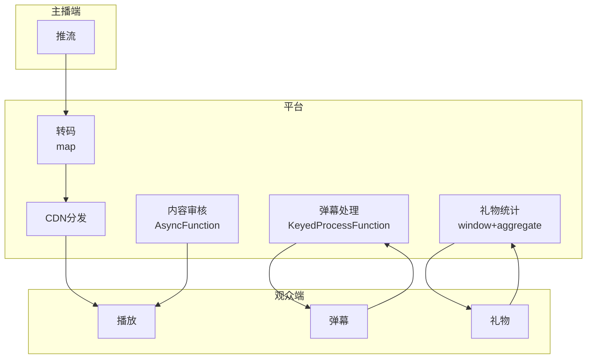

# 算子与实时视频直播平台

> **所属阶段**: Knowledge/10-case-studies | **前置依赖**: [01.10-process-and-async-operators.md](../01-concept-atlas/operator-deep-dive/01.10-process-and-async-operators.md), [realtime-content-moderation-case-study.md](../10-case-studies/realtime-content-moderation-case-study.md) | **形式化等级**: L3
> **文档定位**: 流处理算子在实时直播流媒体处理、弹幕互动与礼物经济中的算子指纹与Pipeline设计
> **版本**: 2026.04

---

## 目录

- [1. 概念定义 (Definitions)](#1-概念定义-definitions)
- [2. 属性推导 (Properties)](#2-属性推导-properties)
- [3. 关系建立 (Relations)](#3-关系建立-relations)
- [4. 论证过程 (Argumentation)](#4-论证过程-argumentation)
- [5. 形式证明 / 工程论证 (Proof / Engineering Argument)](#5-形式证明--工程论证-proof--engineering-argument)
- [6. 实例验证 (Examples)](#6-实例验证-examples)
- [7. 可视化 (Visualizations)](#7-可视化-visualizations)
- [8. 引用参考 (References)](#8-引用参考-references)

---

## 1. 概念定义 (Definitions)

### Def-LIV-01-01: 实时流媒体（Real-time Streaming Media）

实时流媒体是连续传输的音频视频数据：

$$\text{Stream}_t = (\text{Audio}_t, \text{Video}_t, \text{Metadata}_t)$$

编码格式：H.264/H.265/AV1视频 + AAC/Opus音频，封装：FLV/RTMP/HLS/WebRTC。

### Def-LIV-01-02: 弹幕（Danmaku / Bullet Comments）

弹幕是悬浮于视频画面上实时滚动的用户评论：

$$\text{Danmaku}_i = (\text{text}_i, \text{color}_i, \text{position}_i, \text{timestamp}_i)$$

### Def-LIV-01-03: 礼物经济（Gift Economy）

礼物经济是观众通过虚拟礼物向主播表达支持的商业模式：

$$\text{Revenue}_t = \sum_{g} N_{g,t} \cdot P_g$$

其中 $N_{g,t}$ 为礼物 $g$ 在时刻 $t$ 的数量，$P_g$ 为单价。

### Def-LIV-01-04: 热度算法（Heat Algorithm）

热度算法是根据多维度指标计算直播间曝光权重的公式：

$$\text{Heat}_i = \alpha \cdot V_i + \beta \cdot C_i + \gamma \cdot G_i + \delta \cdot T_i$$

其中 $V$=观看人数，$C$=互动数，$G$=礼物收入，$T$=观看时长。

### Def-LIV-01-05: CDN边缘分发（CDN Edge Distribution）

CDN边缘分发是将直播流推送到离用户最近的服务器：

$$\text{Latency}_{edge} = \text{Latency}_{origin} - \Delta_{CDN}$$

典型 $	ext{Latency}_{edge} < 3$ 秒。

---

## 2. 属性推导 (Properties)

### Lemma-LIV-01-01: 视频编码率失真关系

$$D(R) = D_0 \cdot e^{-\lambda R}$$

其中 $D$ 为失真，$R$ 为码率。码率增加时，失真指数下降。

### Lemma-LIV-01-02: 弹幕密度的时间分布

$$\rho_{danmaku}(t) = \rho_0 + \sum_{k} A_k \cdot \delta(t - t_k)$$

弹幕密度在精彩时刻（$t_k$）出现脉冲峰值。

### Prop-LIV-01-01: 多码率自适应的带宽节省

$$\text{Savings} = 1 - \frac{\sum_{u} R_{adaptive,u}}{\sum_{u} R_{max,u}}$$

自适应码率可节省30-50%带宽。

### Prop-LIV-01-02: 礼物收入的帕累托分布

$$P(X > x) = \left(\frac{x_m}{x}\right)^{\alpha}$$

直播礼物收入通常80%来自20%用户。

---

## 3. 关系建立 (Relations)

### 3.1 直播平台Pipeline算子映射

| 应用场景 | 算子组合 | 数据源 | 延迟要求 |
|---------|---------|--------|---------|
| **推流接入** | Source | 主播端 | < 1s |
| **转码分发** | map | 原始流 | < 3s |
| **弹幕处理** | map + window | 用户弹幕 | < 100ms |
| **礼物处理** | KeyedProcessFunction | 礼物事件 | < 50ms |
| **内容审核** | AsyncFunction | 视频帧 | < 500ms |
| **热度计算** | window+aggregate | 多维度 | < 10s |

### 3.2 算子指纹

| 维度 | 直播平台特征 |
|------|------------|
| **核心算子** | AsyncFunction（内容审核/转码）、KeyedProcessFunction（礼物统计）、BroadcastProcessFunction（配置更新）、window+aggregate（热度） |
| **状态类型** | ValueState（直播间状态）、MapState（用户关系）、BroadcastState（CDN配置） |
| **时间语义** | 处理时间为主（直播强调实时性） |
| **数据特征** | 高并发（百万级观众）、高突发（大主播开播）、强互动性 |
| **状态热点** | 大主播直播间Key、热门直播间Key |
| **性能瓶颈** | 视频转码、弹幕峰值、礼物并发 |

---

## 4. 论证过程 (Argumentation)

### 4.1 为什么直播需要流处理而非传统CDN

传统CDN的问题：
- 静态缓存：直播内容实时生成，无法预缓存
- 固定码率：网络波动导致卡顿
- 单向传输：缺乏实时互动能力

流处理的优势：
- 实时转码：根据网络自适应码率
- 弹幕同步：全球观众弹幕毫秒级同步
- 实时互动：礼物/点赞即时反馈

### 4.2 大主播开播的突发流量

**问题**: 头部主播开播瞬间涌入百万观众，系统压力陡增。

**流处理方案**:
1. **预热**: 提前扩容CDN节点
2. **限流**: 渐进式接入，避免瞬时过载
3. **降级**: 弹幕密度自动降低，优先保障视频流

### 4.3 弹幕反作弊

**场景**: 机器人刷弹幕、刷礼物。

**流处理方案**: 行为模式分析 → 异常检测 → 自动封禁 → 实时清屏。

---

## 5. 形式证明 / 工程论证 (Proof / Engineering Argument)

### 5.1 实时礼物统计

```java
// 礼物事件流
DataStream<GiftEvent> gifts = env.addSource(new GiftSource());

// 主播礼物统计
gifts.keyBy(GiftEvent::getStreamerId)
    .window(SlidingProcessingTimeWindows.of(Time.minutes(1), Time.seconds(10)))
    .aggregate(new GiftAggregate())
    .process(new ProcessFunction<GiftStats, StreamerRanking>() {
        @Override
        public void processElement(GiftStats stats, Context ctx, Collector<StreamerRanking> out) {
            double heat = stats.getTotalValue() * 0.6 + stats.getUniqueSenders() * 0.4;
            out.collect(new StreamerRanking(stats.getStreamerId(), stats.getTotalValue(), heat, ctx.timestamp()));
        }
    })
    .addSink(new RankingSink());
```

### 5.2 弹幕实时过滤

```java
// 弹幕流
DataStream<Danmaku> danmaku = env.addSource(new DanmakuSource());

// 过滤+限流
danmaku.map(new MapFunction<Danmaku, FilteredDanmaku>() {
    @Override
    public FilteredDanmaku map(Danmaku d) {
        // 敏感词过滤
        String filtered = sensitiveWordFilter.filter(d.getText());
        return new FilteredDanmaku(d.getId(), filtered, d.getColor(), d.getTimestamp());
    }
})
.keyBy(FilteredDanmaku::getRoomId)
    .process(new KeyedProcessFunction<String, FilteredDanmaku, ThrottledDanmaku>() {
        private ValueState<Integer> countState;
        private static final int MAX_PER_SECOND = 50;
        
        @Override
        public void processElement(FilteredDanmaku d, Context ctx, Collector<ThrottledDanmaku> out) throws Exception {
            Integer count = countState.value();
            if (count == null) count = 0;
            
            if (count < MAX_PER_SECOND) {
                out.collect(new ThrottledDanmaku(d, false));
                countState.update(count + 1);
                
                // 1秒后重置计数
                ctx.timerService().registerProcessingTimeTimer(ctx.timestamp() + 1000);
            } else {
                out.collect(new ThrottledDanmaku(d, true));  // 标记为丢弃
            }
        }
        
        @Override
        public void onTimer(long timestamp, OnTimerContext ctx, Collector<ThrottledDanmaku> out) {
            countState.clear();
        }
    })
    .filter(d -> !d.isThrottled())
    .addSink(new DanmakuDisplaySink());
```

---

## 6. 实例验证 (Examples)

### 6.1 实战：大型直播平台实时处理

```java
// 1. 多路推流接入
DataStream<LiveStream> streams = env.addSource(new RTMPSource());

// 2. 转码分发
streams.map(new TranscodeFunction())
    .addSink(new CDNDistributionSink());

// 3. 弹幕处理
DataStream<Danmaku> danmaku = env.addSource(new DanmakuSource());
danmaku.map(new SensitiveWordFilter())
    .keyBy(Danmaku::getRoomId)
    .process(new DanmakuThrottleFunction())
    .addSink(new DanmakuDisplaySink());

// 4. 礼物统计
DataStream<GiftEvent> gifts = env.addSource(new GiftSource());
gifts.keyBy(GiftEvent::getStreamerId)
    .window(SlidingProcessingTimeWindows.of(Time.minutes(1), Time.seconds(10)))
    .aggregate(new GiftAggregate())
    .addSink(new RankingSink());

// 5. 内容审核
streams.map(new FrameSampler())
    .keyBy(Frame::getRoomId)
    .process(new AsyncWaitForContentModeration())
    .addSink(new ModerationActionSink());
```

---

## 7. 可视化 (Visualizations)

### 直播平台Pipeline



---

## 8. 引用参考 (References)

[^1]: Twitch, "Twitch Developer Documentation", https://dev.twitch.tv/

[^2]: YouTube, "YouTube Live Streaming API", https://developers.google.com/youtube/v3/live/

[^3]: Wikipedia, "Live Streaming", https://en.wikipedia.org/wiki/Live_streaming

[^4]: Wikipedia, "Content Delivery Network", https://en.wikipedia.org/wiki/Content_delivery_network

[^5]: Apache Flink Documentation, "Async I/O", https://nightlies.apache.org/flink/flink-docs-stable/docs/dev/datastream/operators/asyncio/

[^6]: IEEE, "Real-time Video Streaming: A Survey", 2023.

---

*关联文档*: [01.10-process-and-async-operators.md](../01-concept-atlas/operator-deep-dive/01.10-process-and-async-operators.md) | [realtime-content-moderation-case-study.md](../10-case-studies/realtime-content-moderation-case-study.md) | [operator-ai-ml-integration.md](../06-frontier/operator-ai-ml-integration.md)
