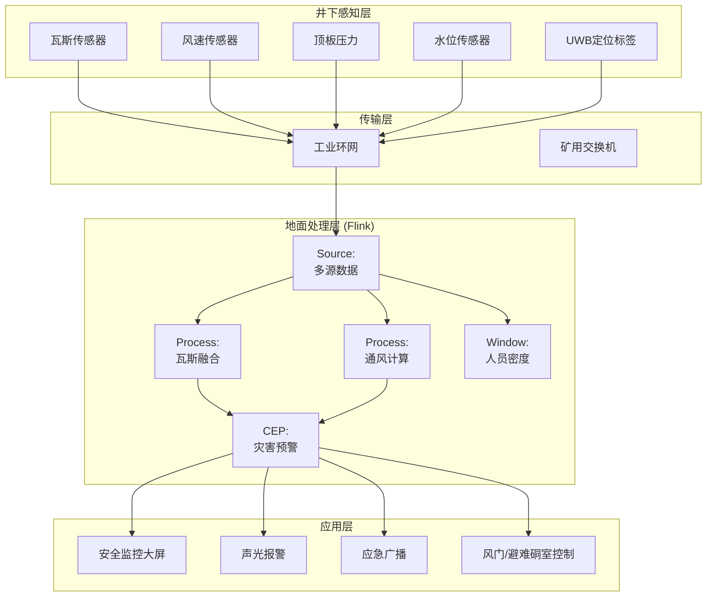
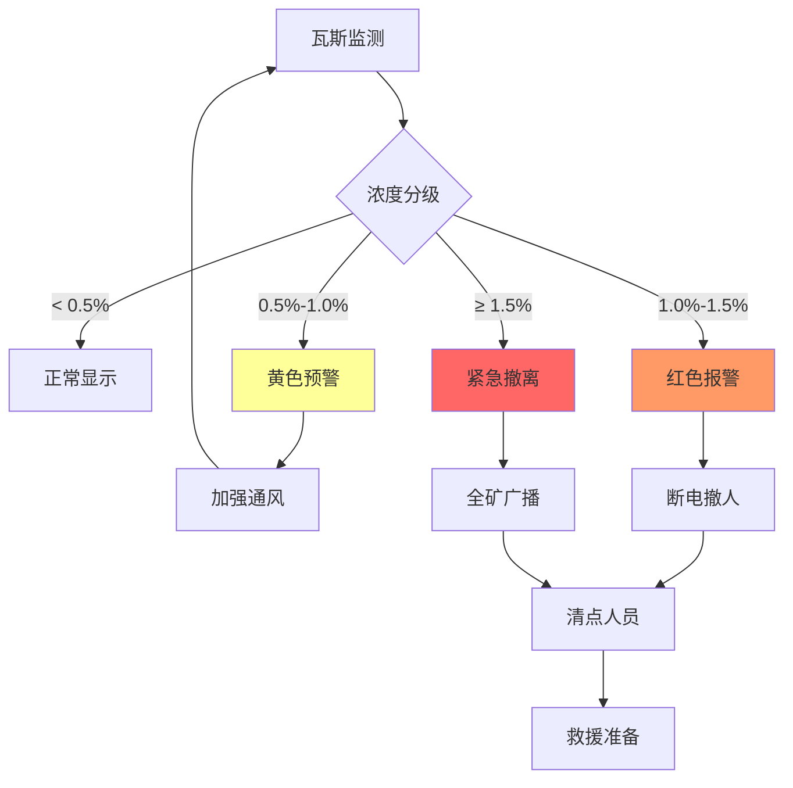
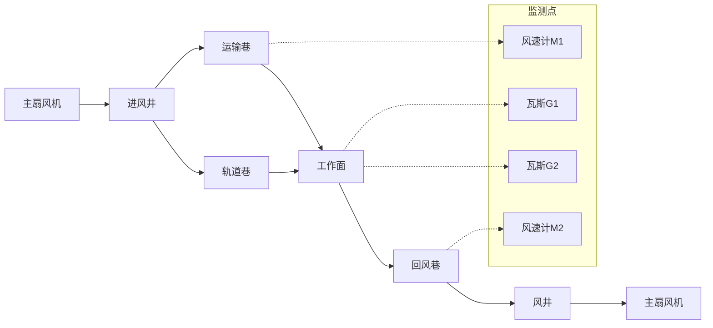

# 实时矿山安全监测与瓦斯预警案例研究

> 所属阶段: Knowledge/ Flink/ | 前置依赖: [算子全景分类](../01-concept-atlas/operator-deep-dive/01.06-single-input-operators.md) | [IoT流处理](../06-frontier/operator-iot-stream-processing.md) | 形式化等级: L4

## 1. 概念定义 (Definitions)

### Def-MNS-01-01: 矿山安全监测系统 (Mine Safety Monitoring System)

矿山安全监测系统是通过井下传感器网络、人员定位系统和流计算平台，对瓦斯浓度、通风状态、顶板压力、水文地质进行实时监测、风险预警与应急响应的集成系统。

$$\mathcal{M} = (G, V, R, W, P, F)$$

其中 $G$ 为瓦斯浓度数据流，$V$ 为通风参数流，$R$ 为顶板压力流，$W$ 为水文监测流，$P$ 为人员定位流，$F$ 为流计算处理拓扑。

### Def-MNS-01-02: 瓦斯爆炸极限 (Gas Explosion Limits)

瓦斯（主要成分为甲烷CH₄）在空气中的爆炸浓度范围：

$$LEL \leq C_{CH_4} \leq UEL$$

其中 $LEL = 5\%$（下限），$UEL = 15\%$（上限）。当浓度在5%-15%之间且存在点火源时，存在爆炸风险。

安全分级：

- $C_{CH_4} < 0.5\%$：正常作业
- $0.5\% \leq C_{CH_4} < 1.0\%$：预警，加强通风
- $1.0\% \leq C_{CH_4} < 1.5\%$：报警，停止作业
- $C_{CH_4} \geq 1.5\%$：紧急撤离

### Def-MNS-01-03: 通风等效风量 (Ventilation Equivalent Airflow)

通风等效风量是指稀释瓦斯至安全浓度所需的最小风量：

$$Q_{req} = \frac{100 \cdot Q_{gas}}{C_{allow} - C_{in}}$$

其中 $Q_{gas}$ 为瓦斯涌出量（m³/min），$C_{allow}$ 为允许瓦斯浓度（通常0.5%-1.0%），$C_{in}$ 为进风瓦斯浓度。

### Def-MNS-01-04: 顶板来压预警指数 (Roof Pressure Warning Index)

顶板来压预警指数综合液压支架工作阻力、顶板下沉速度和煤壁片帮程度：

$$RPWI = \alpha \cdot \frac{P_{actual}}{P_{yield}} + \beta \cdot \frac{v_{subsidence}}{v_{threshold}} + \gamma \cdot \frac{L_{spall}}{L_{normal}}$$

其中 $P_{actual}$ 为支架实际工作阻力，$P_{yield}$ 为支架额定工作阻力，$v_{subsidence}$ 为顶板下沉速度，$L_{spall}$ 为片帮深度。

### Def-MNS-01-05: 井下人员密度 (Underground Personnel Density)

井下人员密度定义为特定区域的实时人员数量与区域安全容量的比率：

$$Density = \frac{N_{personnel}}{N_{capacity}}$$

超密度（$Density > 1.0$）增加事故后果严重性，限制紧急撤离效率。

## 2. 属性推导 (Properties)

### Lemma-MNS-01-01: 瓦斯涌出量的时间序列特性

瓦斯涌出量 $Q_{gas}(t)$ 具有日周期性和采动影响特征：

$$Q_{gas}(t) = Q_{base} + Q_{periodic}(t) + Q_{mining}(t) + \epsilon(t)$$

其中 $Q_{periodic}(t)$ 为日周期分量（大气压变化引起），$Q_{mining}(t)$ 为采动增量（割煤时涌出量增加2-5倍），$\epsilon(t)$ 为随机扰动。

**证明**: 由瓦斯赋存理论，煤层瓦斯含量与地层压力正相关。大气压日变化引起瓦斯解吸量周期性波动。采煤机割煤暴露新鲜煤壁，瓦斯涌出量瞬时增大。

### Lemma-MNS-01-02: 通风网络风量分配的最优性

在通风网络中，各分支风量自然分配满足能量最小原理：

$$\min \sum_{i} R_i \cdot Q_i^2$$

约束条件：$\sum_{in} Q_j = \sum_{out} Q_k$（节点质量守恒）。

**证明**: 通风网络为流体网络，类比电路网络。由基尔霍夫定律和欧姆定律，风量分配使网络总风阻能耗最小。

### Prop-MNS-01-01: 多传感器瓦斯监测的置信度提升

当使用催化式、红外式、光纤式三种瓦斯传感器并行监测时，检测置信度：

$$CI_{fusion} = 1 - \prod_{i}(1 - CI_i)$$

**条件**: 各传感器原理不同（催化燃烧、红外吸收、光纤干涉），误差来源独立。催化式对高浓度饱和，红外式对低浓度精度不足，光纤式可全量程监测。

### Prop-MNS-01-02: 人员定位系统的逃生时间估算

在紧急撤离场景下，人员到达最近安全出口的时间：

$$T_{escape} = \frac{D_{max}}{v_{walk}} + T_{response}$$

其中 $D_{max}$ 为最远距离人员到出口的距离，$v_{walk}$ 为井下人员步行速度（~1.5 m/s），$T_{response}$ 为反应时间（听到警报到开始行动，通常30-60秒）。

## 3. 关系建立 (Relations)

### 与算子体系的映射

| 矿山安全场景 | Flink算子 | 算子作用 |
|------------|-----------|---------|
| 多源传感器接入 | `Union` + `SourceFunction` | 瓦斯/通风/顶板/水文统一接入 |
| 瓦斯浓度聚合 | `KeyedProcessFunction` | 按工作面键控，维护浓度历史 |
| 通风网络计算 | `ProcessFunction` | 风量平衡与阻力计算 |
| 来压预警 | `CEPPattern` | 支架阻力突增模式匹配 |
| 人员定位追踪 | `WindowAggregate` | 区域人员密度实时统计 |
| 应急响应 | `BroadcastStream` | 撤离指令广播到各区域 |

### 与安全生产法规的关联

- **煤矿安全规程**: 瓦斯浓度超限时必须停电撤人
- **GB 50471**: 煤炭工业矿井监测监控系统设计规范
- **AQ 1029**: 煤矿安全监控系统及检测仪器使用管理规范
- **MT/T 1004**: 煤矿安全生产监控系统通用技术条件

## 4. 论证过程 (Argumentation)

### 4.1 矿山安全监测的核心挑战

**挑战1: 井下恶劣环境**
高湿度（>95%RH）、高粉尘、高温度（采煤工作面>30°C）、强电磁干扰，传感器需具备防爆（Ex d I Mb）和本安（Ex ia I Ma）认证。

**挑战2: 传感器漂移与失效**
催化式瓦斯传感器零点漂移每月可达±0.1%CH₄，需定期校准。传感器失效（如中毒、堵塞）导致监测盲区。

**挑战3: 通风网络动态变化**
采掘推进导致通风网络拓扑持续变化，风门开关、密闭施工影响风量分配。静态通风模型无法反映动态实际。

**挑战4: 多灾害耦合**
瓦斯超限、透水、火灾、顶板事故可能连锁发生。例如，透水导致电气短路引发火灾，火灾引燃高浓度瓦斯区域。

### 4.2 方案选型论证

**为什么选用流计算而非传统安全监控系统？**

- 传统系统（如KJ95X）为秒级刷新，无法满足瓦斯超限的毫秒级响应需求
- 流计算支持复杂事件处理（多灾害耦合模式匹配）
- Flink的精确一次语义保证监测数据不丢失，满足事故追溯要求

**为什么选用Event Time处理监测数据？**

- 井下传感器通过工业以太环网传输，数据到达存在乱序
- Event Time保证即使在数据乱序时，瓦斯浓度时序仍正确
- Watermark机制容忍传感器偶发通信中断

## 5. 形式证明 / 工程论证 (Proof / Engineering Argument)

### Thm-MNS-01-01: 瓦斯积聚风险区域判定定理

在通风巷道中，若某区域风速低于最低允许风速 $v_{min}$ 且瓦斯涌出量 $Q_{gas} > 0$，则存在瓦斯积聚风险：

**定理**: 瓦斯积聚浓度上界：

$$C_{max} = \frac{Q_{gas}}{A \cdot v_{min}}$$

其中 $A$ 为巷道断面积。

**证明**:

1. 由质量守恒，单位时间内涌出瓦斯量 $Q_{gas}$（m³/min）
2. 单位时间内通过该区域的风量 $Q_{air} = A \cdot v_{min}$（m³/min）
3. 若 $Q_{air} < Q_{gas}/C_{allow}$，则瓦斯无法被充分稀释
4. 积聚浓度达到 $C_{max} = Q_{gas}/(A \cdot v_{min})$
5. 当 $C_{max} \geq LEL = 5\%$ 时，存在爆炸风险

**工程意义**: 风速不足是瓦斯积聚的主要原因。规程要求采煤工作面风速不低于0.25 m/s，回风巷不低于0.15 m/s。

## 6. 实例验证 (Examples)

### 6.1 瓦斯浓度实时监测与预警Pipeline

```java
// Real-time gas concentration monitoring and warning
StreamExecutionEnvironment env = StreamExecutionEnvironment.getExecutionEnvironment();
env.setStreamTimeCharacteristic(TimeCharacteristic.EventTime);

// Gas sensor readings from underground
DataStream<GasReading> gasReadings = env
    .addSource(new MineSensorSource("modbus://192.168.10.1:502"))
    .map(new GasParser())
    .assignTimestampsAndWatermarks(
        WatermarkStrategy.<GasReading>forBoundedOutOfOrderness(
            Duration.ofSeconds(5))
        .withTimestampAssigner((r, ts) -> r.getSensorTimestamp())
    );

// Multi-sensor fusion per working face
DataStream<FusedGasData> fusedGas = gasReadings
    .keyBy(r -> r.getWorkingFaceId())
    .window(TumblingEventTimeWindows.of(Time.seconds(10)))
    .aggregate(new GasFusionAggregation() {
        @Override
        public FusedGasData getResult(GasAccumulator acc) {
            // Weighted average by sensor reliability
            double weightedSum = 0;
            double totalWeight = 0;
            for (GasReading r : acc.readings) {
                double weight = getSensorWeight(r.getSensorType());
                weightedSum += r.getConcentration() * weight;
                totalWeight += weight;
            }
            return new FusedGasData(
                acc.workingFaceId,
                weightedSum / totalWeight,
                acc.readings.size(),
                acc.windowEnd
            );
        }

        private double getSensorWeight(String type) {
            switch (type) {
                case "OPTICAL_FIBER": return 1.0;
                case "INFRARED": return 0.9;
                case "CATALYTIC": return 0.7;
                default: return 0.5;
            }
        }
    });

// Warning level determination
DataStream<GasWarning> warnings = fusedGas
    .keyBy(f -> f.getWorkingFaceId())
    .process(new GasWarningFunction() {
        private static final double LEVEL_NORMAL = 0.5;
        private static final double LEVEL_WARNING = 1.0;
        private static final double LEVEL_ALARM = 1.5;

        @Override
        public void processElement(FusedGasData gas, Context ctx,
                                   Collector<GasWarning> out) {
            double concentration = gas.getConcentration();
            String level;
            String action;

            if (concentration >= LEVEL_ALARM) {
                level = "ALARM";
                action = "EMERGENCY_EVACUATION";
            } else if (concentration >= LEVEL_WARNING) {
                level = "WARNING";
                action = "STOP_OPERATION";
            } else if (concentration >= LEVEL_NORMAL) {
                level = "ATTENTION";
                action = "ENHANCE_VENTILATION";
            } else {
                return; // Normal, no warning
            }

            out.collect(new GasWarning(
                gas.getWorkingFaceId(), concentration, level, action, ctx.timestamp()
            ));
        }
    });

warnings.addSink(new EmergencyBroadcastSink());
```

### 6.2 通风网络实时平衡计算

```java
// Ventilation network real-time balance calculation
DataStream<AirflowReading> airflowReadings = env
    .addSource(new MineSensorSource("ventilation.anemometer"))
    .map(new AirflowParser());

DataStream<VentilationStatus> ventilationStatus = airflowReadings
    .keyBy(r -> r.getBranchId())
    .process(new VentilationBalanceFunction() {
        private ValueState<BranchParameters> branchState;

        @Override
        public void open(Configuration parameters) {
            branchState = getRuntimeContext().getState(
                new ValueStateDescriptor<>("branch", BranchParameters.class));
        }

        @Override
        public void processElement(AirflowReading reading, Context ctx,
                                   Collector<VentilationStatus> out) throws Exception {
            BranchParameters branch = branchState.value();
            if (branch == null) branch = new BranchParameters(reading.getBranchId());

            double resistance = branch.getResistance();
            double airflow = reading.getAirflow();
            double pressureDrop = resistance * airflow * airflow;

            // Check if airflow meets minimum requirement
            double minAirflow = branch.getMinAirflow();
            boolean adequate = airflow >= minAirflow;

            out.collect(new VentilationStatus(
                reading.getBranchId(), airflow, pressureDrop,
                adequate, reading.getTimestamp()
            ));

            // Alert if airflow insufficient
            if (!adequate) {
                ctx.output(lowAirflowTag, new VentilationAlert(
                    reading.getBranchId(), airflow, minAirflow, ctx.timestamp()
                ));
            }
        }
    });

ventilationStatus.getSideOutput(lowAirflowTag)
    .addSink(new VentilationControlSink());
```

### 6.3 人员定位与紧急撤离

```java
// Personnel positioning and emergency evacuation
DataStream<PositionUpdate> positionUpdates = env
    .addSource(new UwbSource("uwb.localization.system"))
    .map(new PositionParser())
    .assignTimestampsAndWatermarks(
        WatermarkStrategy.<PositionUpdate>forBoundedOutOfOrderness(
            Duration.ofSeconds(2))
    );

// Real-time personnel density per zone
DataStream<ZoneDensity> zoneDensity = positionUpdates
    .keyBy(p -> p.getZoneId())
    .window(TumblingEventTimeWindows.of(Time.seconds(5)))
    .aggregate(new DensityAggregationFunction());

// Emergency evacuation analysis
DataStream<EvacuationStatus> evacuationStatus = zoneDensity
    .keyBy(d -> d.getZoneId())
    .process(new EvacuationAnalysisFunction() {
        private ValueState<EmergencyPlan> emergencyState;

        @Override
        public void open(Configuration parameters) {
            emergencyState = getRuntimeContext().getState(
                new ValueStateDescriptor<>("emergency", EmergencyPlan.class));
        }

        @Override
        public void processElement(ZoneDensity density, Context ctx,
                                   Collector<EvacuationStatus> out) throws Exception {
            EmergencyPlan plan = emergencyState.value();
            if (plan == null) return;

            if (plan.isActive()) {
                // Calculate evacuation progress
                int initialCount = plan.getInitialCount(density.getZoneId());
                int currentCount = density.getPersonCount();
                double progress = initialCount > 0 ?
                    (initialCount - currentCount) / (double) initialCount : 1.0;

                // Estimate remaining time
                double escapeRate = plan.getEscapeRate(density.getZoneId());
                double remainingTime = escapeRate > 0 ?
                    currentCount / escapeRate : Double.MAX_VALUE;

                out.collect(new EvacuationStatus(
                    density.getZoneId(), currentCount, progress,
                    remainingTime, ctx.timestamp()
                ));

                // Alert if evacuation too slow
                if (remainingTime > plan.getMaxEvacuationTime()) {
                    ctx.output(slowEvacuationTag, new EvacuationAlert(
                        density.getZoneId(), remainingTime, ctx.timestamp()
                    ));
                }
            }
        }
    });

evacuationStatus.getSideOutput(slowEvacuationTag)
    .addSink(new EmergencyCommandSink());
```

## 7. 可视化 (Visualizations)

### 图1: 矿山安全监测架构



### 图2: 瓦斯浓度预警响应流程



### 图3: 通风网络拓扑



## 8. 引用参考 (References)
