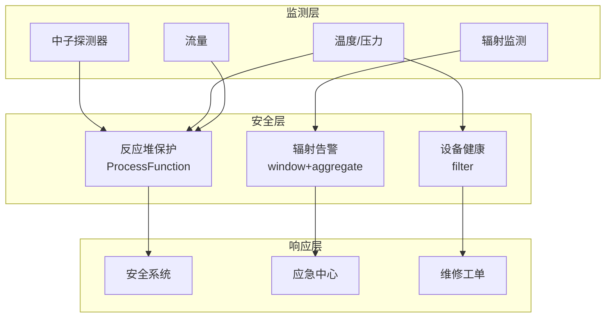

# 算子与实时核电站监控

> **所属阶段**: Knowledge/10-case-studies | **前置依赖**: [01.10-process-and-async-operators.md](../01-concept-atlas/operator-deep-dive/01.10-process-and-async-operators.md), [realtime-hydropower-monitoring-case-study.md](../10-case-studies/realtime-hydropower-monitoring-case-study.md) | **形式化等级**: L3
> **文档定位**: 流处理算子在实时核电站运行监控、辐射监测与安全系统响应中的算子指纹与Pipeline设计
> **版本**: 2026.04

---

## 目录

- [1. 概念定义 (Definitions)](#1-概念定义-definitions)
- [2. 属性推导 (Properties)](#2-属性推导-properties)
- [3. 关系建立 (Relations)](#3-关系建立-relations)
- [4. 论证过程 (Argumentation)](#4-论证过程-argumentation)
- [5. 形式证明 / 工程论证 (Proof / Engineering Argument)](#5-形式证明--工程论证-proof--engineering-argument)
- [6. 实例验证 (Examples)](#6-实例验证-examples)
- [7. 可视化 (Visualizations)](#7-可视化-visualizations)
- [8. 引用参考 (References)](#8-引用参考-references)

---

## 1. 概念定义 (Definitions)

### Def-NUC-01-01: 核电站安全系统（Nuclear Safety System）

核电站安全系统是保障核反应堆安全运行的多层防御体系：

$$\text{SafetySystem} = (\text{Prevention}, \text{Detection}, \text{Protection}, \text{Mitigation})$$

### Def-NUC-01-02: 反应性（Reactivity）

反应性是表征反应堆偏离临界状态程度的物理量：

$$\rho = \frac{k_{eff} - 1}{k_{eff}}$$

其中 $k_{eff}$ 为有效增殖因子。$\rho > 0$ 为超临界，$\rho < 0$ 为次临界，$\rho = 0$ 为临界。

### Def-NUC-01-03: 辐射剂量率（Radiation Dose Rate）

辐射剂量率是单位时间内接受的辐射剂量：

$$\dot{D} = \frac{dD}{dt}$$

单位：Sv/h（希沃特/小时）。公众限值：1mSv/年，工作人员限值：20mSv/年。

### Def-NUC-01-04: 安全壳完整性（Containment Integrity）

安全壳完整性是防止放射性物质泄漏的最后一道屏障：

$$I_{containment} = P_{design} - P_{actual} > 0 \land \text{LeakRate} < \text{Limit}$$

### Def-NUC-01-05: 冗余与多样性（Redundancy and Diversity）

安全系统采用冗余与多样性设计以确保可靠性：

$$R_{system} = 1 - \prod_{i}(1 - R_i)$$

四重冗余系统（$R_i = 0.99$）的整体可靠性 $R_{system} = 1 - 10^{-8}$。

---

## 2. 属性推导 (Properties)

### Lemma-NUC-01-01: 点堆中子动力学方程

$$\frac{dn}{dt} = \frac{\rho - \beta}{\Lambda} n + \sum_{i} \lambda_i C_i$$

其中 $n$ 为中子密度，$\beta$ 为缓发中子份额，$\Lambda$ 为中子代时间，$C_i$ 为第 $i$ 组缓发中子先驱核浓度。

### Lemma-NUC-01-02: 衰变热功率

停堆后衰变热功率：

$$P_{decay}(t) = 0.066 \cdot P_0 \cdot \left(\frac{t}{t_0}\right)^{-0.2}$$

其中 $P_0$ 为额定功率，$t$ 为停堆时间（秒）。

### Prop-NUC-01-01: 安全系统响应时间

| 安全功能 | 探测时间 | 执行时间 | 总响应时间 |
|---------|---------|---------|----------|
| 紧急停堆 | 10ms | 100ms | < 1s |
| 安全注入 | 100ms | 5s | < 10s |
| 安全壳喷淋 | 1s | 30s | < 1min |
| 应急堆芯冷却 | 1s | 10s | < 30s |

### Prop-NUC-01-02: 单一故障准则

$$P_{failure} < 10^{-3}/demand$$

任何单一设备故障不得导致安全功能丧失。

---

## 3. 关系建立 (Relations)

### 3.1 核电站监控Pipeline算子映射

| 应用场景 | 算子组合 | 数据源 | 延迟要求 |
|---------|---------|--------|---------|
| **中子通量监测** | Source + map | 中子探测器 | < 10ms |
| **辐射监测** | window+aggregate | 辐射探测器 | < 1s |
| **安全系统触发** | ProcessFunction + Timer | 保护参数 | < 100ms |
| **设备健康** | AsyncFunction | 振动/温度 | < 1min |
| **人员剂量** | KeyedProcessFunction | 个人剂量计 | < 1min |
| **应急指挥** | Broadcast + ProcessFunction | 应急指令 | < 5s |

### 3.2 算子指纹

| 维度 | 核电站监控特征 |
|------|------------|
| **核心算子** | ProcessFunction（安全保护逻辑）、AsyncFunction（设备诊断）、BroadcastProcessFunction（应急指令）、KeyedProcessFunction（人员跟踪） |
| **状态类型** | ValueState（反应堆状态）、MapState（设备健康）、BroadcastState（保护定值） |
| **时间语义** | 处理时间（安全系统毫秒级响应） |
| **数据特征** | 极高可靠性要求、强监管、数据敏感 |
| **状态热点** | 反应堆Key、安全系统Key |
| **性能瓶颈** | 安全逻辑验证、外部监管上报 |

---

## 4. 论证过程 (Argumentation)

### 4.1 为什么核电需要流处理而非传统DCS

传统DCS的问题：
- 扫描周期固定：通常为100ms-1s，无法捕捉瞬态
- 硬接线逻辑：变更困难，灵活性差
- 数据孤岛：各系统独立，综合分析困难

流处理的优势：
- 毫秒级响应：满足安全系统响应时间要求
- 软件化逻辑：保护算法可快速迭代验证
- 统一分析：多系统数据实时融合分析

### 4.2 网络安全与物理隔离

**问题**: 核设施网络安全要求极高，流处理系统如何部署？

**方案**:
1. **物理隔离**: 安全级网络与非安全级网络物理隔离
2. **单向传输**: 数据只允许从安全级向非安全级单向流动
3. **独立验证**: 所有算法在独立验证平台上确认后才部署

### 4.3 瞬态工况识别

**场景**: 冷却剂丧失事故（LOCA）初期特征不明显。

**流处理方案**: 多参数联合监测（压力+流量+温度）→ CEP模式识别 → 自动触发保护。

---

## 5. 形式证明 / 工程论证 (Proof / Engineering Argument)

### 5.1 安全保护系统

```java
public class ReactorProtectionSystem extends KeyedProcessFunction<String, ProcessParameter, SafetyAction> {
    private ValueState<ReactorState> reactorState;
    
    @Override
    public void processElement(ProcessParameter param, Context ctx, Collector<SafetyAction> out) throws Exception {
        ReactorState state = reactorState.value();
        if (state == null) state = new ReactorState();
        
        state.update(param);
        
        // 紧急停堆信号（反应堆跳闸）
        if (param.getNeutronFlux() > 1.2 * state.getNominalFlux() ||  // 高中子通量
            param.getPressurizerPressure() < 12.0 ||                   // 低压
            param.getCoreDeltaT() > 50.0) {                           // 高ΔT
            out.collect(new SafetyAction("SCRAM", "HIGH_NEUTRON_FLUX", ctx.timestamp()));
        }
        
        // 安全注入信号
        if (param.getPressurizerPressure() < 11.0 && 
            param.getCoreCoolantFlow() < 0.8 * state.getNominalFlow()) {
            out.collect(new SafetyAction("SAFETY_INJECTION", "LOCA", ctx.timestamp()));
        }
        
        // 安全壳隔离
        if (param.getContainmentPressure() > 0.3) {
            out.collect(new SafetyAction("CONTAINMENT_ISOLATION", "HIGH_PRESSURE", ctx.timestamp()));
        }
        
        reactorState.update(state);
    }
}
```

### 5.2 辐射实时监测

```java
// 辐射探测器数据
DataStream<RadiationReading> radiation = env.addSource(new RadiationMonitorSource());

// 区域剂量率监测
radiation.keyBy(RadiationReading::getZoneId)
    .window(SlidingProcessingTimeWindows.of(Time.minutes(1), Time.seconds(10)))
    .aggregate(new DoseRateAggregate())
    .process(new ProcessFunction<DoseRate, RadiationAlert>() {
        @Override
        public void processElement(DoseRate rate, Context ctx, Collector<RadiationAlert> out) {
            double doseRate = rate.getDoseRate();  // mSv/h
            
            if (doseRate > 100) {
                out.collect(new RadiationAlert(rate.getZoneId(), "CRITICAL", doseRate, ctx.timestamp()));
            } else if (doseRate > 10) {
                out.collect(new RadiationAlert(rate.getZoneId(), "HIGH", doseRate, ctx.timestamp()));
            } else if (doseRate > 2.5) {
                out.collect(new RadiationAlert(rate.getZoneId(), "ELEVATED", doseRate, ctx.timestamp()));
            }
        }
    })
    .addSink(new RadiationDashboardSink());
```

---

## 6. 实例验证 (Examples)

### 6.1 实战：核电站综合监控系统

```java
// 1. 多参数接入
DataStream<ProcessParameter> process = env.addSource(new NuclearPlantSource());
DataStream<RadiationReading> radiation = env.addSource(new RadiationMonitorSource());

// 2. 安全保护
process.keyBy(ProcessParameter::getSystemId)
    .process(new ReactorProtectionSystem())
    .addSink(new SafetyActionSink());

// 3. 辐射监测
radiation.keyBy(RadiationReading::getZoneId)
    .window(SlidingProcessingTimeWindows.of(Time.minutes(1), Time.seconds(10)))
    .aggregate(new DoseRateAggregate())
    .addSink(new RadiationDashboardSink());

// 4. 设备健康
DataStream<EquipmentHealth> health = env.addSource(new EquipmentSource());
health.filter(h -> h.getHealthIndex() < 0.7)
    .addSink(new MaintenanceAlertSink());
```

---

## 7. 可视化 (Visualizations)

### 核电站监控Pipeline



---

## 8. 引用参考 (References)

[^1]: IAEA, "Nuclear Safety Standards", https://www.iaea.org/

[^2]: NRC, "Reactor Safety Study (WASH-1400)", https://www.nrc.gov/

[^3]: Wikipedia, "Nuclear Reactor Safety Systems", https://en.wikipedia.org/wiki/Nuclear_reactor_safety_system

[^4]: Wikipedia, "Containment Building", https://en.wikipedia.org/wiki/Containment_building

[^5]: Apache Flink Documentation, "ProcessFunction", https://nightlies.apache.org/flink/flink-docs-stable/docs/dev/datastream/operators/process_function/

[^6]: IEEE, "Digital Instrumentation and Control Systems in Nuclear Power Plants", 2023.

---

*关联文档*: [01.10-process-and-async-operators.md](../01-concept-atlas/operator-deep-dive/01.10-process-and-async-operators.md) | [realtime-hydropower-monitoring-case-study.md](../10-case-studies/realtime-hydropower-monitoring-case-study.md) | [operator-chaos-engineering-and-resilience.md](../07-best-practices/operator-chaos-engineering-and-resilience.md)
