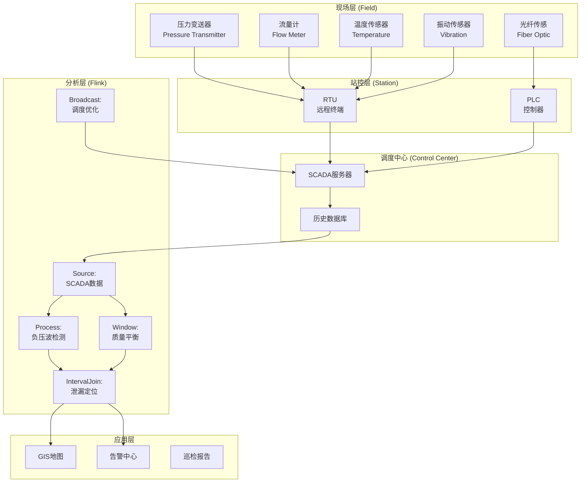
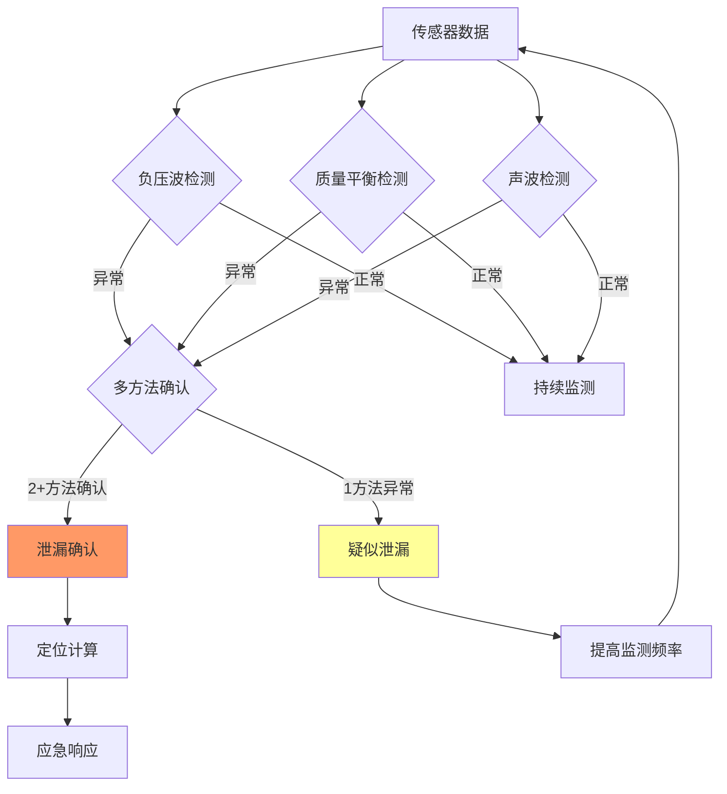
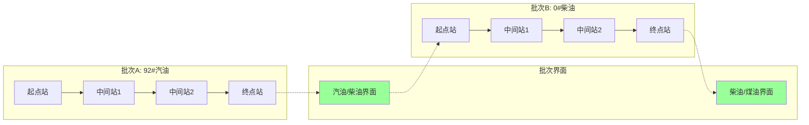

# 实时石油天然气管道监控案例研究

> 所属阶段: Knowledge/ Flink/ | 前置依赖: [算子全景分类](../01-concept-atlas/operator-deep-dive/01.06-single-input-operators.md) | [IoT流处理](../06-frontier/operator-iot-stream-processing.md) | 形式化等级: L4

## 1. 概念定义 (Definitions)

### Def-OGP-01-01: 油气管道实时监控系统 (Oil & Gas Pipeline Real-time Monitoring System)

油气管道实时监控系统是通过沿程部署的传感器网络、SCADA系统和流计算平台，对管道压力、流量、温度、振动进行连续监测，实现泄漏检测、异常预警与调度优化的集成系统。

$$\mathcal{G} = (P, F, T, V, F_{calc})$$

其中 $P$ 为压力监测数据流，$F$ 为流量数据流，$T$ 为温度数据流，$V$ 为振动/声波数据流，$F_{calc}$ 为流计算处理拓扑。

### Def-OGP-01-02: 泄漏检测灵敏度 (Leak Detection Sensitivity)

泄漏检测灵敏度定义为系统可识别的最小泄漏量相对于管道输送量的比例：

$$Sensitivity = \frac{Q_{leak\_min}}{Q_{normal}} \cdot 100\%$$

行业典型指标：

- **质量平衡法**: $Sensitivity \approx 1\%$-3%
- **负压波法**: $Sensitivity \approx 0.5\%$-1%
- **声波法**: $Sensitivity \approx 0.1\%$-0.5%
- **分布式光纤**: $Sensitivity \approx 0.01\%$-0.1%

### Def-OGP-01-03: 泄漏定位精度 (Leak Localization Accuracy)

泄漏定位精度指系统估计的泄漏点位置与实际泄漏点之间的最大允许偏差：

$$Accuracy = |X_{estimated} - X_{actual}|$$

负压波法的定位公式：

$$X_{leak} = \frac{L + v_{wave} \cdot (t_{upstream} - t_{downstream})}{2}$$

其中 $L$ 为两监测站间距，$v_{wave}$ 为压力波传播速度（~1000-1400 m/s for oil），$t_{upstream}, t_{downstream}$ 为压力波到达上下游监测站的时间。

### Def-OGP-01-04: 管道输送效率 (Pipeline Throughput Efficiency)

管道输送效率衡量实际输送量与设计输送能力的比率：

$$\eta = \frac{Q_{actual}}{Q_{design}} \cdot 100\%$$

效率下降的主要原因：

- **管壁结蜡**: 原油中含蜡在管壁沉积，减小有效管径
- **水合物堵塞**: 天然气管道中水合物形成冰堵
- **腐蚀坑蚀**: 内腐蚀导致管壁粗糙度增加

### Def-OGP-01-05: 第三方破坏预警半径 (Third-party Damage Warning Radius)

第三方破坏预警半径是指以管道为中心，需对机械施工活动进行监控的缓冲区域：

$$R_{warn} = v_{excavator} \cdot T_{response} + R_{safety}$$

其中 $v_{excavator}$ 为挖掘机最大移动速度（~5 km/h），$T_{response}$ 为从预警到管道保护人员到达的时间，$R_{safety}$ 为安全余量（通常50-100m）。

## 2. 属性推导 (Properties)

### Lemma-OGP-01-01: 负压波泄漏检测的时延边界

负压波从泄漏点传播到最近监测站的最大时延：

$$\Delta t_{max} = \frac{L_{station}}{v_{wave}}$$

其中 $L_{station}$ 为最大监测站间距。

**工程约束**: 若 $L_{station} = 20$ km，$v_{wave} = 1200$ m/s，则 $\Delta t_{max} \approx 16.7$ s。即泄漏发生后约17秒内可被检测到。

### Lemma-OGP-01-02: 质量平衡法的检测盲区

在管道启停输、批次切换等瞬态工况下，质量平衡法的检测盲区：

$$Blind_{volume} = \int_{t_1}^{t_2} |Q_{in}(t) - Q_{out}(t)| \cdot dt$$

**证明**: 瞬态工况下，管道内流体压缩性导致入口流量与出口流量存在显著差异，此差异被误判为泄漏。盲区持续时间取决于管道容积和瞬态强度。

### Prop-OGP-01-01: 多方法融合的检测完备性

当使用负压波+质量平衡+声波三种方法融合时，泄漏检测的完备性优于单一方法：

$$P_{detect}^{fusion} = 1 - \prod_{i}(1 - P_{detect}^{i})$$

**条件**: 各方法的漏检条件需弱相关。负压波法对小泄漏敏感但受压力波动干扰；质量平衡法对大泄漏可靠但存在瞬态盲区；声波法对孔洞泄漏敏感但受背景噪声影响。

### Prop-OGP-01-02: 管道腐蚀速率的预测下界

基于在线腐蚀监测数据的腐蚀速率预测误差下界：

$$\epsilon_{corrosion} \geq \frac{\sigma_{measurement}}{\sqrt{N_{samples}}}$$

其中 $\sigma_{measurement}$ 为腐蚀探针测量误差，$N_{samples}$ 为样本数。

**论证**: 由中心极限定理，腐蚀速率的估计精度随样本数增加而提高，但受测量精度限制。高频监测（每日采样）比低频检测（年度内检测）可显著提升预测精度。

## 3. 关系建立 (Relations)

### 与算子体系的映射

| 油气管道场景 | Flink算子 | 算子作用 |
|------------|-----------|---------|
| SCADA数据接入 | `SourceFunction` | 从SCADA实时接入压力/流量/温度 |
| 压力波检测 | `ProcessFunction` | 压力突变检测与波形分析 |
| 质量平衡计算 | `WindowAggregate` | 滑动窗口内入口-出口质量平衡 |
| 泄漏定位 | `IntervalJoin` | 上下游压力波到达时间Join |
| 异常模式 | `CEPPattern` | 压力下降+流量异常模式匹配 |
| 腐蚀预测 | `KeyedProcessFunction` | 按管段键控，维护腐蚀历史状态 |
| 调度优化 | `BroadcastStream` | 压缩机组调度规则广播 |

### 与行业标准的关联

- **API 1130**: 管道泄漏检测系统设计与运行标准
- **API 1165**: 管道SCADA系统显示标准
- **ASME B31.8**: 燃气管道设计标准
- **NACE SP0502**: 管道外腐蚀直接评估标准
- **GB 50253**: 输油管道工程设计规范
- **GB 50251**: 输气管道工程设计规范

## 4. 论证过程 (Argumentation)

### 4.1 油气管道监控的核心挑战

**挑战1: 极端环境条件**
长输管道穿越沙漠、冻土、沼泽、山区等多种地形，传感器需在-40°C至+60°C温度范围、高湿度、高盐雾环境下可靠工作。

**挑战2: 检测灵敏度的矛盾**
高灵敏度（<0.1%）可减少泄漏损失和环境影响，但也会增加误报率。需在灵敏度与可用性之间权衡。

**挑战3: 长距离通信可靠性**
西气东输管道长达4000+ km，监测站通信依赖光纤或卫星。通信中断期间的数据缺失影响泄漏检测连续性。

**挑战4: 多批次混输的复杂性**
成品油管道同一管道内顺序输送多种油品（汽油/柴油/煤油），批次界面追踪和质量监控增加了流计算复杂度。

### 4.2 方案选型论证

**为什么选用流计算而非传统SCADA？**

- 传统SCADA为秒级刷新，无法满足泄漏检测的毫秒级压力波分析需求
- 流计算支持复杂事件处理（压力波模式匹配、多传感器融合），SCADA缺乏此能力
- Flink的精确一次语义保证监测数据不丢失

**为什么选用Event Time处理SCADA数据？**

- SCADA系统分布在广阔地域，数据汇聚存在显著延迟
- Event Time保证即使在数据乱序时，压力波传播时序仍正确
- Watermark机制容忍通信偶发中断

## 5. 形式证明 / 工程论证 (Proof / Engineering Argument)

### Thm-OGP-01-01: 负压波泄漏定位精度定理

在压力波传播速度 $v_{wave}$ 和到达时间测量误差 $\delta t$ 已知时，泄漏定位精度满足：

$$Accuracy \leq \frac{v_{wave} \cdot \delta t}{2}$$

**证明**:

1. 定位公式 $X_{leak} = \frac{L + v_{wave} \cdot \Delta t}{2}$，其中 $\Delta t = t_{upstream} - t_{downstream}$
2. 时间测量误差 $\delta t$ 导致定位误差 $\delta X = \frac{v_{wave} \cdot \delta t}{2}$
3. 时间戳精度为1ms时，$\delta X = \frac{1200 \cdot 0.001}{2} = 0.6$m
4. 实际中还需考虑 $v_{wave}$ 的不确定性（受温度、油品密度影响），总精度通常在 ±50m 以内

**工程意义**: 监测站间距 $L$ 越短，定位精度越高，但建设成本增加。最优间距需在精度与成本间权衡，通常取15-30 km。

## 6. 实例验证 (Examples)

### 6.1 管道压力监测与泄漏检测Pipeline

```java
// Pipeline pressure monitoring and leak detection
StreamExecutionEnvironment env = StreamExecutionEnvironment.getExecutionEnvironment();
env.setStreamTimeCharacteristic(TimeCharacteristic.EventTime);

// SCADA pressure readings from multiple stations
DataStream<PressureReading> pressureStream = env
    .addSource(new ScadaSource("opc.tcp://scada.pipeline:4840"))
    .map(new PressureParser())
    .assignTimestampsAndWatermarks(
        WatermarkStrategy.<PressureReading>forBoundedOutOfOrderness(
            Duration.ofMillis(100))
        .withTimestampAssigner((r, ts) -> r.getTimestamp())
    );

// Negative pressure wave detection
DataStream<PressureWaveEvent> waveEvents = pressureStream
    .keyBy(r -> r.getStationId())
    .process(new PressureWaveDetector() {
        private ValueState<PressureHistory> historyState;
        private static final double WAVE_THRESHOLD = 0.05; // 5% pressure drop
        private static final long WAVE_DURATION_MS = 500; // 500ms wave

        @Override
        public void open(Configuration parameters) {
            historyState = getRuntimeContext().getState(
                new ValueStateDescriptor<>("pressure-history", PressureHistory.class));
        }

        @Override
        public void processElement(PressureReading reading, Context ctx,
                                   Collector<PressureWaveEvent> out) throws Exception {
            PressureHistory history = historyState.value();
            if (history == null) {
                history = new PressureHistory(reading.getStationId());
            }

            history.addReading(reading);

            // Detect sudden pressure drop
            double pressureChange = history.getPressureChange();
            double baselinePressure = history.getBaselinePressure();

            if (Math.abs(pressureChange) / baselinePressure > WAVE_THRESHOLD) {
                // Check if this is a wave front (rapid change followed by stabilization)
                if (history.isWaveFront()) {
                    out.collect(new PressureWaveEvent(
                        reading.getStationId(), reading.getPressure(),
                        pressureChange, reading.getTimestamp(),
                        pressureChange < 0 ? "DROPOUT" : "SURGE"
                    ));
                }
            }

            historyState.update(history);
        }
    });

// Mass balance calculation between stations
DataStream<MassBalance> massBalance = pressureStream
    .keyBy(r -> r.getSegmentId())
    .window(TumblingEventTimeWindows.of(Time.seconds(30)))
    .aggregate(new MassBalanceAggregation());

// Leak alarm generation by combining methods
DataStream<LeakAlarm> leakAlarms = waveEvents
    .keyBy(e -> e.getSegmentId())
    .intervalJoin(massBalance.keyBy(m -> m.getSegmentId()))
    .between(Time.seconds(-30), Time.seconds(30))
    .process(new LeakConfirmationFunction() {
        @Override
        public void processElement(PressureWaveEvent wave, MassBalance balance,
                                   Collector<LeakAlarm> out) {
            // Confirm leak if both methods indicate anomaly
            boolean pressureAnomaly = wave.getChangePercent() < -5.0;
            boolean massAnomaly = Math.abs(balance.getImbalance()) > balance.getThreshold();

            if (pressureAnomaly && massAnomaly) {
                out.collect(new LeakAlarm(
                    wave.getSegmentId(), "CONFIRMED",
                    wave.getPressure(), balance.getImbalance(),
                    wave.getTimestamp()
                ));
            } else if (pressureAnomaly || massAnomaly) {
                out.collect(new LeakAlarm(
                    wave.getSegmentId(), "SUSPECTED",
                    wave.getPressure(), balance.getImbalance(),
                    wave.getTimestamp()
                ));
            }
        }
    });

leakAlarms.addSink(new EmergencyResponseSink());
```

### 6.2 泄漏定位计算

```java
// Leak localization using pressure wave arrival times
DataStream<PressureWaveEvent> upstreamWaves = waveEvents
    .filter(e -> e.getStationType().equals("UPSTREAM"));

DataStream<PressureWaveEvent> downstreamWaves = waveEvents
    .filter(e -> e.getStationType().equals("DOWNSTREAM"));

DataStream<LeakLocation> leakLocations = upstreamWaves
    .keyBy(e -> e.getSegmentId())
    .intervalJoin(downstreamWaves.keyBy(e -> e.getSegmentId()))
    .between(Time.seconds(-60), Time.seconds(60))
    .process(new LeakLocalizationFunction() {
        private static final double WAVE_SPEED = 1200; // m/s for crude oil

        @Override
        public void processElement(PressureWaveEvent upWave,
                                   PressureWaveEvent downWave,
                                   Collector<LeakLocation> out) {
            long timeDiff = upWave.getTimestamp() - downWave.getTimestamp();
            double segmentLength = upWave.getSegmentLength(); // meters

            // X_leak = (L + v * (t_up - t_down)) / 2
            double leakPosition = (segmentLength + WAVE_SPEED * timeDiff / 1000.0) / 2.0;

            // Validate: position should be within segment
            if (leakPosition >= 0 && leakPosition <= segmentLength) {
                double accuracy = Math.abs(WAVE_SPEED * 0.001 / 2); // ±0.6m for 1ms precision

                out.collect(new LeakLocation(
                    upWave.getSegmentId(), leakPosition, accuracy,
                    upWave.getTimestamp(), downWave.getTimestamp()
                ));
            }
        }
    });

leakLocations.addSink(new GisDisplaySink());
```

### 6.3 压缩机站能效优化

```java
// Compressor station energy efficiency optimization
DataStream<CompressorStatus> compressorData = env
    .addSource(new ScadaSource("compressor.station.data"))
    .map(new CompressorParser());

DataStream<FlowDemand> demandForecast = env
    .addSource(new KafkaSource<>("pipeline.demand.forecast"));

// Optimize compressor setpoints
DataStream<CompressorSetpoint> setpoints = compressorData
    .keyBy(c -> c.getStationId())
    .connect(demandForecast.keyBy(d -> d.getStationId()))
    .process(new CompressorOptimizationFunction() {
        private ValueState<StationConfig> configState;

        @Override
        public void open(Configuration parameters) {
            configState = getRuntimeContext().getState(
                new ValueStateDescriptor<>("config", StationConfig.class));
        }

        @Override
        public void processElement1(CompressorStatus status, Context ctx,
                                   Collector<CompressorSetpoint> out) throws Exception {
            StationConfig config = configState.value();
            if (config == null) config = new StationConfig();

            // Calculate optimal suction/discharge pressure
            double currentEfficiency = status.getEfficiency();
            double targetFlow = config.getTargetFlow();

            // Surge margin: keep away from surge line
            double surgeMargin = (status.getFlowRate() - status.getSurgeFlow())
                               / status.getSurgeFlow();

            if (surgeMargin < 0.1) {
                // Too close to surge, increase flow or reduce speed
                out.collect(new CompressorSetpoint(
                    status.getStationId(), status.getSpeed() * 1.05,
                    status.getSuctionPressure(), status.getDischargePressure() * 0.98,
                    "SURGE_PROTECTION"
                ));
            } else if (currentEfficiency < 0.75) {
                // Low efficiency, optimize operating point
                double optimalSpeed = calculateOptimalSpeed(status, config);
                out.collect(new CompressorSetpoint(
                    status.getStationId(), optimalSpeed,
                    status.getSuctionPressure(), status.getDischargePressure(),
                    "EFFICIENCY_OPTIMIZATION"
                ));
            }

            configState.update(config);
        }

        @Override
        public void processElement2(FlowDemand demand, Context ctx,
                                   Collector<CompressorSetpoint> out) throws Exception {
            StationConfig config = configState.value();
            if (config == null) config = new StationConfig();
            config.setTargetFlow(demand.getForecastedFlow());
            configState.update(config);
        }

        private double calculateOptimalSpeed(CompressorStatus status, StationConfig config) {
            // Simplified: use compressor map to find best efficiency point
            // Actual implementation would query compressor performance curves
            return status.getSpeed() * (config.getTargetFlow() / status.getFlowRate());
        }
    });

setpoints.addSink(new ScadaControlSink());
```

## 7. 可视化 (Visualizations)

### 图1: 油气管道实时监控架构



### 图2: 泄漏检测多方法融合决策



### 图3: 管道批次追踪界面



## 8. 引用参考 (References)
