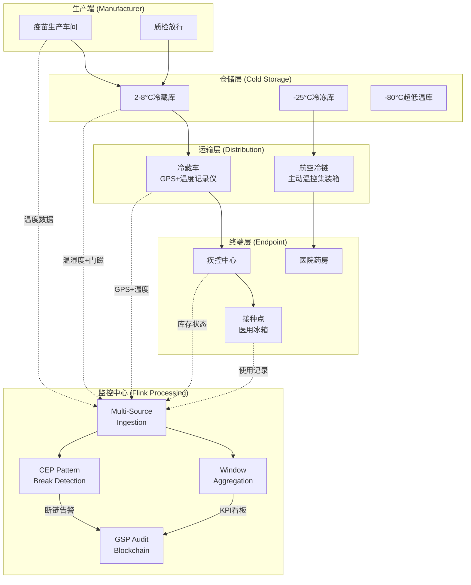
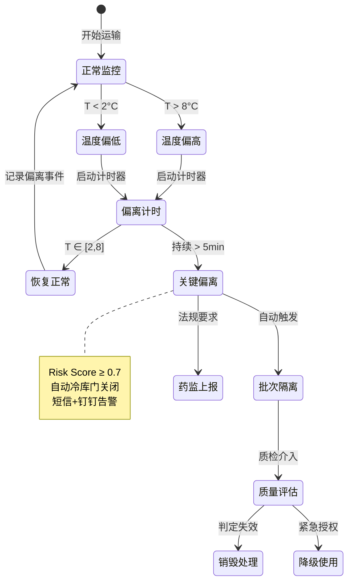
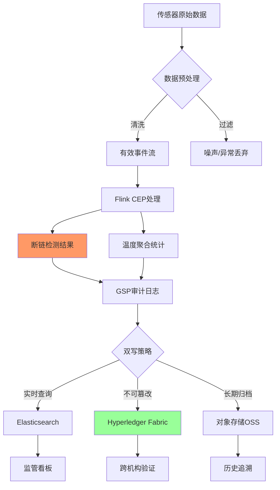

# 实时医药冷链物流监控案例研究

> 所属阶段: Knowledge/ Flink/ | 前置依赖: [算子全景分类](../01-concept-atlas/operator-deep-dive/01.06-single-input-operators.md) | [IoT流处理](../06-frontier/operator-iot-stream-processing.md) | 形式化等级: L4

## 1. 概念定义 (Definitions)

### Def-PHM-01-01: 医药冷链 (Pharmaceutical Cold Chain)

医药冷链是指对温度敏感药品（疫苗、生物制剂、血液制品、胰岛素等）从生产、仓储、运输到终端使用的全过程中，维持规定温度范围的连续保障系统。

$$\mathcal{C} = (P, T, H, L, R)$$

其中 $P$ 为药品批次集合，$T$ 为温度监控数据流，$H$ 为湿度监控数据流，$L$ 为地理位置数据流，$R$ 为合规记录流。

### Def-PHM-01-02: 温度偏离事件 (Temperature Excursion Event)

温度偏离事件指药品所处环境温度超出规定范围且持续超过允许阈值：

$$Excursion(p, t) \iff \exists \tau \in [t, t + \delta_{max}]: T_{ambient}(p, \tau) \notin [T_{min}, T_{max}]$$

其中 $\delta_{max}$ 为最大允许偏离时长，因药品类型而异：

- 疫苗: $\delta_{max} = 5$ 分钟（2-8°C范围）
- 胰岛素: $\delta_{max} = 30$ 分钟（2-8°C范围）
- 冷冻血浆: $\delta_{max} = 10$ 分钟（-25°C至-15°C范围）

### Def-PHM-01-03: 断链风险评分 (Cold Chain Break Risk Score)

断链风险评分综合温度偏离严重度、偏离时长、药品价值三个维度：

$$Risk(p, t) = \alpha \cdot \frac{T_{ambient}(t) - T_{threshold}}{T_{range}} + \beta \cdot \frac{\delta_{actual}}{\delta_{max}} + \gamma \cdot \frac{V_{drug}}{V_{max}}$$

其中 $\alpha + \beta + \gamma = 1$，$V_{drug}$ 为药品批次价值，$T_{threshold}$ 为最近临界温度。

风险等级划分：

- $Risk < 0.3$：低风险，记录备案
- $0.3 \leq Risk < 0.7$：中风险，通知质控人员
- $Risk \geq 0.7$：高风险，立即隔离批次 + 上报药监

### Def-PHM-01-04: GSP合规窗口 (GSP Compliance Window)

GSP(药品经营质量管理规范)要求药品流通全过程数据可追溯。合规窗口定义为数据记录必须被审计系统捕获的最大延迟：

$$\Delta_{GSP} \leq 1\ \text{minute}$$

即任何温度/湿度/位置事件发生后，必须在1分钟内进入不可篡改的审计日志。

### Def-PHM-01-05: 近效期批次 (Near-Expiry Batch)

近效期指距离药品有效期剩余时间低于安全阈值的批次：

$$NearExpiry(p, t) \iff T_{expiry}(p) - t \leq \Delta_{safety}$$

其中 $\Delta_{safety}$ 通常为有效期的10%或固定30天（取较小值）。近效期批次需优先出库（FEFO: First Expired First Out）。

## 2. 属性推导 (Properties)

### Lemma-PHM-01-01: 温度采样定理（冷链版）

为确保不遗漏温度偏离事件，温度传感器采样频率需满足：

$$f_{sample} \geq \frac{2}{\delta_{max}}$$

**证明**: 若采样间隔 $\Delta t = 1/f_{sample} > \delta_{max}/2$，则存在某温度脉冲宽度 $\leq \delta_{max}$ 完全落入两个采样点之间，导致漏检。由奈奎斯特采样定理推广得证。

**工程约束**: 疫苗 $\delta_{max}=5$min，则 $f_{sample} \geq 0.4$ Hz（即每75秒至少采样1次）。实际部署采用 $f_{sample} = 1$ Hz（每分钟1次）以留裕量。

### Lemma-PHM-01-02: 断链检测的误报率上界

在温度传感器测量误差 $\epsilon_T$ 服从 $N(0, \sigma_T^2)$ 的条件下，误报率上界为：

$$P_{false} \leq 2 \cdot Q\left(\frac{\Delta_{margin}}{\sigma_T}\right)$$

其中 $\Delta_{margin}$ 为温度告警触发余量（如阈值为8°C，触发设为7.5°C，则余量0.5°C），$Q(\cdot)$ 为Q函数。

**证明**: 误报发生在真实温度在安全范围内但测量值超出告警阈值时。由正态分布对称性，两侧超出概率各为 $Q(\Delta_{margin}/\sigma_T)$。

### Prop-PHM-01-01: FEFO出库的最优性

在库存容量有限且药品需求平稳的条件下，FEFO（先到期先出）策略最小化过期损耗：

$$\min \sum_{p} \mathbb{1}_{[T_{expiry}(p) < T_{out}(p)]} \cdot Q_{remaining}(p)$$

**论证**: FEFO确保每次出库选择当前库存中有效期最近的批次。反证：若某次出库未选择最近效期批次，则存在一近效期批次 $p_1$ 被延迟出库，增加 $p_1$ 过期风险。因此任何非FEFO策略的过期损耗期望 $\geq$ FEFO策略。

### Prop-PHM-01-02: 多传感器融合的置信度提升

当使用温度+湿度+震动+门磁多传感器融合时，断链检测的置信度优于单温度传感器：

$$Confidence_{fusion} = 1 - \prod_{i}(1 - Confidence_i) \geq \max_i(Confidence_i)$$

**条件**: 各传感器告警条件独立（即温度偏离与门磁开启为独立事件）。

## 3. 关系建立 (Relations)

### 与算子体系的映射

| 冷链监控场景 | Flink算子 | 算子作用 |
|------------|-----------|---------|
| 多传感器数据接入 | `AsyncFunction` + `Union` | 温湿度/位置/震动多源异构数据统一接入 |
| 温度偏离检测 | `ProcessFunction` | 状态机跟踪每批次温度历史，判断偏离事件 |
| 断链风险聚合 | `WindowAggregate` | 滑动窗口内聚合风险评分 |
| 近效期预警 | `IntervalJoin` | 批次有效期与当前时间Join触发预警 |
| GSP合规审计 | `SinkFunction` | 数据写入不可篡改审计链（区块链/WORM存储） |
| 实时看板 | `WindowAggregate` + `SideOutput` | KPI聚合 + 异常事件旁路输出 |

### 与监管框架的关联

- **GSP (中国)**: 药品经营质量管理规范，要求全程温度可追溯
- **GDP (欧盟)**: Good Distribution Practice，药品分销规范
- **USP <1079> (美国)**: 药品冷链管理指南
- **WHO PQS**: 世界卫生组织预认证标准，疫苗冷链设备性能要求

## 4. 论证过程 (Argumentation)

### 4.1 医药冷链监控的核心挑战

**挑战1: 温度敏感药品的严格合规**
疫苗在2-8°C范围外暴露超过5分钟即视为潜在失效，必须上报药监部门并隔离批次。这要求监控系统具备亚分钟级检测能力。

**挑战2: 多模态传感器数据融合**
单一温度传感器不足以判定断链。例如，冷藏箱门开启（门磁传感器）+ 温度上升 + 湿度变化 + GPS位置偏移，四重证据共同构成高置信度断链判定。

**挑战3: 全链路可追溯**
从药厂→省级疾控→市级疾控→接种点，涉及多级转运。每一级的温度记录必须不可篡改、永久保存，且支持跨组织查询。

### 4.2 技术方案选型

**为什么选用Flink CEP做断链检测？**

- 断链是复杂事件序列：温度阈值突破 → 持续超标 → （可能）恢复
- CEP的 `begin/where/next/within` 语义天然匹配此模式
- 支持基于处理时间和事件时间的双模式匹配

**为什么选用事件时间而非处理时间？**

- 冷链监控设备可能离线（运输途中无信号），数据到达存在乱序
- 事件时间保证即使在数据延迟到达时，断链时序仍正确
- Watermark机制允许配置最大乱序容忍度（如5分钟）

## 5. 形式证明 / 工程论证 (Proof / Engineering Argument)

### Thm-PHM-01-01: 冷链完整性定理 (Cold Chain Integrity Theorem)

若监控系统满足以下三条件，则可保证药品冷链完整性：

1. **全覆盖监测**: $\forall p \in P, \forall t \in [t_{produce}, t_{consume}]: \exists sensor(p, t)$
2. **实时告警**: $\Delta_{detect} + \Delta_{notify} + \Delta_{response} < \delta_{max}$
3. **不可篡改记录**: 审计日志满足防篡改属性 $TamperProof(\log)$

**证明**:

- 条件1确保任何药品在任何时刻都有温度数据覆盖
- 条件2确保从检测到偏离到人工/自动响应的总时延小于最大允许偏离时长
- 条件3确保即使事后发现异常，历史数据仍可作为追溯依据
- 三条件共同构成冷链完整性的充分条件

**工程实现**:

- 条件1: 每箱药品配备独立温度记录仪（ logger ），每1分钟记录一次
- 条件2: Flink CEP检测延迟 < 30秒 + 短信/钉钉通知 < 30秒 + 自动冷库门关闭 < 2分钟
- 条件3: 数据双写：Kafka + 区块链存证（Hyperledger Fabric / 蚂蚁链）

## 6. 实例验证 (Examples)

### 6.1 温度偏离实时检测Pipeline

```java
// Real-time temperature excursion detection for pharmaceutical cold chain
StreamExecutionEnvironment env = StreamExecutionEnvironment.getExecutionEnvironment();
env.setStreamTimeCharacteristic(TimeCharacteristic.EventTime);

// Multi-sensor data ingestion
DataStream<SensorReading> tempStream = env
    .addSource(new KafkaSource<>("coldchain.temperature"))
    .assignTimestampsAndWatermarks(
        WatermarkStrategy.<SensorReading>forBoundedOutOfOrderness(
            Duration.ofMinutes(5))
        .withTimestampAssigner((reading, ts) -> reading.getEventTime())
    );

DataStream<SensorReading> humidityStream = env
    .addSource(new KafkaSource<>("coldchain.humidity"))
    .assignTimestampsAndWatermarks(
        WatermarkStrategy.<SensorReading>forBoundedOutOfOrderness(
            Duration.ofMinutes(5))
    );

DataStream<DoorEvent> doorStream = env
    .addSource(new KafkaSource<>("coldchain.door"))
    .assignTimestampsAndWatermarks(
        WatermarkStrategy.<DoorEvent>forBoundedOutOfOrderness(
            Duration.ofMinutes(1))
    );

// Keyed state: maintain temperature history per batch
DataStream<TemperatureState> tempState = tempStream
    .keyBy(reading -> reading.getBatchId())
    .process(new KeyedProcessFunction<String, SensorReading, TemperatureState>() {
        private ValueState<TemperatureHistory> historyState;
        private static final double TEMP_MIN = 2.0;
        private static final double TEMP_MAX = 8.0;
        private static final long MAX_EXCURSION_MS = 5 * 60 * 1000; // 5 minutes

        @Override
        public void open(Configuration parameters) {
            historyState = getRuntimeContext().getState(
                new ValueStateDescriptor<>("temp-history", TemperatureHistory.class));
        }

        @Override
        public void processElement(SensorReading reading, Context ctx,
                                   Collector<TemperatureState> out) throws Exception {
            TemperatureHistory history = historyState.value();
            if (history == null) {
                history = new TemperatureHistory(reading.getBatchId());
            }

            history.addReading(reading);

            double temp = reading.getValue();
            boolean inRange = temp >= TEMP_MIN && temp <= TEMP_MAX;

            if (!inRange && history.getExcursionStart() == null) {
                // Temperature first goes out of range
                history.setExcursionStart(reading.getEventTime());
            } else if (inRange && history.getExcursionStart() != null) {
                // Temperature returns to normal
                long excursionDuration = reading.getEventTime() - history.getExcursionStart();
                history.setExcursionStart(null);

                if (excursionDuration > MAX_EXCURSION_MS) {
                    // Critical excursion detected
                    ctx.output(excursionTag, new ExcursionAlert(
                        reading.getBatchId(),
                        history.getMinTemp(),
                        history.getMaxTemp(),
                        excursionDuration,
                        reading.getEventTime(),
                        "CRITICAL"
                    ));
                }
            }

            historyState.update(history);
            out.collect(new TemperatureState(reading.getBatchId(), temp, inRange,
                history.getExcursionDuration()));
        }
    });

// Side output for excursion alerts
DataStream<ExcursionAlert> excursionAlerts = tempState.getSideOutput(excursionTag);
excursionAlerts.addSink(new KafkaSink<>("coldchain.excursion.alerts"));
```

### 6.2 多传感器融合断链检测（CEP）

```java
// CEP pattern for cold chain break detection
Pattern<SensorEvent, ?> coldChainBreakPattern = Pattern
    .<SensorEvent>begin("door-open")
    .where(evt -> evt.getType() == EventType.DOOR_OPEN)
    .next("temp-rise")
    .where(evt -> evt.getType() == EventType.TEMPERATURE &&
                  evt.getValue() > 8.0)
    .within(Time.seconds(120));

PatternStream<SensorEvent> patternStream = CEP.pattern(
    sensorEventStream.keyBy(evt -> evt.getContainerId()),
    coldChainBreakPattern
);

DataStream<BreakAlert> breakAlerts = patternStream
    .process(new PatternHandler() {
        @Override
        public void processMatch(Map<String, List<SensorEvent>> match,
                                Context ctx, Collector<BreakAlert> out) {
            SensorEvent doorEvent = match.get("door-open").get(0);
            SensorEvent tempEvent = match.get("temp-rise").get(0);
            out.collect(new BreakAlert(
                doorEvent.getContainerId(),
                doorEvent.getEventTime(),
                tempEvent.getValue(),
                tempEvent.getEventTime() - doorEvent.getEventTime()
            ));
        }
    });

breakAlerts.addSink(new AlertSink());
```

### 6.3 近效期批次优先出库（FEFO）

```java
// Near-expiry batch detection and FEFO prioritization
DataStream<BatchInfo> batchStream = env
    .addSource(new KafkaSource<>("wms.batch.inventory"));

DataStream<NearExpiryAlert> nearExpiryAlerts = batchStream
    .keyBy(batch -> batch.getDrugId())
    .process(new KeyedProcessFunction<String, BatchInfo, NearExpiryAlert>() {
        private ValueState<List<BatchInfo>> inventoryState;

        @Override
        public void open(Configuration parameters) {
            inventoryState = getRuntimeContext().getListState(
                new ListStateDescriptor<>("inventory", BatchInfo.class));
        }

        @Override
        public void processElement(BatchInfo batch, Context ctx,
                                   Collector<NearExpiryAlert> out) throws Exception {
            List<BatchInfo> inventory = new ArrayList<>();
            inventoryState.get().forEach(inventory::add);
            inventory.add(batch);

            // Sort by expiry date (FEFO)
            inventory.sort(Comparator.comparing(BatchInfo::getExpiryDate));

            long safetyDays = 30;
            long now = ctx.timestamp();

            for (BatchInfo b : inventory) {
                long daysToExpiry = (b.getExpiryDate() - now) / (24 * 3600 * 1000);
                if (daysToExpiry <= safetyDays) {
                    out.collect(new NearExpiryAlert(
                        b.getBatchId(), b.getDrugId(),
                        b.getExpiryDate(), daysToExpiry, b.getQuantity()
                    ));
                }
            }

            inventoryState.update(inventory);
        }
    });

nearExpiryAlerts.addSink(new KafkaSink<>("wms.near-expiry.alerts"));
```

## 7. 可视化 (Visualizations)

### 图1: 医药冷链全链路监控架构



### 图2: 温度偏离状态机与响应流程



### 图3: GSP合规数据流与审计链



## 8. 引用参考 (References)
