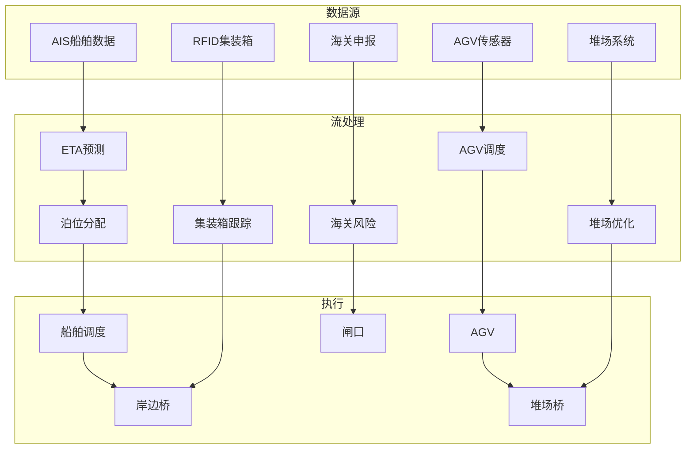

# 算子与实时港口物流

> **所属阶段**: Knowledge/10-case-studies | **前置依赖**: [01.07-two-input-operators.md](../01-concept-atlas/operator-deep-dive/01.07-two-input-operators.md), [realtime-supply-chain-tracking-case-study.md](../10-case-studies/realtime-supply-chain-tracking-case-study.md) | **形式化等级**: L3
> **文档定位**: 流处理算子在实时港口集装箱调度、AGV路径优化与船舶到港预测中的算子指纹与Pipeline设计
> **版本**: 2026.04

---

## 目录

- [1. 概念定义 (Definitions)](#1-概念定义-definitions)
- [2. 属性推导 (Properties)](#2-属性推导-properties)
- [3. 关系建立 (Relations)](#3-关系建立-relations)
- [4. 论证过程 (Argumentation)](#4-论证过程-argumentation)
- [5. 形式证明 / 工程论证 (Proof / Engineering Argument)](#5-形式证明--工程论证-proof--engineering-argument)
- [6. 实例验证 (Examples)](#6-实例验证-examples)
- [7. 可视化 (Visualizations)](#7-可视化-visualizations)
- [8. 引用参考 (References)](#8-引用参考-references)

---

## 1. 概念定义 (Definitions)

### Def-PRT-01-01: 港口物流数字孪生（Port Logistics Digital Twin）

港口物流数字孪生是港口物理操作的实时虚拟映射：

$$\text{PortTwin}(t) = (\text{Vessels}_t, \text{Containers}_t, \text{AGVs}_t, \text{Cranes}_t, \text{Yard}_t)$$

### Def-PRT-01-02: 船舶到港时间（ETA - Estimated Time of Arrival）

ETA是基于航速、航线和气象条件的到港时间预测：

$$\text{ETA} = t_{current} + \frac{D_{remaining}}{v_{avg}} + \sum_{i} \Delta t_{delay,i}$$

其中 $D_{remaining}$ 为剩余航程，$v_{avg}$ 为平均航速，$\Delta t_{delay,i}$ 为第 $i$ 个延迟因子（如港口拥堵、天气）。

### Def-PRT-01-03: 集装箱堆场优化（Yard Optimization）

堆场优化是最大化空间利用率并最小化翻箱次数的决策：

$$\min \sum_{c} \text{Relocations}(c) \quad \text{s.t.} \quad \text{SpaceUtilization} < 0.85$$

### Def-PRT-01-04: AGV调度（AGV Scheduling）

AGV调度是为自动导引车分配任务和路径的优化问题：

$$\min \sum_{v} \left(\alpha \cdot T_{travel,v} + \beta \cdot T_{wait,v} + \gamma \cdot T_{charging,v}\right)$$

### Def-PRT-01-05: 海关风险评分（Customs Risk Score）

海关风险评分是根据货物特征评估查验概率：

$$\text{Risk} = w_1 \cdot f_{origin} + w_2 \cdot f_{commodity} + w_3 \cdot f_{shipper} + w_4 \cdot f_{history}$$

---

## 2. 属性推导 (Properties)

### Lemma-PRT-01-01: 港口吞吐的排队论模型

港口吞吐能力服从M/M/c排队模型：

$$\rho = \frac{\lambda}{c \cdot \mu}$$

其中 $\lambda$ 为到港率，$\mu$ 为单泊位服务率，$c$ 为泊位数量。当 $\rho \to 1$ 时，船舶等待时间趋向无穷。

### Lemma-PRT-01-02: AGV路径冲突的图论判定

AGV路径冲突可建模为图着色问题：

$$\chi(G) \leq \Delta(G) + 1$$

其中 $\chi(G)$ 为冲突图 $G$ 的色数，$\Delta(G)$ 为最大度。冲突避免等价于给同时经过同一路段的AGV分配不同时间片。

### Prop-PRT-01-01: 堆场翻箱率与堆叠高度的关系

$$\text{RelocationRate} = 1 - \frac{1}{H_{avg}}$$

其中 $H_{avg}$ 为平均堆叠高度。堆叠越高，翻箱率越高。

### Prop-PRT-01-02: 预到港信息的泊位利用率提升

$$\Delta \eta = \eta_{withETA} - \eta_{withoutETA} \approx 15\text{-}25\%$$

---

## 3. 关系建立 (Relations)

### 3.1 港口物流Pipeline算子映射

| 应用场景 | 算子组合 | 数据源 | 延迟要求 |
|---------|---------|--------|---------|
| **船舶到港预测** | AsyncFunction + map | AIS/气象 | < 15min |
| **集装箱跟踪** | KeyedProcessFunction | RFID/GPS | < 1min |
| **AGV调度** | Broadcast + ProcessFunction | 任务队列 | < 5s |
| **堆场优化** | window+aggregate | 堆场状态 | < 10min |
| **海关风险** | Async ML | 申报数据 | < 30s |
| **设备监控** | ProcessFunction + Timer | 传感器 | < 1min |

### 3.2 算子指纹

| 维度 | 港口物流特征 |
|------|------------|
| **核心算子** | BroadcastProcessFunction（AGV调度）、KeyedProcessFunction（集装箱状态机）、AsyncFunction（ETA/风险模型）、window+aggregate（堆场统计） |
| **状态类型** | ValueState（集装箱位置）、MapState（AGV状态）、BroadcastState（调度策略） |
| **时间语义** | 处理时间为主（调度实时性） |
| **数据特征** | 空间密集（位置信息）、时序相关（船舶到港）、多源异构 |
| **状态热点** | 热门堆场区Key、活跃AGV Key |
| **性能瓶颈** | AGV冲突求解、外部ETA API |

---

## 4. 论证过程 (Argumentation)

### 4.1 为什么港口物流需要流处理而非传统调度

传统调度的问题：

- 静态计划：无法应对船舶晚到/早到
- 人工调度：效率低，易出错
- 信息滞后：集装箱位置更新不及时

流处理的优势：

- 实时跟踪：集装箱位置秒级更新
- 动态调度：根据实时状况调整AGV任务
- 预测优化：ETA预测提前安排泊位

### 4.2 AGV冲突避免

**问题**: 多台AGV在同一时刻请求同一通道。

**方案**:

1. **时间片分配**: 将通道按时间片分配给不同AGV
2. **优先级**: 紧急任务（冷藏箱）优先
3. **路径重规划**: 检测到冲突时自动绕行

### 4.3 集装箱冷链监控

**场景**: 冷藏集装箱温度必须保持在-18°C以下。

**流处理方案**: 实时温度监测 → 异常告警 → 自动通知维修 → 备用集装箱调度。

---

## 5. 形式证明 / 工程论证 (Proof / Engineering Argument)

### 5.1 实时AGV调度系统

```java
public class AGVScheduler extends BroadcastProcessFunction<TaskRequest, SchedulePolicy, AGVAssignment> {
    private MapState<String, AGVState> agvFleet;

    @Override
    public void processElement(TaskRequest task, ReadOnlyContext ctx, Collector<AGVAssignment> out) throws Exception {
        // 获取当前调度策略
        ReadOnlyBroadcastState<String, SchedulePolicy> policyState = ctx.getBroadcastState(POLICY_DESCRIPTOR);
        SchedulePolicy policy = policyState.get("default");

        // 寻找最佳AGV
        String bestAGV = null;
        double bestScore = Double.NEGATIVE_INFINITY;

        for (Map.Entry<String, AGVState> entry : agvFleet.entries()) {
            AGVState agv = entry.getValue();
            if (!agv.isAvailable()) continue;

            double score = policy.calculateScore(agv, task);
            if (score > bestScore) {
                bestScore = score;
                bestAGV = entry.getKey();
            }
        }

        if (bestAGV != null) {
            AGVState assigned = agvFleet.get(bestAGV);
            assigned.assignTask(task);
            agvFleet.put(bestAGV, assigned);

            out.collect(new AGVAssignment(bestAGV, task.getId(), task.getDestination(), ctx.timestamp()));
        }
    }

    @Override
    public void processBroadcastElement(SchedulePolicy policy, Context ctx, Collector<AGVAssignment> out) {
        ctx.getBroadcastState(POLICY_DESCRIPTOR).put("default", policy);
    }
}
```

### 5.2 集装箱状态跟踪

```java
// 集装箱事件流
DataStream<ContainerEvent> containers = env.addSource(new ContainerRFIDSource());

// 实时位置跟踪
containers.keyBy(ContainerEvent::getContainerId)
    .process(new KeyedProcessFunction<String, ContainerEvent, ContainerLocation>() {
        private ValueState<ContainerLocation> locationState;

        @Override
        public void processElement(ContainerEvent event, Context ctx, Collector<ContainerLocation> out) throws Exception {
            ContainerLocation loc = locationState.value();
            if (loc == null) loc = new ContainerLocation(event.getContainerId());

            loc.update(event.getLocation(), event.getTimestamp());
            locationState.update(loc);

            // 检查异常停留
            if (loc.getDwellTime() > 3600000) {  // 超过1小时
                out.collect(loc.withAlert("LONG_DWELL"));
            } else {
                out.collect(loc);
            }
        }
    })
    .addSink(new ContainerTrackingSink());
```

### 5.3 船舶到港预测

```java
// AIS数据流
DataStream<AISMessage> ais = env.addSource(new AISSource());

// ETA计算
ais.keyBy(AISMessage::getMmsi)
    .process(new KeyedProcessFunction<String, AISMessage, ETAPrediction>() {
        private ValueState<VesselTrack> trackState;

        @Override
        public void processElement(AISMessage msg, Context ctx, Collector<ETAPrediction> out) throws Exception {
            VesselTrack track = trackState.value();
            if (track == null) track = new VesselTrack(msg.getMmsi());

            track.updatePosition(msg.getLat(), msg.getLon(), msg.getSpeed(), msg.getTimestamp());

            // 计算ETA
            double distanceToPort = calculateDistance(track.getLastPosition(), PORT_LOCATION);
            double avgSpeed = track.getAverageSpeed(3600000);  // 最近1小时平均

            if (avgSpeed > 0) {
                long etaMillis = (long)(distanceToPort / avgSpeed * 3600000);
                Date eta = new Date(ctx.timestamp() + etaMillis);
                out.collect(new ETAPrediction(msg.getMmsi(), eta, distanceToPort, ctx.timestamp()));
            }

            trackState.update(track);
        }
    })
    .addSink(new PortScheduleSink());
```

---

## 6. 实例验证 (Examples)

### 6.1 实战：智能港口实时调度

```java
// 1. 船舶到港预测
DataStream<ETAPrediction> etas = env.addSource(new AISSource())
    .keyBy(AISMessage::getMmsi)
    .process(new ETACalculationFunction());

// 2. 泊位分配
etas.keyBy(ETAPrediction::getMmsi)
    .connect(berthAvailabilityBroadcast)
    .process(new BerthAllocationFunction())
    .addSink(new BerthScheduleSink());

// 3. 集装箱跟踪
DataStream<ContainerEvent> containerEvents = env.addSource(new RFIDSource());
containerEvents.keyBy(ContainerEvent::getContainerId)
    .process(new ContainerTrackingFunction())
    .addSink(new YardManagementSink());

// 4. AGV调度
DataStream<TaskRequest> tasks = env.addSource(new TaskQueueSource());
tasks.connect(agvStatusBroadcast)
    .process(new AGVScheduler())
    .addSink(new AGVCommandSink());
```

### 6.2 实战：冷链集装箱监控

```java
// 冷藏箱温度传感器
DataStream<TemperatureReading> temps = env.addSource(new ReeferSensorSource());

// 异常检测
temps.keyBy(TemperatureReading::getContainerId)
    .process(new KeyedProcessFunction<String, TemperatureReading, TemperatureAlert>() {
        private ValueState<TemperatureStats> stats;

        @Override
        public void processElement(TemperatureReading reading, Context ctx, Collector<TemperatureAlert> out) throws Exception {
            TemperatureStats s = stats.value();
            if (s == null) s = new TemperatureStats();

            s.update(reading.getTemperature());

            // 超温告警
            if (reading.getTemperature() > reading.getMaxAllowed()) {
                out.collect(new TemperatureAlert(reading.getContainerId(), "HIGH_TEMP", reading.getTemperature(), ctx.timestamp()));
            }

            // 趋势告警：持续上升
            if (s.isRising(5) && reading.getTemperature() > reading.getMaxAllowed() - 2) {
                out.collect(new TemperatureAlert(reading.getContainerId(), "RISING_TREND", reading.getTemperature(), ctx.timestamp()));
            }

            stats.update(s);
        }
    })
    .addSink(new MaintenanceAlertSink());
```

---

## 7. 可视化 (Visualizations)

### 港口物流Pipeline



---

## 8. 引用参考 (References)


---

*关联文档*: [01.07-two-input-operators.md](../01-concept-atlas/operator-deep-dive/01.07-two-input-operators.md) | [realtime-supply-chain-tracking-case-study.md](../10-case-studies/realtime-supply-chain-tracking-case-study.md) | [realtime-digital-twin-case-study.md](../10-case-studies/realtime-digital-twin-case-study.md)
