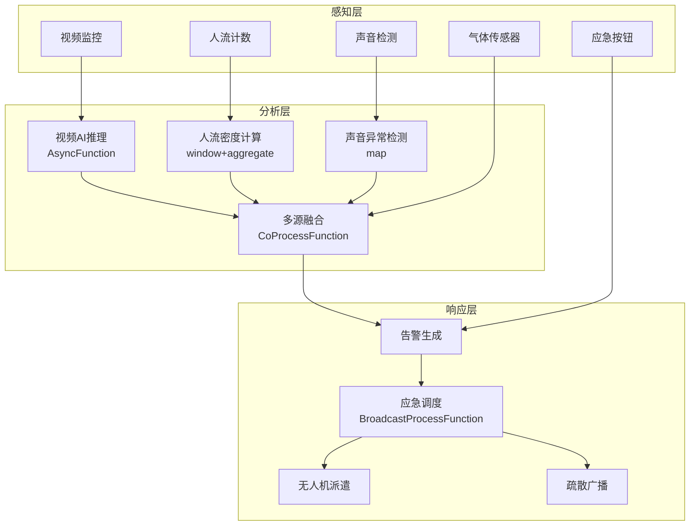

# 算子与实时公共安全

> **所属阶段**: Knowledge/10-case-studies | **前置依赖**: [01.10-process-and-async-operators.md](../01-concept-atlas/operator-deep-dive/01.10-process-and-async-operators.md), [operator-edge-computing-integration.md](../06-frontier/operator-edge-computing-integration.md) | **形式化等级**: L3
> **文档定位**: 流处理算子在实时城市安全监控、应急响应与人群管理中的算子指纹与Pipeline设计
> **版本**: 2026.04

---

## 目录

- [1. 概念定义 (Definitions)](#1-概念定义-definitions)
- [2. 属性推导 (Properties)](#2-属性推导-properties)
- [3. 关系建立 (Relations)](#3-关系建立-relations)
- [4. 论证过程 (Argumentation)](#4-论证过程-argumentation)
- [5. 形式证明 / 工程论证 (Proof / Engineering Argument)](#5-形式证明--工程论证-proof--engineering-argument)
- [6. 实例验证 (Examples)](#6-实例验证-examples)
- [7. 可视化 (Visualizations)](#7-可视化-visualizations)
- [8. 引用参考 (References)](#8-引用参考-references)

---

## 1. 概念定义 (Definitions)

### Def-SAF-01-01: 城市安全物联网（Urban Safety IoT）

城市安全物联网是部署在城市公共区域的多模态感知网络：

$$\text{UrbanSafetyIoT} = \{s_i : (\text{type}_i, \text{location}_i, \text{coverage}_i)\}_{i=1}^{n}$$

传感器类型：视频监控、声音检测、气体检测、人流计数、应急按钮、无人机。

### Def-SAF-01-02: 人群密度（Crowd Density）

人群密度是单位面积内的聚集人数：

$$\rho = \frac{N}{A}$$

其中 $N$ 为人数，$A$ 为区域面积。临界密度 $\rho_{critical} \approx 4-6 \text{人/m}^2$，超过此值有踩踏风险。

### Def-SAF-01-03: 异常行为检测（Anomalous Behavior Detection）

异常行为检测是从视频/音频流中识别威胁性动作：

$$\text{Anomaly}(x) = \|f(x) - f_{normal}(x)\| > \theta_{anomaly}$$

其中 $f(x)$ 为行为特征向量，$f_{normal}$ 为正常行为模型。

### Def-SAF-01-04: 应急响应时间（Emergency Response Time）

应急响应时间是从事件发生到应急力量到达的时间：

$$\text{ResponseTime} = T_{detection} + T_{dispatch} + T_{travel}$$

目标：$\text{ResponseTime} < 5 \text{分钟}$（城市中心）。

### Def-SAF-01-05: 态势感知融合（Situational Awareness Fusion）

多源数据融合形成统一安全态势图：

$$\text{Situation}_t = \text{Fusion}(\text{Video}_t, \text{Audio}_t, \text{Sensor}_t, \text{Social}_t)$$

---

## 2. 属性推导 (Properties)

### Lemma-SAF-01-01: 人群疏散时间

人群疏散时间服从Togawa模型：

$$T_{evac} = \frac{N}{W \cdot v_{flow}} + \frac{L}{v_{walk}}$$

其中 $W$ 为出口宽度，$v_{flow}$ 为流动速度（约1.3m/s），$L$ 为到出口距离。

### Lemma-SAF-01-02: 视频分析的计算复杂度

单帧视频分析的计算量：

$$C = O(H \cdot W \cdot D \cdot K^2)$$

其中 $H \times W$ 为分辨率，$D$ 为网络深度，$K$ 为卷积核大小。4K视频实时分析需要GPU加速。

### Prop-SAF-01-01: 边缘计算的带宽节省

$$\text{BandwidthSaving} = 1 - \frac{V_{metadata}}{V_{raw}}$$

其中 $V_{metadata}$ 为分析结果数据量，$V_{raw}$ 为原始视频数据量。典型值：原始视频100Mbps，分析结果1Kbps，节省99.999%。

### Prop-SAF-01-02: 多传感器融合的检测率提升

$$P_{fusion} = 1 - \prod_{i}(1 - P_i)$$

其中 $P_i$ 为第 $i$ 个传感器的检测率。3个独立传感器各90%检测率，融合后检测率99.9%。

---

## 3. 关系建立 (Relations)

### 3.1 公共安全Pipeline算子映射

| 应用场景 | 算子组合 | 数据源 | 延迟要求 |
|---------|---------|--------|---------|
| **视频监控** | Source + AsyncFunction | 摄像头 | < 500ms |
| **人流统计** | window+aggregate | 人流传感器 | < 5s |
| **异常检测** | Async ML + ProcessFunction | 视频/音频 | < 2s |
| **应急响应** | CEP + Broadcast | 多源事件 | < 1s |
| **无人机调度** | Broadcast + ProcessFunction | 任务指令 | < 1s |
| **态势融合** | CoProcessFunction | 多模态 | < 10s |

### 3.2 算子指纹

| 维度 | 公共安全特征 |
|------|------------|
| **核心算子** | AsyncFunction（ML推理）、ProcessFunction（状态机）、BroadcastProcessFunction（应急指令）、CEP（事件模式）、CoProcessFunction（多源融合） |
| **状态类型** | ValueState（区域人数）、MapState（设备状态）、BroadcastState（应急策略） |
| **时间语义** | 处理时间为主（应急响应强调实时性） |
| **数据特征** | 高并发（万级摄像头）、高敏感（安全隐私）、多模态（视频/音频/传感器） |
| **状态热点** | 热门区域Key、大型活动Key |
| **性能瓶颈** | 视频ML推理、多源数据融合 |

---

## 4. 论证过程 (Argumentation)

### 4.1 为什么公共安全需要流处理而非传统监控

传统监控的问题：

- 事后回放：事件发生后查看录像，无法实时干预
- 人工盯屏：监控员疲劳导致漏检
- 数据孤岛：各系统独立，无法联动

流处理的优势：

- 实时检测：异常行为秒级识别
- 自动告警：无需人工盯屏
- 多系统联动：检测→告警→调度→处置自动化

### 4.2 隐私保护的挑战

**问题**: 视频监控涉及个人隐私。

**方案**:

1. **边缘处理**: 视频在边缘节点分析，只上传分析结果
2. **匿名化**: 人脸模糊处理，只保留行为特征
3. **数据最小化**: 仅保留告警前后片段，常规视频不存储

### 4.3 大规模活动的安全保障

**场景**: 跨年晚会现场10万人聚集。

**流处理方案**:

1. **实时人流密度**: 多点位人流计数聚合
2. **异常聚集检测**: 某区域密度突然上升告警
3. **疏散路径规划**: 实时计算最优疏散路径
4. **无人机巡查**: 自动调度无人机到告警区域

---

## 5. 形式证明 / 工程论证 (Proof / Engineering Argument)

### 5.1 实时异常检测Pipeline

```java
// 视频帧流
DataStream<VideoFrame> video = env.addSource(new CameraSource());

// 异步AI推理
DataStream<DetectionResult> detections = AsyncDataStream.unorderedWait(
    video,
    new ObjectDetectionFunction(),
    Time.milliseconds(200),
    100
);

// 异常行为识别
detections.keyBy(DetectionResult::getCameraId)
    .process(new KeyedProcessFunction<String, DetectionResult, SafetyAlert>() {
        private ValueState<BehaviorHistory> behaviorState;

        @Override
        public void processElement(DetectionResult det, Context ctx, Collector<SafetyAlert> out) throws Exception {
            BehaviorHistory history = behaviorState.value();
            if (history == null) history = new BehaviorHistory();

            history.addDetection(det);

            // 检测异常行为模式
            if (history.hasFightingPattern()) {
                out.collect(new SafetyAlert(det.getCameraId(), "FIGHTING", det.getConfidence(), ctx.timestamp()));
            } else if (history.hasIntrusionPattern()) {
                out.collect(new SafetyAlert(det.getCameraId(), "INTRUSION", det.getConfidence(), ctx.timestamp()));
            } else if (history.hasAbandonedObject()) {
                out.collect(new SafetyAlert(det.getCameraId(), "ABANDONED_OBJECT", det.getConfidence(), ctx.timestamp()));
            }

            behaviorState.update(history);
        }
    })
    .addSink(new AlertDispatchSink());
```

### 5.2 人流密度实时监测

```java
// 多源人流数据
DataStream<PeopleCount> counts = env.addSource(new PeopleCounterSource());

// 区域密度计算
counts.keyBy(PeopleCount::getZoneId)
    .window(SlidingProcessingTimeWindows.of(Time.minutes(1), Time.seconds(10)))
    .aggregate(new DensityAggregate())
    .process(new ProcessFunction<DensityResult, DensityAlert>() {
        @Override
        public void processElement(DensityResult density, Context ctx, Collector<DensityAlert> out) {
            double rho = density.getDensity();

            if (rho > 6.0) {
                out.collect(new DensityAlert(density.getZoneId(), "CRITICAL", rho, ctx.timestamp()));
            } else if (rho > 4.0) {
                out.collect(new DensityAlert(density.getZoneId(), "WARNING", rho, ctx.timestamp()));
            }
        }
    })
    .addSink(new DensityDashboardSink());
```

### 5.3 应急响应自动调度

```java
// 安全告警流
DataStream<SafetyAlert> alerts = env.addSource(new AlertSource());

// 应急资源状态（Broadcast）
DataStream<EmergencyResource> resources = env.addSource(new ResourceStatusSource());

// 自动调度
alerts.connect(resources.broadcast())
    .process(new BroadcastProcessFunction<SafetyAlert, EmergencyResource, DispatchOrder>() {
        @Override
        public void processElement(SafetyAlert alert, ReadOnlyContext ctx, Collector<DispatchOrder> out) {
            ReadOnlyBroadcastState<String, EmergencyResource> resourceState = ctx.getBroadcastState(RESOURCE_DESCRIPTOR);

            // 寻找最近的可用资源
            EmergencyResource nearest = null;
            double minDistance = Double.MAX_VALUE;

            for (Map.Entry<String, EmergencyResource> entry : resourceState.immutableEntries()) {
                EmergencyResource res = entry.getValue();
                if (!res.isAvailable()) continue;

                double dist = calculateDistance(alert.getLocation(), res.getLocation());
                if (dist < minDistance) {
                    minDistance = dist;
                    nearest = res;
                }
            }

            if (nearest != null) {
                out.collect(new DispatchOrder(
                    nearest.getId(),
                    alert.getLocation(),
                    alert.getType(),
                    alert.getTimestamp()
                ));
            }
        }

        @Override
        public void processBroadcastElement(EmergencyResource resource, Context ctx, Collector<DispatchOrder> out) {
            ctx.getBroadcastState(RESOURCE_DESCRIPTOR).put(resource.getId(), resource);
        }
    })
    .addSink(new DispatchSink());
```

---

## 6. 实例验证 (Examples)

### 6.1 实战：大型活动安全保障系统

```java
// 1. 多模态数据接入
DataStream<VideoFrame> video = env.addSource(new CameraSource());
DataStream<PeopleCount> people = env.addSource(new PeopleCounterSource());
DataStream<AudioEvent> audio = env.addSource(new AudioSensorSource());

// 2. 视频异常检测
DataStream<SafetyAlert> videoAlerts = AsyncDataStream.unorderedWait(
    video,
    new VideoAnalysisFunction(),
    Time.milliseconds(200),
    100
);

// 3. 人流密度监测
DataStream<DensityAlert> densityAlerts = people
    .keyBy(PeopleCount::getZoneId)
    .window(SlidingProcessingTimeWindows.of(Time.minutes(1), Time.seconds(10)))
    .aggregate(new DensityAggregate())
    .filter(d -> d.getDensity() > 4.0);

// 4. 声音异常检测
DataStream<SafetyAlert> audioAlerts = audio
    .map(new AudioFeatureExtractor())
    .filter(f -> f.getAnomalyScore() > 0.8);

// 5. 融合告警
videoAlerts.union(densityAlerts.map(a -> new SafetyAlert(a.getZoneId(), "CROWD", a.getDensity(), a.getTimestamp())))
    .union(audioAlerts)
    .keyBy(SafetyAlert::getZoneId)
    .window(TumblingProcessingTimeWindows.of(Time.seconds(5)))
    .aggregate(new AlertFusionAggregate())
    .addSink(new CommandCenterSink());
```

### 6.2 实战：智慧园区安全管理

```java
// 门禁事件流
DataStream<AccessEvent> access = env.addSource(new AccessControlSource());

// 异常门禁检测
access.keyBy(AccessEvent::getPersonId)
    .process(new KeyedProcessFunction<String, AccessEvent, SecurityAlert>() {
        private ValueState<AccessPattern> patternState;

        @Override
        public void processElement(AccessEvent event, Context ctx, Collector<SecurityAlert> out) throws Exception {
            AccessPattern pattern = patternState.value();
            if (pattern == null) pattern = new AccessPattern();

            pattern.addEvent(event);

            // 检测异常：非工作时间进入敏感区域
            if (event.isSensitiveArea() && !event.isWorkHours()) {
                out.collect(new SecurityAlert(event.getPersonId(), "OFF_HOUR_ACCESS", event.getLocation(), ctx.timestamp()));
            }

            // 检测异常：短时间内多次尝试失败
            if (pattern.getFailedAttempts(300000) > 3) {
                out.collect(new SecurityAlert(event.getPersonId(), "BRUTE_FORCE", event.getLocation(), ctx.timestamp()));
            }

            patternState.update(pattern);
        }
    })
    .addSink(new SecurityAlertSink());
```

---

## 7. 可视化 (Visualizations)

### 公共安全Pipeline



---

## 8. 引用参考 (References)


---

*关联文档*: [01.10-process-and-async-operators.md](../01-concept-atlas/operator-deep-dive/01.10-process-and-async-operators.md) | [operator-edge-computing-integration.md](../06-frontier/operator-edge-computing-integration.md) | [realtime-content-moderation-case-study.md](../10-case-studies/realtime-content-moderation-case-study.md)
