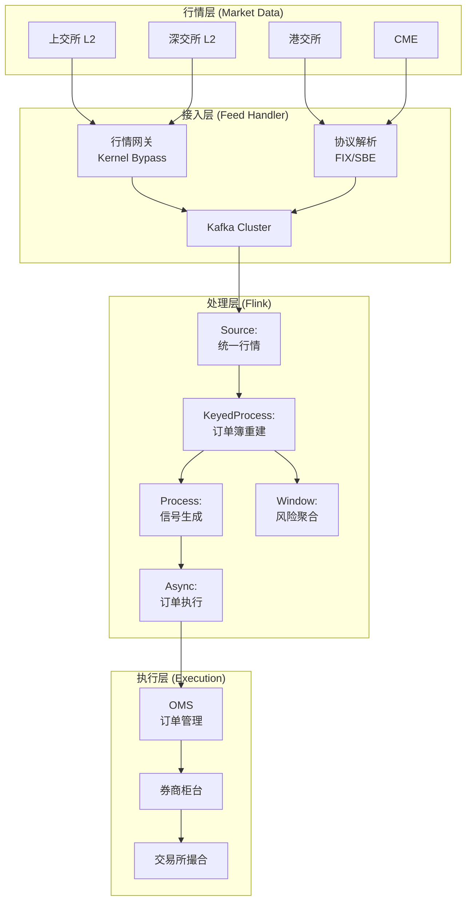
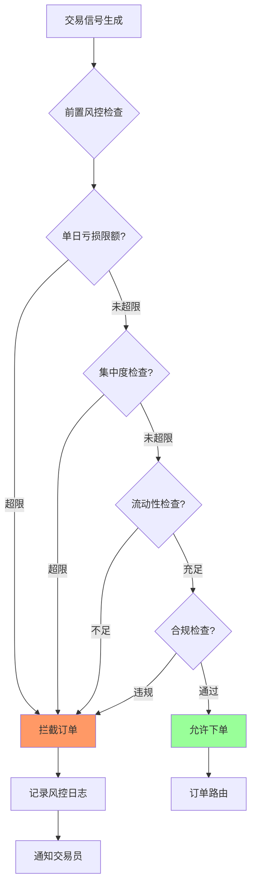
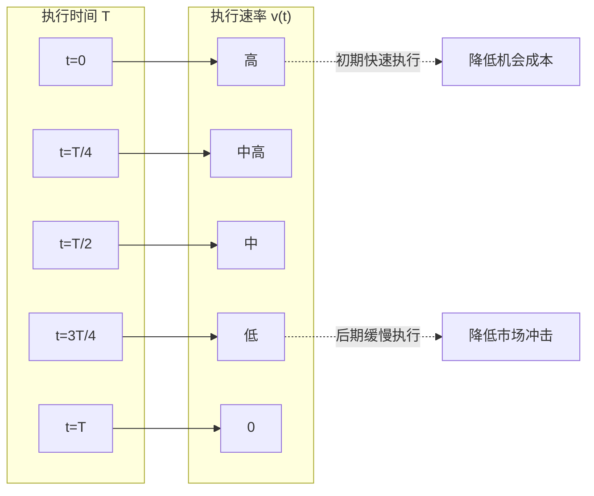

# 实时量化交易与风控案例研究

> 所属阶段: Knowledge/ Flink/ | 前置依赖: [算子全景分类](../01-concept-atlas/operator-deep-dive/01.06-single-input-operators.md) | [复杂事件处理](../01-concept-atlas/operator-deep-dive/01.10-process-and-async-operators.md) | 形式化等级: L4

## 1. 概念定义 (Definitions)

### Def-QTF-01-01: 量化交易系统 (Quantitative Trading System)

量化交易系统是指通过数学模型、统计方法和计算机程序对金融市场数据进行分析，自动生成交易信号并执行订单的自动化系统。

$$\mathcal{Q} = (M, S, E, R, F)$$

其中 $M$ 为多源行情数据流（L1/L2/L3），$S$ 为策略信号流，$E$ 为订单执行流，$R$ 为风险指标流，$F$ 为流计算处理拓扑。

### Def-QTF-01-02: 订单簿深度 (Order Book Depth)

订单簿深度是指在特定价格水平上可立即成交的买卖订单总量：

$$Depth(p) = \sum_{i} Q_i^{bid} \cdot \mathbb{1}_{[P_i^{bid} \geq p]} + \sum_{j} Q_j^{ask} \cdot \mathbb{1}_{[P_j^{ask} \leq p]}$$

其中 $Q_i^{bid}$ 为第 $i$ 档买单量，$P_i^{bid}$ 为对应价格，$ask$ 同理。订单簿深度反映市场流动性和大额订单的冲击成本。

### Def-QTF-01-03: 滑点 (Slippage)

滑点指订单预期执行价格与实际成交价格之间的差异：

$$Slippage = \begin{cases}
P_{actual} - P_{expected} & \text{for buy orders} \\
P_{expected} - P_{actual} & \text{for sell orders}
\end{cases}$$

滑点来源：
- **市场冲击**: 大单消耗订单簿深度，推动价格
- **执行延迟**: 从信号生成到订单到达交易所的时延
- **价格跳跃**: 在订单传输期间价格发生显著变化

### Def-QTF-01-04: 风险价值 (Value at Risk, VaR)

VaR是在特定置信水平和持有期内，投资组合可能面临的最大损失：

$$P(L > VaR_{\alpha}) = 1 - \alpha$$

其中 $L$ 为损失随机变量，$\alpha$ 为置信水平（通常为95%或99%）。历史模拟法计算：

$$VaR_{\alpha} = -Percentile(\{R_t\}_{t=1}^{T}, 1-\alpha) \cdot V_{portfolio}$$

### Def-QTF-01-05: 策略夏普比率 (Strategy Sharpe Ratio)

策略夏普比率衡量风险调整后的超额收益：

$$Sharpe = \frac{E[R_p] - R_f}{\sigma_p}$$

其中 $E[R_p]$ 为策略期望收益率，$R_f$ 为无风险利率，$\sigma_p$ 为策略收益波动率。$Sharpe > 1.0$ 通常被视为优秀策略。

## 2. 属性推导 (Properties)

### Lemma-QTF-01-01: 行情数据延迟对策略收益的影响

在趋势跟踪策略中，行情数据延迟 $\delta$ 导致的年化收益衰减：

$$\Delta Return \approx -\frac{1}{2} \cdot \gamma \cdot \sigma^2 \cdot \delta$$

其中 $\gamma$ 为策略 turnover（换手率），$\sigma$ 为标的波动率。

**证明**: 延迟 $\delta$ 使策略使用过期价格做决策。在随机游走假设下，价格变化方差为 $\sigma^2 \delta$。策略基于过期信号的期望交易方向错误率与延迟成正比，导致收益衰减。

**工程约束**: 当 $\sigma = 20\%$/年，$\gamma = 5$ 倍/年，$\delta = 100$ms 时，$\Delta Return \approx -0.1\%$/年。对于高频策略（$\gamma = 50$），$\Delta Return \approx -1\%$/年。

### Lemma-QTF-01-02: 市场冲击成本的平方根法则

大额订单的市场冲击成本近似遵循平方根法则：

$$Impact = \eta \cdot \sigma \cdot \sqrt{\frac{Q}{ADV}}$$

其中 $Q$ 为订单量，$ADV$ 为日均成交量，$\sigma$ 为日波动率，$\eta$ 为市场冲击系数（通常0.5-1.5）。

**证明**: 由市场微观结构理论，价格冲击与订单量相对于市场深度的比率相关。在流动性提供者为风险中性的假设下，冲击成本与 $\sqrt{Q/ADV}$ 成正比。

### Prop-QTF-01-01: 分散化投资的风险降低边界

在 $N$ 个等权重、等波动率 $\sigma$、两两相关系数 $\rho$ 的资产组合中，组合波动率：

$$\sigma_p = \sigma \cdot \sqrt{\frac{1}{N} + \rho \cdot \left(1 - \frac{1}{N}\right)}$$

**边界**: 当 $N \to \infty$ 时，$\sigma_p \to \sigma \cdot \sqrt{\rho}$。分散化可将非系统性风险降至0，但系统性风险（$\rho$ 部分）无法分散。

### Prop-QTF-01-02: 前置风控的拦截完备性

前置风控系统在订单提交前检查风险限额，其拦截完备性满足：

$$P_{intercept} = 1 - P_{bypass}$$

其中 $P_{bypass}$ 为风控规则覆盖缺口导致的漏检概率。完备性提升需增加规则维度，但会降低订单通过率。

**最优权衡**: 采用分层风控——L1快速检查（延迟<1ms，覆盖80%风险）+ L2深度检查（延迟<10ms，覆盖剩余20%）。

## 3. 关系建立 (Relations)

### 与算子体系的映射

| 量化交易场景 | Flink算子 | 算子作用 |
|------------|-----------|---------|
| 多源行情接入 | `Union` + `AsyncFunction` | 统一上交所/深交所/港交所/美股行情 |
| 订单簿重建 | `KeyedProcessFunction` | 按标的键控，维护实时订单簿 |
| 策略信号生成 | `ProcessFunction` | 技术指标计算、信号触发 |
| 风险敞口聚合 | `WindowAggregate` | 滑动窗口内聚合组合风险 |
| 异常检测 | `CEPPattern` | 价格闪崩/闪涨模式匹配 |
| 订单执行 | `AsyncFunction` | 调用券商API下单 |
| 绩效归因 | `WindowAggregate` + `Sink` | 日/月窗口聚合收益分析 |

### 与金融基础设施的关联

- **交易所行情**: L1（tick/五档）、L2（十档/全明细）、L3（完整订单簿）
- **FIX协议**: 金融行业消息交换标准
- **CTP/飞马**: 中国期货市场交易接口
- **券商API**: 中泰XTP、华宝LTS、恒生UFX等
- **监管报送**: 交易所盘后数据报送、证监会监管要求

## 4. 论证过程 (Argumentation)

### 4.1 量化交易流处理的核心挑战

**挑战1: 微秒级时延要求**
高频交易（HFT）策略要求在微秒级完成行情接收→信号计算→订单发送。传统数据库架构无法满足此约束，需采用FPGA/Kernel Bypass/共享内存等低时延技术。

**挑战2: 海量行情数据**
A股市场单日产生约5亿条逐笔成交和委托记录，L2行情峰值QPS达100万+/秒。流处理平台需支持高吞吐低时延的数据处理。

**挑战3: 回测与实盘的一致性**
策略回测使用历史数据，但实盘受滑点、市场冲击、延迟影响。需通过流计算实现"纸交易"（Paper Trading），在实盘环境中模拟执行但不真实下单。

**挑战4: 合规与风控实时性**
交易所要求异常交易行为在3分钟内识别并上报。风控系统需实时计算组合敞口、集中度、关联度等指标。

### 4.2 方案选型论证

**为什么选用流计算而非传统量化平台？**
- 传统量化平台（如Python+Pandas）为批处理模式，无法满足微秒级信号生成
- 流计算支持事件驱动架构，行情到达即触发计算
- Flink的精确一次语义保证交易记录不丢失

**为什么选用滑动窗口做风险敞口聚合？**
- 组合风险需基于实时持仓计算，滑动窗口提供平滑的风险曲线
- 窗口大小对应不同时间尺度的风险（1分钟/5分钟/日）
- 重叠窗口避免在边界处遗漏风险事件

## 5. 形式证明 / 工程论证 (Proof / Engineering Argument)

### Thm-QTF-01-01: 最优执行策略定理 (Almgren-Chriss Framework)

在考虑市场冲击和风险的条件下，大单拆分执行的最优策略为：

**定理**: 若目标是在时间 $T$ 内完成 $X$ 股的买入，且价格动态服从 $dS_t = \sigma dW_t + \eta v_t dt$，则最优执行速率 $v_t^*$ 满足：

$$v_t^* = \frac{X}{T} \cdot \frac{\sinh(\kappa(T-t))}{\sinh(\kappa T)}$$

其中 $\kappa = \sqrt{\lambda \sigma^2 / \eta}$，$\lambda$ 为风险厌恶系数。

**证明概要**:
1. 执行成本 = 市场冲击成本 + 机会成本（价格变动风险）
2. 构建哈密顿量，应用最优控制理论
3. 由欧拉-拉格朗日方程导出上述双曲正弦解
4. 边界条件：$v_0^* = X/T$（初始速率），$v_T^* = 0$（完成时停止）

**工程意义**: 最优策略呈指数衰减形态——初期快速执行（降低机会成本），后期缓慢执行（降低市场冲击）。风险厌恶度高（$\lambda$ 大）时，执行更集中在初期。

## 6. 实例验证 (Examples)

### 6.1 实时行情处理与订单簿重建Pipeline

```java
// Real-time market data processing and order book reconstruction
StreamExecutionEnvironment env = StreamExecutionEnvironment.getExecutionEnvironment();
env.setStreamTimeCharacteristic(TimeCharacteristic.EventTime);

// L2 market data from exchange
DataStream<MarketData> marketDataStream = env
    .addSource(new ExchangeFeedSource("shfe", "tcp://192.168.1.10:30001"))
    .assignTimestampsAndWatermarks(
        WatermarkStrategy.<MarketData>forBoundedOutOfOrderness(
            Duration.ofMillis(10))
        .withTimestampAssigner((data, ts) -> data.getExchangeTimestamp())
    );

// Order book reconstruction
DataStream<OrderBook> orderBooks = marketDataStream
    .keyBy(data -> data.getInstrumentId())
    .process(new OrderBookReconstructionFunction() {
        private ValueState<OrderBook> bookState;

        @Override
        public void open(Configuration parameters) {
            bookState = getRuntimeContext().getState(
                new ValueStateDescriptor<>("orderbook", OrderBook.class));
        }

        @Override
        public void processElement(MarketData data, Context ctx,
                                   Collector<OrderBook> out) throws Exception {
            OrderBook book = bookState.value();
            if (book == null) {
                book = new OrderBook(data.getInstrumentId());
            }

            switch (data.getType()) {
                case ORDER_ADD:
                    book.addOrder(data.getSide(), data.getPrice(), data.getVolume(), data.getOrderId());
                    break;
                case ORDER_CANCEL:
                    book.cancelOrder(data.getOrderId());
                    break;
                case TRADE:
                    book.executeTrade(data.getPrice(), data.getVolume());
                    break;
                case ORDER_MODIFY:
                    book.modifyOrder(data.getOrderId(), data.getPrice(), data.getVolume());
                    break;
            }

            bookState.update(book);

            // Emit order book snapshot every tick or at fixed interval
            if (shouldEmit(ctx.timestamp())) {
                out.collect(book.deepCopy());
            }
        }

        private boolean shouldEmit(long timestamp) {
            // Emit at most every 100ms to reduce downstream load
            return timestamp % 100 == 0;
        }
    });

// Calculate mid price and spread
DataStream<PriceMetrics> priceMetrics = orderBooks
    .map(book -> {
        double bestBid = book.getBestBidPrice();
        double bestAsk = book.getBestAskPrice();
        double midPrice = (bestBid + bestAsk) / 2.0;
        double spread = bestAsk - bestBid;
        double spreadBps = spread / midPrice * 10000;
        return new PriceMetrics(book.getInstrumentId(), midPrice, spread, spreadBps);
    });

priceMetrics.addSink(new SignalGenerationSink());
```

### 6.2 移动平均交叉策略信号生成

```java
// Moving average crossover strategy signal generation
DataStream<PriceTick> priceTicks = env
    .addSource(new KafkaSource<>("market.price.ticks"))
    .assignTimestampsAndWatermarks(
        WatermarkStrategy.<PriceTick>forBoundedOutOfOrderness(
            Duration.ofMillis(100))
    );

// Calculate short-term MA (5-minute)
DataStream<MovingAverage> shortMA = priceTicks
    .keyBy(tick -> tick.getInstrumentId())
    .window(SlidingEventTimeWindows.of(Time.minutes(5), Time.seconds(10)))
    .aggregate(new AverageAggregationFunction());

// Calculate long-term MA (20-minute)
DataStream<MovingAverage> longMA = priceTicks
    .keyBy(tick -> tick.getInstrumentId())
    .window(SlidingEventTimeWindows.of(Time.minutes(20), Time.seconds(10)))
    .aggregate(new AverageAggregationFunction());

// Join MAs to generate signals
DataStream<TradeSignal> signals = shortMA
    .keyBy(ma -> ma.getInstrumentId())
    .connect(longMA.keyBy(ma -> ma.getInstrumentId()))
    .process(new SignalGenerationFunction() {
        private ValueState<Double> prevShortState;
        private ValueState<Double> prevLongState;

        @Override
        public void open(Configuration parameters) {
            prevShortState = getRuntimeContext().getState(
                new ValueStateDescriptor<>("prev-short", Types.DOUBLE));
            prevLongState = getRuntimeContext().getState(
                new ValueStateDescriptor<>("prev-long", Types.DOUBLE));
        }

        @Override
        public void processElement1(MovingAverage shortMA, Context ctx,
                                   Collector<TradeSignal> out) throws Exception {
            prevShortState.update(shortMA.getValue());
            checkCrossover(ctx, out);
        }

        @Override
        public void processElement2(MovingAverage longMA, Context ctx,
                                   Collector<TradeSignal> out) throws Exception {
            prevLongState.update(longMA.getValue());
            checkCrossover(ctx, out);
        }

        private void checkCrossover(Context ctx, Collector<TradeSignal> out) throws Exception {
            Double prevShort = prevShortState.value();
            Double prevLong = prevLongState.value();
            if (prevShort == null || prevLong == null) return;

            Double currShort = prevShortState.value();
            Double currLong = prevLongState.value();

            // Golden cross: short MA crosses above long MA
            if (prevShort <= prevLong && currShort > currLong) {
                out.collect(new TradeSignal(
                    ctx.getCurrentKey(), "BUY", "GOLDEN_CROSS",
                    currShort, currLong, ctx.timestamp()
                ));
            }
            // Death cross: short MA crosses below long MA
            else if (prevShort >= prevLong && currShort < currLong) {
                out.collect(new TradeSignal(
                    ctx.getCurrentKey(), "SELL", "DEATH_CROSS",
                    currShort, currLong, ctx.timestamp()
                ));
            }
        }
    });

signals.addSink(new OrderExecutionSink());
```

### 6.3 实时风险敞口监控

```java
// Real-time portfolio risk monitoring
DataStream<PositionUpdate> positions = env
    .addSource(new KafkaSource<>("trading.positions"))
    .assignTimestampsAndWatermarks(
        WatermarkStrategy.<PositionUpdate>forBoundedOutOfOrderness(
            Duration.ofSeconds(5))
    );

DataStream<PriceTick> prices = env
    .addSource(new KafkaSource<>("market.price.ticks"))
    .assignTimestampsAndWatermarks(
        WatermarkStrategy.<PriceTick>forBoundedOutOfOrderness(
            Duration.ofMillis(100))
    );

// Calculate real-time P&L and exposure
DataStream<RiskMetrics> riskMetrics = positions
    .keyBy(pos -> pos.getInstrumentId())
    .connect(prices.keyBy(price -> price.getInstrumentId()))
    .process(new RiskCalculationFunction() {
        private ValueState<Position> positionState;
        private ValueState<Double> priceState;

        @Override
        public void open(Configuration parameters) {
            positionState = getRuntimeContext().getState(
                new ValueStateDescriptor<>("position", Position.class));
            priceState = getRuntimeContext().getState(
                new ValueStateDescriptor<>("price", Types.DOUBLE));
        }

        @Override
        public void processElement1(PositionUpdate update, Context ctx,
                                   Collector<RiskMetrics> out) throws Exception {
            Position pos = positionState.value();
            if (pos == null) pos = new Position(update.getInstrumentId());
            pos.update(update);
            positionState.update(pos);
            calculateRisk(ctx, out);
        }

        @Override
        public void processElement2(PriceTick price, Context ctx,
                                   Collector<RiskMetrics> out) throws Exception {
            priceState.update(price.getPrice());
            calculateRisk(ctx, out);
        }

        private void calculateRisk(Context ctx, Collector<RiskMetrics> out) throws Exception {
            Position pos = positionState.value();
            Double price = priceState.value();
            if (pos == null || price == null) return;

            double exposure = pos.getQuantity() * price;
            double unrealizedPnL = pos.getQuantity() * (price - pos.getAvgCost());

            out.collect(new RiskMetrics(
                pos.getInstrumentId(), exposure, unrealizedPnL,
                pos.getQuantity(), price, ctx.timestamp()
            ));
        }
    });

// Aggregate portfolio-level risk
DataStream<PortfolioRisk> portfolioRisk = riskMetrics
    .keyBy(rm -> rm.getPortfolioId())
    .window(SlidingEventTimeWindows.of(Time.minutes(1), Time.seconds(10)))
    .aggregate(new PortfolioRiskAggregation());

// VaR calculation using historical simulation
DataStream<VarResult> varResults = portfolioRisk
    .keyBy(pr -> pr.getPortfolioId())
    .process(new VaRCalculationFunction() {
        private ListState<Double> returnsHistory;
        private static final int HISTORY_SIZE = 252; // 1 year
        private static final double CONFIDENCE = 0.95;

        @Override
        public void open(Configuration parameters) {
            returnsHistory = getRuntimeContext().getListState(
                new ListStateDescriptor<>("returns", Types.DOUBLE));
        }

        @Override
        public void processElement(PortfolioRisk risk, Context ctx,
                                   Collector<VarResult> out) throws Exception {
            List<Double> returns = new ArrayList<>();
            returnsHistory.get().forEach(returns::add);

            double currentReturn = risk.getPortfolioReturn();
            returns.add(currentReturn);

            if (returns.size() > HISTORY_SIZE) {
                returns = returns.subList(returns.size() - HISTORY_SIZE, returns.size());
            }

            returnsHistory.update(returns);

            if (returns.size() >= 30) {
                Collections.sort(returns);
                int varIndex = (int) Math.floor(returns.size() * (1 - CONFIDENCE));
                double var = -returns.get(varIndex) * risk.getPortfolioValue();

                out.collect(new VarResult(
                    risk.getPortfolioId(), var, CONFIDENCE,
                    risk.getPortfolioValue(), ctx.timestamp()
                ));
            }
        }
    });

varResults.addSink(new RiskAlertSink());
```

## 7. 可视化 (Visualizations)

### 图1: 量化交易系统实时处理架构



### 图2: 前置风控决策流程



### 图3: 最优执行策略曲线



## 8. 引用参考 (References)

[^1]: R. Almgren and N. Chriss, "Optimal Execution of Portfolio Transactions", Journal of Risk, 3(2), 2001.
[^2]: E. Chan, "Quantitative Trading: How to Build Your Own Algorithmic Trading Business", Wiley, 2008.
[^3]: FIX Trading Community, "FIX Protocol Specification", Version 5.0 SP2, 2022.
[^4]: 上海证券交易所, "L2行情接口规范", 2024.
[^5]: Apache Flink Documentation, "State Backends", 2025. https://nightlies.apache.org/flink/flink-docs-stable/docs/ops/state/state_backends/
[^6]: M. Avellaneda and S. Stoikov, "High-frequency Trading in a Limit Order Book", Quantitative Finance, 8(3), 2008.
