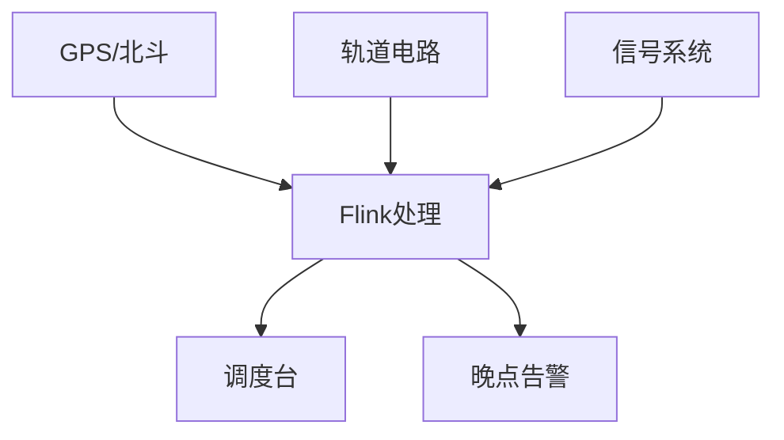

# 实时铁路列车运行调度优化案例研究

> 所属阶段: Knowledge/ Flink/ | 前置依赖: [算子全景分类](../01-concept-atlas/operator-deep-dive/01.06-single-input-operators.md) | [窗口算子](../01-concept-atlas/operator-deep-dive/01.09-window-operators.md) | 形式化等级: L4

## 1. 概念定义 (Definitions)

### Def-RWY-01-01: 列车运行调度系统 (Train Operation Dispatching System)

列车运行调度系统是通过轨道电路、信号设备、车载设备和流计算平台，对列车位置、运行速度、区间占用进行实时监测与调度优化的集成系统。

$$\mathcal{R} = (T, S, P, C, F)$$

其中 $T$ 为列车位置数据流，$S$ 为信号状态流，$P$ 为站台客流流，$C$ 为调度指令流，$F$ 为流计算处理拓扑。

### Def-RWY-01-02: 列车追踪间隔 (Train Tracking Interval)

列车追踪间隔是同一线路上相邻两列车的最小安全距离：

$$I_{tracking} = \max(I_{braking}, I_{signal}, I_{platform})$$

其中 $I_{braking}$ 为制动距离间隔，$I_{signal}$ 为信号系统限制间隔，$I_{platform}$ 为站台作业间隔。

### Def-RWY-01-03: 运行图偏离度 (Timetable Deviation)

运行图偏离度衡量列车实际运行与计划运行图的差异：

$$Deviation = \sqrt{\frac{1}{N} \sum_{i}(t_{actual,i} - t_{scheduled,i})^2}$$

其中 $t_{actual,i}$ 为第 $i$ 个停靠站的实际到达时间，$t_{scheduled,i}$ 为计划到达时间。

### Def-RWY-01-04: 线路通过能力 (Line Capacity)

线路通过能力是单位时间内线路可通过的最大列车数：

$$Capacity = \frac{3600}{I_{tracking}} \cdot N_{tracks}$$

其中 $N_{tracks}$ 为线路轨道数（单线=1，复线=2）。

## 2. 属性推导 (Properties)

### Lemma-RWY-01-01: 制动距离与速度的关系

列车制动距离与初速度的平方成正比：

$$D_{braking} = \frac{v^2}{2a_{decel}}$$

其中 $a_{decel}$ 为平均减速度（高铁约1.0 m/s²）。时速350km/h时，紧急制动距离约4800m。

### Prop-RWY-01-01: 晚点传播的级联效应

列车晚点具有级联传播特性：

$$Delay_{train_{i+1}} = \max(0, Delay_{train_i} - Buffer_i)$$

其中 $Buffer_i$ 为两列车间的缓冲时间。

## 3. 关系建立 (Relations)

| 铁路调度场景 | Flink算子 | 算子作用 |
|------------|-----------|---------|
| 列车位置接入 | `SourceFunction` | GPS/轨道电路数据接入 |
| 区间占用计算 | `KeyedProcessFunction` | 按区间键控状态维护 |
| 运行图调整 | `WindowAggregate` | 时段晚点统计 |
| 冲突检测 | `IntervalJoin` | 列车区间Join |
| 客流预警 | `CEPPattern` | 大客流模式匹配 |

## 4. 实例验证 (Examples)

### 4.1 列车实时追踪

```java
StreamExecutionEnvironment env = StreamExecutionEnvironment.getExecutionEnvironment();

DataStream<TrainPosition> positions = env
    .addSource(new GpsSource("train.gps.feed"))
    .map(new PositionParser())
    .assignTimestampsAndWatermarks(
        WatermarkStrategy.<TrainPosition>forBoundedOutOfOrderness(
            Duration.ofSeconds(10))
    );

DataStream<SectionOccupancy> occupancy = positions
    .keyBy(p -> p.getSectionId())
    .process(new SectionOccupancyFunction());

occupancy.addSink(new DispatchDisplaySink());
```

### 4.2 运行图偏离监控

```java
DataStream<ScheduleDeviation> deviations = positions
    .keyBy(p -> p.getTrainId())
    .connect(scheduleStream.keyBy(s -> s.getTrainId()))
    .process(new DeviationCalculator());

deviations.filter(d -> d.getDeviationMinutes() > 5)
    .addSink(new AlertSink());
```

## 5. 可视化 (Visualizations)



## 6. 引用参考 (References)
