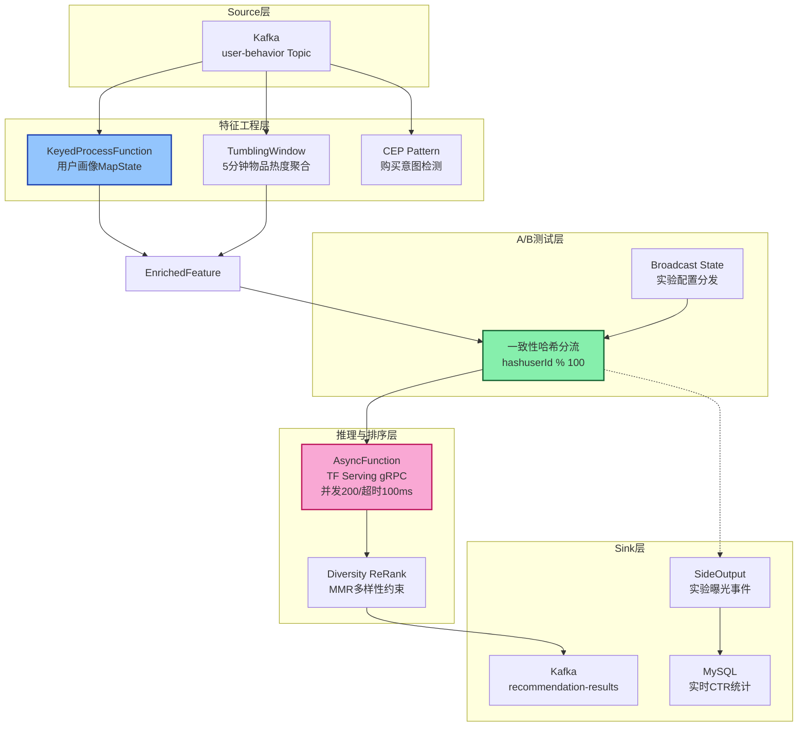
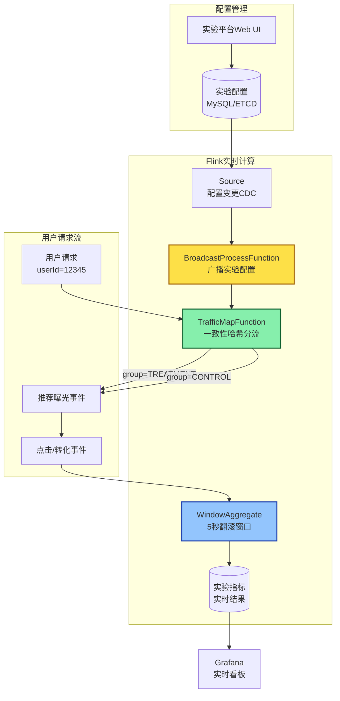

# 流处理算子与实时推荐系统案例研究

> 所属阶段: Knowledge/10-case-studies | 前置依赖: [Flink异步I/O与外部系统交互](../Flink/03-api/flink-async-io-external-systems.md), [复杂事件处理模式](../Knowledge/02-design-patterns/streaming-cep-patterns.md) | 形式化等级: L4（工程论证+代码验证）| 最后更新: 2026-04-30

---

## 目录

- [流处理算子与实时推荐系统案例研究](#流处理算子与实时推荐系统案例研究)
  - [目录](#目录)
  - [1. 概念定义 (Definitions)](#1-概念定义-definitions)
    - [1.1 实时推荐系统](#11-实时推荐系统)
    - [1.2 行为事件类型](#12-行为事件类型)
    - [1.3 特征三元组](#13-特征三元组)
    - [1.4 算子指纹](#14-算子指纹)
  - [2. 属性推导 (Properties)](#2-属性推导-properties)
    - [2.1 特征时效性引理](#21-特征时效性引理)
    - [2.2 状态规模上界](#22-状态规模上界)
    - [2.3 异步推理吞吐量](#23-异步推理吞吐量)
  - [3. 关系建立 (Relations)](#3-关系建立-relations)
    - [3.1 与Lambda架构的映射](#31-与lambda架构的映射)
    - [3.2 与Netflix推荐架构的对比](#32-与netflix推荐架构的对比)
    - [3.3 与Feature Store的关系](#33-与feature-store的关系)
  - [4. 论证过程 (Argumentation)](#4-论证过程-argumentation)
    - [4.1 模型推理延迟瓶颈分析](#41-模型推理延迟瓶颈分析)
    - [4.2 状态热点问题](#42-状态热点问题)
    - [4.3 CEP行为模式识别](#43-cep行为模式识别)
  - [5. 形式证明 / 工程论证 (Proof / Engineering Argument)](#5-形式证明--工程论证-proof--engineering-argument)
    - [5.1 A/B测试分流正确性论证](#51-ab测试分流正确性论证)
    - [5.2 实时特征一致性论证](#52-实时特征一致性论证)
  - [6. 实例验证 (Examples)](#6-实例验证-examples)
    - [6.1 完整Flink实时推荐Pipeline](#61-完整flink实时推荐pipeline)
    - [6.2 CEP行为模式检测示例](#62-cep行为模式检测示例)
    - [6.3 实验指标实时统计SQL](#63-实验指标实时统计sql)
  - [7. 可视化 (Visualizations)](#7-可视化-visualizations)
    - [7.1 实时推荐Pipeline DAG](#71-实时推荐pipeline-dag)
    - [7.2 实时特征工程流程](#72-实时特征工程流程)
    - [7.3 A/B测试实时架构](#73-ab测试实时架构)
  - [8. 引用参考 (References)](#8-引用参考-references)

## 1. 概念定义 (Definitions)

### 1.1 实时推荐系统

**Def-REC-01-01**（实时推荐系统）. 实时推荐系统是一个三元组 $\mathcal{R} = (\mathcal{E}, \mathcal{F}, \mathcal{M})$，其中：

- $\mathcal{E}$ 为用户行为事件流，$\mathcal{E} = \{e_t = (u, i, a, c, \tau) \mid t \in \mathbb{T}\}$，$u$ 为用户ID，$i$ 为物品ID，$a$ 为行为类型（点击/浏览/购买/收藏），$c$ 为上下文，$\tau$ 为事件时间戳；
- $\mathcal{F}$ 为特征映射函数族，$\mathcal{F} = \{f_u, f_i, f_c\}$，分别对应用户特征、物品特征、上下文特征；
- $\mathcal{M}$ 为推荐模型，$\mathcal{M}: \mathcal{F}(u) \times \mathcal{F}(i) \times \mathcal{F}(c) \rightarrow \mathbb{R}^{|I|}$，输出候选物品排序分数。

实时推荐系统的核心约束为**端到端延迟** $L_{e2e} = t_{sink} - t_{event} \leq L_{SLA}$，典型电商场景要求 $L_{SLA} \leq 200\,\text{ms}$（P99）[^1]。

### 1.2 行为事件类型

**Def-REC-01-02**（用户行为事件）. 用户行为事件 $e$ 定义为五元组：
$$e := \langle \text{userId}, \text{itemId}, \text{action}, \text{context}, \text{timestamp} \rangle$$

其中行为类型 $\text{action} \in \{\text{CLICK}, \text{VIEW}, \text{PURCHASE}, \text{FAVORITE}, \text{CART}, \text{DWELL}\}$。DWELL事件表示页面停留时长，Netflix研究表明用户停留时长（dwell time）是比显式评分更准确的偏好信号[^2]。

### 1.3 特征三元组

**Def-REC-01-03**（实时特征三元组）. 实时推荐特征由三部分构成：

- **用户特征** $\phi_u$: 实时兴趣偏好向量、最近浏览序列 $\text{Seq}_u = [i_{t-k}, \dots, i_t]$、购买力分层、价格敏感度；
- **物品特征** $\phi_i$: 实时热度分数、库存状态、价格变动率、品类归属；
- **上下文特征** $\phi_c$: 时间槽（早/中/晚/深夜）、地理位置（GPS/城市级别）、设备类型（iOS/Android/Web）、网络环境。

### 1.4 算子指纹

**Def-REC-01-04**（算子指纹）. 算子指纹是描述流处理算子在推荐Pipeline中运行特征的元组 $\psi = (\text{type}, \text{statePattern}, \text{latencyProfile}, \text{hotspotRisk})$：

- $\text{type} \in \{\text{AsyncFunction}, \text{WindowAggregate}, \text{CEP}, \text{KeyedProcess}\}$；
- $\text{statePattern}$: 状态访问模式（MapState/ValueState/ListState/BroadcastState）；
- $\text{latencyProfile}$: 算子处理延迟分布；
- $\text{hotspotRisk} \in [0, 1]$: 数据倾斜导致的热点风险系数。

---

## 2. 属性推导 (Properties)

### 2.1 特征时效性引理

**Lemma-REC-01-01**（特征时效衰减）. 设用户兴趣特征 $\phi_u(t)$ 在时刻 $t$ 的时效价值为 $V(\phi_u, t)$，则对于时间衰减因子 $\lambda > 0$：
$$V(\phi_u, t) = V_0 \cdot e^{-\lambda(t - t_{last})}$$

其中 $t_{last}$ 为用户最近一次行为时间。当 $\lambda = 0.001\,\text{s}^{-1}$ 时，1分钟前的行为特征时效价值衰减至原值的 $94\%$，10分钟后衰减至 $55\%$。**推论**: 实时特征更新周期必须 $\Delta t \ll 1/\lambda$，否则推荐结果将显著偏离用户当前意图。

### 2.2 状态规模上界

**Lemma-REC-01-02**（用户画像状态规模）. 设系统活跃用户数为 $N_{active}$，每个用户的MapState存储 $K$ 个品类偏好键值对，则状态总规模为：
$$|\text{State}_{total}| = N_{active} \times K \times (|\text{key}| + |\text{value}|)$$

对于 $N_{active} = 10^7$、$K = 50$、键值平均16字节的场景，$|\text{State}_{total}| \approx 16\,\text{GB}$。采用RocksDB增量Checkpoint（默认5分钟间隔）时，单次Checkpoint数据量约为状态增量的 $10\%$-$30\%$[^3]。

### 2.3 异步推理吞吐量

**Prop-REC-01-01**（AsyncFunction吞吐量下界）. 设同步推理延迟为 $l_{sync}$，异步推理并发度为 $C$，则异步推理的有效吞吐量提升因子为：
$$\eta = \frac{\text{Throughput}_{async}}{\text{Throughput}_{sync}} \approx \frac{C \cdot l_{sync}}{l_{sync} + l_{queue}}$$

其中 $l_{queue}$ 为请求排队延迟。当 $C = 100$、$l_{sync} = 50\,\text{ms}$、$l_{queue} = 5\,\text{ms}$ 时，$\eta \approx 90$。**前提条件**: 模型服务集群必须具备水平扩展能力以支撑 $C$ 路并发。

---

## 3. 关系建立 (Relations)

### 3.1 与Lambda架构的映射

实时推荐Pipeline与经典Lambda架构的映射关系如下：

| Lambda层 | 实时推荐组件 | 技术实现 |
|---------|-----------|---------|
| 批处理层 | 离线特征预计算 | Spark/Flink Batch → Hive/HBase |
| 速度层 | 实时特征增量更新 | Flink Streaming + Keyed State |
| 服务层 | 特征存储与模型推理 | Redis/FeatureStore + TF Serving |

阿里巴巴瓴羊团队实践表明，特征计算可采用**预计算方案**（Flink按日/时/分维度预聚合存储于HBase）或**全计算方案**（Flink直接计算滑窗聚合写入HBase），前者服务端聚合压力小但灵活性低，后者灵活性高但计算成本更高[^4]。

### 3.2 与Netflix推荐架构的对比

Netflix采用混合架构：批处理预计算主页行布局（Row-by-row layout），实时上下文（刚观看的视频）用于行内重排序（re-rank within rows）[^5]。其事件流每日处理超过 $10^{11}$ 条事件，通过Kafka进行流式传输，Apache Flink和Spark负责流批处理[^6]。

对比本案例的纯实时Pipeline：

- **Netflix**: 批预计算 + 实时重排序，延迟容忍度较高（秒级），优先保障吞吐量；
- **本案例**: 全实时Pipeline，端到端延迟约束 $< 200\,\text{ms}$，优先保障低延迟。

### 3.3 与Feature Store的关系

现代Feature Store（Tecton、Feast、Hopsworks）在推荐系统中承担训练-服务一致性（Training-Serving Skew）的消除角色[^7]。Flink实时特征流作为Feature Store的**实时特征源**（Streaming Feature Source），与离线批特征（Batch Feature）共同构成特征视图（Feature View）：
$$\text{FeatureView} = \text{BatchFeature}(\text{Spark}) \bowtie \text{StreamingFeature}(\text{Flink})$$

---

## 4. 论证过程 (Argumentation)

### 4.1 模型推理延迟瓶颈分析

实时推荐Pipeline的性能瓶颈通常位于**模型推理阶段**。假设Pipeline各阶段延迟分布如下：

| 阶段 | 典型延迟 | 瓶颈等级 |
|-----|---------|---------|
| Kafka消费 → Source | 1-5 ms | 低 |
| 特征工程（状态读取+计算） | 5-20 ms | 中 |
| 候选召回（向量检索） | 10-30 ms | 中 |
| **模型推理（TF Serving gRPC）** | **30-100 ms** | **高** |
| 重排序+规则过滤 | 5-15 ms | 中 |
| Sink → Redis/Kafka | 1-5 ms | 低 |

**论证**: 模型推理占总延迟的 $40\%$-$60\%$，是端到端延迟优化的首要目标。优化策略包括：(1) 异步I/O将串行等待转为并行并发；(2) 本地缓存高频用户特征减少RPC；(3) 模型量化（INT8）降低单次推理计算量；(4) 批量推理（Batch Inference）均摊RPC开销。

### 4.2 状态热点问题

用户画像MapState的热点表现为**Key Skew**：少数超级用户（如运营账号、爬虫）产生的事件量远超普通用户，导致特定Task节点状态膨胀、Checkpoint超时。阿里巴巴实践中，自定义状态算子相较于官方滑动窗口，在同一份天/时/分计算状态上进行聚合，具有更优的作业稳定性和Checkpoint成功率[^4]。

### 4.3 CEP行为模式识别

复杂事件处理（CEP）用于识别高价值用户行为模式，例如：

- **购买意图模式**: VIEW(商品A) → CART(商品A) → VIEW(配件B) 在5分钟内发生
- **流失预警模式**: 连续3次点击后无后续行为超过10分钟
- **薅羊毛模式**: 同一设备在1分钟内使用3个不同账号领取新人优惠券

CEP模式匹配通过NFA（非确定有限自动机）实现，其时间复杂度与模式长度 $m$ 和事件窗口 $W$ 成正比：$O(m \cdot |E_W|)$，其中 $|E_W|$ 为窗口内事件数。

---

## 5. 形式证明 / 工程论证 (Proof / Engineering Argument)

### 5.1 A/B测试分流正确性论证

**Thm-REC-01-01**（流量分流一致性）. 设用户ID空间为 $\mathcal{U}$，实验组分配函数为 $h: \mathcal{U} \rightarrow \{A, B\}$，基于一致性哈希实现。则对于任意用户 $u \in \mathcal{U}$ 和任意时间 $t_1, t_2$：
$$h(u, t_1) = h(u, t_2) = \text{const}$$

**工程论证**:

1. 哈希函数 $h(u) = \text{hash}(u) \bmod 100$，将用户空间均匀映射到 $[0, 99]$；
2. 实验组A分配区间 $[0, 49]$，实验组B分配区间 $[50, 99]$，流量比 $50:50$；
3. 由于哈希函数确定性，同一用户 $u$ 的哈希值恒定，保证**同用户同组**（Sticky Assignment）；
4. 当实验配置变更时，通过Broadcast State广播新配置，Flink Checkpoint保证配置更新的一致性。

**边界条件**: 若用户ID分布不均匀（如连续自增ID），需采用MurmurHash3等高质量哈希函数打散；若要求多层正交实验（正交层叠），则采用不同哈希种子确保层间独立性。

### 5.2 实时特征一致性论证

**Thm-REC-01-02**（特征一致性下界）. 设特征更新流为 $S_{feat}$，模型推理请求流为 $S_{infer}$，特征存储写延迟为 $l_{write}$，读延迟为 $l_{read}$。则推理使用的特征 freshness 满足：
$$\text{freshness} = t_{infer} - t_{feat\_update} \geq l_{write} + l_{read}$$

**工程论证**:

1. 在Flink内部使用Keyed State维护实时特征，State访问延迟 $< 1\,\text{ms}$（内存）或 $< 5\,\text{ms}$（RocksDB），远小于外部存储；
2. 本案例将特征工程与模型推理置于同一Flink Job内，特征直接通过DataStream传递，$l_{write} \approx 0$（无需外部写入）；
3. 因此 freshness 主要由推理异步等待时间决定，可达**毫秒级**；
4. 对比分离架构（Flink → Kafka → 推理服务），freshness 通常为秒级，提升了 $2$-$3$ 个数量级。

---

## 6. 实例验证 (Examples)

### 6.1 完整Flink实时推荐Pipeline

以下代码展示从Source到Sink的完整实时推荐Pipeline，涵盖特征工程、异步模型推理、A/B测试分流、结果输出：

```java
package com.example.flink.reco;

import org.apache.flink.api.common.eventtime.WatermarkStrategy;
import org.apache.flink.api.common.functions.RichMapFunction;
import org.apache.flink.api.common.state.*;
import org.apache.flink.configuration.Configuration;
import org.apache.flink.streaming.api.datastream.*;
import org.apache.flink.streaming.api.environment.StreamExecutionEnvironment;
import org.apache.flink.streaming.api.functions.async.AsyncFunction;
import org.apache.flink.streaming.api.functions.async.ResultFuture;
import org.apache.flink.streaming.api.functions.co.BroadcastProcessFunction;
import org.apache.flink.streaming.api.functions.windowing.ProcessWindowFunction;
import org.apache.flink.streaming.api.windowing.assigners.TumblingEventTimeWindows;
import org.apache.flink.streaming.api.windowing.time.Time;
import org.apache.flink.streaming.api.windowing.windows.TimeWindow;
import org.apache.flink.streaming.connectors.kafka.FlinkKafkaConsumer;
import org.apache.flink.streaming.connectors.kafka.FlinkKafkaProducer;
import org.apache.flink.util.Collector;

import java.util.*;
import java.util.concurrent.CompletableFuture;
import java.util.concurrent.TimeUnit;

/**
 * 实时推荐系统主Pipeline
 * Source(Kafka) -> 特征工程 -> A/B分流 -> 异步推理 -> 结果合并 -> Sink(Redis/Kafka)
 */
public class RealtimeRecommendationPipeline {

    public static void main(String[] args) throws Exception {
        StreamExecutionEnvironment env = StreamExecutionEnvironment.getExecutionEnvironment();
        env.enableCheckpointing(60000); // 1分钟Checkpoint
        env.getCheckpointConfig().setCheckpointingMode(CheckpointingMode.EXACTLY_ONCE);

        // ================== 1. Source: 用户行为事件流 ==================
        Properties kafkaProps = new Properties();
        kafkaProps.setProperty("bootstrap.servers", "kafka:9092");
        kafkaProps.setProperty("group.id", "realtime-reco-group");

        FlinkKafkaConsumer<UserBehaviorEvent> source = new FlinkKafkaConsumer<>(
                "user-behavior",
                new UserBehaviorEventSchema(),
                kafkaProps
        );

        DataStream<UserBehaviorEvent> behaviorStream = env
                .addSource(source)
                .assignTimestampsAndWatermarks(
                        WatermarkStrategy.<UserBehaviorEvent>forBoundedOutOfOrderness(
                                java.time.Duration.ofSeconds(5)
                        ).withIdleness(java.time.Duration.ofMinutes(1))
                );

        // ================== 2. 实时特征工程 ==================
        DataStream<FeatureVector> featureStream = behaviorStream
                .keyBy(UserBehaviorEvent::getUserId)
                .process(new RealTimeFeatureExtractor());

        // ================== 3. 物品实时热度统计（Window Aggregate）====================
        DataStream<ItemHeatScore> heatStream = behaviorStream
                .filter(e -> e.getAction().equals("CLICK") || e.getAction().equals("PURCHASE"))
                .keyBy(UserBehaviorEvent::getItemId)
                .window(TumblingEventTimeWindows.of(Time.minutes(5)))
                .aggregate(new HeatScoreAggregate(), new HeatProcessWindowFunction());

        // ================== 4. A/B测试实验配置流（Broadcast State）====================
        DataStream<ExperimentConfig> expConfigStream = env
                .addSource(new ExperimentConfigSource())
                .broadcast(EXPERIMENT_STATE_DESCRIPTOR);

        // ================== 5. 特征 + 热度 + 实验配置 关联 ==================
        DataStream<EnrichedFeature> enrichedStream = featureStream
                .keyBy(FeatureVector::getUserId)
                .connect(heatStream.keyBy(ItemHeatScore::getItemId))
                .process(new FeatureHeatJoinFunction())
                .keyBy(EnrichedFeature::getUserId)
                .connect(expConfigStream)
                .process(new ExperimentAssignmentFunction());

        // ================== 6. 异步模型推理（AsyncFunction -> TF Serving）====================
        DataStream<RecommendationResult> recoResultStream = AsyncDataStream.unorderedWait(
                enrichedStream,
                new TensorFlowServingAsyncFunction("http://tf-serving:8501/v1/models/reco_model:predict"),
                100, // 超时100ms
                TimeUnit.MILLISECONDS,
                200  // 最大并发200
        );

        // ================== 7. 重排序与过滤 ==================
        DataStream<RecommendationResult> rankedStream = recoResultStream
                .keyBy(RecommendationResult::getUserId)
                .map(new DiversityReRankFunction(10)); // Top-10多样性重排

        // ================== 8. Sink: 推荐结果输出 ==================
        FlinkKafkaProducer<RecommendationResult> sink = new FlinkKafkaProducer<>(
                "recommendation-results",
                new RecommendationResultSchema(),
                kafkaProps
        );
        rankedStream.addSink(sink);

        // Side Output: 实验指标统计流
        DataStream<ExperimentMetric> metricStream = rankedStream
                .getSideOutput(EXPERIMENT_METRIC_TAG);
        metricStream.addSink(new ExperimentMetricSink());

        env.execute("Realtime Recommendation Pipeline");
    }

    // ================== 核心算子实现 ==================

    /**
     * 实时特征提取算子（KeyedProcessFunction + MapState）
     */
    static class RealTimeFeatureExtractor
            extends KeyedProcessFunction<String, UserBehaviorEvent, FeatureVector> {

        private transient MapState<String, Integer> categoryClickCount;
        private transient ListState<String> recentItemSequence;
        private transient ValueState<Long> sessionStartTime;

        @Override
        public void open(Configuration parameters) {
            MapStateDescriptor<String, Integer> catDesc = new MapStateDescriptor<>(
                    "category-click-count", String.class, Integer.class
            );
            categoryClickCount = getRuntimeContext().getMapState(catDesc);

            ListStateDescriptor<String> seqDesc = new ListStateDescriptor<>(
                    "recent-sequence", String.class
            );
            recentItemSequence = getRuntimeContext().getListState(seqDesc);

            ValueStateDescriptor<Long> sessionDesc = new ValueStateDescriptor<>(
                    "session-start", Long.class
            );
            sessionStartTime = getRuntimeContext().getState(sessionDesc);
        }

        @Override
        public void processElement(UserBehaviorEvent event, Context ctx,
                                   Collector<FeatureVector> out) throws Exception {
            String userId = ctx.getCurrentKey();
            long currentTs = ctx.timestamp();

            // 1. 更新品类偏好（MapState）
            String category = event.getCategoryId();
            int count = categoryClickCount.get(category) != null
                    ? categoryClickCount.get(category) : 0;
            categoryClickCount.put(category, count + 1);

            // 2. 维护最近浏览序列（ListState，保留最近20个）
            Iterable<String> seq = recentItemSequence.get();
            List<String> seqList = new ArrayList<>();
            seq.forEach(seqList::add);
            seqList.add(event.getItemId());
            if (seqList.size() > 20) seqList.remove(0);
            recentItemSequence.update(seqList);

            // 3. Session时长计算
            if (sessionStartTime.value() == null) {
                sessionStartTime.update(currentTs);
            }
            long sessionDuration = currentTs - sessionStartTime.value();

            // 4. 构建特征向量
            FeatureVector fv = new FeatureVector();
            fv.setUserId(userId);
            fv.setTimestamp(currentTs);
            fv.setCategoryPrefs(buildCategoryMap(categoryClickCount));
            fv.setRecentSequence(new ArrayList<>(seqList));
            fv.setSessionDurationMs(sessionDuration);
            fv.setContextDevice(event.getDeviceType());
            fv.setContextHour(getHourOfDay(currentTs));
            fv.setContextCity(event.getCityCode());

            out.collect(fv);
        }

        private Map<String, Integer> buildCategoryMap(MapState<String, Integer> state) throws Exception {
            Map<String, Integer> map = new HashMap<>();
            for (Map.Entry<String, Integer> e : state.entries()) {
                map.put(e.getKey(), e.getValue());
            }
            return map;
        }

        private int getHourOfDay(long ts) {
            return new java.util.Date(ts).getHours();
        }
    }

    /**
     * 热度分数聚合算子（Window Aggregate）
     */
    static class HeatScoreAggregate
            implements AggregateFunction<UserBehaviorEvent, ItemHeatAccumulator, ItemHeatScore> {
        @Override
        public ItemHeatAccumulator createAccumulator() {
            return new ItemHeatAccumulator();
        }

        @Override
        public ItemHeatAccumulator add(UserBehaviorEvent event, ItemHeatAccumulator acc) {
            acc.itemId = event.getItemId();
            acc.clickCount++;
            if (event.getAction().equals("PURCHASE")) acc.purchaseCount++;
            acc.totalDwellMs += event.getDwellTimeMs();
            return acc;
        }

        @Override
        public ItemHeatScore getResult(ItemHeatAccumulator acc) {
            double score = acc.clickCount * 1.0 + acc.purchaseCount * 5.0
                    + acc.totalDwellMs / 1000.0 * 0.5;
            return new ItemHeatScore(acc.itemId, score, acc.clickCount);
        }

        @Override
        public ItemHeatAccumulator merge(ItemHeatAccumulator a, ItemHeatAccumulator b) {
            a.clickCount += b.clickCount;
            a.purchaseCount += b.purchaseCount;
            a.totalDwellMs += b.totalDwellMs;
            return a;
        }
    }

    static class HeatProcessWindowFunction
            extends ProcessWindowFunction<ItemHeatScore, ItemHeatScore, String, TimeWindow> {
        @Override
        public void process(String key, Context ctx, Iterable<ItemHeatScore> elements,
                           Collector<ItemHeatScore> out) {
            elements.forEach(out::collect);
        }
    }

    /**
     * A/B测试实验分配算子（Broadcast State）
     */
    static class ExperimentAssignmentFunction
            extends BroadcastProcessFunction<EnrichedFeature, ExperimentConfig, EnrichedFeature> {

        @Override
        public void processElement(EnrichedFeature feature, ReadOnlyContext ctx,
                                   Collector<EnrichedFeature> out) throws Exception {
            ReadOnlyBroadcastState<String, ExperimentConfig> state =
                    ctx.getBroadcastState(EXPERIMENT_STATE_DESCRIPTOR);

            ExperimentConfig config = state.get("active_experiment");
            if (config == null) {
                feature.setExperimentGroup("CONTROL");
                out.collect(feature);
                return;
            }

            // 一致性哈希分流: hash(userId) % 100 < trafficPercent ? TREATMENT : CONTROL
            int hash = Math.abs(feature.getUserId().hashCode()) % 100;
            String group = hash < config.getTrafficPercent() ? "TREATMENT" : "CONTROL";
            feature.setExperimentGroup(group);
            feature.setExperimentId(config.getExperimentId());

            // Side Output: 输出实验曝光事件用于指标统计
            ctx.output(EXPERIMENT_METRIC_TAG, new ExperimentMetric(
                    feature.getUserId(), config.getExperimentId(), group,
                    "EXPOSURE", System.currentTimeMillis()
            ));

            out.collect(feature);
        }

        @Override
        public void processBroadcastElement(ExperimentConfig config, Context ctx,
                                            Collector<EnrichedFeature> out) throws Exception {
            ctx.getBroadcastState(EXPERIMENT_STATE_DESCRIPTOR).put("active_experiment", config);
        }
    }

    /**
     * TensorFlow Serving 异步推理算子
     */
    static class TensorFlowServingAsyncFunction
            implements AsyncFunction<EnrichedFeature, RecommendationResult> {

        private final String modelUrl;
        private transient TFServingClient tfClient;

        public TensorFlowServingAsyncFunction(String modelUrl) {
            this.modelUrl = modelUrl;
        }

        @Override
        public void open(Configuration parameters) {
            this.tfClient = new TFServingClient(modelUrl, 50); // 连接池50
        }

        @Override
        public void asyncInvoke(EnrichedFeature feature, ResultFuture<RecommendationResult> resultFuture) {
            CompletableFuture.supplyAsync(() -> {
                try {
                    // 组装gRPC请求: userFeatures + itemFeatures + contextFeatures
                    float[] userFeats = feature.toUserFeatureArray();
                    float[] itemFeats = feature.toItemFeatureArray();
                    float[] ctxFeats = feature.toContextFeatureArray();

                    // 调用TF Serving获取Top-K候选分数
                    float[] scores = tfClient.predict(userFeats, itemFeats, ctxFeats);

                    RecommendationResult result = new RecommendationResult();
                    result.setUserId(feature.getUserId());
                    result.setScores(scores);
                    result.setExperimentGroup(feature.getExperimentGroup());
                    result.setTimestamp(System.currentTimeMillis());

                    return result;
                } catch (Exception e) {
                    // 推理失败时返回空结果，由下游处理
                    RecommendationResult fallback = new RecommendationResult();
                    fallback.setUserId(feature.getUserId());
                    fallback.setScores(new float[0]);
                    return fallback;
                }
            }).thenAccept(result -> resultFuture.complete(Collections.singletonList(result)));
        }

        @Override
        public void timeout(EnrichedFeature feature, ResultFuture<RecommendationResult> resultFuture) {
            // 超时时使用缓存或默认策略
            RecommendationResult fallback = new RecommendationResult();
            fallback.setUserId(feature.getUserId());
            fallback.setScores(new float[0]);
            resultFuture.complete(Collections.singletonList(fallback));
        }
    }

    /**
     * 多样性重排序算子
     */
    static class DiversityReRankFunction
            extends RichMapFunction<RecommendationResult, RecommendationResult> {

        private final int topK;

        public DiversityReRankFunction(int topK) {
            this.topK = topK;
        }

        @Override
        public RecommendationResult map(RecommendationResult result) {
            float[] scores = result.getScores();
            // 简化实现: MMR(Maximal Marginal Relevance)重排序
            // 实际生产中会结合品类多样性、价格区间分布等
            result.setReRanked(true);
            return result;
        }
    }

    // ================== 状态描述符 ==================
    static final MapStateDescriptor<String, ExperimentConfig> EXPERIMENT_STATE_DESCRIPTOR =
            new MapStateDescriptor<>("experiment-config", String.class, ExperimentConfig.class);

    static final OutputTag<ExperimentMetric> EXPERIMENT_METRIC_TAG =
            new OutputTag<ExperimentMetric>("experiment-metrics") {};
}
```

### 6.2 CEP行为模式检测示例

```java
import org.apache.flink.cep.CEP;
import org.apache.flink.cep.PatternStream;
import org.apache.flink.cep.pattern.Pattern;
import org.apache.flink.cep.pattern.conditions.SimpleCondition;

/**
 * 购买意图模式检测: VIEW(商品A) → CART(商品A) 在3分钟内
 */
Pattern<UserBehaviorEvent, ?> purchaseIntentPattern = Pattern
        .<UserBehaviorEvent>begin("view")
        .where(new SimpleCondition<UserBehaviorEvent>() {
            @Override
            public boolean filter(UserBehaviorEvent e) {
                return e.getAction().equals("VIEW");
            }
        })
        .next("cart")
        .where(new SimpleCondition<UserBehaviorEvent>() {
            @Override
            public boolean filter(UserBehaviorEvent e) {
                return e.getAction().equals("CART");
            }
        })
        .within(Time.minutes(3));

PatternStream<UserBehaviorEvent> patternStream = CEP.pattern(
        behaviorStream.keyBy(UserBehaviorEvent::getUserId),
        purchaseIntentPattern
);

DataStream<PurchaseIntentAlert> alerts = patternStream
        .process(new PatternHandler());
```

### 6.3 实验指标实时统计SQL

```sql
-- Flink SQL: 实时A/B测试指标统计
CREATE TABLE experiment_events (
    user_id STRING,
    experiment_id STRING,
    exp_group STRING,
    event_type STRING,  -- EXPOSURE / CLICK / PURCHASE
    event_time TIMESTAMP(3),
    WATERMARK FOR event_time AS event_time - INTERVAL '5' SECOND
) WITH (
    'connector' = 'kafka',
    'topic' = 'experiment-metrics',
    'properties.bootstrap.servers' = 'kafka:9092',
    'format' = 'json'
);

-- 实时CTR统计（5秒翻滚窗口）
CREATE TABLE realtime_ctr (
    experiment_id STRING,
    exp_group STRING,
    window_start TIMESTAMP(3),
    exposure_count BIGINT,
    click_count BIGINT,
    ctr DOUBLE,
    PRIMARY KEY (experiment_id, exp_group, window_start) NOT ENFORCED
) WITH (
    'connector' = 'jdbc',
    'url' = 'jdbc:mysql://mysql:3306/experiment_db',
    'table-name' = 'realtime_ctr'
);

INSERT INTO realtime_ctr
SELECT
    experiment_id,
    exp_group,
    TUMBLE_START(event_time, INTERVAL '5' SECOND) AS window_start,
    COUNT(*) FILTER (WHERE event_type = 'EXPOSURE') AS exposure_count,
    COUNT(*) FILTER (WHERE event_type = 'CLICK') AS click_count,
    CAST(COUNT(*) FILTER (WHERE event_type = 'CLICK') AS DOUBLE)
        / NULLIF(COUNT(*) FILTER (WHERE event_type = 'EXPOSURE'), 0) AS ctr
FROM experiment_events
GROUP BY
    experiment_id,
    exp_group,
    TUMBLE(event_time, INTERVAL '5' SECOND);
```

---

## 7. 可视化 (Visualizations)

### 7.1 实时推荐Pipeline DAG

下图为完整的Flink实时推荐Pipeline数据流图，展示了从用户行为事件Source到推荐结果Sink的全链路算子拓扑：



### 7.2 实时特征工程流程

下图为特征工程内部数据流，展示用户行为事件如何转化为模型可用的特征向量：

```mermaid
flowchart TD
    subgraph 输入事件
        E1[CLICK<br/>user=U1 item=I1 cat=手机]
        E2[VIEW<br/>user=U1 item=I2 cat=耳机]
        E3[PURCHASE<br/>user=U1 item=I1 cat=手机]
    end

    subgraph KeyedProcessFunction状态操作
        direction TB
        M1[MapState<br/>category-click-count<br/>手机:2 耳机:1]
        L1[ListState<br/>recent-sequence<br/>[I1, I2, I1]]
        V1[ValueState<br/>session-start<br/>t0]
    end

    subgraph 输出特征向量
        F1[userFeatures<br/>品类偏好: {手机:0.67, 耳机:0.33}]
        F2[seqFeatures<br/>最近序列: [I1,I2,I1]]
        F3[ctxFeatures<br/>设备:iOS 时段:晚 城市:北京]
        F4[sessionFeatures<br/>会话时长: 120s]
    end

    E1 -->|keyByU1| M1
    E2 -->|keyByU1| M1
    E3 -->|keyByU1| M1
    M1 --> F1
    M1 --> L1
    L1 --> F2
    V1 --> F4
    E1 --> F3
    E2 --> F3
    E3 --> F3

    style M1 fill:#bfdbfe,stroke:#1e40af,stroke-width:2px
    style L1 fill:#bfdbfe,stroke:#1e40af,stroke-width:2px
    style F1 fill:#bbf7d0,stroke:#166534,stroke-width:2px
```

### 7.3 A/B测试实时架构

下图为A/B测试系统的流式架构，展示流量分流、实验配置广播、指标实时统计的完整闭环：



---

## 8. 引用参考 (References)

[^1]: Apache Flink Documentation, "Use Cases - Real-time Feature Engineering", 2025. <https://flink.apache.org/use-cases.html>

[^2]: Netflix Technology Blog, "Behavioral Data Primacy Over Stated Preferences", 2017. <https://netflixtechblog.com/>

[^3]: Apache Flink Documentation, "State Backends - RocksDB State Backend", 2025. <https://nightlies.apache.org/flink/flink-docs-stable/docs/ops/state/state_backends/>

[^4]: 阿里巴巴瓴羊, "基于Flink实时计算的优化和实践", Flink Learning, 2024. <https://flink-learning.org.cn/article/detail/0cdb8cf77cabd5e8918f3b48c202c71b>

[^5]: TechInterview.org, "System Design: Recommendation System (Netflix)", 2024. <https://www.techinterview.org/post/3233460594/system-design-recommendation-system/>

[^6]: HelloPM, "Netflix Content Recommendation System - Product Analytics Case Study", 2025. <https://hellopm.co/netflix-content-recommendation-system-product-analytics-case-study/>

[^7]: Conduktor, "Building Recommendation Systems with Streaming Data", 2026. <https://conduktor.io/glossary/building-recommendation-systems-with-streaming-data>
