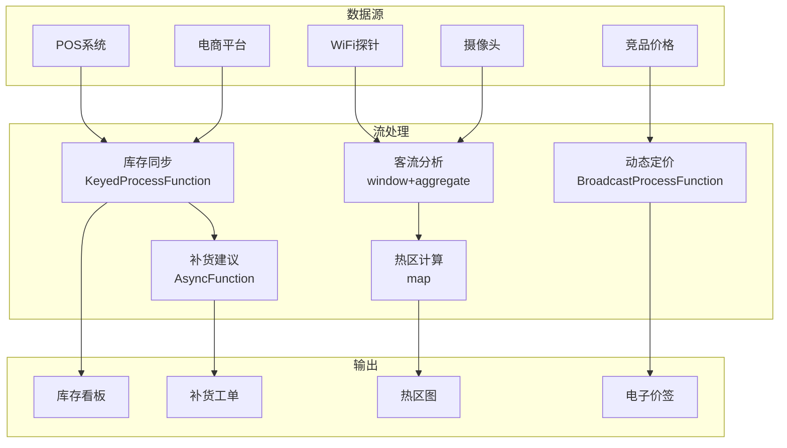

# 算子与实时零售门店运营

> **所属阶段**: Knowledge/10-case-studies | **前置依赖**: [01.06-single-input-operators.md](../01-concept-atlas/operator-deep-dive/01.06-single-input-operators.md), [realtime-recommendation-system-case-study.md](../10-case-studies/realtime-recommendation-system-case-study.md) | **形式化等级**: L3
> **文档定位**: 流处理算子在实时零售门店客流分析、动态定价与库存管理中的算子指纹与Pipeline设计
> **版本**: 2026.04

---

## 目录

- [1. 概念定义 (Definitions)](#1-概念定义-definitions)
- [2. 属性推导 (Properties)](#2-属性推导-properties)
- [3. 关系建立 (Relations)](#3-关系建立-relations)
- [4. 论证过程 (Argumentation)](#4-论证过程-argumentation)
- [5. 形式证明 / 工程论证 (Proof / Engineering Argument)](#5-形式证明--工程论证-proof--engineering-argument)
- [6. 实例验证 (Examples)](#6-实例验证-examples)
- [7. 可视化 (Visualizations)](#7-可视化-visualizations)
- [8. 引用参考 (References)](#8-引用参考-references)

---

## 1. 概念定义 (Definitions)

### Def-RTL-01-01: 零售客流分析（Retail Foot Traffic Analytics）

零售客流分析是对门店顾客行为的实时量化分析：

$$\text{TrafficAnalytics} = (\text{EntryRate}, \text{DwellTime}, \text{ConversionRate}, \text{BasketSize})$$

### Def-RTL-01-02: 动态定价（Dynamic Pricing）

动态定价是根据实时供需调整商品价格的策略：

$$P_t = P_{base} \cdot (1 + \alpha \cdot \frac{D_t - S_t}{S_t}) \cdot (1 + \beta \cdot \text{CompetitorFactor})$$

### Def-RTL-01-03: 实时库存可见性（Real-time Inventory Visibility）

实时库存可见性是全渠道库存状态的秒级更新：

$$\text{Inventory}_t = \text{Inventory}_{t-1} - \text{Sales}_t + \text{Replenishment}_t - \text{Returns}_t$$

### Def-RTL-01-04: 顾客旅程（Customer Journey）

顾客旅程是顾客在门店内的路径和交互序列：

$$Journey = (z_1, t_1) \to (z_2, t_2) \to ... \to (z_n, t_n)$$

其中 $z_i$ 为区域，$t_i$ 为停留时间。

### Def-RTL-01-05: 缺货成本（Stockout Cost）

缺货造成的潜在收益损失：

$$\text{StockoutCost} = \text{LostSales} + \text{CustomerDissatisfaction} + \text{SwitchingCost}$$

---

## 2. 属性推导 (Properties)

### Lemma-RTL-01-01: 客流高峰的排队模型

收银台排队服从M/M/c模型：

$$W_q = \frac{C(c, \rho)}{c \cdot \mu - \lambda}$$

其中 $C(c, \rho)$ 为Erlang-C公式。当 $W_q > 5$ 分钟时，顾客流失率显著上升。

### Lemma-RTL-01-02: 价格弹性的收入效应

价格变化对收入的影响：

$$\frac{dR}{dP} = Q \cdot (1 + \epsilon)$$

当 $|\epsilon| > 1$（弹性），提价减少收入；当 $|\epsilon| < 1$（缺乏弹性），提价增加收入。

### Prop-RTL-01-01: 实时库存准确性的收益

库存准确率对销售的影响：

$$\Delta Sales = Sales \cdot (1 - \text{StockoutRate}_{before}) \cdot \frac{\text{Accuracy}_{after}}{\text{Accuracy}_{before}}$$

库存准确率从70%提升到98%，销售额可提升8-12%。

### Prop-RTL-01-02: 个性化推荐的转化率提升

$$\text{Conversion}_{personalized} = \text{Conversion}_{generic} \cdot (1 + \gamma \cdot \text{Relevance})$$

典型值：个性化推荐转化率提升20-40%。

---

## 3. 关系建立 (Relations)

### 3.1 零售运营Pipeline算子映射

| 应用场景 | 算子组合 | 数据源 | 延迟要求 |
|---------|---------|--------|---------|
| **客流计数** | Source + map + window | WiFi/摄像头 | < 1min |
| **热区分析** | window+aggregate | 位置数据 | < 5min |
| **动态定价** | Broadcast + map | 销售/竞品 | < 1min |
| **库存同步** | KeyedProcessFunction | POS/电商 | < 5s |
| **流失预警** | ProcessFunction + Timer | 行为数据 | < 1min |
| **补货建议** | AsyncFunction + window | 历史+实时 | < 15min |

### 3.2 算子指纹

| 维度 | 零售门店运营特征 |
|------|---------------|
| **核心算子** | KeyedProcessFunction（SKU库存状态机）、BroadcastProcessFunction（价格更新）、window+aggregate（时段统计）、AsyncFunction（补货建议） |
| **状态类型** | ValueState（SKU库存）、MapState（顾客画像）、BroadcastState（定价策略） |
| **时间语义** | 处理时间为主（运营决策实时性） |
| **数据特征** | 高并发（万级SKU）、高频率（秒级POS）、强时间模式（昼夜/周末） |
| **状态热点** | 热门SKU Key、热门门店Key |
| **性能瓶颈** | 外部竞品价格API、库存同步一致性 |

---

## 4. 论证过程 (Argumentation)

### 4.1 为什么零售需要流处理而非传统日报

传统日报的问题：

- 次日报表：错过当天销售机会
- 静态定价：无法应对竞品促销
- 库存滞后：线上下单后发现无货

流处理的优势：

- 实时定价：根据客流和库存秒级调价
- 即时补货：低库存自动触发补货
- 全渠道同步：线上线下库存实时一致

### 4.2 动态定价的伦理边界

**问题**: 动态定价可能被视为价格歧视。

**边界**:

1. **透明性**: 价格变动原因可解释
2. **公平性**: 不基于敏感属性（种族/性别）
3. **一致性**: 同时间同条件同价格

### 4.3 客流隐私保护

**问题**: WiFi探针/摄像头追踪顾客位置涉及隐私。

**方案**:

1. **匿名化**: MAC地址哈希，无法关联个人
2. **聚合**: 只保留统计数据，不保留个体轨迹
3. **退出机制**: 顾客可选择不被追踪

---

## 5. 形式证明 / 工程论证 (Proof / Engineering Argument)

### 5.1 实时库存同步

```java
public class InventorySyncFunction extends KeyedProcessFunction<String, InventoryEvent, InventoryState> {
    private ValueState<Integer> stockState;
    private ValueState<Long> lastUpdate;

    @Override
    public void processElement(InventoryEvent event, Context ctx, Collector<InventoryState> out) throws Exception {
        Integer current = stockState.value();
        if (current == null) current = 0;

        switch (event.getType()) {
            case "SALE":
                current -= event.getQuantity();
                break;
            case "REPLENISHMENT":
                current += event.getQuantity();
                break;
            case "RETURN":
                current += event.getQuantity();
                break;
            case "ADJUSTMENT":
                current = event.getQuantity();
                break;
        }

        stockState.update(current);
        lastUpdate.update(ctx.timestamp());

        // 低库存告警
        if (current < event.getReorderPoint()) {
            out.collect(new InventoryState(event.getSkuId(), current, "LOW_STOCK", ctx.timestamp()));
        } else {
            out.collect(new InventoryState(event.getSkuId(), current, "OK", ctx.timestamp()));
        }
    }
}
```

### 5.2 动态定价引擎

```java
// 销售数据流
DataStream<SaleEvent> sales = env.addSource(new POSSource());

// 竞品价格流（Broadcast）
DataStream<CompetitorPrice> competitorPrices = env.addSource(new CompetitorPriceSource());

// 实时定价
sales.map(SaleEvent::getSkuId)
    .distinct()
    .connect(competitorPrices.broadcast())
    .process(new BroadcastProcessFunction<String, CompetitorPrice, PriceUpdate>() {
        private MapState<String, CompetitorPrice> priceState;

        @Override
        public void processElement(String skuId, ReadOnlyContext ctx, Collector<PriceUpdate> out) throws Exception {
            ReadOnlyBroadcastState<String, CompetitorPrice> competitorState = ctx.getBroadcastState(PRICE_DESCRIPTOR);
            CompetitorPrice comp = competitorState.get(skuId);

            // 定价策略：匹配竞品或维持利润率
            double newPrice;
            if (comp != null && comp.getPrice() < getCurrentPrice(skuId)) {
                newPrice = comp.getPrice() * 0.99;  // 比竞品低1%
            } else {
                newPrice = getCurrentPrice(skuId);
            }

            out.collect(new PriceUpdate(skuId, newPrice, ctx.timestamp()));
        }

        @Override
        public void processBroadcastElement(CompetitorPrice price, Context ctx, Collector<PriceUpdate> out) {
            ctx.getBroadcastState(PRICE_DESCRIPTOR).put(price.getSkuId(), price);
        }
    })
    .addSink(new PriceUpdateSink());
```

### 5.3 客流热区分析

```java
// 顾客位置流
DataStream<CustomerPosition> positions = env.addSource(new WiFiTrackingSource());

// 热区统计
positions.map(pos -> new ZoneEvent(pos.getZoneId(), pos.getCustomerId(), pos.getTimestamp()))
    .keyBy(ZoneEvent::getZoneId)
    .window(SlidingProcessingTimeWindows.of(Time.minutes(5), Time.minutes(1)))
    .aggregate(new UniqueVisitorAggregate())
    .process(new ProcessFunction<ZoneCount, HeatmapUpdate>() {
        @Override
        public void processElement(ZoneCount count, Context ctx, Collector<HeatmapUpdate> out) {
            double density = count.getUniqueVisitors() / count.getZoneArea();
            String level;
            if (density > 2.0) level = "HOT";
            else if (density > 1.0) level = "WARM";
            else level = "COLD";

            out.collect(new HeatmapUpdate(count.getZoneId(), density, level, ctx.timestamp()));
        }
    })
    .addSink(new HeatmapSink());
```

---

## 6. 实例验证 (Examples)

### 6.1 实战：全渠道零售运营平台

```java
// 1. 多源销售数据
DataStream<SaleEvent> posSales = env.addSource(new POSSource());
DataStream<SaleEvent> onlineSales = env.addSource(new EcommerceSource());

// 2. 全渠道库存同步
posSales.union(onlineSales)
    .keyBy(SaleEvent::getSkuId)
    .process(new InventorySyncFunction())
    .addSink(new InventoryDashboardSink());

// 3. 客流分析
DataStream<CustomerPosition> positions = env.addSource(new WiFiTrackingSource());
positions.keyBy(CustomerPosition::getZoneId)
    .window(SlidingProcessingTimeWindows.of(Time.minutes(5), Time.minutes(1)))
    .aggregate(new UniqueVisitorAggregate())
    .addSink(new HeatmapSink());

// 4. 动态定价
DataStream<PriceUpdate> priceUpdates = env.addSource(new PricingEngineSource());
priceUpdates.addSink(new DigitalPriceTagSink());
```

### 6.2 实战：智能补货系统

```java
// 销售聚合
DataStream<SaleEvent> sales = env.addSource(new POSSource());

// 计算实时销售速率
sales.keyBy(SaleEvent::getSkuId)
    .window(SlidingEventTimeWindows.of(Time.hours(1), Time.minutes(10)))
    .aggregate(new SalesRateAggregate())
    .connect(inventoryStateBroadcast)
    .process(new CoProcessFunction<SalesRate, InventoryState, ReplenishmentOrder>() {
        @Override
        public void processElement1(SalesRate rate, Context ctx, Collector<ReplenishmentOrder> out) {
            InventoryState inv = inventoryState.value();
            if (inv == null) return;

            // 预测库存耗尽时间
            double daysToStockout = inv.getCurrentStock() / rate.getDailyRate();

            if (daysToStockout < 3 && !inv.hasPendingOrder()) {
                int orderQty = calculateOrderQuantity(rate.getDailyRate(), inv.getLeadTimeDays());
                out.collect(new ReplenishmentOrder(rate.getSkuId(), orderQty, "AUTO", ctx.timestamp()));
            }
        }

        @Override
        public void processElement2(InventoryState inv, Context ctx, Collector<ReplenishmentOrder> out) {
            inventoryState.update(inv);
        }
    })
    .addSink(new ReplenishmentSink());
```

---

## 7. 可视化 (Visualizations)

### 零售运营Pipeline



---

## 8. 引用参考 (References)


---

*关联文档*: [01.06-single-input-operators.md](../01-concept-atlas/operator-deep-dive/01.06-single-input-operators.md) | [realtime-recommendation-system-case-study.md](../10-case-studies/realtime-recommendation-system-case-study.md) | [realtime-supply-chain-tracking-case-study.md](../10-case-studies/realtime-supply-chain-tracking-case-study.md)
