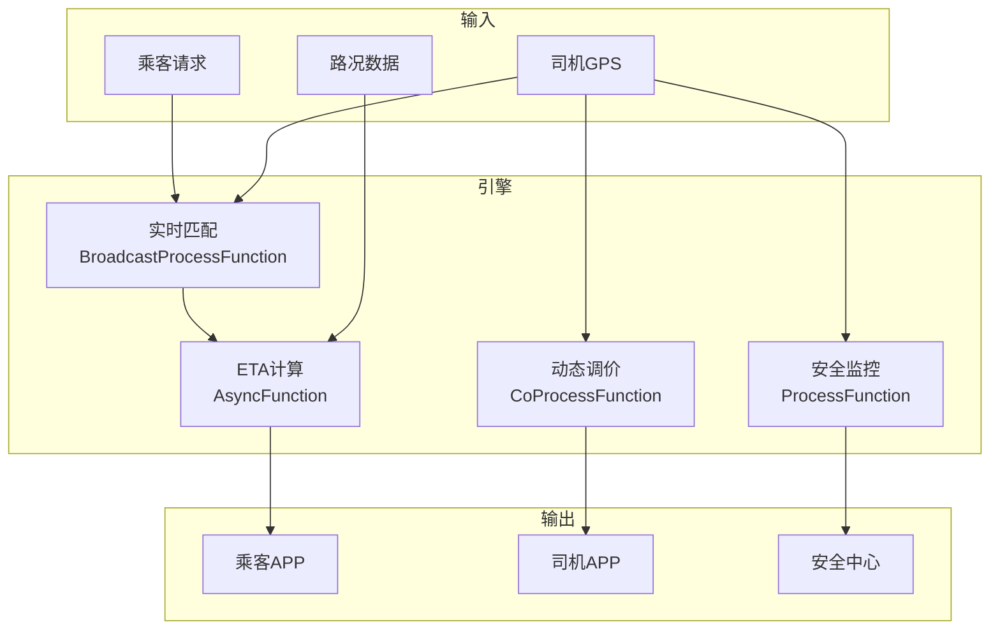

# 算子与实时网约车/共享出行

> **所属阶段**: Knowledge/10-case-studies | **前置依赖**: [01.07-two-input-operators.md](../01-concept-atlas/operator-deep-dive/01.07-two-input-operators.md), [realtime-traffic-management-case-study.md](../10-case-studies/realtime-traffic-management-case-study.md) | **形式化等级**: L3
> **文档定位**: 流处理算子在实时网约车供需匹配、动态调价与路径规划中的算子指纹与Pipeline设计
> **版本**: 2026.04

---

## 目录

- [1. 概念定义 (Definitions)](#1-概念定义-definitions)
- [2. 属性推导 (Properties)](#2-属性推导-properties)
- [3. 关系建立 (Relations)](#3-关系建立-relations)
- [4. 论证过程 (Argumentation)](#4-论证过程-argumentation)
- [5. 形式证明 / 工程论证 (Proof / Engineering Argument)](#5-形式证明--工程论证-proof--engineering-argument)
- [6. 实例验证 (Examples)](#6-实例验证-examples)
- [7. 可视化 (Visualizations)](#7-可视化-visualizations)
- [8. 引用参考 (References)](#8-引用参考-references)

---

## 1. 概念定义 (Definitions)

### Def-RDH-01-01: 网约车供需匹配（Ride-hailing Matching）

网约车供需匹配是将乘客订单与可用司机进行最优配对：

$$\text{Match}^* = \arg\min_{m} \sum_{(p,d) \in m} \text{Cost}(p, d)$$

其中 $\text{Cost}$ 包括接驾距离、等待时间、司机偏好等。

### Def-RDH-01-02: 动态调价（Surge Pricing）

动态调价是根据供需关系实时调整费率：

$$\text{Multiplier}_z = \left(\frac{D_z}{S_z}\right)^{\gamma}$$

其中 $D_z$ 为区域 $z$ 的需求，$S_z$ 为供给，$\gamma$ 为弹性系数。

### Def-RDH-01-03: 接驾时间估计（Estimated Time to Arrival, ETA）

ETA是司机到达乘客上车点的预计时间：

$$\text{ETA} = \frac{D_{pickup}}{v_{current}} + T_{search} + T_{traffic}$$

### Def-RDH-01-04: 司机服务分（Driver Rating Score）

司机服务分是综合服务质量的历史评价：

$$\text{Score}_d = \alpha \cdot \bar{R}_d + \beta \cdot C_{accept} + \gamma \cdot C_{complete} - \delta \cdot C_{cancel}$$

### Def-RDH-01-05: 拼车匹配（Pool Matching）

拼车匹配是将多个行程方向相近的乘客合并：

$$\text{Pool} = \{(p_1, p_2) : \text{Angle}(\vec{r}_1, \vec{r}_2) < \theta_{max} \land \Delta D < D_{max}\}$$

---

## 2. 属性推导 (Properties)

### Lemma-RDH-01-01: 匹配成功率与供需比

$$P_{match} = 1 - e^{-\lambda \cdot S/D}$$

其中 $S/D$ 为供需比，$\lambda$ 为平台效率系数。

### Lemma-RDH-01-02: 动态调价的供需平衡效果

$$\frac{\Delta S}{S} = \epsilon_S \cdot \Delta M, \quad \frac{\Delta D}{D} = \epsilon_D \cdot \Delta M$$

其中 $\epsilon_S > 0$（供给弹性），$\epsilon_D < 0$（需求弹性）。

### Prop-RDH-01-01: 拼车节省率

$$\text{Savings}_{pool} = 1 - \frac{F_{pool,1} + F_{pool,2}}{F_{solo,1} + F_{solo,2}}$$

典型值：拼车为每乘客节省20-40%费用，平台提升30-50%司机收入。

### Prop-RDH-01-02: 高峰期供需缺口

$$\text{Gap}_{peak} = D_{peak} - S_{peak} \approx 2\text{-}3 \times S_{normal}$$

---

## 3. 关系建立 (Relations)

### 3.1 网约车Pipeline算子映射

| 应用场景 | 算子组合 | 数据源 | 延迟要求 |
|---------|---------|--------|---------|
| **乘客叫车** | Source + map | 乘客APP | < 1s |
| **司机匹配** | AsyncFunction | 供需数据 | < 2s |
| **ETA计算** | AsyncFunction | 地图API | < 1s |
| **动态调价** | window+aggregate + map | 供需流 | < 10s |
| **拼车匹配** | window+process | 区域内订单 | < 30s |
| **行程监控** | ProcessFunction + Timer | GPS | < 5s |

### 3.2 算子指纹

| 维度 | 网约车特征 |
|------|------------|
| **核心算子** | AsyncFunction（匹配/ETA）、BroadcastProcessFunction（调价策略）、ProcessFunction（行程状态机）、window+aggregate（供需统计） |
| **状态类型** | ValueState（司机状态）、MapState（区域供需）、BroadcastState（定价策略） |
| **时间语义** | 处理时间为主（匹配强调实时性） |
| **数据特征** | 高突发（高峰/雨雪）、强空间性、双边市场 |
| **状态热点** | 热门区域Key、高峰时段Key |
| **性能瓶颈** | 匹配算法、地图ETA API |

---

## 4. 论证过程 (Argumentation)

### 4.1 为什么网约车需要流处理而非传统调度

传统调度的问题：
- 人工派单：效率低，无法规模化
- 固定价格：高峰期无车，平峰期过剩
- 静态区域：无法应对动态需求变化

流处理的优势：
- 实时匹配：秒级完成乘客-司机配对
- 动态调价：自动平衡供需
- 全局优化：基于全城实时状态做决策

### 4.2 双边市场的网络效应

**问题**: 乘客越多→司机越多→等待时间越短→乘客越多。

**流处理方案**: 实时监控双边密度，在低密度区域通过补贴激励供给。

### 4.3 安全监控

**场景**: 行程中偏离路线、长时间停留、异常速度。

**流处理方案**: GPS轨迹实时分析 → 异常检测 → 自动告警 → 安全客服介入。

---

## 5. 形式证明 / 工程论证 (Proof / Engineering Argument)

### 5.1 实时供需匹配引擎

```java
public class RideMatchingFunction extends BroadcastProcessFunction<RideRequest, DriverStatus, MatchResult> {
    private MapState<String, DriverStatus> availableDrivers;
    
    @Override
    public void processElement(RideRequest request, ReadOnlyContext ctx, Collector<MatchResult> out) throws Exception {
        String bestDriver = null;
        double bestScore = Double.NEGATIVE_INFINITY;
        
        for (Map.Entry<String, DriverStatus> entry : availableDrivers.entries()) {
            DriverStatus driver = entry.getValue();
            if (!driver.isAvailable()) continue;
            
            double pickupDistance = calculateDistance(request.getPickupLocation(), driver.getLocation());
            if (pickupDistance > 5000) continue;  // 5km上限
            
            double eta = estimateETA(driver.getLocation(), request.getPickupLocation());
            
            // 评分 = -距离权重 - 等待权重 + 评分权重
            double score = -0.5 * pickupDistance - 0.3 * eta + 0.2 * driver.getRating();
            
            if (score > bestScore) {
                bestScore = score;
                bestDriver = entry.getKey();
            }
        }
        
        if (bestDriver != null) {
            DriverStatus driver = availableDrivers.get(bestDriver);
            driver.setAvailable(false);
            availableDrivers.put(bestDriver, driver);
            
            out.collect(new MatchResult(request.getId(), bestDriver, 
                estimateETA(driver.getLocation(), request.getPickupLocation()), ctx.timestamp()));
        }
    }
    
    @Override
    public void processBroadcastElement(DriverStatus driver, Context ctx, Collector<MatchResult> out) {
        availableDrivers.put(driver.getId(), driver);
    }
}
```

### 5.2 动态调价引擎

```java
// 供需数据流
DataStream<ZoneDemand> demand = env.addSource(new DemandSource());
DataStream<ZoneSupply> supply = env.addSource(new DriverLocationSource());

// 区域供需比
demand.keyBy(ZoneDemand::getZoneId)
    .connect(supply.keyBy(ZoneSupply::getZoneId))
    .process(new CoProcessFunction<ZoneDemand, ZoneSupply, SurgeMultiplier>() {
        private ValueState<Integer> demandState;
        private ValueState<Integer> supplyState;
        
        @Override
        public void processElement1(ZoneDemand d, Context ctx, Collector<SurgeMultiplier> out) {
            demandState.update(d.getCount());
            calculateAndEmit(out, ctx);
        }
        
        @Override
        public void processElement2(ZoneSupply s, Context ctx, Collector<SurgeMultiplier> out) {
            supplyState.update(s.getCount());
            calculateAndEmit(out, ctx);
        }
        
        private void calculateAndEmit(Collector<SurgeMultiplier> out, Context ctx) {
            Integer d = demandState.value();
            Integer s = supplyState.value();
            if (d == null || s == null || s == 0) return;
            
            double ratio = (double) d / s;
            double multiplier = Math.pow(ratio, 0.6);
            multiplier = Math.max(1.0, Math.min(multiplier, 3.0));  // 1x-3x
            
            out.collect(new SurgeMultiplier(ctx.getCurrentKey(), multiplier, ctx.timestamp()));
        }
    })
    .addSink(new PriceUpdateSink());
```

### 5.3 行程安全监控

```java
// 司机GPS流
DataStream<DriverGPS> gps = env.addSource(new DriverGPSSource());

// 异常检测
gps.keyBy(DriverGPS::getDriverId)
    .process(new KeyedProcessFunction<String, DriverGPS, SafetyAlert>() {
        private ValueState<DriverGPS> lastGPS;
        private ValueState<Integer> alertCount;
        
        @Override
        public void processElement(DriverGPS current, Context ctx, Collector<SafetyAlert> out) throws Exception {
            DriverGPS last = lastGPS.value();
            if (last == null) {
                lastGPS.update(current);
                return;
            }
            
            double timeDiff = (current.getTimestamp() - last.getTimestamp()) / 1000.0;
            double distance = calculateDistance(last.getLocation(), current.getLocation());
            double speed = distance / timeDiff;
            
            // 超速检测
            if (speed > 120) {
                out.collect(new SafetyAlert(current.getDriverId(), "OVER_SPEED", speed, ctx.timestamp()));
            }
            
            // 偏离路线检测
            double deviation = calculateRouteDeviation(current.getLocation(), current.getExpectedRoute());
            if (deviation > 1000) {
                int alerts = alertCount.value() != null ? alertCount.value() : 0;
                alerts++;
                alertCount.update(alerts);
                
                if (alerts >= 3) {
                    out.collect(new SafetyAlert(current.getDriverId(), "ROUTE_DEVIATION", deviation, ctx.timestamp()));
                    alertCount.clear();
                }
            }
            
            lastGPS.update(current);
        }
    })
    .addSink(new SafetyCenterSink());
```

---

## 6. 实例验证 (Examples)

### 6.1 实战：网约车平台实时调度

```java
// 1. 乘客请求流
DataStream<RideRequest> requests = env.addSource(new PassengerSource());

// 2. 司机状态流
DataStream<DriverStatus> drivers = env.addSource(new DriverGPSSource());

// 3. 实时匹配
requests.connect(drivers.broadcast())
    .process(new RideMatchingFunction())
    .addSink(new MatchNotificationSink());

// 4. 动态调价
DataStream<ZoneDemand> demand = env.addSource(new DemandSource());
DataStream<ZoneSupply> supply = env.addSource(new DriverLocationSource());
demand.connect(supply.keyBy(ZoneSupply::getZoneId))
    .process(new SurgePricingFunction())
    .addSink(new FareUpdateSink());

// 5. 安全监控
DataStream<DriverGPS> gps = env.addSource(new DriverGPSSource());
gps.keyBy(DriverGPS::getDriverId)
    .process(new SafetyMonitorFunction())
    .addSink(new SafetyAlertSink());
```

---

## 7. 可视化 (Visualizations)

### 网约车Pipeline



---

## 8. 引用参考 (References)

[^1]: Uber, "Uber Marketplace", https://www.uber.com/

[^2]: Didi, "Didi AI Labs", https://www.didiglobal.com/

[^3]: Wikipedia, "Ridesharing Company", https://en.wikipedia.org/wiki/Ridesharing_company

[^4]: Wikipedia, "Surge Pricing", https://en.wikipedia.org/wiki/Surge_pricing

[^5]: Apache Flink Documentation, "Broadcast State", https://nightlies.apache.org/flink/flink-docs-stable/docs/dev/datastream/fault-tolerance/broadcast_state/

[^6]: ACM, "Dynamic Pricing in Ride-sharing Platforms", 2023.

---

*关联文档*: [01.07-two-input-operators.md](../01-concept-atlas/operator-deep-dive/01.07-two-input-operators.md) | [realtime-traffic-management-case-study.md](../10-case-studies/realtime-traffic-management-case-study.md) | [realtime-food-delivery-case-study.md](../10-case-studies/realtime-food-delivery-case-study.md)
