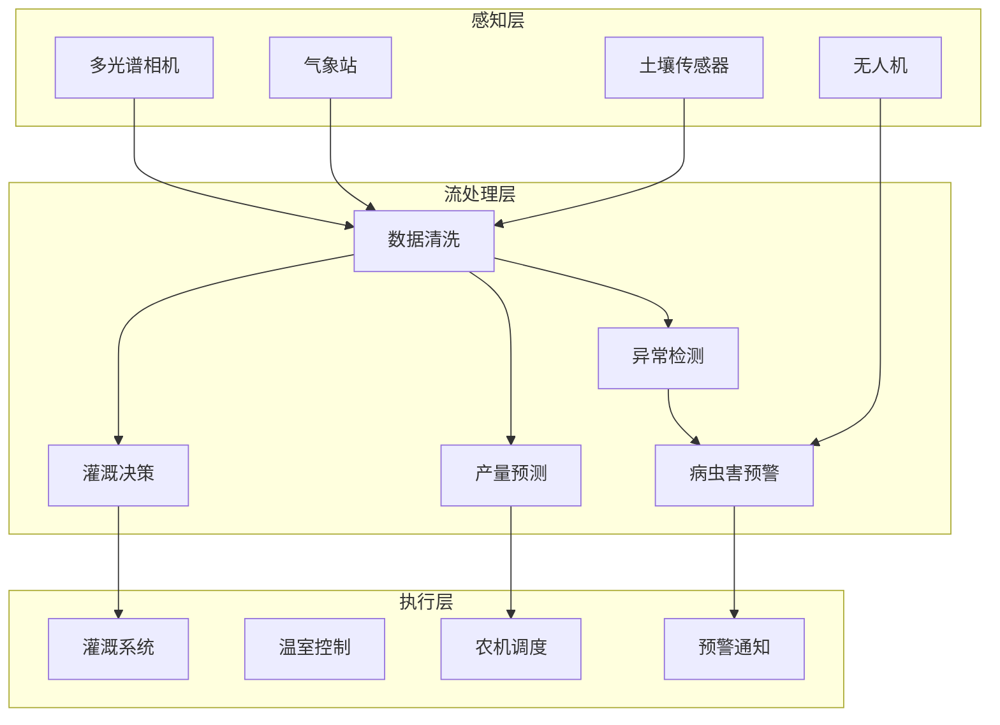

# 算子与实时智慧农业

> **所属阶段**: Knowledge/10-case-studies | **前置依赖**: [01.07-two-input-operators.md](../01-concept-atlas/operator-deep-dive/01.07-two-input-operators.md), [realtime-iot-stream-processing-case-study.md](../10-case-studies/realtime-iot-stream-processing-case-study.md) | **形式化等级**: L3
> **文档定位**: 流处理算子在智慧农业环境监测、精准灌溉与作物健康分析中的算子指纹与Pipeline设计
> **版本**: 2026.04

---

## 目录

- [算子与实时智慧农业](#算子与实时智慧农业)
  - [目录](#目录)
  - [1. 概念定义 (Definitions)](#1-概念定义-definitions)
    - [Def-AGR-01-01: 农业物联网（Agri-IoT）](#def-agr-01-01-农业物联网agri-iot)
    - [Def-AGR-01-02: 作物水分亏缺指数（Crop Water Stress Index, CWSI）](#def-agr-01-02-作物水分亏缺指数crop-water-stress-index-cwsi)
    - [Def-AGR-01-03: 精准灌溉（Precision Irrigation）](#def-agr-01-03-精准灌溉precision-irrigation)
    - [Def-AGR-01-04: 病虫害预警模型（Pest/Disease Early Warning）](#def-agr-01-04-病虫害预警模型pestdisease-early-warning)
    - [Def-AGR-01-05: 归一化植被指数（NDVI）](#def-agr-01-05-归一化植被指数ndvi)
  - [2. 属性推导 (Properties)](#2-属性推导-properties)
    - [Lemma-AGR-01-01: 灌溉决策的时序约束](#lemma-agr-01-01-灌溉决策的时序约束)
    - [Lemma-AGR-01-02: 多传感器融合的精度提升](#lemma-agr-01-02-多传感器融合的精度提升)
    - [Prop-AGR-01-01: 灌溉节水效果](#prop-agr-01-01-灌溉节水效果)
    - [Prop-AGR-01-02: 病虫害预警的提前期](#prop-agr-01-02-病虫害预警的提前期)
  - [3. 关系建立 (Relations)](#3-关系建立-relations)
    - [3.1 智慧农业Pipeline算子映射](#31-智慧农业pipeline算子映射)
    - [3.2 算子指纹](#32-算子指纹)
    - [3.3 传感器对比](#33-传感器对比)
  - [4. 论证过程 (Argumentation)](#4-论证过程-argumentation)
    - [4.1 为什么智慧农业需要流处理而非定时采集](#41-为什么智慧农业需要流处理而非定时采集)
    - [4.2 多传感器数据融合的挑战](#42-多传感器数据融合的挑战)
    - [4.3 灌溉决策的冲突解决](#43-灌溉决策的冲突解决)
  - [5. 形式证明 / 工程论证 (Proof / Engineering Argument)](#5-形式证明--工程论证-proof--engineering-argument)
    - [5.1 精准灌溉决策引擎](#51-精准灌溉决策引擎)
    - [5.2 病虫害预警系统](#52-病虫害预警系统)
    - [5.3 NDVI变化监测](#53-ndvi变化监测)
  - [6. 实例验证 (Examples)](#6-实例验证-examples)
    - [6.1 实战：大型农场智能灌溉系统](#61-实战大型农场智能灌溉系统)
    - [6.2 实战：温室环境控制](#62-实战温室环境控制)
  - [7. 可视化 (Visualizations)](#7-可视化-visualizations)
    - [智慧农业Pipeline](#智慧农业pipeline)
  - [8. 引用参考 (References)](#8-引用参考-references)

---

## 1. 概念定义 (Definitions)

### Def-AGR-01-01: 农业物联网（Agri-IoT）

农业物联网是部署在农田中的传感器网络，用于实时监测环境参数：

$$\text{AgriIoT} = \{s_i : (\text{type}_i, \text{location}_i, \text{frequency}_i, \text{accuracy}_i)\}_{i=1}^{n}$$

传感器类型：土壤湿度、温度、光照、CO₂浓度、风速、降雨量、pH值。

### Def-AGR-01-02: 作物水分亏缺指数（Crop Water Stress Index, CWSI）

CWSI是表征作物水分胁迫程度的指标：

$$\text{CWSI} = \frac{(T_{canopy} - T_{air}) - (T_{canopy}^{wet} - T_{air})}{(T_{canopy}^{dry} - T_{air}) - (T_{canopy}^{wet} - T_{air})}$$

CWSI ∈ [0, 1]，越接近1表示水分胁迫越严重。

### Def-AGR-01-03: 精准灌溉（Precision Irrigation）

精准灌溉是根据作物实时需水量优化灌溉决策的系统：

$$\text{Irrigate} = \text{CWSI} > \theta_{threshold} \land \text{SoilMoisture} < \theta_{moisture} \land \text{RainForecast} < \theta_{rain}$$

### Def-AGR-01-04: 病虫害预警模型（Pest/Disease Early Warning）

病虫害预警基于环境条件的适宜度模型：

$$\text{Risk} = f(T, RH, L, W) = \prod_{i} \left(1 - \left|\frac{x_i - x_i^{optimal}}{x_i^{max} - x_i^{min}}\right|\right)$$

其中 $T$=温度, $RH$=相对湿度, $L$=光照, $W$=风速。

### Def-AGR-01-05: 归一化植被指数（NDVI）

NDVI是通过遥感数据评估植被健康状况的指标：

$$\text{NDVI} = \frac{NIR - RED}{NIR + RED}$$

NDVI ∈ [-1, 1]，健康植被约 0.3-0.8，裸土约 0.1-0.2，水体为负值。

---

## 2. 属性推导 (Properties)

### Lemma-AGR-01-01: 灌溉决策的时序约束

灌溉决策必须考虑传感器数据的时效性：

$$\text{Valid}(d_t) \iff t_{data} \geq t_{decision} - \Delta t_{max}$$

其中 $\Delta t_{max}$ 为数据最大有效期（通常 15-60 分钟）。

### Lemma-AGR-01-02: 多传感器融合的精度提升

多传感器融合的标准误差：

$$\sigma_{fusion} = \frac{1}{\sqrt{\sum_{i} \frac{1}{\sigma_i^2}}}$$

**证明**: 最优线性无偏估计（BLUE）的方差为各传感器方差的调和平均。∎

### Prop-AGR-01-01: 灌溉节水效果

精准灌溉相比传统漫灌的节水率：

$$\text{WaterSaving} = 1 - \frac{V_{precision}}{V_{flood}}$$

典型值：滴灌 30-50%，微喷灌 20-40%，传感器驱动灌溉额外节省 10-20%。

### Prop-AGR-01-02: 病虫害预警的提前期

环境驱动的预警模型相比人工巡查的提前期：

$$\text{LeadTime} = t_{symptom} - t_{condition}$$

典型值：真菌病害 3-7 天，害虫爆发 1-3 天。

---

## 3. 关系建立 (Relations)

### 3.1 智慧农业Pipeline算子映射

| 应用场景 | 算子组合 | 数据源 | 延迟要求 |
|---------|---------|--------|---------|
| **环境监测** | Source + map | 土壤/气象传感器 | < 1min |
| **异常检测** | window + aggregate + filter | 传感器流 | < 5min |
| **灌溉决策** | KeyedProcessFunction | 多传感器融合 | < 10min |
| **病虫害预警** | Async ML + window | 传感器+图像 | < 15min |
| **产量预测** | window+aggregate+ML | 全量数据 | 日级 |
| **资源调度** | Broadcast + KeyedProcess | 农机GPS | < 1min |

### 3.2 算子指纹

| 维度 | 智慧农业特征 |
|------|------------|
| **核心算子** | KeyedProcessFunction（地块状态机）、AsyncFunction（ML推理）、Broadcast（灌溉配置）、window+aggregate（统计） |
| **状态类型** | ValueState（地块当前状态）、MapState（传感器校准参数）、BroadcastState（灌溉策略） |
| **时间语义** | 处理时间为主（农业实时性要求较低） |
| **数据特征** | 周期性（日夜周期）、季节性、空间相关性强 |
| **状态规模** | 按地块分Key，大规模农场可达百万级 |
| **性能瓶颈** | 图像处理（病虫害识别）、外部气象API |

### 3.3 传感器对比

| 传感器 | 采样频率 | 精度 | 成本 | 关键指标 |
|--------|---------|------|------|---------|
| **土壤湿度** | 15min | ±2% | 低 | 体积含水量 |
| **温度** | 5min | ±0.5°C | 低 | 空气/土壤温度 |
| **光照** | 1min | ±5% | 低 | PAR/总辐射 |
| **CO₂** | 5min | ±20ppm | 中 | 温室浓度 |
| **多光谱相机** | 日/周 | 高 | 高 | NDVI |
| **无人机遥感** | 周/月 | 高 | 高 | 全田监测 |

---

## 4. 论证过程 (Argumentation)

### 4.1 为什么智慧农业需要流处理而非定时采集

定时采集的问题：

- 数据间隔长：无法捕捉突发的环境变化
- 响应滞后：灌溉决策延迟导致作物受损
- 资源浪费：固定灌溉计划不考虑实时需求

流处理的优势：

- 实时监测：环境异常立即响应
- 按需灌溉：根据实时数据精准控制
- 动态调整：结合天气预报调整策略

### 4.2 多传感器数据融合的挑战

**问题**: 不同传感器采样频率、精度、位置各异，如何融合？

**方案**:

1. **时间对齐**: 使用最近邻或插值方法对齐时间戳
2. **空间插值**: 利用Kriging插值估计未部署传感器位置的值
3. **质量评估**: 对异常传感器数据降权或丢弃

### 4.3 灌溉决策的冲突解决

**场景**: 相邻地块同时请求灌溉，但水泵容量有限。

**策略**:

1. **优先级**: CWSI高的地块优先
2. **分时**: 轮流灌溉，每地块10分钟
3. **预测**: 结合天气预报，若即将降雨则跳过灌溉

---

## 5. 形式证明 / 工程论证 (Proof / Engineering Argument)

### 5.1 精准灌溉决策引擎

```java
public class IrrigationDecisionFunction extends BroadcastProcessFunction<SensorReading, IrrigationConfig, IrrigationCommand> {
    private ValueState<FieldState> fieldState;
    private MapState<String, SensorReading> latestReadings;

    @Override
    public void processElement(SensorReading reading, ReadOnlyContext ctx, Collector<IrrigationCommand> out) throws Exception {
        // 保存最新读数
        latestReadings.put(reading.getSensorId(), reading);

        FieldState state = fieldState.value();
        if (state == null) state = new FieldState();

        // 获取该地块所有传感器数据
        double soilMoisture = getAverage("SOIL_MOISTURE", state.getFieldId());
        double temperature = getAverage("TEMPERATURE", state.getFieldId());
        double canopyTemp = getAverage("CANOPY_TEMP", state.getFieldId());

        // 计算CWSI
        double cwsi = calculateCWSI(canopyTemp, temperature);

        // 获取天气预报（Broadcast State）
        ReadOnlyBroadcastState<String, WeatherForecast> weather = ctx.getBroadcastState(WEATHER_DESCRIPTOR);
        WeatherForecast forecast = weather.get(state.getFieldId());

        double rainForecast = forecast != null ? forecast.getRainProbability() : 0;

        // 灌溉决策
        boolean shouldIrrigate = cwsi > 0.6 && soilMoisture < 30 && rainForecast < 0.3;

        if (shouldIrrigate && !state.isIrrigating()) {
            double duration = calculateDuration(cwsi, soilMoisture);
            out.collect(new IrrigationCommand(state.getFieldId(), duration, "START"));
            state.setIrrigating(true);
            fieldState.update(state);
        }

        // 更新地块状态
        state.setCwsi(cwsi);
        state.setSoilMoisture(soilMoisture);
        fieldState.update(state);
    }

    private double calculateCWSI(double canopyTemp, double airTemp) {
        double wetDiff = 0;  // 充分灌溉时的温差
        double dryDiff = 5;  // 严重胁迫时的温差
        double actualDiff = canopyTemp - airTemp;
        return (actualDiff - wetDiff) / (dryDiff - wetDiff);
    }
}
```

### 5.2 病虫害预警系统

```java
// 环境传感器流
DataStream<SensorReading> sensors = env.addSource(new AgriIoTSource());

// 图像识别流（无人机/固定摄像头）
DataStream<DroneImage> images = env.addSource(new DroneImageSource());

// 环境风险计算
DataStream<PestRisk> envRisk = sensors.keyBy(SensorReading::getFieldId)
    .window(SlidingEventTimeWindows.of(Time.hours(24), Time.hours(1)))
    .aggregate(new EnvironmentRiskAggregate())
    .filter(r -> r.getRiskScore() > 0.7);

// 图像识别（异步调用ML模型）
DataStream<ImageAnalysis> imageAnalysis = AsyncDataStream.unorderedWait(
    images,
    new PestDetectionFunction(),
    Time.seconds(10),
    100
);

// 联合预警
envRisk.connect(imageAnalysis)
    .keyBy(PestRisk::getFieldId, ImageAnalysis::getFieldId)
    .process(new CoProcessFunction<PestRisk, ImageAnalysis, PestAlert>() {
        private ValueState<PestRisk> pendingRisk;
        private ValueState<ImageAnalysis> pendingImage;

        @Override
        public void processElement1(PestRisk risk, Context ctx, Collector<PestAlert> out) {
            ImageAnalysis img = pendingImage.value();
            if (img != null) {
                out.collect(new PestAlert(risk.getFieldId(), risk.getRiskScore(), img.getPestType(), ctx.timestamp()));
                pendingImage.clear();
            } else {
                pendingRisk.update(risk);
                ctx.timerService().registerEventTimeTimer(ctx.timestamp() + 600000);  // 10分钟超时
            }
        }

        @Override
        public void processElement2(ImageAnalysis img, Context ctx, Collector<PestAlert> out) {
            PestRisk risk = pendingRisk.value();
            if (risk != null) {
                out.collect(new PestAlert(risk.getFieldId(), risk.getRiskScore(), img.getPestType(), ctx.timestamp()));
                pendingRisk.clear();
            } else {
                pendingImage.update(img);
            }
        }

        @Override
        public void onTimer(long timestamp, OnTimerContext ctx, Collector<PestAlert> out) {
            PestRisk risk = pendingRisk.value();
            if (risk != null) {
                out.collect(new PestAlert(risk.getFieldId(), risk.getRiskScore(), "UNKNOWN", timestamp));
                pendingRisk.clear();
            }
        }
    })
    .addSink(new AlertSink());
```

### 5.3 NDVI变化监测

```java
// 遥感数据流
DataStream<SatelliteImage> satellite = env.addSource(new SatelliteSource());

// 计算NDVI并检测异常变化
satellite.keyBy(SatelliteImage::getFieldId)
    .process(new KeyedProcessFunction<String, SatelliteImage, NDVIAlert>() {
        private ValueState<Double> lastNDVI;

        @Override
        public void processElement(SatelliteImage img, Context ctx, Collector<NDVIAlert> out) throws Exception {
            double ndvi = calculateNDVI(img);
            Double last = lastNDVI.value();

            if (last != null) {
                double change = ndvi - last;
                if (Math.abs(change) > 0.2) {
                    String trend = change > 0 ? "IMPROVING" : "DEGRADING";
                    out.collect(new NDVIAlert(img.getFieldId(), ndvi, change, trend, ctx.timestamp()));
                }
            }

            lastNDVI.update(ndvi);
        }

        private double calculateNDVI(SatelliteImage img) {
            double nir = img.getBand("NIR");
            double red = img.getBand("RED");
            return (nir - red) / (nir + red);
        }
    })
    .addSink(new DashboardSink());
```

---

## 6. 实例验证 (Examples)

### 6.1 实战：大型农场智能灌溉系统

```java
// 1. 多传感器数据摄入
DataStream<SensorReading> readings = env.addSource(new MQTTSource("farm/sensors/+/+"));

// 2. 按地块分组处理
readings.keyBy(SensorReading::getFieldId)
    .connect(irrigationConfigBroadcast)
    .process(new IrrigationDecisionFunction())
    .addSink(new IrrigationControllerSink());

// 3. 全局水资源调度
DataStream<IrrigationCommand> commands = env.addSource(new IrrigationCommandSource());
commands.keyBy(IrrigationCommand::getWaterSource)
    .window(TumblingProcessingTimeWindows.of(Time.minutes(5)))
    .aggregate(new WaterUsageAggregate())
    .filter(usage -> usage.getTotal() > usage.getCapacity())
    .addSink(new OveruseAlertSink());
```

### 6.2 实战：温室环境控制

```java
// 温室传感器流
DataStream<GreenhouseReading> greenhouse = env.addSource(new GreenhouseSource());

// 环境参数异常检测
greenhouse.keyBy(GreenhouseReading::getGreenhouseId)
    .process(new KeyedProcessFunction<String, GreenhouseReading, ControlCommand>() {
        private ValueState<GreenhouseState> state;

        @Override
        public void processElement(GreenhouseReading reading, Context ctx, Collector<ControlCommand> out) {
            GreenhouseState s = state.value();
            if (s == null) s = new GreenhouseState();

            // 温度控制
            if (reading.getTemperature() > s.getTargetTemp() + 2) {
                out.collect(new ControlCommand(reading.getGreenhouseId(), "COOLING", "ON"));
            } else if (reading.getTemperature() < s.getTargetTemp() - 2) {
                out.collect(new ControlCommand(reading.getGreenhouseId(), "HEATING", "ON"));
            }

            // CO₂控制
            if (reading.getCo2() < s.getTargetCO2() - 100) {
                out.collect(new ControlCommand(reading.getGreenhouseId(), "CO2", "ON"));
            }

            // 补光控制
            if (reading.getLight() < s.getTargetLight() && reading.getHour() > 6 && reading.getHour() < 18) {
                out.collect(new ControlCommand(reading.getGreenhouseId(), "LIGHT", "ON"));
            }
        }
    })
    .addSink(new GreenhouseControllerSink());
```

---

## 7. 可视化 (Visualizations)

### 智慧农业Pipeline



---

## 8. 引用参考 (References)


---

*关联文档*: [01.07-two-input-operators.md](../01-concept-atlas/operator-deep-dive/01.07-two-input-operators.md) | [realtime-iot-stream-processing-case-study.md](../10-case-studies/realtime-iot-stream-processing-case-study.md) | [operator-edge-computing-integration.md](../06-frontier/operator-edge-computing-integration.md)
