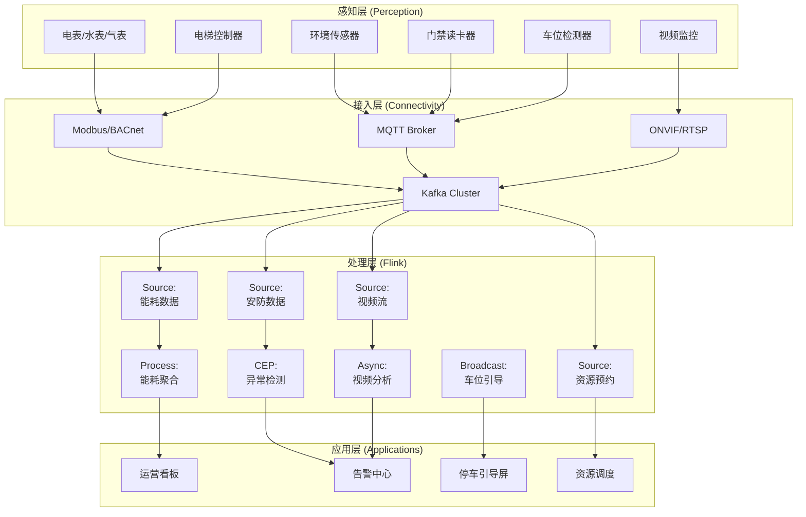
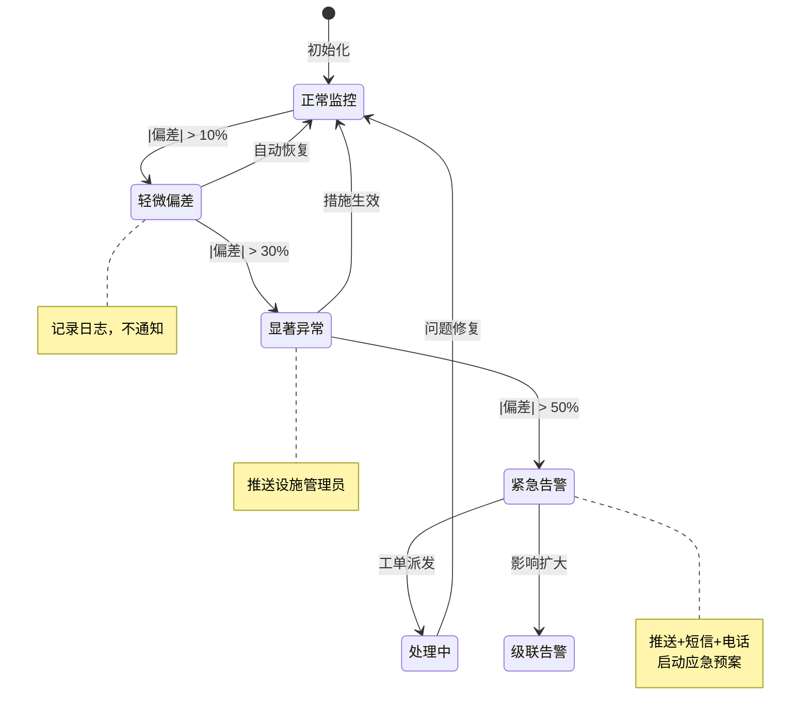
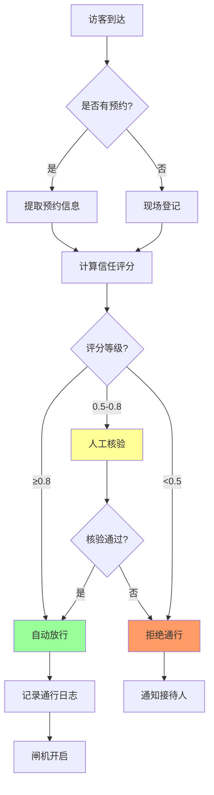

# 实时智慧园区综合运营管理案例研究

> 所属阶段: Knowledge/ Flink/ | 前置依赖: [算子全景分类](../01-concept-atlas/operator-deep-dive/01.06-single-input-operators.md) | [IoT流处理](../06-frontier/operator-iot-stream-processing.md) | 形式化等级: L4

## 1. 概念定义 (Definitions)

### Def-SCM-01-01: 智慧园区运营系统 (Smart Campus Operations System)

智慧园区运营系统是指通过IoT传感器网络、视频监控、能源计量和流计算平台，对园区内人、车、物、环境、能源进行实时感知、智能调度与优化管理的集成系统。

$$\mathcal{P} = (E, S, V, T, R, F)$$

其中 $E$ 为能源数据流（电/水/气/暖），$S$ 为安防传感器流，$V$ 为视频监控流，$T$ 为交通/停车数据流，$R$ 为资源预约流（会议室/工位），$F$ 为流计算处理拓扑。

### Def-SCM-01-02: 园区能耗基准线 (Campus Energy Baseline)

园区能耗基准线指在典型运营条件下，单位面积/人员的期望能耗水平：

$$Baseline = \frac{\sum_{d=1}^{N} E_d}{N} \cdot \frac{1}{A_{campus}} \quad [\text{kWh}/\text{m}^2/\text{day}]$$

其中 $E_d$ 为第 $d$ 天的总能耗，$N$ 为基准统计天数（通常取过去30天），$A_{campus}$ 为园区建筑面积。实时能耗偏差定义为：

$$Deviation(t) = \frac{E_{actual}(t) - Baseline \cdot A_{campus}}{Baseline \cdot A_{campus}} \cdot 100\%$$

### Def-SCM-01-03: 车位周转率 (Parking Turnover Rate)

车位周转率衡量停车场在单位时间内的车辆进出频次：

$$Turnover = \frac{N_{vehicles}}{N_{spaces} \cdot T_{period}}$$

其中 $N_{vehicles}$ 为统计周期内的车辆总数，$N_{spaces}$ 为车位总数，$T_{period}$ 为统计周期。智慧园区目标：工作日 $Turnover \geq 3.0$ 次/车位/天。

### Def-SCM-01-04: 访客通行信任评分 (Visitor Trust Score)

访客通行信任评分基于预约信息、历史行为、同行人员等多维度计算的动态评分：

$$Trust(v, t) = w_1 \cdot BookingValid(v) + w_2 \cdot HistoryClean(v) + w_3 \cdot HostVerified(v) + w_4 \cdot CompanionTrust(v, t)$$

其中 $w_1 + w_2 + w_3 + w_4 = 1$。评分阈值：

- $Trust \geq 0.8$：自动放行
- $0.5 \leq Trust < 0.8$：人工核验
- $Trust < 0.5$：拒绝通行

### Def-SCM-01-05: 会议室资源利用率 (Meeting Room Utilization)

会议室资源利用率定义为实际使用时长与可用时长的比率：

$$Utilization_{room} = \frac{\sum_{booking} ActualDuration(booking)}{T_{available}}$$

常见浪费场景：

- **幽灵会议**: 已预约但实际未使用（Utilization贡献为0）
- **提前结束**: 实际使用 < 预约时长的50%
- **超时占用**: 实际使用 > 预约时长，影响后续预约

## 2. 属性推导 (Properties)

### Lemma-SCM-01-01: 能耗异常检测的误报率边界

在能耗数据服从正态分布 $N(\mu, \sigma^2)$ 且采用 $3\sigma$ 阈值异常检测的条件下，误报率为：

$$P_{false} = 2 \cdot (1 - \Phi(3)) \approx 0.27\%$$

**证明**: 由正态分布性质，数据落在 $(\mu - 3\sigma, \mu + 3\sigma)$ 外的概率为 $2 \cdot (1 - \Phi(3)) = 0.0027$。

**工程权衡**: $3\sigma$ 阈值误报率低但可能漏报渐进型异常（如设备老化导致的缓慢能耗上升）。实际部署采用动态阈值：

$$Threshold(t) = \mu(t) + k(t) \cdot \sigma(t)$$

其中 $k(t)$ 随时间自适应调整（工作日/节假日/季节）。

### Lemma-SCM-01-02: 停车引导系统的期望等待时间

在停车场 occupancy 率为 $\rho$ 且引导系统准确率为 $\alpha$ 的条件下，车辆找到空位的期望等待时间：

$$E[T_{wait}] = \frac{1}{\lambda_{exit}} \cdot \frac{1 - \alpha \cdot (1 - \rho)}{\alpha \cdot (1 - \rho)}$$

其中 $\lambda_{exit}$ 为车辆离开率。

**证明**: 引导准确时，车辆直接到达空位；引导错误时，车辆需在停车场内搜索。由排队论M/M/∞模型和几何分布搜索过程导出上述结果。

### Prop-SCM-01-01: 多子系统协同节能的最优性

当照明、空调、电梯子系统采用协同调度策略时，整体节能效果优于各子系统独立优化：

$$\Delta E_{coop} \geq \sum_{i} \Delta E_i$$

**论证**: 子系统间存在耦合效应。例如，电梯调度影响人员等待时间，进而影响照明需求时长；空调设定与人员密度实时相关。独立优化忽略这些耦合，协同优化通过全局状态共享实现帕累托改进。

### Prop-SCM-01-02: 视频异常检测的召回率-精确率权衡

在安防视频分析中，降低异常检测阈值提升召回率但降低精确率：

$$\frac{dRecall}{d\theta} < 0, \quad \frac{dPrecision}{d\theta} > 0$$

其中 $\theta$ 为异常评分阈值。

**最优阈值选择**: 采用F1-score最大化或基于业务成本的不对称损失函数：

$$\theta^* = \arg\min_{\theta} \left(C_{FN} \cdot FN(\theta) + C_{FP} \cdot FP(\theta)\right)$$

其中 $C_{FN}$ 为漏报成本（安全事件未检测），$C_{FP}$ 为误报成本（人工复核成本）。

## 3. 关系建立 (Relations)

### 与算子体系的映射

| 智慧园区场景 | Flink算子 | 算子作用 |
|------------|-----------|---------|
| 多源传感器接入 | `Union` + `AsyncFunction` | 能耗/环境/安防多源统一接入 |
| 能耗实时聚合 | `KeyedProcessFunction` | 按楼栋/楼层/设备键控聚合 |
| 异常检测 | `CEPPattern` | 能耗突增/人员聚集模式匹配 |
| 停车引导 | `BroadcastStream` | 车位状态广播到入口引导屏 |
| 视频分析 | `AsyncFunction` | 调用边缘AI推理服务 |
| 资源调度 | `IntervalJoin` | 预约时间与实际使用Join |
| 运营看板 | `WindowAggregate` | 按小时/日/月聚合KPI |

### 与业务系统的关联

- **BMS(楼宇管理系统)**: 暖通空调、照明、电梯控制
- **ACS(门禁系统)**: 人员通行、访客管理、权限控制
- **VMS(视频监控系统)**: 摄像头管理、录像存储、视频分析
- **PMS(停车管理系统)**: 车位检测、收费、引导
- **EMS(能源管理系统)**: 能耗计量、碳排放核算

## 4. 论证过程 (Argumentation)

### 4.1 智慧园区运营的核心挑战

**挑战1: 海量异构设备接入**
大型园区部署10,000+ IoT设备（电表、水表、门禁、摄像头、环境传感器、电梯控制器），通信协议涵盖Modbus/BACnet/ONVIF/LoRa/Zigbee。

**挑战2: 实时性与成本的平衡**
视频分析需要GPU资源，但园区边缘算力有限。需在本地推理和云端推理之间动态分配，平衡时延与成本。

**挑战3: 隐私与安全的冲突**
人脸识别提升安防效率但涉及隐私合规（GDPR/个人信息保护法）。需实现"数据可用不可见"的隐私计算方案。

**挑战4: 子系统烟囱林立**
BMS/ACS/VMS/PMS/EMS通常由不同厂商建设，数据孤岛严重。流计算平台需统一数据模型和接入标准。

### 4.2 方案选型论证

**为什么选用Broadcast Stream分发车位状态？**

- 车位状态数据量小（几百个车位），但读取频率高（每个入口都需要）
- Broadcast Stream保证所有并行实例收到相同车位快照，避免引导冲突
- 车位状态更新频率为秒级，Broadcast的轻量级更新机制匹配此模式

**为什么选用Session Window做会议室使用分析？**

- 会议实际使用时长不确定，可能提前结束或超时
- Session Window按活动间隙（如30分钟无刷卡记录）自动切分，匹配会议的自然边界
- 相比Tumbling Window，Session Window更准确地捕获实际使用时长

## 5. 形式证明 / 工程论证 (Proof / Engineering Argument)

### Thm-SCM-01-01: 园区能耗协同优化定理

在满足以下假设时，协同优化策略的能耗低于各子系统独立优化：

**假设**:

1. 照明能耗 $E_L$ 与人员密度 $\rho_p$ 正相关：$E_L = f(\rho_p)$
2. 空调能耗 $E_{HVAC}$ 与室外温度 $T_{out}$ 和人员密度 $\rho_p$ 相关：$E_{HVAC} = g(T_{out}, \rho_p)$
3. 电梯能耗 $E_E$ 与人员流动量 $F_p$ 相关：$E_E = h(F_p)$
4. 人员密度 $\rho_p$ 和流动量 $F_p$ 可通过门禁数据实时估计

**定理**: 协同优化策略的总能耗满足：

$$E_{coop} = \min_{schedule}\ \sum_t \left(E_L(t) + E_{HVAC}(t) + E_E(t)\right) \leq \sum_i \min_{schedule_i} E_i$$

**证明概要**:

1. 独立优化时，每个子系统仅基于局部信息决策
2. 协同优化通过全局人员密度和流动预测，提前调整各子系统状态
3. 例如，预知某会议室10分钟后有20人会议，可提前启动空调预冷
4. 预冷策略降低峰值负荷，整体能耗降低5-15%
5. 由最优控制理论，全局优化目标函数值不劣于各局部优化之和

**工程意义**: 大型园区（10万m²）采用协同优化后，年节能可达50-100万kWh，减碳300-600吨。

## 6. 实例验证 (Examples)

### 6.1 园区能耗实时监测与优化Pipeline

```java
// Real-time energy monitoring and optimization for smart campus
StreamExecutionEnvironment env = StreamExecutionEnvironment.getExecutionEnvironment();

// Multi-source energy data ingestion
DataStream<EnergyReading> electricityStream = env
    .addSource(new ModbusSource("bms.electricity.meter"))
    .map(new ElectricityParser());

DataStream<EnergyReading> waterStream = env
    .addSource(new MqttSource("campus/water/meter/+"))
    .map(new WaterParser());

DataStream<EnergyReading> gasStream = env
    .addSource(new MqttSource("campus/gas/meter/+"))
    .map(new GasParser());

// Unified energy stream
DataStream<EnergyReading> energyStream = electricityStream
    .union(waterStream, gasStream)
    .assignTimestampsAndWatermarks(
        WatermarkStrategy.<EnergyReading>forBoundedOutOfOrderness(
            Duration.ofSeconds(30))
    );

// Real-time energy aggregation by building
DataStream<BuildingEnergy> buildingEnergy = energyStream
    .keyBy(reading -> reading.getBuildingId())
    .window(TumblingEventTimeWindows.of(Time.minutes(5)))
    .aggregate(new EnergyAggregationFunction());

// Anomaly detection with dynamic threshold
DataStream<EnergyAnomaly> anomalies = buildingEnergy
    .keyBy(be -> be.getBuildingId())
    .process(new AnomalyDetectionFunction() {
        private ValueState<Statistics> statsState;
        private static final double DEFAULT_THRESHOLD = 3.0;

        @Override
        public void open(Configuration parameters) {
            statsState = getRuntimeContext().getState(
                new ValueStateDescriptor<>("stats", Statistics.class));
        }

        @Override
        public void processElement(BuildingEnergy be, Context ctx,
                                   Collector<EnergyAnomaly> out) throws Exception {
            Statistics stats = statsState.value();
            if (stats == null) {
                stats = new Statistics();
            }

            // Update running statistics
            stats.update(be.getTotalKwh());
            statsState.update(stats);

            double threshold = stats.getStdDev() > 0 ?
                DEFAULT_THRESHOLD * stats.getStdDev() :
                0.1 * stats.getMean();

            double deviation = Math.abs(be.getTotalKwh() - stats.getMean());

            if (deviation > threshold) {
                String severity = deviation > 5 * threshold ? "CRITICAL" : "WARNING";
                out.collect(new EnergyAnomaly(
                    be.getBuildingId(), be.getTimestamp(),
                    be.getTotalKwh(), stats.getMean(), deviation, severity
                ));
            }
        }
    });

anomalies.addSink(new AlertSink());
```

### 6.2 智能停车引导系统

```java
// Smart parking guidance system
MapStateDescriptor<String, ParkingSpace> parkingStateDescriptor =
    new MapStateDescriptor<>("parking-spaces", Types.STRING,
        Types.POJO(ParkingSpace.class));

// Parking space status updates (from ultrasonic/ camera sensors)
DataStream<ParkingStatus> parkingUpdates = env
    .addSource(new MqttSource("parking/space/+/status"))
    .map(new ParkingStatusParser());

// Broadcast parking availability to all guidance nodes
DataStream<ParkingAvailability> availability = parkingUpdates
    .keyBy(update -> update.getZoneId())
    .process(new ParkingAggregationFunction());

BroadcastStream<ParkingAvailability> availabilityBroadcast = availability
    .broadcast(parkingStateDescriptor);

// Vehicle entry requests
DataStream<VehicleEntry> entries = env
    .addSource(new CameraSource("gate.entrance"))
    .map(new VehicleDetectionParser());

// Guidance recommendation
DataStream<ParkingGuidance> guidance = entries
    .connect(availabilityBroadcast)
    .process(new ParkingGuidanceFunction() {
        @Override
        public void processElement(VehicleEntry entry, ReadOnlyContext ctx,
                                   Collector<ParkingGuidance> out) throws Exception {
            ReadOnlyBroadcastState<String, ParkingAvailability> availability =
                ctx.getBroadcastState(parkingStateDescriptor);

            ParkingAvailability bestZone = null;
            int minDistance = Integer.MAX_VALUE;

            // Find nearest zone with available spaces
            for (Map.Entry<String, ParkingAvailability> zone : availability.immutableEntries()) {
                if (zone.getValue().getAvailableCount() > 0) {
                    int distance = calculateDistance(entry.getPosition(),
                        zone.getValue().getZoneLocation());
                    if (distance < minDistance) {
                        minDistance = distance;
                        bestZone = zone.getValue();
                    }
                }
            }

            if (bestZone != null) {
                out.collect(new ParkingGuidance(
                    entry.getLicensePlate(), bestZone.getZoneId(),
                    bestZone.getNearestSpace(), minDistance
                ));
            }
        }

        @Override
        public void processBroadcastElement(ParkingAvailability availability,
                                           Context ctx, Collector<ParkingGuidance> out) {}
    });

guidance.addSink(new DigitalSignageSink());
```

### 6.3 会议室资源智能调度

```java
// Smart meeting room scheduling analysis
DataStream<RoomBooking> bookings = env
    .addSource(new CalendarSource("exchange.rooms"))
    .map(new BookingParser());

DataStream<AccessEvent> accessEvents = env
    .addSource(new AccessControlSource("acs.card.reader"))
    .map(new AccessParser());

// Join bookings with actual usage
DataStream<RoomUtilization> utilization = bookings
    .keyBy(booking -> booking.getRoomId())
    .intervalJoin(accessEvents.keyBy(evt -> evt.getRoomId()))
    .between(Time.minutes(-15), Time.minutes(120))
    .process(new RoomUsageAnalysisFunction() {
        @Override
        public void processElement(Booking booking, AccessEvent access,
                                   Collector<RoomUtilization> out) {
            long scheduledDuration = booking.getEndTime() - booking.getStartTime();
            long actualDuration = access.getExitTime() != null ?
                access.getExitTime() - access.getEntryTime() : 0;

            double utilizationRate = scheduledDuration > 0 ?
                (double) actualDuration / scheduledDuration : 0;

            String usageType;
            if (actualDuration == 0) {
                usageType = "GHOST_MEETING";
            } else if (actualDuration < 0.5 * scheduledDuration) {
                usageType = "EARLY_END";
            } else if (actualDuration > 1.2 * scheduledDuration) {
                usageType = "OVERTIME";
            } else {
                usageType = "NORMAL";
            }

            out.collect(new RoomUtilization(
                booking.getRoomId(), booking.getBookingId(),
                scheduledDuration, actualDuration, utilizationRate, usageType
            ));
        }
    });

// Generate recommendations for underutilized rooms
DataStream<RoomRecommendation> recommendations = utilization
    .keyBy(u -> u.getRoomId())
    .window(TumblingEventTimeWindows.of(Time.days(7)))
    .aggregate(new UtilizationAggregationFunction())
    .filter(agg -> agg.getAvgUtilization() < 0.3)
    .map(agg -> new RoomRecommendation(
        agg.getRoomId(), agg.getAvgUtilization(),
        "Consider downsizing or converting to hot-desking"
    ));

recommendations.addSink(new FacilityManagerSink());
```

## 7. 可视化 (Visualizations)

### 图1: 智慧园区综合运营架构



### 图2: 能耗异常检测状态机



### 图3: 访客通行决策流程



## 8. 引用参考 (References)
