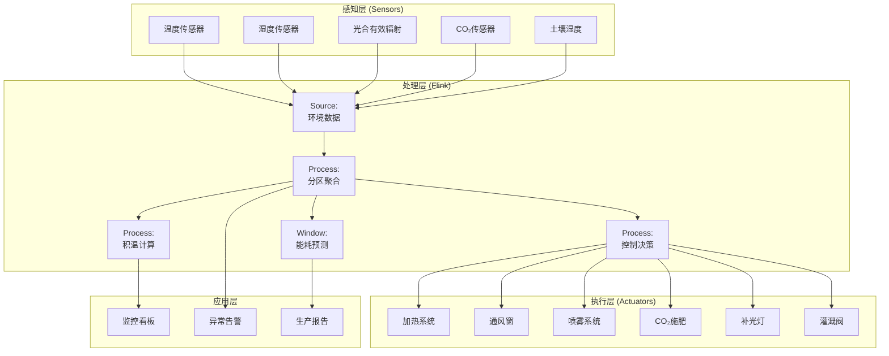
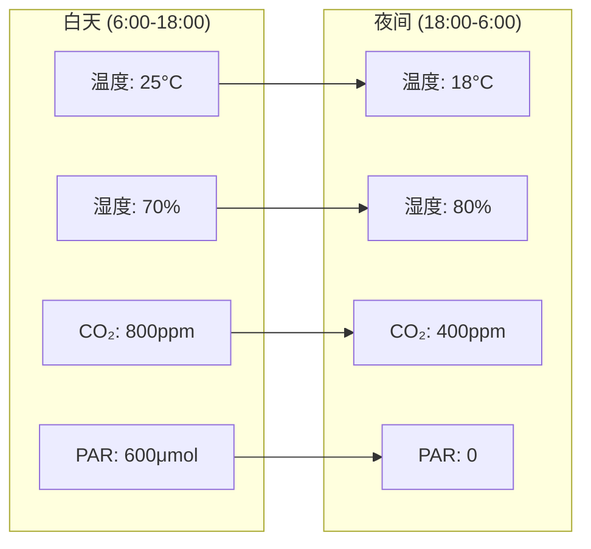
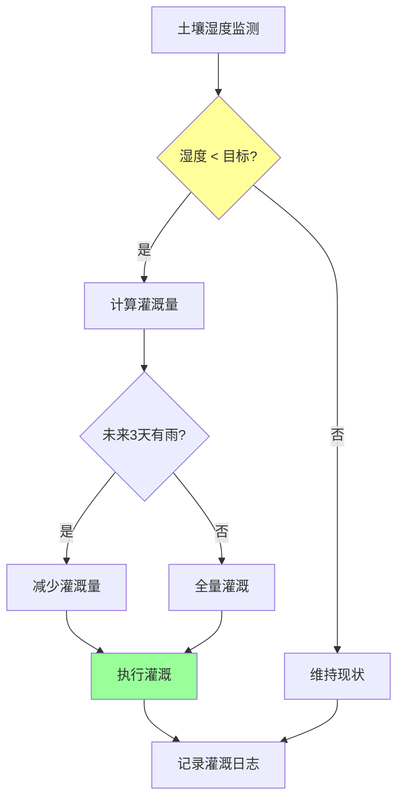

# 实时智能农业温室环境控制案例研究

> 所属阶段: Knowledge/ Flink/ | 前置依赖: [算子全景分类](../01-concept-atlas/operator-deep-dive/01.06-single-input-operators.md) | [IoT流处理](../06-frontier/operator-iot-stream-processing.md) | 形式化等级: L4

## 1. 概念定义 (Definitions)

### Def-GRN-01-01: 智能温室环境控制系统 (Smart Greenhouse Environmental Control System)

智能温室环境控制系统是通过分布式传感器网络、自动化执行设备和流计算平台，对温室内温度、湿度、光照、CO₂浓度进行实时监测与闭环控制的集成系统。

$$\mathcal{G} = (T, H, L, C, A, F)$$

其中 $T$ 为温度数据流，$H$ 为湿度数据流，$L$ 为光照数据流，$C$ 为CO₂浓度数据流，$A$ 为执行器状态流，$F$ 为流计算处理拓扑。

### Def-GRN-01-02: 作物积温 (Crop Growing Degree Days, GDD)

作物积温是衡量作物生长发育进程的热量指标：

$$GDD = \sum_{days} \left(\frac{T_{max} + T_{min}}{2} - T_{base}\right) \cdot \mathbb{1}_{[\frac{T_{max} + T_{min}}{2} > T_{base}]}$$

其中 $T_{base}$ 为作物发育下限温度（番茄10°C，黄瓜12°C，生菜4°C）。积温达到特定阈值时，作物进入下一发育阶段（如从营养生长期转入开花期）。

### Def-GRN-01-03: 蒸腾速率模型 (Transpiration Rate Model)

作物蒸腾速率受环境因子驱动的Penman-Monteith方程简化形式：

$$ET = \frac{\Delta \cdot (R_n - G) + \rho_a c_p \cdot (e_s - e_a) / r_a}{\Delta + \gamma \cdot (1 + r_s / r_a)}$$

其中 $R_n$ 为净辐射，$G$ 为土壤热通量，$e_s - e_a$ 为饱和水汽压差（VPD），$r_a$ 为空气动力学阻力，$r_s$ 为作物冠层阻力。

### Def-GRN-01-04: 光合有效辐射利用率 (Photosynthetically Active Radiation Use Efficiency)

光合有效辐射（PAR）利用率定义为作物干物质积累量与吸收的PAR之比：

$$\varepsilon = \frac{\Delta DM}{PAR_{absorbed}}$$

其中 $\Delta DM$ 为干物质增量（g/m²），$PAR_{absorbed} = PAR_{incident} \cdot (1 - e^{-k \cdot LAI})$，$k$ 为消光系数，$LAI$ 为叶面积指数。

### Def-GRN-01-05: 灌溉决策指数 (Irrigation Decision Index)

灌溉决策指数综合土壤含水率、作物需水量和气象预报：

$$IDI = \alpha \cdot \frac{\theta_{wp}}{\theta_{current}} + \beta \cdot \frac{ET_{forecast}}{ET_{max}} + \gamma \cdot \frac{Rain_{forecast}}{Rain_{threshold}}$$

其中 $\theta_{wp}$ 为凋萎点含水率，$ET_{forecast}$ 为未来3天蒸腾量预报，$Rain_{forecast}$ 为未来3天降雨量预报。

## 2. 属性推导 (Properties)

### Lemma-GRN-01-01: 温室热平衡方程

温室内的能量守恒方程：

$$Q_{solar} + Q_{heating} = Q_{transpiration} + Q_{ventilation} + Q_{conduction} + Q_{thermal\_mass}$$

**证明**: 由热力学第一定律，温室内的能量输入（太阳辐射+加热）等于能量输出（蒸腾潜热+通风显热+围护结构传导+基质蓄热变化）。各项可分别建模：

- $Q_{solar} = \tau \cdot I_{global} \cdot A_{greenhouse}$
- $Q_{ventilation} = \rho_{air} c_p \cdot V_{vent} \cdot (T_{in} - T_{out})$
- $Q_{conduction} = U \cdot A_{wall} \cdot (T_{in} - T_{out})$

### Lemma-GRN-01-02: 湿度控制的响应时延

温室湿度从当前值调整到目标值所需时间：

$$\tau_{humidity} = \frac{V_{greenhouse} \cdot \rho_{air} \cdot |RH_{current} - RH_{target}|}{E_{dehumidify} - E_{transpiration}}$$

其中 $E_{dehumidify}$ 为除湿能力（通风或冷凝除湿），$E_{transpiration}$ 为作物蒸腾产湿速率。

### Prop-GRN-01-01: CO₂施肥的增产边际效益递减

在CO₂浓度从大气水平（400 ppm）提升至施肥水平（800-1200 ppm）时，光合速率提升遵循Michaelis-Menten动力学：

$$A = A_{max} \cdot \frac{C}{C + K_m}$$

**论证**: 当 $C \ll K_m$ 时，$A \approx A_{max} \cdot C/K_m$（线性增长）；当 $C \gg K_m$ 时，$A \approx A_{max}$（饱和）。CO₂施肥的边际效益随浓度升高而递减，最优施肥浓度通常为800-1000 ppm。

### Prop-GRN-01-02: 光周期对开花调控的阈值特性

短日照作物（如草莓）和长日照作物（如菠菜）的开花受光周期调控：

$$Flowering = \begin{cases}
1 & \text{短日照作物且 } D < D_{critical} \\
1 & \text{长日照作物且 } D > D_{critical} \\
0 & \text{otherwise}
\end{cases}$$

其中 $D$ 为日长，$D_{critical}$ 为临界日长。

## 3. 关系建立 (Relations)

### 与算子体系的映射

| 温室控制场景 | Flink算子 | 算子作用 |
|------------|-----------|---------|
| 多源传感器接入 | `Union` + `SourceFunction` | 温湿度/光照/CO₂/土壤统一接入 |
| 环境参数聚合 | `KeyedProcessFunction` | 按温室分区键控聚合 |
| 控制策略执行 | `BroadcastStream` | 控制参数广播到执行器 |
| 灌溉决策 | `ProcessFunction` | 土壤含水率+蒸腾量综合计算 |
| 异常检测 | `CEPPattern` | 温度/湿度超限模式匹配 |
| 能耗优化 | `WindowAggregate` | 日/周能耗统计与优化 |

### 与农业科学的关联

- **FAO-56**: 作物蒸腾计算标准方法（Penman-Monteith）
- **温室园艺学**: 番茄、黄瓜、生菜等作物的最适环境参数
- **植物生理学**: 光合作用、蒸腾作用、光周期反应
- **精准农业**: 变量施肥、精准灌溉、产量制图

## 4. 论证过程 (Argumentation)

### 4.1 温室环境控制的核心挑战

**挑战1: 多因子耦合**
温度、湿度、光照、CO₂相互影响。例如，开窗通风降温会降低湿度；补光灯发热会升高温度；CO₂施肥需配合适当光照才有效。

**挑战2: 作物需求的时空差异**
不同作物（番茄vs生菜）的最适环境参数不同；同一作物在不同发育阶段（苗期vs开花期）需求不同；温室内部存在微气候差异（靠近通风口vs中心区域）。

**挑战3: 能耗与产量的权衡**
冬季加热和夏季制冷是温室主要能耗来源（占运营成本30-50%）。过度追求理想环境会大幅增加能耗，需在产量和成本间优化。

**挑战4: 传感器可靠性**
高湿度环境导致传感器漂移和失效；光照传感器需定期清洁；土壤湿度传感器受盐分影响。

### 4.2 方案选型论证

**为什么选用流计算而非传统PLC控制？**
- 传统PLC为本地逻辑控制，无法整合气象预报进行预测性调控
- 流计算支持复杂优化算法（多目标优化、模型预测控制MPC）
- Flink的精确一次语义保证控制指令不丢失

**为什么选用MPC（模型预测控制）做环境调控？**
- MPC可预测未来一段时间（如24小时）的环境变化，提前调整控制策略
- 可处理多输入多输出（MIMO）耦合系统
- 可考虑能耗成本约束

## 5. 形式证明 / 工程论证 (Proof / Engineering Argument)

### Thm-GRN-01-01: 温室能耗最优控制定理

在满足作物生长约束的条件下，温室能耗最优控制策略满足：

**定理**: 若温度设定值 $T_{set}(t)$ 的动态变化满足：

$$T_{set}(t) = T_{min}(t) + \frac{C_{electricity}(t)}{\lambda} \cdot (T_{max} - T_{min}(t))$$

其中 $T_{min}(t)$ 为时刻 $t$ 的作物最低允许温度，$C_{electricity}(t)$ 为电价，$\lambda$ 为拉格朗日乘子，则总能耗成本最小化。

**证明概要**:
1. 目标函数：最小化总加热成本 $\int C_{electricity}(t) \cdot Q_{heating}(t) dt$
2. 约束条件：$T_{actual}(t) \geq T_{min}(t)$（作物安全温度）
3. 由最优控制理论，哈密顿量对 $T_{set}$ 求导并令为零
4. 电价高时，$T_{set}$ 靠近 $T_{min}$（减少加热）；电价低时，$T_{set}$ 靠近 $T_{max}$（预加热蓄热）

**工程意义**: 在实行分时电价的地区（如夜间谷电），可在夜间预加热基质和作物，白天减少加热需求，整体节能15-25%。

## 6. 实例验证 (Examples)

### 6.1 温室环境实时监测与控制Pipeline

```java
// Greenhouse environmental monitoring and control
StreamExecutionEnvironment env = StreamExecutionEnvironment.getExecutionEnvironment();
env.setStreamTimeCharacteristic(TimeCharacteristic.EventTime);

// Multi-sensor data ingestion
DataStream<SensorReading> temperatureStream = env
    .addSource(new MqttSource("greenhouse/zone/+/temperature"))
    .map(new TemperatureParser());

DataStream<SensorReading> humidityStream = env
    .addSource(new MqttSource("greenhouse/zone/+/humidity"))
    .map(new HumidityParser());

DataStream<SensorReading> lightStream = env
    .addSource(new MqttSource("greenhouse/zone/+/par"))
    .map(new LightParser());

DataStream<SensorReading> co2Stream = env
    .addSource(new MqttSource("greenhouse/zone/+/co2"))
    .map(new Co2Parser());

// Merge all environmental data
DataStream<EnvironmentalData> envData = temperatureStream
    .union(humidityStream, lightStream, co2Stream)
    .keyBy(r -> r.getZoneId())
    .window(TumblingEventTimeWindows.of(Time.minutes(1)))
    .aggregate(new EnvironmentAggregationFunction());

// Control decision making
DataStream<ControlCommand> commands = envData
    .keyBy(d -> d.getZoneId())
    .process(new GreenhouseControlFunction() {
        private ValueState<ControlState> controlState;

        // Optimal setpoints for tomato cultivation
        private static final double T_TARGET_DAY = 25.0;
        private static final double T_TARGET_NIGHT = 18.0;
        private static final double RH_TARGET = 75.0;
        private static final double CO2_TARGET = 800.0;
        private static final double PAR_TARGET = 600.0;

        @Override
        public void open(Configuration parameters) {
            controlState = getRuntimeContext().getState(
                new ValueStateDescriptor<>("control", ControlState.class));
        }

        @Override
        public void processElement(EnvironmentalData data, Context ctx,
                                   Collector<ControlCommand> out) throws Exception {
            ControlState state = controlState.value();
            if (state == null) state = new ControlState(data.getZoneId());

            boolean isDaytime = isDaytime(ctx.timestamp());
            double tTarget = isDaytime ? T_TARGET_DAY : T_TARGET_NIGHT;

            // Temperature control
            if (data.getTemperature() < tTarget - 1.0) {
                out.collect(new ControlCommand(data.getZoneId(), "HEATING",
                    Math.min(100, (tTarget - data.getTemperature()) * 20)));
            } else if (data.getTemperature() > tTarget + 1.0) {
                out.collect(new ControlCommand(data.getZoneId(), "VENTING",
                    Math.min(100, (data.getTemperature() - tTarget) * 20)));
            }

            // Humidity control
            if (data.getHumidity() > RH_TARGET + 5.0) {
                out.collect(new ControlCommand(data.getZoneId(), "DEHUMIDIFY",
                    Math.min(100, (data.getHumidity() - RH_TARGET) * 5)));
            } else if (data.getHumidity() < RH_TARGET - 5.0) {
                out.collect(new ControlCommand(data.getZoneId(), "MISTING",
                    Math.min(100, (RH_TARGET - data.getHumidity()) * 5)));
            }

            // CO2 fertilization (only during daytime with sufficient light)
            if (isDaytime && data.getPar() > 200 && data.getCo2() < CO2_TARGET) {
                out.collect(new ControlCommand(data.getZoneId(), "CO2_FERTILIZE",
                    Math.min(100, (CO2_TARGET - data.getCo2()) / 4)));
            }

            // Supplemental lighting (only when natural light insufficient)
            if (isDaytime && data.getPar() < PAR_TARGET) {
                out.collect(new ControlCommand(data.getZoneId(), "LIGHTING",
                    Math.min(100, (PAR_TARGET - data.getPar()) / PAR_TARGET * 100)));
            }

            controlState.update(state);
        }

        private boolean isDaytime(long timestamp) {
            // Simplified: 6:00-18:00 is daytime
            int hour = new Date(timestamp).getHours();
            return hour >= 6 && hour < 18;
        }
    });

commands.addSink(new ActuatorSink());
```

### 6.2 智能灌溉决策系统

```java
// Smart irrigation decision system
DataStream<SoilMoisture> soilData = env
    .addSource(new MqttSource("greenhouse/soil/+/moisture"))
    .map(new SoilParser());

DataStream<WeatherForecast> weatherForecast = env
    .addSource(new WeatherApiSource())
    .map(new ForecastParser());

// Irrigation decision
DataStream<IrrigationCommand> irrigation = soilData
    .keyBy(s -> s.getZoneId())
    .connect(weatherForecast.keyBy(w -> w.getZoneId()))
    .process(new IrrigationDecisionFunction() {
        private ValueState<IrrigationHistory> historyState;
        private static final double WP = 10.0; // Wilting point (%)
        private static final double FC = 25.0; // Field capacity (%)
        private static final double TARGET = 20.0; // Target moisture (%)

        @Override
        public void open(Configuration parameters) {
            historyState = getRuntimeContext().getState(
                new ValueStateDescriptor<>("irrigation", IrrigationHistory.class));
        }

        @Override
        public void processElement1(SoilMoisture soil, Context ctx,
                                   Collector<IrrigationCommand> out) throws Exception {
            IrrigationHistory history = historyState.value();
            if (history == null) history = new IrrigationHistory();

            double currentMoisture = soil.getMoisturePercent();
            double moistureDeficit = TARGET - currentMoisture;

            // Check if irrigation needed
            if (moistureDeficit > 3.0) {
                // Calculate irrigation amount (mm)
                double irrigateAmount = moistureDeficit * soil.getRootDepth()
                                      * soil.getSoilFactor();

                // Adjust for rain forecast
                double rainForecast = history.getRainForecast();
                irrigateAmount = Math.max(0, irrigateAmount - rainForecast * 0.7);

                if (irrigateAmount > 1.0) {
                    out.collect(new IrrigationCommand(
                        soil.getZoneId(), irrigateAmount,
                        "DRIP", ctx.timestamp()
                    ));

                    history.recordIrrigation(irrigateAmount);
                }
            }

            historyState.update(history);
        }

        @Override
        public void processElement2(WeatherForecast forecast, Context ctx,
                                   Collector<IrrigationCommand> out) throws Exception {
            IrrigationHistory history = historyState.value();
            if (history == null) history = new IrrigationHistory();
            history.setRainForecast(forecast.getRainAmount3Day());
            historyState.update(history);
        }
    });

irrigation.addSink(new ValveControlSink());
```

### 6.3 作物发育阶段追踪

```java
// Crop development stage tracking based on GDD
DataStream<EnvironmentalData> envStream = envData;

DataStream<DevelopmentStage> development = envStream
    .keyBy(d -> d.getCropId())
    .process(new DevelopmentTracker() {
        private ValueState<GddAccumulator> gddState;

        // Tomato development thresholds
        private static final double T_BASE_TOMATO = 10.0;
        private static final double GDD_FLOWERING = 300;
        private static final double GDD_FRUITING = 600;
        private static final double GDD_HARVEST = 1200;

        @Override
        public void open(Configuration parameters) {
            gddState = getRuntimeContext().getState(
                new ValueStateDescriptor<>("gdd", GddAccumulator.class));
        }

        @Override
        public void processElement(EnvironmentalData data, Context ctx,
                                   Collector<DevelopmentStage> out) throws Exception {
            GddAccumulator gdd = gddState.value();
            if (gdd == null) gdd = new GddAccumulator(data.getCropId());

            double avgTemp = (data.getMaxTemp() + data.getMinTemp()) / 2;
            double dailyGdd = Math.max(0, avgTemp - T_BASE_TOMATO);
            gdd.accumulate(dailyGdd);

            String stage;
            if (gdd.getTotal() < GDD_FLOWERING) {
                stage = "VEGETATIVE";
            } else if (gdd.getTotal() < GDD_FRUITING) {
                stage = "FLOWERING";
            } else if (gdd.getTotal() < GDD_HARVEST) {
                stage = "FRUITING";
            } else {
                stage = "HARVEST_READY";
            }

            out.collect(new DevelopmentStage(
                data.getCropId(), stage, gdd.getTotal(),
                ctx.timestamp()
            ));

            gddState.update(gdd);
        }
    });

development.addSink(new FarmManagementSink());
```

## 7. 可视化 (Visualizations)

### 图1: 智能温室控制架构



### 图2: 温室日环境调控曲线



### 图3: 灌溉决策流程



## 8. 引用参考 (References)

[^1]: FAO, "Crop Evapotranspiration: Guidelines for Computing Crop Water Requirements", FAO Irrigation and Drainage Paper 56, 1998.
[^2]: J. B. S. Hillel, "Introduction to Soil Physics", Academic Press, 1982.
[^3]: 中国农业科学院, "设施园艺学", 中国农业出版社, 2020.
[^4]: G. P. A. Bot, "Greenhouse Climate: From Physical Processes to a Dynamic Model", Wageningen University, 1983.
[^5]: Apache Flink Documentation, "Event-driven Applications", 2025. https://nightlies.apache.org/flink/flink-docs-stable/docs/learn-flink/event_driven/
