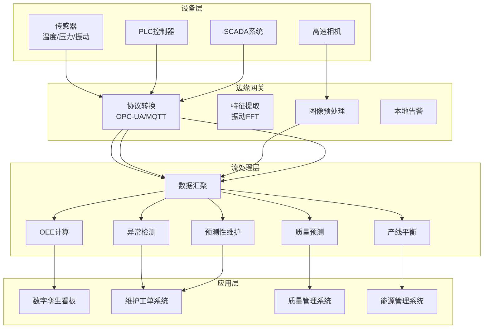
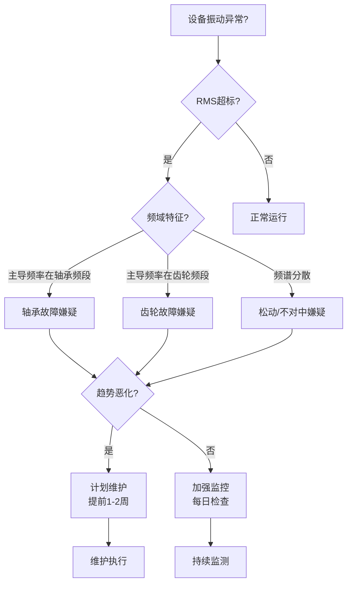

# 算子与实时智能制造（工业4.0）

> **所属阶段**: Knowledge/10-case-studies | **前置依赖**: [operator-iot-stream-processing.md](../06-frontier/operator-iot-stream-processing.md), [operator-edge-computing-integration.md](../06-frontier/operator-edge-computing-integration.md) | **形式化等级**: L3
> **文档定位**: 流处理算子在智能制造与工业4.0中的算子指纹与Pipeline设计
> **版本**: 2026.04

---

## 目录

- [算子与实时智能制造（工业4.0）](#算子与实时智能制造工业40)
  - [目录](#目录)
  - [1. 概念定义 (Definitions)](#1-概念定义-definitions)
    - [Def-MFG-01-01: 智能制造（Smart Manufacturing / Industry 4.0）](#def-mfg-01-01-智能制造smart-manufacturing--industry-40)
    - [Def-MFG-01-02: 工业数据流（Industrial Data Stream）](#def-mfg-01-02-工业数据流industrial-data-stream)
    - [Def-MFG-01-03: 数字孪生（Digital Twin）](#def-mfg-01-03-数字孪生digital-twin)
    - [Def-MFG-01-04: OEE（Overall Equipment Effectiveness）](#def-mfg-01-04-oeeoverall-equipment-effectiveness)
    - [Def-MFG-01-05: 预测性维护（Predictive Maintenance, PdM）](#def-mfg-01-05-预测性维护predictive-maintenance-pdm)
  - [2. 属性推导 (Properties)](#2-属性推导-properties)
    - [Lemma-MFG-01-01: 传感器采样定理的工业应用](#lemma-mfg-01-01-传感器采样定理的工业应用)
    - [Lemma-MFG-01-02: OEE的实时可计算性](#lemma-mfg-01-02-oee的实时可计算性)
    - [Prop-MFG-01-01: 预测性维护的故障提前期](#prop-mfg-01-01-预测性维护的故障提前期)
    - [Prop-MFG-01-02: 边缘-云协同的带宽节省](#prop-mfg-01-02-边缘-云协同的带宽节省)
  - [3. 关系建立 (Relations)](#3-关系建立-relations)
    - [3.1 智能制造Pipeline算子映射](#31-智能制造pipeline算子映射)
    - [3.2 算子指纹](#32-算子指纹)
    - [3.3 工业协议与Source算子](#33-工业协议与source算子)
  - [4. 论证过程 (Argumentation)](#4-论证过程-argumentation)
    - [4.1 为什么智能制造需要流处理而非传统SCADA](#41-为什么智能制造需要流处理而非传统scada)
    - [4.2 数字孪生的实时同步挑战](#42-数字孪生的实时同步挑战)
    - [4.3 视觉质检的实时性挑战](#43-视觉质检的实时性挑战)
  - [5. 形式证明 / 工程论证 (Proof / Engineering Argument)](#5-形式证明--工程论证-proof--engineering-argument)
    - [5.1 OEE实时计算实现](#51-oee实时计算实现)
    - [5.2 预测性维护的振动特征提取](#52-预测性维护的振动特征提取)
    - [5.3 产线平衡的实时优化](#53-产线平衡的实时优化)
  - [6. 实例验证 (Examples)](#6-实例验证-examples)
    - [6.1 实战：汽车工厂预测性维护](#61-实战汽车工厂预测性维护)
    - [6.2 实战：视觉质检Pipeline](#62-实战视觉质检pipeline)
  - [7. 可视化 (Visualizations)](#7-可视化-visualizations)
    - [智能制造Pipeline架构](#智能制造pipeline架构)
    - [预测性维护决策树](#预测性维护决策树)
  - [8. 引用参考 (References)](#8-引用参考-references)

---

## 1. 概念定义 (Definitions)

### Def-MFG-01-01: 智能制造（Smart Manufacturing / Industry 4.0）

智能制造是通过物联网、大数据和人工智能技术实现生产过程自感知、自决策、自执行的制造模式：

$$\text{SmartMfg} = (\text{CPS}, \text{IoT}, \text{Big Data}, \text{AI}) \times \text{ProductionProcess}$$

其中 CPS（信息物理系统）是连接物理设备与数字模型的桥梁。

### Def-MFG-01-02: 工业数据流（Industrial Data Stream）

工业数据流是工厂设备、传感器和控制系统产生的多源异构数据的时间序列：

$$\text{IndustrialStream} = \{S_{sensor}, S_{PLC}, S_{MES}, S_{SCADA}, S_{Quality}\}$$

- $S_{sensor}$: 温度/压力/振动/电流等传感器数据（高频，100Hz-10kHz）
- $S_{PLC}$: 可编程逻辑控制器状态变化（中频，1-100Hz）
- $S_{MES}$: 制造执行系统工单事件（低频，事件触发）
- $S_{SCADA}$: 监控与数据采集系统告警（低频，异常触发）
- $S_{Quality}$: 质检数据（离线/在线混合）

### Def-MFG-01-03: 数字孪生（Digital Twin）

数字孪生是物理设备或生产线的实时虚拟映射：

$$\text{DigitalTwin}_t = f(\text{PhysicalState}_t, \text{HistoricalData}, \text{PhysicsModel})$$

流处理算子负责将实时传感器数据映射到数字孪生模型的状态更新。

### Def-MFG-01-04: OEE（Overall Equipment Effectiveness）

OEE是衡量设备综合效率的核心指标：

$$\text{OEE} = \text{Availability} \times \text{Performance} \times \text{Quality}$$

其中：

- Availability = 实际运行时间 / 计划运行时间
- Performance = 实际产量 / 理论最大产量
- Quality = 合格品数 / 总产量

### Def-MFG-01-05: 预测性维护（Predictive Maintenance, PdM）

预测性维护是通过分析设备运行数据预测故障并提前干预的维护策略：

$$\text{RUL}(t) = \text{Remaining Useful Life at time } t$$

当 $P(\text{Failure} \mid \text{Data}_{[t-W, t]}) > \text{Threshold}$ 时触发维护工单。

---

## 2. 属性推导 (Properties)

### Lemma-MFG-01-01: 传感器采样定理的工业应用

根据奈奎斯特采样定理，为准确捕获设备振动特征，采样频率 $f_s$ 需满足：

$$f_s > 2 \cdot f_{max}$$

其中 $f_{max}$ 为设备最高振动频率（轴承故障通常在 1-20kHz 范围）。

**工程推论**: 振动监测需 40kHz+ 采样率，数据量巨大（单设备 > 100MB/天），需在边缘进行预处理。

### Lemma-MFG-01-02: OEE的实时可计算性

OEE的三个分量均可通过流处理实时计算：

$$\text{Availability}_t = \frac{\int_0^t \mathbb{1}_{running}(\tau) d\tau}{t}$$

$$\text{Performance}_t = \frac{\sum_{i} \text{actualCycle}_i}{\sum_{i} \text{idealCycle}_i}$$

$$\text{Quality}_t = \frac{\sum_{i} \mathbb{1}_{pass}(i)}{\sum_{i} 1}$$

### Prop-MFG-01-01: 预测性维护的故障提前期

预测性维护的价值与故障提前预测期 $\Delta t_{pred}$ 正相关：

$$\text{Value}_{PdM} \propto \Delta t_{pred}$$

**典型提前期**:

- 振动分析：提前 1-4 周
- 油液分析：提前 2-6 周
- 温度趋势：提前 1-2 周
- 电流特征：提前 3-7 天

### Prop-MFG-01-02: 边缘-云协同的带宽节省

工业场景的边缘预处理可显著降低上传数据量：

| 数据类型 | 原始数据量 | 边缘处理后 | 压缩比 |
|---------|-----------|-----------|--------|
| 振动波形 | 100MB/天/设备 | 特征向量 1KB/小时 | 100,000:1 |
| 温度记录 | 10MB/天/设备 | 异常事件 + 趋势 | 100:1 |
| 视觉质检 | 10GB/天/产线 | 缺陷图片 + 统计 | 100:1 |

---

## 3. 关系建立 (Relations)

### 3.1 智能制造Pipeline算子映射

| 应用场景 | 算子组合 | 数据特征 | 延迟要求 |
|---------|---------|---------|---------|
| **设备状态监控** | Source → filter → window aggregate | 高频传感器（kHz） | < 1s |
| **OEE实时计算** | ProcessFunction + Timer | PLC状态变化 | < 5s |
| **质量预测** | window + Async ML | 工艺参数 + 质检结果 | < 1分钟 |
| **预测性维护** | CEP + window + ML | 振动/温度/电流 | < 5分钟 |
| **产线平衡** | keyBy + aggregate + join | 各工位节拍 | < 1分钟 |
| **能源优化** | window + aggregate + map | 功耗数据 | < 5分钟 |
| **视觉质检** | Source → Async CNN → filter | 高速相机图像 | < 100ms |

### 3.2 算子指纹

| 维度 | 智能制造特征 |
|------|-------------|
| **核心算子** | ProcessFunction（状态机：设备状态跟踪）、window+aggregate（OEE统计）、AsyncFunction（ML推理）、CEP（异常模式） |
| **状态类型** | ValueState（设备当前状态）、MapState（工位配置）、WindowState（历史统计） |
| **时间语义** | 处理时间为主（设备时钟），部分场景用事件时间（质检追溯） |
| **数据特征** | 多源异构（时序+事件+图像）、高频波动、强周期性 |
| **状态热点** | 热门产线/设备key（高频率更新） |
| **性能瓶颈** | 高频振动数据处理、视觉模型推理 |

### 3.3 工业协议与Source算子

| 协议 | 用途 | 频率 | Flink Source |
|------|------|------|-------------|
| **OPC-UA** | 设备数据统一接口 | 1-1000Hz | OPC-UA Source |
| **Modbus TCP** | PLC通信 | 1-10Hz | Modbus Source |
| **MQTT** | 传感器上报 | 1-100Hz | MQTT Source |
| **Kafka** | 企业数据总线 | 可变 | Kafka Source |
| **HTTP REST** | MES/ERP系统 | 事件触发 | HTTP Source |

---

## 4. 论证过程 (Argumentation)

### 4.1 为什么智能制造需要流处理而非传统SCADA

传统SCADA系统的问题：

- 数据采样率低（通常1-10秒），无法捕获高频故障特征
- 仅做数据展示，缺乏实时分析能力
- 告警基于固定阈值，误报率高

流处理的优势：

- 高频数据处理：振动分析需要kHz级采样
- 实时OEE：每分钟更新设备效率
- 智能告警：基于趋势和模式，而非固定阈值
- 预测性维护：从"坏了再修"到"提前预防"

### 4.2 数字孪生的实时同步挑战

**挑战**: 数字孪生需要与物理设备状态保持毫秒级同步。

**方案**:

1. 边缘层：PLC/传感器数据在边缘网关预处理
2. 流处理层：Flink实时计算设备状态并更新孪生模型
3. 可视化层：WebSocket推送孪生状态到3D看板

**延迟分解**:

- 传感器采集: 1-10ms
- 边缘预处理: 5-20ms
- 网络传输: 10-50ms
- 流处理计算: 10-50ms
- 可视化渲染: 30-100ms
- **总延迟: 56-230ms**（满足大部分场景）

### 4.3 视觉质检的实时性挑战

**场景**: 高速产线每秒生产10-100件产品，每件需视觉质检。

**挑战**:

- 相机帧率: 100-1000fps
- 单帧处理: CNN推理需50-200ms
- 串行处理无法满足实时性

**方案**:

1. 并行化：多相机×多模型并行推理
2. 轻量化：MobileNet/ EfficientNet替代ResNet
3. 边缘部署：GPU工控机本地推理，仅上传结果
4. 分级检测：粗筛（简单规则）→ 细检（CNN），减少90%推理量

---

## 5. 形式证明 / 工程论证 (Proof / Engineering Argument)

### 5.1 OEE实时计算实现

```java
public class OEECalculator extends KeyedProcessFunction<String, MachineEvent, OEEMetric> {
    private ValueState<MachineState> machineState;
    private ValueState<Long> lastUpdateTime;

    @Override
    public void open(Configuration parameters) {
        machineState = getRuntimeContext().getState(
            new ValueStateDescriptor<>("state", MachineState.class));
        lastUpdateTime = getRuntimeContext().getState(
            new ValueStateDescriptor<>("lastUpdate", Types.LONG));
    }

    @Override
    public void processElement(MachineEvent event, Context ctx, Collector<OEEMetric> out) throws Exception {
        MachineState state = machineState.value();
        if (state == null) state = new MachineState();

        long currentTime = ctx.timestamp();
        long lastTime = lastUpdateTime.value() != null ? lastUpdateTime.value() : currentTime;
        long deltaTime = currentTime - lastTime;

        // 更新运行时间
        if (state.isRunning()) {
            state.addRunTime(deltaTime);
        }

        // 处理事件
        switch (event.getType()) {
            case START:
                state.setRunning(true);
                break;
            case STOP:
                state.setRunning(false);
                break;
            case CYCLE_COMPLETE:
                state.incrementActualCount();
                if (event.isQualityPass()) {
                    state.incrementGoodCount();
                }
                break;
        }

        // 计算OEE
        double availability = (double) state.getTotalRunTime() / (currentTime - state.getShiftStart());
        double performance = (double) state.getActualCount() * state.getIdealCycleTime() / state.getTotalRunTime();
        double quality = (double) state.getGoodCount() / state.getActualCount();
        double oee = availability * performance * quality;

        out.collect(new OEEMetric(event.getMachineId(), oee, availability, performance, quality, currentTime));

        machineState.update(state);
        lastUpdateTime.update(currentTime);
    }
}
```

### 5.2 预测性维护的振动特征提取

```java
// 振动信号特征提取（边缘预处理）
public class VibrationFeatureExtractor extends WindowFunction<VibrationSample, VibrationFeatures, String, TimeWindow> {
    @Override
    public void apply(String machineId, TimeWindow window, Iterable<VibrationSample> samples, Collector<VibrationFeatures> out) {
        List<Double> values = new ArrayList<>();
        samples.forEach(s -> values.add(s.getAcceleration()));

        double[] data = values.stream().mapToDouble(Double::doubleValue).toArray();

        // 时域特征
        double rms = calculateRMS(data);           // 均方根
        double peak = Arrays.stream(data).map(Math::abs).max().getAsDouble();  // 峰值
        double crestFactor = peak / rms;           // 峰值因子

        // 频域特征（FFT）
        FFTResult fft = performFFT(data);
        double dominantFreq = fft.getDominantFrequency();
        double spectralEntropy = fft.getSpectralEntropy();

        out.collect(new VibrationFeatures(machineId, rms, crestFactor, dominantFreq, spectralEntropy, window.getEnd()));
    }
}
```

### 5.3 产线平衡的实时优化

**问题**: 流水线各工位节拍不平衡导致瓶颈。

**流处理方案**:

1. 采集各工位完成信号
2. 计算各工位平均节拍时间
3. 识别瓶颈工位（节拍时间 > 目标节拍）
4. 实时调整人员/物料分配

```java
DataStream<StationCycle> cycles = env.addSource(new KafkaSource<>("station-cycles"));

// 各工位节拍统计
cycles.keyBy(StationCycle::getStationId)
    .window(TumblingProcessingTimeWindows.of(Time.minutes(5)))
    .aggregate(new CycleTimeAggregate())
    .keyBy(CycleTimeStats::getLineId)
    .process(new BottleneckDetectionFunction())
    .addSink(new AdjustmentCommandSink());
```

---

## 6. 实例验证 (Examples)

### 6.1 实战：汽车工厂预测性维护

```java
// 1. 振动传感器数据摄入
DataStream<VibrationSample> vibration = env.addSource(
    new OPCUASource("opc.tcp://gateway:4840", "ns=2;s=Vibration")
);

// 2. 边缘预处理：特征提取（1分钟窗口）
DataStream<VibrationFeatures> features = vibration
    .keyBy(VibrationSample::getMachineId)
    .window(TumblingProcessingTimeWindows.of(Time.minutes(1)))
    .apply(new VibrationFeatureExtractor());

// 3. 异常检测：Async ML推理
DataStream<AnomalyScore> anomalyScores = AsyncDataStream.unorderedWait(
    features,
    new AnomalyDetectionFunction(),
    Time.milliseconds(200),
    50
);

// 4. 告警分级
anomalyScores.keyBy(AnomalyScore::getMachineId)
    .process(new KeyedProcessFunction<String, AnomalyScore, MaintenanceAlert>() {
        private ValueState<Double> baselineState;

        @Override
        public void processElement(AnomalyScore score, Context ctx, Collector<MaintenanceAlert> out) {
            Double baseline = baselineState.value();
            if (baseline == null) baseline = 0.5;

            // 指数移动平均更新基线
            baseline = 0.95 * baseline + 0.05 * score.getScore();
            baselineState.update(baseline);

            // 偏离基线3倍标准差告警
            if (score.getScore() > 3 * baseline) {
                out.collect(new MaintenanceAlert(score.getMachineId(), "CRITICAL", ctx.timestamp()));
            } else if (score.getScore() > 2 * baseline) {
                out.collect(new MaintenanceAlert(score.getMachineId(), "WARNING", ctx.timestamp()));
            }
        }
    })
    .addSink(new MaintenanceSystemSink());

// 5. OEE实时计算
DataStream<MachineEvent> events = env.addSource(new KafkaSource<>("machine-events"));
events.keyBy(MachineEvent::getMachineId)
    .process(new OEECalculator())
    .addSink(new OEEDashboardSink());
```

### 6.2 实战：视觉质检Pipeline

```java
// 高速相机图像流
DataStream<ImageFrame> images = env.addSource(new CameraSource("rtsp://camera-ip/stream"));

// 粗筛：简单规则过滤明显合格品
DataStream<ImageFrame> suspicious = images
    .filter(frame -> !quickCheck(frame));  // 快速亮度/尺寸检查

// 细检：CNN推理
DataStream<DefectResult> defects = AsyncDataStream.unorderedWait(
    suspicious,
    new CNNInferenceFunction("defect-model.onnx"),
    Time.milliseconds(100),
    20
);

// 分流：缺陷品单独处理
defects.process(new ProcessFunction<DefectResult, Object>() {
    @Override
    public void processElement(DefectResult result, Context ctx, Collector<Object> out) {
        if (result.getConfidence() > 0.9) {
            // 高置信度缺陷：立即停线
            stopLine(result.getLineId());
        } else if (result.getConfidence() > 0.5) {
            // 中置信度：人工复检
            sendToManualInspection(result);
        }
    }
});
```

---

## 7. 可视化 (Visualizations)

### 智能制造Pipeline架构



### 预测性维护决策树



---

## 8. 引用参考 (References)


---

*关联文档*: [operator-iot-stream-processing.md](../06-frontier/operator-iot-stream-processing.md) | [operator-edge-computing-integration.md](../06-frontier/operator-edge-computing-integration.md) | [operator-ai-ml-integration.md](../06-frontier/operator-ai-ml-integration.md)
