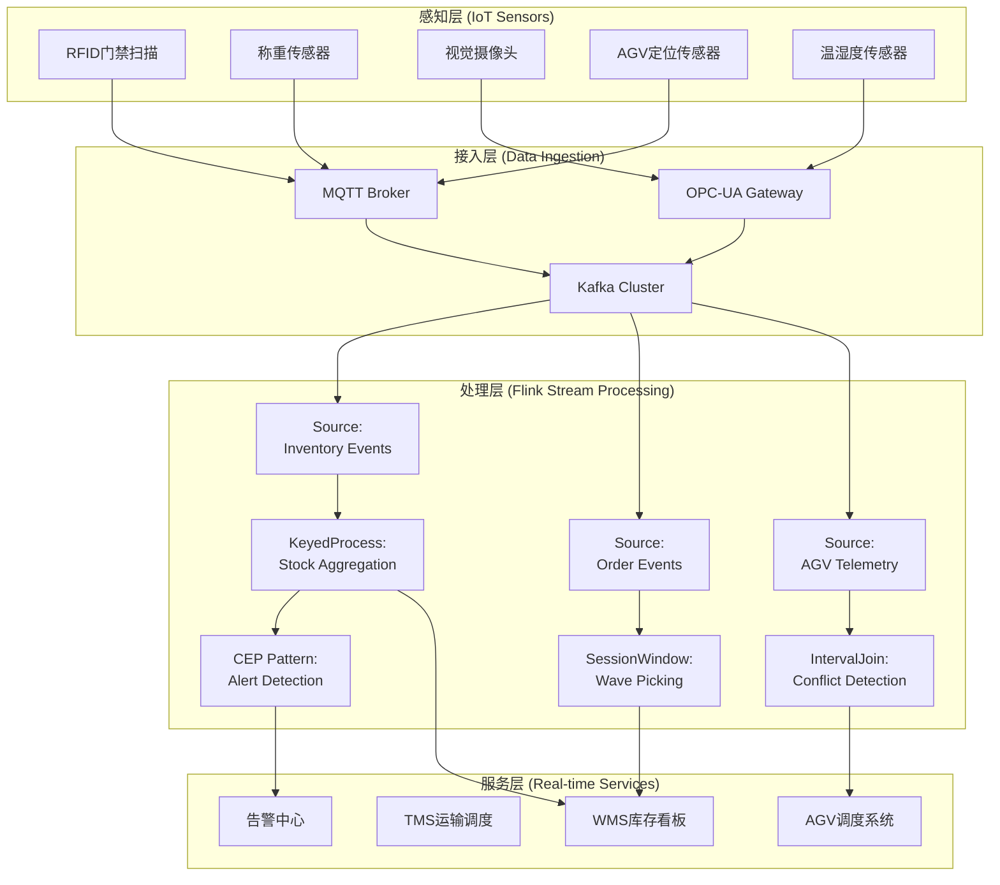
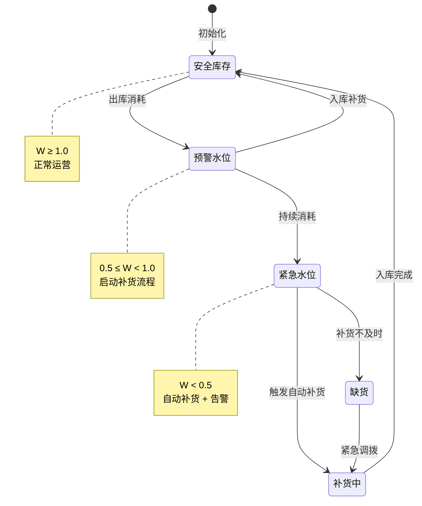
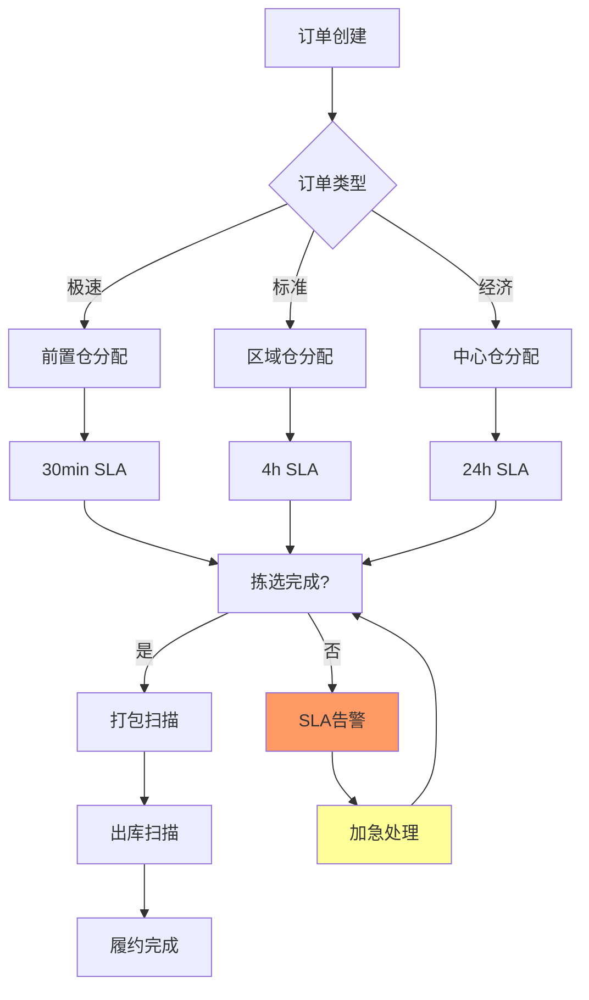

# 实时智慧仓储物流自动化案例研究

> 所属阶段: Knowledge/ Flink/ | 前置依赖: [算子全景分类](../01-concept-atlas/operator-deep-dive/01.06-single-input-operators.md) | [算子代数](../01-concept-atlas/operator-deep-dive/02-stream-operator-algebra.md) | 形式化等级: L4

## 1. 概念定义 (Definitions)

### Def-WH-01-01: 智慧仓储物流系统 (Smart Warehouse Logistics System)

智慧仓储物流系统是指通过物联网(IoT)传感器、自动化设备(AGV/AMR、机械臂、分拣机)与流计算平台协同工作，实现库存状态实时感知、订单动态履约、物流路径智能优化的集成系统。

$$\mathcal{W} = (I, A, O, S, F)$$

其中 $I$ 为IoT传感器数据流集合，$A$ 为自动化设备状态流，$O$ 为订单事件流，$S$ 为库存状态流，$F$ 为流计算处理拓扑。

### Def-WH-01-02: 库存水位 (Inventory Water Level)

库存水位 $W_{sku}(t)$ 定义为时刻 $t$ 某SKU(库存单位)的可用库存量与补货触发阈值的相对比率：

$$W_{sku}(t) = \frac{Q_{available}(t)}{Q_{reorder}}$$

- $W_{sku}(t) \geq 1.0$：安全库存，无需补货
- $0.5 \leq W_{sku}(t) < 1.0$：预警水位，启动补货流程
- $W_{sku}(t) < 0.5$：紧急水位，触发自动补货 + 告警

### Def-WH-01-03: 订单履约时延 SLA (Order Fulfillment Latency SLA)

订单履约时延 $T_{fulfill}$ 从订单创建到出库扫描完成的时间间隔：

$$T_{fulfill} = T_{scan\_out} - T_{order\_create}$$

行业典型SLA分级：

- 极速履约: $T_{fulfill} \leq 30$ 分钟（前置仓模式）
- 标准履约: $T_{fulfill} \leq 4$ 小时（区域仓模式）
- 经济履约: $T_{fulfill} \leq 24$ 小时（中心仓模式）

### Def-WH-01-04: AGV调度冲突 (AGV Scheduling Conflict)

AGV调度冲突发生在两台以上AGV同时请求同一物理路径段或装卸点时：

$$Conflict(v_i, v_j, p, t) \iff Pos(v_i, t) \cap Pos(v_j, t) \cap p \neq \emptyset$$

其中 $v_i, v_j$ 为AGV编号，$p$ 为路径段，$Pos(v, t)$ 为AGV $v$ 在时刻 $t$ 的占用空间。

### Def-WH-01-05: 波次拣选 (Wave Picking)

波次拣选是将一段时间内到达的订单按优化规则分批聚合，形成拣选任务波次的策略：

$$Wave_k = \{o_i \mid T_{create}(o_i) \in [t_k, t_k + \Delta t], \text{similarity}(o_i, o_j) > \theta\}$$

其中 $\Delta t$ 为波次时间窗口，$\theta$ 为订单相似度阈值（基于SKU重叠率或地理位置）。

## 2. 属性推导 (Properties)

### Lemma-WH-01-01: 库存一致性边界

在存在并发出入库操作的情况下，流计算平台维护的库存状态与实际物理库存的偏差有界：

$$|Q_{system}(t) - Q_{physical}(t)| \leq \lambda_{in} \cdot \delta_{scan} + \lambda_{out} \cdot \delta_{pick}$$

**证明**: 系统库存更新依赖扫描事件到达流处理引擎的时延 $\delta_{scan}$（入库）和 $\delta_{pick}$（出库）。在事件到达前，物理库存已变化但系统尚未感知。$

### Lemma-WH-01-02: 波次聚合的拣选效率增益

采用波次拣选相比逐单拣选，拣选路径效率提升下界为：

$$\eta_{wave} \geq 1 + \frac{\sum_{k}|Wave_k| \cdot (1 - J(Wave_k))}{N_{orders}}$$

其中 $J(Wave_k)$ 为波次内订单的Jaccard相似度均值。相似度越高，路径复用率越高，效率增益越大。

### Prop-WH-01-01: AGV死锁避免充分条件

若AGV调度系统满足以下两条件，则可避免死锁：

1. **资源有序分配**: 所有AGV按全局路径编号升序申请路径段
2. **超时退让**: AGV在等待路径超过阈值 $\tau_{wait}$ 后重新规划路径

**论证**: 条件1消除循环等待的必要条件；条件2确保无无限等待。由死锁四必要条件（互斥、持有并等待、不可抢占、循环等待）可知，破坏任一条件即可避免死锁。

### Prop-WH-01-02: 实时库存更新的Exactly-Once语义

使用Flink Checkpoint机制保证库存更新操作的Exactly-Once语义：

$$orall e \in Events: count_{applied}(e) = 1 \iff checkpoint_{interval} < \min(T_{source\_failure\_recovery})$$

**条件**: Checkpoint间隔小于最小源故障恢复时间，确保故障恢复后不会重复处理已提交事件。

## 3. 关系建立 (Relations)

### 与算子体系的映射

| 仓储物流场景 | Flink算子 | 算子作用 |
|------------|-----------|---------|
| 传感器数据接入 | `SourceFunction` + `AsyncFunction` | 多协议IoT数据接入(MQTT/OPC-UA/Modbus) |
| 库存实时计算 | `KeyedProcessFunction` | 按SKU键控聚合，维护库存状态 |
| 波次聚合 | `WindowOperator` (Session Window) | 动态时间窗口聚合相似订单 |
| AGV路径规划 | `BroadcastStream` + `ConnectedStream` | 地图广播 + AGV状态连接 |
| 冲突检测 | `IntervalJoin` | AGV轨迹区间Join检测碰撞 |
| 告警触发 | `CEPPattern` | 复杂事件模式匹配（低库存/超时/异常） |
| 履约看板 | `WindowAggregate` + `Sink` | 实时KPI聚合到Dashboard |

### 与前沿技术的关联

- **数字孪生 (Digital Twin)**: 仓储三维模型与实时数据流同步，实现虚拟调试与预测性维护
- **边缘计算**: 在仓库网关本地预处理传感器数据，减少云端带宽压力
- **强化学习**: AGV路径规划策略在线学习，适应动态订单模式

## 4. 论证过程 (Argumentation)

### 4.1 仓储流处理的核心挑战

**挑战1: 海量传感器并发**
大型智能仓库部署10,000+ IoT传感器（温湿度、RFID门禁、光电计数、重量感应），数据频率从1Hz到100Hz不等，峰值QPS可达百万级。

**挑战2: 状态一致性要求**
库存状态必须在WMS(仓库管理系统)、TMS(运输管理系统)、OMS(订单管理系统)之间保持一致，任何不一致都可能导致超卖或缺货。

**挑战3: 低时延硬约束**
AGV调度决策需在100ms内完成；订单分配需在1秒内完成；履约看板刷新需在5秒内。

### 4.2 方案选型论证

**为什么选用Flink而非Kafka Streams?**

- 有状态计算：库存聚合需要维护大规模键控状态，Flink的RocksDB StateBackend更适合TB级状态
- 复杂事件处理：低库存告警、AGV碰撞检测需要CEP模式匹配
- 精确一次语义：库存更新不允许重复或丢失

**为什么选用Session Window而非Tumbling Window做波次聚合?**

- 订单到达具有突发性，固定时间窗口会导致波次大小不均
- Session Window按活动间隙动态切分，更适合订单流的自然节奏

## 5. 形式证明 / 工程论证 (Proof / Engineering Argument)

### Thm-WH-01-01: 波次拣选最优性定理

在满足以下假设条件下，基于SKU相似度的波次聚合策略近似最优：

**假设**:

1. 仓库货位布局满足ABC分类（高频SKU靠近拣选点）
2. 订单到达服从泊松过程 $Poisson(\lambda)$
3. 单个SKU拣选时间服从指数分布 $Exp(\mu)$

**定理**: 波次聚合策略的期望拣选时间 $E[T_{wave}]$ 满足：

$$E[T_{wave}] \leq E[T_{single}] \cdot \left(1 - \frac{1 - e^{-\lambda \Delta t}}{\lambda \Delta t} \cdot \bar{J}\right)$$

其中 $\bar{J}$ 为波次内平均Jaccard相似度。

**证明概要**:

1. 逐单拣选期望时间为 $E[T_{single}] = N \cdot (t_{walk} + t_{pick})$
2. 波次聚合后，相似订单共享货位访问，节省行走距离
3. 共享比例与波次内SKU重叠率成正比
4. 由泊松过程的聚合性质，波次大小期望为 $\lambda \Delta t$
5. 代入得上述上界

**工程意义**: 当订单相似度 $\bar{J} > 0.3$ 时，波次策略可节省20%以上拣选时间。

## 6. 实例验证 (Examples)

### 6.1 实时库存水位监控Pipeline

```java
// 实时库存水位监控与自动补货触发
StreamExecutionEnvironment env =
StreamExecutionEnvironment.getExecutionEnvironment();
env.enableCheckpointing(5000, CheckpointingMode.EXACTLY_ONCE);

// 入库扫描事件流
DataStream<InventoryEvent> inboundStream = env
    .addSource(new KafkaSource<>("warehouse.inbound.scan"))
    .map(new InboundScanParser());

// 出库扫描事件流
DataStream<InventoryEvent> outboundStream = env
    .addSource(new KafkaSource<>("warehouse.outbound.scan"))
    .map(new OutboundScanParser());

// 库存调整事件流（盘点/损耗/调拨）
DataStream<InventoryEvent> adjustStream = env
    .addSource(new KafkaSource<>("warehouse.adjustment"))
    .map(new AdjustmentParser());

// 合并所有库存事件
DataStream<InventoryEvent> inventoryEvents = inboundStream
    .union(outboundStream, adjustStream);

// 按SKU键控聚合，维护实时库存状态
DataStream<InventoryState> inventoryState = inventoryEvents
    .keyBy(event -> event.getSkuId())
    .process(new KeyedProcessFunction<String, InventoryEvent, InventoryState>() {
        private ValueState<Integer> stockState;
        private ValueState<Integer> reorderThreshold;

        @Override
        public void open(Configuration parameters) {
            stockState = getRuntimeContext().getState(
                new ValueStateDescriptor<>("stock", Types.INT));
            reorderThreshold = getRuntimeContext().getState(
                new ValueStateDescriptor<>("threshold", Types.INT));
        }

        @Override
        public void processElement(InventoryEvent event, Context ctx,
                                   Collector<InventoryState> out) throws Exception {
            int currentStock = stockState.value() != null ? stockState.value() : 0;
            int threshold = reorderThreshold.value() != null ?
                           reorderThreshold.value() : 100;

            switch (event.getType()) {
                case INBOUND:
                    currentStock += event.getQuantity();
                    break;
                case OUTBOUND:
                    currentStock -= event.getQuantity();
                    break;
                case ADJUSTMENT:
                    currentStock = event.getQuantity(); // Absolute adjustment
                    break;
            }

            stockState.update(currentStock);

            double waterLevel = (double) currentStock / threshold;
            InventoryState state = new InventoryState(
                event.getSkuId(), currentStock, threshold, waterLevel,
                ctx.timestamp(), event.getWarehouseId()
            );
            out.collect(state);

            // Trigger replenishment alert if water level < 0.5
            if (waterLevel < 0.5) {
                ctx.output(replenishmentTag, new ReplenishmentAlert(
                    event.getSkuId(), currentStock, threshold, ctx.timestamp()
                ));
            }
        }
    });

//  replenishment alert stream processing
DataStream<ReplenishmentAlert> replenishmentAlerts = inventoryState
    .getSideOutput(replenishmentTag);

replenishmentAlerts.addSink(new KafkaSink<>("warehouse.replenishment.alerts"));
```

### 6.2 波次拣选聚合Pipeline

```java
// Wave picking aggregation based on order similarity
DataStream<OrderEvent> orderStream = env
    .addSource(new KafkaSource<>("oms.order.created"))
    .map(new OrderParser());

// Session window: gap of 2 minutes defines a wave
DataStream<WavePickTask> waveTasks = orderStream
    .keyBy(order -> order.getWarehouseZone())
    .window(EventTimeSessionWindows.withDynamicGap(
        (OrderEvent order) -> Time.minutes(2)))
    .aggregate(new WaveAggregationFunction(), new WaveProcessFunction());

// Wave optimization: sort SKUs by ABC category within wave
DataStream<OptimizedWave> optimizedWaves = waveTasks
    .map(new WaveOptimizer())
    .filter(wave -> wave.getOrderCount() >= 5); // Minimum wave size

optimizedWaves.addSink(new KafkaSink<>("wms.wave.tasks"));
```

### 6.3 AGV调度冲突检测

```java
// AGV conflict detection using interval join
DataStream<AgvPosition> agvPositions = env
    .addSource(new MqttSource<>("agv/position/+", "tcp://mqtt.warehouse.local:1883"));

// Detect potential collisions within 5-second prediction window
DataStream<ConflictAlert> conflicts = agvPositions
    .keyBy(pos -> pos.getPathSegment())
    .intervalJoin(agvPositions.keyBy(pos -> pos.getPathSegment()))
    .between(Time.milliseconds(-5000), Time.milliseconds(5000))
    .process(new ConflictDetectionFunction());

conflicts.addSink(new AlertSink());
```

## 7. 可视化 (Visualizations)

### 图1: 智慧仓储物流实时数据处理架构



### 图2: 库存水位状态机与补货决策树



### 图3: 订单履约SLA监控看板



## 8. 引用参考 (References)
