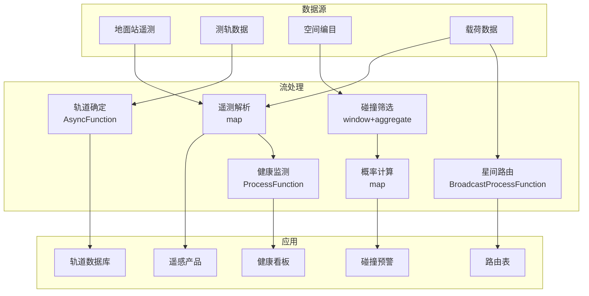

# 算子与实时航天卫星数据处理

> **所属阶段**: Knowledge/10-case-studies | **前置依赖**: [01.07-two-input-operators.md](../01-concept-atlas/operator-deep-dive/01.07-two-input-operators.md), [operator-iot-stream-processing.md](../06-frontier/operator-iot-stream-processing.md) | **形式化等级**: L3
> **文档定位**: 流处理算子在实时卫星遥测、轨道计算与空间态势感知中的算子指纹与Pipeline设计
> **版本**: 2026.04

---

## 目录

- [算子与实时航天卫星数据处理](#算子与实时航天卫星数据处理)
  - [目录](#目录)
  - [1. 概念定义 (Definitions)](#1-概念定义-definitions)
    - [Def-SPC-01-01: 卫星遥测数据（Satellite Telemetry）](#def-spc-01-01-卫星遥测数据satellite-telemetry)
    - [Def-SPC-01-02: 开普勒轨道要素（Keplerian Elements）](#def-spc-01-02-开普勒轨道要素keplerian-elements)
    - [Def-SPC-01-03: 空间态势感知（Space Situational Awareness, SSA）](#def-spc-01-03-空间态势感知space-situational-awareness-ssa)
    - [Def-SPC-01-04: 碰撞概率（Collision Probability）](#def-spc-01-04-碰撞概率collision-probability)
    - [Def-SPC-01-05: 星间链路（Inter-Satellite Link, ISL）](#def-spc-01-05-星间链路inter-satellite-link-isl)
  - [2. 属性推导 (Properties)](#2-属性推导-properties)
    - [Lemma-SPC-01-01: 轨道周期的开普勒第三定律](#lemma-spc-01-01-轨道周期的开普勒第三定律)
    - [Lemma-SPC-01-02: 遥测数据压缩率](#lemma-spc-01-02-遥测数据压缩率)
    - [Prop-SPC-01-01: 地面站覆盖的时间间隙](#prop-spc-01-01-地面站覆盖的时间间隙)
    - [Prop-SPC-01-02: 星链组网的延迟优势](#prop-spc-01-02-星链组网的延迟优势)
  - [3. 关系建立 (Relations)](#3-关系建立-relations)
    - [3.1 卫星数据处理Pipeline算子映射](#31-卫星数据处理pipeline算子映射)
    - [3.2 算子指纹](#32-算子指纹)
    - [3.3 轨道高度对比](#33-轨道高度对比)
  - [4. 论证过程 (Argumentation)](#4-论证过程-argumentation)
    - [4.1 为什么卫星数据处理需要流处理而非传统存储转发](#41-为什么卫星数据处理需要流处理而非传统存储转发)
    - [4.2 大规模星座的管理挑战](#42-大规模星座的管理挑战)
    - [4.3 空间碎片监测](#43-空间碎片监测)
  - [5. 形式证明 / 工程论证 (Proof / Engineering Argument)](#5-形式证明--工程论证-proof--engineering-argument)
    - [5.1 卫星健康监测Pipeline](#51-卫星健康监测pipeline)
    - [5.2 碰撞预警系统](#52-碰撞预警系统)
    - [5.3 星间路由优化](#53-星间路由优化)
  - [6. 实例验证 (Examples)](#6-实例验证-examples)
    - [6.1 实战：低轨星座实时管控](#61-实战低轨星座实时管控)
    - [6.2 实战：遥感载荷数据实时处理](#62-实战遥感载荷数据实时处理)
  - [7. 可视化 (Visualizations)](#7-可视化-visualizations)
    - [卫星数据处理Pipeline](#卫星数据处理pipeline)
  - [8. 引用参考 (References)](#8-引用参考-references)

---

## 1. 概念定义 (Definitions)

### Def-SPC-01-01: 卫星遥测数据（Satellite Telemetry）

卫星遥测数据是从在轨航天器下传的状态与健康数据：

$$\text{Telemetry}_t = (\text{Housekeeping}_t, \text{Payload}_t, \text{Tracking}_t)$$

包括：姿轨控状态、电源系统、热控系统、载荷科学数据、测轨数据。

### Def-SPC-01-02: 开普勒轨道要素（Keplerian Elements）

描述卫星轨道的六要素：

$$\text{Orbit} = (a, e, i, \Omega, \omega, M)$$

其中 $a$ 为半长轴，$e$ 为偏心率，$i$ 为轨道倾角，$\Omega$ 为升交点赤经，$\omega$ 为近地点幅角，$M$ 为平近点角。

### Def-SPC-01-03: 空间态势感知（Space Situational Awareness, SSA）

SSA是对空间目标的探测、跟踪与编目的综合能力：

$$\text{SSA} = (\text{Detection}, \text{Tracking}, \text{Identification}, \text{Cataloging}, \text{Threat Assessment})$$

### Def-SPC-01-04: 碰撞概率（Collision Probability）

两个空间目标在给定时刻的碰撞概率：

$$P_c = \frac{1}{2\pi\sqrt{|\Sigma|}} \int_{\text{CombinedHardBody}} \exp\left(-\frac{1}{2}\mathbf{r}^T \Sigma^{-1} \mathbf{r}\right) \, d\mathbf{r}$$

其中 $\Sigma$ 为相对位置协方差矩阵，CombinedHardBody 为组合硬球体。

### Def-SPC-01-05: 星间链路（Inter-Satellite Link, ISL）

ISL是卫星之间的直接通信链路：

$$\text{ISL}_{ij} = \text{Visible}(i, j) \land \text{Distance}(i, j) < D_{max} \land \text{PointingError} < \theta_{max}$$

---

## 2. 属性推导 (Properties)

### Lemma-SPC-01-01: 轨道周期的开普勒第三定律

$$T = 2\pi \sqrt{\frac{a^3}{\mu}}$$

其中 $\mu = GM_{Earth} \approx 3.986 \times 10^{14} \text{ m}^3/\text{s}^2$。

**证明**: 由万有引力定律和向心力平衡推导。∎

### Lemma-SPC-01-02: 遥测数据压缩率

采用差分编码的压缩率：

$$\text{CompressionRatio} = 1 - \frac{H(\Delta x)}{H(x)}$$

其中 $H$ 为熵，$\Delta x_t = x_t - x_{t-1}$。对于缓慢变化的遥测参数，压缩率可达 80-95%。

### Prop-SPC-01-01: 地面站覆盖的时间间隙

对于单地面站，卫星不可见时间比例：

$$f_{gap} = 1 - \frac{T_{visible}}{T_{orbit}} = 1 - \frac{\arccos(R_E / (R_E + h))}{\pi}$$

其中 $R_E$ 为地球半径，$h$ 为轨道高度。LEO卫星（h=500km）的间隙比例约 70%。

### Prop-SPC-01-02: 星链组网的延迟优势

$N$ 颗LEO卫星组成的星座，任意两点间最大跳数：

$$H_{max} = O(\sqrt{N})$$

相比地面光纤（需绕行地球曲面），星间链路可减少延迟 30-50%。

---

## 3. 关系建立 (Relations)

### 3.1 卫星数据处理Pipeline算子映射

| 应用场景 | 算子组合 | 数据源 | 延迟要求 |
|---------|---------|--------|---------|
| **遥测解析** | map | 原始遥测帧 | < 1s |
| **健康评估** | ProcessFunction + Timer | 解析后遥测 | < 5s |
| **轨道确定** | AsyncFunction | 测轨数据 | < 1min |
| **碰撞预警** | window+aggregate | 编目数据 | < 5min |
| **载荷处理** | map + window | 科学数据 | < 10s |
| **星间路由** | Broadcast + ProcessFunction | 网络拓扑 | < 1s |

### 3.2 算子指纹

| 维度 | 卫星数据处理特征 |
|------|----------------|
| **核心算子** | ProcessFunction（健康状态机）、AsyncFunction（轨道确定）、BroadcastProcessFunction（星历更新）、window+aggregate（碰撞筛选） |
| **状态类型** | ValueState（卫星健康状态）、MapState（轨道要素）、BroadcastState（空间物体编目） |
| **时间语义** | 事件时间（遥测时间戳） |
| **数据特征** | 突发性强（过顶时）、高价值（难以重传）、格式多样（CCSDS/自定义） |
| **状态规模** | 按卫星分Key，大型星座可达万级 |
| **性能瓶颈** | 轨道力学计算、大规模碰撞筛选 |

### 3.3 轨道高度对比

| 轨道类型 | 高度 | 周期 | 覆盖特点 | 延迟 |
|---------|------|------|---------|------|
| **LEO** | 200-2000km | 90-120min | 需多星组网 | 20-40ms |
| **MEO** | 2000-35786km | 2-12h | 导航卫星 | 60-120ms |
| **GEO** | 35786km | 24h | 固定覆盖 | 250ms |
| **HEO** | 椭圆 | 12-24h | 高纬度覆盖 | 可变 |

---

## 4. 论证过程 (Argumentation)

### 4.1 为什么卫星数据处理需要流处理而非传统存储转发

传统方式的问题：

- 存储转发：过顶数据下传后批量处理，发现异常滞后一个轨道周期
- 地面集中：所有计算在地面进行，星上数据无法实时利用
- 人工判读：遥测依赖专家判读，效率低

流处理的优势：

- 实时解析：遥测帧下传同时即解析
- 星上处理：边缘计算在卫星上预处理
- 自动告警：参数越限自动触发告警

### 4.2 大规模星座的管理挑战

**问题**: Starlink计划部署12,000+颗卫星，传统单星管理方式不可行。

**流处理方案**:

1. **批量健康监测**: 星座级聚合统计，识别异常卫星
2. **自动轨道保持**: 基于实时测轨数据自动计算轨道机动
3. **动态频率协调**: 实时避免星间干扰

### 4.3 空间碎片监测

**场景**: 监测10万+个空间碎片，检测潜在碰撞。

**挑战**:

- 数据量大：每天数百万次观测
- 实时性要求：碰撞预警需提前数小时
- 不确定性：轨道预报误差随时间增长

**方案**: 使用流处理实时筛选接近事件（Close Approach），仅对高风险事件进行精细计算。

---

## 5. 形式证明 / 工程论证 (Proof / Engineering Argument)

### 5.1 卫星健康监测Pipeline

```java
public class SatelliteHealthMonitor extends KeyedProcessFunction<String, TelemetryFrame, HealthAlert> {
    private ValueState<SatelliteHealth> healthState;
    private MapState<String, Double> paramThresholds;

    @Override
    public void processElement(TelemetryFrame frame, Context ctx, Collector<HealthAlert> out) throws Exception {
        SatelliteHealth health = healthState.value();
        if (health == null) health = new SatelliteHealth(frame.getSatelliteId());

        // 解析遥测参数
        Map<String, Double> params = parseTelemetry(frame);

        for (Map.Entry<String, Double> entry : params.entrySet()) {
            String param = entry.getKey();
            double value = entry.getValue();
            Double threshold = paramThresholds.get(param);

            if (threshold != null && value > threshold) {
                out.collect(new HealthAlert(
                    frame.getSatelliteId(),
                    param,
                    value,
                    threshold,
                    "THRESHOLD_EXCEEDED",
                    ctx.timestamp()
                ));
            }

            // 趋势检测：连续上升
            health.updateParamTrend(param, value);
            if (health.isRapidlyIncreasing(param, 3)) {  // 连续3帧上升
                out.collect(new HealthAlert(
                    frame.getSatelliteId(),
                    param,
                    value,
                    threshold,
                    "RAPID_INCREASE",
                    ctx.timestamp()
                ));
            }
        }

        healthState.update(health);
    }
}
```

### 5.2 碰撞预警系统

```java
// 编目对象流（空间物体位置）
DataStream<SpaceObject> catalog = env.addSource(new CatalogSource());

// 碰撞筛选：初步过滤（ coarse screening ）
DataStream<PotentialConjunction> candidates = catalog
    .windowAll(TumblingProcessingTimeWindows.of(Time.minutes(5)))
    .apply(new CoarseScreeningFunction() {
        @Override
        public void apply(Date windowStart, Date windowEnd, Iterable<SpaceObject> values, Collector<PotentialConjunction> out) {
            List<SpaceObject> objects = new ArrayList<>();
            values.forEach(objects::add);

            // 几何筛选：仅检查距离较近的对
            for (int i = 0; i < objects.size(); i++) {
                for (int j = i + 1; j < objects.size(); j++) {
                    SpaceObject a = objects.get(i);
                    SpaceObject b = objects.get(j);

                    double distance = calculateDistance(a, b);
                    if (distance < 10000) {  // 10km阈值
                        out.collect(new PotentialConjunction(a, b, distance, windowStart));
                    }
                }
            }
        }
    });

// 精细计算：碰撞概率
candidates
    .filter(c -> c.getDistance() < 1000)  // 进一步筛选到1km
    .map(new CollisionProbabilityFunction())
    .filter(p -> p.getProbability() > 1e-6)  // 1/百万阈值
    .addSink(new ConjunctionAlertSink());
```

### 5.3 星间路由优化

```java
// 卫星位置流
DataStream<SatellitePosition> positions = env.addSource(new OrbitPropagatorSource());

// 网络拓扑计算
positions.keyBy(SatellitePosition::getConstellationId)
    .window(TumblingProcessingTimeWindows.of(Time.seconds(30)))
    .aggregate(new TopologyAggregate())
    .process(new BroadcastProcessFunction<TopologyGraph, RouteRequest, RouteResult>() {
        private ValueState<TopologyGraph> currentTopology;

        @Override
        public void processElement(RouteRequest req, ReadOnlyContext ctx, Collector<RouteResult> out) throws Exception {
            TopologyGraph topology = currentTopology.value();
            if (topology == null) return;

            // Dijkstra最短路径
            List<String> path = topology.shortestPath(req.getSource(), req.getDestination());
            int hops = path.size() - 1;
            double latency = hops * 10;  // 每跳约10ms

            out.collect(new RouteResult(req.getId(), path, hops, latency, ctx.timestamp()));
        }

        @Override
        public void processBroadcastElement(TopologyGraph topology, Context ctx, Collector<RouteResult> out) {
            currentTopology.update(topology);
        }
    })
    .addSink(new RoutingTableSink());
```

---

## 6. 实例验证 (Examples)

### 6.1 实战：低轨星座实时管控

```java
// 1. 多星遥测接入
DataStream<TelemetryFrame> telemetry = env.addSource(new GroundStationSource());

// 2. 健康监测
telemetry.keyBy(TelemetryFrame::getSatelliteId)
    .process(new SatelliteHealthMonitor())
    .addSink(new AlertSink());

// 3. 轨道确定
telemetry.filter(f -> f.getType().equals("TRACKING"))
    .keyBy(TelemetryFrame::getSatelliteId)
    .process(new AsyncWaitForOrbitDetermination())
    .addSink(new OrbitDatabaseSink());

// 4. 碰撞预警
DataStream<SpaceObject> allObjects = env.addSource(new SpaceTrackAPI());
allObjects.windowAll(TumblingProcessingTimeWindows.of(Time.minutes(10)))
    .apply(new CoarseScreeningFunction())
    .map(new CollisionProbabilityFunction())
    .filter(p -> p.getProbability() > 1e-5)
    .addSink(new CollisionAlertSink());
```

### 6.2 实战：遥感载荷数据实时处理

```java
// 遥感数据流
DataStream<RemoteSensingData> rsData = env.addSource(new PayloadDataSource());

// 数据预处理
rsData.map(new DataPreprocessingFunction())
    .keyBy(RemoteSensingData::getRegion)
    .window(TumblingEventTimeWindows.of(Time.minutes(5)))
    .aggregate(new MosaicAggregate())
    .map(new CloudDetectionFunction())
    .filter(m -> m.getCloudCoverage() < 0.2)
    .addSink(new ImageProductSink());
```

---

## 7. 可视化 (Visualizations)

### 卫星数据处理Pipeline



---

## 8. 引用参考 (References)


---

*关联文档*: [01.07-two-input-operators.md](../01-concept-atlas/operator-deep-dive/01.07-two-input-operators.md) | [operator-iot-stream-processing.md](../06-frontier/operator-iot-stream-processing.md) | [realtime-digital-twin-case-study.md](../10-case-studies/realtime-digital-twin-case-study.md)
