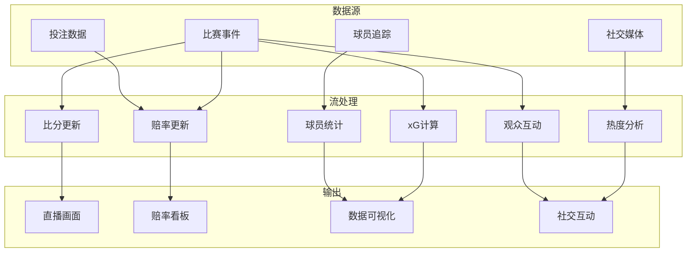

# 算子与实时体育数据分析

> **所属阶段**: Knowledge/10-case-studies | **前置依赖**: [01.06-single-input-operators.md](../01-concept-atlas/operator-deep-dive/01.06-single-input-operators.md), [operator-ai-ml-integration.md](../06-frontier/operator-ai-ml-integration.md) | **形式化等级**: L3
> **文档定位**: 流处理算子在实时体育赛事分析、赔率计算与观众互动中的算子指纹与Pipeline设计
> **版本**: 2026.04

---

## 目录

- [算子与实时体育数据分析](#算子与实时体育数据分析)
  - [目录](#目录)
  - [1. 概念定义 (Definitions)](#1-概念定义-definitions)
    - [Def-SPT-01-01: 体育事件流（Sports Event Stream）](#def-spt-01-01-体育事件流sports-event-stream)
    - [Def-SPT-01-02: 实时赔率（Real-time Odds）](#def-spt-01-02-实时赔率real-time-odds)
    - [Def-SPT-01-03: 预期进球（Expected Goals, xG）](#def-spt-01-03-预期进球expected-goals-xg)
    - [Def-SPT-01-04: 球员追踪数据（Player Tracking Data）](#def-spt-01-04-球员追踪数据player-tracking-data)
    - [Def-SPT-01-05: 观众情绪流（Crowd Sentiment Stream）](#def-spt-01-05-观众情绪流crowd-sentiment-stream)
  - [2. 属性推导 (Properties)](#2-属性推导-properties)
    - [Lemma-SPT-01-01: 赔率更新的马尔可夫性](#lemma-spt-01-01-赔率更新的马尔可夫性)
    - [Lemma-SPT-01-02: 球员跑动距离的可加性](#lemma-spt-01-02-球员跑动距离的可加性)
    - [Prop-SPT-01-01: 赔率变化的弹性](#prop-spt-01-01-赔率变化的弹性)
    - [Prop-SPT-01-02: 社交热度的自增强效应](#prop-spt-01-02-社交热度的自增强效应)
  - [3. 关系建立 (Relations)](#3-关系建立-relations)
    - [3.1 体育分析Pipeline算子映射](#31-体育分析pipeline算子映射)
    - [3.2 算子指纹](#32-算子指纹)
    - [3.3 数据源对比](#33-数据源对比)
  - [4. 论证过程 (Argumentation)](#4-论证过程-argumentation)
    - [4.1 为什么体育分析需要流处理而非批量统计](#41-为什么体育分析需要流处理而非批量统计)
    - [4.2 赔率计算的反套利挑战](#42-赔率计算的反套利挑战)
    - [4.3 球员疲劳的实时监测](#43-球员疲劳的实时监测)
  - [5. 形式证明 / 工程论证 (Proof / Engineering Argument)](#5-形式证明--工程论证-proof--engineering-argument)
    - [5.1 实时赔率更新算法](#51-实时赔率更新算法)
    - [5.2 球员追踪数据处理](#52-球员追踪数据处理)
    - [5.3 社交媒体热度计算](#53-社交媒体热度计算)
  - [6. 实例验证 (Examples)](#6-实例验证-examples)
    - [6.1 实战：足球比赛实时分析](#61-实战足球比赛实时分析)
    - [6.2 实战：观众实时预测游戏](#62-实战观众实时预测游戏)
  - [7. 可视化 (Visualizations)](#7-可视化-visualizations)
    - [体育分析Pipeline](#体育分析pipeline)
  - [8. 引用参考 (References)](#8-引用参考-references)

---

## 1. 概念定义 (Definitions)

### Def-SPT-01-01: 体育事件流（Sports Event Stream）

体育事件流是比赛过程中离散事件的时序序列：

$$\text{SportsEvent}_t = (\text{type}, \text{player}, \text{team}, \text{position}, \text{timestamp})$$

事件类型：射门(SHOT)、传球(PASS)、犯规(FOUL)、换人(SUBSTITUTION)、进球(GOAL)、角球(CORNER)等。

### Def-SPT-01-02: 实时赔率（Real-time Odds）

实时赔率是根据比赛动态和投注分布持续更新的赢率估计：

$$\text{Odds}_t = \frac{1}{P_t(win)} \cdot (1 + \text{margin})$$

其中 $P_t(win)$ 为时刻 $t$ 的获胜概率估计，margin 为庄家利润率（通常 2-10%）。

### Def-SPT-01-03: 预期进球（Expected Goals, xG）

xG是根据射门位置、角度和方式计算的进球概率：

$$xG = f(\text{distance}, \text{angle}, \text{bodyPart}, \text{assistType}, \text{defenders})$$

典型值：点球约 0.76，禁区内射门约 0.1-0.3，远射约 0.02-0.05。

### Def-SPT-01-04: 球员追踪数据（Player Tracking Data）

球员追踪数据是通过计算机视觉或GPS/RFID采集的位置时间序列：

$$\text{Position}_p(t) = (x(t), y(t), z(t)), \quad t \in [0, T_{match}]$$

采样频率：25-60 Hz（视频追踪），10 Hz（GPS）。

### Def-SPT-01-05: 观众情绪流（Crowd Sentiment Stream）

观众情绪流是社交媒体上关于比赛实时讨论的文本流：

$$\text{Sentiment}_t = \frac{\sum_{i} s_i \cdot w_i}{\sum_{i} w_i}$$

其中 $s_i \in [-1, +1]$ 为单条情感得分，$w_i$ 为影响力权重（粉丝数/认证状态）。

---

## 2. 属性推导 (Properties)

### Lemma-SPT-01-01: 赔率更新的马尔可夫性

实时赔率更新满足马尔可夫性质：

$$P(\text{Odds}_{t+1} \mid \text{Odds}_t, \text{Odds}_{t-1}, ...) = P(\text{Odds}_{t+1} \mid \text{Odds}_t)$$

即未来赔率仅依赖当前状态，与历史路径无关。

### Lemma-SPT-01-02: 球员跑动距离的可加性

球员总跑动距离是各时段跑动距离之和：

$$D_{total} = \sum_{i} \sqrt{(x_{i+1} - x_i)^2 + (y_{i+1} - y_i)^2}$$

### Prop-SPT-01-01: 赔率变化的弹性

赔率对关键事件的弹性：

$$\epsilon = \frac{\Delta \text{Odds} / \text{Odds}}{\Delta P(win) / P(win)}$$

进球事件：弹性极高（赔率可变化50-90%）；角球事件：弹性中等（5-15%）。

### Prop-SPT-01-02: 社交热度的自增强效应

关键进球后社交讨论量呈指数增长：

$$N_{posts}(t) = N_0 \cdot e^{\lambda t}, \quad t \in [0, T_{decay}]$$

然后按幂律衰减：$N_{posts}(t) \propto t^{-\alpha}$。

---

## 3. 关系建立 (Relations)

### 3.1 体育分析Pipeline算子映射

| 应用场景 | 算子组合 | 数据源 | 延迟要求 |
|---------|---------|--------|---------|
| **实时比分** | Source → map | 手动/自动录入 | < 1s |
| **xG计算** | map + Async ML | 射门事件 | < 2s |
| **赔率更新** | ProcessFunction + Broadcast | 事件流 + 投注流 | < 1s |
| **球员统计** | window+aggregate | 追踪数据 | < 5s |
| **热点检测** | window+aggregate | 社交媒体 | < 10s |
| **VAR辅助** | AsyncFunction | 视频片段 | < 30s |
| **观众互动** | map+join | 投票/预测 | < 1s |

### 3.2 算子指纹

| 维度 | 体育数据分析特征 |
|------|---------------|
| **核心算子** | ProcessFunction（赔率状态机）、AsyncFunction（ML推理）、window+aggregate（统计）、Broadcast（配置更新） |
| **状态类型** | ValueState（当前比分/赔率）、MapState（球员统计）、WindowState（时段统计） |
| **时间语义** | 处理时间为主（直播实时性） |
| **数据特征** | 事件驱动（离散事件）、高突发（进球时峰值）、强时间局部性 |
| **状态热点** | 热门比赛/热门球队key |
| **性能瓶颈** | xG模型推理、社交数据量峰值 |

### 3.3 数据源对比

| 数据源 | 延迟 | 精度 | 成本 | 覆盖 |
|--------|------|------|------|------|
| **人工录入** | 1-3s | 中 | 低 | 全量 |
| **计算机视觉** | 100ms-1s | 高 | 高 | 球场内 |
| **GPS/RFID** | 100ms | 高 | 中 | 穿戴设备 |
| **社交媒体** | 1-10s | 低 | 低 | 全球 |
| **投注数据** | 100ms | 高 | 高 | 投注用户 |

---

## 4. 论证过程 (Argumentation)

### 4.1 为什么体育分析需要流处理而非批量统计

批量统计的问题：

- 赛后报表：观众已离场，错过实时互动时机
- 赔率静态：赛前赔率无法反映比赛动态
- 体验滞后：观众无法实时参与预测/投票

流处理的优势：

- 实时比分：事件发生后秒级更新
- 动态赔率：每次射门都调整赔率
- 实时互动：观众实时投票、预测、社交

### 4.2 赔率计算的反套利挑战

**套利机会**: 若不同平台对同一场比赛给出差异赔率，套利者可同时押注双方获利。

**流处理方案**:

1. 实时监控多个平台的赔率
2. 检测异常偏差（超出正常范围）
3. 自动调整本方赔率以消除套利空间

### 4.3 球员疲劳的实时监测

**指标**:

- 高速跑动距离（>20km/h）
- 冲刺次数
- 心率变异性

**流处理**: 实时计算疲劳指数，当超过阈值时建议换人。

---

## 5. 形式证明 / 工程论证 (Proof / Engineering Argument)

### 5.1 实时赔率更新算法

```java
public class OddsUpdateFunction extends BroadcastProcessFunction<MatchEvent, OddsConfig, OddsUpdate> {
    private ValueState<MatchState> matchState;

    @Override
    public void processElement(MatchEvent event, ReadOnlyContext ctx, Collector<OddsUpdate> out) {
        MatchState state = matchState.value();
        if (state == null) state = new MatchState();

        // 更新比赛状态
        state.update(event);

        // 计算新概率（简化模型）
        double homeStrength = state.getHomeXG() * 0.6 + state.getHomeScore() * 0.4;
        double awayStrength = state.getAwayXG() * 0.6 + state.getAwayScore() * 0.4;

        double total = homeStrength + awayStrength + 0.1;  // 0.1为平局权重
        double homeProb = homeStrength / total;
        double awayProb = awayStrength / total;
        double drawProb = 0.1 / total;

        // 转换为赔率（含利润率）
        double margin = 0.05;
        double homeOdds = 1.0 / (homeProb * (1 - margin));
        double awayOdds = 1.0 / (awayProb * (1 - margin));
        double drawOdds = 1.0 / (drawProb * (1 - margin));

        out.collect(new OddsUpdate(state.getMatchId(), homeOdds, awayOdds, drawOdds, ctx.timestamp()));
        matchState.update(state);
    }
}
```

### 5.2 球员追踪数据处理

```java
// 球员位置流
DataStream<PlayerPosition> positions = env.addSource(new TrackingSource());

// 计算实时跑动距离
positions.keyBy(PlayerPosition::getPlayerId)
    .process(new KeyedProcessFunction<String, PlayerPosition, PlayerStats>() {
        private ValueState<PlayerPosition> lastPosition;
        private ValueState<Double> totalDistance;

        @Override
        public void processElement(PlayerPosition pos, Context ctx, Collector<PlayerStats> out) throws Exception {
            PlayerPosition last = lastPosition.value();
            Double dist = totalDistance.value();
            if (dist == null) dist = 0.0;

            if (last != null) {
                double segment = Math.sqrt(
                    Math.pow(pos.getX() - last.getX(), 2) +
                    Math.pow(pos.getY() - last.getY(), 2)
                );
                dist += segment;
            }

            // 计算速度
            double speed = 0;
            if (last != null) {
                double timeDiff = (pos.getTimestamp() - last.getTimestamp()) / 1000.0;
                if (timeDiff > 0) {
                    speed = Math.sqrt(
                        Math.pow(pos.getX() - last.getX(), 2) +
                        Math.pow(pos.getY() - last.getY(), 2)
                    ) / timeDiff;
                }
            }

            lastPosition.update(pos);
            totalDistance.update(dist);

            out.collect(new PlayerStats(pos.getPlayerId(), dist, speed, pos.getTimestamp()));
        }
    })
    .addSink(new StatsDashboardSink());
```

### 5.3 社交媒体热度计算

```java
// 社交媒体流
DataStream<SocialPost> posts = env.addSource(new TwitterSource("#WorldCup"));

// 情感分析 + 热度聚合
posts.map(new SentimentAnalysisFunction())
    .keyBy(SentimentResult::getTeam)
    .window(SlidingProcessingTimeWindows.of(Time.minutes(1), Time.seconds(10)))
    .aggregate(new HeatAggregate())
    .addSink(new HeatmapSink());
```

---

## 6. 实例验证 (Examples)

### 6.1 实战：足球比赛实时分析

```java
// 1. 比赛事件摄入
DataStream<MatchEvent> events = env.addSource(new MatchEventSource());

// 2. 比分更新
events.filter(e -> e.getType().equals("GOAL"))
    .keyBy(MatchEvent::getMatchId)
    .process(new ScoreUpdateFunction())
    .addSink(new ScoreboardSink());

// 3. xG计算
events.filter(e -> e.getType().equals("SHOT"))
    .map(new ShotEventExtractor())
    .keyBy(ShotEvent::getMatchId)
    .process(new AsyncWaitForXGFunction())
    .addSink(new XGDisplaySink());

// 4. 赔率实时更新
events.keyBy(MatchEvent::getMatchId)
    .connect(oddsConfigBroadcast)
    .process(new OddsUpdateFunction())
    .addSink(new OddsDisplaySink());

// 5. 球员统计
DataStream<PlayerPosition> tracking = env.addSource(new TrackingSource());
tracking.keyBy(PlayerPosition::getPlayerId)
    .process(new PlayerStatsFunction())
    .windowAll(TumblingProcessingTimeWindows.of(Time.minutes(1)))
    .apply(new LeaderboardFunction())
    .addSink(new LeaderboardSink());
```

### 6.2 实战：观众实时预测游戏

```java
// 观众预测流
DataStream<PredictionVote> votes = env.addSource(new WebSocketSource("/predictions"));

// 实时统计预测分布
votes.keyBy(PredictionVote::getMatchId)
    .window(TumblingProcessingTimeWindows.of(Time.minutes(5)))
    .aggregate(new VoteDistributionAggregate())
    .addSink(new PredictionDisplaySink());

// 预测准确率计算（赛后）
votes.keyBy(PredictionVote::getUserId)
    .connect(matchResults.keyBy(MatchResult::getMatchId))
    .process(new PredictionAccuracyFunction())
    .addSink(new LeaderboardSink());
```

---

## 7. 可视化 (Visualizations)

### 体育分析Pipeline



---

## 8. 引用参考 (References)


---

*关联文档*: [01.06-single-input-operators.md](../01-concept-atlas/operator-deep-dive/01.06-single-input-operators.md) | [operator-ai-ml-integration.md](../06-frontier/operator-ai-ml-integration.md) | [operator-social-media-sentiment-analysis.md](../06-frontier/operator-social-media-sentiment-analysis.md)
