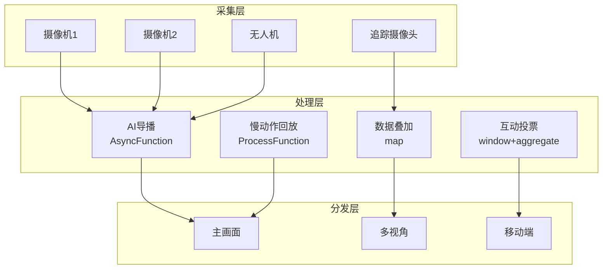

# 算子与实时体育赛事直播

> **所属阶段**: Knowledge/10-case-studies | **前置依赖**: [01.10-process-and-async-operators.md](../01-concept-atlas/operator-deep-dive/01.10-process-and-async-operators.md), [realtime-sports-analytics-case-study.md](../10-case-studies/realtime-sports-analytics-case-study.md) | **形式化等级**: L3
> **文档定位**: 流处理算子在实时体育赛事直播、多机位切换与实时数据分析中的算子指纹与Pipeline设计
> **版本**: 2026.04

---

## 目录

- [1. 概念定义 (Definitions)](#1-概念定义-definitions)
- [2. 属性推导 (Properties)](#2-属性推导-properties)
- [3. 关系建立 (Relations)](#3-关系建立-relations)
- [4. 论证过程 (Argumentation)](#4-论证过程-argumentation)
- [5. 形式证明 / 工程论证 (Proof / Engineering Argument)](#5-形式证明--工程论证-proof--engineering-argument)
- [6. 实例验证 (Examples)](#6-实例验证-examples)
- [7. 可视化 (Visualizations)](#7-可视化-visualizations)
- [8. 引用参考 (References)](#8-引用参考-references)

---

## 1. 概念定义 (Definitions)

### Def-SLB-01-01: 体育赛事数据流（Sports Event Data Stream）

体育赛事数据流是多维度实时数据的综合：

$$\text{SportsStream}_t = (\text{Video}_t, \text{Stats}_t, \text{Tracking}_t, \text{Audio}_t, \text{Social}_t)$$

### Def-SLB-01-02: 多机位导播（Multi-camera Broadcasting）

多机位导播是根据赛事动态选择最优画面的决策过程：

$$\text{Camera}^*(t) = \arg\max_{c} f(\text{ActionIntensity}_c, \text{BallProximity}_c, \text{PlayerExpression}_c)$$

### Def-SLB-01-03: 实时数据叠加（Real-time Data Overlay）

实时数据叠加是在视频画面上动态显示统计数据：

$$\text{Overlay}_t = \text{Render}(\text{Stats}_t, \text{Position}_{screen}, \text{Style})$$

### Def-SLB-01-04: 观众互动投票（Audience Interactive Voting）

$$\text{VoteResult}_t = \arg\max_{o} \sum_{u} \mathbf{1}_{vote_u = o}$$

### Def-SLB-01-05: 慢动作回放（Slow-motion Replay）

慢动作回放是关键时刻的高帧率回放：

$$\text{Replay} = \text{Event}_t \text{ where } \text{Importance}(t) > \theta_{replay}$$

---

## 2. 属性推导 (Properties)

### Lemma-SLB-01-01: 视频编码的帧间压缩效率

$$\text{CompressionRatio} = \frac{\text{Size}_{intra}}{\text{Size}_{inter}} \approx 3\text{-}10$$

运动补偿帧间编码比帧内编码节省3-10倍带宽。

### Lemma-SLB-01-02: 导播决策的延迟约束

$$\mathcal{L}_{switch} + \mathcal{L}_{encode} + \mathcal{L}_{transmit} < 5\text{s}$$

直播延迟需控制在5秒内以保证实时性。

### Prop-SLB-01-01: 关键帧检测准确率

$$\text{Precision} = \frac{TP}{TP + FP}, \quad \text{Recall} = \frac{TP}{TP + FN}$$

AI自动导播的F1-score可达85-92%。

### Prop-SLB-01-02: 多视角回放的带宽倍增

$$B_{multi} = N_{cameras} \cdot B_{single} \cdot \eta$$

其中 $\eta \approx 0.3$ 为自适应码率节省系数。

---

## 3. 关系建立 (Relations)

### 3.1 体育直播Pipeline算子映射

| 应用场景 | 算子组合 | 数据源 | 延迟要求 |
|---------|---------|--------|---------|
| **多路视频接入** | Source | 摄像机 | < 1s |
| **AI导播** | AsyncFunction | 视频分析 | < 2s |
| **数据叠加** | map | 统计数据 | < 1s |
| **互动投票** | window+aggregate | 观众投票 | < 5s |
| **慢动作回放** | ProcessFunction | 关键事件 | < 3s |
| **社交热度** | window+aggregate | 社交媒体 | < 10s |

### 3.2 算子指纹

| 维度 | 体育直播特征 |
|------|------------|
| **核心算子** | AsyncFunction（AI分析）、ProcessFunction（回放控制）、BroadcastProcessFunction（导播指令）、window+aggregate（互动统计） |
| **状态类型** | ValueState（当前画面）、MapState（回放缓存）、BroadcastState（导播配置） |
| **时间语义** | 处理时间为主（直播实时性） |
| **数据特征** | 高带宽（多路4K）、高突发（进球时刻）、强互动 |
| **状态热点** | 热门比赛Key、关键事件Key |
| **性能瓶颈** | 4K视频处理、AI分析推理 |

---

## 4. 论证过程 (Argumentation)

### 4.1 为什么体育直播需要流处理而非传统转播

传统转播的问题：
- 人工导播：反应慢，错过精彩瞬间
- 固定画面：无法根据用户偏好定制
- 延迟高：卫星传输延迟3-5秒

流处理的优势：
- AI导播：自动识别精彩时刻切换画面
- 个性化：用户自选视角和数据叠加
- 低延迟：IP传输<1秒

### 4.2 4K/8K超高清的挑战

**问题**: 4K视频码率约20-50Mbps，8K约50-150Mbps。

**方案**: 流处理实时转码，根据用户设备和网络自适应分发。

### 4.3 虚拟现实（VR）直播

**场景**: 360度全景视频，用户可自由选择观看角度。

**流处理方案**: 实时拼接多路摄像头画面 → 生成360度视频流 → 根据用户头部朝向裁剪视口。

---

## 5. 形式证明 / 工程论证 (Proof / Engineering Argument)

### 5.1 AI自动导播系统

```java
// 多机位视频流
DataStream<CameraFeed> cameras = env.addSource(new MultiCameraSource());

// AI分析选择最佳画面
DataStream<CameraSelection> selection = AsyncDataStream.unorderedWait(
    cameras,
    new AIDirectorFunction(),
    Time.milliseconds(500),
    100
);

// 导播切换决策
selection.keyBy(CameraSelection::getMatchId)
    .process(new KeyedProcessFunction<String, CameraSelection, BroadcastFeed>() {
        private ValueState<CameraSelection> currentCamera;
        
        @Override
        public void processElement(CameraSelection sel, Context ctx, Collector<BroadcastFeed> out) throws Exception {
            CameraSelection current = currentCamera.value();
            
            if (current == null || sel.getScore() > current.getScore() * 1.2) {
                // 新画面显著更好，切换
                out.collect(new BroadcastFeed(sel.getCameraId(), sel.getFeed(), ctx.timestamp()));
                currentCamera.update(sel);
            }
        }
    })
    .addSink(new BroadcastSink());
```

### 5.2 实时数据叠加

```java
// 比赛统计流
DataStream<GameStats> stats = env.addSource(new StatsSource());

// 叠加渲染
stats.map(new MapFunction<GameStats, OverlayFrame>() {
    @Override
    public OverlayFrame map(GameStats s) {
        String overlay = String.format("Score: %d-%d | Time: %s | Possession: %.0f%%",
            s.getHomeScore(), s.getAwayScore(), s.getTime(), s.getPossession() * 100);
        return new OverlayFrame(s.getMatchId(), overlay, s.getTimestamp());
    }
})
.addSink(new OverlayRenderSink());
```

---

## 6. 实例验证 (Examples)

### 6.1 实战：大型足球赛事直播

```java
// 1. 多机位接入
DataStream<CameraFeed> cameras = env.addSource(new StadiumCameraSource());

// 2. AI导播
DataStream<BroadcastFeed> broadcast = AsyncDataStream.unorderedWait(
    cameras,
    new AIDirectorFunction(),
    Time.milliseconds(500),
    100
);

// 3. 统计叠加
DataStream<GameStats> stats = env.addSource(new StatsSource());
stats.map(new OverlayRenderFunction())
    .addSink(new BroadcastOverlaySink());

// 4. 互动投票
DataStream<VoteEvent> votes = env.addSource(new AudienceVoteSource());
votes.keyBy(VoteEvent::getPollId)
    .window(TumblingProcessingTimeWindows.of(Time.seconds(30)))
    .aggregate(new VoteCountAggregate())
    .addSink(new VoteResultSink());
```

---

## 7. 可视化 (Visualizations)

### 体育直播Pipeline



---

## 8. 引用参考 (References)

[^1]: FIFA, "World Cup Broadcast Technology", https://www.fifa.com/

[^2]: NBA, "NBA Advanced Stats", https://www.nba.com/

[^3]: Wikipedia, "Broadcasting of Sports Events", https://en.wikipedia.org/wiki/Broadcasting_of_sports_events

[^4]: Wikipedia, "Video Assistant Referee", https://en.wikipedia.org/wiki/Video_assistant_referee

[^5]: Apache Flink Documentation, "Async I/O", https://nightlies.apache.org/flink/flink-docs-stable/docs/dev/datastream/operators/asyncio/

[^6]: IEEE, "AI in Sports Broadcasting", 2023.

---

*关联文档*: [01.10-process-and-async-operators.md](../01-concept-atlas/operator-deep-dive/01.10-process-and-async-operators.md) | [realtime-sports-analytics-case-study.md](../10-case-studies/realtime-sports-analytics-case-study.md) | [realtime-live-streaming-platform-case-study.md](../10-case-studies/realtime-live-streaming-platform-case-study.md)
