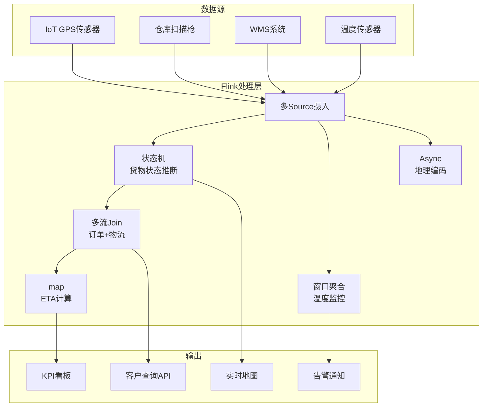
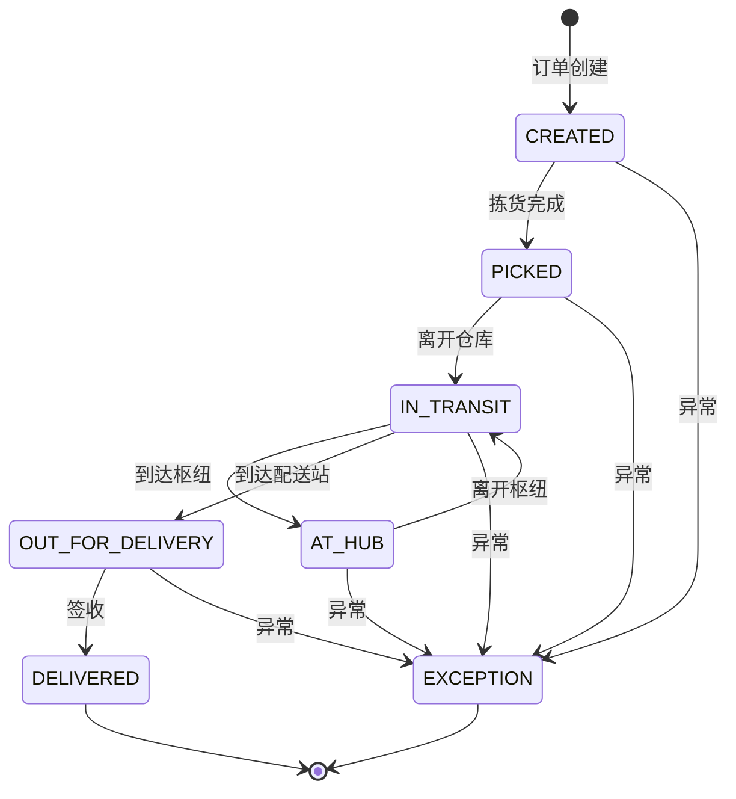

# 算子与实时供应链追踪

> **所属阶段**: Knowledge/10-case-studies | **前置依赖**: [01.08-multi-stream-operators.md](../01-concept-atlas/operator-deep-dive/01.08-multi-stream-operators.md), [operator-iot-stream-processing.md](../06-frontier/operator-iot-stream-processing.md) | **形式化等级**: L3
> **文档定位**: 流处理算子在实时供应链追踪与物流管理中的算子指纹与Pipeline设计
> **版本**: 2026.04

---

## 目录

- [算子与实时供应链追踪](#算子与实时供应链追踪)
  - [目录](#目录)
  - [1. 概念定义 (Definitions)](#1-概念定义-definitions)
    - [Def-SC-01-01: 实时供应链追踪（Real-time Supply Chain Tracking）](#def-sc-01-01-实时供应链追踪real-time-supply-chain-tracking)
    - [Def-SC-01-02: 货物状态机（Cargo State Machine）](#def-sc-01-02-货物状态机cargo-state-machine)
    - [Def-SC-01-03: 预计到达时间（Estimated Time of Arrival, ETA）](#def-sc-01-03-预计到达时间estimated-time-of-arrival-eta)
    - [Def-SC-01-04: 冷链监控（Cold Chain Monitoring）](#def-sc-01-04-冷链监控cold-chain-monitoring)
    - [Def-SC-01-05: 多式联运（Multi-modal Transport）](#def-sc-01-05-多式联运multi-modal-transport)
  - [2. 属性推导 (Properties)](#2-属性推导-properties)
    - [Lemma-SC-01-01: GPS更新频率与精度的权衡](#lemma-sc-01-01-gps更新频率与精度的权衡)
    - [Lemma-SC-01-02: 异常检测的窗口敏感性](#lemma-sc-01-02-异常检测的窗口敏感性)
    - [Prop-SC-01-01: 多流关联的关键约束](#prop-sc-01-01-多流关联的关键约束)
    - [Prop-SC-01-02: ETA预测误差的收敛性](#prop-sc-01-02-eta预测误差的收敛性)
  - [3. 关系建立 (Relations)](#3-关系建立-relations)
    - [3.1 供应链Pipeline算子映射](#31-供应链pipeline算子映射)
    - [3.2 算子指纹](#32-算子指纹)
    - [3.3 与其他行业案例的对比](#33-与其他行业案例的对比)
  - [4. 论证过程 (Argumentation)](#4-论证过程-argumentation)
    - [4.1 为什么供应链需要流处理而非传统WMS](#41-为什么供应链需要流处理而非传统wms)
    - [4.2 多式联运的事件关联挑战](#42-多式联运的事件关联挑战)
    - [4.3 冷链断链的检测与恢复](#43-冷链断链的检测与恢复)
  - [5. 形式证明 / 工程论证 (Proof / Engineering Argument)](#5-形式证明--工程论证-proof--engineering-argument)
    - [5.1 货物状态机的形式化定义](#51-货物状态机的形式化定义)
    - [5.2 温度异常的滑动窗口检测](#52-温度异常的滑动窗口检测)
    - [5.3 ETA预测的贝叶斯更新](#53-eta预测的贝叶斯更新)
  - [6. 实例验证 (Examples)](#6-实例验证-examples)
    - [6.1 实战：跨境物流追踪Pipeline](#61-实战跨境物流追踪pipeline)
    - [6.2 实战：智能仓储实时看板](#62-实战智能仓储实时看板)
  - [7. 可视化 (Visualizations)](#7-可视化-visualizations)
    - [供应链追踪Pipeline](#供应链追踪pipeline)
    - [货物状态机](#货物状态机)
  - [8. 引用参考 (References)](#8-引用参考-references)

---

## 1. 概念定义 (Definitions)

### Def-SC-01-01: 实时供应链追踪（Real-time Supply Chain Tracking）

实时供应链追踪是通过流处理技术对货物从生产到交付的全链路进行实时监控与异常预警的系统：

$$\text{Tracking} = (\text{IoT Sensors}, \text{GPS Data}, \text{WMS Events}) \xrightarrow{\text{Stream Processing}} (\text{Location}, \text{Status}, \text{ETA}, \text{Alerts})$$

### Def-SC-01-02: 货物状态机（Cargo State Machine）

货物在供应链中的生命周期可用状态机描述：

$$\text{States} = \{\text{CREATED}, \text{PICKED}, \text{IN_TRANSIT}, \text{AT_HUB}, \text{OUT_FOR_DELIVERY}, \text{DELIVERED}, \text{EXCEPTION}\}$$

状态转移由事件触发：扫描、GPS位置更新、温度异常等。

### Def-SC-01-03: 预计到达时间（Estimated Time of Arrival, ETA）

ETA是基于实时位置、历史路况和运输模式的动态预测：

$$\text{ETA}_t = t + \frac{D_{remaining}}{\bar{v}_{predicted}} + \mathcal{L}_{hub}$$

其中 $D_{remaining}$ 为剩余距离，$\bar{v}_{predicted}$ 为预测平均速度，$\mathcal{L}_{hub}$ 为枢纽处理延迟。

### Def-SC-01-04: 冷链监控（Cold Chain Monitoring）

冷链监控是对温敏货物（药品、生鲜）在运输过程中的温度连续性追踪：

$$\text{Compliance} = \forall t \in [t_{start}, t_{end}]: T_{min} \leq T(t) \leq T_{max}$$

任何温度越界事件必须立即告警并记录。

### Def-SC-01-05: 多式联运（Multi-modal Transport）

多式联运是货物通过多种运输方式（公路、铁路、海运、航空）联程运输：

$$\text{Journey} = (\text{Truck}_1, \text{Ship}_1, \text{Train}_1, \text{Truck}_2, ...)$$

每种运输方式产生独立的追踪事件流，需在流处理层进行关联。

---

## 2. 属性推导 (Properties)

### Lemma-SC-01-01: GPS更新频率与精度的权衡

GPS更新频率 $f$ 与定位精度 $\sigma$ 满足：

$$\sigma \propto \frac{1}{\sqrt{f}}$$

但更高的频率意味着更多的数据传输和处理开销。

**推荐**: 运输中每30秒-1分钟更新一次；静止时每5分钟更新一次（Geofencing触发）。

### Lemma-SC-01-02: 异常检测的窗口敏感性

异常检测（如温度越界）的检测延迟与窗口大小 $W$ 的关系：

$$\mathcal{L}_{detect} \leq W$$

**推论**: 使用滑动窗口（Sliding Window）而非滚动窗口（Tumbling Window）可降低检测延迟。

### Prop-SC-01-01: 多流关联的关键约束

在供应链中，订单流、库存流、物流流需要关联：

- **订单流**: 稀疏（每秒数条）
- **库存流**: 中等（每秒数十条）
- **物流流**: 密集（每秒数千条GPS点）

**关联策略**: 以订单流为驱动，用物流流 enrich 订单状态，避免以密集流为左表驱动Join。

### Prop-SC-01-02: ETA预测误差的收敛性

随着货物接近目的地，ETA预测误差 $\epsilon$ 单调递减：

$$\frac{d\epsilon}{dD_{remaining}} > 0$$

**工程意义**: 在最后一公里可给出精确到分钟的ETA；在长途运输中ETA误差可能达数小时。

---

## 3. 关系建立 (Relations)

### 3.1 供应链Pipeline算子映射

| 处理阶段 | 算子 | 输入 | 输出 | 状态 |
|---------|------|------|------|------|
| **GPS摄入** | Source | IoT设备MQTT | GPS坐标流 | 无 |
| **地理编码** | AsyncFunction | GPS坐标 | 地址/区域 | 无 |
| **状态推断** | ProcessFunction | GPS+扫描事件 | 货物状态 | ValueState（当前状态） |
| **多流关联** | intervalJoin | 订单流+物流流 |  enriched订单 | 双路状态 |
| **ETA计算** | map | 位置+路况 | ETA时间戳 | 无（纯计算） |
| **异常检测** | window+aggregate | 温度/湿度 | 告警事件 | 窗口状态 |
| **聚合看板** | window+aggregate | 全链路事件 | KPI指标 | 窗口状态 |

### 3.2 算子指纹

| 维度 | 供应链追踪特征 |
|------|---------------|
| **核心算子** | ProcessFunction（状态机）、intervalJoin（多流关联）、AsyncFunction（地理编码） |
| **状态类型** | ValueState（货物状态机）、MapState（车辆位置缓存）、WindowState（温度统计） |
| **时间语义** | 事件时间为主（GPS时间戳），允许乱序 |
| **数据特征** | 多流异构（GPS高频+订单低频+扫描事件触发） |
| **状态热点** | 车辆位置MapState（按车辆ID keyBy，千级key） |
| **性能瓶颈** | 地理编码API调用（异步化）、多流Join状态增长 |

### 3.3 与其他行业案例的对比

| 维度 | 电商推荐 | 金融风控 | RTB广告 | 供应链追踪 |
|------|---------|---------|---------|-----------|
| **延迟要求** | 秒级 | <50ms | <100ms | 分钟级 |
| **数据量** | 大 | 中 | 极大 | 中 |
| **状态复杂度** | 高 | 中 | 中 | 高（状态机） |
| **多流关联** | 少 | 中 | 中 | 多（3+流） |
| **时间语义** | 事件时间 | 处理时间 | 处理时间 | 事件时间 |

---

## 4. 论证过程 (Argumentation)

### 4.1 为什么供应链需要流处理而非传统WMS

传统仓库管理系统（WMS）的问题：

- 批处理：每4小时同步一次状态
- 盲区：货物在途期间无实时可见性
- 被动：异常发生后数小时才能发现

流处理的优势：

- 实时：GPS每30秒更新位置
- 主动：温度越界立即告警
- 预测：ETA动态更新，提前预警延迟

### 4.2 多式联运的事件关联挑战

**挑战**: 同一批货物从卡车转海运再转火车，每种运输方式使用不同的追踪系统。

**方案**:

1. 在换装枢纽（Hub）扫描货物，生成"交接事件"
2. 交接事件作为关联键，连接不同运输段的事件流
3. 使用IntervalJoin按货物ID和交接时间窗口关联

### 4.3 冷链断链的检测与恢复

**断链**: 冷藏车故障导致温度上升，药品可能变质。

**检测**:

- 温度传感器每10秒上报
- 滑动窗口（1分钟）计算平均温度
- 若连续3个窗口超阈值，触发一级告警
- 若连续10个窗口超阈值，触发二级告警（货物报废评估）

**恢复**:

- 自动调度最近的备用冷藏车
- 通知收货方调整接收计划
- 保险系统自动启动理赔流程

---

## 5. 形式证明 / 工程论证 (Proof / Engineering Argument)

### 5.1 货物状态机的形式化定义

```
StateMachine = (S, E, δ, s0, F)
S = {CREATED, PICKED, IN_TRANSIT, AT_HUB, OUT_FOR_DELIVERY, DELIVERED, EXCEPTION}
E = {pick, scan, gps_update, arrive_hub, depart_hub, deliver, exception}
δ: S × E → S

δ(CREATED, pick) = PICKED
δ(PICKED, gps_update) = IN_TRANSIT
δ(IN_TRANSIT, arrive_hub) = AT_HUB
δ(AT_HUB, depart_hub) = IN_TRANSIT
δ(IN_TRANSIT, deliver) = DELIVERED
δ(s, exception) = EXCEPTION  for all s
```

**Flink实现**:

```java
public class CargoStateMachine extends KeyedProcessFunction<String, TrackingEvent, CargoStatus> {
    private ValueState<CargoState> state;

    @Override
    public void processElement(TrackingEvent event, Context ctx, Collector<CargoStatus> out) {
        CargoState current = state.value();
        if (current == null) current = CargoState.CREATED;

        CargoState next = transition(current, event.getType());
        state.update(next);

        out.collect(new CargoStatus(event.getCargoId(), next, ctx.timestamp()));
    }

    private CargoState transition(CargoState current, EventType event) {
        switch (current) {
            case CREATED: return event == PICK ? PICKED : current;
            case PICKED: return event == GPS_UPDATE ? IN_TRANSIT : current;
            case IN_TRANSIT:
                if (event == ARRIVE_HUB) return AT_HUB;
                if (event == DELIVER) return DELIVERED;
                return current;
            case AT_HUB: return event == DEPART_HUB ? IN_TRANSIT : current;
            default: return current;
        }
    }
}
```

### 5.2 温度异常的滑动窗口检测

```java
stream.keyBy(SensorReading::getCargoId)
    .window(SlidingEventTimeWindows.of(Time.minutes(1), Time.seconds(10)))
    .aggregate(new TemperatureMonitorAggregate())
    .process(new AlertFunction());

public class TemperatureMonitorAggregate implements AggregateFunction<SensorReading, TempAccumulator, TempStats> {
    @Override
    public TempAccumulator createAccumulator() { return new TempAccumulator(); }

    @Override
    public TempAccumulator add(SensorReading reading, TempAccumulator acc) {
        acc.count++;
        acc.sum += reading.getTemperature();
        acc.min = Math.min(acc.min, reading.getTemperature());
        acc.max = Math.max(acc.max, reading.getTemperature());
        return acc;
    }

    @Override
    public TempStats getResult(TempAccumulator acc) {
        return new TempStats(acc.min, acc.max, acc.sum / acc.count);
    }
}
```

### 5.3 ETA预测的贝叶斯更新

**模型**: 基于历史路段速度的先验分布，结合实时GPS数据更新：

$$P(v | data) \propto P(data | v) \cdot P(v)$$

其中 $P(v)$ 为历史速度分布，$P(data | v)$ 为当前观测的似然。

**实现**: 使用Flink的ProcessFunction维护每个路段的速度分布状态，实时更新并预测ETA。

---

## 6. 实例验证 (Examples)

### 6.1 实战：跨境物流追踪Pipeline

**场景**: 一批货物从中国工厂经海运到美国仓库，涉及卡车-海运-卡车三段运输。

```java
// 1. 多源摄入（GPS + 扫描 + WMS）
DataStream<GPSEvent> gpsStream = env.addSource(new MQTTSource("gps/+/+"));
DataStream<ScanEvent> scanStream = env.addSource(new KafkaSource<>("scan-events"));
DataStream<WMSEvent> wmsStream = env.addSource(new KafkaSource<>("wms-events"));

// 2. 状态机处理
gpsStream.keyBy(GPSEvent::getCargoId)
    .process(new CargoStateMachine())
    .addSink(new StatusUpdateSink());

// 3. 温度监控（冷链）
gpsStream.filter(e -> e.getSensorType().equals("TEMPERATURE"))
    .keyBy(GPSEvent::getCargoId)
    .window(SlidingEventTimeWindows.of(Time.minutes(5), Time.minutes(1)))
    .aggregate(new TemperatureMonitorAggregate())
    .filter(stats -> stats.getMaxTemp() > 8.0)  // 冷链上限8°C
    .addSink(new ColdChainAlertSink());

// 4. 多流关联：订单+物流
DataStream<EnrichedOrder> enrichedOrders = orderStream
    .keyBy(Order::getCargoId)
    .intervalJoin(gpsStream.keyBy(GPSEvent::getCargoId))
    .between(Time.hours(-24), Time.hours(0))
    .process(new OrderLogisticsJoin());

// 5. ETA计算
enrichedOrders
    .map(new ETACalculator())
    .addSink(new ETANotificationSink());
```

### 6.2 实战：智能仓储实时看板

**场景**: 仓库内数百台AGV（自动导引车）实时位置追踪与调度优化。

```java
// AGV位置流
DataStream<AGVPosition> agvStream = env.addSource(new MQTTSource("warehouse/agv/+/position"));

// 实时热力图（每10秒聚合）
agvStream.keyBy(pos -> pos.getZone())
    .window(TumblingProcessingTimeWindows.of(Time.seconds(10)))
    .aggregate(new ZoneDensityAggregate())
    .addSink(new HeatmapSink());

// 碰撞预警（同一区域多AGV距离过近）
agvStream.keyBy(AGVPosition::getZone)
    .window(TumblingProcessingTimeWindows.of(Time.seconds(5)))
    .process(new CollisionDetectionFunction())
    .filter(alert -> alert.getMinDistance() < 1.5)  // 1.5米内告警
    .addSink(new CollisionAlertSink());
```

---

## 7. 可视化 (Visualizations)

### 供应链追踪Pipeline



### 货物状态机



---

## 8. 引用参考 (References)


---

*关联文档*: [01.08-multi-stream-operators.md](../01-concept-atlas/operator-deep-dive/01.08-multi-stream-operators.md) | [operator-iot-stream-processing.md](../06-frontier/operator-iot-stream-processing.md) | [operator-edge-computing-integration.md](../06-frontier/operator-edge-computing-integration.md)
