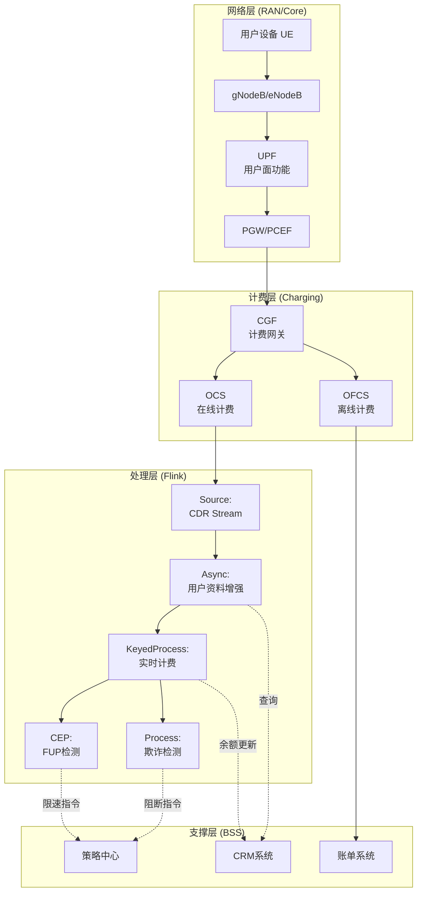
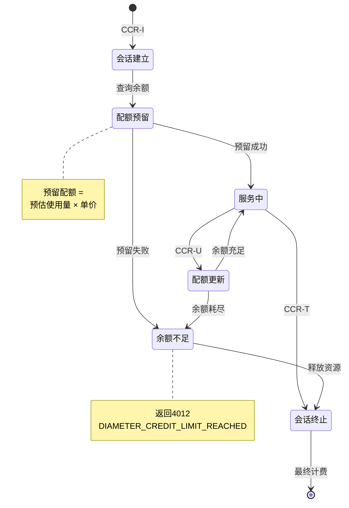
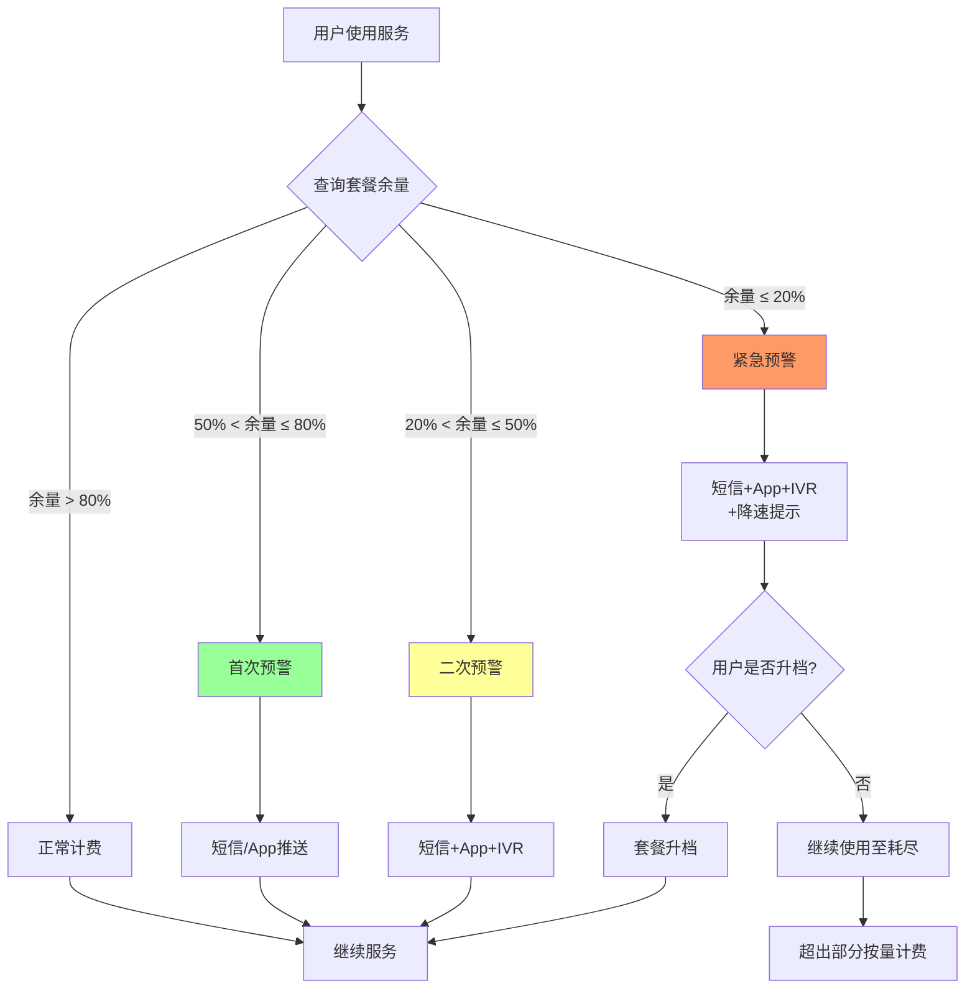

# 实时电信网络计费与流量管理案例研究

> 所属阶段: Knowledge/ Flink/ | 前置依赖: [算子全景分类](../01-concept-atlas/operator-deep-dive/01.06-single-input-operators.md) | [窗口算子](../01-concept-atlas/operator-deep-dive/01.09-window-operators.md) | 形式化等级: L4

## 1. 概念定义 (Definitions)

### Def-TEL-01-01: 电信实时计费系统 (Telecom Real-time Charging System, OCS)

电信实时计费系统是对用户通话、短信、数据流量等网络使用事件进行在线计费、余额控制、套餐管理的业务支撑系统，需满足3GPP定义的在线计费接口规范。

$$\mathcal{O} = (E, U, P, R, F)$$

其中 $E$ 为网络使用事件流（CDR/UDR），$U$ 为用户账户状态流，$P$ 为计费策略流，$R$ 为费率规则流，$F$ 为流计算处理拓扑。

### Def-TEL-01-02: 计费事件记录 (Charging Data Record, CDR)

CDR是记录一次网络使用事件的详细信息的数据结构：

$$CDR = (userId, sessionId, serviceType, startTime, duration, 
         volumeUp, volumeDown, cellId, roaming, tariffPlan)$$

关键字段：
- **serviceType**: VOICE / SMS / DATA / VAS
- **duration**: 通话时长（秒）或数据会话时长
- **volumeUp/Down**: 上行/下行数据流量（字节）
- **roaming**: 是否漫游（国内/国际）
- **tariffPlan**: 用户签约的计费套餐

### Def-TEL-01-03: 余额控制单元 (Credit Control Unit)

余额控制单元是OCS的核心组件，负责在用户会话进行过程中实时扣减余额并判断是否允许继续服务：

$$Balance_{new} = Balance_{current} - Charge_{unit} \cdot N_{units}$$

服务继续条件：$Balance_{new} \geq Reserve_{min}$，其中 $Reserve_{min}$ 为最低预留余额（通常为0或套餐最低消费）。

### Def-TEL-01-04: 流量公平使用策略 (Fair Usage Policy, FUP)

FUP是运营商对"不限量"套餐设置的隐性限速机制，当用户月度流量超过阈值后降低优先级：

$$Throttle(user, t) = \begin{cases} 
0 & \text{if } Data_{monthly}(user, t) < FUP_{threshold} \\
1 - \frac{FUP_{threshold}}{Data_{monthly}(user, t)} & \text{otherwise}
\end{cases}$$

限速后带宽：$Bandwidth_{actual} = Bandwidth_{max} \cdot (1 - Throttle)$

### Def-TEL-01-05: 漫游欺诈检测窗口 (Roaming Fraud Detection Window)

漫游欺诈检测窗口定义为识别异常漫游行为的时序分析区间：

$$FraudWindow(user) = \{CDR_i \mid Location(CDR_i) \neq HomeCountry, \Delta t(CDR_i, CDR_{i-1}) < T_{impossible}\}$$

其中 $T_{impossible}$ 为物理上不可能的移动时间（如1小时内从东京到纽约）。

## 2. 属性推导 (Properties)

### Lemma-TEL-01-01: CDR处理吞吐量的下界

在峰值话务量 $Erlang$ 为 $A$ 且平均通话时长为 $h$ 秒的条件下，CDR生成率的下界为：

$$\lambda_{CDR} \geq \frac{A}{h} \cdot N_{subscribers}$$

**证明**: Erlang公式中，$A = \lambda \cdot h$，故 $\lambda = A/h$。每用户话务量 $A$ 通常在0.02-0.05 Erlang（忙时）。千万级用户的运营商 $\lambda_{CDR} \geq 10^7 \cdot 0.03 / 120 = 2,500$ CDR/秒。加上短信、数据事件，总事件率可达10,000+/秒。

### Lemma-TEL-01-02: 余额扣减的并发一致性

在分布式OCS架构中，若采用Redis原子操作保证余额扣减的一致性，则并发扣减不会导致余额为负：

$$Balance_{final} = max(Balance_{initial} - \sum_{i} Charge_i, 0)$$

**条件**: Redis `DECRBY` 或 Lua脚本实现原子扣减，避免Read-Modify-Write竞态条件。

### Prop-TEL-01-01: 套餐共享池的最优分配

在家庭/企业共享套餐中，若成员 $i$ 的边际效用 $MU_i(d)$ 递减，则最优流量分配满足：

$$MU_1(d_1) = MU_2(d_2) = \cdots = MU_n(d_n)$$

**论证**: 由帕累托最优条件，当所有成员的边际效用相等时，总效用最大化。工程实现上，通过实时监控各成员使用速率，动态调整限速策略。

### Prop-TEL-01-02: 国际漫游欺诈的检测完备性

基于不可能移动的欺诈检测策略的漏检率下界：

$$P_{miss} \geq \frac{v_{max} \cdot \Delta t_{CDR}}{D_{earth}}$$

其中 $v_{max}$ 为最大商业航班速度（~900 km/h），$\Delta t_{CDR}$ 为CDR生成间隔，$D_{earth}$ 为地球周长。

**论证**: 若欺诈者在 $\Delta t_{CDR}$ 内的实际移动距离小于 $v_{max} \cdot \Delta t_{CDR}$，则不可能移动检测无法区分合法与欺诈行为。

## 3. 关系建立 (Relations)

### 与算子体系的映射

| 电信计费场景 | Flink算子 | 算子作用 |
|------------|-----------|---------|
| CDR接入 | `SourceFunction` | 从计费网关实时接入CDR |
| 用户状态查询 | `AsyncFunction` | 查询CRM/余额系统 |
| 实时计费 | `KeyedProcessFunction` | 按用户键控，实时扣减余额 |
| 套餐余量聚合 | `WindowAggregate` | 滑动窗口内聚合月度使用量 |
| FUP限速触发 | `CEPPattern` | 流量阈值突破模式匹配 |
| 欺诈检测 | `IntervalJoin` | CDR位置Join检测不可能移动 |
| 账单生成 | `WindowAggregate` + `Sink` | 日/月窗口聚合生成账单 |

### 与3GPP标准的关联

- **OCS (Online Charging System)**: 3GPP TS 32.296, 实时计费接口
- **PCRF (Policy and Charging Rules Function)**: 3GPP TS 29.212, 策略与计费规则
- **Gy Interface**: OCS与PGW之间的Diameter接口
- **Sy Interface**: PCRF与OCS之间的接口
- **Ro Interface**: IMS与OCS之间的接口

## 4. 论证过程 (Argumentation)

### 4.1 电信实时计费的核心挑战

**挑战1: 极端吞吐量**
大型运营商（亿级用户）忙时事件率可达100,000+ EPS（Events Per Second），CDR需毫秒级处理完成，否则影响用户服务体验。

**挑战2: 一致性要求**
余额扣减必须保证Exactly-Once，否则可能出现重复扣费（用户投诉）或漏扣（运营商损失）。

**挑战3: 复杂计费规则**
套餐类型多样（流量包/语音包/融合套餐/家庭共享/企业专线），叠加促销活动、闲时优惠、定向免流等，计费逻辑复杂度指数级增长。

**挑战4: 欺诈实时检测**
国际漫游欺诈、SIM卡克隆、伪基站短信等需秒级检测并阻断，延迟过长则损失扩大。

### 4.2 方案选型论证

**为什么选用Flink而非传统计费引擎？**
- 传统计费引擎（如Oracle BRM）为分钟级延迟，无法满足实时余额控制需求
- Flink支持复杂事件处理（FUP触发、欺诈检测），传统引擎缺乏此能力
- Flink的Checkpoint机制保证计费事件Exactly-Once处理

**为什么选用滑动窗口做套餐余量聚合？**
- 套餐周期通常为自然月，滚动窗口在月首/月末产生边界问题
- 滑动窗口提供平滑的使用量曲线，支持实时余量预警
- 窗口重叠保证事件不会被遗漏在边界处

## 5. 形式证明 / 工程论证 (Proof / Engineering Argument)

### Thm-TEL-01-01: 在线计费系统的响应时间定理

在线计费系统满足3GPP Gy接口要求的响应时间约束：

**定理**: 若OCS系统满足以下条件，则CCRs（Credit Control Requests）的P99响应时间 $< 100$ms：

1. **事件处理时延**: $T_{process} < 10$ms（Flink处理 + 计费规则匹配）
2. **状态访问时延**: $T_{state} < 50$ms（Redis/Memcached余额查询+更新）
3. **网络传输时延**: $T_{network} < 30$ms（PGW到OCS的RTT）
4. **序列化时延**: $T_{serialize} < 10$ms（Diameter编解码）

**证明**: 由时延可加性：

$$T_{total} = T_{process} + T_{state} + T_{network} + T_{serialize}$$

代入各上界：$T_{total} < 10 + 50 + 30 + 10 = 100$ms。

**工程实现**:
- $T_{process}$: Flink本地处理，无需网络I/O
- $T_{state}$: Redis Cluster，P99 < 10ms；跨区域部署时P99 < 50ms
- $T_{network}$: OCS与PGW同机房部署，RTT < 1ms；跨城容灾时RTT < 30ms
- $T_{serialize}$: 使用Protocol Buffers替代XML，序列化效率提升10x

## 6. 实例验证 (Examples)

### 6.1 CDR实时计费Pipeline

```java
// Real-time CDR processing and online charging
StreamExecutionEnvironment env = StreamExecutionEnvironment.getExecutionEnvironment();
env.enableCheckpointing(5000, CheckpointingMode.EXACTLY_ONCE);

// CDR ingestion from charging gateway
DataStream<CDR> cdrStream = env
    .addSource(new KafkaSource<>("billing.cdr.raw"))
    .map(new CDRParser())
    .assignTimestampsAndWatermarks(
        WatermarkStrategy.<CDR>forBoundedOutOfOrderness(
            Duration.ofSeconds(10))
        .withTimestampAssigner((cdr, ts) -> cdr.getStartTime())
    );

// Enrich with user profile and tariff plan
DataStream<EnrichedCDR> enrichedCDRs = AsyncDataStream
    .unorderedWait(
        cdrStream,
        new UserProfileEnrichmentFunction(),
        200, TimeUnit.MILLISECONDS, 100
    );

// Real-time charging calculation
DataStream<ChargeRecord> charges = enrichedCDRs
    .keyBy(cdr -> cdr.getUserId())
    .process(new ChargingFunction() {
        private ValueState<AccountBalance> balanceState;
        private ValueState<MonthlyUsage> usageState;
        
        @Override
        public void open(Configuration parameters) {
            balanceState = getRuntimeContext().getState(
                new ValueStateDescriptor<>("balance", AccountBalance.class));
            usageState = getRuntimeContext().getState(
                new ValueStateDescriptor<>("usage", MonthlyUsage.class));
        }
        
        @Override
        public void processElement(EnrichedCDR cdr, Context ctx,
                                   Collector<ChargeRecord> out) throws Exception {
            AccountBalance balance = balanceState.value();
            MonthlyUsage usage = usageState.value();
            if (balance == null) balance = new AccountBalance(cdr.getUserId());
            if (usage == null) usage = new MonthlyUsage(cdr.getUserId());
            
            // Calculate charge based on tariff plan
            double charge = calculateCharge(cdr, usage);
            
            // Check balance sufficiency
            if (balance.getAvailable() >= charge) {
                // Deduct balance
                balance.deduct(charge);
                usage.addUsage(cdr.getServiceType(), cdr.getVolume());
                
                balanceState.update(balance);
                usageState.update(usage);
                
                out.collect(new ChargeRecord(
                    cdr.getUserId(), cdr.getSessionId(), charge,
                    balance.getAvailable(), "SUCCESS", ctx.timestamp()
                ));
            } else {
                // Insufficient balance
                out.collect(new ChargeRecord(
                    cdr.getUserId(), cdr.getSessionId(), charge,
                    balance.getAvailable(), "INSUFFICIENT_BALANCE", ctx.timestamp()
                ));
                
                // Trigger top-up notification
                ctx.output(topUpTag, new TopUpNotification(
                    cdr.getUserId(), balance.getAvailable(), charge
                ));
            }
        }
        
        private double calculateCharge(EnrichedCDR cdr, MonthlyUsage usage) {
            TariffPlan plan = cdr.getTariffPlan();
            double charge = 0;
            
            switch (cdr.getServiceType()) {
                case VOICE:
                    long includedMinutes = plan.getIncludedMinutes();
                    long usedMinutes = usage.getVoiceSeconds() / 60;
                    long chargeableMinutes = Math.max(0, 
                        cdr.getDuration() / 60 + usedMinutes - includedMinutes);
                    charge = chargeableMinutes * plan.getVoiceRate();
                    break;
                    
                case DATA:
                    long includedBytes = plan.getIncludedData();
                    long usedBytes = usage.getDataBytes();
                    long chargeableBytes = Math.max(0,
                        cdr.getVolumeUp() + cdr.getVolumeDown() 
                        + usedBytes - includedBytes);
                    charge = chargeableBytes * plan.getDataRate() / (1024 * 1024 * 1024);
                    break;
                    
                case SMS:
                    charge = plan.getSmsRate();
                    break;
            }
            
            // Apply roaming multiplier
            if (cdr.isRoaming()) {
                charge *= cdr.getRoamingMultiplier();
            }
            
            return Math.round(charge * 100.0) / 100.0;
        }
    });

charges.addSink(new KafkaSink<>("billing.charges"));
```

### 6.2 FUP限速触发检测

```java
// Fair Usage Policy (FUP) throttling detection
Pattern<DataUsage, ?> fupPattern = Pattern
    .<DataUsage>begin("high-usage")
    .where(new SimpleCondition<DataUsage>() {
        @Override
        public boolean filter(DataUsage usage) {
            return usage.getMonthlyTotal() > 0.8 * usage.getFupThreshold();
        }
    })
    .next("threshold-crossed")
    .where(new SimpleCondition<DataUsage>() {
        @Override
        public boolean filter(DataUsage usage) {
            return usage.getMonthlyTotal() >= usage.getFupThreshold();
        }
    })
    .within(Time.hours(24));

PatternStream<DataUsage> fupPatternStream = CEP.pattern(
    usageStream.keyBy(u -> u.getUserId()),
    fupPattern
);

DataStream<FupTrigger> fupTriggers = fupPatternStream
    .process(new PatternHandler<DataUsage, FupTrigger>() {
        @Override
        public void processMatch(Map<String, List<DataUsage>> match,
                                Context ctx, Collector<FupTrigger> out) {
            DataUsage thresholdEvent = match.get("threshold-crossed").get(0);
            out.collect(new FupTrigger(
                thresholdEvent.getUserId(),
                thresholdEvent.getMonthlyTotal(),
                thresholdEvent.getFupThreshold(),
                System.currentTimeMillis()
            ));
        }
    });

fupTriggers.addSink(new PolicyEnforcementSink());
```

### 6.3 漫游欺诈实时检测

```java
// Real-time roaming fraud detection
DataStream<CDR> roamingCDRs = cdrStream
    .filter(cdr -> cdr.isRoaming());

// Detect impossible travel
DataStream<FraudAlert> fraudAlerts = roamingCDRs
    .keyBy(cdr -> cdr.getUserId())
    .process(new FraudDetectionFunction() {
        private ValueState<CDR> lastCdrState;
        private static final double MAX_SPEED = 900; // km/h (commercial flight)
        
        @Override
        public void open(Configuration parameters) {
            lastCdrState = getRuntimeContext().getState(
                new ValueStateDescriptor<>("last-cdr", CDR.class));
        }
        
        @Override
        public void processElement(CDR cdr, Context ctx,
                                   Collector<FraudAlert> out) throws Exception {
            CDR lastCdr = lastCdrState.value();
            
            if (lastCdr != null) {
                double distance = calculateDistance(
                    lastCdr.getLatitude(), lastCdr.getLongitude(),
                    cdr.getLatitude(), cdr.getLongitude()
                );
                double timeDiff = (cdr.getStartTime() - lastCdr.getStartTime()) / 3600000.0; // hours
                double speed = timeDiff > 0 ? distance / timeDiff : 0;
                
                if (speed > MAX_SPEED) {
                    out.collect(new FraudAlert(
                        cdr.getUserId(), "IMPOSSIBLE_TRAVEL",
                        String.format("Speed: %.0f km/h (%.0f km in %.1f h)",
                            speed, distance, timeDiff),
                        cdr.getStartTime()
                    ));
                }
            }
            
            lastCdrState.update(cdr);
        }
        
        private double calculateDistance(double lat1, double lon1, 
                                         double lat2, double lon2) {
            // Haversine formula
            double R = 6371; // Earth radius in km
            double dLat = Math.toRadians(lat2 - lat1);
            double dLon = Math.toRadians(lon2 - lon1);
            double a = Math.sin(dLat/2) * Math.sin(dLat/2) +
                       Math.cos(Math.toRadians(lat1)) * Math.cos(Math.toRadians(lat2)) *
                       Math.sin(dLon/2) * Math.sin(dLon/2);
            return R * 2 * Math.atan2(Math.sqrt(a), Math.sqrt(1-a));
        }
    });

fraudAlerts.addSink(new FraudManagementSink());
```

## 7. 可视化 (Visualizations)

### 图1: 电信实时计费系统架构



### 图2: 余额控制状态机



### 图3: 套餐余量预警流程



## 8. 引用参考 (References)

[^1]: 3GPP TS 32.296, "Telecommunication management; Online Charging System (OCS) applications and interfaces", v17.0.0, 2022.
[^2]: 3GPP TS 29.212, "Policy and Charging Control over Gx/Sd reference point", v17.0.0, 2022.
[^3]: IETF RFC 6733, "Diameter Base Protocol", 2012.
[^4]: TM Forum, "GB922: Product and Service Model", Release 20.0, 2023.
[^5]: Apache Flink Documentation, "Async I/O for External Data Access", 2025. https://nightlies.apache.org/flink/flink-docs-stable/docs/dev/datastream/operators/asyncio/
[^6]: C. Coutinho et al., "Real-time Fraud Detection in Telecommunications Using Stream Processing", IEEE BigData, 2021.
