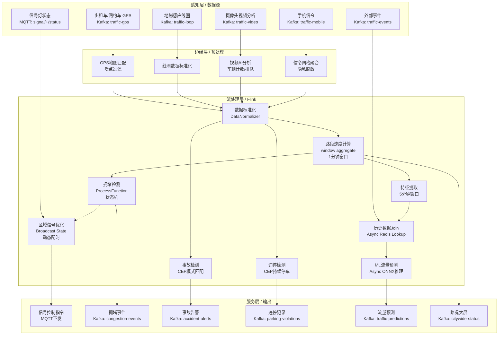
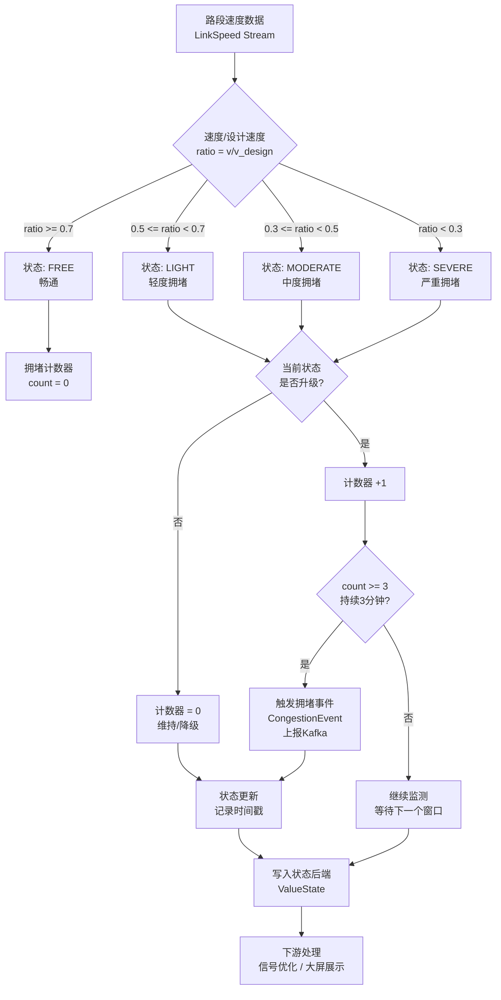
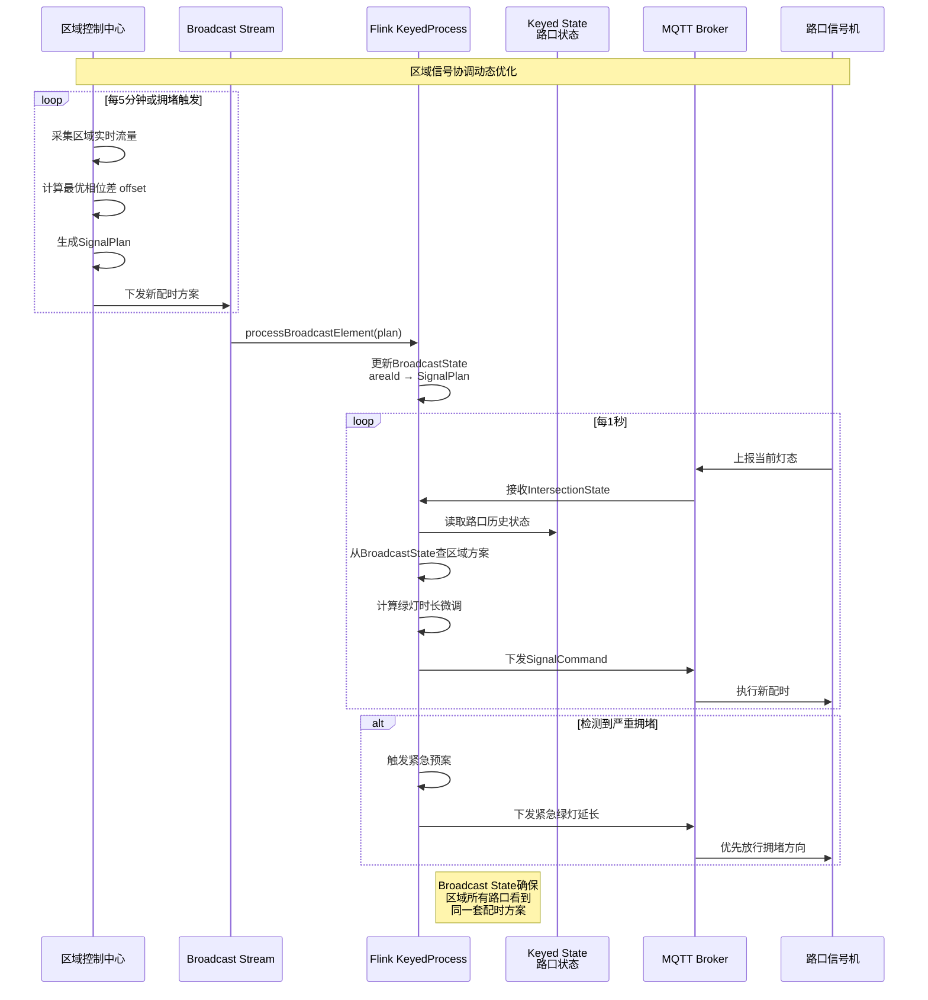

# 流处理算子与实时交通流量管理

> **所属阶段**: Knowledge/10-case-studies | **前置依赖**: [operator-iot-stream-processing.md](../06-frontier/operator-iot-stream-processing.md), [operator-cep-complex-event-processing.md](../03-api/operator-cep-complex-event-processing.md) | **形式化等级**: L3
> **文档定位**: 流处理算子在智能交通系统（ITS）中的实时交通流量监控、拥堵检测、信号优化与事件检测
> **版本**: 2026.04

---

## 目录

- [流处理算子与实时交通流量管理](#流处理算子与实时交通流量管理)
  - [目录](#目录)
  - [1. 概念定义 (Definitions)](#1-概念定义-definitions)
    - [Def-TRF-01-01: 智能交通数据流（ITS Data Stream）](#def-trf-01-01-智能交通数据流its-data-stream)
    - [Def-TRF-01-02: 路段平均速度（Link Average Speed）](#def-trf-01-02-路段平均速度link-average-speed)
    - [Def-TRF-01-03: 交通拥堵状态（Traffic Congestion State）](#def-trf-01-03-交通拥堵状态traffic-congestion-state)
    - [Def-TRF-01-04: 区域信号配时（Area Signal Timing）](#def-trf-01-04-区域信号配时area-signal-timing)
    - [Def-TRF-01-05: 交通异常事件（Traffic Anomaly Event）](#def-trf-01-05-交通异常事件traffic-anomaly-event)
    - [Def-TRF-01-06: 短时交通流量预测（Short-term Traffic Flow Prediction）](#def-trf-01-06-短时交通流量预测short-term-traffic-flow-prediction)
  - [2. 属性推导 (Properties)](#2-属性推导-properties)
    - [Lemma-TRF-01-01: 浮动车数据的路段速度估计收敛性](#lemma-trf-01-01-浮动车数据的路段速度估计收敛性)
    - [Lemma-TRF-01-02: 拥堵检测的时延下界](#lemma-trf-01-02-拥堵检测的时延下界)
    - [Prop-TRF-01-01: 多源数据融合的速度估计方差缩减](#prop-trf-01-01-多源数据融合的速度估计方差缩减)
    - [Prop-TRF-01-02: 信号协调的绿波带宽最大化](#prop-trf-01-02-信号协调的绿波带宽最大化)
  - [3. 关系建立 (Relations)](#3-关系建立-relations)
    - [3.1 交通监控Pipeline算子映射](#31-交通监控pipeline算子映射)
    - [3.2 多源数据与Flink Source算子对应关系](#32-多源数据与flink-source算子对应关系)
    - [3.3 算子指纹](#33-算子指纹)
  - [4. 论证过程 (Argumentation)](#4-论证过程-argumentation)
    - [4.1 多源异构交通数据融合的挑战](#41-多源异构交通数据融合的挑战)
    - [4.2 实时性要求与Watermark策略](#42-实时性要求与watermark策略)
    - [4.3 预测模型的实时更新机制](#43-预测模型的实时更新机制)
  - [5. 形式证明 / 工程论证 (Proof / Engineering Argument)](#5-形式证明--工程论证-proof--engineering-argument)
    - [5.1 路段速度计算（Window Aggregate）](#51-路段速度计算window-aggregate)
    - [5.2 拥堵检测（ProcessFunction）](#52-拥堵检测processfunction)
    - [5.3 信号优化（Broadcast State）](#53-信号优化broadcast-state)
    - [5.4 事件检测（CEP）](#54-事件检测cep)
    - [5.5 短时流量预测（实时+历史数据融合）](#55-短时流量预测实时历史数据融合)
  - [6. 实例验证 (Examples)](#6-实例验证-examples)
    - [6.1 完整交通监控Pipeline](#61-完整交通监控pipeline)
  - [7. 可视化 (Visualizations)](#7-可视化-visualizations)
    - [城市交通实时处理Pipeline架构](#城市交通实时处理pipeline架构)
    - [拥堵检测流程图](#拥堵检测流程图)
    - [区域信号协调优化流程](#区域信号协调优化流程)
  - [8. 引用参考 (References)](#8-引用参考-references)

---

## 1. 概念定义 (Definitions)

### Def-TRF-01-01: 智能交通数据流（ITS Data Stream）

智能交通数据流是城市道路交通系统中多源异构传感器产生的时空数据序列：

$$\text{TrafficStream} = \{S_{GPS}, S_{loop}, S_{video}, S_{mobile}, S_{signal}\}$$

其中：

- $S_{GPS}$: 浮动车GPS轨迹数据（出租车/网约车/公交车/货运车），频率 1-30秒/点，字段 `(vehicleId, timestamp, longitude, latitude, speed, heading)`
- $S_{loop}$: 地磁感应线圈检测数据，频率 1-5分钟/次，字段 `(loopId, roadId, timestamp, volume, occupancy, avgSpeed)`
- $S_{video}$: 摄像头视频分析数据，频率 1-30秒/帧，字段 `(cameraId, roadId, timestamp, vehicleCount, vehicleTypes, queueLength)`
- $S_{mobile}$: 手机信令数据，频率 事件触发，字段 `(cellId, timestamp, userCount, movementVector)`
- $S_{signal}$: 信号灯状态反馈，频率 1秒/次，字段 `(intersectionId, phase, greenTime, redTime, currentStatus)`

### Def-TRF-01-02: 路段平均速度（Link Average Speed）

路段平均速度是特定时间窗口内某道路区段上车辆速度的加权平均值：

$$\bar{v}_{link}(t, W) = \frac{\sum_{i \in \mathcal{V}_{link}(t, W)} w_i \cdot v_i}{\sum_{i \in \mathcal{V}_{link}(t, W)} w_i}$$

其中：

- $\mathcal{V}_{link}(t, W)$: 时间窗口 $[t-W, t]$ 内经过该路段的车辆集合
- $v_i$: 车辆 $i$ 的速度观测值
- $w_i$: 数据源的置信权重（GPS: 0.9, 地磁线圈: 1.0, 视频分析: 0.85, 手机信令: 0.6）

**直观解释**: 通过融合多源数据，得到比单一数据源更稳定、更可靠的路段速度估计。

### Def-TRF-01-03: 交通拥堵状态（Traffic Congestion State）

交通拥堵状态是路段速度低于设计速度一定比例且持续时间超过阈值的状态：

$$\text{CongestionState}_{link}(t) = \begin{cases} \text{FREE} & \bar{v} \geq 0.7 v_{design} \\ \text{LIGHT} & 0.5 v_{design} \leq \bar{v} < 0.7 v_{design} \\ \text{MODERATE} & 0.3 v_{design} \leq \bar{v} < 0.5 v_{design} \\ \text{SEVERE} & \bar{v} < 0.3 v_{design} \end{cases}$$

拥堵检测条件：

- 速度阈值：$\bar{v}_{link} < v_{threshold}$（通常取 $0.5 \cdot v_{design}$）
- 持续时间：$\Delta t_{congestion} \geq T_{min}$（通常取 3-5 分钟，排除短暂减速）
- 空间连续性：连续 $n$ 个路段同时满足条件（通常 $n \geq 2$，排除单点异常）

### Def-TRF-01-04: 区域信号配时（Area Signal Timing）

区域信号配时是交通控制区域内多个路口信号灯的协调控制方案：

$$\text{SignalPlan} = (\Phi, C, \{g_i\}, \{o_{ij}\})$$

其中：

- $\Phi$: 信号相位集合（如南北直行、南北左转、东西直行等）
- $C$: 信号周期时长（秒）
- $g_i$: 第 $i$ 个相位的绿灯时长
- $o_{ij}$: 路口 $i$ 与路口 $j$ 之间的相位差（offset），用于实现绿波协调

**Broadcast State 语义**: 信号优化方案作为广播流（Broadcast Stream），所有路段处理任务共享同一套区域配时参数，支持动态更新。

### Def-TRF-01-05: 交通异常事件（Traffic Anomaly Event）

交通异常事件是偏离正常交通模式的突发性时空模式：

$$\text{Anomaly} = \{(e_1, t_1, loc_1), (e_2, t_2, loc_2), \dots \} \mid \text{Pattern}(e_1, e_2, \dots) = \text{True}$$

常见异常模式：

- **交通事故**: 多车速度骤降 → 停车 → 道路占用（CEP模式：`speed_drop → stop → blockage`）
- **违章停车**: 车辆速度降为0且不在合法停车区域（CEP模式：`speed_zero ∧ ¬parking_zone`）
- **逆行检测**: 车辆heading方向与路段设计方向相反（CEP模式：`heading_deviation > 160°`）
- **抛洒物/行人闯入**: 视频分析检测非车辆目标出现在车道区域

### Def-TRF-01-06: 短时交通流量预测（Short-term Traffic Flow Prediction）

短时交通流量预测是基于历史与实时数据预测未来 5-30 分钟内的交通状态：

$$\hat{Q}_{link}(t + \Delta t) = f\left(Q_{link}(t), Q_{link}(t-1), \dots, H_{link}(t), E_{link}(t)\right)$$

其中：

- $\hat{Q}_{link}(t + \Delta t)$: 未来 $\Delta t$ 时刻的流量/速度预测值
- $Q_{link}(t)$: 实时流量/速度序列
- $H_{link}(t)$: 历史同期模式（周模式、日模式、节假日模式）
- $E_{link}(t)$: 外部事件（天气、事故、大型活动、施工）
- $\Delta t \in \{5, 10, 15, 30\}$ 分钟

---

## 2. 属性推导 (Properties)

### Lemma-TRF-01-01: 浮动车数据的路段速度估计收敛性

假设浮动车渗透率（浮动车数量/总车辆数）为 $\rho$，GPS速度测量误差为 $\epsilon \sim \mathcal{N}(0, \sigma^2)$，则路段速度估计的误差为：

$$\text{Var}(\hat{v}_{link}) = \frac{\sigma^2}{n_{probe}} + \frac{(1-\rho)}{\rho} \cdot \text{Var}(v_{background})$$

其中 $n_{probe}$ 为窗口内浮动车样本数。**当 $n_{probe} \geq 30$ 且 $\rho \geq 0.05$ 时，估计误差可控制在 10% 以内。**

**工程推论**: 在一线城市主干道，出租车/网约车渗透率通常 > 10%，满足收敛条件；但城市支路和郊区道路需补充地磁线圈或视频数据。

### Lemma-TRF-01-02: 拥堵检测的时延下界

拥堵检测的最小时延由三个因素决定：

$$T_{detect}^{min} = T_{sample} + T_{window} + T_{process}$$

- $T_{sample}$: 数据源采样间隔（GPS: 5-30s, 地磁: 1-5min, 视频: 1-30s）
- $T_{window}$: 窗口计算时长（通常 1-3 分钟，需足够样本）
- $T_{process}$: 流处理延迟（Flink 亚秒级）

**最优配置**（GPS+1分钟窗口）: $T_{detect}^{min} \approx 30s + 60s + 1s \approx 91s$

**最坏配置**（地磁线圈+3分钟窗口）: $T_{detect}^{min} \approx 5min + 3min + 1s \approx 8min$

### Prop-TRF-01-01: 多源数据融合的速度估计方差缩减

融合 $k$ 个独立数据源的速度估计，方差满足：

$$\frac{1}{\text{Var}(\hat{v}_{fused})} = \sum_{j=1}^{k} \frac{w_j}{\text{Var}(\hat{v}_j)}$$

**典型场景**: GPS（方差 $0.8$） + 地磁线圈（方差 $0.3$） + 视频（方差 $0.5$）融合后，综合方差降至约 $0.15$，精度提升约 5 倍。

### Prop-TRF-01-02: 信号协调的绿波带宽最大化

对于一条包含 $n$ 个路口的主干道，绿波带宽 $B$ 与相位差 $o_{ij}$ 的关系为：

$$B = \min_{i=1}^{n-1} \left( g_{min} - \frac{|o_{i,i+1} - d_{i,i+1}/v_{design}|}{C} \right)$$

其中 $d_{i,i+1}$ 为路口间距，$g_{min}$ 为最小绿灯时长比例。**最优相位差**: $o_{i,i+1}^* = d_{i,i+1} / v_{design}$（设计速度下的行驶时间）。

---

## 3. 关系建立 (Relations)

### 3.1 交通监控Pipeline算子映射

| 应用场景 | 算子组合 | 数据源 | 延迟要求 | 输出 |
|---------|---------|--------|---------|------|
| **路段速度计算** | Source → map → keyBy → window(1min) → aggregate | GPS+地磁+视频 | < 2min | 路段速度 |
| **拥堵检测** | keyBy → ProcessFunction + Timer | 路段速度流 | < 3min | 拥堵状态变更 |
| **信号优化** | Broadcast Stream → KeyedProcessFunction | 区域状态+配时参数 | < 5s | 信号配时指令 |
| **事故检测** | keyBy → CEP → select | GPS轨迹流 | < 30s | 事故告警 |
| **违章停车** | keyBy → CEP + Async 地图匹配 | GPS轨迹流 | < 1min | 违停告警 |
| **流量预测** | Async ML + window join（实时∪历史） | 流量+历史+外部事件 | < 10s | 5/10/30min预测 |
| **路况大屏** | window(1min) → aggregate → sink | 全量融合数据 | < 1min | 可视化更新 |

### 3.2 多源数据与Flink Source算子对应关系

| 数据源 | 接入协议 | 频率 | Flink Source | 预处理要求 |
|--------|---------|------|-------------|-----------|
| **出租车/网约车GPS** | Kafka (JSON/Protobuf) | 5-30s/点 | Kafka Source | 地图匹配、噪点过滤 |
| **地磁感应线圈** | MQTT/专用协议 | 1-5min | MQTT Source / 自定义Source | 数据标准化 |
| **摄像头视频分析** | Kafka (分析结果) / RTSP | 1-30s | Kafka Source | 视频流在边缘预处理 |
| **手机信令** | Kafka (脱敏后) | 事件触发 | Kafka Source | 隐私脱敏、网格聚合 |
| **信号灯状态** | MQTT/Modbus | 1s | MQTT Source | 状态标准化 |
| **天气/事件** | HTTP API / Kafka | 5-15min | HTTP Source / Kafka Source | 格式转换 |

### 3.3 算子指纹

| 维度 | 交通流处理特征 |
|------|---------------|
| **核心算子** | `window aggregate`（速度/流量统计）、`ProcessFunction`（拥堵状态机）、`Broadcast State`（区域配时同步）、`CEP`（异常模式匹配）、`AsyncFunction`（ML预测） |
| **状态类型** | `ValueState`（路段当前拥堵状态）、`MapState`（区域配时参数）、`ListState`（历史速度窗口）、`BroadcastState`（全局信号方案） |
| **时间语义** | 事件时间为主（GPS时间戳），Watermark 容忍 30-60s 延迟 |
| **数据特征** | 多源异构、时空关联、强周期性（早晚高峰）、突发异常 |
| **状态热点** | 热门路段key（市中心主干道）、高峰时段key（时间维度倾斜） |
| **性能瓶颈** | 海量GPS点地图匹配、视频流分析结果高并发、历史数据Join |

---

## 4. 论证过程 (Argumentation)

### 4.1 多源异构交通数据融合的挑战

**挑战1：时空对齐**
不同数据源的空间粒度（GPS点 vs 路段 vs 网格）和时间粒度（秒级 vs 分钟级）不一致，需要统一坐标系和时间基准。

**方案**：

1. 空间对齐：GPS点 → 地图匹配（Map Matching）→ 路段ID
2. 时间对齐：以事件时间戳为基准，Watermark 容忍最大延迟
3. 数据质量：GPS漂移过滤（速度>120km/h或位置跳变>500m视为噪点）

**挑战2：数据缺失与稀疏性**
夜间或郊区道路浮动车稀疏，地磁线圈覆盖有限。

**方案**：

1. 多源互补：GPS稀疏区域优先使用地磁/视频
2. 时空插值：基于相邻路段、历史同期数据进行线性/Kriging插值
3. 置信度标记：低置信度估计在下游处理中降低权重

### 4.2 实时性要求与Watermark策略

交通管理的实时性要求分层：

| 应用场景 | 最大容忍延迟 | Watermark策略 |
|---------|------------|--------------|
| 信号优化 | < 5秒 | Processing Time，禁用事件时间延迟 |
| 拥堵检测 | < 3分钟 | Event Time，Watermark = max_timestamp - 30s |
| 事故检测 | < 30秒 | Event Time，Watermark = max_timestamp - 15s |
| 流量预测 | < 10秒 | Event Time，Watermark = max_timestamp - 60s |
| 路况大屏 | < 1分钟 | Event Time，Watermark = max_timestamp - 30s |

**论证**: 信号优化直接控制物理设备，延迟过高会导致控制失效，因此采用处理时间；事故检测需要快速响应，允许较小的乱序容忍；流量预测基于分钟级窗口，可容忍较大延迟。

### 4.3 预测模型的实时更新机制

短时交通预测需要平衡模型准确性和实时性：

- **在线学习**：Flink 通过 `AsyncFunction` 调用在线学习服务（如 River、Vowpal Wabbit），每处理一个窗口更新一次模型参数
- **批流一体**：使用 FlinkML 或连接外部模型服务（TensorFlow Serving、TorchServe），模型离线训练、在线推理
- **特征工程**：实时特征（当前流量、速度、占有率）+ 历史特征（同期均值、方差）+ 外部特征（天气、节假日、事件）

---

## 5. 形式证明 / 工程论证 (Proof / Engineering Argument)

### 5.1 路段速度计算（Window Aggregate）

```java
/**
 * 路段速度计算：融合多源数据的加权平均速度
 * 输入：TrafficRecord（GPS/地磁/视频/手机信令统一格式）
 * 输出：LinkSpeed（roadId, avgSpeed, confidence, timestamp）
 */
public class LinkSpeedCalculator {

    public static SingleOutputStreamOperator<LinkSpeed> calculate(
            DataStream<TrafficRecord> source,
            Time windowSize) {

        return source
            // 数据标准化：不同数据源统一为(roadId, speed, weight, timestamp)
            .map(new DataNormalizer())
            // 按路段分区，同一路段的数据进入同一并行实例
            .keyBy(TrafficRecord::getRoadId)
            // 滚动窗口：每分钟计算一次路段速度
            .window(TumblingEventTimeWindows.of(windowSize))
            // 加权聚合：置信度高的数据源权重更大
            .aggregate(new WeightedSpeedAggregate());
    }
}

/**
 * 加权平均聚合函数
 */
public static class WeightedSpeedAggregate
        implements AggregateFunction<TrafficRecord, SpeedAccumulator, LinkSpeed> {

    @Override
    public SpeedAccumulator createAccumulator() {
        return new SpeedAccumulator();
    }

    @Override
    public SpeedAccumulator add(TrafficRecord record, SpeedAccumulator acc) {
        acc.sumWeightedSpeed += record.getSpeed() * record.getConfidence();
        acc.sumWeight += record.getConfidence();
        acc.sampleCount++;
        return acc;
    }

    @Override
    public LinkSpeed getResult(SpeedAccumulator acc) {
        double avgSpeed = acc.sumWeight > 0 ? acc.sumWeightedSpeed / acc.sumWeight : 0;
        double confidence = Math.min(1.0, acc.sampleCount / 30.0); // 样本数>=30时置信度为1
        return new LinkSpeed(acc.roadId, avgSpeed, confidence, System.currentTimeMillis());
    }

    @Override
    public SpeedAccumulator merge(SpeedAccumulator a, SpeedAccumulator b) {
        a.sumWeightedSpeed += b.sumWeightedSpeed;
        a.sumWeight += b.sumWeight;
        a.sampleCount += b.sampleCount;
        return a;
    }
}
```

### 5.2 拥堵检测（ProcessFunction）

```java
/**
 * 拥堵检测：基于速度阈值+持续时间+空间连续性的状态机
 * 状态转换: FREE → LIGHT → MODERATE → SEVERE
 */
public class CongestionDetector
    extends KeyedProcessFunction<String, LinkSpeed, CongestionEvent> {

    // 路段当前拥堵状态
    private ValueState<CongestionLevel> congestionState;
    // 进入当前状态的时间戳
    private ValueState<Long> stateEnterTime;
    // 连续低速度计数（用于检测持续时间）
    private ValueState<Integer> lowSpeedCount;

    // 参数配置
    private static final double SPEED_THRESHOLD_LIGHT = 0.7;   // 70%设计速度
    private static final double SPEED_THRESHOLD_MODERATE = 0.5; // 50%设计速度
    private static final double SPEED_THRESHOLD_SEVERE = 0.3;   // 30%设计速度
    private static final int MIN_CONTINUOUS_WINDOWS = 3;        // 连续3个窗口（3分钟）

    @Override
    public void open(Configuration parameters) {
        congestionState = getRuntimeContext().getState(
            new ValueStateDescriptor<>("congestionState", CongestionLevel.class));
        stateEnterTime = getRuntimeContext().getState(
            new ValueStateDescriptor<>("stateEnterTime", Types.LONG));
        lowSpeedCount = getRuntimeContext().getState(
            new ValueStateDescriptor<>("lowSpeedCount", Types.INT));
    }

    @Override
    public void processElement(LinkSpeed speed, Context ctx, Collector<CongestionEvent> out)
            throws Exception {

        CongestionLevel current = congestionState.value();
        if (current == null) current = CongestionLevel.FREE;

        int count = lowSpeedCount.value() != null ? lowSpeedCount.value() : 0;

        // 根据速度判断当前观测等级
        double ratio = speed.getAvgSpeed() / speed.getDesignSpeed();
        CongestionLevel observed;
        if (ratio >= SPEED_THRESHOLD_LIGHT) observed = CongestionLevel.FREE;
        else if (ratio >= SPEED_THRESHOLD_MODERATE) observed = CongestionLevel.LIGHT;
        else if (ratio >= SPEED_THRESHOLD_SEVERE) observed = CongestionLevel.MODERATE;
        else observed = CongestionLevel.SEVERE;

        // 状态机逻辑
        if (observed.ordinal() > current.ordinal()) {
            // 恶化：增加计数
            count++;
            if (count >= MIN_CONTINUOUS_WINDOWS) {
                // 持续超过阈值，状态升级
                CongestionLevel newLevel = observed;
                long enterTime = stateEnterTime.value() != null ? stateEnterTime.value() : ctx.timestamp();
                out.collect(new CongestionEvent(
                    speed.getRoadId(), current, newLevel,
                    enterTime, ctx.timestamp(), speed.getAvgSpeed()
                ));
                congestionState.update(newLevel);
                stateEnterTime.update(ctx.timestamp());
                count = 0;
            }
        } else if (observed.ordinal() < current.ordinal()) {
            // 缓解：直接降级（缓解不需要持续时间验证）
            out.collect(new CongestionEvent(
                speed.getRoadId(), current, observed,
                stateEnterTime.value(), ctx.timestamp(), speed.getAvgSpeed()
            ));
            congestionState.update(observed);
            stateEnterTime.update(ctx.timestamp());
            count = 0;
        } else {
            // 维持当前状态，重置计数
            count = 0;
        }

        lowSpeedCount.update(count);
    }
}
```

### 5.3 信号优化（Broadcast State）

```java
/**
 * 区域信号协调优化：Broadcast State 实现动态配时下发
 * - 广播流：区域控制中心下发的信号配时方案
 * - 主流：各路口实时交通状态
 */
public class SignalOptimizer
    extends KeyedBroadcastProcessFunction<String, IntersectionState, SignalPlan, SignalCommand> {

    // 路口自身状态（主流Keyed State）
    private ValueState<IntersectionState> intersectionState;
    // 区域配时方案（Broadcast State，所有路口共享）
    private MapStateDescriptor<String, SignalPlan> planDescriptor;

    @Override
    public void open(Configuration parameters) {
        intersectionState = getRuntimeContext().getState(
            new ValueStateDescriptor<>("intersectionState", IntersectionState.class));
        planDescriptor = new MapStateDescriptor<>(
            "signalPlan", Types.STRING, Types.POJO(SignalPlan.class));
    }

    @Override
    public void processElement(IntersectionState state, ReadOnlyContext ctx,
            Collector<SignalCommand> out) throws Exception {

        // 从Broadcast State读取当前区域配时方案
        ReadOnlyBroadcastState<String, SignalPlan> planState = ctx.getBroadcastState(planDescriptor);
        String areaId = state.getAreaId();
        SignalPlan plan = planState.get(areaId);

        if (plan == null) return; // 尚未收到配时方案

        // 根据实时流量动态微调绿灯时长
        double flowRatio = state.getCurrentFlow() / state.getDesignCapacity();
        int greenAdjustment = 0;
        if (flowRatio > 1.2) greenAdjustment = +5;      // 超饱和，延长5秒
        else if (flowRatio < 0.3) greenAdjustment = -3; // 低流量，缩短3秒

        // 计算当前相位剩余时间
        long now = ctx.currentWatermark();
        long cycleElapsed = (now - plan.getCycleStart()) % (plan.getCycleLength() * 1000);

        // 生成信号控制指令
        SignalCommand cmd = new SignalCommand(
            state.getIntersectionId(),
            plan.getCurrentPhase(),
            plan.getGreenTime(plan.getCurrentPhase()) + greenAdjustment,
            plan.getOffset(),
            now
        );

        out.collect(cmd);
        intersectionState.update(state);
    }

    @Override
    public void processBroadcastElement(SignalPlan plan, Context ctx,
            Collector<SignalCommand> out) throws Exception {
        // 更新Broadcast State：新配时方案覆盖旧方案
        BroadcastState<String, SignalPlan> state = ctx.getBroadcastState(planDescriptor);
        state.put(plan.getAreaId(), plan);
    }
}
```

### 5.4 事件检测（CEP）

```java
/**
 * 交通事故检测：CEP模式匹配
 * 模式：车辆速度骤降(>50%) → 停车(速度<5km/h持续>30s) → 后方车辆排队
 */
public class AccidentDetectionCEP {

    public static Pattern<TrafficRecord, ?> getAccidentPattern() {
        return Pattern.<TrafficRecord>begin("speed_drop")
            // 阶段1：速度骤降（当前速度 < 前序速度 * 0.5）
            .where(new RichIterativeCondition<TrafficRecord>() {
                private ValueState<Double> lastSpeedState;
                @Override
                public void open(RuntimeContext ctx) {
                    lastSpeedState = ctx.getState(
                        new ValueStateDescriptor<>("lastSpeed", Types.DOUBLE));
                }
                @Override
                public boolean filter(TrafficRecord record, Context<TrafficRecord> ctx)
                        throws Exception {
                    Double lastSpeed = lastSpeedState.value();
                    lastSpeedState.update(record.getSpeed());
                    if (lastSpeed == null) return false;
                    return record.getSpeed() < lastSpeed * 0.5 && record.getSpeed() < 20;
                }
            })
            .next("stop")
            // 阶段2：停车状态（速度 < 5km/h）
            .where(record -> record.getSpeed() < 5.0)
            .within(Time.seconds(30))
            .next("blockage")
            // 阶段3：后方排队（同路段后续车辆速度均 < 10km/h）
            .where(record -> record.getSpeed() < 10.0)
            .timesOrMore(3)
            .within(Time.minutes(2));
    }

    public static SingleOutputStreamOperator<AccidentAlert> detect(
            DataStream<TrafficRecord> stream) {

        Pattern<TrafficRecord, ?> pattern = getAccidentPattern();

        PatternStream<TrafficRecord> patternStream = CEP.pattern(
            stream.keyBy(TrafficRecord::getRoadId), pattern);

        return patternStream
            .process(new PatternProcessFunction<TrafficRecord, AccidentAlert>() {
                @Override
                public void processMatch(
                        Map<String, List<TrafficRecord>> match,
                        Context ctx,
                        Collector<AccidentAlert> out) {

                    TrafficRecord dropEvent = match.get("speed_drop").get(0);
                    TrafficRecord stopEvent = match.get("stop").get(0);
                    List<TrafficRecord> blockageEvents = match.get("blockage");

                    out.collect(new AccidentAlert(
                        dropEvent.getRoadId(),
                        dropEvent.getVehicleId(),
                        dropEvent.getTimestamp(),
                        stopEvent.getLatitude(),
                        stopEvent.getLongitude(),
                        blockageEvents.size(), // 受影响车辆数
                        AccidentSeverity.HIGH
                    ));
                }
            });
    }
}
```

### 5.5 短时流量预测（实时+历史数据融合）

```java
/**
 * 短时交通流量预测：基于实时流+历史数据的Async ML推理
 * 预测未来5/10/30分钟的流量和速度
 */
public class TrafficFlowPredictor
    extends AsyncFunction<LinkFeatures, PredictionResult> {

    private transient TrafficPredictionModel model;

    @Override
    public void open(Configuration parameters) {
        // 加载预训练模型（TensorFlow Lite / ONNX Runtime）
        model = TrafficPredictionModel.load("models/traffic_lstm.onnx");
    }

    @Override
    public void asyncInvoke(LinkFeatures features, ResultFuture<PredictionResult> resultFuture) {
        // 构建特征向量
        float[] inputVector = buildFeatureVector(features);

        // 异步推理
        model.predictAsync(inputVector, new ModelCallback() {
            @Override
            public void onResult(float[][] predictions) {
                // predictions[0]: 5分钟预测, [1]: 10分钟, [2]: 30分钟
                List<PredictionResult> results = new ArrayList<>();
                int[] horizons = {5, 10, 30};
                for (int i = 0; i < 3; i++) {
                    results.add(new PredictionResult(
                        features.getRoadId(),
                        horizons[i],
                        predictions[i][0], // 预测流量
                        predictions[i][1], // 预测速度
                        predictions[i][2], // 预测拥堵概率
                        System.currentTimeMillis()
                    ));
                }
                resultFuture.complete(results);
            }
        });
    }

    private float[] buildFeatureVector(LinkFeatures f) {
        return new float[] {
            // 实时特征（归一化）
            f.getCurrentFlow() / f.getDesignCapacity(),
            f.getCurrentSpeed() / f.getDesignSpeed(),
            f.getOccupancy(),
            // 历史同期特征
            f.getHistoricalAvgFlow(),
            f.getHistoricalAvgSpeed(),
            // 时间特征
            f.getHourOfDay() / 24.0f,
            f.getDayOfWeek() / 7.0f,
            f.isHoliday() ? 1.0f : 0.0f,
            // 外部特征
            f.getTemperature() / 40.0f,
            f.getPrecipitation(),
            f.hasEventNearby() ? 1.0f : 0.0f
        };
    }
}
```

---

## 6. 实例验证 (Examples)

### 6.1 完整交通监控Pipeline

```java
/**
 * 城市交通实时监控完整Pipeline
 * 技术栈: Flink + Kafka + Redis + ML Serving
 */
public class CityTrafficMonitoringPipeline {

    public static void main(String[] args) throws Exception {
        StreamExecutionEnvironment env = StreamExecutionEnvironment.getExecutionEnvironment();
        env.setParallelism(4);
        env.setStreamTimeCharacteristic(TimeCharacteristic.EventTime);

        // ============================================================
        // 1. 多源数据接入
        // ============================================================

        // 1.1 出租车/网约车 GPS（Kafka topic: traffic-gps）
        DataStream<TrafficRecord> gpsStream = env
            .addSource(new FlinkKafkaConsumer<>("traffic-gps",
                new TrafficRecordDeserializer(), kafkaProps))
            .assignTimestampsAndWatermarks(
                WatermarkStrategy.<TrafficRecord>forBoundedOutOfOrderness(
                    Duration.ofSeconds(30))
                .withIdleness(Duration.ofMinutes(2)));

        // 1.2 地磁感应线圈（Kafka topic: traffic-loop）
        DataStream<TrafficRecord> loopStream = env
            .addSource(new FlinkKafkaConsumer<>("traffic-loop",
                new LoopRecordDeserializer(), kafkaProps))
            .assignTimestampsAndWatermarks(
                WatermarkStrategy.<TrafficRecord>forBoundedOutOfOrderness(
                    Duration.ofMinutes(3)));

        // 1.3 视频分析结果（Kafka topic: traffic-video）
        DataStream<TrafficRecord> videoStream = env
            .addSource(new FlinkKafkaConsumer<>("traffic-video",
                new VideoAnalysisDeserializer(), kafkaProps))
            .assignTimestampsAndWatermarks(
                WatermarkStrategy.<TrafficRecord>forBoundedOutOfOrderness(
                    Duration.ofSeconds(15)));

        // 1.4 信号灯状态（MQTT）
        DataStream<SignalStatus> signalStream = env
            .addSource(new MqttSource("tcp://mqtt-broker:1883", "signal/+/status"));

        // 1.5 外部事件（天气、施工、事故报告）
        DataStream<ExternalEvent> eventStream = env
            .addSource(new FlinkKafkaConsumer<>("traffic-events",
                new EventDeserializer(), kafkaProps));

        // ============================================================
        // 2. 数据标准化与融合
        // ============================================================
        DataStream<TrafficRecord> unifiedStream = gpsStream
            .union(loopStream, videoStream)
            .map(new DataNormalizer())  // 统一为(roadId, speed, flow, occupancy, confidence, timestamp)
            .filter(new DataQualityFilter()); // 过滤异常值

        // ============================================================
        // 3. 路段速度计算（1分钟滚动窗口）
        // ============================================================
        DataStream<LinkSpeed> linkSpeedStream = LinkSpeedCalculator
            .calculate(unifiedStream, Time.minutes(1));

        // ============================================================
        // 4. 拥堵检测（ProcessFunction状态机）
        // ============================================================
        DataStream<CongestionEvent> congestionStream = linkSpeedStream
            .keyBy(LinkSpeed::getRoadId)
            .process(new CongestionDetector());

        // 拥堵事件 → Kafka（供信号系统订阅）
        congestionStream.addSink(
            new FlinkKafkaProducer<>("congestion-events",
                new CongestionSerializer(), kafkaProps));

        // ============================================================
        // 5. 区域信号优化（Broadcast State）
        // ============================================================
        // 广播流：区域控制中心动态下发配时方案
        DataStream<SignalPlan> planBroadcastStream = env
            .addSource(new FlinkKafkaConsumer<>("signal-plans",
                new SignalPlanDeserializer(), kafkaProps))
            .broadcast(new MapStateDescriptor<>("signalPlan", Types.STRING, Types.POJO(SignalPlan.class)));

        // 主流：各路口实时状态
        DataStream<IntersectionState> intersectionStream = linkSpeedStream
            .keyBy(LinkSpeed::getRoadId)
            .window(TumblingEventTimeWindows.of(Time.minutes(1)))
            .aggregate(new IntersectionStateAggregate())
            .keyBy(IntersectionState::getAreaId);

        // Broadcast State 处理
        DataStream<SignalCommand> signalCommandStream = intersectionStream
            .connect(planBroadcastStream)
            .process(new SignalOptimizer());

        // 信号指令 → MQTT（下发到路口信号机）
        signalCommandStream.addSink(new MqttSink("tcp://mqtt-broker:1883", "signal/command"));

        // ============================================================
        // 6. 事件检测（CEP）
        // ============================================================
        // 6.1 事故检测
        DataStream<AccidentAlert> accidentStream = AccidentDetectionCEP.detect(
            unifiedStream.filter(r -> r.getSourceType() == SourceType.GPS));

        accidentStream.addSink(
            new FlinkKafkaProducer<>("accident-alerts",
                new AccidentSerializer(), kafkaProps));

        // 6.2 违章停车检测
        Pattern<TrafficRecord, ?> parkingPattern = Pattern.<TrafficRecord>begin("stop")
            .where(r -> r.getSpeed() == 0)
            .next("persist")
            .where(r -> r.getSpeed() == 0)
            .timesOrMore(6) // 持续30秒（5秒间隔）
            .within(Time.minutes(2));

        CEP.pattern(unifiedStream.keyBy(TrafficRecord::getVehicleId), parkingPattern)
            .process(new PatternProcessFunction<TrafficRecord, ParkingViolation>() {
                @Override
                public void processMatch(Map<String, List<TrafficRecord>> match,
                        Context ctx, Collector<ParkingViolation> out) {
                    TrafficRecord r = match.get("stop").get(0);
                    out.collect(new ParkingViolation(r.getVehicleId(), r.getRoadId(),
                        r.getTimestamp(), r.getLatitude(), r.getLongitude()));
                }
            })
            .addSink(new FlinkKafkaProducer<>("parking-violations",
                new ParkingSerializer(), kafkaProps));

        // ============================================================
        // 7. 短时流量预测（Async ML + 历史数据Join）
        // ============================================================
        // 7.1 实时特征提取
        DataStream<LinkFeatures> featureStream = linkSpeedStream
            .keyBy(LinkSpeed::getRoadId)
            .window(TumblingEventTimeWindows.of(Time.minutes(5)))
            .aggregate(new FeatureExtractor());

        // 7.2 历史数据Lookup（Async IO查询Redis/HBase）
        DataStream<LinkFeatures> enrichedFeatureStream = AsyncDataStream.unorderedWait(
            featureStream,
            new HistoricalDataEnricher(redisConfig), // 查询历史同期数据
            Time.milliseconds(100),
            50
        );

        // 7.3 外部事件Join
        DataStream<LinkFeatures> fullyEnrichedStream = enrichedFeatureStream
            .keyBy(LinkFeatures::getAreaId)
            .intervalJoin(eventStream.keyBy(ExternalEvent::getAreaId))
            .between(Time.minutes(-10), Time.minutes(10))
            .process(new EventEnrichmentProcess());

        // 7.4 异步ML推理
        DataStream<PredictionResult> predictionStream = AsyncDataStream.unorderedWait(
            fullyEnrichedStream,
            new TrafficFlowPredictor(),
            Time.milliseconds(200),
            100
        );

        // 预测结果 → Kafka（供导航App、交通大屏订阅）
        predictionStream.addSink(
            new FlinkKafkaProducer<>("traffic-predictions",
                new PredictionSerializer(), kafkaProps));

        // ============================================================
        // 8. 路况大屏聚合（全路网状态）
        // ============================================================
        linkSpeedStream
            .windowAll(TumblingEventTimeWindows.of(Time.minutes(1)))
            .aggregate(new CitywideStatusAggregate())
            .addSink(new FlinkKafkaProducer<>("citywide-status",
                new StatusSerializer(), kafkaProps));

        // ============================================================
        // 执行
        // ============================================================
        env.execute("City Traffic Monitoring Pipeline");
    }
}
```

---

## 7. 可视化 (Visualizations)

### 城市交通实时处理Pipeline架构



### 拥堵检测流程图



### 区域信号协调优化流程



---

## 8. 引用参考 (References)


---

*关联文档*: [operator-iot-stream-processing.md](../06-frontier/operator-iot-stream-processing.md) | [operator-cep-complex-event-processing.md](../03-api/operator-cep-complex-event-processing.md) | [operator-state-management.md](../02-core/operator-state-management.md)
