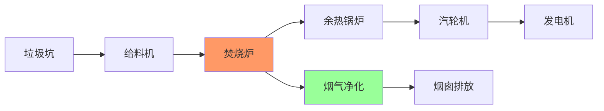

# 实时垃圾焚烧发电监控案例研究

> 所属阶段: Knowledge/ Flink/ | 前置依赖: [算子全景分类](../01-concept-atlas/operator-deep-dive/01.06-single-input-operators.md) | [IoT流处理](../06-frontier/operator-iot-stream-processing.md) | 形式化等级: L4

## 1. 概念定义 (Definitions)

### Def-WST-01-01: 垃圾焚烧发电监控系统 (Waste-to-Energy Monitoring System)

垃圾焚烧发电监控系统是通过炉膛温度、烟气成分、蒸汽参数等传感器和流计算平台，实现焚烧过程优化、烟气净化控制、发电效率提升与环保达标排放的集成系统。

$$\mathcal{I} = (F, G, S, E, A, F_{calc})$$

其中 $F$ 为炉膛参数流，$G$ 为烟气数据流，$S$ 为蒸汽参数流，$E$ 为发电参数流，$A$ 为环保排放流，$F_{calc}$ 为流计算处理拓扑。

### Def-WST-01-02: 3T1E焚烧控制原则 (3T1E Incineration Control)

垃圾焚烧的3T1E控制原则：

- **Temperature (温度)**: 炉膛温度 $\geq 850$°C，且停留时间 $\geq 2$s
- **Turbulence (湍流)**: 烟气湍流度保证充分混合
- **Time (时间)**: 垃圾在炉排上的燃烧时间充分
- **Excess Air (过量空气)**: 过量空气系数 $\alpha = 1.6$-$2.0$

$$\text{燃烧效率} = f(T, Turbulence, t_{residence}, \alpha)$$

### Def-WST-01-03: 二噁英当量 (Toxic Equivalent Quantity, TEQ)

二噁英类物质的毒性以TCDD当量表示：

$$TEQ = \sum_{i} C_i \cdot TEF_i$$

其中 $C_i$ 为第 $i$ 种二噁英同类物的浓度，$TEF_i$ 为其毒性当量因子。国标排放限值：$TEQ \leq 0.1$ ng/Nm³。

### Def-WST-01-04: 锅炉热效率 (Boiler Thermal Efficiency)

锅炉热效率定义为蒸汽吸收的热量与垃圾燃烧释放的总热量之比：

$$\eta_{boiler} = \frac{Q_{steam}}{Q_{fuel}} = \frac{m_{steam} \cdot (h_{steam} - h_{feedwater})}{m_{waste} \cdot LHV}$$

其中 $LHV$ 为垃圾低位热值（通常1200-1800 kcal/kg），$h$ 为比焓。典型值：$\eta_{boiler} = 75\%$-$85\%$。

### Def-WST-01-05: 吨垃圾发电量 (Power Generation per Ton of Waste)

吨垃圾发电量反映焚烧发电厂的经济性：

$$E_{specific} = \frac{W_{gross}}{M_{waste}} \quad [kWh/ton]$$

其中 $W_{gross}$ 为总发电量，$M_{waste}$ 为焚烧垃圾量。国内先进水平：$E_{specific} \geq 400$ kWh/ton。

## 2. 属性推导 (Properties)

### Lemma-WST-01-01: 炉膛温度对二噁英分解的影响

二噁英在高温下的分解速率遵循Arrhenius方程：

$$k_{decompose} = A \cdot e^{-E_a/(RT)}$$

其中 $E_a \approx 250$ kJ/mol。当 $T \geq 850$°C时，$k_{decompose}$ 足够大，99.99%以上的二噁英在2秒内分解。

### Lemma-WST-01-02: 垃圾热值波动的发电影响

垃圾热值波动 $\Delta LHV$ 对蒸汽产量的影响：

$$\Delta D = D_{base} \cdot \frac{\Delta LHV}{LHV_{base}}$$

其中 $D$ 为蒸汽产量。热值波动±20%可导致蒸汽产量波动±20%，严重影响汽轮机稳定运行。

### Prop-WST-01-01: 烟气再循环的NOx减排效果

烟气再循环（将部分烟气回流至炉膛）可降低NOx排放：

$$\Delta NOx \approx -20\% \text{ to } -30\%$$

**论证**: 再循环烟气降低炉膛局部高温区氧浓度，抑制热力型NOx生成（Zeldovich机制）。

### Prop-WST-01-02: 活性炭喷射对二噁英的吸附效率

活性炭喷射对烟气中二噁英的吸附效率：

$$\eta_{adsorption} = 1 - e^{-k \cdot C_{AC} \cdot t_{contact}}$$

其中 $C_{AC}$ 为活性炭浓度，$t_{contact}$ 为接触时间。典型值：$\eta_{adsorption} \geq 95\%$。

## 3. 关系建立 (Relations)

### 与算子体系的映射

| 垃圾焚烧场景 | Flink算子 | 算子作用 |
|------------|-----------|---------|
| DCS数据接入 | `SourceFunction` | 从DCS系统接入炉膛/烟气数据 |
| 温度控制 | `KeyedProcessFunction` | 按炉膛分区键控控制 |
| 排放监控 | `WindowAggregate` | 滑动窗口内排放均值计算 |
| 环保预警 | `CEPPattern` | 排放超标模式匹配 |
| 效率优化 | `BroadcastStream` | 优化参数广播到控制系统 |

## 4. 论证过程 (Argumentation)

### 4.1 垃圾焚烧监控的核心挑战

**挑战1: 垃圾成分高度不稳定**
城市生活垃圾热值、含水率、成分日变化大，导致炉膛温度波动剧烈，需频繁调整燃烧参数。

**挑战2: 环保排放的严格监管**
二噁英、SO₂、NOx、HCl、粉尘等指标需连续监测，小时均值和日均值均需达标。超标可能面临停产整顿。

**挑战3: 设备腐蚀严重**
烟气中含HCl和SO₂，对余热锅炉尾部受热面造成高温腐蚀；飞灰中的碱金属加速结焦。

## 5. 形式证明 / 工程论证 (Proof / Engineering Argument)

### Thm-WST-01-01: 炉膛温度稳定控制定理

在垃圾热值波动 $\Delta LHV$ 的条件下，维持炉膛温度稳定的充分条件：

$$\Delta F_{primary} \geq \frac{\Delta LHV \cdot M_{waste}}{LHV_{base} \cdot \tau_{response}}$$

其中 $F_{primary}$ 为一次风量，$\tau_{response}$ 为控制系统响应时间。

**工程意义**: 快速响应的一次风控制系统可在热值突变时维持炉温稳定。

## 6. 实例验证 (Examples)

### 6.1 炉膛温度实时监控

```java
// Furnace temperature monitoring and control
StreamExecutionEnvironment env = StreamExecutionEnvironment.getExecutionEnvironment();

DataStream<TemperatureReading> tempStream = env
    .addSource(new DcsSource("furnace.temperature"))
    .map(new TempParser());

DataStream<AirflowCommand> airflowCommands = tempStream
    .keyBy(t -> t.getZoneId())
    .process(new TemperatureControlFunction() {
        private static final double T_TARGET = 950;
        private static final double T_MIN = 850;

        @Override
        public void processElement(TemperatureReading reading, Context ctx,
                                   Collector<AirflowCommand> out) {
            double temp = reading.getTemperature();
            double error = T_TARGET - temp;

            if (temp < T_MIN) {
                out.collect(new AirflowCommand(reading.getZoneId(),
                    "INCREASE_PRIMARY", 20, "TEMPERATURE_LOW"));
            } else if (Math.abs(error) > 30) {
                double adjustment = error * 0.5;
                out.collect(new AirflowCommand(reading.getZoneId(),
                    "ADJUST_PRIMARY", adjustment, "TEMPERATURE_CONTROL"));
            }
        }
    });

airflowCommands.addSink(new DcsSink());
```

### 6.2 排放达标监控

```java
// Emission compliance monitoring
DataStream<EmissionData> emissions = env
    .addSource(new CemsSource("stack.emission"));

DataStream<ComplianceAlert> alerts = emissions
    .keyBy(e -> e.getStackId())
    .window(SlidingEventTimeWindows.of(Time.hours(1), Time.minutes(5)))
    .aggregate(new HourlyEmissionAggregation())
    .filter(agg -> agg.getDioxinTEQ() > 0.1 || agg.getNox() > 300)
    .map(agg -> new ComplianceAlert(
        agg.getStackId(), agg.getDioxinTEQ(), agg.getNox(),
        System.currentTimeMillis()
    ));

alerts.addSink(new RegulatorySink());
```

## 7. 可视化 (Visualizations)

### 图1: 垃圾焚烧工艺流程



## 8. 引用参考 (References)
